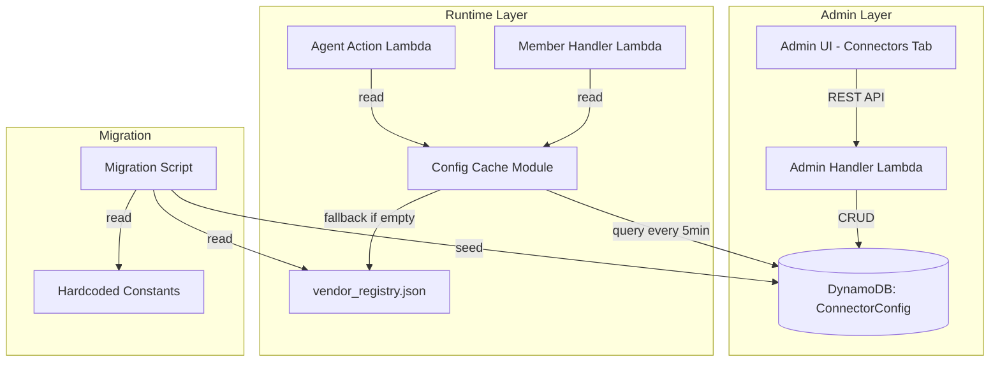

# Design Document: Admin Connector Configuration

## Overview

This feature replaces all hardcoded connector attributes (icons, auth types, sync fields, tips locations, invoice fields, cache schemas, supported operations, display names, staleness thresholds, and cost estimation rates) with a dynamic, admin-managed configuration layer backed by DynamoDB.

The system introduces:
1. A new DynamoDB table (`ConnectorConfig`) as the single source of truth for provider metadata
2. A CRUD API on the Admin Handler for managing connector configurations
3. A new "Connectors" tab in the admin UI for visual management
4. A shared runtime configuration reader with 5-minute in-memory caching across Lambda functions
5. A one-time migration script to seed existing hardcoded values into DynamoDB
6. Comprehensive server-side validation preventing invalid configs from being persisted
7. A backward-compatibility fallback that reads `vendor_registry.json` when the store is empty
8. A duplication workflow for rapidly onboarding similar providers

After deployment, adding a new cloud or AI vendor connector becomes a zero-code operation — admins configure the provider through the UI and all runtime Lambdas automatically pick up the new configuration within 5 minutes.

## Architecture



### Key Architecture Decisions

1. **Dedicated DynamoDB table** rather than partitioning within an existing table — keeps IAM policies clear and avoids noisy-neighbor issues on scans.
2. **In-memory cache with 5-minute TTL** rather than ElastiCache — Lambda functions are short-lived, and the connector config is small (< 10 KB total). Adding ElastiCache would introduce VPC requirements and cost overhead for no meaningful gain.
3. **Fallback to static JSON** during transition — ensures zero downtime during migration. The fallback is removed once all providers are confirmed in DynamoDB.
4. **Server-side validation + client-side validation** — defense in depth. The UI provides immediate feedback while the API is the authoritative gate.
5. **Scan-based loading** for the cache — the ConnectorConfig table will contain < 20 records. A scan is cheaper and simpler than managing GSIs for this cardinality.

## Components and Interfaces

### 1. Admin CRUD API (Admin Handler Lambda)

New routes added to `admin-handler/lambda_function.py`:

| Method | Path | Handler | Description |
|--------|------|---------|-------------|
| GET | `/admin/connectors` | `handle_get_connectors` | List all configs |
| GET | `/admin/connectors/{provider_key}` | `handle_get_connector` | Get single config |
| POST | `/admin/connectors` | `handle_create_connector` | Create new config |
| PUT | `/admin/connectors/{provider_key}` | `handle_update_connector` | Update existing |
| DELETE | `/admin/connectors/{provider_key}` | `handle_delete_connector` | Remove config |

All routes require admin JWT authentication (existing `validate_token` mechanism).

**Validation Module** (`connector_validator.py`):
```python
def validate_connector_config(body: dict, is_update: bool = False) -> list[str]:
    """Validate a connector config body. Returns list of error messages (empty = valid)."""
```

### 2. Config Cache Module (`connector_config_cache.py`)

A shared module (deployable to both `member-handler/` and `agent-action/`) providing:

```python
# Public API
def get_connector(provider_key: str) -> dict | None:
    """Get a single connector config by key. Returns None if not found."""

def get_all_connectors() -> dict[str, dict]:
    """Get all connector configs as {provider_key: config}."""

def is_fallback_active() -> bool:
    """Returns True if serving from static file fallback."""

# Internal
_CACHE_TTL_SECONDS = 300
_cache: dict = {}
_cache_loaded_at: float = 0.0
_fallback_active: bool = False
```

### 3. Admin UI - Connectors Tab

New tab added to `admin/index.html` and logic in `admin/admin.js`:
- Connectors listing table with columns: Provider Key, Display Name, Auth Type, Cloud, Staleness (hrs)
- Add/Edit modal form with all Connector_Config fields
- Delete confirmation dialog
- Duplicate button that pre-fills the Add form
- Client-side validation matching server-side rules

### 4. Migration Script (`scripts/migrate_connector_config.py`)

A standalone Python script that:
1. Reads `vendor_registry.json`
2. Reads hardcoded constants from `provider_invoices.py` and `invoice_drilldown.py`
3. Composes complete `Connector_Config` records
4. Writes to DynamoDB (skip-if-exists semantics)

### 5. Infrastructure (CloudFormation)

New DynamoDB table resource added to the stack:
- Table name: `ConnectorConfig`
- Partition key: `providerKey` (String)
- Billing: PAY_PER_REQUEST
- IAM permissions added to Admin Handler, Member Handler, and Agent Action Lambda roles

## Data Models

### ConnectorConfig DynamoDB Table

| Attribute | Type | Description |
|-----------|------|-------------|
| `providerKey` | String (PK) | Unique lowercase identifier (e.g., "aws", "openai") |
| `displayName` | String | Human-readable name (e.g., "Amazon Web Services") |
| `iconUrl` | String | URL or path to provider logo |
| `authType` | String | One of: `iam_role`, `service_principal`, `service_account`, `api_key`, `oauth2` |
| `syncFields` | List<String> | Data fields retrieved from provider |
| `tipsRepository` | String | Location of optimization tips for this provider |
| `invoiceFields` | Map | `{issuerLabel, accountIdPattern, currencyDefault}` |
| `cacheSchema` | Map | `{pkPrefix, skFormat, fieldNames}` |
| `supportedOperations` | List<String> | Available agent tools |
| `stalenessThresholdHours` | Number | Max cache age (1–720) |
| `costEstimationRates` | Map | Per-unit pricing by model/service |
| `cloud` | String | Logical grouping ("aws", "azure", "gcp", "ai_vendor") |
| `connectorClass` | String | Python module.Class path (e.g., "aws_connector.AWSConnector") |
| `createdAt` | String | ISO 8601 timestamp, set on creation |
| `updatedAt` | String | ISO 8601 timestamp, set on every update |

### invoiceFields Sub-Schema

```json
{
  "issuerLabel": "Amazon Web Services",
  "accountIdPattern": "^\\d{12}$",
  "currencyDefault": "USD"
}
```

### cacheSchema Sub-Schema

```json
{
  "pkPrefix": "AWS",
  "skFormat": "COST#{month}",
  "fieldNames": ["totalCost", "services", "dailyCosts"]
}
```

### Validation Rules Summary

| Field | Rule |
|-------|------|
| `providerKey` | `^[a-z][a-z0-9_]{1,30}$` |
| `authType` | Enum: `iam_role`, `service_principal`, `service_account`, `api_key`, `oauth2` |
| `stalenessThresholdHours` | Integer, 1 ≤ value ≤ 720 |
| `supportedOperations` | Non-empty list of strings |
| `cacheSchema.pkPrefix` | Non-empty, uppercase only (`^[A-Z][A-Z0-9_]*$`) |
| `connectorClass` | `^[a-z_]+\.[A-Za-z]+$` |

## Correctness Properties

*A property is a characteristic or behavior that should hold true across all valid executions of a system — essentially, a formal statement about what the system should do. Properties serve as the bridge between human-readable specifications and machine-verifiable correctness guarantees.*

### Property 1: CRUD Round-Trip Consistency

*For any* valid Connector_Config, creating it via POST then retrieving it via GET should return a record with all the same user-supplied field values. Updating it via PUT with new valid values then retrieving via GET should reflect the updates. Deleting it via DELETE then retrieving via GET should return 404.

**Validates: Requirements 1.1, 1.2, 1.3, 1.4, 1.5**

### Property 2: Authentication Enforcement on Connector Routes

*For any* connector API route (GET, POST, PUT, DELETE on `/admin/connectors`) and *for any* request that has a missing, malformed, or expired JWT token, the endpoint should return a 401 status code.

**Validates: Requirements 1.6**

### Property 3: Validation Rejects Invalid Configs and Reports All Errors

*For any* Connector_Config where at least one field violates its validation rule (providerKey not matching regex, authType not in enum, stalenessThresholdHours outside 1-720, empty supportedOperations, non-uppercase cacheSchema.pkPrefix, or connectorClass not matching pattern), the Admin_Handler should return 400 with an errors list containing a message for every violated rule — without short-circuiting on the first failure.

**Validates: Requirements 6.1, 6.2, 6.3, 6.4, 6.5, 6.6, 6.7, 1.7**

### Property 4: Cache TTL Freshness

*For any* set of Connector_Config records loaded into the cache, requests made within 300 seconds of the last load should return data without querying DynamoDB again. After 300 seconds elapse, the next request should trigger a fresh DynamoDB scan and return updated data.

**Validates: Requirements 4.3, 4.4**

### Property 5: Cache Resilience Under Store Failure

*For any* previously cached set of Connector_Config records, if the Connector_Config_Store becomes unreachable (DynamoDB error), the cache should continue returning the last successfully loaded configurations rather than raising an error.

**Validates: Requirements 4.5**

### Property 6: Fallback to Static File When Store Is Empty

*For any* scenario where the Connector_Config_Store returns zero records, the Config_Cache should load and return configurations from the static vendor_registry.json file instead. When at least one record is subsequently loaded from the store, the fallback path should be disabled.

**Validates: Requirements 7.1, 7.2, 7.4**

### Property 7: Migration Idempotency

*For any* Provider_Key that already has a Connector_Config record in the store, running the migration script should leave that record unchanged and log a warning rather than overwriting it.

**Validates: Requirements 5.7**

### Property 8: Automatic Timestamp Management

*For any* Connector_Config creation, the returned record SHALL have `createdAt` set to the current time. *For any* subsequent update to the same record, `updatedAt` SHALL be set to the current time and SHALL be different from the previous `updatedAt` value.

**Validates: Requirements 2.14**

### Property 9: Duplication Preserves All Fields Except providerKey

*For any* existing Connector_Config, clicking duplicate should produce a form pre-populated with all field values from the source connector, with the providerKey field cleared and empty.

**Validates: Requirements 8.1, 8.2**

### Property 10: Client-Side providerKey Validation

*For any* string, the Admin_Panel client-side validation should accept the string as a valid providerKey if and only if it matches the pattern `^[a-z][a-z0-9_]{1,30}$`.

**Validates: Requirements 3.8, 6.1**

## Error Handling

### API Error Handling

| Scenario | Status | Response |
|----------|--------|----------|
| Missing/invalid JWT on any connector route | 401 | `{"error": "AuthError", "message": "Authentication required"}` |
| Expired JWT | 401 | `{"error": "AuthError", "message": "Invalid or expired token"}` |
| GET single connector that doesn't exist | 404 | `{"error": "NotFound", "message": "Connector not found"}` |
| POST with providerKey that already exists | 409 | `{"error": "ConflictError", "message": "Connector with this providerKey already exists"}` |
| POST/PUT with invalid config body | 400 | `{"error": "ValidationError", "message": "Validation failed", "errors": ["providerKey: must match...", ...]}` |
| PUT connector that doesn't exist | 404 | `{"error": "NotFound", "message": "Connector not found"}` |
| DELETE connector that doesn't exist | 404 | `{"error": "NotFound", "message": "Connector not found"}` |
| Malformed JSON body | 400 | `{"error": "InvalidRequest", "message": "Invalid request body"}` |
| DynamoDB ClientError on CRUD | 500 | `{"error": "ServerError", "message": "Internal server error"}` |

### Cache Error Handling

| Scenario | Behavior |
|----------|----------|
| DynamoDB unreachable on cache refresh | Continue serving last good cached data; log warning |
| DynamoDB returns zero records | Fall back to `vendor_registry.json`; log warning per request |
| `vendor_registry.json` also missing during fallback | Return empty config dict; log critical error |
| Cache refresh returns partial data (some records) | Serve what was returned (no mixing with fallback); log info |

### Frontend Error Handling

| Scenario | User Message | Action |
|----------|-------------|--------|
| API returns 400 (validation errors) | Display each error near relevant field | Keep form open |
| API returns 409 (duplicate key) | "A connector with this key already exists" | Keep form open, focus providerKey |
| API returns 404 on delete | "Connector not found. It may have been removed" | Refresh list |
| API returns 401 | "Session expired. Please log in again" | Redirect to login |
| Network error | "Unable to connect. Please check your connection" | Show notification |
| API returns 5xx | "Something went wrong. Please try again" | Show notification |

### Migration Script Error Handling

| Scenario | Behavior |
|----------|----------|
| `vendor_registry.json` not found | Exit with error code, log path tried |
| DynamoDB unreachable | Exit with error code, log connection details |
| Existing record found for a provider | Skip that provider, log warning, continue with next |
| Partial write failure (batch_write) | Log which providers failed, exit with non-zero code |

## Testing Strategy

### Dual Testing Approach

- **Unit tests**: Verify specific examples, edge cases, integration points
- **Property-based tests**: Verify universal properties across randomly generated inputs

### Property-Based Testing Configuration

- **Library**: [Hypothesis](https://hypothesis.readthedocs.io/) for Python (backend validation, cache, handler tests); [fast-check](https://fast-check.dev/) for JavaScript (frontend validation tests)
- **Minimum iterations**: 100 per property test
- **Each property test references its design document property**
- **Tag format**: `Feature: admin-connector-config, Property {number}: {property_text}`

### Backend Tests (Python + Hypothesis)

**Property Tests:**

| Property | Test Description | Generator Strategy |
|----------|-----------------|-------------------|
| P1 | CRUD round-trip | `@st.composite` generating valid Connector_Config dicts |
| P2 | Auth enforcement | `st.sampled_from(connector_routes)` × `st.text()` for bad tokens |
| P3 | Validation rejects invalid configs | Mutate valid configs to violate 1+ rules, verify all errors in response |
| P4 | Cache TTL freshness | Random configs + `freezegun` time manipulation |
| P5 | Cache resilience | Random configs + mocked DynamoDB raising ClientError |
| P6 | Fallback behavior | Mock empty DynamoDB scan responses |
| P7 | Migration idempotency | Pre-seed records, run migration, verify no change |
| P8 | Timestamps | Create then update with time mocking, verify createdAt stable and updatedAt changes |

**Unit Tests:**

- GET /admin/connectors with no data returns empty list (edge case)
- POST with valid config returns 201 (example, Req 1.3)
- PUT non-existent connector returns 404 (edge case)
- DELETE existing connector succeeds (example, Req 1.5)
- Migration creates records for all 6 providers (example, Req 5.1)
- Migration maps ISSUER_LABELS correctly for each provider (example, Req 5.2)
- Migration maps PROVIDER_ACCOUNT_ID_PATTERNS regex to string (example, Req 5.3)
- Migration maps cachePrefix to cacheSchema.pkPrefix (example, Req 5.4)
- Migration maps supportedTools to supportedOperations (example, Req 5.5)
- Migration maps staleness_hours to stalenessThresholdHours (example, Req 5.6)
- Fallback mode logs warning per request (example, Req 7.3)

### Frontend Tests (JavaScript + fast-check)

**Property Tests:**

| Property | Test Description | Generator Strategy |
|----------|-----------------|-------------------|
| P9 | Duplication copies all except providerKey | `fc.record()` generating random config objects |
| P10 | providerKey validation | `fc.string()` inputs tested against regex |

**Unit Tests:**

- Connectors tab renders table with correct headers (example, Req 3.1)
- Add Connector form has all 14 config fields (example, Req 3.2)
- Edit form pre-populates values and disables providerKey (example, Req 3.4)
- Delete button shows confirmation dialog (example, Req 3.6)
- Duplicate button clears providerKey and focuses field (example, Req 8.2)
- Form submission calls POST for new, PUT for edit (example, Req 3.3, 3.5)
- Validation error displayed adjacent to field (example, Req 3.7)
- supportedOperations requires at least one entry (example, Req 3.9)

### Test File Structure

```
admin-handler/
├── tests/
│   ├── test_connector_crud_properties.py      # P1, P2
│   ├── test_connector_validation_props.py     # P3
│   ├── test_connector_cache_properties.py     # P4, P5, P6
│   ├── test_connector_migration.py            # P7 + unit tests
│   ├── test_connector_handler_unit.py         # Unit tests for routes
│   ├── test_connector_timestamps.py           # P8
│   └── conftest.py                            # Shared fixtures, DynamoDB mocks
admin/
├── tests/
│   ├── connectors.property.test.js            # P9, P10
│   └── connectors.unit.test.js                # UI example tests
```

### Integration Tests

- End-to-end CRUD flow against DynamoDB Local
- Migration script execution against test data
- Verify Member Handler reads from DynamoDB after migration (with fallback disabled)
- Verify Agent Action loads connector metadata from cache instead of vendor_registry.json
