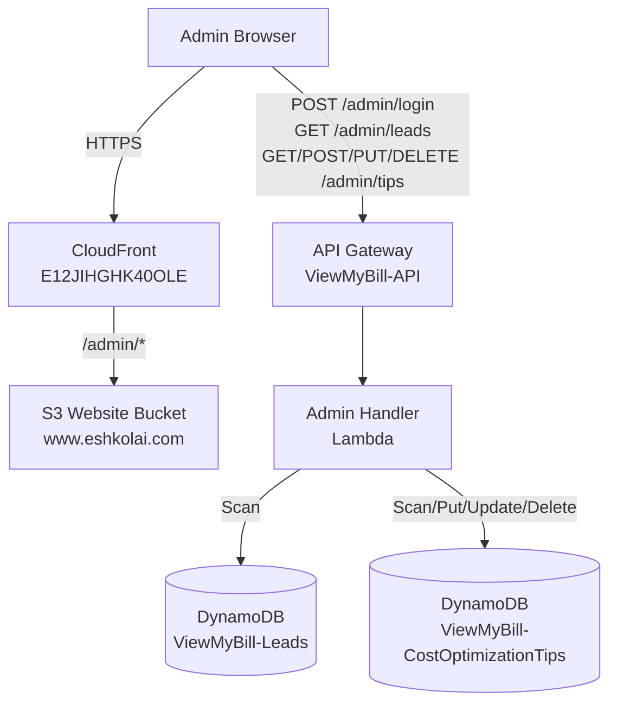
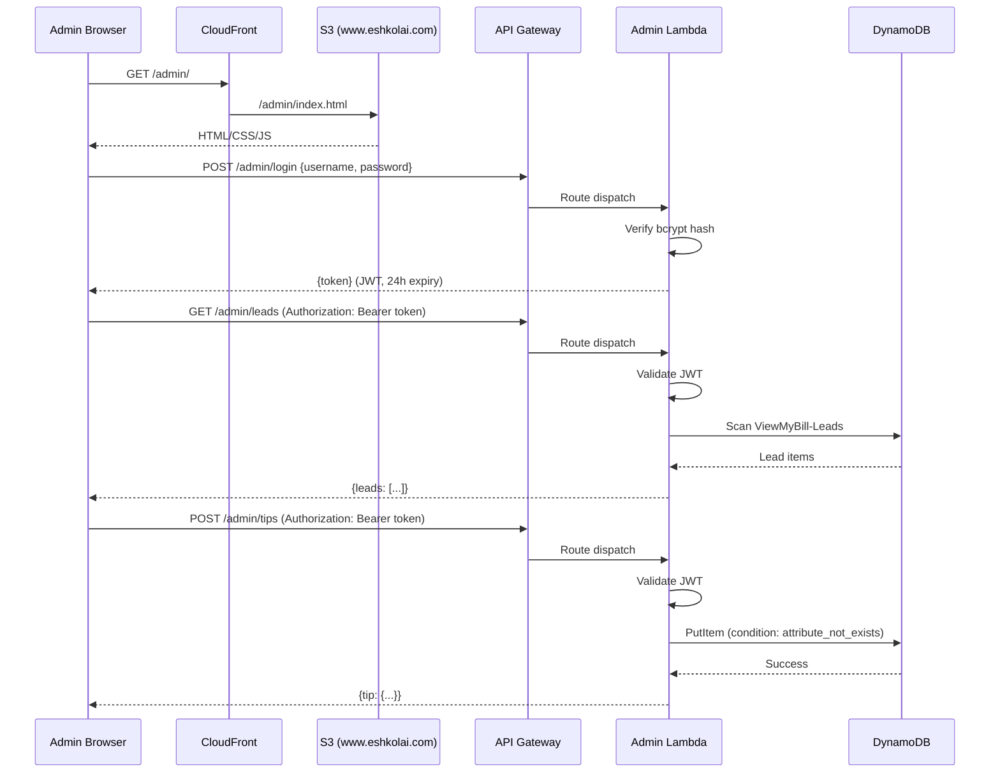

# Design Document: Admin Panel

## Overview

The Admin Panel adds a login-protected dashboard at `/admin/` on eshkolai.com for managing the "Slash My Bill" tool. It provides two main views: a leads viewer (read-only view of users who submitted bills) and a tips manager (full CRUD for cost optimization rules used by the AI bill analyzer).

### Key Design Decisions

1. **Single Lambda with route-based dispatch** — All admin API operations (login, leads, tips CRUD) are handled by one Lambda function (`aws-bill-analyzer-admin-api`). The Lambda inspects `event['routeKey']` to dispatch to the correct handler, following the same pattern as `otp-handler`. This avoids managing multiple Lambda functions for a low-traffic admin tool.
2. **JWT auth with PyJWT** — Simple stateless authentication. The JWT secret is stored as a Lambda environment variable. No Cognito or external auth provider needed for a single-admin use case.
3. **bcrypt password hash in env var** — The admin password is stored as a bcrypt hash in the Lambda's environment variables. The username is also an env var. No user table or registration flow.
4. **Vanilla HTML/CSS/JS frontend** — Matches the existing `viewMyBill/` pattern. A single-page app with login form, tab-based navigation (leads/tips), and inline forms for tip CRUD. No build step, no framework.
5. **Reuse existing API Gateway** — New routes (`/admin/*`) are added to the existing `ViewMyBill-API` HTTP API. CORS is updated to allow GET, PUT, DELETE methods in addition to existing POST/OPTIONS.
6. **Client-side filtering** — Leads and tips are fetched in full from DynamoDB (both tables are small) and filtered in the browser. No server-side pagination or search needed at this scale.
7. **sessionStorage for token** — The JWT is stored in `sessionStorage` (not `localStorage`) so it's cleared when the browser tab closes, providing better security for an admin tool.

## Architecture

### System Context Diagram



### Request Flow



## Components and Interfaces

### 1. Admin Handler Lambda (`admin-handler/lambda_function.py`)

A single Lambda function handling all admin API routes via `routeKey` dispatch.

**Routes:**

| Method | Path | Handler | Auth | Description |
|--------|------|---------|------|-------------|
| POST | /admin/login | `handle_login` | No | Authenticate and return JWT |
| GET | /admin/leads | `handle_get_leads` | JWT | Return all leads |
| GET | /admin/tips | `handle_get_tips` | JWT | Return all tips |
| POST | /admin/tips | `handle_create_tip` | JWT | Create new tip |
| PUT | /admin/tips | `handle_update_tip` | JWT | Update existing tip |
| DELETE | /admin/tips | `handle_delete_tip` | JWT | Delete a tip |

**Authentication flow:**
1. `POST /admin/login` receives `{username, password}`
2. Compare username against `ADMIN_USERNAME` env var
3. Verify password against `ADMIN_PASSWORD_HASH` env var using `bcrypt.checkpw()`
4. On success, generate JWT with `{sub: username, exp: now + 24h}` signed with `JWT_SECRET` env var
5. All other routes extract the `Authorization: Bearer <token>` header, decode with PyJWT, check expiration

**Lambda Configuration:**
- Runtime: Python 3.12
- Memory: 128 MB
- Timeout: 30 seconds
- Environment variables:
  - `ADMIN_USERNAME`: admin username
  - `ADMIN_PASSWORD_HASH`: bcrypt hash of admin password
  - `JWT_SECRET`: secret key for JWT signing
  - `LEADS_TABLE_NAME`: `ViewMyBill-Leads`
  - `TIPS_TABLE_NAME`: `ViewMyBill-CostOptimizationTips`

**Dependencies (`admin-handler/requirements.txt`):**
- `PyJWT>=2.8`
- `bcrypt>=4.0`

### 2. Admin Panel Frontend (`admin/`)

A single-page application served from `/admin/` on the S3 website bucket.

**Files:**
- `admin/index.html` — page structure (login form, dashboard with tabs)
- `admin/admin.css` — styles matching eshkolai.com theme
- `admin/admin.js` — client-side logic (auth, API calls, DOM manipulation)

**Views:**
1. **Login view** — Username/password form, error display
2. **Dashboard view** — Header with username + logout button, tab navigation
3. **Leads tab** — Search field, leads table (email, name, company, phone, fileName, timestamp)
4. **Tips tab** — Search field, tips table with edit/delete buttons, "Add Tip" button, inline modal form

**API communication:**
- All requests to protected endpoints include `Authorization: Bearer <token>` header
- On 401 response, clear sessionStorage and redirect to login view
- Loading spinners shown during API calls
- Error notifications displayed as dismissible banners

### 3. API Gateway Updates

Add new routes and integration to the existing `ViewMyBill-API`:

**New Integration:**
- `AdminIntegration` — AWS_PROXY integration pointing to the admin Lambda

**New Routes:**
- `POST /admin/login`
- `GET /admin/leads`
- `GET /admin/tips`
- `POST /admin/tips`
- `PUT /admin/tips`
- `DELETE /admin/tips`

**CORS Update:**
Add `GET`, `PUT`, `DELETE` to `AllowMethods` and `Authorization` to `AllowHeaders`:
```yaml
CorsConfiguration:
  AllowOrigins:
    - 'https://eshkolai.com'
    - 'https://www.eshkolai.com'
  AllowMethods:
    - GET
    - POST
    - PUT
    - DELETE
    - OPTIONS
  AllowHeaders:
    - Content-Type
    - X-Filename
    - Authorization
  MaxAge: 86400
```

### 4. CloudFormation Additions (`infrastructure/viewmybill-stack.yaml`)

New resources added to the existing stack:

| Resource | Type | Purpose |
|----------|------|---------|
| `AdminHandlerRole` | `AWS::IAM::Role` | IAM role with DynamoDB read (Leads) + read/write (Tips) |
| `AdminHandlerFunction` | `AWS::Lambda::Function` | Admin API Lambda |
| `AdminIntegration` | `AWS::ApiGatewayV2::Integration` | API GW → Lambda integration |
| `AdminLoginRoute` | `AWS::ApiGatewayV2::Route` | POST /admin/login |
| `AdminGetLeadsRoute` | `AWS::ApiGatewayV2::Route` | GET /admin/leads |
| `AdminGetTipsRoute` | `AWS::ApiGatewayV2::Route` | GET /admin/tips |
| `AdminCreateTipRoute` | `AWS::ApiGatewayV2::Route` | POST /admin/tips |
| `AdminUpdateTipRoute` | `AWS::ApiGatewayV2::Route` | PUT /admin/tips |
| `AdminDeleteTipRoute` | `AWS::ApiGatewayV2::Route` | DELETE /admin/tips |
| `AdminHandlerInvokePermission` | `AWS::Lambda::Permission` | Allow API GW to invoke Lambda |

New parameters:
- `AdminHandlerCodeKey` (default: `lambda-packages/admin-handler.zip`)
- `AdminUsername` (NoEcho)
- `AdminPasswordHash` (NoEcho)
- `JWTSecret` (NoEcho)

### 5. GitHub Actions Updates (`.github/workflows/deploy.yml`)

Add to the deploy workflow:
1. **Trigger paths**: Add `admin-handler/**` and `admin/**` to the `paths` filter
2. **Package Admin Handler Lambda**: Install `PyJWT` and `bcrypt` into a build directory, zip with `lambda_function.py`, upload to S3
3. **Update Admin Lambda code**: `aws lambda update-function-code` for the admin handler
4. **Deploy Admin frontend**: Sync `admin/` directory to `s3://www.eshkolai.com/admin/`

## Data Models

### API Request/Response Models

**POST /admin/login**
```
Request:  { "username": string, "password": string }
Response: { "token": string, "username": string }
Error:    { "error": string, "message": string, "code": number }
```

**GET /admin/leads**
```
Headers:  Authorization: Bearer <token>
Response: { "leads": [ { "email": string, "timestamp": string, "name": string, "company": string, "phone": string, "fileName": string, "fileSize": number, "sessionId": string } ] }
```

**GET /admin/tips**
```
Headers:  Authorization: Bearer <token>
Response: { "tips": [ { "service": string, "tipId": string, "category": string, "title": string, "description": string, "estimatedSavings": string, "difficulty": string } ] }
```

**POST /admin/tips**
```
Headers:  Authorization: Bearer <token>
Request:  { "service": string, "tipId": string, "category": string, "title": string, "description": string, "estimatedSavings": string, "difficulty": string }
Response: { "tip": { ...same fields... }, "message": "Tip created successfully" }
Error 409: { "error": "ConflictError", "message": "A tip with this service and tipId already exists" }
```

**PUT /admin/tips**
```
Headers:  Authorization: Bearer <token>
Request:  { "service": string, "tipId": string, "category": string, "title": string, "description": string, "estimatedSavings": string, "difficulty": string }
Response: { "tip": { ...same fields... }, "message": "Tip updated successfully" }
```

**DELETE /admin/tips**
```
Headers:  Authorization: Bearer <token>
Request:  { "service": string, "tipId": string }
Response: { "message": "Tip deleted successfully" }
Error 404: { "error": "NotFound", "message": "Tip not found" }
```

### DynamoDB Access Patterns

**ViewMyBill-Leads (read-only):**
- `Scan` — Return all items, sorted client-side by timestamp descending

**ViewMyBill-CostOptimizationTips (read/write):**
- `Scan` — Return all tips for the tips view
- `PutItem` with `ConditionExpression: attribute_not_exists(service) AND attribute_not_exists(tipId)` — Create new tip (prevents overwrite)
- `PutItem` (unconditional) — Update existing tip
- `DeleteItem` with `ConditionExpression: attribute_exists(service)` — Delete tip (returns 404 if not found)

### JWT Token Structure

```json
{
  "sub": "admin_username",
  "iat": 1700000000,
  "exp": 1700086400
}
```

Signed with HS256 using the `JWT_SECRET` environment variable.


## Correctness Properties

*A property is a characteristic or behavior that should hold true across all valid executions of a system — essentially, a formal statement about what the system should do. Properties serve as the bridge between human-readable specifications and machine-verifiable correctness guarantees.*

### Property 1: JWT token structure and expiration

*For any* valid username and password that match the stored credentials, calling the login endpoint should return a JWT token that, when decoded, contains a `sub` field equal to the username, an `iat` field, and an `exp` field equal to `iat + 86400` (24 hours).

**Validates: Requirements 1.2**

### Property 2: Invalid credentials rejection

*For any* username/password pair where either the username does not match the stored admin username or the password does not match the stored hash, the login endpoint should return a 401 status code with an error message.

**Validates: Requirements 1.3**

### Property 3: Protected endpoint auth enforcement

*For any* protected endpoint (GET /admin/leads, GET /admin/tips, POST /admin/tips, PUT /admin/tips, DELETE /admin/tips) and *for any* request that has a missing, malformed, or expired JWT token, the endpoint should return a 401 status code.

**Validates: Requirements 1.4, 1.5, 2.5, 3.5, 4.7, 5.6, 6.5**

### Property 4: Leads sorted by timestamp descending

*For any* set of leads returned by the GET /admin/leads endpoint, for every consecutive pair of leads in the response array, the timestamp of the earlier element should be greater than or equal to the timestamp of the later element.

**Validates: Requirements 2.3**

### Property 5: Leads search filter correctness

*For any* search string and *for any* set of leads, the client-side filter function should return only leads where the email, name, or company field contains the search string (case-insensitive), and should include all such matching leads.

**Validates: Requirements 2.6**

### Property 6: Tips grouped by service

*For any* set of tips returned by the GET /admin/tips endpoint, tips with the same service value should appear consecutively in the response array (i.e., the array is grouped by service).

**Validates: Requirements 3.3**

### Property 7: Tips search filter correctness

*For any* search string and *for any* set of tips, the client-side filter function should return only tips where the service, title, or category field contains the search string (case-insensitive), and should include all such matching tips.

**Validates: Requirements 3.6**

### Property 8: Tip form validation rejects empty fields

*For any* tip form submission where at least one of the required fields (service, tipId, category, title, description, estimatedSavings, difficulty) is empty or whitespace-only, the form validation should reject the submission.

**Validates: Requirements 4.2, 5.2**

### Property 9: Tip creation round-trip

*For any* valid tip object (all fields non-empty, unique service+tipId), after calling POST /admin/tips, calling GET /admin/tips should return a tips list that contains a tip with all the same field values as the submitted tip.

**Validates: Requirements 4.4**

### Property 10: Duplicate tip conflict detection

*For any* tip that already exists in the Tips_Table, attempting to create another tip with the same service and tipId via POST /admin/tips should return a 409 status code.

**Validates: Requirements 4.5**

### Property 11: Tip update round-trip

*For any* existing tip and *for any* valid set of updated field values (keeping service and tipId unchanged), after calling PUT /admin/tips with the updated values, calling GET /admin/tips should return a tip with the updated field values.

**Validates: Requirements 5.3**

### Property 12: Tip deletion removes from table

*For any* existing tip, after calling DELETE /admin/tips with that tip's service and tipId, calling GET /admin/tips should return a tips list that does not contain a tip with that service and tipId.

**Validates: Requirements 6.2**

### Property 13: Delete non-existent tip returns 404

*For any* service and tipId combination that does not exist in the Tips_Table, calling DELETE /admin/tips should return a 404 status code.

**Validates: Requirements 6.4**

## Error Handling

### Frontend Error Handling

| Scenario | User Message | Action |
|----------|-------------|--------|
| Invalid login credentials | "Invalid username or password" | Clear password field, keep username |
| Empty login fields | "Please enter username and password" | Highlight empty fields |
| Token expired during session | "Session expired. Please log in again" | Clear sessionStorage, show login form |
| Network error on any API call | "Unable to connect. Please check your connection" | Show error notification |
| API returns 401 on protected route | "Session expired. Please log in again" | Redirect to login |
| API returns 409 on tip create | "A tip with this service and ID already exists" | Keep form open with values |
| API returns 404 on tip delete | "Tip not found. It may have been already deleted" | Refresh tips list |
| API returns 5xx | "Something went wrong. Please try again" | Show error notification with retry |
| Tip form validation failure | "All fields are required" | Highlight empty fields |

### Backend Error Handling

**Admin Handler Lambda:**
- Missing/malformed request body → 400 with descriptive message
- Invalid JWT → 401 "Invalid or expired token"
- Missing Authorization header → 401 "Authentication required"
- DynamoDB ConditionalCheckFailedException on create → 409 "Tip already exists"
- DynamoDB ConditionalCheckFailedException on delete → 404 "Tip not found"
- DynamoDB ClientError → 500 "Internal server error"
- Unexpected exception → 500 with generic message, log full error to CloudWatch

### Error Response Format

All error responses follow the same structure used by existing Lambdas:
```json
{
  "error": "ErrorType",
  "message": "Human-readable message",
  "code": 401
}
```

## Testing Strategy

### Dual Testing Approach

This feature requires both unit tests and property-based tests:

- **Unit tests**: Verify specific examples, edge cases, integration points, and UI behavior
- **Property-based tests**: Verify universal properties across randomly generated inputs

### Property-Based Testing Configuration

- **Library**: [Hypothesis](https://hypothesis.readthedocs.io/) for Python (backend Lambda tests), [fast-check](https://fast-check.dev/) for JavaScript (frontend filter/validation tests)
- **Minimum iterations**: 100 per property test
- **Each property test must reference its design document property**
- **Tag format**: `Feature: admin-panel, Property {number}: {property_text}`
- **Each correctness property is implemented by a single property-based test**

### Backend Tests (Python + Hypothesis)

**Property Tests:**

| Property | Test Description | Generator Strategy |
|----------|-----------------|-------------------|
| P1 | JWT structure and expiration | `st.text(min_size=1)` for username/password |
| P2 | Invalid credentials rejection | `st.text()` for random wrong credentials |
| P3 | Auth enforcement on protected endpoints | `st.sampled_from(protected_routes)` × `st.text()` for bad tokens |
| P4 | Leads sorted by timestamp | Custom strategy generating lead lists with random timestamps |
| P6 | Tips grouped by service | Custom strategy generating tip lists with random services |
| P9 | Tip creation round-trip | Custom strategy generating valid tip objects |
| P10 | Duplicate tip conflict | Custom strategy generating tip objects, create twice |
| P11 | Tip update round-trip | Custom strategy generating tip + updated fields |
| P12 | Tip deletion removes | Custom strategy generating tip objects |
| P13 | Delete non-existent tip | `st.text(min_size=1)` for random service/tipId |

**Unit Tests:**

- Login with correct credentials returns 200 + token (example, Req 1.2)
- Login with wrong password returns 401 (example, Req 1.3)
- GET /admin/leads with no data returns empty array (edge case, Req 2.4)
- GET /admin/tips with no data returns empty array (edge case, Req 3.4)
- Create tip with all valid fields succeeds (example, Req 4.4)
- Update tip preserves service/tipId (example, Req 5.3)
- Delete tip that exists succeeds (example, Req 6.2)
- Unknown route returns 404 (edge case)
- Malformed JSON body returns 400 (edge case)

### Frontend Tests (JavaScript + fast-check)

**Property Tests:**

| Property | Test Description | Generator Strategy |
|----------|-----------------|-------------------|
| P5 | Leads search filter | `fc.string()` for query × `fc.array(fc.record({email, name, company}))` |
| P7 | Tips search filter | `fc.string()` for query × `fc.array(fc.record({service, title, category}))` |
| P8 | Tip form validation | `fc.record()` with some fields as `fc.constant('')` |

**Unit Tests:**

- Login form renders with username and password fields (example, Req 1.1)
- Successful login stores token in sessionStorage (example, Req 1.7)
- Logout clears sessionStorage (example, Req 1.8)
- Leads table renders all required columns (example, Req 2.2)
- Tips table renders all required columns (example, Req 3.2)
- Add Tip form has difficulty dropdown with easy/medium/hard (example, Req 4.3)
- Edit form has service/tipId fields disabled (example, Req 5.4)
- Delete shows confirmation dialog (example, Req 6.1)
- Tab navigation switches between leads and tips views (example, Req 8.2)
- Loading indicator shown during API calls (example, Req 8.5)
- Error notification displayed on API failure (example, Req 8.6)

### Test File Structure

```
admin-handler/
├── tests/
│   ├── test_auth_properties.py       # P1, P2, P3
│   ├── test_leads_properties.py      # P4
│   ├── test_tips_properties.py       # P6, P9, P10, P11, P12, P13
│   ├── test_handler_unit.py          # Unit tests for all routes
│   └── conftest.py                   # Shared fixtures, DynamoDB mocks
admin/
├── tests/
│   ├── admin.property.test.js        # P5, P7, P8
│   └── admin.unit.test.js            # UI examples, interaction tests
```
