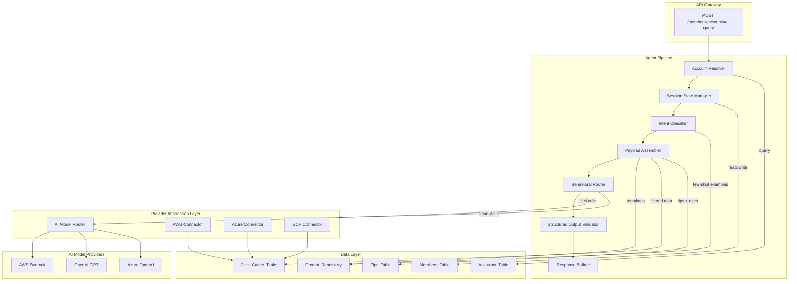

# Design Document: Agent Optimization

## Overview

This design specifies the reorganization and optimization of the SlashMyBill AI agent (`handle_ai_query` in `member-handler/lambda_function.py`) into a modular, token-efficient, multi-cloud architecture. The current implementation is a monolithic function with hardcoded prompts, keyword-based intent classification, and no session state. The redesign decomposes the agent into discrete pipeline stages: account resolution → session state → intent classification → payload assembly → behavioral execution → structured output → final response.

Key design goals:
- **Modularity**: Each pipeline stage is an independent module with clear interfaces
- **Token efficiency**: Context budget management with progressive summarization prevents cost overruns
- **Reliability**: Deterministic JSON mode for internal state passing, retry logic, and graceful degradation
- **Security**: Delimiter-based prompt injection defense with sanitization and monitoring
- **Extensibility**: Externalized prompt templates, multi-cloud provider abstraction, and versioned configurations
- **Performance**: Local DB first strategy with cache-through write-back minimizes external API latency

The target runtime remains AWS Lambda (Python 3.12) with AWS Bedrock as the primary LLM provider, extended via the AI Model Router to support OpenAI GPT and Azure OpenAI.

## Architecture



### Pipeline Flow

1. **Account Resolver**: Validates account ID format (AWS/Azure/GCP), resolves account metadata from DynamoDB, loads supported services from Tips_Table
2. **Session State Manager**: Loads or initializes per-user-account session; carries forward applicable parameters on follow-up questions
3. **Intent Classifier**: Classifies intent using keyword matching enhanced with LLM few-shot disambiguation for ambiguous queries; outputs structured JSON
4. **Payload Assembler**: Loads versioned prompt template, hydrates placeholders, enforces context budget with progressive truncation
5. **Behavioral Router**: Executes the appropriate data-gathering strategy (local DB first, then external APIs via Provider Abstraction Layer)
6. **Structured Output Validator**: Validates all internal JSON outputs against schemas; retries on malformed output
7. **Response Builder**: Assembles the final user-facing response with chart data, tips, and follow-up topics

## Components and Interfaces

### 1. Account Resolver (`account_resolver.py`)

```python
@dataclass
class AccountContext:
    account_id: str
    account_name: str
    cloud_provider: str  # 'aws' | 'azure' | 'gcp'
    member_email: str
    supported_services: list[str]
    provider_config: dict

def resolve_account(account_id: str, member_email: str) -> AccountContext:
    """Validate account ID format, query Accounts table, load service catalog."""
    ...

def validate_account_format(account_id: str) -> str:
    """Return provider type or raise ValueError for invalid format.
    AWS: 12 digits, Azure: UUID, GCP: project-id pattern."""
    ...
```

### 2. Session State Manager (`session_state.py`)

```python
@dataclass
class SessionState:
    account_context: AccountContext | None
    current_intent: str | None
    target_scope: str | None
    active_timeframe: str | None
    conversation_history: list[dict]  # last N turns
    last_updated: str

def load_session(member_email: str, account_id: str) -> SessionState:
    """Load session from DynamoDB or initialize new session."""
    ...

def update_session(session: SessionState, intent_result: dict) -> SessionState:
    """Carry forward applicable parameters from classification result."""
    ...

def reset_session(member_email: str, account_id: str) -> SessionState:
    """Clear session state on account change or explicit reset."""
    ...
```

### 3. Intent Classifier (`intent_classifier_v2.py`)

```python
@dataclass
class ClassificationResult:
    intent_type: str  # 'Cost_Analysis_General' | 'Cost_Analysis_Specific' | 'Optimization_Tips' | 'Forecasting'
    target_scope: str  # service name or 'account-wide'
    timeframe: str  # 'last-30d' | 'last-7d' | 'last-90d' | '2024-01' | 'next-3m' | etc.
    confidence_score: float  # 0.0 - 1.0

CLASSIFICATION_SCHEMA = {
    "type": "object",
    "required": ["intent_type", "target_scope", "timeframe", "confidence_score"],
    "properties": {
        "intent_type": {"type": "string", "enum": ["Cost_Analysis_General", "Cost_Analysis_Specific", "Optimization_Tips", "Forecasting"]},
        "target_scope": {"type": "string"},
        "timeframe": {"type": "string"},
        "confidence_score": {"type": "number", "minimum": 0, "maximum": 1}
    }
}

def classify_intent(question: str, session: SessionState, few_shot_examples: list[dict]) -> ClassificationResult:
    """Classify using keyword matching first; fall back to LLM few-shot on ambiguity.
    Uses stop tokens to prevent over-generation in triage phase."""
    ...
```

### 4. Payload Assembler (`payload_assembler.py`)

```python
@dataclass
class ContextBudget:
    system_prefix_tokens: int  # fixed, cacheable
    dynamic_data_tokens: int   # variable, truncatable
    user_query_tokens: int     # preserved in full
    total_ceiling: int         # max tokens for entire payload

@dataclass
class ExecutionPayload:
    system_prefix: str         # [CONTEXT] section - static
    available_metadata: str    # [AVAILABLE META-DATA] section - dynamic
    user_query: str            # [USER QUERY] section - preserved
    template_version: str
    token_distribution: dict   # actual token counts per section

def assemble_payload(
    template_name: str,
    account_context: AccountContext,
    gathered_data: dict,
    user_question: str,
    budget: ContextBudget,
) -> ExecutionPayload:
    """Load template, hydrate placeholders, enforce budget with progressive summarization."""
    ...

def truncate_to_budget(data: dict, max_tokens: int) -> str:
    """Progressive truncation: top-N arrays first, then paragraph summaries."""
    ...
```

### 5. Behavioral Router (`behavioral_router.py`)

```python
def execute_cost_analysis_general(account_context: AccountContext, session: SessionState) -> dict:
    """Query Cost_Cache_Table first, fall back to Cost Explorer API on miss."""
    ...

def execute_cost_analysis_specific(account_context: AccountContext, target_service: str) -> dict:
    """Cross-reference Tips_Table for service, execute granular tool calls."""
    ...

def execute_optimization_tips(account_context: AccountContext, target_service: str) -> dict:
    """Sequential tip scan with fault-tolerant aggregation."""
    ...

def execute_forecasting(account_context: AccountContext, timeframe: str, scenario: dict | None) -> dict:
    """Validate projection bounds, pull historical data, run Forecast_Engine."""
    ...
```

### 6. Prompt Repository (`prompt_repository.py`)

```python
@dataclass
class PromptTemplate:
    template_id: str
    version: str
    content: str
    last_modified: str

def load_template(template_name: str) -> PromptTemplate:
    """Load versioned template from S3 prompt repository bucket."""
    ...

def hydrate_template(template: PromptTemplate, variables: dict) -> str:
    """Replace placeholders with runtime values. Apply delimiter wrapping to user input."""
    ...
```

### 7. Prompt Injection Defense (`prompt_defense.py`)

```python
DELIMITER_START = "<<<USER_INPUT>>>"
DELIMITER_END = "<<<END_USER_INPUT>>>"

def sanitize_user_input(raw_input: str) -> str:
    """Escape delimiter sequences in user text, wrap with boundaries."""
    ...

def detect_injection_patterns(raw_input: str) -> list[str]:
    """Identify suspicious patterns; log for security monitoring. Returns list of detected patterns."""
    ...
```

### 8. AI Model Router (`ai_model_router.py`)

```python
@dataclass
class ModelConfig:
    provider: str  # 'bedrock' | 'openai' | 'azure-openai'
    model_id: str
    region: str | None
    api_key_secret_arn: str | None
    max_tokens: int
    temperature: float

def get_model_config(member_email: str) -> ModelConfig:
    """Resolve model config: tenant override > global default."""
    ...

def invoke_model(config: ModelConfig, payload: ExecutionPayload) -> str:
    """Unified invocation interface across all supported providers."""
    ...
```

### 9. Forecast Engine (`forecast_engine.py`)

```python
@dataclass
class ForecastResult:
    projections: list[dict]  # [{date, projected_cost, ci_80_low, ci_80_high, ci_95_low, ci_95_high}]
    seasonal_patterns: dict | None
    anomalies_excluded: list[dict]
    scenario_impact: float | None  # incremental cost from what-if

def generate_forecast(
    historical_data: list[dict],
    projection_months: int,
    scenario: dict | None = None,
) -> ForecastResult:
    """Linear extrapolation + seasonal decomposition + anomaly filtering."""
    ...

def detect_anomalies(daily_costs: list[dict], std_threshold: float = 2.0) -> list[dict]:
    """Identify one-time spikes exceeding threshold from rolling mean."""
    ...

def apply_what_if_scenario(baseline: ForecastResult, scenario: dict, pricing_data: dict) -> ForecastResult:
    """Calculate incremental cost from scenario parameters."""
    ...
```

### 10. Context Budget Manager (`context_budget.py`)

```python
def estimate_tokens(text: str) -> int:
    """Approximate token count (chars / 4 heuristic for English text)."""
    ...

def allocate_budget(model_config: ModelConfig) -> ContextBudget:
    """Partition total context window into system/data/query sections."""
    ...

def apply_progressive_summarization(data_text: str, max_tokens: int) -> str:
    """Stage 1: truncate arrays to top-N. Stage 2: summarize sections to paragraphs."""
    ...
```

### 11. Tips Table Enrichment (`tips_enrichment.py`)

```python
@dataclass
class EnrichedTip:
    tip_id: str
    service: str
    api_endpoint: str
    parameter_schema: dict
    response_format: dict
    cost_thresholds: dict
    optimization_rules: list[dict]
    last_enriched: str

def enrich_tips_table() -> dict:
    """Periodic enrichment process: populate API mappings, schemas, rules."""
    ...

def get_enriched_tip(service: str, tip_id: str) -> EnrichedTip | None:
    """Query pre-enriched tip with runtime metadata."""
    ...
```

## Data Models

### Session State (DynamoDB - Members Table attribute)

```json
{
  "email": "user@example.com",
  "agentSession": {
    "accountId": "123456789012",
    "currentIntent": "Cost_Analysis_Specific",
    "targetScope": "ec2",
    "activeTimeframe": "last-30d",
    "conversationHistory": [
      {"role": "user", "content": "How much am I spending on EC2?", "ts": "2024-01-15T10:00:00Z"},
      {"role": "assistant", "content": "Your EC2 spend last month...", "ts": "2024-01-15T10:00:02Z"}
    ],
    "lastUpdated": "2024-01-15T10:00:02Z"
  }
}
```

### Classification Result (Internal JSON)

```json
{
  "intent_type": "Cost_Analysis_Specific",
  "target_scope": "ec2",
  "timeframe": "last-30d",
  "confidence_score": 0.92
}
```

### Prompt Template (S3 Object)

```
s3://slashmybill-prompt-repository/
  ├── templates/
  │   ├── system-prefix-v3.2.txt
  │   ├── cost-analysis-v2.1.txt
  │   ├── optimization-tips-v1.4.txt
  │   ├── forecasting-v1.0.txt
  │   └── few-shot-classification-v2.0.json
  └── metadata/
      └── versions.json
```

Template format with placeholders:
```text
You are SlashMyBill AI, a multi-cloud FinOps assistant.

[CONTEXT]
Account: {{account_id}} ({{account_name}})
Provider: {{cloud_provider}}
Services: {{supported_services}}

[AVAILABLE META-DATA]
{{gathered_data}}

[USER QUERY]
<<<USER_INPUT>>>{{user_question}}<<<END_USER_INPUT>>>
```

### Enriched Tips Table Record (DynamoDB)

```json
{
  "service": "EC2",
  "tipId": "ec2-001",
  "title": "Right-size EC2 instances",
  "description": "...",
  "estimatedSavings": "20-40%",
  "difficulty": "easy",
  "apiEndpoint": "compute-optimizer:GetEC2InstanceRecommendations",
  "parameterSchema": {
    "instanceArns": {"type": "array", "items": {"type": "string"}},
    "maxResults": {"type": "integer", "default": 10}
  },
  "responseFormat": {
    "recommendations": [{"instanceArn": "str", "finding": "str", "recommendedInstanceType": "str"}]
  },
  "costThresholds": {
    "cpuUtilizationLow": 10,
    "cpuUtilizationHigh": 80,
    "memoryUtilizationLow": 20
  },
  "optimizationRules": [
    {"condition": "avg_cpu < 10 AND max_cpu < 30", "action": "recommend_downsize", "priority": 1}
  ],
  "lastEnriched": "2024-01-15T00:00:00Z"
}
```

### Forecast Engine Output

```json
{
  "projections": [
    {
      "month": "2024-02",
      "projected_cost": 1250.00,
      "ci_80_low": 1100.00,
      "ci_80_high": 1400.00,
      "ci_95_low": 980.00,
      "ci_95_high": 1520.00
    }
  ],
  "seasonal_patterns": {
    "weekly": {"monday_factor": 1.2, "weekend_factor": 0.6},
    "monthly": {"end_of_month_spike": 1.15}
  },
  "anomalies_excluded": [
    {"date": "2024-01-05", "cost": 850.00, "expected": 42.00, "reason": "spike > 2 std dev"}
  ],
  "scenario_impact": null
}
```

### Context Budget Configuration

```json
{
  "model_context_window": 128000,
  "system_prefix_budget": 4000,
  "dynamic_data_budget": 12000,
  "user_query_budget": 2000,
  "response_budget": 4000,
  "total_ceiling": 22000
}
```

## Correctness Properties

*A property is a characteristic or behavior that should hold true across all valid executions of a system — essentially, a formal statement about what the system should do. Properties serve as the bridge between human-readable specifications and machine-verifiable correctness guarantees.*

### Property 1: Account ID format validation

*For any* string input, `validate_account_format` SHALL return the correct provider type ('aws', 'azure', or 'gcp') for strings matching the respective format (AWS: exactly 12 digits, Azure: valid UUID, GCP: 6-30 char lowercase project-id) and SHALL raise a ValueError for all other strings, where the error message does not contain internal system details.

**Validates: Requirements 1.1, 1.3**

### Property 2: Payload structural integrity

*For any* combination of account context, gathered data, and user question, the assembled execution payload SHALL contain exactly three delimited sections in order — [CONTEXT], [AVAILABLE META-DATA], [USER QUERY] — and the [CONTEXT] section SHALL start with an identical static system prefix across all invocations regardless of input variation.

**Validates: Requirements 4.1, 1.5, 7.3**

### Property 3: Data truncation invariant

*For any* gathered data array exceeding 100 rows, the payload assembler SHALL produce output containing at most 10 items sorted by value descending, plus a summary line indicating the remaining item count and their aggregate total.

**Validates: Requirements 4.3**

### Property 4: Budget enforcement preserves priority sections

*For any* assembled payload whose total token count exceeds the context budget ceiling, the system prefix section and user query section SHALL remain intact (untruncated), and only the [AVAILABLE META-DATA] section SHALL be reduced via progressive summarization until the total fits within budget.

**Validates: Requirements 4.4, 9.1, 9.2**

### Property 5: Session state carry-forward

*For any* existing session state and follow-up question, if the question does not explicitly override a session parameter (intent, scope, timeframe), that parameter SHALL be preserved from the prior session. If a required parameter is missing from both session and question, the agent SHALL return a clarification prompt identifying the specific missing parameter by name.

**Validates: Requirements 2.2, 2.3**

### Property 6: Classification output schema conformance

*For any* user question processed by the intent classifier, the output SHALL be valid JSON conforming to the classification schema with exactly the fields `intent_type` (one of the four defined types), `target_scope` (a known service name or 'account-wide'), `timeframe` (a valid historical range or projection period), and `confidence_score` (a number between 0.0 and 1.0 inclusive).

**Validates: Requirements 3.1, 3.2, 3.3, 6.1, 6.2, 6.4**

### Property 7: Few-shot disambiguation resolves ambiguity

*For any* question whose keyword matching produces 3 or more category matches (ambiguous), the intent classifier with few-shot examples SHALL still produce a single valid intent type from the defined set rather than returning 'all' or multiple types.

**Validates: Requirements 3.4**

### Property 8: Fault-tolerant data gathering

*For any* set of N data source lookups where K of them fail (0 ≤ K < N), the behavioral router SHALL return results from the (N - K) successful sources and SHALL not propagate an error to the user unless all N sources fail.

**Validates: Requirements 5.3, 5.5**

### Property 9: Forecast projection period validation

*For any* requested projection period, the Forecast Engine SHALL accept periods of 1 to 12 months inclusive and SHALL reject periods exceeding 12 months with a descriptive error before attempting any data retrieval.

**Validates: Requirements 5.4**

### Property 10: Template hydration completeness

*For any* prompt template containing placeholder patterns `{{variable_name}}` and a variables dictionary containing all referenced keys, the hydrated output SHALL contain zero remaining placeholder patterns and SHALL include the template version identifier in the payload metadata.

**Validates: Requirements 7.2, 7.5**

### Property 11: Prompt injection defense

*For any* user-supplied input string, the sanitized output SHALL be wrapped within `<<<USER_INPUT>>>` and `<<<END_USER_INPUT>>>` delimiters, and any occurrences of these delimiter sequences within the original input SHALL be escaped before wrapping. Additionally, for any input containing known injection patterns (e.g., "ignore previous instructions", "you are now"), the detection function SHALL identify and return all matching patterns.

**Validates: Requirements 8.1, 8.3, 8.4**

### Property 12: Token estimation accuracy

*For any* text string, the approximate token count estimate SHALL be within ±25% of the actual token count as measured by the target model's tokenizer, ensuring budget calculations are reliable.

**Validates: Requirements 9.3**

### Property 13: Data deduplication between tips and account data

*For any* assembled payload where the Tips_Table context and gathered account data contain overlapping service entries, the final payload SHALL contain each unique data point exactly once (no duplicates across the two sources).

**Validates: Requirements 9.4**

### Property 14: Provider routing correctness

*For any* resolved account context with a cloud_provider value of 'aws', 'azure', or 'gcp', the Provider Abstraction Layer SHALL select the connector matching that provider type. When tenant-level AI model configuration exists, the AI Model Router SHALL use the tenant config; when absent, it SHALL use the global default config.

**Validates: Requirements 10.1, 10.3, 10.4**

### Property 15: Cache freshness determines retrieval path

*For any* cache entry with a timestamp within the configured staleness threshold, the agent SHALL use the cached data and not invoke external APIs. For any cache entry beyond the staleness threshold or absent entirely, the agent SHALL invoke the external API and write the result back to the cache.

**Validates: Requirements 11.2, 11.3, 11.5**

### Property 16: Optimization rule evaluation

*For any* gathered metric data and a set of optimization rules with defined thresholds, the rule evaluator SHALL correctly identify all data points that breach thresholds (e.g., avg_cpu < threshold → flag as over-provisioned) without false negatives for values clearly beyond the threshold boundary.

**Validates: Requirements 12.3**

### Property 17: Forecast linear extrapolation validity

*For any* historical cost time series of 30+ daily data points, the Forecast Engine SHALL produce non-negative projected costs for each future month that follow the linear trend direction of the input data (increasing input → non-decreasing projection, decreasing input → non-increasing projection).

**Validates: Requirements 13.1**

### Property 18: Seasonal pattern detection threshold

*For any* historical cost time series of 90+ daily data points containing a repeating weekly or monthly cycle, the Forecast Engine SHALL detect and report the seasonal pattern. For time series with fewer than 90 data points, the engine SHALL NOT apply seasonal adjustment.

**Validates: Requirements 13.2**

### Property 19: Anomaly exclusion from forecast baseline

*For any* daily cost time series, data points exceeding 2 standard deviations from the rolling mean SHALL be identified as anomalies and excluded from the baseline forecast model. The forecast output SHALL list all excluded anomalies with their date, actual cost, and expected cost.

**Validates: Requirements 13.3**

### Property 20: Confidence interval ordering

*For any* forecast projection, the 95% confidence interval bounds SHALL be wider than or equal to the 80% confidence interval bounds (ci_95_low ≤ ci_80_low ≤ projected_cost ≤ ci_80_high ≤ ci_95_high), and both intervals SHALL contain the point estimate.

**Validates: Requirements 13.4**

### Property 21: What-if scenario incremental cost calculation

*For any* baseline forecast and a what-if scenario specifying additional resource quantity and known unit pricing, the scenario impact SHALL equal exactly (unit_price × quantity × projection_period_months), and the adjusted forecast SHALL equal the baseline projection plus the scenario impact for each projected month.

**Validates: Requirements 13.5**

## Error Handling

### Pipeline-Level Error Strategy

| Stage | Error Type | Handling |
|-------|-----------|----------|
| Account Resolver | Invalid format | Return 400 with format guidance, no internal details |
| Account Resolver | Account not found in DB | Return 400 "Account not connected" |
| Session State | DynamoDB read failure | Initialize fresh session, log warning |
| Intent Classifier | LLM timeout/error | Fall back to keyword-only classification |
| Intent Classifier | Invalid JSON output | Retry once, then fall back to `all` intent |
| Payload Assembler | Template not found in S3 | Use hardcoded fallback template, log critical |
| Behavioral Router | Individual API failure | Skip failed source, continue with available data |
| Behavioral Router | All sources failed | Return graceful "data unavailable" message |
| AI Model Router | Provider unavailable | Log failure, return "service temporarily unavailable" |
| Forecast Engine | Insufficient data (< 30 days) | Return error "Need at least 30 days of history" |
| Forecast Engine | Invalid projection period | Return error with supported range |

### Graceful Degradation Chain

```
Full pipeline → keyword-only classifier → no session state → fallback template → partial data response
```

Each degradation step is independent — a failure in one component does not cascade. The agent always attempts to return some useful response rather than a hard error.

### Security Error Handling

- Prompt injection detected: Log the attempt with full context (sanitized), proceed with sanitized input — no user-facing error
- Account ownership violation: Return 403 immediately, log lateral access attempt
- Rate limit exceeded: Return 429 with retry-after header

## Testing Strategy

### Unit Tests (Example-Based)

Focus on specific scenarios, edge cases, and integration points:

- Account format validation edge cases (leading zeros, max-length UUIDs, GCP project ID boundary conditions)
- Session reset on account change
- Classification fallback on invalid JSON (retry → 'all')
- Stop token configuration in classification invocations
- Template loading from S3 (mock)
- System prefix contains delimiter instruction text
- Cache hit/miss logging verification
- Provider unavailability error messages

### Property-Based Tests

Each correctness property maps to a dedicated property-based test using **Hypothesis** (Python PBT library).

**Configuration:**
- Minimum 100 iterations per property test
- Each test tagged with: `Feature: agent-optimization, Property {N}: {title}`

**Test file structure:**
```
member-handler/tests/
  test_account_resolver_props.py      # Properties 1
  test_payload_assembler_props.py     # Properties 2, 3, 4, 10, 12, 13
  test_session_state_props.py         # Property 5
  test_intent_classifier_v2_props.py  # Properties 6, 7
  test_behavioral_router_props.py     # Properties 8, 9
  test_prompt_defense_props.py        # Property 11
  test_provider_router_props.py       # Property 14
  test_cache_strategy_props.py        # Property 15
  test_rule_evaluator_props.py        # Property 16
  test_forecast_engine_props.py       # Properties 17, 18, 19, 20, 21
```

**Generators needed:**
- `valid_aws_account_id()` — 12-digit strings
- `valid_azure_account_id()` — UUID format
- `valid_gcp_project_id()` — lowercase 6-30 chars
- `invalid_account_id()` — strings not matching any valid format
- `random_cost_time_series(min_days, max_days)` — daily cost data points
- `random_session_state()` — session with various parameter combinations
- `random_user_question(intent_type)` — questions targeting specific intents
- `random_gathered_data(row_count)` — data arrays of various sizes
- `random_template_with_placeholders()` — templates with `{{var}}` patterns
- `random_injection_input()` — inputs containing injection patterns

### Integration Tests

- End-to-end pipeline with mocked DynamoDB and Bedrock
- Multi-cloud routing (AWS/Azure/GCP account resolution → correct connector)
- Cache write-back after API fallback
- Tips enrichment process against mock table
- Prompt template hot-reload from S3

### Performance Tests

- Payload assembly completes in < 50ms for typical payloads
- Intent classification (keyword path) completes in < 10ms
- Total pipeline latency < 5s for single-account queries (excluding LLM response time)
- Token budget never exceeded (monitored via CloudWatch custom metrics)

