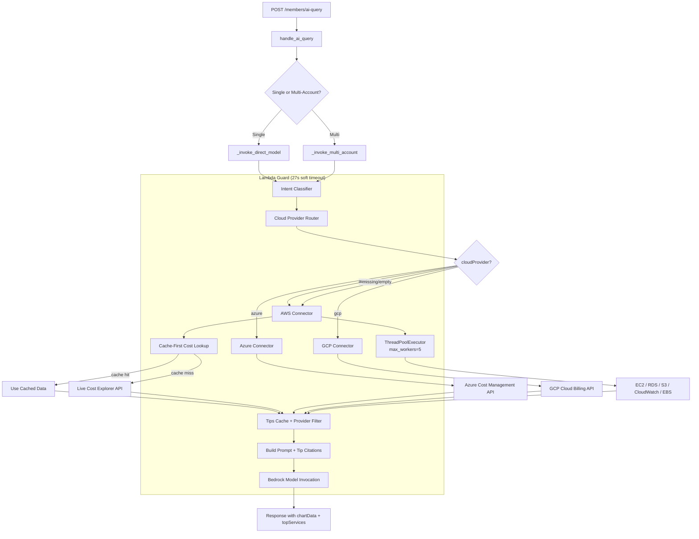

# Design Document: AI Chat Optimization

## Overview

This design addresses three critical performance and functionality gaps in the SlashMyBill AI chat query sequence (`POST /members/ai-query`):

1. **Multi-cloud provider routing** — The AI chat currently hardcodes AWS data gathering via STS AssumeRole. This design introduces a Cloud Provider Router that reads the `cloudProvider` field from the MemberPortal-Accounts table and dispatches to the appropriate connector (AWS, Azure, or GCP).

2. **Tips caching and filtering** — Tips are currently queried from DynamoDB on every request without provider awareness. This design adds an in-memory cache with 5-minute TTL keyed by cloud provider, plus provider-specific service name mappings for relevant tip lookup.

3. **Performance optimizations** — The current sequential API call pattern results in 8–18 second response times. This design introduces cache-first cost lookups, parallel API calls via `ThreadPoolExecutor`, and intent-based data routing to achieve sub-5-second perceived latency.

All changes are backward-compatible with the existing AWS flow and maintain the same response structure.

## Architecture



### Key Architectural Decisions

1. **Connector-based routing** — Reuses the existing `connectors/` package and `ProviderConnector` base class. The AI chat handler now uses the same connector abstraction already used for account connection testing.

2. **In-memory tips cache** — Uses Lambda execution context globals (survives across warm invocations) rather than Redis/ElastiCache to avoid infrastructure complexity and cost.

3. **ThreadPoolExecutor over asyncio** — The existing Lambda runtime uses synchronous boto3. ThreadPoolExecutor provides parallelism without rewriting to async/await.

4. **Intent classifier as keyword matcher** — A simple dictionary-based classifier (no LLM call) keeps classification under 50ms while covering 90%+ of user questions.

5. **Normalized data contract** — Azure and GCP connectors return data in the same structure as the existing AWS `_gather_account_data` function, enabling the Bedrock prompt and response builder to remain provider-agnostic.

## Components and Interfaces

### 1. Cloud Provider Router (`_route_to_connector`)

```python
def _route_to_connector(account_id: str, member_email: str) -> tuple[str, dict]:
    """
    Reads cloudProvider from MemberPortal-Accounts table.
    Returns (provider_name, credentials_dict).
    Defaults to "aws" if field is missing/empty.
    """
```

**Inputs:** account_id, member_email  
**Outputs:** tuple of (provider: str, credentials: dict)  
**Behavior:** Queries the account record, reads `cloudProvider` field, extracts provider-specific credentials from the account item.

### 2. Intent Classifier (`_classify_intent`)

```python
def _classify_intent(question: str) -> set[str]:
    """
    Classifies question into target categories using keyword matching.
    Returns set of categories: {'ec2', 'rds', 's3', 'lambda', 'cost-general', 
                                 'network', 'storage', 'compute'}
    Returns {'all'} if ambiguous or multi-service.
    Must execute in <50ms (no LLM call).
    """
```

**Category → API mapping:**
| Category | APIs to call |
|----------|-------------|
| `ec2` | Cost Explorer + EC2 DescribeInstances + CloudWatch |
| `rds` | Cost Explorer + RDS DescribeInstances |
| `s3` | Cost Explorer + S3 ListBuckets |
| `lambda` | Cost Explorer + Lambda ListFunctions |
| `cost-general` | Cost Explorer only (no resource APIs) |
| `network` | Cost Explorer + NAT Gateways + EIPs + VPC Endpoints |
| `storage` | Cost Explorer + EBS Volumes |
| `compute` | Cost Explorer + EC2 + RDS |
| `all` | All available APIs (current behavior) |

### 3. Tips Cache (`_tips_cache`)

```python
# Module-level globals (Lambda execution context)
_tips_cache: dict[str, dict] = {}  # {provider: {'tips': [...], 'timestamp': float}}
TIPS_CACHE_TTL = 300  # 5 minutes

def _get_cached_tips(provider: str) -> list | None:
    """Returns cached tips if fresh, None if stale/missing."""

def _set_cached_tips(provider: str, tips: list) -> None:
    """Stores tips in cache with current timestamp."""
```

### 4. Provider-Specific Tips Mappings

```python
AZURE_SERVICE_MAPPING = {
    'vm': 'Virtual Machines', 'virtual machine': 'Virtual Machines',
    'app service': 'App Service', 'web app': 'App Service',
    'azure sql': 'Azure SQL', 'sql database': 'Azure SQL',
    'storage': 'Storage', 'blob': 'Storage',
    'functions': 'Azure Functions', 'cosmos': 'Cosmos DB',
    'aks': 'AKS', 'kubernetes': 'AKS',
    'cdn': 'Azure CDN', 'dns': 'Azure DNS',
    'monitor': 'Azure Monitor', 'vnet': 'VNet',
    'key vault': 'Azure Key Vault',
}

GCP_SERVICE_MAPPING = {
    'compute': 'Compute Engine', 'vm': 'Compute Engine',
    'gcs': 'Cloud Storage', 'storage': 'Cloud Storage',
    'cloud sql': 'Cloud SQL', 'sql': 'Cloud SQL',
    'functions': 'Cloud Functions',
    'bigquery': 'BigQuery', 'bq': 'BigQuery',
    'gke': 'GKE', 'kubernetes': 'GKE',
    'cdn': 'Cloud CDN', 'dns': 'Cloud DNS',
    'monitoring': 'Cloud Monitoring',
    'vpc': 'VPC', 'kms': 'Cloud KMS',
}
```

### 5. GCP Connector (`connectors/gcp_connector.py`)

```python
class GCPConnector(ProviderConnector):
    """GCP connector using service account authentication and Cloud Billing API."""
    
    def authenticate(self, credentials: dict) -> dict:
        """Authenticate using service account JSON key, return OAuth2 token."""
    
    def test_connection(self, auth_context: dict, account_id: str) -> dict:
        """Test connection by querying billing data."""
    
    def get_cost_data(self, auth_context: dict, account_id: str, 
                      start_date: str, end_date: str) -> dict:
        """Query GCP Cloud Billing API for cost data."""
```

### 6. Normalized Data Gatherer (`_gather_provider_data`)

```python
def _gather_provider_data(provider: str, account_id: str, member_email: str,
                          question: str, intent: set[str]) -> tuple[dict, list]:
    """
    Routes to the correct connector and gathers cost data.
    For AWS: uses cache-first lookup + parallel resource APIs based on intent.
    For Azure/GCP: uses connector's get_cost_data with normalization.
    
    Returns: (account_data_dict, executed_actions_list)
    Both always in normalized format:
      account_data = {
          'cost_by_service': [{'service': str, 'cost_usd': float}],
          'daily_cost_trend': [{'date': str, 'cost_usd': float}],
          # ... optional resource data for AWS
      }
    """
```

### 7. Parallel Execution Manager

```python
def _gather_aws_data_parallel(credentials: dict, question: str, 
                              intent: set[str]) -> tuple[dict, list]:
    """
    Executes independent AWS API calls concurrently.
    - max_workers=5 per account
    - 10-second per-call timeout
    - Partial failure: logs and skips failed calls
    """

def _gather_multi_account_parallel(account_configs: list[tuple], 
                                   question: str) -> dict:
    """
    Processes multiple accounts concurrently.
    - max_workers=3 for account-level parallelism
    - Each failed account logged with ID, provider, error
    - Partial results returned for successful accounts
    """
```

### 8. Cache-First Cost Lookup

```python
def _get_cost_data_cached(member_email: str, account_id: str, 
                          credentials: dict, start_date: str, 
                          end_date: str) -> tuple[list, bool]:
    """
    Attempts to read from Cost_Cache_Table first.
    Falls back to live Cost Explorer if cache miss/incomplete.
    
    Returns: (cost_data_list, from_cache: bool)
    Only applies to AWS accounts.
    """
```

## Data Models

### MemberPortal-Accounts Table (existing, extended)

| Field | Type | Description |
|-------|------|-------------|
| `memberEmail` | String (PK) | Account owner email |
| `accountId` | String (SK) | AWS 12-digit / Azure UUID / GCP project-id |
| `cloudProvider` | String | `"aws"` \| `"azure"` \| `"gcp"` (default: `"aws"` if missing) |
| `credentials` | Map | Provider-specific encrypted credentials |
| `accountAlias` | String | User-friendly account name |

### Tips Cache (in-memory)

```python
_tips_cache = {
    "aws": {
        "tips": [{"tipId": "...", "service": "EC2", "title": "...", ...}],
        "timestamp": 1706745600.0  # time.time() when cached
    },
    "azure": {
        "tips": [...],
        "timestamp": 1706745600.0
    }
}
```

### Normalized Cost Data Response (provider-agnostic)

```python
{
    "cost_by_service": [
        {"service": "Amazon EC2", "cost_usd": 145.67, "period": "2024-01-01 to 2024-02-01"},
        {"service": "Virtual Machines", "cost_usd": 89.50, "period": "..."}
    ],
    "daily_cost_trend": [
        {"date": "2024-01-25", "cost_usd": 12.34},
        {"date": "2024-01-26", "cost_usd": 11.89}
    ],
    "provider": "aws",  # Added: identifies source provider
    "error": null  # or error message string if this account failed
}
```

### Multi-Account Response with Partial Failures

```python
{
    "answer": "...",
    "interactionId": "...",
    "commands": [...],
    "results": [],
    "tipFound": True,
    "agentUsed": False,
    "chartData": [...],
    "topServices": [...],
    "failedAccounts": [  # New field for partial failure metadata
        {"accountId": "sub-uuid-here", "provider": "azure", "error": "Authentication failed"}
    ]
}
```

## Correctness Properties

*A property is a characteristic or behavior that should hold true across all valid executions of a system — essentially, a formal statement about what the system should do. Properties serve as the bridge between human-readable specifications and machine-verifiable correctness guarantees.*

### Property 1: Provider routing correctness

*For any* account with a `cloudProvider` value of "aws", "azure", "gcp", empty string, or None, the Cloud Provider Router SHALL select the connector matching that provider value, defaulting to "aws" when the value is missing or empty.

**Validates: Requirements 1.2, 1.3, 1.4, 1.5**

### Property 2: Multi-account independent routing

*For any* list of accounts with mixed cloud provider assignments, the Cloud Provider Router SHALL route each account to its respective connector independently, and the routing decision for one account SHALL NOT affect the routing of another.

**Validates: Requirements 1.6**

### Property 3: Cost data normalization

*For any* raw cost API response from Azure or GCP, the normalized output SHALL contain a `cost_by_service` list (each item with `service` string and `cost_usd` float) and a `daily_cost_trend` list (each item with `date` string and `cost_usd` float), matching the same structure produced by the AWS connector.

**Validates: Requirements 2.4, 3.4**

### Property 4: Partial failure isolation

*For any* multi-account query where one or more accounts fail authentication or data gathering, the system SHALL successfully process all non-failed accounts and include them in the response, and SHALL include each failed account's ID and error reason in the response metadata.

**Validates: Requirements 2.6, 3.6, 12.1, 12.2**

### Property 5: Tips cache TTL correctness

*For any* cache entry with a stored timestamp, the cache SHALL serve the entry if and only if `current_time - stored_timestamp < 300 seconds`. Entries at or beyond 300 seconds SHALL be treated as stale and discarded.

**Validates: Requirements 4.2, 4.3**

### Property 6: Provider-specific tips mapping

*For any* cloud provider ("aws", "azure", "gcp") and any question string, the tips lookup SHALL use only the service name mappings corresponding to that provider, plus "General" tips which are always included regardless of provider.

**Validates: Requirements 5.1, 5.2, 5.3, 5.4**

### Property 7: Tips deduplication invariant

*For any* set of tips retrieved from multiple provider-specific queries, the merged result SHALL contain no duplicate `tipId` values.

**Validates: Requirements 5.5**

### Property 8: Tip citation prompt conditional inclusion

*For any* tips context passed to prompt building, the prompt SHALL include the tip citation instruction if and only if the tips list is non-empty. When tips are non-empty, tip titles, descriptions, and confidence levels SHALL all be present in the prompt context.

**Validates: Requirements 6.1, 6.3, 6.4**

### Property 9: Cache-first cost retrieval

*For any* AWS account cost data request, if the Cost_Cache_Table contains valid data covering the full requested date range, the live Cost Explorer API SHALL NOT be called. If the cache data is missing or incomplete, the live API SHALL be invoked.

**Validates: Requirements 7.2, 7.3**

### Property 10: Parallel execution partial failure resilience

*For any* set of concurrent API calls within a single account's data gathering, if K out of N calls succeed, the result SHALL contain data from all K successful calls regardless of which specific calls failed.

**Validates: Requirements 8.3**

### Property 11: Intent-based data routing

*For any* question classified into a specific intent category, the Data Gatherer SHALL call only the APIs mapped to that category. For questions classified as "cost-general", no resource-level APIs SHALL be called. For ambiguous questions, all APIs SHALL be called.

**Validates: Requirements 9.2, 9.3, 9.4**

### Property 12: Response structure invariance

*For any* AI chat query regardless of cloud provider, the response SHALL contain all required fields: `answer`, `interactionId`, `commands`, `results`, `tipFound`, `agentUsed`, `chartData`, `topServices`.

**Validates: Requirements 11.1**

### Property 13: Account ID validation

*For any* string matching the pattern of a valid AWS account ID (12 digits), Azure subscription ID (UUID format), or GCP project ID (6-30 lowercase alphanumeric with hyphens), the validator SHALL accept it. For any string not matching these patterns, the validator SHALL reject it.

**Validates: Requirements 11.4**

## Error Handling

### Authentication Failures

| Provider | Error Scenario | Behavior |
|----------|---------------|----------|
| AWS | STS AssumeRole fails | Log error, return `{"error": "AWS role assumption failed: <details>"}` for that account |
| Azure | OAuth2 token request fails | Raise `AuthenticationError`, caught by multi-account handler, logged and skipped |
| GCP | Service account auth fails | Raise `AuthenticationError`, caught by multi-account handler, logged and skipped |

### Data Gathering Failures

- **Single API call timeout (10s):** Log warning, skip that data source, continue with others
- **All APIs fail for one account:** Include account in `failedAccounts` response metadata
- **All accounts fail:** Return error response with message "No account data could be retrieved"
- **Cache read failure:** Fall through to live API silently (cache is opportunistic)
- **Both cache and live API fail:** Include `cost_error` field in account data, continue with other data sources

### Timeout Protection

- **27-second Lambda Guard:** Existing `concurrent.futures.ThreadPoolExecutor` with `future.result(timeout=27)` catches `TimeoutError` and returns graceful partial response
- **Per-call 10-second timeout:** Each individual API call in the thread pool uses `future.result(timeout=10)`
- **No new unbounded operations:** All new code paths (Azure API, GCP API, cache reads) have explicit timeouts

### Graceful Degradation Priority

1. Return cached data if available (fastest path)
2. Return partial data from successful APIs/accounts
3. Return generic "analysis timed out" message if Bedrock times out
4. Never return HTTP 503 — always return 200 with informative message

## Testing Strategy

### Unit Tests (example-based)

- Cloud Provider Router defaults to "aws" when field is missing
- Intent Classifier correctly maps "how much does EC2 cost" → `{'ec2', 'cost-general'}`
- Tips cache returns None for entries older than 5 minutes
- Azure response normalization produces correct structure from sample API response
- GCP response normalization produces correct structure from sample API response
- Multi-account failure produces correct `failedAccounts` metadata

### Property-Based Tests (using `hypothesis` library)

Property-based tests validate universal properties across many generated inputs. Each property test runs a minimum of 100 iterations.

**Library:** `hypothesis` (Python)
**Configuration:** `@settings(max_examples=100)`

**Properties to implement:**
1. Provider routing correctness (Property 1) — generate random provider strings
2. Cost data normalization (Property 3) — generate random Azure/GCP response structures
3. Tips cache TTL (Property 5) — generate timestamps at varying distances from "now"
4. Provider-specific tips mapping (Property 6) — generate random questions with service keywords
5. Tips deduplication (Property 7) — generate tip lists with overlapping IDs
6. Tip citation conditional (Property 8) — generate empty and non-empty tip lists
7. Parallel partial failure (Property 10) — generate random success/failure combinations
8. Intent-based routing (Property 11) — generate questions with various keyword combinations
9. Response structure invariance (Property 12) — generate responses from different providers
10. Account ID validation (Property 13) — generate valid/invalid account ID strings

**Tag format:** `# Feature: ai-chat-optimization, Property {N}: {property_text}`

### Integration Tests

- End-to-end Azure connector authentication + cost retrieval (mocked HTTP)
- End-to-end GCP connector authentication + cost retrieval (mocked HTTP)
- Cache-first flow with DynamoDB local
- Multi-account mixed-provider query with partial failures
- 27-second timeout behavior with simulated slow APIs
