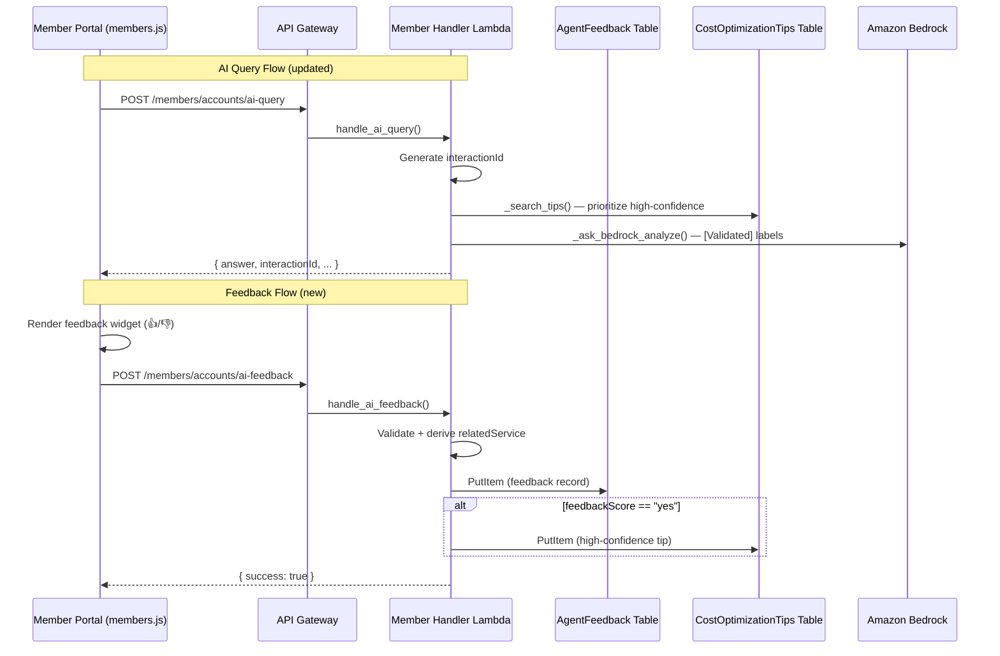

# Design Document: AI Feedback Learning Loop

## Overview

This design adds a continuous feedback loop to the SlashMyBill AI Agent. Members rate AI responses via a thumbs-up/thumbs-down widget rendered below every AI answer in the Member Portal. Feedback flows through a new `POST /members/accounts/ai-feedback` API endpoint, is stored in a dedicated `MemberPortal-AgentFeedback` DynamoDB table, and drives two downstream effects:

1. Positive feedback ("yes") extracts a tip from the AI response and saves it to the existing `ViewMyBill-CostOptimizationTips` RAG knowledge base with a `confidenceTag: high-confidence` attribute.
2. Negative feedback ("no") with optional user corrections is logged for admin review without modifying the knowledge base.

The RAG retrieval pipeline (`_search_tips`) is updated to sort high-confidence tips first, and the Bedrock prompt (`_ask_bedrock_analyze`) is updated to annotate validated tips with `[Validated]` and instruct the model to prioritize them.

Each AI query-response pair is assigned a unique `interactionId` (ISO timestamp + 8-char hex suffix) so feedback can be reliably linked back to the originating interaction.

## Architecture



## Components and Interfaces

### 1. Frontend — Feedback Widget (members/members.js)

The `addAIMessage()` function is modified to inject a feedback widget HTML block after every `type === 'answer'` message. The widget contains:

- A "Did this help you?" prompt
- 👍 (thumbs-up) and 👎 (thumbs-down) buttons
- On thumbs-down: an expandable text input for optional correction text with a "Submit" button
- Both buttons are disabled after selection to prevent duplicate submissions

The widget reads `interactionId` from the AI response data (stored as a `data-interaction-id` attribute on the message div) and submits feedback via the existing `api()` helper function.

The `askAI()` function is updated to store the `interactionId` returned by the API on the answer message element.

### 2. Backend — handle_ai_feedback() (member-handler/lambda_function.py)

New route handler registered at `POST /members/accounts/ai-feedback` in the `routes` dict.

```python
def handle_ai_feedback(event):
    # 1. Authenticate via validate_token()
    # 2. Parse body: interactionId, feedbackScore, userQuestion, agentResponse, accountId, userCorrection?
    # 3. Validate required fields; reject if feedbackScore not in ("yes", "no")
    # 4. Derive relatedService from userQuestion keywords
    # 5. Write feedback record to FEEDBACK_TABLE_NAME
    # 6. If feedbackScore == "yes": extract tip, save to TIPS_TABLE_NAME with confidenceTag
    # 7. Return 200 { success: true }
```

### 3. Backend — handle_ai_query() updates

- Generate `interactionId = datetime.now(UTC).isoformat() + '-' + secrets.token_hex(4)`
- Include `interactionId` in the response JSON body

### 4. Backend — _search_tips() updates

After retrieving tips from DynamoDB, sort the list so items with `confidenceTag == 'high-confidence'` appear first, then return up to 10 tips. No change to the query/scan logic itself.

### 5. Backend — _maybe_save_tip() updates

When called from `handle_ai_feedback()` with positive feedback, save the tip with `confidenceTag: 'high-confidence'`. The existing `_maybe_save_tip()` called from `_invoke_direct_model()` continues to save tips without a confidence tag (unchanged behavior).

### 6. Backend — _ask_bedrock_analyze() prompt updates

- Add instruction: "Prioritize strategies from Knowledge Base tips that have historically positive user feedback."
- Add instruction: "If a user corrects you in the chat, acknowledge the correction and adjust recommendations accordingly."
- In the tips context block, annotate tips that have `confidenceTag == 'high-confidence'` with a `[Validated]` prefix.

### 7. Infrastructure — CloudFormation (viewmybill-stack.yaml)

- New `AgentFeedbackTable` DynamoDB resource (PK: `memberEmail`, SK: `interactionId`, PAY_PER_REQUEST, SSE enabled)
- New `MemberAIFeedbackRoute` API Gateway route for `POST /members/accounts/ai-feedback`
- New IAM policy `DynamoDBFeedbackAccess` on `MemberHandlerRole` granting `dynamodb:PutItem` on the feedback table
- New environment variable `FEEDBACK_TABLE_NAME` on `MemberHandlerFunction`
- New output `AgentFeedbackTableArn`

### 8. Service Keyword Derivation

The `_derive_related_service()` helper scans the `userQuestion` against a keyword map:

| Keyword(s) | relatedService |
|---|---|
| ec2, instance | EC2 |
| s3, bucket, storage | S3 |
| rds, database, aurora | RDS |
| lambda, function, serverless | Lambda |
| ebs, volume | EBS |
| vpc, nat, endpoint | VPC |
| cloudfront, cdn | CloudFront |
| dynamodb | DynamoDB |
| ecs, fargate, container | ECS |
| eks, kubernetes | EKS |
| route53, dns | Route53 |
| kms, key, encrypt | KMS |
| elasticache, redis, memcached | ElastiCache |
| redshift, warehouse | Redshift |
| cloudwatch, monitor, alarm | CloudWatch |
| iam, role, policy, permission | IAM |
| (no match) | General |

## Data Models

### AgentFeedback Table Record

```json
{
  "memberEmail": "user@example.com",
  "interactionId": "2025-01-15T10:30:00+00:00-a1b2c3d4",
  "userQuestion": "How can I reduce my EC2 costs?",
  "agentResponse": "Based on your account data...",
  "feedbackScore": "yes",
  "userCorrection": null,
  "relatedService": "EC2",
  "accountId": "123456789012",
  "createdAt": "2025-01-15T10:31:00+00:00"
}
```

Key schema: `memberEmail` (HASH) + `interactionId` (RANGE)

### Updated CostOptimizationTips Record (new field)

Existing tip records gain an optional `confidenceTag` attribute:

```json
{
  "service": "EC2",
  "tipId": "ai-fb-a1b2c3d4",
  "title": "How can I reduce my EC2 costs?",
  "description": "Based on your account data...",
  "category": "ai-generated",
  "estimatedSavings": "varies",
  "difficulty": "medium",
  "source": "user-feedback",
  "confidenceTag": "high-confidence",
  "createdAt": "2025-01-15T10:31:00+00:00"
}
```

### AI Query Response (updated)

```json
{
  "answer": "...",
  "interactionId": "2025-01-15T10:30:00+00:00-a1b2c3d4",
  "commands": [...],
  "results": [],
  "tipFound": true,
  "agentUsed": false,
  "chartData": [...]
}
```

### Feedback API Request Body

```json
{
  "interactionId": "2025-01-15T10:30:00+00:00-a1b2c3d4",
  "feedbackScore": "yes",
  "userQuestion": "How can I reduce my EC2 costs?",
  "agentResponse": "Based on your account data...",
  "accountId": "123456789012",
  "userCorrection": "The savings estimate was too high"
}
```


## Correctness Properties

*A property is a characteristic or behavior that should hold true across all valid executions of a system — essentially, a formal statement about what the system should do. Properties serve as the bridge between human-readable specifications and machine-verifiable correctness guarantees.*

### Property 1: Feedback widget renders for all AI answers

*For any* AI answer string passed to `addAIMessage('answer', ...)`, the resulting HTML must contain a feedback widget with both a thumbs-up button and a thumbs-down button and a "Did this help you?" prompt.

**Validates: Requirements 1.1**

### Property 2: Feedback payload completeness

*For any* feedback submission triggered by the widget, the request body sent to the API must include `interactionId`, `userQuestion`, `agentResponse`, and `accountId` fields, all non-empty.

**Validates: Requirements 1.6**

### Property 3: Valid feedback persists complete record

*For any* valid feedback payload (with all required fields and `feedbackScore` in `{"yes", "no"}`), the record written to the AgentFeedback table must contain `memberEmail`, `interactionId`, `userQuestion`, `agentResponse`, `feedbackScore`, `relatedService`, `accountId`, and `createdAt`, all non-null.

**Validates: Requirements 2.1, 3.2**

### Property 4: Invalid feedback payloads are rejected

*For any* feedback payload that is missing at least one required field (`interactionId`, `feedbackScore`, `userQuestion`, `agentResponse`, `accountId`) or has a `feedbackScore` value other than `"yes"` or `"no"`, the API must return HTTP 400.

**Validates: Requirements 2.3, 2.4**

### Property 5: Service keyword derivation

*For any* user question string containing one or more known AWS service keywords (e.g., "ec2", "s3", "rds", "lambda"), the `_derive_related_service()` function must return the corresponding service name. For any question containing no known keywords, it must return `"General"`.

**Validates: Requirements 2.5**

### Property 6: Positive feedback saves high-confidence tip

*For any* feedback record with `feedbackScore == "yes"`, the system must write a tip to the CostOptimizationTips table with `confidenceTag` set to `"high-confidence"`, `service` matching the derived `relatedService`, and a `tipId` prefixed with `"ai-fb-"`.

**Validates: Requirements 4.1**

### Property 7: Duplicate positive feedback is idempotent

*For any* positive feedback submission, submitting the same feedback twice (same interactionId and question) must not raise an error and must not create duplicate tip records in the CostOptimizationTips table.

**Validates: Requirements 4.2**

### Property 8: Negative feedback does not create tips

*For any* feedback record with `feedbackScore == "no"`, the system must write a record to the AgentFeedback table but must not write any record to the CostOptimizationTips table.

**Validates: Requirements 4.3**

### Property 9: Tip retrieval prioritizes high-confidence and includes fallback

*For any* list of tips retrieved by `_search_tips()`, all tips with `confidenceTag == "high-confidence"` must appear before tips without a confidence tag. When fewer than 5 high-confidence tips are available, the result must include non-tagged tips to ensure the AI always has context.

**Validates: Requirements 5.1, 5.2**

### Property 10: Validated tips are annotated in prompt context

*For any* tip with `confidenceTag == "high-confidence"` included in the tips context passed to `_ask_bedrock_analyze()`, the formatted prompt text must contain a `[Validated]` label preceding that tip's content.

**Validates: Requirements 6.3**

### Property 11: InteractionId format and presence

*For any* AI query processed by `handle_ai_query()`, the response body must contain an `interactionId` field matching the pattern `<ISO-8601-timestamp>-<8-hex-chars>` (e.g., `2025-01-15T10:30:00+00:00-a1b2c3d4`).

**Validates: Requirements 7.1, 7.2**

### Property 12: JWT authentication enforcement

*For any* request to `POST /members/accounts/ai-feedback` that does not include a valid JWT token, the API must return HTTP 401 or 403.

**Validates: Requirements 2.2**

## Error Handling

| Scenario | Behavior |
|---|---|
| Missing/invalid JWT token on feedback request | Return 401 with `Unauthorized` error |
| Missing required field in feedback body | Return 400 with `InvalidRequest` and descriptive message listing the missing field |
| Invalid `feedbackScore` value | Return 400 with `InvalidRequest` and message "feedbackScore must be 'yes' or 'no'" |
| DynamoDB PutItem fails on AgentFeedback table | Log error, return 500 with `InternalError` |
| DynamoDB PutItem fails on Tips table (positive feedback) | Log warning, still return 200 (feedback itself was saved; tip save is best-effort) |
| Duplicate tip (ConditionalCheckFailedException) | Silently skip, return 200 |
| Frontend API call fails (network error) | Show inline error message on the widget, re-enable buttons so user can retry |
| `interactionId` missing from AI response | Frontend disables feedback widget for that message (graceful degradation) |

## Testing Strategy

### Property-Based Testing

Use `hypothesis` (Python) for backend property tests. Each property test runs a minimum of 100 iterations.

Each test is tagged with a comment: `# Feature: ai-feedback-learning-loop, Property {N}: {title}`

Properties to implement as property-based tests:
- Property 3: Valid feedback persists complete record
- Property 4: Invalid feedback payloads are rejected
- Property 5: Service keyword derivation
- Property 6: Positive feedback saves high-confidence tip
- Property 7: Duplicate positive feedback is idempotent
- Property 8: Negative feedback does not create tips
- Property 9: Tip retrieval prioritizes high-confidence and includes fallback
- Property 10: Validated tips are annotated in prompt context
- Property 11: InteractionId format and presence

### Unit Testing

Use `pytest` for unit tests. Focus on:
- Specific examples for UI rendering (Properties 1, 2 — tested via JS unit tests or manual verification)
- Edge cases: empty correction text, very long agentResponse, question with multiple service keywords
- Integration: route dispatch correctly maps `POST /members/accounts/ai-feedback` to `handle_ai_feedback`
- Prompt string verification (Requirements 6.1, 6.2 — check specific strings exist in prompt)
- JWT rejection (Property 12 — specific example with missing/expired token)

### Frontend Testing

Manual or lightweight JS tests for:
- Widget renders below answer messages
- Thumbs-up click disables both buttons and calls API
- Thumbs-down click shows correction input
- Correction submit sends text with feedback
- Widget disabled when interactionId is missing
