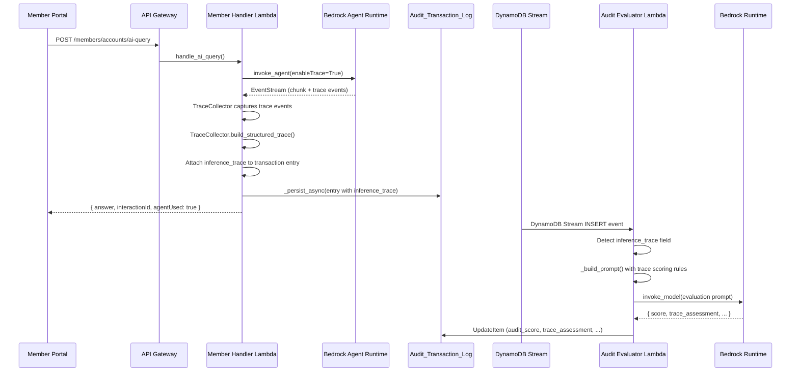

# Design Document: AI Inference Trace Audit

## Overview

This design adds inference trace capture to the Bedrock Agent invocation path in the member-handler Lambda and extends the audit evaluator to score agent reasoning quality based on captured trace data.

During `_invoke_bedrock_agent` calls, a `TraceCollector` captures all trace events emitted alongside response chunks in the Bedrock `invoke_agent` EventStream. The raw events are transformed into a structured format (`tools_selected`, `tool_invocations`, `reasoning_steps`) and stored as a JSON-serialized `inference_trace` field in the existing `Audit_Transaction_Log` DynamoDB record. The audit evaluator then conditionally extends its prompt with trace-based scoring rules when the field is present.

## Architecture



## Components and Interfaces

### 1. TraceCollector Module (member-handler/trace_collector.py)

A new module responsible for capturing and structuring Bedrock Agent trace events. Uses a simple list-based approach — no thread-locals needed since the Lambda processes one request at a time.

```python
"""
trace_collector.py — Captures and structures Bedrock Agent trace events.
"""

import time
import json
import logging

logger = logging.getLogger(__name__)

MAX_TRACE_SIZE_BYTES = 50 * 1024  # 50KB limit


class TraceCollector:
    """Collects trace events from a Bedrock Agent EventStream and produces
    a structured trace object for audit storage."""

    def __init__(self):
        self._events = []
        self._tools_selected = []
        self._tool_invocations = []
        self._reasoning_steps = []

    def capture_event(self, event):
        """Capture a single trace event from the EventStream.

        Args:
            event: A dict from the EventStream containing a 'trace' key.
        """
        trace_data = event.get('trace', {}).get('trace', {})
        timestamp = event.get('trace', {}).get('agentId', '')  # Use event time
        capture_time = time.time()

        self._events.append({
            'event_type': self._detect_event_type(trace_data),
            'timestamp': capture_time,
            'payload': trace_data,
        })

        # Process orchestration trace
        orch_trace = trace_data.get('orchestrationTrace', {})
        if orch_trace:
            self._process_orchestration_trace(orch_trace)

        # Process pre/post-processing traces (capture reasoning)
        pre_trace = trace_data.get('preProcessingTrace', {})
        if pre_trace:
            self._process_preprocessing_trace(pre_trace)

        post_trace = trace_data.get('postProcessingTrace', {})
        if post_trace:
            self._process_postprocessing_trace(post_trace)

    def _detect_event_type(self, trace_data):
        """Determine the type of trace event."""
        if 'orchestrationTrace' in trace_data:
            return 'orchestration'
        elif 'preProcessingTrace' in trace_data:
            return 'preProcessing'
        elif 'postProcessingTrace' in trace_data:
            return 'postProcessing'
        elif 'guardrailTrace' in trace_data:
            return 'guardrail'
        elif 'failureTrace' in trace_data:
            return 'failure'
        return 'unknown'

    def _process_orchestration_trace(self, orch_trace):
        """Extract tool invocations and reasoning from orchestration trace."""
        # Extract rationale (reasoning step)
        rationale = orch_trace.get('rationale', {})
        if rationale and rationale.get('text'):
            self._reasoning_steps.append(rationale['text'])

        # Extract model invocation input (reasoning step)
        model_input = orch_trace.get('modelInvocationInput', {})
        if model_input and model_input.get('text'):
            self._reasoning_steps.append(model_input['text'])

        # Extract invocation input (tool call)
        invocation_input = orch_trace.get('invocationInput', {})
        action_group_input = invocation_input.get('actionGroupInvocationInput', {})
        if action_group_input:
            tool_name = action_group_input.get('function', '') or action_group_input.get('actionGroupName', '')
            if tool_name:
                # Record start time for duration tracking
                self._current_invocation_start = time.time()
                if tool_name not in self._tools_selected:
                    self._tools_selected.append(tool_name)

                self._tool_invocations.append({
                    'tool_name': tool_name,
                    'request_params': action_group_input.get('parameters', {}),
                    'response_data': None,  # Filled on observation
                    'duration_ms': 0,
                    '_start_time': time.time(),
                })

        # Extract observation (tool response)
        observation = orch_trace.get('observation', {})
        action_group_output = observation.get('actionGroupInvocationOutput', {})
        if action_group_output and self._tool_invocations:
            # Update the most recent invocation with response data
            last_invocation = self._tool_invocations[-1]
            if last_invocation['response_data'] is None:
                last_invocation['response_data'] = action_group_output.get('text', '')
                start = last_invocation.pop('_start_time', time.time())
                last_invocation['duration_ms'] = int((time.time() - start) * 1000)

    def _process_preprocessing_trace(self, pre_trace):
        """Extract reasoning from preprocessing trace."""
        model_output = pre_trace.get('modelInvocationOutput', {})
        parsed = model_output.get('parsedResponse', {})
        rationale = parsed.get('rationale')
        if rationale:
            self._reasoning_steps.append(rationale)

    def _process_postprocessing_trace(self, post_trace):
        """Extract reasoning from postprocessing trace."""
        model_output = post_trace.get('modelInvocationOutput', {})
        parsed = model_output.get('parsedResponse', {})
        if parsed and parsed.get('text'):
            self._reasoning_steps.append(parsed['text'])

    def build_structured_trace(self):
        """Produce the final structured trace object.

        Returns:
            dict with keys: tools_selected, tool_invocations, reasoning_steps
        """
        # Clean up internal tracking fields from invocations
        clean_invocations = []
        for inv in self._tool_invocations:
            clean_invocations.append({
                'tool_name': inv['tool_name'],
                'request_params': inv['request_params'],
                'response_data': inv.get('response_data'),
                'duration_ms': inv.get('duration_ms', 0),
            })

        return {
            'tools_selected': list(self._tools_selected),
            'tool_invocations': clean_invocations,
            'reasoning_steps': list(self._reasoning_steps),
        }


def serialize_trace(structured_trace):
    """Serialize the structured trace to JSON with 50KB size enforcement.

    If serialized trace exceeds 50KB, truncates tool_invocations response_data
    starting from the oldest invocation until it fits.

    Args:
        structured_trace: dict from TraceCollector.build_structured_trace()

    Returns:
        JSON string ≤ 50KB
    """
    serialized = json.dumps(structured_trace, default=str)
    original_size = len(serialized.encode('utf-8'))

    if original_size <= MAX_TRACE_SIZE_BYTES:
        return serialized

    # Truncation needed — remove response_data from oldest invocations first
    trace_copy = {
        'tools_selected': structured_trace['tools_selected'],
        'tool_invocations': [inv.copy() for inv in structured_trace['tool_invocations']],
        'reasoning_steps': structured_trace['reasoning_steps'],
        '_truncated': True,
        '_original_size_bytes': original_size,
    }

    for i in range(len(trace_copy['tool_invocations'])):
        trace_copy['tool_invocations'][i]['response_data'] = '[TRUNCATED]'
        serialized = json.dumps(trace_copy, default=str)
        if len(serialized.encode('utf-8')) <= MAX_TRACE_SIZE_BYTES:
            return serialized

    # If still too large after all response_data truncated, truncate reasoning
    trace_copy['reasoning_steps'] = trace_copy['reasoning_steps'][:3]
    serialized = json.dumps(trace_copy, default=str)
    return serialized[:MAX_TRACE_SIZE_BYTES]
```

### 2. Modified _invoke_bedrock_agent (member-handler/lambda_function.py)

The existing function is updated to:
1. Pass `enableTrace=True` to `invoke_agent()`
2. Instantiate a `TraceCollector` and capture trace events from the stream
3. Return the structured trace alongside the response for the transaction logger to persist

```python
def _invoke_bedrock_agent(question, account_id, member_email, interaction_id):
    """Invoke the Bedrock Agent for a conversational FinOps query."""
    from trace_collector import TraceCollector, serialize_trace

    agent_runtime = boto3.client('bedrock-agent-runtime', ...)

    tips_context = _search_tips(question)
    tip_found = bool(tips_context)

    enriched_prompt = f"[Account: {account_id}, Member: {member_email}] {question}"
    if tips_context:
        from tip_citation import build_tip_citation_prompt
        tips_text = build_tip_citation_prompt(tips_context)
        enriched_prompt += f"\n\n{tips_text}"

    collector = TraceCollector()

    try:
        response = agent_runtime.invoke_agent(
            agentId=BEDROCK_AGENT_ID,
            agentAliasId=BEDROCK_AGENT_ALIAS_ID,
            sessionId=re.sub(r'[^0-9a-zA-Z._:-]', '_', f'{member_email}-{account_id}')[:100],
            inputText=enriched_prompt,
            enableTrace=True,
        )

        # Stream the response, capturing both chunks and trace events
        answer_parts = []
        for event_stream in response.get('completion', []):
            if 'chunk' in event_stream:
                chunk = event_stream['chunk']
                if 'bytes' in chunk:
                    answer_parts.append(chunk['bytes'].decode('utf-8'))
            if 'trace' in event_stream:
                try:
                    collector.capture_event(event_stream)
                except Exception as trace_err:
                    logger.warning(f"Trace capture error (non-fatal): {trace_err}")

        answer = ''.join(answer_parts)
        if not answer:
            answer = 'The agent did not return a response. Please try rephrasing your question.'

        # Build structured trace — errors here are non-fatal
        inference_trace = None
        try:
            structured_trace = collector.build_structured_trace()
            inference_trace = serialize_trace(structured_trace)
        except Exception as trace_err:
            logger.error(f"Trace serialization failed (non-fatal): {trace_err}")

        result = create_response(200, {
            'answer': answer,
            'interactionId': interaction_id,
            'commands': ['Bedrock Agent orchestrated the analysis'],
            'results': [],
            'tipFound': tip_found,
            'agentUsed': True,
        })

        # Attach trace to result for the transaction logger to pick up
        if inference_trace:
            result['_inference_trace'] = inference_trace

        return result
    except Exception as e:
        logger.error(f"Bedrock Agent invocation failed: {e}")
        return _invoke_direct_model(question, account_id, member_email, interaction_id)
```

### 3. Transaction Logger Update (transaction_logger.py)

The `transaction_log` decorator wrapper is modified to detect the `_inference_trace` field in the response dict and add it to the transaction log entry before calling `_persist_async`. The `_inference_trace` field is removed from the response returned to the caller.

```python
# Inside the wrapper function, after handler_fn(event) returns:

# Extract inference_trace from response if present (set by _invoke_bedrock_agent)
inference_trace = None
if isinstance(response, dict) and '_inference_trace' in response:
    inference_trace = response.pop('_inference_trace')

entry = {
    'transaction_id': transaction_id,
    'start_timestamp': start_iso,
    # ... existing fields ...
}

# Add inference_trace to entry if captured
if inference_trace:
    entry['inference_trace'] = inference_trace

try:
    _persist_async(entry)
except Exception as persist_err:
    logger.error(f"Transaction log persist raised unexpectedly: {persist_err}")
return response
```

### 4. Audit Evaluator Updates (audit-evaluator/lambda_function.py)

The `_build_prompt()` function is extended to detect the `inference_trace` field and append trace-based scoring rules. A new `_build_trace_scoring_section()` helper generates the conditional prompt section.

```python
def _build_prompt(entry):
    """Build the evaluation prompt from a transaction entry."""
    function_name = entry.get('function_name', 'unknown')
    duration_ms = entry.get('duration_ms', 0)
    request_payload = entry.get('request_payload', {})
    response_payload = entry.get('response_payload', {})
    inference_trace_raw = entry.get('inference_trace')

    # ... existing request/response formatting ...

    base_prompt = f"""You are a strict audit agent evaluating API transaction quality...
    {existing_rules}
    """

    # Append trace-based scoring if inference_trace is present
    trace_section = _build_trace_scoring_section(inference_trace_raw, request_payload)
    if trace_section:
        base_prompt += trace_section

    # Update response format to include trace_assessment
    base_prompt += """
Evaluate and return JSON:
{
  "score": <0-100>,
  "accuracy_assessment": "<text>",
  "timing_assessment": "<text>",
  "improvement_suggestions": "<text>",
  "trace_assessment": "<text explaining trace-based scoring decision>"
}"""

    return base_prompt


def _build_trace_scoring_section(inference_trace_raw, request_payload):
    """Build trace-based scoring rules if inference_trace is available.

    Returns None if no trace data, or a prompt section string.
    """
    if not inference_trace_raw:
        return None

    try:
        trace_data = json.loads(inference_trace_raw)
    except (json.JSONDecodeError, TypeError):
        logger.warning("Malformed inference_trace — skipping trace evaluation")
        return None

    tools_selected = trace_data.get('tools_selected', [])
    tool_invocations = trace_data.get('tool_invocations', [])
    reasoning_steps = trace_data.get('reasoning_steps', [])

    # Extract user question from request payload
    user_question = ''
    if isinstance(request_payload, str):
        try:
            req = json.loads(request_payload)
            user_question = req.get('body', '')
            if isinstance(user_question, str):
                try:
                    body = json.loads(user_question)
                    user_question = body.get('question', '')
                except (json.JSONDecodeError, TypeError):
                    pass
        except (json.JSONDecodeError, TypeError):
            pass
    elif isinstance(request_payload, dict):
        body_str = request_payload.get('body', '')
        if isinstance(body_str, str):
            try:
                body = json.loads(body_str)
                user_question = body.get('question', '')
            except (json.JSONDecodeError, TypeError):
                pass

    section = f"""

TRACE-BASED SCORING (Agent Reasoning Audit):
The agent made the following decisions during this interaction:
- Tools selected: {json.dumps(tools_selected)}
- Tool invocations: {len(tool_invocations)} calls made
- Reasoning steps: {len(reasoning_steps)} steps recorded

Trace Scoring Rules:
1. TOOL SELECTION: Assess whether the agent selected appropriate tools for the question type. Penalize if obvious tools were missed.
"""

    # Service-specific penalization rules
    service_keywords = {
        'ec2': 'EC2', 's3': 'S3', 'rds': 'RDS', 'lambda': 'Lambda',
        'ebs': 'EBS', 'cloudfront': 'CloudFront', 'dynamodb': 'DynamoDB',
        'ecs': 'ECS', 'eks': 'EKS', 'elasticache': 'ElastiCache',
        'redshift': 'Redshift', 'route53': 'Route53',
    }

    question_lower = user_question.lower()
    detected_service = None
    for keyword, service in service_keywords.items():
        if keyword in question_lower:
            detected_service = service
            break

    if detected_service:
        tool_names_lower = [t.lower() for t in tools_selected]
        section += f"""2. SERVICE-SPECIFIC CHECK: The question mentions {detected_service}. The agent MUST have invoked 'usageTypeBreakdown' to provide accurate service-level cost data. Tools actually used: {tools_selected}. {"PENALTY: usageTypeBreakdown was NOT called — deduct 15 points." if 'usagetypebreakdown' not in tool_names_lower else "OK: usageTypeBreakdown was called."}
"""

    # Pricing/cost calculation check
    pricing_keywords = ['cost', 'price', 'pricing', 'compare', 'cheaper', 'expensive', 'savings', 'calculate']
    if any(kw in question_lower for kw in pricing_keywords):
        tool_names_lower = [t.lower() for t in tools_selected]
        section += f"""3. PRICING DATA CHECK: The question involves cost/pricing. The agent SHOULD have invoked 'getPricingData' before performing calculations. Tools used: {tools_selected}. {"PENALTY: getPricingData was NOT called before calculations — deduct 10 points." if 'getpricingdata' not in tool_names_lower else "OK: getPricingData was called."}
"""

    section += f"""
4. REASONING QUALITY: Were the reasoning steps logical and relevant to the question? Brief reasoning summaries:
{chr(10).join(f'  - {step[:200]}' for step in reasoning_steps[:5])}

Include your trace-based assessment in the "trace_assessment" field of your response.
"""

    return section
```

### 5. Audit Evaluator Response Parsing Updates

The `_parse_bedrock_response()` function is updated to extract `trace_assessment`, and `_update_entry_with_evaluation()` is updated to store it.

```python
def _parse_bedrock_response(content_text):
    """Parse the Bedrock response JSON — now includes trace_assessment."""
    # ... existing JSON extraction logic ...
    return {
        'audit_score': score,
        'audit_accuracy_assessment': data.get('accuracy_assessment'),
        'audit_timing_assessment': data.get('timing_assessment'),
        'audit_improvement_suggestions': data.get('improvement_suggestions'),
        'audit_trace_assessment': data.get('trace_assessment'),
    }


def _update_entry_with_evaluation(transaction_id, start_timestamp, evaluation):
    """Update DynamoDB item — now includes trace_assessment field."""
    # ... existing update logic ...

    # Set trace_assessment
    trace_assessment = evaluation.get('audit_trace_assessment')
    if trace_assessment is None:
        # Default for non-agent-path transactions
        trace_assessment = "No inference trace available - non-agent path or trace capture unavailable"
    update_expr_parts.append('#atr = :atr')
    expr_attr_names['#atr'] = 'audit_trace_assessment'
    expr_attr_values[':atr'] = trace_assessment
```

### 6. Malformed Trace Handling in Audit Evaluator

When `inference_trace` is present but not valid JSON, the evaluator logs a warning and proceeds with standard evaluation. The `trace_assessment` is set to the diagnostic message.

```python
def _evaluate_with_bedrock(entry):
    """Process a transaction entry — handles malformed trace gracefully."""
    inference_trace_raw = entry.get('inference_trace')

    # Pre-validate trace JSON if present
    trace_malformed = False
    if inference_trace_raw:
        try:
            json.loads(inference_trace_raw)
        except (json.JSONDecodeError, TypeError):
            logger.warning(f"Malformed inference_trace in {entry.get('transaction_id')}")
            trace_malformed = True

    prompt = _build_prompt(entry)
    evaluation = _invoke_bedrock_and_parse(prompt)

    # Override trace_assessment for malformed traces
    if trace_malformed:
        evaluation['audit_trace_assessment'] = "Trace data malformed - skipping trace evaluation"
    elif not inference_trace_raw:
        evaluation['audit_trace_assessment'] = evaluation.get(
            'audit_trace_assessment',
            "No inference trace available - non-agent path or trace capture unavailable"
        )

    return evaluation
```

## Data Models

### Structured Trace Object (inference_trace field)

```json
{
  "tools_selected": ["usageTypeBreakdown", "getPricingData"],
  "tool_invocations": [
    {
      "tool_name": "usageTypeBreakdown",
      "request_params": {"accountId": "123456789012", "service": "EC2"},
      "response_data": "{\"usageTypes\": [...]}",
      "duration_ms": 450
    },
    {
      "tool_name": "getPricingData",
      "request_params": {"service": "EC2", "region": "us-east-1"},
      "response_data": "{\"pricing\": [...]}",
      "duration_ms": 320
    }
  ],
  "reasoning_steps": [
    "The user is asking about EC2 costs. I need to get usage breakdown first.",
    "Now I have the usage data, let me get pricing to calculate potential savings."
  ]
}
```

### Truncated Trace Object (when > 50KB)

```json
{
  "tools_selected": ["usageTypeBreakdown", "getPricingData"],
  "tool_invocations": [
    {
      "tool_name": "usageTypeBreakdown",
      "request_params": {"accountId": "123456789012", "service": "EC2"},
      "response_data": "[TRUNCATED]",
      "duration_ms": 450
    },
    {
      "tool_name": "getPricingData",
      "request_params": {"service": "EC2", "region": "us-east-1"},
      "response_data": "{\"pricing\": [...]}",
      "duration_ms": 320
    }
  ],
  "reasoning_steps": ["..."],
  "_truncated": true,
  "_original_size_bytes": 62480
}
```

### Updated Audit_Transaction_Log Entry (new field)

```json
{
  "transaction_id": "req-abc123",
  "start_timestamp": "2025-01-20T14:30:00+00:00",
  "user_email": "user@example.com",
  "function_name": "POST /members/accounts/ai-query",
  "request_payload": "...",
  "response_payload": "...",
  "inference_trace": "{\"tools_selected\": [...], \"tool_invocations\": [...], \"reasoning_steps\": [...]}",
  "duration_ms": 3200,
  "source_handler": "member-handler",
  "status": "success",
  "audit_status": "completed",
  "audit_score": 85,
  "audit_accuracy_assessment": "Response directly addresses the EC2 cost question...",
  "audit_timing_assessment": "3.2s is acceptable for an agent-orchestrated query.",
  "audit_improvement_suggestions": "Consider caching pricing data for repeated queries.",
  "audit_trace_assessment": "Agent correctly selected usageTypeBreakdown and getPricingData. Reasoning was logical and followed the expected sequence.",
  "audit_evaluated_at": "2025-01-20T14:31:15+00:00"
}
```

### Audit Evaluation Response (updated)

```json
{
  "score": 85,
  "accuracy_assessment": "Response accurately addresses the user's EC2 cost question with specific data.",
  "timing_assessment": "3.2s is acceptable for multi-tool orchestration.",
  "improvement_suggestions": "Consider caching frequently requested pricing data.",
  "trace_assessment": "Agent selected appropriate tools (usageTypeBreakdown, getPricingData). Reasoning steps show logical progression from data gathering to analysis."
}
```

## Error Handling

| Scenario | Behavior |
|---|---|
| Trace event capture throws during streaming | Log warning, continue streaming response. `inference_trace` will be absent. |
| `build_structured_trace()` throws | Log error, `inference_trace` is set to None, agent response returns normally. |
| `serialize_trace()` produces invalid JSON | Cannot happen — `json.dumps` is used. If any object is not serializable, `default=str` handles it. |
| Serialized trace exceeds 50KB | Truncation applied: oldest `response_data` removed first, `_truncated` and `_original_size_bytes` added. |
| `inference_trace` field is present but contains invalid JSON in evaluator | Log warning, set `trace_assessment` to diagnostic message, proceed with standard scoring. |
| `inference_trace` field is absent (non-agent path) | Standard evaluation without trace rules. `trace_assessment` set to default message. |
| Transaction logger fails to persist entry | Existing behavior — swallows exception, logs error, handler response unaffected. |
| `invoke_agent` call itself fails | Existing fallback to `_invoke_direct_model` — no trace captured for that path. |

## Correctness Properties

*A property is a characteristic or behavior that should hold true across all valid executions of a system — essentially, a formal statement about what the system should do. Properties serve as the bridge between human-readable specifications and machine-verifiable correctness guarantees.*

### Property 1: Trace event capture completeness

*For any* Bedrock Agent EventStream containing N trace events (of types orchestration, preProcessing, postProcessing, guardrail, failure), the TraceCollector SHALL capture all N events, each with a non-empty event_type string, a numeric timestamp, and the full event payload preserved.

**Validates: Requirements 1.1, 1.2**

### Property 2: Structured output invariant

*For any* set of trace events (including an empty set), the output of `build_structured_trace()` SHALL always contain exactly three keys: `tools_selected` (a list), `tool_invocations` (a list), and `reasoning_steps` (a list).

**Validates: Requirements 2.1**

### Property 3: Tool invocation record completeness

*For any* action group invocation trace event captured by the TraceCollector, the resulting `tool_invocations` entry SHALL contain all four fields: `tool_name` (non-empty string), `request_params` (dict), `response_data` (string or None), and `duration_ms` (non-negative integer).

**Validates: Requirements 2.2**

### Property 4: Reasoning step extraction

*For any* orchestration trace containing a non-empty `rationale.text` or `modelInvocationInput.text`, the corresponding text SHALL appear in the `reasoning_steps` array of the structured output.

**Validates: Requirements 2.3**

### Property 5: Tool name deduplication

*For any* sequence of action group invocations where the same tool name appears K times (K > 1), the `tools_selected` list SHALL contain that tool name exactly once. The length of `tools_selected` SHALL equal the number of distinct tool names across all invocations.

**Validates: Requirements 2.4**

### Property 6: Trace serialization round-trip

*For any* valid structured trace object produced by `build_structured_trace()`, serializing it with `serialize_trace()` and then deserializing with `json.loads()` SHALL produce an object where `tools_selected`, and `reasoning_steps` are preserved exactly, and each `tool_invocation` entry retains `tool_name` and `request_params` unchanged (response_data may be truncated).

**Validates: Requirements 3.1**

### Property 7: Trace truncation correctness

*For any* structured trace object whose JSON serialization exceeds 50KB, the output of `serialize_trace()` SHALL: (a) be at most 50KB in UTF-8 byte length, (b) contain `_truncated: true`, (c) contain `_original_size_bytes` equal to the pre-truncation byte size, and (d) have `response_data` set to `"[TRUNCATED]"` for earlier invocations before later ones.

**Validates: Requirements 3.2, 3.3, 3.4**

### Property 8: Conditional trace prompt inclusion

*For any* transaction entry, the evaluation prompt SHALL include trace-based scoring criteria if and only if the entry contains a non-null `inference_trace` field with valid JSON. When `inference_trace` is absent or null, the prompt SHALL NOT contain trace scoring rules.

**Validates: Requirements 4.1, 5.1**

### Property 9: Service question penalizes missing usageTypeBreakdown

*For any* transaction where the user question contains an AWS service keyword (ec2, s3, rds, lambda, ebs, cloudfront, dynamodb, ecs, eks, elasticache, redshift, route53) and the `inference_trace.tools_selected` does NOT include `usageTypeBreakdown`, the evaluation prompt SHALL include a penalty instruction for the missing tool call.

**Validates: Requirements 4.3**

### Property 10: Pricing question penalizes missing getPricingData

*For any* transaction where the user question contains a pricing keyword (cost, price, pricing, compare, cheaper, expensive, savings, calculate) and the `inference_trace.tools_selected` does NOT include `getPricingData`, the evaluation prompt SHALL include a penalty instruction for the missing tool call.

**Validates: Requirements 4.4**

### Property 11: Non-agent path produces no trace

*For any* query routed through `_invoke_direct_model` or `_invoke_multi_account`, the resulting transaction log entry SHALL NOT contain an `inference_trace` field.

**Validates: Requirements 6.2**

### Property 12: Trace error resilience

*For any* error that occurs during trace capture or serialization within `_invoke_bedrock_agent`, the function SHALL still return a valid response with `statusCode: 200` and the agent's answer, with `inference_trace` absent from the transaction entry rather than causing a handler failure.

**Validates: Requirements 6.3**

## Testing Strategy

### Property-Based Testing

Use `hypothesis` (Python) for backend property tests. Each property test runs a minimum of 100 iterations.

Each test is tagged with: `# Feature: ai-inference-trace-audit, Property {N}: {title}`

Properties to implement as property-based tests:
- Property 1: Trace event capture completeness
- Property 2: Structured output invariant
- Property 3: Tool invocation record completeness
- Property 4: Reasoning step extraction
- Property 5: Tool name deduplication
- Property 6: Trace serialization round-trip
- Property 7: Trace truncation correctness
- Property 8: Conditional trace prompt inclusion
- Property 9: Service question penalizes missing usageTypeBreakdown
- Property 10: Pricing question penalizes missing getPricingData
- Property 12: Trace error resilience

### Unit Testing

Use `pytest` for unit tests. Focus on:
- Property 11 (non-agent path): specific example verifying `_invoke_direct_model` response has no `_inference_trace`
- Requirement 1.3: mock `invoke_agent` call and verify `enableTrace=True` is passed
- Requirement 4.2: verify prompt text mentions "appropriate tools" assessment
- Requirement 4.5: verify `_parse_bedrock_response` extracts `trace_assessment` field
- Requirement 5.2: verify default `trace_assessment` string for missing trace
- Requirement 5.3: verify malformed JSON handling and diagnostic message
- Requirement 6.1: verify trace collector is only instantiated inside `_invoke_bedrock_agent`
- Edge cases: empty EventStream, trace with no tools, very large reasoning steps
