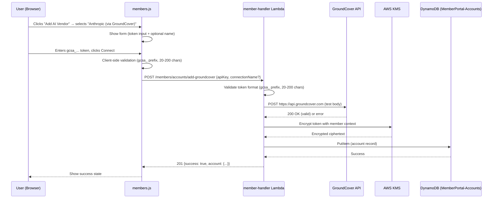

# Design Document: Anthropic GroundCover Connection

## Overview

Add an "Anthropic (via GroundCover)" vendor option to the existing AI vendor connection wizard in the SlashMyBill member portal Configure tab. This mirrors the existing OpenAI connection flow — frontend selection, API key entry with client-side validation, backend token verification against GroundCover's API, KMS encryption, and DynamoDB storage.

## Main Algorithm/Workflow



## Core Interfaces/Types

### Frontend (JavaScript)

```javascript
// Validation result type (same pattern as _validateOpenAIKey)
// { valid: boolean, message: string }

function _validateGroundcoverKey(key) {
    if (!key) return { valid: false, message: 'API token is required.' };
    var trimmed = key.trim();
    if (trimmed.length < 20 || trimmed.length > 200) {
        return { valid: false, message: 'Token must be between 20 and 200 characters.' };
    }
    if (!trimmed.startsWith('gcsa_')) {
        return { valid: false, message: 'Token must start with "gcsa_".' };
    }
    return { valid: true, message: '' };
}
```

### Backend (Python)

```python
# connectors/groundcover_connector.py

GROUNDCOVER_API_BASE = 'https://api.groundcover.com'
VALID_TOKEN_PREFIX = 'gcsa_'
MIN_TOKEN_LENGTH = 20
MAX_TOKEN_LENGTH = 200

def validate_groundcover_token_format(token: str) -> dict:
    """Validate GroundCover token format without API call.
    
    Returns:
        {'valid': True} or {'valid': False, 'error': '<reason>'}
    """
    ...

class GroundcoverConnector:
    """GroundCover AI vendor connector using Bearer token auth."""
    
    def test_connection(self, auth_context: dict, account_id: str) -> dict:
        """Test connectivity by POSTing to GroundCover API.
        
        Args:
            auth_context: {'api_key': '<gcsa_token>'}
            account_id: Account identifier
            
        Returns:
            {'success': True, 'message': '...'} or {'success': False, 'message': '...'}
        """
        ...
```

### DynamoDB Record Schema

```javascript
// MemberPortal-Accounts table record
{
    memberEmail: "user@example.com",        // Partition key
    accountId: "groundcover-a1b2c3d4e5f6",  // Sort key (generated)
    accountName: "My GroundCover Connection", // User-supplied or default
    cloudProvider: "groundcover",            // Internal provider key
    vendorType: "ai_vendor",
    connectionStatus: "connected",          // "connected" | "failed"
    lastTestedAt: "2025-01-15T10:30:00Z",
    addedAt: "2025-01-15T10:30:00Z",
    credentials: {
        encryptedApiKey: "<KMS-encrypted-base64>"
    }
}
```

## Key Functions with Formal Specifications

### Function 1: validate_groundcover_token_format(token)

```python
def validate_groundcover_token_format(token: str) -> dict:
    if not isinstance(token, str):
        return {'valid': False, 'error': 'Token must be a string.'}
    if not token:
        return {'valid': False, 'error': 'Token must not be empty.'}
    if not token.startswith('gcsa_'):
        return {'valid': False, 'error': 'Invalid token format. Token must start with "gcsa_".'}
    if len(token) < 20 or len(token) > 200:
        return {'valid': False, 'error': f'Invalid token length ({len(token)} characters). Must be between 20 and 200.'}
    return {'valid': True}
```

**Preconditions:**
- `token` parameter is provided (may be any type)

**Postconditions:**
- Returns dict with `valid` key (boolean)
- If `valid` is False, `error` key contains descriptive message
- If `valid` is True, no `error` key present
- No side effects

### Function 2: GroundcoverConnector.test_connection(auth_context, account_id)

```python
def test_connection(self, auth_context: dict, account_id: str) -> dict:
    token = auth_context.get('api_key', '')
    headers = {
        'Authorization': f'Bearer {token}',
        'X-Backend-Id': 'groundcover',
        'Content-Type': 'application/json'
    }
    body = {
        'conditions': [],
        'limit': 1,
        'order': 'desc',
        'skip': 0,
        'sortBy': 'rps',
        'sources': []
    }
    try:
        resp = requests.post(GROUNDCOVER_API_BASE, headers=headers, json=body, timeout=10)
        if resp.status_code == 200:
            return {'success': True, 'message': 'GroundCover connection verified.'}
        else:
            return {'success': False, 'message': f'GroundCover returned status {resp.status_code}.'}
    except requests.Timeout:
        return {'success': False, 'message': 'Connection timed out.'}
    except requests.RequestException as e:
        return {'success': False, 'message': f'Connection error: {str(e)[:100]}'}
```

**Preconditions:**
- `auth_context` contains `api_key` string with valid gcsa_ prefix
- `account_id` is a non-empty string

**Postconditions:**
- Returns dict with `success` (bool) and `message` (str) keys
- On success: `success` is True
- On failure: `success` is False, `message` explains reason (max 200 chars)
- No data is persisted (read-only test)
- Timeout at 10 seconds prevents hanging

### Function 3: handle_add_groundcover(event) — Lambda handler

```python
@transaction_log('member-handler')
def handle_add_groundcover(event):
    """Add a new GroundCover AI vendor connection."""
    auth = validate_token(event)
    if isinstance(auth, dict) and 'statusCode' in auth:
        return auth

    member_email = auth['sub']
    body = json.loads(event.get('body', '{}'))
    
    api_key = (body.get('apiKey') or '').strip()
    connection_name = (body.get('connectionName') or '').strip()

    # Validate connection name
    if connection_name and len(connection_name) > 64:
        return create_error_response(400, 'InvalidRequest', 'Connection name must be 64 characters or fewer.')

    # Validate token format
    validation = validate_groundcover_token_format(api_key)
    if not validation['valid']:
        return create_error_response(400, 'InvalidKeyFormat', validation['error'])

    # Generate account ID
    account_id = f"groundcover-{uuid.uuid4().hex[:12]}"

    # Test connection
    connector = GroundcoverConnector()
    test_result = connector.test_connection({'api_key': api_key}, account_id)
    if not test_result.get('success'):
        return create_error_response(400, 'ConnectionFailed', test_result.get('message', 'Connection test failed.'))

    # Encrypt and store
    encrypted_key = encrypt_openai_key(api_key, member_email, account_id)
    
    account_record = {
        'memberEmail': member_email,
        'accountId': account_id,
        'accountName': connection_name or 'Anthropic (via GroundCover)',
        'cloudProvider': 'groundcover',
        'vendorType': 'ai_vendor',
        'connectionStatus': 'connected',
        'lastTestedAt': datetime.now(timezone.utc).isoformat(),
        'addedAt': datetime.now(timezone.utc).isoformat(),
        'credentials': {'encryptedApiKey': encrypted_key},
    }

    accounts_table.put_item(Item=account_record)
    
    return create_response(201, {
        'success': True,
        'message': 'Anthropic (via GroundCover) connection added successfully.',
        'account': {k: v for k, v in account_record.items() if k != 'credentials'},
    })
```

**Preconditions:**
- Event contains valid Authorization header
- Event body is valid JSON with `apiKey` field

**Postconditions:**
- On success: 201 response, account stored in DynamoDB, credentials encrypted
- On auth failure: 401 response, no side effects
- On validation failure: 400 response, no side effects
- On connection test failure: 400 response, no side effects
- On KMS/DynamoDB failure: 500 response

### Function 4: _showAddAIVendorModal() — Updated wizard (JavaScript)

```javascript
// Vendor selection step — add GroundCover option alongside OpenAI
html += '<button id="ai-vendor-select-groundcover" style="...">';
html += '<div style="width:40px;height:40px;background:#6366f1;border-radius:8px;...">GC</div>';
html += '<div><div style="font-weight:600;">Anthropic (via GroundCover)</div>';
html += '<div style="font-size:0.8em;color:#6b7280;">AI usage monitoring via GroundCover</div></div>';
html += '</button>';

// Wire up selection
document.getElementById('ai-vendor-select-groundcover').onclick = function() {
    document.getElementById('ai-vendor-step-select').style.display = 'none';
    document.getElementById('ai-vendor-step-form').style.display = 'block';
    _aiVendorSelectedProvider = 'groundcover';
    _updateAIVendorFormForProvider('groundcover');
};
```

**Preconditions:**
- Modal DOM element exists
- User has clicked "Add AI Vendor" button

**Postconditions:**
- Modal displays both OpenAI and GroundCover options
- Selecting GroundCover shows form with gcsa_ placeholder and correct labels
- Form validation uses `_validateGroundcoverKey` for groundcover provider
- Submit calls `/members/accounts/add-groundcover` endpoint

## Example Usage

### Frontend: Complete connection flow

```javascript
// User selects GroundCover from vendor list
_aiVendorSelectedProvider = 'groundcover';

// Form shows with gcsa_ placeholder
// User enters token: "gcsa_abc123def456ghi789"

// Client validation
var result = _validateGroundcoverKey('gcsa_abc123def456ghi789');
// → { valid: true, message: '' }

// Submit to backend
var data = await api('POST', '/members/accounts/add-groundcover', {
    apiKey: 'gcsa_abc123def456ghi789',
    connectionName: 'Production GroundCover'
});
// → { success: true, account: { accountId: 'groundcover-a1b2c3...', ... } }
```

### Backend: Token validation examples

```python
# Valid token
validate_groundcover_token_format('gcsa_abc123def456ghi789xyz')
# → {'valid': True}

# Missing prefix
validate_groundcover_token_format('sk-abc123def456ghi789xyz')
# → {'valid': False, 'error': 'Invalid token format. Token must start with "gcsa_".'}

# Too short
validate_groundcover_token_format('gcsa_short')
# → {'valid': False, 'error': 'Invalid token length (10 characters). Must be between 20 and 200.'}
```

### Backend: Connection test

```python
connector = GroundcoverConnector()
result = connector.test_connection({'api_key': 'gcsa_valid_token_here_123'}, 'groundcover-abc123')
# → {'success': True, 'message': 'GroundCover connection verified.'}

result = connector.test_connection({'api_key': 'gcsa_invalid_token_here_1'}, 'groundcover-abc123')
# → {'success': False, 'message': 'GroundCover returned status 401.'}
```

## Correctness Properties

*Properties that should hold true across all valid executions of the system.*

### Property 1: Token validation consistency between frontend and backend

*For any* string `s`, if `_validateGroundcoverKey(s)` returns `{valid: true}` on the frontend, then `validate_groundcover_token_format(s)` must also return `{'valid': True}` on the backend. Both implementations enforce the same rules: `gcsa_` prefix and 20-200 character length.

**Validates: Requirements 2.1, 2.3**

### Property 2: Valid tokens always have gcsa_ prefix and correct length

*For any* string `s` that passes validation (either frontend or backend), `s` must start with the prefix `gcsa_` and have length between 20 and 200 characters inclusive.

**Validates: Requirements 2.1, 2.3**

### Property 3: Connection storage preserves identity

*For any* successful `add-groundcover` request with token `t` and connection name `n`, the record stored in DynamoDB must have `cloudProvider='groundcover'`, `vendorType='ai_vendor'`, and `connectionStatus='connected'`, and the encrypted credentials must decrypt back to `t`.

**Validates: Requirements 4.1, 4.2**

### Property 4: Failed connections produce no stored records

*For any* `add-groundcover` request where the GroundCover API test returns a non-200 status, no record shall be written to DynamoDB and a 400 error response shall be returned.

**Validates: Requirements 4.3, 5.2**

### Property 5: Vendor selection state isolation

*For any* sequence of vendor selections in the wizard (OpenAI → GroundCover → OpenAI → ...), switching providers must reset the form state completely — no token value from one provider leaks to the other's form submission.

**Validates: Requirements 1.3**
