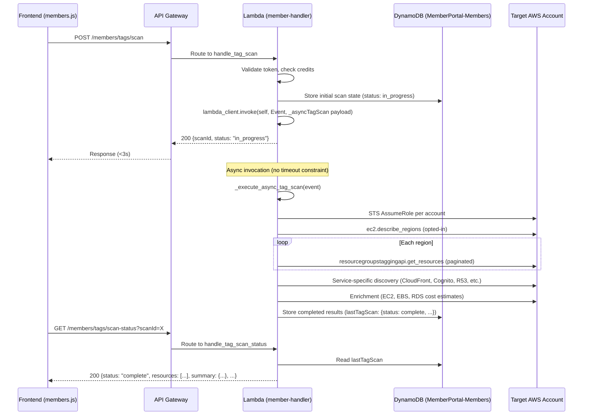

# Design Document: Async Tag Scan

## Overview

This design converts the synchronous tag resource scan (`POST /members/tags/scan`) into an asynchronous execution pattern identical to the existing waste scan (`POST /members/actions/scan`). The current implementation hits the API Gateway 29-second timeout for large AWS accounts because it scans all opted-in regions and evaluates hundreds of resources inline. The async pattern returns immediately with a `scanId`, self-invokes the Lambda asynchronously for background processing, persists results in DynamoDB, and lets the frontend poll a status endpoint until completion.

### Key Design Decisions

1. **Mirror the waste scan pattern exactly** — reuse the proven `Lambda Event invocation` self-invoke + DynamoDB status storage + frontend polling architecture rather than introducing Step Functions or SQS.
2. **Store results under `lastTagScan`** (separate from `lastScan` used by waste scan) — keeps tag scan and waste scan results independent.
3. **Preserve the response payload format** — the async result contains the same `resources`, `summary`, `coverage`, `discoveredTagKeys`, and `untaggableServices` fields so the frontend rendering functions work unchanged.
4. **Reuse existing route** — `POST /members/tags/scan` becomes the kickoff endpoint; a new `GET /members/tags/scan-status` endpoint is added for polling.

## Architecture



## Components and Interfaces

### 1. Scan Kickoff Endpoint (modified `handle_tag_scan`)

**Route:** `POST /members/tags/scan`

**Behavior change:** Instead of executing the full scan synchronously, this handler now:
1. Validates the auth token
2. Loads the member's tag policy (or uses request body / defaults)
3. Checks and consumes credit tokens
4. Resolves account IDs (from body or query all connected accounts)
5. Verifies account ownership
6. Generates a `scanId` (UUID)
7. Writes initial state to DynamoDB (`lastTagScan = {scanId, status: "in_progress", startedAt, accountIds}`)
8. Invokes the Lambda asynchronously with `_asyncTagScan: True` payload
9. Returns `{scanId, status: "in_progress"}` within 3 seconds

**Request body (unchanged):**
```json
{
  "accountIds": ["123456789012"],
  "requiredTags": ["Environment", "Owner"]
}
```

**Response (new):**
```json
{
  "scanId": "uuid-here",
  "status": "in_progress"
}
```

### 2. Scan Status Endpoint (new `handle_tag_scan_status`)

**Route:** `GET /members/tags/scan-status`

**Query Parameters:**
- `scanId` (required) — the UUID returned by the kickoff

**Behavior:**
1. Validates auth token
2. Reads `lastTagScan` from the member's DynamoDB record
3. Verifies `scanId` matches
4. Returns the current state (in_progress / complete / failed)

**Responses:**
- `200` with `{status: "in_progress", startedAt}` — scan still running
- `200` with `{status: "complete", scanId, resources, summary, coverage, requiredTags, discoveredTagKeys, untaggableServices, scannedAt}` — scan done
- `200` with `{status: "failed", error}` — scan encountered an error
- `400` — missing scanId parameter
- `404` — scanId doesn't match the member's current scan

### 3. Async Tag Scan Executor (new `_execute_async_tag_scan`)

**Trigger:** Lambda Event invocation with `_asyncTagScan: True` in the event payload.

**Event payload:**
```json
{
  "_asyncTagScan": true,
  "scanId": "uuid",
  "memberEmail": "user@example.com",
  "accountIds": ["123456789012"],
  "requiredTags": ["Environment", "Owner", "CostCenter", "Application"]
}
```

**Behavior:**
This contains the full scanning logic currently in `handle_tag_scan` — from STS role assumption through region discovery, resource tagging API pagination, service-specific discovery, enrichment, and result assembly. The only differences:
- No timeout guard (the 26-second `_TAG_SCAN_TIMEOUT` is removed)
- On success: writes completed results to DynamoDB under `lastTagScan` with `status: "complete"`
- On failure: writes `{status: "failed", error: "<message>"}` to DynamoDB under `lastTagScan`
- No `accounts[:5]` cap — scans all connected accounts (up to the existing limit in the member's plan)

### 4. Lambda Entry Point Dispatch (modified `lambda_handler`)

Add a new dispatch check before the existing `_asyncScan` check:

```python
if event.get('_asyncTagScan'):
    return _execute_async_tag_scan(event)
```

### 5. Frontend Polling (modified `_runTagScan`)

The frontend `_runTagScan` function is updated to:
1. Call `POST /members/tags/scan` and receive `{scanId, status}`
2. Display "Scanning for untagged resources..." progress message
3. Poll `GET /members/tags/scan-status?scanId=X` every 3–5 seconds
4. On `status: "complete"` — render results using existing `_renderTagStats` / `_renderTagList`
5. On `status: "failed"` — show error message
6. On 120-second timeout — stop polling and show timeout message

### 6. API Gateway Route Registration

Add the new route to the HTTP API configuration:
- `GET /members/tags/scan-status` → member-handler Lambda integration

### 7. Route Table Update

Add to the `routes` dict in `lambda_handler`:
```python
'GET /members/tags/scan-status': handle_tag_scan_status,
```

## Data Models

### DynamoDB: MemberPortal-Members Table

**Attribute:** `lastTagScan` (Map)

**In-progress state:**
```json
{
  "scanId": "uuid-string",
  "status": "in_progress",
  "startedAt": "2024-01-15T10:30:00.000Z",
  "accountIds": ["123456789012"]
}
```

**Complete state:**
```json
{
  "scanId": "uuid-string",
  "status": "complete",
  "startedAt": "2024-01-15T10:30:00.000Z",
  "completedAt": "2024-01-15T10:31:15.000Z",
  "scannedAt": "2024-01-15T10:31:15.000Z",
  "accountIds": ["123456789012"],
  "resources": [
    {
      "arn": "arn:aws:ec2:us-east-1:123456789012:instance/i-abc123",
      "resourceType": "EC2 Instance",
      "resourceId": "i-abc123",
      "name": "web-server-1",
      "account": "123456789012",
      "region": "us-east-1",
      "existingTags": {"Name": "web-server-1", "Environment": "prod"},
      "missingTags": ["Owner", "CostCenter", "Application"],
      "state": "running",
      "estimatedMonthlyCost": 45.26,
      "instanceType": "t3.medium",
      "platform": "Linux"
    }
  ],
  "summary": {
    "total": 142,
    "fullyTagged": 38,
    "partiallyTagged": 67,
    "untagged": 37
  },
  "coverage": 26.8,
  "requiredTags": ["Environment", "Owner", "CostCenter", "Application"],
  "discoveredTagKeys": ["Application", "CostCenter", "Environment", "Name", "Owner", "Project"],
  "untaggableServices": [
    {"service": "AWS Support (Business)", "monthlyCost": 100.00}
  ]
}
```

**Failed state:**
```json
{
  "scanId": "uuid-string",
  "status": "failed",
  "startedAt": "2024-01-15T10:30:00.000Z",
  "error": "Failed to assume role for account 123456789012"
}
```

### DynamoDB Item Size Consideration

The `lastTagScan` attribute may grow large for accounts with thousands of resources. DynamoDB items are limited to 400KB. Mitigation:
- The resource list is already bounded by the number of actual AWS resources (typically < 2000 for most accounts)
- Each resource entry is ~300-500 bytes → 2000 resources ≈ 600KB-1MB which could exceed the limit
- **Large result handling:** If the serialized result exceeds 350KB, store the resources array in S3 and reference the S3 key in DynamoDB. The status endpoint retrieves from S3 if `resourcesS3Key` is present.

### S3 Overflow Storage (conditional)

**Bucket:** Existing deployment bucket or a dedicated `slashmybill-scan-results-{account}` bucket
**Key format:** `tag-scans/{memberEmail}/{scanId}.json`
**Lifecycle:** 7-day expiration policy (results are ephemeral)


## Correctness Properties

*A property is a characteristic or behavior that should hold true across all valid executions of a system — essentially, a formal statement about what the system should do. Properties serve as the bridge between human-readable specifications and machine-verifiable correctness guarantees.*

### Property 1: Resource Classification Correctness

*For any* resource with a set of existing tag keys and *any* tag policy (list of required keys), the resource SHALL be classified as:
- "fullyTagged" if and only if every required key exists in the resource's tags
- "partiallyTagged" if and only if at least one but not all required keys exist in the resource's tags
- "untagged" if and only if none of the required keys exist in the resource's tags

**Validates: Requirements 2.3, 2.4**

### Property 2: Summary Count Invariant

*For any* completed tag scan result with a resources array and summary object, `summary.total` SHALL equal `summary.fullyTagged + summary.partiallyTagged + summary.untagged`, and each count SHALL match the number of resources actually classified into that category.

**Validates: Requirements 5.2**

### Property 3: Tag Policy Fallback Chain

*For any* combination of member state (tag policy present or absent in DynamoDB), request body (requiredTags present or absent), the resolved required tags SHALL follow the priority: DynamoDB tag policy > request body requiredTags > defaults `["Environment", "Owner", "CostCenter", "Application"]`.

**Validates: Requirements 5.4**

### Property 4: Resource Schema Completeness

*For any* resource in a completed tag scan result, the resource object SHALL contain all required fields: `arn` (string), `resourceType` (string), `resourceId` (string), `name` (string), `account` (string), `region` (string), `existingTags` (object), and `missingTags` (array).

**Validates: Requirements 5.1**

### Property 5: Discovered Tag Keys Completeness

*For any* completed tag scan result, the `discoveredTagKeys` array SHALL contain every unique non-`aws:` prefixed tag key that appears in any resource's `existingTags` across all scanned resources.

**Validates: Requirements 5.3**

### Property 6: Status Endpoint Returns Stored State

*For any* scan state stored in DynamoDB (in_progress, complete, or failed) and *any* authenticated request with the matching scanId, the status endpoint SHALL return the stored state. For a non-matching scanId, it SHALL return 404. For a missing scanId parameter, it SHALL return 400.

**Validates: Requirements 3.1, 3.2, 3.3, 3.4, 3.5, 3.6**

### Property 7: Credit Gate Correctness

*For any* member with a given credit balance and tier, the kickoff endpoint SHALL consume credits and proceed only when sufficient credits exist, and SHALL return HTTP 403 without consuming credits or initiating a scan when credits are insufficient.

**Validates: Requirements 1.3, 1.5**

### Property 8: Frontend Stops Polling on Terminal Status

*For any* polling sequence, once the status endpoint returns `"complete"` or `"failed"`, the frontend SHALL make zero additional poll requests.

**Validates: Requirements 4.3, 4.4**

### Property 9: All Opted-In Regions Are Scanned

*For any* set of opted-in regions returned by `ec2.describe_regions`, the background scan SHALL invoke the Resource Groups Tagging API in every region in that set (no region is skipped).

**Validates: Requirements 2.2**

## Error Handling

### Kickoff Endpoint Errors

| Scenario | Response | Side Effects |
|----------|----------|--------------|
| Invalid/expired auth token | 401 `AuthError` | None |
| Account not owned by member | 403 `Forbidden` | None |
| Insufficient credits | 403 (credit error) | No credits consumed |
| No connected accounts | 200 `{resources: [], summary: {total:0,...}}` | Credits consumed (matches current behavior) |
| Lambda self-invocation fails | 500 `ServerError` | Credits already consumed (non-refundable) |
| DynamoDB write failure (initial state) | Non-fatal — scan still proceeds | Log warning |

### Background Scan Errors

| Scenario | DynamoDB State | Notes |
|----------|---------------|-------|
| STS AssumeRole fails for all accounts | `status: "failed"`, error message | Scan cannot proceed |
| STS fails for one account (multi-account) | Partial results stored as `status: "complete"` | Skip failed account, scan remaining |
| ResourceGroupsTaggingAPI throttled | Retry with exponential backoff (3 attempts) | If all retries fail, skip region |
| Unhandled exception | `status: "failed"`, error = exception message | Caught by top-level try/except |
| DynamoDB item size exceeds 400KB | Store resources in S3, reference S3 key in DynamoDB | Transparent to frontend |

### Status Endpoint Errors

| Scenario | Response |
|----------|----------|
| Missing scanId param | 400 `InvalidRequest` |
| scanId doesn't match member's scan | 404 `NotFound` |
| DynamoDB read failure | 500 `ServerError` |

### Frontend Error Handling

| Scenario | Behavior |
|----------|----------|
| Poll returns non-200 | Retry on next interval (transient error) |
| Poll timeout (120s) | Stop polling, show "Scan timed out — please try again" |
| Kickoff returns error | Show error immediately, no polling |
| Network failure during poll | Retry on next interval |

## Testing Strategy

### Unit Tests (Example-Based)

1. **Kickoff returns scanId** — verify POST /members/tags/scan returns `{scanId, status: "in_progress"}` with valid auth
2. **Auth rejection** — verify 401 for invalid token
3. **Credit rejection** — verify 403 when credits insufficient
4. **Status endpoint — missing param** — verify 400 when scanId not provided
5. **Status endpoint — wrong scanId** — verify 404 when scanId doesn't match
6. **Background scan failure handling** — inject exception, verify status becomes "failed"
7. **New scan replaces old** — initiate scan B after scan A, verify only B is stored
8. **Frontend timeout at 120s** — simulate in_progress forever, verify polling stops

### Property-Based Tests

Property-based tests use **Hypothesis** (Python) for backend logic and **fast-check** (JavaScript) for frontend polling logic.

Each property test runs a minimum of **100 iterations** with randomized inputs.

**Backend (Hypothesis):**
- **Property 1:** Generate random `existingTags` dicts and `requiredTags` lists → verify classification function
- **Property 2:** Generate random classified resource lists → verify summary aggregation
- **Property 3:** Generate random `(tagPolicy, bodyRequiredTags)` combinations → verify fallback resolution
- **Property 4:** Generate random resource dicts → verify all required fields present after scan processing
- **Property 5:** Generate random resources with random tag dicts → verify discoveredTagKeys completeness
- **Property 6:** Generate random scan states → mock DynamoDB → verify status endpoint behavior
- **Property 7:** Generate random `(creditBalance, tier, cost)` tuples → verify credit gate logic

**Frontend (fast-check):**
- **Property 8:** Generate random poll response sequences ending in terminal status → verify no polls after terminal
- **Property 9:** (Backend) Generate random region lists → mock AWS → verify all regions hit

### Integration Tests

1. **End-to-end async flow** — start scan, poll until complete, verify results format
2. **Lambda self-invocation** — verify `lambda_client.invoke` is called with `InvocationType='Event'`
3. **DynamoDB persistence** — verify `lastTagScan` attribute is written and readable
4. **S3 overflow** — simulate large result, verify S3 storage and retrieval

### Test Configuration

```python
# Backend property tests (conftest.py)
from hypothesis import settings
settings.register_profile("ci", max_examples=100)
settings.load_profile("ci")
```

```javascript
// Frontend property tests
import fc from 'fast-check';
// Each property: fc.assert(fc.property(...), { numRuns: 100 })
```

**Tag format for property tests:**
```python
# Feature: async-tag-scan, Property 1: Resource Classification Correctness
# Feature: async-tag-scan, Property 2: Summary Count Invariant
```
