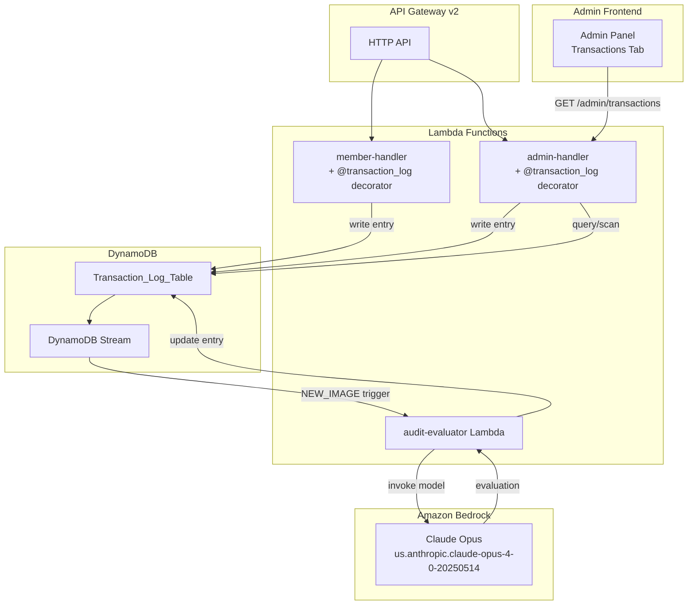

# Design Document: Audit Transaction Log

## Overview

The Audit Transaction Log feature adds comprehensive observability to the SlashMyCloudBill platform. It introduces three core subsystems:

1. **Transaction Logger** — A Python decorator that wraps every handler function in `member-handler` and `admin-handler`, capturing request/response data, timing, and metadata into a dedicated DynamoDB table.
2. **Audit Agent** — A DynamoDB Streams-triggered Lambda that invokes Amazon Bedrock (Claude Opus) to evaluate each logged transaction for quality, accuracy, and response time.
3. **Admin Transaction UI** — A new "Transactions" tab in the Admin panel that exposes a paginated, filterable, searchable table of all logged transactions with their audit evaluations.

The design prioritizes non-intrusiveness (the decorator must not affect handler behavior), fault tolerance (logging failures must not disrupt user requests), and security (sensitive fields are stripped before persistence).

## Architecture



### Key Architecture Decisions

| Decision | Rationale |
|----------|-----------|
| Python decorator pattern | Matches existing handler structure (route dict → handler functions). Zero modification to individual handlers. |
| DynamoDB Streams + separate Lambda | Decouples audit evaluation from the request path. The 30s SLA doesn't block user requests. |
| Single table for entries + evaluations | Avoids cross-table joins. Audit results are written as attribute updates on the same item. |
| Claude Opus via Bedrock | Provides high-quality evaluation with structured output. Available in us-east-1. |
| Frontend-side filtering | Matches existing admin panel patterns (client-side sort/filter on loaded data with pagination). |

## Components and Interfaces

### 1. Transaction Logger Module (`transaction_logger.py`)

A shared module imported by both `member-handler` and `admin-handler`.

```python
# transaction_logger.py

SENSITIVE_FIELDS = {'password', 'token', 'jwt', 'secret', 'authorization',
                    'jwt_secret', 'password_hash', 'new_password', 'old_password'}

def transaction_log(source_handler: str):
    """Decorator factory. source_handler is 'member-handler' or 'admin-handler'."""
    def decorator(handler_fn):
        @functools.wraps(handler_fn)
        def wrapper(event):
            transaction_id = str(uuid.uuid4())
            start_time = time.time()
            start_iso = datetime.now(timezone.utc).isoformat()
            user_email = _extract_user_email(event)
            function_name = _extract_function_name(event)

            try:
                response = handler_fn(event)
                status = 'success'
            except Exception as e:
                response = create_error_response(500, 'ServerError', str(e))
                status = 'error'

            end_time = time.time()
            duration_ms = int((end_time - start_time) * 1000)

            entry = {
                'transaction_id': transaction_id,
                'start_timestamp': start_iso,
                'end_timestamp': datetime.now(timezone.utc).isoformat(),
                'user_email': user_email,
                'function_name': function_name,
                'request_payload': _sanitize(event),
                'response_payload': _sanitize(response),
                'duration_ms': duration_ms,
                'source_handler': source_handler,
                'status': status,
                'expiry_ttl': int(start_time) + (90 * 24 * 60 * 60),
                'audit_status': 'pending',
            }
            _persist_async(entry)
            return response
        return wrapper
    return decorator

def _sanitize(payload: dict) -> dict:
    """Deep-copy payload and remove sensitive fields."""
    ...

def _extract_user_email(event: dict) -> str:
    """Extract email from JWT claims or request body."""
    ...

def _extract_function_name(event: dict) -> str:
    """Extract function/route name from routeKey."""
    ...

def _persist_async(entry: dict):
    """Write to DynamoDB. Swallow errors and log to CloudWatch."""
    ...
```

### 2. Audit Evaluator Lambda (`audit-evaluator/lambda_function.py`)

Triggered by DynamoDB Streams on the Transaction_Log_Table.

```python
def lambda_handler(event, context):
    for record in event['Records']:
        if record['eventName'] != 'INSERT':
            continue
        image = record['dynamodb']['NewImage']
        entry = _unmarshall(image)
        evaluation = _evaluate_with_bedrock(entry)
        _update_entry_with_evaluation(entry['transaction_id'], entry['start_timestamp'], evaluation)
```

**Bedrock Prompt Structure:**
```
You are an audit agent evaluating API transaction quality.

Transaction Context:
- Function: {function_name}
- Duration: {duration_ms}ms
- Request: {request_payload}
- Response: {response_payload}

Evaluate and return JSON:
{
  "score": <0-100>,
  "accuracy_assessment": "<text>",
  "timing_assessment": "<text>",
  "improvement_suggestions": "<text>"
}
```

### 3. Admin Handler — Transaction Log Routes

New routes added to the admin-handler route dict:

| Route | Handler | Description |
|-------|---------|-------------|
| `GET /admin/transactions` | `handle_get_transactions` | Paginated list with optional filters |
| `GET /admin/transactions/detail` | `handle_get_transaction_detail` | Single entry with full payloads |

```python
# Added to admin-handler routes dict:
'GET /admin/transactions': handle_get_transactions,
'GET /admin/transactions/detail': handle_get_transaction_detail,
```

**Query Parameters for `GET /admin/transactions`:**
- `page` (int, default 1)
- `page_size` (int, default 50)
- `user_email` (string, optional — uses GSI)
- `function_name` (string, optional — uses GSI)
- `status` (string, optional)
- `score_min` (int, optional)
- `score_max` (int, optional)
- `date_from` (ISO string, optional)
- `date_to` (ISO string, optional)
- `search` (string, optional — client-side text match)

### 4. Admin Frontend — Transactions Tab

A new tab added to `admin/index.html` following the existing tab pattern:

```html
<button class="tab-btn" data-tab="transactions">Transactions</button>
```

The UI includes:
- Search bar (text filter across user_email, function_name, request_payload)
- Filter row: date range pickers, score range sliders, status dropdown, source_handler dropdown
- Paginated table with sortable columns
- Detail modal on row click showing full payloads and audit evaluation
- Color-coded score badge (green ≥70, yellow 40-69, red <40)
- "Pending" indicator for entries awaiting audit

## Data Models

### Transaction_Log_Table Schema

| Attribute | Type | Key | Description |
|-----------|------|-----|-------------|
| `transaction_id` | String (UUID v4) | Partition Key | Unique identifier |
| `start_timestamp` | String (ISO 8601) | Sort Key | When the handler began |
| `end_timestamp` | String (ISO 8601) | — | When the handler completed |
| `user_email` | String | GSI-1 PK | Extracted from JWT or body |
| `function_name` | String | GSI-2 PK | Route key (e.g., `POST /members/login`) |
| `request_payload` | Map | — | Sanitized request (sensitive fields removed) |
| `response_payload` | Map | — | Sanitized response |
| `duration_ms` | Number | — | Execution time in milliseconds |
| `source_handler` | String | — | `member-handler` or `admin-handler` |
| `status` | String | — | `success` or `error` |
| `expiry_ttl` | Number | — | Unix timestamp for TTL (start + 90 days) |
| `audit_status` | String | — | `pending`, `completed`, `failed` |
| `audit_score` | Number | — | 0-100 (set by Audit Agent) |
| `audit_accuracy_assessment` | String | — | Set by Audit Agent |
| `audit_timing_assessment` | String | — | Set by Audit Agent |
| `audit_improvement_suggestions` | String | — | Set by Audit Agent |
| `audit_evaluated_at` | String (ISO 8601) | — | When evaluation completed |

### Global Secondary Indexes

| GSI Name | Partition Key | Sort Key | Projection |
|----------|--------------|----------|------------|
| `user-email-index` | `user_email` | `start_timestamp` | ALL |
| `function-name-index` | `function_name` | `start_timestamp` | ALL |

### DynamoDB Table Configuration

```yaml
TransactionLogTable:
  Type: AWS::DynamoDB::Table
  Properties:
    TableName: Audit_Transaction_Log
    BillingMode: PAY_PER_REQUEST
    AttributeDefinitions:
      - AttributeName: transaction_id
        AttributeType: S
      - AttributeName: start_timestamp
        AttributeType: S
      - AttributeName: user_email
        AttributeType: S
      - AttributeName: function_name
        AttributeType: S
    KeySchema:
      - AttributeName: transaction_id
        KeyType: HASH
      - AttributeName: start_timestamp
        KeyType: RANGE
    GlobalSecondaryIndexes:
      - IndexName: user-email-index
        KeySchema:
          - AttributeName: user_email
            KeyType: HASH
          - AttributeName: start_timestamp
            KeyType: RANGE
        Projection:
          ProjectionType: ALL
      - IndexName: function-name-index
        KeySchema:
          - AttributeName: function_name
            KeyType: HASH
          - AttributeName: start_timestamp
            KeyType: RANGE
        Projection:
          ProjectionType: ALL
    TimeToLiveSpecification:
      AttributeName: expiry_ttl
      Enabled: true
    StreamSpecification:
      StreamViewType: NEW_IMAGE
```

## Correctness Properties

*A property is a characteristic or behavior that should hold true across all valid executions of a system — essentially, a formal statement about what the system should do. Properties serve as the bridge between human-readable specifications and machine-verifiable correctness guarantees.*

### Property 1: Transaction Entry Structural Completeness

*For any* valid handler event processed by the `@transaction_log` decorator, the resulting Transaction_Entry SHALL contain all required fields (`transaction_id`, `user_email`, `function_name`, `request_payload`, `response_payload`, `start_timestamp`, `end_timestamp`, `duration_ms`, `source_handler`, `status`) with `transaction_id` being a valid UUID v4 string.

**Validates: Requirements 1.2, 1.4**

### Property 2: Error Status Capture

*For any* handler function that raises an exception when wrapped by `@transaction_log`, the resulting Transaction_Entry SHALL have `status` set to `"error"` and `response_payload` SHALL contain the exception message string.

**Validates: Requirements 1.3**

### Property 3: Decorator Transparency

*For any* handler function and any input event, the return value of the decorated function SHALL be identical to the return value of the undecorated function (for success cases), regardless of whether the DynamoDB write succeeds or fails.

**Validates: Requirements 1.5, 7.1**

### Property 4: TTL Computation Correctness

*For any* Transaction_Entry created by the decorator, the `expiry_ttl` attribute SHALL equal the Unix timestamp of `start_timestamp` plus exactly 7,776,000 seconds (90 days).

**Validates: Requirements 2.4**

### Property 5: Sensitive Field Exclusion

*For any* request or response payload containing fields whose keys match the sensitive field set (password, token, jwt, secret, authorization, password_hash, new_password, old_password), the sanitized output stored in the Transaction_Entry SHALL NOT contain any of those field values at any nesting depth.

**Validates: Requirements 7.3**

### Property 6: Audit Evaluation Parsing

*For any* valid JSON response from Bedrock containing `score`, `accuracy_assessment`, `timing_assessment`, and `improvement_suggestions`, the parser SHALL extract all four fields with `score` as an integer in range [0, 100].

**Validates: Requirements 3.2**

### Property 7: Audit Prompt Completeness

*For any* Transaction_Entry passed to the audit prompt builder, the resulting prompt string SHALL contain the `function_name`, `duration_ms`, `request_payload`, and `response_payload` values from that entry.

**Validates: Requirements 3.3**

### Property 8: Filter Correctness

*For any* set of Transaction_Entries and any combination of filters (text search, date range, score range, status, source_handler), every entry in the filtered result set SHALL satisfy ALL active filter predicates, and no entry satisfying all predicates SHALL be excluded.

**Validates: Requirements 5.1, 5.2**

### Property 9: Score-to-Color Mapping

*For any* integer score in range [0, 100], the badge color function SHALL return `"green"` for scores ≥ 70, `"yellow"` for scores in [40, 69], and `"red"` for scores ≤ 39.

**Validates: Requirements 6.1**

## Error Handling

| Scenario | Handling Strategy |
|----------|-------------------|
| DynamoDB write failure in decorator | Log error to CloudWatch, return original handler response unchanged. Never raise to caller. |
| Bedrock invocation timeout (>30s) | Mark `audit_status` as `"pending"`, retry up to 3 times with exponential backoff (2s, 4s, 8s). After 3 failures, set `audit_status` to `"failed"`. |
| Bedrock returns malformed JSON | Parse what's available, set missing fields to `null`, mark `audit_status` as `"failed"` with error detail. |
| Audit evaluator Lambda timeout | Configure Lambda timeout at 60s. DLQ on the DynamoDB Stream for unprocessed records. |
| JWT validation failure on transaction log endpoints | Return HTTP 401 with standard error body (reuses existing `validate_token()` pattern). |
| User email extraction failure | Default to `"unknown"` — never block the original request. |
| Oversized payload (>400KB DynamoDB limit) | Truncate `request_payload` and `response_payload` to 100KB each, add `"_truncated": true` flag. |

## Testing Strategy

### Unit Tests (pytest)

- Test `_sanitize()` function with various nested payloads containing sensitive fields
- Test `_extract_user_email()` with JWT events, body-based auth, and missing auth
- Test `_extract_function_name()` with various routeKey formats
- Test score-to-color badge mapping function
- Test TTL computation
- Test filter logic for each filter type

### Property-Based Tests (Hypothesis)

Each correctness property will be implemented as a property-based test using **Hypothesis** (Python PBT library).

Configuration:
- Minimum 100 iterations per property test (`@settings(max_examples=100)`)
- Each test tagged with design property reference

| Property | Test File | Description |
|----------|-----------|-------------|
| Property 1 | `tests/test_transaction_logger_props.py` | Generate random events, verify entry structure |
| Property 2 | `tests/test_transaction_logger_props.py` | Generate failing handlers, verify error capture |
| Property 3 | `tests/test_transaction_logger_props.py` | Generate handlers + mock DynamoDB failures, verify response unchanged |
| Property 4 | `tests/test_transaction_logger_props.py` | Generate timestamps, verify TTL = start + 90d |
| Property 5 | `tests/test_transaction_logger_props.py` | Generate payloads with sensitive fields at random depths, verify exclusion |
| Property 6 | `tests/test_audit_evaluator_props.py` | Generate Bedrock JSON responses, verify parsing |
| Property 7 | `tests/test_audit_evaluator_props.py` | Generate Transaction_Entries, verify prompt content |
| Property 8 | `tests/test_filter_props.py` | Generate entry sets + filter combos, verify correctness |
| Property 9 | `tests/test_filter_props.py` | Generate scores 0-100, verify color assignment |

Tag format: `# Feature: audit-transaction-log, Property {N}: {title}`

### Integration Tests

- End-to-end test: invoke member-handler, verify entry appears in DynamoDB
- End-to-end test: insert entry, verify DynamoDB Stream triggers audit-evaluator
- API test: `GET /admin/transactions` with/without auth
- Performance: verify page load < 3s with 1000 entries

### Smoke Tests

- Verify Transaction_Log_Table exists with correct schema
- Verify GSIs exist with correct key configurations
- Verify TTL is enabled on `expiry_ttl` attribute
- Verify DynamoDB Stream is configured with `NEW_IMAGE`
