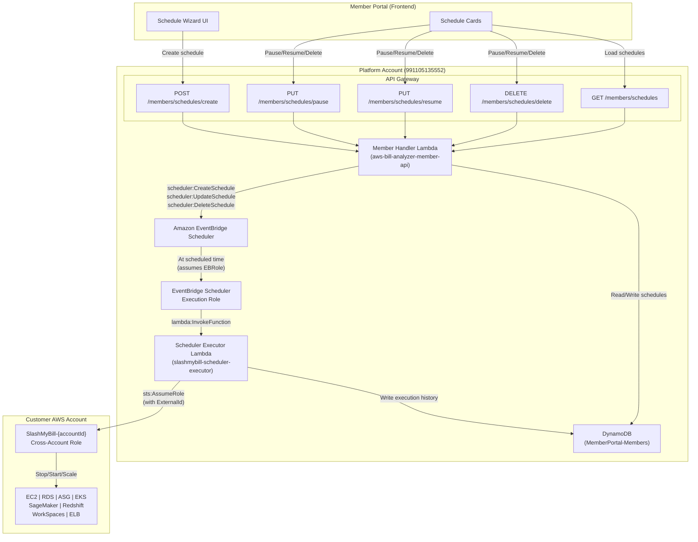

# Design Document: Automated Scheduler

## Overview

The Automated Scheduler converts SlashMyBill's existing schedule-intent-only Scheduler into a real execution engine. Today, `handle_create_schedule` saves a schedule record to DynamoDB (`userSchedules` array on the member item) but nothing actually runs. This design introduces:

1. A new **Scheduler Executor Lambda** (`scheduler-executor/lambda_function.py`) that receives EventBridge Scheduler payloads and performs cross-account stop/start/scale/scan actions via STS AssumeRole.
2. **EventBridge Scheduler integration** in the existing Member Handler — when a member creates a schedule, the handler creates real EventBridge Scheduler schedules (a pair for stop/start types, a single schedule for review types) that invoke the executor at the configured times.
3. **Lifecycle management endpoints** (pause, resume, delete) that enable/disable/remove EventBridge schedules and update DynamoDB state.
4. **Execution history tracking** — the executor writes per-execution records to DynamoDB so the frontend can display real status, next-run time, and a history log.
5. **Cross-account role permission expansion** — the CloudFormation template generator adds the missing write permissions (RDS, EKS, SageMaker, Redshift, WorkSpaces, ec2:ModifyVolume, ec2:StartInstances).
6. **Frontend schedule cards** with real status, next execution time, pause/resume/delete buttons, and expandable execution history.

The design keeps the executor Lambda isolated from the member API so it can be independently scaled, monitored, and have its own IAM role scoped to cross-account STS and DynamoDB writes.

7. **Knowledge Base Tips integration** — scheduling-related tips in the `ViewMyBill-CostOptimizationTips` table are updated with `implementedInScheduler: true` and descriptions that point to Act → Scheduler instead of external tools. The AI chat prompt is tightened to always deep-link to the scheduler.
8. **Admin Panel scheduler visibility** — the admin panel gets a "⏰ Sched" badge on tips, a schedule count column on the Subscribers table, and a new Schedules overview section showing all schedules across all members with execution stats and failure drill-down.

## Architecture



### Key Design Decisions

1. **Separate Executor Lambda vs. reusing Member Handler**: The executor runs on EventBridge's schedule, not on API Gateway requests. It needs a different IAM role (STS AssumeRole to customer accounts, no Cognito/SES). Keeping it separate means the member API's 120s timeout and 256MB memory don't constrain batch resource operations, and we can set the executor to 512MB / 300s.

2. **EventBridge Scheduler (not EventBridge Rules)**: EventBridge Scheduler supports one-time and recurring schedules with timezone-aware cron expressions, built-in retry policies, and dead-letter queues. It's purpose-built for this use case.

3. **Schedule Pair pattern**: For stop/start types, we create two EventBridge schedules — one for the stop action and one for the start action. Each has its own cron expression derived from the member's configured days/times. The schedule names follow the pattern `smb-{scheduleId}-stop` and `smb-{scheduleId}-start`.

4. **DynamoDB single-table design**: We continue storing schedule data on the member item in `MemberPortal-Members`. The `userSchedules` array gets enriched with `ebScheduleNames`, `ebScheduleArns`, `executionHistory`, and `originalScaleValues`. This avoids creating a new table and keeps the existing `handle_get_schedules` query pattern intact.

5. **Idempotent executor**: The executor checks resource state before acting (e.g., won't stop an already-stopped instance). This handles EventBridge's at-least-once delivery and avoids errors on retries.

## Components and Interfaces

### 1. Member Handler — Schedule Creation (modified `handle_create_schedule`)

The existing function is enhanced to create real EventBridge Scheduler schedules.

```python
# Input: POST /members/schedules/create
{
    "type": "ec2-stop-start",       # schedule type
    "name": "Dev instances off-hours",
    "frequency": "weekly",           # weekly | daily | custom-cron
    "config": {
        "accountId": "123456789012",
        "resources": ["i-0abc123", "i-0def456"],  # or tagFilter below
        "tagFilter": {"Key": "Environment", "Value": "dev"},
        "stopDays": ["Mon", "Tue", "Wed", "Thu", "Fri"],
        "stopTime": "19:00",
        "startDays": ["Mon", "Tue", "Wed", "Thu", "Fri"],
        "startTime": "07:00",
        "timezone": "America/New_York"
    },
    "notes": "Stop dev instances outside business hours"
}

# Output: 201
{
    "message": "Schedule \"Dev instances off-hours\" created",
    "schedule": {
        "id": "sched-a1b2c3d4",
        "type": "ec2-stop-start",
        "name": "Dev instances off-hours",
        "status": "active",
        "ebScheduleNames": ["smb-sched-a1b2c3d4-stop", "smb-sched-a1b2c3d4-start"],
        "nextExecution": "2025-01-20T19:00:00-05:00",
        "createdAt": "2025-01-20T10:30:00Z"
    }
}
```

### 2. Member Handler — Lifecycle Endpoints

```python
# Pause: PUT /members/schedules/pause
{"scheduleId": "sched-a1b2c3d4"}
# → Calls scheduler:UpdateSchedule with State=DISABLED for each EB schedule
# → Updates status to "paused" in DynamoDB

# Resume: PUT /members/schedules/resume
{"scheduleId": "sched-a1b2c3d4"}
# → Calls scheduler:UpdateSchedule with State=ENABLED for each EB schedule
# → Updates status to "active" in DynamoDB

# Delete: DELETE /members/schedules/delete
{"scheduleId": "sched-a1b2c3d4"}
# → Calls scheduler:DeleteSchedule for each EB schedule
# → Removes schedule from userSchedules array in DynamoDB
```

### 3. Scheduler Executor Lambda

```python
# EventBridge Scheduler payload (set as Target Input)
{
    "scheduleId": "sched-a1b2c3d4",
    "scheduleType": "ec2-stop-start",
    "action": "stop",                    # stop | start | scan
    "accountId": "123456789012",
    "memberEmail": "user@example.com",
    "resources": ["i-0abc123", "i-0def456"],
    "tagFilter": null                    # or {"Key": "...", "Value": "..."}
}
```

The executor follows this flow:
1. Parse payload and validate required fields
2. Look up member in DynamoDB to get ExternalId (SHA256 of email)
3. Assume `SlashMyBill-{accountId}` role with ExternalId
4. If `tagFilter` is set, resolve resources via `resourcegroupstaggingapi:GetResources`
5. Dispatch to the appropriate action handler based on `scheduleType` + `action`
6. Execute actions per-resource, collecting per-resource success/failure
7. Write execution record to DynamoDB (`executionHistory` on the schedule)

#### Action Handler Interface

Each action handler follows a common interface:

```python
def execute_ec2_stop(cross_account_session, resources: list[str]) -> list[ResourceResult]:
    """Stop EC2 instances. Returns per-resource success/failure."""
    ...

def execute_ec2_start(cross_account_session, resources: list[str]) -> list[ResourceResult]:
    """Start EC2 instances. Returns per-resource success/failure."""
    ...

# Similar for: rds_stop, rds_start, asg_scale_zero, asg_restore,
#              eks_scale_zero, eks_restore, sagemaker_stop, sagemaker_start,
#              redshift_pause, redshift_resume, workspaces_autostop,
#              elb_teardown, waste_scan, snapshot_cleanup,
#              gp2_migration, commitment_review
```

```python
@dataclass
class ResourceResult:
    resource_id: str
    success: bool
    error: str | None = None
```

### 4. EventBridge Scheduler Execution Role

A new IAM role that EventBridge Scheduler assumes to invoke the executor Lambda:

```
Role: SlashMyBill-EventBridge-Scheduler-Role
Trust: scheduler.amazonaws.com
Policy: lambda:InvokeFunction on arn:aws:lambda:us-east-1:991105135552:function:slashmybill-scheduler-executor
```

### 5. Frontend Schedule Cards (modified `members.js`)

The `_renderSchedulerList` function is updated to render real schedule cards with:
- Status badge (Active / Paused)
- Next execution time (formatted in schedule timezone)
- Pause / Resume / Delete buttons
- Expandable execution history log (last 10 runs)

#### Schedule Card Layout

```
┌─────────────────────────────────────────────────────────────┐
│ 🖥️ Dev instances off-hours          [Active] ●  [⏸ Pause] [🗑 Delete] │
│ ec2-stop-start · 2 resources · Mon-Fri                      │
│ Stop 19:00 → Start 07:00 (America/New_York)                 │
│ Next run: Mon Jan 20, 7:00 PM EST                            │
│                                                               │
│ ▶ Execution History (3 runs)                                  │
│ ┌───────────────────────────────────────────────────────────┐ │
│ │ ✅ Jan 20, 7:00 PM  stop   2/2 succeeded                 │ │
│ │ ✅ Jan 20, 7:00 AM  start  2/2 succeeded                 │ │
│ │ ⚠️ Jan 19, 7:00 PM  stop   1/2 succeeded  1 failed       │ │
│ │    └─ i-0def456: Instance not found                       │ │
│ │ ❌ Jan 18, 7:00 PM  stop   0/2 failed                    │ │
│ │    └─ AccessDenied: Role does not exist                   │ │
│ └───────────────────────────────────────────────────────────┘ │
└─────────────────────────────────────────────────────────────┘
```

#### Execution History Rendering

Each execution record from `executionHistory` is rendered as a row inside a collapsible `<details>` element:

- **Status icon**: ✅ for `success`, ⚠️ for `partial`, ❌ for `failure`
- **Timestamp**: Formatted in the schedule's configured timezone (e.g., "Jan 20, 7:00 PM EST")
- **Action**: `stop`, `start`, or `scan`
- **Resource counts**: `successCount/resourceCount succeeded` — if `failureCount > 0`, show `failureCount failed` in red
- **Failure details** (expandable): When `failureCount > 0`, a nested list shows each failed resource ID and its error message from the `details` array
- **Empty state**: If `executionHistory` is empty, show "No executions yet — schedule will run at the next scheduled time"

The history section header shows the total count: "Execution History (N runs)" where N = `executionHistory.length`.

#### Color Coding

| Status | Badge Color | Icon |
|--------|-------------|------|
| `success` | Green (#10b981) | ✅ |
| `partial` | Amber (#f59e0b) | ⚠️ |
| `failure` | Red (#ef4444) | ❌ |
| `active` schedule | Green badge | ● |
| `paused` schedule | Gray badge | ⏸ |

### 6. Cross-Account Template Updates (modified `handle_generate_template`)

The inline policy in the generated CloudFormation template is extended with:
- `ec2:StartInstances`
- `rds:StopDBInstance`, `rds:StartDBInstance`
- `eks:UpdateNodegroupConfig`, `eks:DescribeNodegroup`
- `sagemaker:StopNotebookInstance`, `sagemaker:StartNotebookInstance`
- `redshift:PauseCluster`, `redshift:ResumeCluster`
- `workspaces:ModifyWorkspaceProperties`
- `ec2:ModifyVolume`

## Data Models

### Schedule Record (in `userSchedules` array on member DynamoDB item)

```json
{
    "id": "sched-a1b2c3d4",
    "type": "ec2-stop-start",
    "name": "Dev instances off-hours",
    "frequency": "weekly",
    "status": "active",
    "config": {
        "accountId": "123456789012",
        "resources": ["i-0abc123", "i-0def456"],
        "tagFilter": null,
        "stopDays": ["Mon", "Tue", "Wed", "Thu", "Fri"],
        "stopTime": "19:00",
        "startDays": ["Mon", "Tue", "Wed", "Thu", "Fri"],
        "startTime": "07:00",
        "timezone": "America/New_York"
    },
    "notes": "Stop dev instances outside business hours",
    "ebScheduleNames": ["smb-sched-a1b2c3d4-stop", "smb-sched-a1b2c3d4-start"],
    "ebScheduleArns": [
        "arn:aws:scheduler:us-east-1:991105135552:schedule/default/smb-sched-a1b2c3d4-stop",
        "arn:aws:scheduler:us-east-1:991105135552:schedule/default/smb-sched-a1b2c3d4-start"
    ],
    "originalScaleValues": null,
    "createdAt": "2025-01-20T10:30:00Z",
    "executionHistory": [
        {
            "timestamp": "2025-01-20T19:00:05Z",
            "action": "stop",
            "status": "success",
            "resourceCount": 2,
            "successCount": 2,
            "failureCount": 0,
            "details": [
                {"resourceId": "i-0abc123", "success": true},
                {"resourceId": "i-0def456", "success": true}
            ]
        }
    ]
}
```

### Review-Type Schedule Record

```json
{
    "id": "sched-e5f6g7h8",
    "type": "waste-scan",
    "name": "Weekly waste scan",
    "frequency": "weekly",
    "status": "active",
    "config": {
        "accountId": "123456789012",
        "scanTime": "06:00",
        "scanDay": "Mon",
        "timezone": "UTC"
    },
    "ebScheduleNames": ["smb-sched-e5f6g7h8-scan"],
    "ebScheduleArns": ["arn:aws:scheduler:us-east-1:991105135552:schedule/default/smb-sched-e5f6g7h8-scan"],
    "createdAt": "2025-01-20T11:00:00Z",
    "executionHistory": []
}
```

### EventBridge Scheduler Cron Expression Mapping

| Config | Cron Expression |
|--------|----------------|
| Daily at 19:00 EST | `cron(0 19 * * ? *)` with timezone `America/New_York` |
| Weekdays at 07:00 EST | `cron(0 7 ? * MON-FRI *)` with timezone `America/New_York` |
| Weekly Monday 06:00 UTC | `cron(0 6 ? * MON *)` with timezone `UTC` |


## Correctness Properties

*A property is a characteristic or behavior that should hold true across all valid executions of a system — essentially, a formal statement about what the system should do. Properties serve as the bridge between human-readable specifications and machine-verifiable correctness guarantees.*

### Property 1: Cron expression generation correctness

*For any* valid schedule configuration containing days (subset of Mon–Sun), a time (HH:MM in 00:00–23:59), and a valid IANA timezone, the generated EventBridge cron expression SHALL be syntactically valid and, when parsed, SHALL produce the same day-of-week set and hour/minute as the input configuration.

**Validates: Requirements 1.1, 1.2**

### Property 2: Schedule payload completeness

*For any* valid schedule configuration (with a schedule type, account ID, member email, and either resource ARNs or a tag filter), the constructed EventBridge Scheduler target payload SHALL contain all required fields: scheduleId, scheduleType, action, accountId, memberEmail, and either resources or tagFilter.

**Validates: Requirements 1.3**

### Property 3: Action dispatch routing correctness

*For any* valid combination of scheduleType (one of ec2-stop-start, rds-stop-start, asg-scale-zero, eks-scale-zero, sagemaker-stop, redshift-pause, workspaces-autostop, elb-teardown, waste-scan, snapshot-cleanup, gp2-migration, commitment-review) and action (stop, start, or scan), the executor's dispatch function SHALL route to the correct handler function for that (type, action) pair, and SHALL raise an error for invalid combinations (e.g., start for elb-teardown).

**Validates: Requirements 2.1–2.18**

### Property 4: Partial failure continuation and count invariant

*For any* list of N resources where each resource action independently succeeds or fails, the executor SHALL process all N resources (not short-circuit on failure), and the resulting execution record SHALL have successCount + failureCount == N and resourceCount == N.

**Validates: Requirements 2.20**

### Property 5: Schedule ownership authorization

*For any* authenticated member and any schedule ID, if the schedule does not exist in that member's userSchedules array, then pause, resume, and delete operations SHALL return a 403 or 404 error and SHALL NOT modify any EventBridge schedules or DynamoDB records.

**Validates: Requirements 4.4**

### Property 6: Execution record field completeness

*For any* execution result (success, partial success, or failure), the written execution record SHALL contain all required fields: timestamp (ISO 8601), action, status (success/partial/failure), resourceCount, successCount, failureCount, and a details array with per-resource entries.

**Validates: Requirements 5.1**

### Property 7: Execution history returns most recent 10

*For any* schedule with an execution history of length N, the GET /members/schedules response SHALL return exactly min(N, 10) execution records, and those records SHALL be the N most recent by timestamp in descending order.

**Validates: Requirements 5.2**

### Property 8: Next execution time is in the future and matches cron

*For any* valid cron expression, timezone, and reference time T, the computed next execution time SHALL be strictly after T and SHALL satisfy the cron expression's day-of-week, hour, and minute constraints when evaluated in the specified timezone.

**Validates: Requirements 5.3**

### Property 9: Cross-account template contains all required permissions

*For any* valid 12-digit account ID and member email, the CloudFormation template generated by `handle_generate_template` SHALL include all of the following IAM actions in its inline policy: ec2:StartInstances, rds:StopDBInstance, rds:StartDBInstance, eks:UpdateNodegroupConfig, eks:DescribeNodegroup, sagemaker:StopNotebookInstance, sagemaker:StartNotebookInstance, redshift:PauseCluster, redshift:ResumeCluster, workspaces:ModifyWorkspaceProperties, ec2:ModifyVolume.

**Validates: Requirements 8.1–8.7**

### Property 10: Scheduling tips have implementedInScheduler flag

*For any* tip in the knowledge base with `category` equal to "scheduling", the tip record SHALL have `implementedInScheduler` set to `true` and `implementedInAct` set to `true`, and the `actionLabel` SHALL contain "Scheduler".

**Validates: Knowledge Base Tips Integration (Component 7)**

### 7. Knowledge Base Tips Integration (modified `knowledge-base/aws-cost-optimization-tips.json`)

Scheduling-related tips in the `ViewMyBill-CostOptimizationTips` DynamoDB table are updated to reflect that SlashMyBill now provides automated scheduling — not just advisory recommendations. The existing tips with `category: "scheduling"` get a new field `implementedInScheduler: true` and their descriptions/actionLabels are updated to point users to Act → Scheduler instead of recommending external tools like AWS Instance Scheduler.

#### Tip Schema Extension

Each tip gains an optional `implementedInScheduler` field:

```json
{
    "id": "ec2-004",
    "service": "EC2",
    "category": "scheduling",
    "title": "Schedule non-production EC2 instances",
    "description": "Stop dev/test/staging EC2 instances outside business hours. Use SlashMyBill Scheduler (Act → Scheduler) to automate start/stop schedules. A dev environment running only during office hours (10h/day, 5d/week) saves ~70%.",
    "implementedInAct": true,
    "implementedInScheduler": true,
    "actionType": "deep-link",
    "actionLabel": "Go to Scheduler",
    "actionTarget": "act:scheduler"
}
```

#### Tips to Update/Create

| Tip ID | Service | Action | Change |
|--------|---------|--------|--------|
| ec2-004 | EC2 | Stop/Start | Update: `implementedInScheduler: true`, description → "Use SlashMyBill Scheduler", `actionLabel` → "Go to Scheduler" |
| ec2-011 | EC2 | Stop/Start | Update: `implementedInScheduler: true`, reference SlashMyBill Scheduler |
| rds-007 | RDS | Stop/Start | Update: `implementedInScheduler: true`, description → "Use SlashMyBill Scheduler to stop/start RDS" |
| eks-003 | EKS | Scale to 0 | Update: `implementedInScheduler: true` |
| sagemaker-001 | SageMaker | Stop | Update: `implementedInScheduler: true` |
| redshift-001 | Redshift | Pause/Resume | Update: `implementedInScheduler: true` |
| workspaces-001 | WorkSpaces | Auto-Stop | Update: `implementedInScheduler: true` |
| asg-001 | ASG | Scale to 0 | New tip: "Schedule ASG scale-down outside business hours. Use SlashMyBill Scheduler to automatically set desired/min/max to 0 at night and restore in the morning." |
| elb-001 | ELB | Teardown | New tip: "Tear down non-production load balancers after hours. Each ALB costs ~$16/month minimum. Use SlashMyBill Scheduler to automate teardown." |

#### AI Prompt Integration

The Bedrock prompt's `SCHEDULING RECOMMENDATION` rule is updated so that when the AI detects non-production instances with low CPU, it says "Go to Act → Scheduler to create an automated stop/start schedule" instead of recommending AWS Instance Scheduler as an external tool. The `SLASHMYBILL PLATFORM FEATURES` section already references Act → Scheduler; the scheduling-specific rule is tightened to always deep-link.

### 8. Admin Panel — Scheduler Visibility (modified `admin/admin.js`, `admin/index.html`, `admin-handler/lambda_function.py`)

The Admin Panel gets visibility into scheduler usage across all members so the platform operator can monitor adoption, troubleshoot failures, and see which customers are using automated scheduling.

#### Admin Tips Table Enhancement

The existing Tips table in the admin panel already shows an "✓ Act" badge for tips with `implementedInAct: true`. A new "⏰ Sched" badge is added for tips with `implementedInScheduler: true`, displayed alongside the Act badge.

```
| Service | ID | Category | Title | Savings | Difficulty | Flags |
|---------|-----|----------|-------|---------|------------|-------|
| EC2 | ec2-004 | scheduling | Schedule non-prod instances | 40-70% | easy | ✓ Act ⏰ Sched |
```

#### Admin Subscribers Table Enhancement

The existing Subscribers tab in the admin panel is extended with a "Schedules" column showing the count of active schedules per member. Clicking the count opens a detail view showing each schedule's name, type, status, account, and last execution result.

```
| Email | Tier | Tokens | Accounts | Schedules | Actions |
|-------|------|--------|----------|-----------|---------|
| user@co.com | Growth | 250/300 | 3 | 4 active | Edit |
```

#### Admin Schedules Overview (new section or sub-tab)

A new "Schedules" section in the admin panel provides a platform-wide view:

- **Stats bar**: Total schedules (active/paused/total), Total executions (last 24h), Failure rate
- **Schedule table**: All schedules across all members with columns: Member, Schedule Name, Type, Account, Status, Last Run, Last Result
- **Filter/search**: By member email, schedule type, status, account ID
- **Failure drill-down**: Click a failed execution to see per-resource error details

#### Admin API Endpoints

The admin handler (`admin-handler/lambda_function.py`) gets a new endpoint:

```python
# GET /admin/schedules — List all schedules across all members
# Response:
{
    "schedules": [
        {
            "memberEmail": "user@example.com",
            "scheduleId": "sched-a1b2c3d4",
            "name": "Dev instances off-hours",
            "type": "ec2-stop-start",
            "status": "active",
            "accountId": "123456789012",
            "createdAt": "2025-01-20T10:30:00Z",
            "lastExecution": {
                "timestamp": "2025-01-20T19:00:05Z",
                "status": "success",
                "resourceCount": 2,
                "successCount": 2,
                "failureCount": 0
            }
        }
    ],
    "stats": {
        "totalSchedules": 12,
        "activeSchedules": 10,
        "pausedSchedules": 2,
        "executionsLast24h": 28,
        "failuresLast24h": 1
    }
}
```

This endpoint scans the `MemberPortal-Members` table for all members with non-empty `userSchedules` arrays and aggregates the data. It requires admin authentication (password gate).

## Error Handling

### Member Handler Errors

| Scenario | HTTP Status | Error Code | Behavior |
|----------|-------------|------------|----------|
| Invalid schedule config (missing type/name) | 400 | InvalidRequest | Return error, no EB schedule created |
| Invalid account ID (not 12 digits) | 400 | InvalidAccountId | Return error |
| EventBridge CreateSchedule fails | 500 | SchedulerError | Rollback: delete any partially created EB schedules, do NOT save to DynamoDB |
| Schedule not found in member's records | 404 | ScheduleNotFound | Return error |
| Schedule belongs to different member | 403 | Forbidden | Return error |
| EventBridge schedule not found on pause/resume/delete | 200 | — | Clean up orphaned DynamoDB record, return success |
| DynamoDB write fails after EB schedule created | 500 | ServerError | Attempt to delete the EB schedule(s) to avoid orphans, return error |

### Scheduler Executor Errors

| Scenario | Behavior |
|----------|----------|
| STS AssumeRole fails (AccessDenied, role not found) | Log error with scheduleId + accountId, write failure execution record, exit |
| Individual resource action fails (not found, wrong state, insufficient perms) | Log error for that resource, continue with remaining resources, record partial success |
| Tag resolution returns 0 resources | Log warning, record execution with 0 resources as success (not failure) |
| DynamoDB write for execution history fails | Log error to CloudWatch (best-effort history write) |
| Payload missing required fields | Log error, exit without execution record (malformed invocation) |

### Rollback Strategy for Schedule Creation

The `handle_create_schedule` function follows this order:
1. Generate schedule ID and build config
2. Create EventBridge schedule(s) — stop first, then start (for stop/start types)
3. If step 2 fails partway (stop created, start failed): delete the stop schedule
4. Only after all EB schedules succeed: write to DynamoDB
5. If DynamoDB write fails: delete all EB schedules created in step 2

This ensures no orphaned EventBridge schedules exist without a corresponding DynamoDB record.

## Testing Strategy

### Property-Based Tests (using Hypothesis for Python)

Each correctness property maps to a property-based test with minimum 100 iterations:

| Property | Test File | What's Generated |
|----------|-----------|-----------------|
| P1: Cron generation | `scheduler-executor/tests/test_cron_properties.py` | Random day subsets, times (0-23, 0-59), IANA timezones |
| P2: Payload completeness | `scheduler-executor/tests/test_payload_properties.py` | Random schedule types, account IDs, emails, resource lists, tag filters |
| P3: Dispatch routing | `scheduler-executor/tests/test_dispatch_properties.py` | All valid (type, action) combinations + random invalid ones |
| P4: Partial failure counts | `scheduler-executor/tests/test_executor_properties.py` | Random resource lists (1-50 items) with random success/failure per resource |
| P5: Ownership authorization | `member-handler/tests/test_schedule_auth_properties.py` | Random member emails, schedule IDs, ownership combinations |
| P6: Execution record fields | `scheduler-executor/tests/test_execution_record_properties.py` | Random execution results with varying success/failure/partial |
| P7: History truncation | `member-handler/tests/test_schedule_history_properties.py` | Random execution histories of length 0-50 |
| P8: Next execution time | `scheduler-executor/tests/test_next_execution_properties.py` | Random cron expressions, timezones, reference datetimes |
| P9: Template permissions | `member-handler/tests/test_template_properties.py` | Random 12-digit account IDs, random email addresses |
| P10: Scheduling tips flags | `knowledge-base/tests/test_tips_properties.py` | All tips with category "scheduling" checked for implementedInScheduler flag |

Each test is tagged: `# Feature: automated-scheduler, Property {N}: {property_text}`

### Unit Tests (example-based)

- Schedule creation happy path (stop/start type, review type)
- EventBridge creation failure → rollback
- Pause/resume/delete lifecycle transitions
- Orphaned schedule cleanup
- Each action handler (ec2_stop, ec2_start, rds_stop, etc.) with mocked boto3
- STS AssumeRole failure handling
- Tag resolution with 0 results
- Admin GET /admin/schedules returns aggregated data across members
- Tips with `implementedInScheduler: true` have correct actionLabel and actionTarget

### Integration Tests

- End-to-end schedule creation → EventBridge schedule exists (with LocalStack or mocked AWS)
- Executor invocation with mocked cross-account session
- DynamoDB read/write for execution history

### Test Configuration

- Property tests: `hypothesis` library, `@settings(max_examples=100)`
- Unit tests: `pytest` with `moto` for AWS service mocking
- All tests run in CI via `pytest scheduler-executor/tests/ member-handler/tests/`

### Deployment Notes

The deploy pipeline (`deploy.yml`) must also:
- Add `GET /admin/schedules` route targeting the admin handler integration
- Add `scheduler-executor/**` to the deploy trigger paths
- Package and deploy the scheduler-executor Lambda
