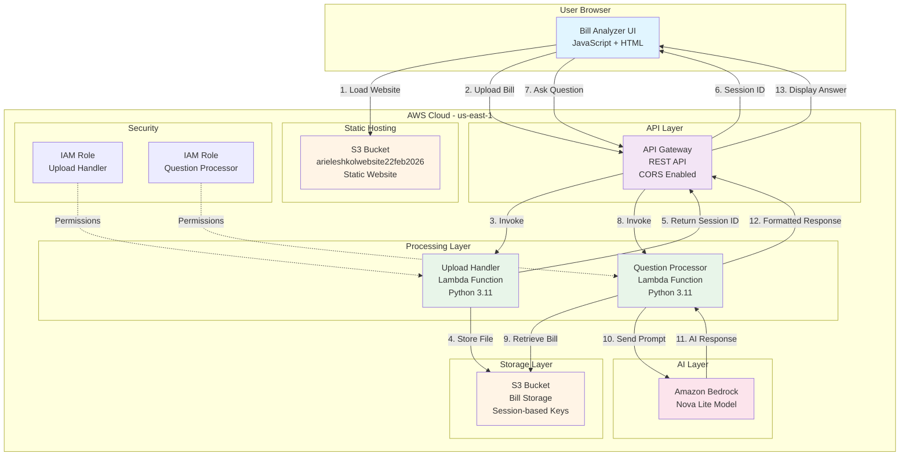
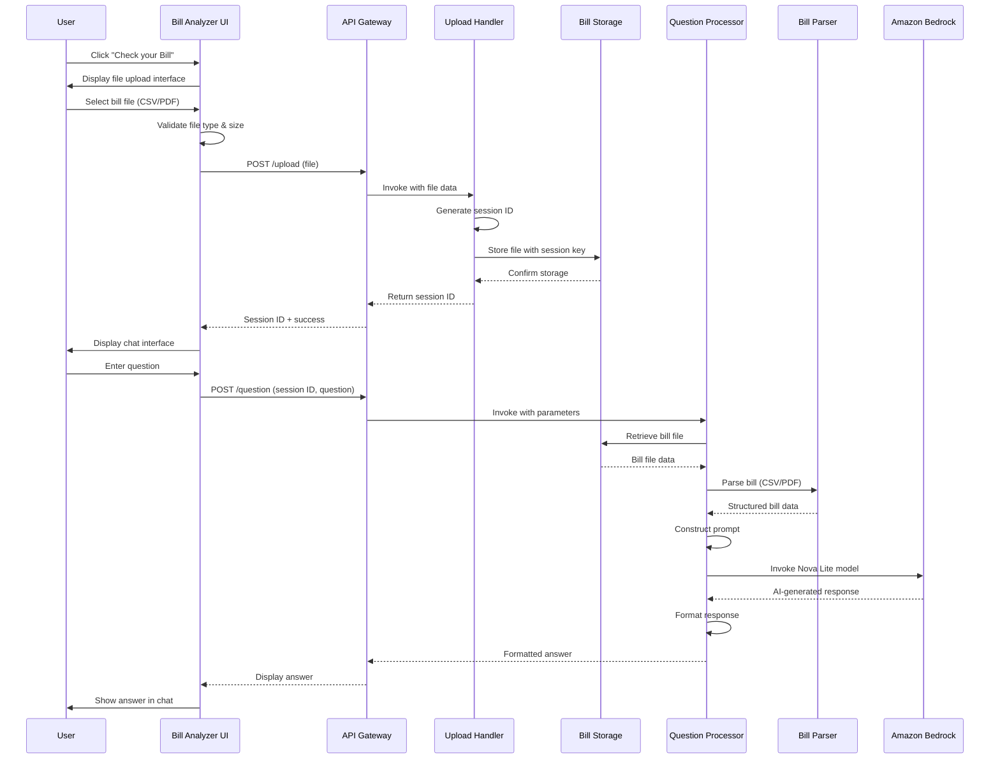

# Design Document: AWS Bill Analyzer

## Overview

The AWS Bill Analyzer is a serverless web application that enables users to upload AWS billing documents and interact with an AI agent to understand their costs through natural language questions. The system integrates seamlessly with an existing static website hosted on S3, leveraging AWS Lambda for backend processing, Amazon Bedrock Nova Lite for AI-powered analysis, and API Gateway for communication.

### Architecture Philosophy

The design follows a serverless-first approach to minimize operational overhead and costs. The architecture separates concerns into distinct layers:

- **Presentation Layer**: JavaScript-enhanced static HTML integrated into the existing website
- **API Layer**: API Gateway providing RESTful endpoints with CORS support
- **Processing Layer**: AWS Lambda functions for file handling, parsing, and AI orchestration
- **Storage Layer**: S3 for bill file storage with session-based organization
- **AI Layer**: Amazon Bedrock Nova Lite for natural language understanding and response generation

### Key Design Decisions

1. **Serverless Architecture**: Eliminates server management, provides automatic scaling, and reduces costs for intermittent usage patterns
2. **Session-Based Storage**: Uses unique session identifiers to isolate user data and enable automatic cleanup
3. **Frontend-First Error Handling**: Provides immediate user feedback for validation errors before API calls
4. **Stateless Lambda Functions**: Each function is independently deployable and scalable
5. **Regional Deployment**: All resources in us-east-1 for minimal latency and Bedrock availability

## Architecture

### System Architecture Diagram



### Data Flow Diagram



## Components and Interfaces

### 1. Bill Analyzer UI (Frontend Component)

**Technology**: Vanilla JavaScript integrated into existing index.html

**Responsibilities**:
- Render "Check your Bill" button in the hero section
- Display file upload interface with drag-and-drop support
- Validate file types (.csv, .pdf) and size (max 10MB) client-side
- Upload files to API Gateway
- Display chat interface after successful upload
- Send user questions to API Gateway
- Render conversation history with visual distinction between user and AI messages
- Display loading states and error messages
- Maintain session state in browser memory

**Interface Elements**:

```javascript
// Main UI Controller
class BillAnalyzerUI {
  constructor() {
    this.sessionId = null;
    this.conversationHistory = [];
  }
  
  // Initialize UI and attach event listeners
  init();
  
  // Display file upload interface
  showUploadInterface();
  
  // Validate file before upload
  validateFile(file): {valid: boolean, error: string};
  
  // Upload file to API
  async uploadFile(file): Promise<{sessionId: string}>;
  
  // Display chat interface
  showChatInterface(sessionId);
  
  // Send question to API
  async askQuestion(question): Promise<{answer: string}>;
  
  // Render message in chat
  renderMessage(message, isUser);
  
  // Display loading indicator
  showLoading(context);
  
  // Hide loading indicator
  hideLoading();
  
  // Display error message
  showError(message);
}
```

**API Integration**:
- `POST /upload`: Multipart form data with file
- `POST /question`: JSON body with `{sessionId, question}`

**CSS Classes** (extending existing styles.css):
- `.bill-analyzer-button`: Primary action button
- `.upload-interface`: File upload container
- `.chat-interface`: Chat conversation container
- `.message-user`: User message styling
- `.message-ai`: AI response styling
- `.loading-indicator`: Spinner or progress indicator
- `.error-message`: Error display styling

### 2. API Gateway Configuration

**Type**: REST API

**Endpoints**:

**POST /upload**
- **Purpose**: Receive bill file uploads
- **Request**: Multipart form data
  - `file`: Binary file data (CSV or PDF)
- **Response**: 
  ```json
  {
    "sessionId": "uuid-v4-string",
    "message": "File uploaded successfully"
  }
  ```
- **Error Responses**:
  - 400: Invalid file type or size
  - 413: File too large
  - 500: Server error
- **Integration**: Lambda proxy integration with Upload Handler
- **Timeout**: 30 seconds

**POST /question**
- **Purpose**: Process user questions about uploaded bills
- **Request**: JSON
  ```json
  {
    "sessionId": "uuid-v4-string",
    "question": "What was my total EC2 cost?"
  }
  ```
- **Response**:
  ```json
  {
    "answer": "Your total EC2 cost was $123.45",
    "timestamp": "2026-02-22T10:30:00Z"
  }
  ```
- **Error Responses**:
  - 400: Missing sessionId or question
  - 404: Session not found
  - 500: Server error
- **Integration**: Lambda proxy integration with Question Processor
- **Timeout**: 60 seconds (to accommodate Bedrock processing)

**CORS Configuration**:
```json
{
  "allowOrigins": ["http://arieleshkolwebsite22feb2026.s3-website-us-east-1.amazonaws.com"],
  "allowMethods": ["POST", "OPTIONS"],
  "allowHeaders": ["Content-Type", "X-Session-Id"],
  "maxAge": 3600
}
```

**Deployment Stage**: `prod`

**Throttling**:
- Rate: 100 requests per second
- Burst: 200 requests

### 3. Upload Handler Lambda Function

**Runtime**: Python 3.11

**Memory**: 512 MB

**Timeout**: 30 seconds

**Environment Variables**:
- `BILL_STORAGE_BUCKET`: Name of S3 bucket for bill storage
- `MAX_FILE_SIZE_MB`: Maximum file size (10)
- `ALLOWED_EXTENSIONS`: Comma-separated list (.csv,.pdf)

**Function Signature**:
```python
def lambda_handler(event, context):
    """
    Handle bill file uploads from API Gateway.
    
    Args:
        event: API Gateway proxy event with file data
        context: Lambda context object
        
    Returns:
        API Gateway proxy response with session ID
    """
```

**Processing Logic**:
1. Extract file from API Gateway event (base64 decode if necessary)
2. Validate file size against MAX_FILE_SIZE_MB
3. Validate file extension against ALLOWED_EXTENSIONS
4. Generate unique session ID using uuid4
5. Construct S3 key: `bills/{session_id}/{original_filename}`
6. Upload file to S3 with metadata:
   - `upload-timestamp`: ISO 8601 timestamp
   - `content-type`: Detected MIME type
   - `session-id`: Session identifier
7. Set S3 object lifecycle to expire after 24 hours
8. Return success response with session ID

**Error Handling**:
- File size exceeded: Return 413 with descriptive message
- Invalid file type: Return 400 with supported formats
- S3 upload failure: Return 500 with retry suggestion
- All errors logged to CloudWatch

**IAM Permissions Required**:
```json
{
  "Version": "2012-10-17",
  "Statement": [
    {
      "Effect": "Allow",
      "Action": [
        "s3:PutObject",
        "s3:PutObjectTagging"
      ],
      "Resource": "arn:aws:s3:::bill-storage-bucket/bills/*"
    },
    {
      "Effect": "Allow",
      "Action": [
        "logs:CreateLogGroup",
        "logs:CreateLogStream",
        "logs:PutLogEvents"
      ],
      "Resource": "arn:aws:logs:us-east-1:991105135552:log-group:/aws/lambda/upload-handler:*"
    }
  ]
}
```

### 4. Question Processor Lambda Function

**Runtime**: Python 3.11

**Memory**: 1024 MB (higher for PDF parsing)

**Timeout**: 60 seconds

**Environment Variables**:
- `BILL_STORAGE_BUCKET`: Name of S3 bucket for bill storage
- `BEDROCK_MODEL_ID`: Model identifier (amazon.nova-lite-v1:0)
- `AWS_REGION`: Region for Bedrock (us-east-1)
- `MAX_TOKENS`: Maximum response tokens (2000)

**Function Signature**:
```python
def lambda_handler(event, context):
    """
    Process user questions about uploaded bills using AI.
    
    Args:
        event: API Gateway proxy event with sessionId and question
        context: Lambda context object
        
    Returns:
        API Gateway proxy response with AI-generated answer
    """
```

**Processing Logic**:
1. Extract sessionId and question from event body
2. Validate required parameters
3. Retrieve bill file from S3 using session ID
4. Determine file type from extension
5. Invoke appropriate parser (CSV or PDF)
6. Construct prompt for Bedrock:
   ```
   You are an AWS billing assistant. Analyze the following bill data and answer the user's question accurately.
   
   Bill Data:
   {parsed_bill_data}
   
   User Question: {question}
   
   Provide a clear, concise answer based only on the bill data provided.
   ```
7. Invoke Bedrock Nova Lite model
8. Extract response text from Bedrock output
9. Format response for display
10. Return formatted answer

**Error Handling**:
- Session not found: Return 404 with message
- Bill parsing failure: Return 400 with format error
- Bedrock invocation failure: Return 500 with retry message
- All errors logged to CloudWatch with context

**IAM Permissions Required**:
```json
{
  "Version": "2012-10-17",
  "Statement": [
    {
      "Effect": "Allow",
      "Action": [
        "s3:GetObject"
      ],
      "Resource": "arn:aws:s3:::bill-storage-bucket/bills/*"
    },
    {
      "Effect": "Allow",
      "Action": [
        "bedrock:InvokeModel"
      ],
      "Resource": "arn:aws:bedrock:us-east-1::foundation-model/amazon.nova-lite-v1:0"
    },
    {
      "Effect": "Allow",
      "Action": [
        "logs:CreateLogGroup",
        "logs:CreateLogStream",
        "logs:PutLogEvents"
      ],
      "Resource": "arn:aws:logs:us-east-1:991105135552:log-group:/aws/lambda/question-processor:*"
    }
  ]
}
```

### 5. Bill Parser Component

**Implementation**: Python module within Question Processor Lambda

**Module Structure**:
```python
# bill_parser.py

class BillParser:
    """Base class for bill parsing"""
    def parse(self, file_content: bytes) -> dict:
        raise NotImplementedError

class CSVBillParser(BillParser):
    """Parser for AWS Cost and Usage Report CSV format"""
    def parse(self, file_content: bytes) -> dict:
        """
        Parse CSV bill into structured data.
        
        Returns:
            {
                'line_items': [
                    {
                        'service': str,
                        'usage_type': str,
                        'cost': Decimal,
                        'date': str
                    }
                ],
                'total_cost': Decimal,
                'currency': str,
                'period_start': str,
                'period_end': str
            }
        """

class PDFBillParser(BillParser):
    """Parser for AWS PDF bills"""
    def parse(self, file_content: bytes) -> dict:
        """
        Parse PDF bill into structured data.
        Uses PyPDF2 or pdfplumber for text extraction.
        
        Returns: Same structure as CSVBillParser
        """

def get_parser(file_extension: str) -> BillParser:
    """Factory function to get appropriate parser"""
```

**CSV Parsing Strategy**:
- Use Python `csv` module for parsing
- Identify header row containing column names
- Map columns to standard fields:
  - Service name: "lineItem/ProductCode" or "Service"
  - Usage type: "lineItem/UsageType" or "Usage Type"
  - Cost: "lineItem/UnblendedCost" or "Cost"
  - Date: "lineItem/UsageStartDate" or "Date"
- Use `Decimal` for cost precision
- Aggregate totals by service
- Handle missing or malformed rows gracefully

**PDF Parsing Strategy**:
- Use `pdfplumber` library for text extraction
- Extract text from all pages
- Use regex patterns to identify:
  - Service names (common AWS service patterns)
  - Cost values (currency symbols + numbers)
  - Date ranges (month/year patterns)
  - Total amounts (keywords: "Total", "Amount Due")
- Build structured data from extracted text
- Handle multi-page documents
- Fallback to basic text extraction if structured parsing fails

**Dependencies** (requirements.txt):
```
boto3==1.34.0
pdfplumber==0.10.3
```

### 6. Session Manager Component

**Implementation**: Integrated into Lambda functions and frontend

**Session Lifecycle**:
1. **Creation**: Upload Handler generates UUID v4 session ID
2. **Storage**: Session ID stored in browser memory (not localStorage for security)
3. **Association**: S3 objects tagged with session ID
4. **Expiration**: S3 lifecycle policy deletes objects after 24 hours
5. **Cleanup**: Automatic via S3 lifecycle rules

**Session Data Structure**:
```javascript
// Frontend session object
{
  sessionId: "uuid-string",
  uploadTimestamp: "ISO-8601-timestamp",
  fileName: "original-filename.csv",
  conversationHistory: [
    {
      question: "What was my total cost?",
      answer: "Your total cost was $123.45",
      timestamp: "ISO-8601-timestamp"
    }
  ]
}
```

**S3 Object Tagging**:
```json
{
  "TagSet": [
    {
      "Key": "session-id",
      "Value": "uuid-string"
    },
    {
      "Key": "upload-timestamp",
      "Value": "ISO-8601-timestamp"
    },
    {
      "Key": "expiration",
      "Value": "24h"
    }
  ]
}
```

### 7. Response Formatter Component

**Implementation**: Python module within Question Processor Lambda

**Module Structure**:
```python
# response_formatter.py

class ResponseFormatter:
    """Format AI responses for display"""
    
    def format_response(self, bedrock_response: dict) -> str:
        """
        Extract and format response from Bedrock output.
        
        Args:
            bedrock_response: Raw response from Bedrock API
            
        Returns:
            Formatted string ready for display
        """
    
    def sanitize_output(self, text: str) -> str:
        """Remove any sensitive data or formatting issues"""
    
    def add_metadata(self, response: str, metadata: dict) -> dict:
        """Add timestamp and other metadata to response"""
```

**Formatting Rules**:
- Extract text from Bedrock response structure
- Remove any markdown formatting that doesn't render well
- Preserve line breaks for readability
- Truncate responses longer than 2000 characters
- Add timestamp to response metadata
- Sanitize any potential PII or sensitive data

## Data Models

### Bill Data Model

**Structured Bill Data** (Python dict):
```python
{
    "session_id": str,  # UUID v4
    "file_name": str,   # Original filename
    "file_type": str,   # "csv" or "pdf"
    "upload_timestamp": str,  # ISO 8601
    "currency": str,    # "USD"
    "period_start": str,  # ISO 8601 date
    "period_end": str,    # ISO 8601 date
    "total_cost": Decimal,  # Total bill amount
    "line_items": [
        {
            "service": str,        # e.g., "Amazon EC2"
            "usage_type": str,     # e.g., "t2.micro"
            "cost": Decimal,       # Line item cost
            "usage_amount": float, # Usage quantity
            "date": str           # ISO 8601 date
        }
    ],
    "service_totals": {
        "Amazon EC2": Decimal,
        "Amazon S3": Decimal,
        # ... other services
    }
}
```

### API Request/Response Models

**Upload Request**:
```
POST /upload
Content-Type: multipart/form-data

file: <binary-data>
```

**Upload Response**:
```json
{
  "sessionId": "550e8400-e29b-41d4-a716-446655440000",
  "message": "File uploaded successfully",
  "fileName": "aws-bill-january-2026.csv",
  "timestamp": "2026-02-22T10:30:00Z"
}
```

**Question Request**:
```json
{
  "sessionId": "550e8400-e29b-41d4-a716-446655440000",
  "question": "What was my total EC2 cost last month?"
}
```

**Question Response**:
```json
{
  "answer": "Your total Amazon EC2 cost for the billing period was $123.45, which includes charges for t2.micro instances ($45.00), t3.medium instances ($78.45), and data transfer costs ($0.00).",
  "timestamp": "2026-02-22T10:30:15Z",
  "sessionId": "550e8400-e29b-41d4-a716-446655440000"
}
```

**Error Response**:
```json
{
  "error": "InvalidFileType",
  "message": "Only CSV and PDF files are supported. Please upload a valid AWS bill file.",
  "code": 400
}
```

### S3 Storage Structure

**Bucket Name**: `aws-bill-analyzer-storage-991105135552`

**Object Key Pattern**: `bills/{session_id}/{filename}`

**Example**:
```
bills/
  550e8400-e29b-41d4-a716-446655440000/
    aws-bill-january-2026.csv
  661f9511-f3ac-52e5-b827-557766551111/
    billing-statement.pdf
```

**Object Metadata**:
- `Content-Type`: `text/csv` or `application/pdf`
- `x-amz-meta-session-id`: Session identifier
- `x-amz-meta-upload-timestamp`: Upload time
- `x-amz-meta-original-filename`: Original file name

**Lifecycle Policy**:
```json
{
  "Rules": [
    {
      "Id": "DeleteAfter24Hours",
      "Status": "Enabled",
      "Prefix": "bills/",
      "Expiration": {
        "Days": 1
      }
    }
  ]
}
```


## Correctness Properties

A property is a characteristic or behavior that should hold true across all valid executions of a system—essentially, a formal statement about what the system should do. Properties serve as the bridge between human-readable specifications and machine-verifiable correctness guarantees.

### Property Reflection

After analyzing all acceptance criteria, I identified several areas of redundancy:

1. **File validation properties** (1.3, 1.4) can be combined into a comprehensive file validation property
2. **Parser output properties** (3.5, 4.5) are identical and can be unified
3. **Error display properties** (10.1-10.7) share common patterns and can be consolidated
4. **Loading indicator properties** (12.1-12.3) follow the same pattern and can be unified
5. **Session ID properties** (13.1, 13.2, 13.3) are related aspects of session management that can be combined

The following properties represent the unique, non-redundant validation requirements:

### Property 1: File Type Validation

*For any* file submitted to the upload interface, the validation function should return success if and only if the file extension is .csv or .pdf (case-insensitive), and should return an error message indicating supported formats for any other extension.

**Validates: Requirements 1.3, 1.4**

### Property 2: File Size Enforcement

*For any* file submitted to the Upload_Handler, files under 10MB should be accepted (assuming valid type), and files at or exceeding 10MB should be rejected with an error message indicating the size constraint.

**Validates: Requirements 2.6, 2.7**

### Property 3: Unique Session Generation

*For any* two bill uploads, the generated session identifiers must be unique, and each uploaded file must be stored with its session ID as part of the S3 object key.

**Validates: Requirements 2.3, 13.1, 13.2, 13.3**

### Property 4: Upload Success Response

*For any* successful file upload, the Upload_Handler must return a response containing a valid session identifier (UUID v4 format).

**Validates: Requirements 2.4**

### Property 5: Upload Error Handling

*For any* failed upload operation (invalid type, size exceeded, or storage failure), the Upload_Handler must return an error response with a descriptive message appropriate to the failure type.

**Validates: Requirements 2.5**

### Property 6: CSV Field Extraction

*For any* valid AWS Cost and Usage Report CSV file, the Bill_Parser must extract all line items with service name, usage type, cost, and date fields populated.

**Validates: Requirements 3.1**

### Property 7: CSV Error Handling

*For any* malformed CSV file (missing headers, invalid structure, or corrupted data), the Bill_Parser must return a descriptive error message without crashing.

**Validates: Requirements 3.3**

### Property 8: Cost Precision Preservation

*For any* cost value in a bill file, the parsed value must maintain precision to exactly two decimal places, and the round-trip property should hold: formatting then parsing a cost value should yield the original value.

**Validates: Requirements 3.4**

### Property 9: Structured Output Format

*For any* successfully parsed bill (CSV or PDF), the Bill_Parser must return a dictionary containing the required fields: line_items (list), total_cost (Decimal), currency (string), period_start (string), and period_end (string).

**Validates: Requirements 3.5, 4.5**

### Property 10: PDF Text Extraction

*For any* valid PDF file, the Bill_Parser must extract non-empty text content from all pages in the document.

**Validates: Requirements 4.1, 4.4**

### Property 11: PDF Data Identification

*For any* PDF containing AWS billing information, the Bill_Parser must identify at least one service name and at least one cost value from the extracted text.

**Validates: Requirements 4.2**

### Property 12: PDF Error Handling

*For any* PDF file that cannot be parsed (corrupted, encrypted, or non-text), the Bill_Parser must return a descriptive error message without crashing.

**Validates: Requirements 4.3**

### Property 13: Session Data Retrieval

*For any* valid session identifier, the Question_Processor must retrieve the bill data associated with that session, and for any invalid session identifier, it must return a 404 error.

**Validates: Requirements 5.5, 13.4**

### Property 14: Prompt Construction

*For any* user question and parsed bill data, the Question_Processor must construct a prompt that contains both the complete bill data and the user's question text.

**Validates: Requirements 5.6**

### Property 15: AI Response Generation

*For any* valid prompt submitted to Amazon Bedrock Nova Lite, the AI_Agent must return a non-empty response string.

**Validates: Requirements 6.1, 6.4**

### Property 16: AI Error Handling

*For any* error encountered during Bedrock invocation (service unavailable, throttling, or invalid request), the Question_Processor must return a user-friendly error message that does not expose technical details.

**Validates: Requirements 6.5**

### Property 17: Response Formatting

*For any* AI-generated response, the Response_Formatter must produce output that is displayable in the chat interface (no null values, proper string encoding, length under 2000 characters).

**Validates: Requirements 6.6**

### Property 18: Conversation History Persistence

*For any* session with multiple question-answer exchanges, the Session_Manager must maintain all Q&A pairs in chronological order for the duration of the browser session.

**Validates: Requirements 7.1, 7.6**

### Property 19: Message Display Order

*For any* sequence of questions and responses in the chat interface, messages must be displayed in chronological order with the most recent message at the bottom.

**Validates: Requirements 7.2, 7.3, 7.4**

### Property 20: HTTP Status Code Mapping

*For any* API request outcome, the API_Gateway must return the appropriate HTTP status code: 200 for success, 400 for client errors, 404 for not found, 413 for payload too large, and 500 for server errors.

**Validates: Requirements 8.6**

### Property 21: Error Message Display

*For any* failed operation (upload, parsing, AI processing, or network error), the Bill_Analyzer_UI must display an error message appropriate to the failure type, and the message must be user-friendly (no stack traces or technical jargon).

**Validates: Requirements 10.1, 10.2, 10.3, 10.4, 10.6, 10.7**

### Property 22: Retry Availability

*For any* failed operation, the Bill_Analyzer_UI must provide a retry mechanism (button or link) that allows the user to attempt the operation again.

**Validates: Requirements 10.5**

### Property 23: Touch-Friendly Button Sizing

*For any* interactive button in the Bill_Analyzer_UI, the clickable area must be at least 44 pixels in both width and height to ensure touch-friendly interaction.

**Validates: Requirements 11.3**

### Property 24: Loading State Management

*For any* asynchronous operation (file upload or question processing), the Bill_Analyzer_UI must display a loading indicator while the operation is in progress, disable the submit button to prevent duplicate submissions, and remove the loading indicator and re-enable the button when the operation completes.

**Validates: Requirements 12.1, 12.2, 12.3, 12.4, 12.5**

### Property 25: Session Expiration

*For any* session, the associated bill file in S3 must be automatically deleted after 24 hours from the upload timestamp.

**Validates: Requirements 13.5, 13.6**

## Error Handling

### Error Categories and Handling Strategies

**Client-Side Validation Errors**:
- **File Type Invalid**: Detected before upload, immediate user feedback
- **File Size Exceeded**: Detected before upload, immediate user feedback
- **Empty Question**: Detected before submission, inline validation message
- **Handling**: Display inline error messages, prevent API calls, provide correction guidance

**Upload Errors**:
- **Network Failure**: Retry with exponential backoff (3 attempts)
- **S3 Storage Failure**: Return 500 error, suggest retry
- **Timeout**: Return 504 error, suggest retry with smaller file
- **Handling**: Log to CloudWatch, return descriptive error to user, track failure metrics

**Parsing Errors**:
- **Malformed CSV**: Return 400 error with format guidance
- **Corrupted PDF**: Return 400 error suggesting file re-download
- **Missing Required Fields**: Return 400 error listing missing fields
- **Handling**: Log parsing failures, provide format examples, suggest alternative formats

**AI Processing Errors**:
- **Bedrock Throttling**: Implement exponential backoff, queue request
- **Bedrock Service Unavailable**: Return 503 error, suggest retry in a few minutes
- **Invalid Prompt**: Return 400 error, log for debugging
- **Timeout**: Return 504 error after 60 seconds
- **Handling**: Implement circuit breaker pattern, fallback to cached responses if available

**Session Errors**:
- **Session Not Found**: Return 404 error, prompt user to re-upload bill
- **Session Expired**: Return 410 error, explain 24-hour limit
- **Handling**: Clear client-side session data, provide re-upload option

### Error Response Format

All errors follow a consistent JSON structure:

```json
{
  "error": "ErrorType",
  "message": "User-friendly description",
  "code": 400,
  "details": {
    "field": "additional context"
  },
  "retryable": true
}
```

### Logging Strategy

**CloudWatch Logs Structure**:
- **Log Group**: `/aws/lambda/{function-name}`
- **Log Level**: INFO for normal operations, WARN for retryable errors, ERROR for failures
- **Log Format**: JSON with timestamp, request_id, session_id, operation, status, duration_ms

**Metrics to Track**:
- Upload success/failure rate
- Parsing success/failure rate by file type
- AI response latency (p50, p95, p99)
- Error rate by category
- Session creation and expiration counts

### Circuit Breaker Pattern

For Bedrock API calls, implement circuit breaker to prevent cascading failures:

- **Closed State**: Normal operation, all requests pass through
- **Open State**: After 5 consecutive failures, reject requests immediately for 60 seconds
- **Half-Open State**: After 60 seconds, allow 1 test request
- **Transition**: Success in half-open returns to closed, failure returns to open

## Testing Strategy

### Dual Testing Approach

The AWS Bill Analyzer requires both unit testing and property-based testing to ensure comprehensive coverage. Unit tests verify specific examples and integration points, while property tests validate universal behaviors across all inputs.

### Unit Testing

**Frontend Unit Tests** (Jest + Testing Library):
- Button click handlers trigger correct UI state changes
- File validation logic for specific file types
- API call mocking and response handling
- Error message display for specific error codes
- Session state management in browser memory
- Responsive layout at specific breakpoints (768px, 480px)

**Lambda Unit Tests** (pytest):
- Upload Handler:
  - Successful file upload with valid CSV
  - Successful file upload with valid PDF
  - Rejection of oversized file (10.1 MB)
  - Rejection of invalid file type (.txt, .doc)
  - S3 upload failure handling
  - Session ID generation format (UUID v4)
  
- Question Processor:
  - Successful question processing with valid session
  - 404 error for invalid session ID
  - CSV parsing with standard AWS CUR format
  - PDF parsing with multi-page document
  - Bedrock API call with constructed prompt
  - Response formatting for display
  - Error handling for Bedrock throttling

**Integration Tests**:
- End-to-end file upload through API Gateway to S3
- End-to-end question processing through API Gateway to Bedrock
- CORS preflight request handling
- IAM permission validation (Lambda can access S3 and Bedrock)
- S3 lifecycle policy execution (24-hour expiration)

### Property-Based Testing

**Testing Library**: Hypothesis (Python) for Lambda functions, fast-check (JavaScript) for frontend

**Test Configuration**: Minimum 100 iterations per property test

**Property Tests for Upload Handler**:

```python
# Feature: aws-bill-analyzer, Property 3: Unique Session Generation
@given(st.lists(st.binary(min_size=100, max_size=1000), min_size=2, max_size=10))
def test_unique_session_ids(files):
    """For any set of file uploads, all session IDs must be unique"""
    session_ids = [upload_handler.generate_session_id() for _ in files]
    assert len(session_ids) == len(set(session_ids))

# Feature: aws-bill-analyzer, Property 2: File Size Enforcement
@given(st.binary(min_size=0, max_size=15*1024*1024))
def test_file_size_validation(file_content):
    """For any file, accept if under 10MB, reject if at or over 10MB"""
    result = upload_handler.validate_file_size(file_content)
    if len(file_content) < 10 * 1024 * 1024:
        assert result.valid == True
    else:
        assert result.valid == False
        assert "10" in result.error_message.lower()
        assert "mb" in result.error_message.lower()
```

**Property Tests for Bill Parser**:

```python
# Feature: aws-bill-analyzer, Property 8: Cost Precision Preservation
@given(st.decimals(min_value=0, max_value=100000, places=2))
def test_cost_precision_round_trip(cost_value):
    """For any cost value, formatting then parsing should preserve precision"""
    formatted = bill_parser.format_cost(cost_value)
    parsed = bill_parser.parse_cost(formatted)
    assert parsed == cost_value
    assert parsed.as_tuple().exponent == -2  # Two decimal places

# Feature: aws-bill-analyzer, Property 9: Structured Output Format
@given(csv_bill_generator())
def test_csv_parser_output_structure(csv_content):
    """For any valid CSV bill, output must contain required fields"""
    result = bill_parser.parse_csv(csv_content)
    assert "line_items" in result
    assert "total_cost" in result
    assert "currency" in result
    assert "period_start" in result
    assert "period_end" in result
    assert isinstance(result["line_items"], list)
    assert isinstance(result["total_cost"], Decimal)

# Feature: aws-bill-analyzer, Property 10: PDF Text Extraction
@given(pdf_generator(min_pages=1, max_pages=10))
def test_pdf_text_extraction(pdf_content):
    """For any valid PDF, extract non-empty text from all pages"""
    result = bill_parser.extract_pdf_text(pdf_content)
    assert len(result) > 0
    assert isinstance(result, str)
```

**Property Tests for Question Processor**:

```python
# Feature: aws-bill-analyzer, Property 14: Prompt Construction
@given(st.text(min_size=1, max_size=500), bill_data_generator())
def test_prompt_construction(question, bill_data):
    """For any question and bill data, prompt must contain both"""
    prompt = question_processor.construct_prompt(question, bill_data)
    assert question in prompt
    assert str(bill_data["total_cost"]) in prompt
    assert bill_data["currency"] in prompt

# Feature: aws-bill-analyzer, Property 17: Response Formatting
@given(st.text(min_size=1, max_size=5000))
def test_response_formatting(ai_response):
    """For any AI response, formatted output must be displayable"""
    formatted = response_formatter.format_response(ai_response)
    assert formatted is not None
    assert isinstance(formatted, str)
    assert len(formatted) <= 2000
    assert formatted.isprintable() or '\n' in formatted
```

**Property Tests for Frontend**:

```javascript
// Feature: aws-bill-analyzer, Property 1: File Type Validation
fc.assert(
  fc.property(
    fc.string().map(s => s + fc.constantFrom('.txt', '.doc', '.exe', '.jpg')()),
    (filename) => {
      const result = validateFileType(filename);
      if (filename.endsWith('.csv') || filename.endsWith('.pdf')) {
        expect(result.valid).toBe(true);
      } else {
        expect(result.valid).toBe(false);
        expect(result.error).toContain('CSV');
        expect(result.error).toContain('PDF');
      }
    }
  ),
  { numRuns: 100 }
);

// Feature: aws-bill-analyzer, Property 19: Message Display Order
fc.assert(
  fc.property(
    fc.array(fc.record({
      question: fc.string(),
      answer: fc.string(),
      timestamp: fc.integer()
    }), { minLength: 2, maxLength: 20 }),
    (messages) => {
      const sorted = sortMessagesChronologically(messages);
      for (let i = 1; i < sorted.length; i++) {
        expect(sorted[i].timestamp).toBeGreaterThanOrEqual(sorted[i-1].timestamp);
      }
    }
  ),
  { numRuns: 100 }
);
```

### Custom Generators for Property Tests

**CSV Bill Generator**:
```python
@st.composite
def csv_bill_generator(draw):
    """Generate valid AWS Cost and Usage Report CSV content"""
    num_rows = draw(st.integers(min_value=1, max_value=100))
    services = draw(st.lists(
        st.sampled_from(['Amazon EC2', 'Amazon S3', 'AWS Lambda', 'Amazon RDS']),
        min_size=num_rows, max_size=num_rows
    ))
    costs = draw(st.lists(
        st.decimals(min_value=0, max_value=10000, places=2),
        min_size=num_rows, max_size=num_rows
    ))
    # Construct CSV with headers and data rows
    # Return as bytes
```

**PDF Generator**:
```python
@st.composite
def pdf_generator(draw, min_pages=1, max_pages=5):
    """Generate valid PDF with billing-like content"""
    from reportlab.pdfgen import canvas
    from io import BytesIO
    
    buffer = BytesIO()
    pdf = canvas.Canvas(buffer)
    num_pages = draw(st.integers(min_value=min_pages, max_value=max_pages))
    
    for page in range(num_pages):
        # Add billing-like text content
        pdf.drawString(100, 750, f"AWS Bill - Page {page+1}")
        # Add service names and costs
        pdf.showPage()
    
    pdf.save()
    return buffer.getvalue()
```

### Test Coverage Goals

- **Unit Test Coverage**: Minimum 80% line coverage for all Lambda functions
- **Property Test Coverage**: All 25 correctness properties must have corresponding property tests
- **Integration Test Coverage**: All API Gateway endpoints and Lambda integrations
- **End-to-End Test Coverage**: Complete user workflows (upload → question → answer)

### Continuous Testing

**Pre-Deployment Testing**:
- All unit tests must pass
- All property tests must pass (100 iterations each)
- Integration tests must pass against staging environment
- No critical security vulnerabilities in dependencies

**Post-Deployment Testing**:
- Smoke tests against production API endpoints
- Canary deployment with 10% traffic for 10 minutes
- Monitor error rates and latency metrics
- Automatic rollback if error rate exceeds 5%


## Infrastructure Configuration

### AWS Account and Region

- **AWS Account ID**: 991105135552
- **Primary Region**: us-east-1 (US East - N. Virginia)
- **Rationale**: us-east-1 selected for Amazon Bedrock Nova Lite availability and proximity to existing S3 website

### S3 Buckets

**Existing Website Bucket**:
- **Name**: arieleshkolwebsite22feb2026
- **Purpose**: Static website hosting
- **Configuration**: Public read access, website hosting enabled
- **No changes required**: Frontend code added to existing index.html

**New Bill Storage Bucket**:
- **Name**: aws-bill-analyzer-storage-991105135552
- **Purpose**: Temporary storage for uploaded bill files
- **Region**: us-east-1
- **Versioning**: Disabled (temporary storage)
- **Encryption**: AES-256 (SSE-S3)
- **Public Access**: Blocked (all public access blocked)
- **Lifecycle Policy**:
  ```json
  {
    "Rules": [
      {
        "Id": "DeleteBillsAfter24Hours",
        "Status": "Enabled",
        "Prefix": "bills/",
        "Expiration": {
          "Days": 1
        }
      }
    ]
  }
  ```
- **CORS Configuration**: Not required (accessed only by Lambda)


### Lambda Functions Configuration

**Upload Handler Function**:
- **Function Name**: aws-bill-analyzer-upload-handler
- **Runtime**: Python 3.11
- **Architecture**: x86_64
- **Memory**: 512 MB
- **Timeout**: 30 seconds
- **Handler**: lambda_function.lambda_handler
- **Environment Variables**:
  - `BILL_STORAGE_BUCKET`: aws-bill-analyzer-storage-991105135552
  - `MAX_FILE_SIZE_MB`: 10
  - `ALLOWED_EXTENSIONS`: .csv,.pdf
- **Execution Role**: aws-bill-analyzer-upload-role
- **Reserved Concurrency**: None (use account default)
- **Layers**: None required

**Question Processor Function**:
- **Function Name**: aws-bill-analyzer-question-processor
- **Runtime**: Python 3.11
- **Architecture**: x86_64
- **Memory**: 1024 MB (higher for PDF parsing)
- **Timeout**: 60 seconds
- **Handler**: lambda_function.lambda_handler
- **Environment Variables**:
  - `BILL_STORAGE_BUCKET`: aws-bill-analyzer-storage-991105135552
  - `BEDROCK_MODEL_ID`: amazon.nova-lite-v1:0
  - `AWS_REGION`: us-east-1
  - `MAX_TOKENS`: 2000
- **Execution Role**: aws-bill-analyzer-question-role
- **Reserved Concurrency**: None (use account default)
- **Layers**: None required (dependencies in deployment package)


### IAM Roles and Policies

**Upload Handler Execution Role**:
- **Role Name**: aws-bill-analyzer-upload-role
- **Trust Policy**: Lambda service principal
- **Managed Policies**: AWSLambdaBasicExecutionRole
- **Inline Policy** (S3WriteAccess):
  ```json
  {
    "Version": "2012-10-17",
    "Statement": [
      {
        "Sid": "AllowS3Upload",
        "Effect": "Allow",
        "Action": [
          "s3:PutObject",
          "s3:PutObjectTagging"
        ],
        "Resource": "arn:aws:s3:::aws-bill-analyzer-storage-991105135552/bills/*"
      }
    ]
  }
  ```

**Question Processor Execution Role**:
- **Role Name**: aws-bill-analyzer-question-role
- **Trust Policy**: Lambda service principal
- **Managed Policies**: AWSLambdaBasicExecutionRole
- **Inline Policy** (S3ReadBedrockAccess):
  ```json
  {
    "Version": "2012-10-17",
    "Statement": [
      {
        "Sid": "AllowS3Read",
        "Effect": "Allow",
        "Action": [
          "s3:GetObject"
        ],
        "Resource": "arn:aws:s3:::aws-bill-analyzer-storage-991105135552/bills/*"
      },
      {
        "Sid": "AllowBedrockInvoke",
        "Effect": "Allow",
        "Action": [
          "bedrock:InvokeModel"
        ],
        "Resource": "arn:aws:bedrock:us-east-1::foundation-model/amazon.nova-lite-v1:0"
      }
    ]
  }
  ```


### API Gateway Configuration

**API Type**: REST API (not HTTP API, for full feature support)

**API Name**: aws-bill-analyzer-api

**Stage**: prod

**Endpoints**:

**POST /upload**:
- **Integration Type**: Lambda Proxy
- **Lambda Function**: aws-bill-analyzer-upload-handler
- **Request Validation**: None (handled in Lambda)
- **Binary Media Types**: `multipart/form-data`, `application/octet-stream`
- **Method Request**:
  - Authorization: None (public endpoint)
  - API Key Required: No
- **Integration Request**:
  - Integration Type: AWS_PROXY
  - Lambda Function: arn:aws:lambda:us-east-1:991105135552:function:aws-bill-analyzer-upload-handler
  - Content Handling: CONVERT_TO_TEXT
- **Method Response**:
  - 200: Success
  - 400: Client error
  - 413: Payload too large
  - 500: Server error

**POST /question**:
- **Integration Type**: Lambda Proxy
- **Lambda Function**: aws-bill-analyzer-question-processor
- **Request Validation**: None (handled in Lambda)
- **Method Request**:
  - Authorization: None (public endpoint)
  - API Key Required: No
- **Integration Request**:
  - Integration Type: AWS_PROXY
  - Lambda Function: arn:aws:lambda:us-east-1:991105135552:function:aws-bill-analyzer-question-processor
- **Method Response**:
  - 200: Success
  - 400: Client error
  - 404: Session not found
  - 500: Server error


**CORS Configuration** (applies to both endpoints):
```json
{
  "Access-Control-Allow-Origin": "http://arieleshkolwebsite22feb2026.s3-website-us-east-1.amazonaws.com",
  "Access-Control-Allow-Methods": "POST,OPTIONS",
  "Access-Control-Allow-Headers": "Content-Type,X-Amz-Date,Authorization,X-Api-Key,X-Amz-Security-Token",
  "Access-Control-Max-Age": "3600"
}
```

**Throttling Settings**:
- **Rate Limit**: 100 requests per second
- **Burst Limit**: 200 requests
- **Rationale**: Sufficient for personal website traffic, prevents abuse

**Stage Variables**: None required

**API Gateway Permissions**:
- Lambda invoke permissions automatically configured during API creation
- Resource-based policy on Lambda functions allows API Gateway invocation

### Amazon Bedrock Configuration

**Model**: Amazon Nova Lite (amazon.nova-lite-v1:0)

**Region**: us-east-1

**Model Access**: Must be enabled in AWS account before deployment
- Navigate to Amazon Bedrock console
- Request access to Nova Lite model
- Wait for approval (typically immediate for Nova Lite)

**Invocation Parameters**:
```json
{
  "modelId": "amazon.nova-lite-v1:0",
  "contentType": "application/json",
  "accept": "application/json",
  "body": {
    "prompt": "<constructed_prompt>",
    "max_tokens": 2000,
    "temperature": 0.7,
    "top_p": 0.9
  }
}
```

**Cost Considerations**:
- Nova Lite pricing: ~$0.00008 per 1K input tokens, ~$0.00032 per 1K output tokens
- Estimated cost per question: $0.001 - $0.005
- Monthly estimate (100 questions): $0.10 - $0.50


## Deployment Strategy

### Deployment Phases

**Phase 1: Infrastructure Setup**
1. Create S3 bucket for bill storage with lifecycle policy
2. Create IAM roles for Lambda functions
3. Enable Amazon Bedrock model access

**Phase 2: Lambda Deployment**
1. Package Lambda functions with dependencies
2. Deploy Upload Handler function
3. Deploy Question Processor function
4. Configure environment variables
5. Test functions independently

**Phase 3: API Gateway Setup**
1. Create REST API
2. Configure /upload and /question endpoints
3. Enable CORS
4. Deploy to prod stage
5. Test API endpoints

**Phase 4: Frontend Integration**
1. Add JavaScript code to index.html
2. Add CSS styles to styles.css
3. Configure API endpoint URLs
4. Test locally
5. Deploy to S3 via GitHub Actions

**Phase 5: End-to-End Testing**
1. Upload test CSV bill
2. Upload test PDF bill
3. Ask sample questions
4. Verify error handling
5. Test on mobile devices

### GitHub Actions Workflow Enhancement

Extend existing `.github/workflows/deploy-to-s3.yml` to include JavaScript files:

```yaml
- name: Deploy HTML, CSS, and JS to S3
  run: |
    echo "Deploying website files to S3..."
    aws s3 cp index.html s3://${{ env.S3_BUCKET }}/ --cache-control "max-age=300"
    aws s3 cp styles.css s3://${{ env.S3_BUCKET }}/ --cache-control "max-age=86400"
    aws s3 cp bill-analyzer.js s3://${{ env.S3_BUCKET }}/ --cache-control "max-age=86400"
    echo "✓ Deployment complete!"
```


### Lambda Deployment Package Structure

**Upload Handler Package**:
```
upload-handler/
├── lambda_function.py          # Main handler
├── requirements.txt            # boto3>=1.34.0
└── README.md                   # Deployment instructions
```

**Question Processor Package**:
```
question-processor/
├── lambda_function.py          # Main handler
├── bill_parser.py              # CSV and PDF parsing
├── response_formatter.py       # Response formatting
├── requirements.txt            # boto3>=1.34.0, pdfplumber==0.10.3
└── README.md                   # Deployment instructions
```

**Deployment Commands**:
```bash
# Package Upload Handler
cd upload-handler
pip install -r requirements.txt -t .
zip -r upload-handler.zip .
aws lambda create-function \
  --function-name aws-bill-analyzer-upload-handler \
  --runtime python3.11 \
  --role arn:aws:iam::991105135552:role/aws-bill-analyzer-upload-role \
  --handler lambda_function.lambda_handler \
  --zip-file fileb://upload-handler.zip \
  --timeout 30 \
  --memory-size 512

# Package Question Processor
cd question-processor
pip install -r requirements.txt -t .
zip -r question-processor.zip .
aws lambda create-function \
  --function-name aws-bill-analyzer-question-processor \
  --runtime python3.11 \
  --role arn:aws:iam::991105135552:role/aws-bill-analyzer-question-role \
  --handler lambda_function.lambda_handler \
  --zip-file fileb://question-processor.zip \
  --timeout 60 \
  --memory-size 1024
```


## Security Considerations

### Data Privacy

**Sensitive Data Handling**:
- Bill files contain financial information and must be treated as sensitive
- No bill data stored in CloudWatch logs (only metadata like session IDs)
- S3 bucket has all public access blocked
- Automatic deletion after 24 hours minimizes exposure window

**Session Security**:
- Session IDs are UUID v4 (cryptographically random)
- Session IDs not guessable or enumerable
- No authentication required (acceptable for personal website with temporary data)
- Consider adding API key authentication for production use

**Data in Transit**:
- API Gateway enforces HTTPS for all requests
- S3 website uses HTTP (existing configuration, frontend only)
- Lambda to S3 communication within AWS network
- Lambda to Bedrock communication within AWS network

**Data at Rest**:
- S3 bucket uses AES-256 encryption (SSE-S3)
- No encryption at rest for Lambda temporary storage (files deleted after processing)

### Access Control

**Principle of Least Privilege**:
- Upload Handler can only write to bills/ prefix in S3
- Question Processor can only read from bills/ prefix in S3
- Question Processor can only invoke specific Bedrock model
- No cross-function access

**Public Access**:
- API Gateway endpoints are public (no authentication)
- Acceptable for personal website with non-critical data
- Rate limiting prevents abuse
- Consider adding AWS WAF for production deployment

### Input Validation

**File Upload Validation**:
- File type validation (whitelist: .csv, .pdf)
- File size validation (max 10MB)
- Content type validation
- Malware scanning not implemented (consider AWS GuardDuty for production)

**Question Input Validation**:
- Maximum question length: 500 characters
- No SQL injection risk (no database)
- No XSS risk (responses sanitized before display)
- Prompt injection mitigation: structured prompt format


### Compliance Considerations

**GDPR Compliance** (if applicable):
- Right to erasure: Automatic 24-hour deletion
- Data minimization: Only bill data stored, no personal identifiers
- Purpose limitation: Data used only for bill analysis
- No data transfer outside AWS region

**AWS Best Practices**:
- CloudWatch logging enabled for audit trail
- IAM roles follow least privilege
- Encryption at rest enabled
- VPC not required (serverless architecture)

## Performance Optimization

### Latency Targets

- **File Upload**: < 2 seconds for 5MB file
- **CSV Parsing**: < 1 second for 1000 line items
- **PDF Parsing**: < 3 seconds for 10-page document
- **AI Response**: < 10 seconds for typical question
- **End-to-End Question**: < 15 seconds total

### Optimization Strategies

**Lambda Cold Start Mitigation**:
- Keep functions warm with CloudWatch Events (optional)
- Use provisioned concurrency for predictable latency (optional, adds cost)
- Minimize deployment package size
- Avoid heavy imports in global scope

**S3 Performance**:
- Use session ID prefix for natural partitioning
- No need for S3 Transfer Acceleration (files under 10MB)
- Consider S3 Intelligent-Tiering if retention period increases

**Bedrock Optimization**:
- Limit max_tokens to 2000 (faster responses)
- Use temperature 0.7 (balance between creativity and consistency)
- Construct concise prompts (reduce input tokens)
- Consider caching common questions (future enhancement)

**Frontend Optimization**:
- Minify JavaScript in production
- Use compression for file uploads
- Implement request debouncing for question input
- Show streaming responses if Bedrock supports (future enhancement)


### Scalability Considerations

**Current Scale**:
- Personal website with low traffic
- Estimated usage: 10-50 questions per day
- No scaling concerns at this level

**Future Scale** (if traffic increases):
- Lambda auto-scales to 1000 concurrent executions (account default)
- API Gateway handles 10,000 requests per second (regional limit)
- S3 handles unlimited requests
- Bedrock has per-model quotas (check AWS Service Quotas)

**Bottlenecks to Monitor**:
- Bedrock throttling (most likely bottleneck)
- Lambda concurrent execution limit
- API Gateway throttling limits
- S3 request rate (unlikely with current design)

## Monitoring and Observability

### CloudWatch Metrics

**Lambda Metrics**:
- Invocations
- Duration (p50, p95, p99)
- Errors
- Throttles
- Concurrent Executions

**API Gateway Metrics**:
- Count (total requests)
- 4XXError
- 5XXError
- Latency (p50, p95, p99)
- IntegrationLatency

**Custom Metrics** (to implement):
- Bill upload success rate
- CSV parsing success rate
- PDF parsing success rate
- Bedrock invocation success rate
- Average question processing time

### CloudWatch Alarms

**Critical Alarms**:
- Lambda error rate > 5% for 5 minutes
- API Gateway 5XX error rate > 5% for 5 minutes
- Lambda duration > 50 seconds (approaching timeout)

**Warning Alarms**:
- Lambda error rate > 1% for 15 minutes
- API Gateway 4XX error rate > 10% for 15 minutes
- Bedrock throttling detected


### Logging Strategy

**Log Levels**:
- **DEBUG**: Detailed information for troubleshooting (disabled in production)
- **INFO**: Normal operations (file uploaded, question processed)
- **WARN**: Recoverable errors (parsing warnings, retries)
- **ERROR**: Failures requiring attention (S3 errors, Bedrock failures)

**Log Format** (JSON):
```json
{
  "timestamp": "2026-02-22T10:30:00.123Z",
  "level": "INFO",
  "request_id": "abc-123-def",
  "session_id": "550e8400-e29b-41d4-a716-446655440000",
  "operation": "upload_file",
  "status": "success",
  "duration_ms": 1234,
  "metadata": {
    "file_size": 1048576,
    "file_type": "csv"
  }
}
```

**Log Retention**:
- CloudWatch Logs: 30 days (balance between cost and debugging needs)
- Consider exporting to S3 for long-term archival if needed

**Sensitive Data Redaction**:
- Never log bill content
- Never log cost values
- Log only metadata (file size, type, session ID)
- Redact any PII if accidentally logged

## Cost Estimation

### Monthly Cost Breakdown (Estimated Usage: 100 questions/month)

**S3 Storage**:
- Bill storage: ~$0.01 (temporary, deleted after 24 hours)
- Website hosting: $0.00 (existing bucket)

**Lambda**:
- Upload Handler: 100 invocations × 1 second × $0.0000166667/GB-second × 0.5GB = $0.001
- Question Processor: 100 invocations × 10 seconds × $0.0000166667/GB-second × 1GB = $0.017
- Total Lambda: ~$0.02

**API Gateway**:
- 200 requests (100 uploads + 100 questions) × $3.50/million = $0.0007
- Total API Gateway: ~$0.001

**Amazon Bedrock**:
- 100 questions × $0.003 average per question = $0.30
- Total Bedrock: ~$0.30

**CloudWatch**:
- Logs: ~$0.01 (minimal logging)
- Metrics: $0.00 (within free tier)

**Total Estimated Monthly Cost**: ~$0.33

**Cost Optimization Tips**:
- Bedrock is the primary cost driver
- Consider caching common questions
- Implement question rate limiting per session
- Use shorter prompts to reduce token usage


## Future Enhancements

### Phase 2 Features (Post-MVP)

**Enhanced AI Capabilities**:
- Multi-turn conversations with context retention
- Proactive insights ("Your EC2 costs increased 20% this month")
- Cost optimization recommendations
- Comparison with previous months

**Additional File Formats**:
- Excel (.xlsx) support
- JSON format support
- Direct AWS Cost Explorer API integration

**User Experience Improvements**:
- Drag-and-drop file upload
- Sample questions/prompts
- Export conversation history
- Share analysis via link

**Security Enhancements**:
- User authentication (Cognito)
- API key authentication
- Rate limiting per user
- AWS WAF integration

**Analytics and Insights**:
- Cost trend visualization
- Service breakdown charts
- Budget alerts
- Forecasting

### Technical Debt to Address

**Current Limitations**:
- No user authentication (acceptable for personal site)
- No persistent storage of conversations
- Limited error recovery mechanisms
- No request deduplication

**Recommended Improvements**:
- Add DynamoDB for conversation history persistence
- Implement idempotency keys for uploads
- Add AWS X-Ray for distributed tracing
- Implement circuit breaker for Bedrock calls
- Add request/response caching with ElastiCache

## Implementation Checklist

### Pre-Implementation

- [ ] Verify AWS account access (991105135552)
- [ ] Enable Amazon Bedrock model access for Nova Lite
- [ ] Review existing website structure
- [ ] Set up local development environment
- [ ] Install AWS CLI and configure credentials

### Infrastructure Setup

- [ ] Create S3 bucket for bill storage
- [ ] Configure S3 lifecycle policy (24-hour expiration)
- [ ] Create IAM role for Upload Handler
- [ ] Create IAM role for Question Processor
- [ ] Verify IAM permissions

### Lambda Development

- [ ] Implement Upload Handler function
- [ ] Implement Bill Parser (CSV)
- [ ] Implement Bill Parser (PDF)
- [ ] Implement Question Processor function
- [ ] Implement Response Formatter
- [ ] Write unit tests for all functions
- [ ] Write property-based tests
- [ ] Package Lambda functions with dependencies

### API Gateway Setup

- [ ] Create REST API
- [ ] Configure /upload endpoint
- [ ] Configure /question endpoint
- [ ] Enable CORS
- [ ] Configure throttling
- [ ] Deploy to prod stage
- [ ] Test endpoints with Postman/curl

### Frontend Development

- [ ] Design UI mockups
- [ ] Implement file upload interface
- [ ] Implement chat interface
- [ ] Add error handling and loading states
- [ ] Add responsive design styles
- [ ] Test on multiple browsers
- [ ] Test on mobile devices

### Integration and Testing

- [ ] End-to-end test: Upload CSV bill
- [ ] End-to-end test: Upload PDF bill
- [ ] End-to-end test: Ask questions
- [ ] Test error scenarios
- [ ] Test session expiration
- [ ] Performance testing
- [ ] Security testing

### Deployment

- [ ] Update GitHub Actions workflow
- [ ] Deploy Lambda functions to AWS
- [ ] Deploy API Gateway
- [ ] Deploy frontend to S3
- [ ] Verify production deployment
- [ ] Set up CloudWatch alarms
- [ ] Document API endpoints

### Post-Deployment

- [ ] Monitor CloudWatch metrics
- [ ] Review CloudWatch logs
- [ ] Test with real AWS bills
- [ ] Gather user feedback
- [ ] Document known issues
- [ ] Plan Phase 2 enhancements

## Conclusion

The AWS Bill Analyzer design provides a comprehensive, serverless solution for analyzing AWS billing documents using AI. The architecture leverages AWS managed services to minimize operational overhead while maintaining security, scalability, and cost-effectiveness.

Key design strengths:
- **Serverless architecture** eliminates server management
- **Property-based testing** ensures correctness across all inputs
- **Automatic data cleanup** protects user privacy
- **Seamless integration** with existing website
- **Cost-effective** at ~$0.33/month for typical usage

The design is ready for implementation with clear specifications for all components, comprehensive testing strategies, and detailed deployment procedures.

