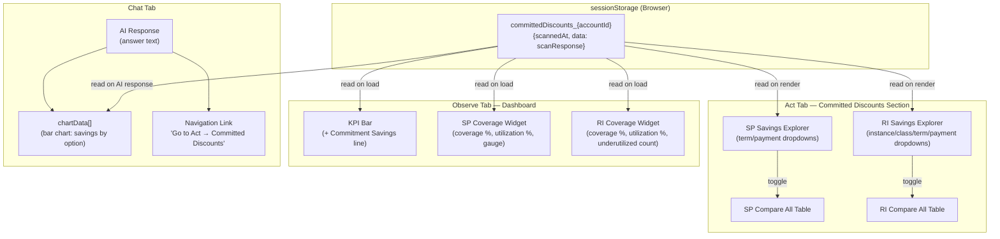

# Design Document: Commitment Savings Explorer

## Overview

The Commitment Savings Explorer transforms the existing static committed-discount results into an interactive exploration experience. The backend already returns SP and RI recommendations for all term/payment combinations in a single scan response cached in `sessionStorage`. This feature adds four capabilities on top of that cached data:

1. **SP Savings Explorer** — Interactive dropdowns (term, payment) that filter cached SP recommendations and display savings per hour/month, break-even, and a "Compare All" table
2. **RI Savings Explorer** — Interactive dropdowns (instance type, offering class, term, payment) that filter cached RI recommendations and display savings, TCO, break-even, and a "Compare All" table
3. **Dashboard Integration** — Two new widgets (SP Coverage, RI Coverage) in the Observe tab's widget grid, plus a commitment savings line in the KPI bar
4. **Chat Integration** — Bar chart `chartData` comparing savings across options when the AI discusses commitments, plus the existing `_addNavLinks` pattern for "Go to Act → Committed Discounts"

### Key Design Decisions

1. **No new API calls**: All explorer interactions filter data already present in `sessionStorage` from the existing scan. This keeps the UX instant and avoids Cost Explorer rate limits.

2. **Widget grid integration**: SP/RI Coverage widgets are added to `DASH_WIDGET_DEFS` and rendered via the existing `_addWidget` / `_buildDashWidgets` pattern, inheriting drag-to-reorder and hide/show capabilities.

3. **Chat chartData injection**: When the AI response mentions "Savings Plan" or "Reserved Instance" and scan data exists in `sessionStorage`, the frontend injects a bar chart into `chartData` before rendering — no backend changes needed for chart generation.

4. **Compare All as toggle**: The comparison table is a collapsible section within each explorer, not a separate view. This avoids navigation complexity and keeps context visible.

5. **Best Value / Lowest TCO badges**: Computed client-side by iterating the filtered recommendation set and comparing `estimatedMonthlySavings * termInYears * 12` (SP) or TCO (RI).

## Architecture



## Components and Interfaces

### Component 1: SP Savings Explorer

**Purpose**: Renders interactive controls for exploring Savings Plan options and displays dynamic savings metrics based on user selection.

**Location**: `members/members.js` — new function `_spExplorerRender(spRecommendations)`

**Interface**:

```javascript
/**
 * Renders the SP Explorer UI inside the committed discounts section.
 * Called by _committedRenderResults() after scan data is available.
 *
 * @param {Array} spRecommendations - Array of SP recommendation objects from scan response
 *   Each object: { planType, termInYears, paymentOption, hourlyCommitment,
 *                  estimatedMonthlySavings, estimatedSavingsPercentage,
 *                  estimatedMonthlyOnDemandCost, breakEvenMonths, upfrontCost, isAggressive }
 */
function _spExplorerRender(spRecommendations) { ... }

/**
 * Handles selection change in SP Explorer dropdowns.
 * Filters spRecommendations by selected planType, term, and payment option.
 * Updates the displayed savings card without API call.
 */
function _spExplorerSelectionChanged() { ... }

/**
 * Toggles the "Compare All Options" table for the selected SP type.
 * Shows all 6 combinations (2 terms × 3 payment options) in a table.
 */
function _spExplorerToggleCompare() { ... }
```

**Behavior**:
- Groups recommendations by `planType` (Compute SP, EC2 Instance SP)
- Renders a dropdown for term (1yr, 3yr) and payment (All Upfront, Partial Upfront, No Upfront)
- Defaults to 1yr / No Upfront
- On change: filters cached array, updates savings display
- Displays: hourly commitment, savings/hr, savings/month (savings/hr × 730), savings %, on-demand equivalent, upfront cost (if applicable), break-even
- "Best Value" badge on the option with highest `estimatedMonthlySavings * termInYears * 12`
- Break-even shows "Immediate" for No Upfront options

### Component 2: RI Savings Explorer

**Purpose**: Renders interactive controls for exploring Reserved Instance options with TCO and break-even calculations.

**Location**: `members/members.js` — new function `_riExplorerRender(riRecommendations)`

**Interface**:

```javascript
/**
 * Renders the RI Explorer UI inside the committed discounts section.
 *
 * @param {Array} riRecommendations - Array of RI recommendation objects from scan response
 *   Each object: { service, instanceType, region, offeringClass, termInYears,
 *                  paymentOption, recommendedCount, estimatedMonthlySavings,
 *                  estimatedSavingsPercentage, breakEvenMonths, upfrontCost,
 *                  monthlyRecurringCost, standardVsConvertibleNote }
 */
function _riExplorerRender(riRecommendations) { ... }

/**
 * Handles selection change in RI Explorer dropdowns.
 * Filters riRecommendations by selected instance type, offering class, term, payment.
 */
function _riExplorerSelectionChanged() { ... }

/**
 * Toggles the "Compare All Options" table for the selected instance type.
 * Shows all available combinations in a table with TCO and break-even.
 * Hidden if fewer than 2 combinations exist.
 */
function _riExplorerToggleCompare() { ... }
```

**Behavior**:
- Populates instance type dropdown from unique `instanceType` values in recommendations
- Offering class dropdown: Standard, Convertible (disabled if no data for that combo)
- Term: 1yr, 3yr; Payment: All Upfront, Partial Upfront, No Upfront
- Defaults to first instance type, Standard, 1yr, No Upfront
- Displays: monthly savings, savings %, recommended count, region, break-even, TCO
- TCO = `upfrontCost + (monthlyRecurringCost × termInYears × 12)`
- Break-even = `upfrontCost / estimatedMonthlySavings` (null for No Upfront)
- "Lowest TCO" badge on option with minimum TCO
- Standard vs Convertible note when Standard saves >5% more
- "Not available" message when a combination doesn't exist in scan data

### Component 3: Dashboard SP Coverage Widget

**Purpose**: Displays SP coverage and utilization metrics in the Observe tab's widget grid.

**Location**: `members/members.js` — added to `DASH_WIDGET_DEFS` array and rendered by `_buildDashWidgets`

**Interface**:

```javascript
/**
 * Renders the SP Coverage widget content.
 * Called during dashboard widget rendering after loadDashboardData().
 * Reads from sessionStorage committedDiscounts_{accountId} cache.
 *
 * @param {HTMLElement} container - The widget's content div (e.g., #dash-sp-coverage)
 */
function _renderSPCoverageWidget(container) { ... }
```

**Behavior**:
- Reads `committedDiscounts_{accountId}` from sessionStorage for selected dashboard accounts
- Displays overall SP coverage % with progress bar (amber if <50%)
- Displays overall SP utilization % with progress bar (red if <80%, tooltip: "Underutilized — you are paying for unused commitment")
- "View Details" link calls `_goToTab('act-tab','committed')`
- Empty state: "No scan data — run a Committed Discounts scan in the Act tab" with link

### Component 4: Dashboard RI Coverage Widget

**Purpose**: Displays RI coverage, utilization, and underutilized count in the Observe tab's widget grid.

**Location**: `members/members.js` — added to `DASH_WIDGET_DEFS` array

**Interface**:

```javascript
/**
 * Renders the RI Coverage widget content.
 *
 * @param {HTMLElement} container - The widget's content div (e.g., #dash-ri-coverage)
 */
function _renderRICoverageWidget(container) { ... }
```

**Behavior**:
- Reads from sessionStorage cache
- Displays overall RI coverage % (amber if <50%)
- Displays overall RI utilization % (red if <80%)
- Displays count of underutilized RIs (utilization <80%) as red badge
- "View Details" link calls `_goToTab('act-tab','committed')`
- Empty state same as SP widget

### Component 5: Dashboard KPI Bar — Commitment Savings Line

**Purpose**: Adds potential commitment savings as a line item in the "Potential Savings" KPI card.

**Location**: `members/members.js` — modification to `renderDashboardWidgets()` function

**Interface**:

```javascript
/**
 * Calculates total potential commitment savings from cached scan data.
 * Returns the sum of estimatedMonthlySavings across all SP + RI recommendations.
 *
 * @param {Array} accountIds - Currently selected dashboard account IDs
 * @returns {number|null} Monthly savings total, or null if no scan data
 */
function _getCommitmentSavingsForKPI(accountIds) { ... }
```

**Behavior**:
- Iterates selected dashboard accounts, reads sessionStorage cache for each
- Sums `estimatedMonthlySavings` from all SP and RI recommendations
- If sum > 0: adds "Commitment Savings (estimated)" line to the Potential Savings KPI card
- If no data: omits the line entirely (no placeholder)
- Tooltip: "Estimated savings if all recommended Savings Plans and Reserved Instances are purchased."

### Component 6: Chat Integration — Savings Chart

**Purpose**: Injects a bar chart into AI chat responses when commitment topics are detected and scan data is available.

**Location**: `members/members.js` — modification to AI response handling after `addAIMessage`

**Interface**:

```javascript
/**
 * Detects commitment-related AI responses and injects chartData.
 * Called after the AI answer is rendered.
 *
 * @param {string} answerText - The AI response text
 * @param {Object} existingChartData - Any chartData already in the response
 * @returns {Array|null} Additional chartData entries to append, or null
 */
function _buildCommitmentChartData(answerText, existingChartData) { ... }
```

**Behavior**:
- Detects keywords: "savings plan", "reserved instance", "commitment", "SP coverage", "RI coverage"
- Reads sessionStorage cache for the queried account(s)
- Builds a bar chart with:
  - Y-axis: Monthly savings ($)
  - X-axis: Option labels (e.g., "1yr No Upfront", "3yr All Upfront")
  - Distinct colors for 1yr (blue) vs 3yr (green) terms
- For SP-specific responses: shows all term/payment combos for the discussed SP type
- For RI-specific responses: shows all offering class/term/payment combos for the discussed instance type
- Returns null if no scan data or no commitment keywords detected

### Component 7: Chat Integration — Navigation Link

**Purpose**: Ensures the existing `_addNavLinks` pattern renders "Go to Act → Committed Discounts" links in commitment-related AI responses.

**Location**: Already implemented in `_addNavLinks()` — the pattern `Go to Act → Committed Discounts` maps to `_goToTab('act-tab','committed')`.

**Behavior**:
- The AI backend already includes "Go to Act → Committed Discounts" text in responses about commitments
- `_addNavLinks()` converts this text to a clickable styled link
- No additional frontend code needed — this is already wired up
- The link renders as a styled button consistent with other nav links

## Data Models

### SP Recommendation Object (from sessionStorage cache)

```json
{
    "planType": "ComputeSavingsPlans | EC2InstanceSavingsPlans",
    "termInYears": 1,
    "paymentOption": "NoUpfront | PartialUpfront | AllUpfront",
    "hourlyCommitment": 5.50,
    "estimatedMonthlySavings": 396.00,
    "estimatedSavingsPercentage": 22.5,
    "estimatedMonthlyOnDemandCost": 1760.00,
    "breakEvenMonths": null,
    "upfrontCost": 0.0,
    "isAggressive": false,
    "aggressiveNote": null
}
```

### RI Recommendation Object (from sessionStorage cache)

```json
{
    "service": "EC2 | RDS",
    "instanceType": "m5.large",
    "region": "us-east-1",
    "offeringClass": "standard | convertible",
    "termInYears": 1,
    "paymentOption": "NoUpfront | PartialUpfront | AllUpfront",
    "recommendedCount": 3,
    "estimatedMonthlySavings": 125.40,
    "estimatedSavingsPercentage": 40.0,
    "breakEvenMonths": 7.2,
    "upfrontCost": 903.00,
    "monthlyRecurringCost": 45.00,
    "standardVsConvertibleNote": "Standard saves 12% more..."
}
```

### Explorer State (in-memory, not persisted)

```javascript
// SP Explorer state
var _spExplorerState = {
    selectedPlanType: 'ComputeSavingsPlans',
    selectedTerm: 1,
    selectedPayment: 'NoUpfront',
    compareExpanded: false
};

// RI Explorer state
var _riExplorerState = {
    selectedInstanceType: '',  // first from list
    selectedOfferingClass: 'standard',
    selectedTerm: 1,
    selectedPayment: 'NoUpfront',
    compareExpanded: false
};
```

### Dashboard Widget Definitions (additions to DASH_WIDGET_DEFS)

```javascript
{ id: 'dash-sp-coverage', title: 'SP Coverage', height: 180, q: 'What is my Savings Plan coverage?' },
{ id: 'dash-ri-coverage', title: 'RI Coverage', height: 180, q: 'What is my Reserved Instance coverage?' }
```

### Chart Data Format (for chat integration)

```json
{
    "id": "commitment-savings-comparison",
    "title": "Savings Plan Options Comparison",
    "type": "bar",
    "labels": ["1yr No Upfront", "1yr Partial", "1yr All Upfront", "3yr No Upfront", "3yr Partial", "3yr All Upfront"],
    "datasets": [
        {
            "label": "Monthly Savings ($)",
            "data": [396, 420, 450, 580, 610, 650],
            "backgroundColor": ["#6366f1", "#6366f1", "#6366f1", "#10b981", "#10b981", "#10b981"]
        }
    ]
}
```

### Filtering Logic

**SP Explorer filtering**:
```javascript
// Given: spRecommendations[], selectedPlanType, selectedTerm, selectedPayment
var match = spRecommendations.find(r =>
    r.planType === selectedPlanType &&
    r.termInYears === selectedTerm &&
    r.paymentOption === selectedPayment
);
```

**RI Explorer filtering**:
```javascript
// Given: riRecommendations[], selectedInstanceType, selectedOfferingClass, selectedTerm, selectedPayment
var match = riRecommendations.find(r =>
    r.instanceType === selectedInstanceType &&
    r.offeringClass === selectedOfferingClass &&
    r.termInYears === selectedTerm &&
    r.paymentOption === selectedPayment
);
```

**Best Value calculation (SP)**:
```javascript
var bestValue = spRecsForType.reduce((best, r) => {
    var totalSavings = r.estimatedMonthlySavings * r.termInYears * 12;
    return totalSavings > best.totalSavings ? { rec: r, totalSavings } : best;
}, { rec: null, totalSavings: 0 });
```

**Lowest TCO calculation (RI)**:
```javascript
var lowestTCO = riRecsForInstance.reduce((best, r) => {
    var tco = (r.upfrontCost || 0) + (r.monthlyRecurringCost || 0) * r.termInYears * 12;
    return tco < best.tco ? { rec: r, tco } : best;
}, { rec: null, tco: Infinity });
```

### Validation Rules

- `savingsPerMonth` = `savingsPerHour × 730` (average hours per month)
- Break-even for No Upfront = null (displayed as "Immediate")
- Break-even for upfront options = `upfrontCost / estimatedMonthlySavings`
- TCO = `upfrontCost + (monthlyRecurringCost × termInYears × 12)`
- Coverage percentages in range [0, 100]
- Utilization percentages in range [0, 100]
- "Underutilized" threshold: utilization < 80%
- SP coverage warning threshold: < 50% (amber)
- SP utilization alert threshold: < 80% (red)
- Standard vs Convertible note shown when Standard saves > 5% more
- "Compare All" toggle hidden when fewer than 2 combinations available
- Commitment savings KPI omitted when no scan data exists (no zero placeholder)


## Correctness Properties

*A property is a characteristic or behavior that should hold true across all valid executions of a system — essentially, a formal statement about what the system should do. Properties serve as the bridge between human-readable specifications and machine-verifiable correctness guarantees.*

### Property 1: Explorer filtering returns the correct recommendation

*For any* array of SP or RI recommendations and any valid selection (planType/term/payment for SP; instanceType/offeringClass/term/payment for RI), the filtering function SHALL return the unique recommendation matching all selection criteria, or null if no match exists. The returned object SHALL be reference-equal to the original array element.

**Validates: Requirements 1.2, 3.2, 3.5**

### Property 2: Savings per month equals savings per hour times 730

*For any* SP recommendation with a non-negative `estimatedMonthlySavings` and `hourlyCommitment`, the displayed Savings_Per_Month SHALL equal `savingsPerHour × 730` (within floating-point tolerance of 0.01). This relationship SHALL hold regardless of term length or payment option.

**Validates: Requirements 1.3, 2.4**

### Property 3: Break-even calculation correctness

*For any* recommendation where `upfrontCost > 0` and `estimatedMonthlySavings > 0`, the break-even point SHALL equal `upfrontCost / estimatedMonthlySavings` rounded to 1 decimal place. *For any* recommendation where `paymentOption === 'NoUpfront'`, the break-even SHALL be null (displayed as "Immediate"). Break-even SHALL always be a positive number when present.

**Validates: Requirements 2.2, 2.3, 4.2**

### Property 4: Total Cost of Ownership calculation

*For any* RI recommendation with `upfrontCost >= 0`, `monthlyRecurringCost >= 0`, and `termInYears ∈ {1, 3}`, the TCO SHALL equal `upfrontCost + (monthlyRecurringCost × termInYears × 12)`. This SHALL hold for all three payment options (No Upfront where upfrontCost=0, Partial Upfront, All Upfront where monthlyRecurringCost=0).

**Validates: Requirements 4.3**

### Property 5: Best Value and Lowest TCO badge placement

*For any* non-empty set of SP recommendations for a given planType, the "Best Value" badge SHALL be placed on the recommendation with the maximum `estimatedMonthlySavings × termInYears × 12`. *For any* non-empty set of RI recommendations for a given instanceType, the "Lowest TCO" badge SHALL be placed on the recommendation with the minimum TCO value. In case of ties, exactly one recommendation SHALL receive the badge.

**Validates: Requirements 2.5, 4.6**

### Property 6: SP grouping produces correct partitions

*For any* array of SP recommendations containing N distinct `planType` values, the grouping function SHALL produce exactly N groups, where each group contains only recommendations with the same `planType`, and the union of all groups equals the original array (no items lost or duplicated).

**Validates: Requirements 1.5**

### Property 7: Instance type dropdown contains exactly the unique types

*For any* array of RI recommendations, the instance type dropdown SHALL contain exactly the set of unique `instanceType` values present in the array. The count of dropdown options SHALL equal the count of distinct instance types. No duplicates SHALL appear.

**Validates: Requirements 3.3**

### Property 8: Standard vs Convertible note threshold

*For any* pair of RI recommendations for the same instance type where one has `offeringClass === 'standard'` and the other has `offeringClass === 'convertible'`, the comparison note SHALL appear if and only if `standardSavingsPercentage - convertibleSavingsPercentage > 5`. The note SHALL include the exact percentage difference.

**Validates: Requirements 4.5**

### Property 9: Coverage and utilization threshold styling

*For any* coverage percentage value in [0, 100], the display color SHALL be amber/warning if and only if the value is below 50. *For any* utilization percentage value in [0, 100], the display color SHALL be red/alert if and only if the value is below 80. The underutilized count SHALL equal the number of items in the underutilized array whose utilization is strictly less than 80.

**Validates: Requirements 5.3, 5.4, 6.2, 6.3, 6.4**

### Property 10: Commitment savings KPI summation

*For any* set of account IDs with cached scan data, the potential commitment savings value SHALL equal the sum of `estimatedMonthlySavings` across all SP recommendations plus all RI recommendations for those accounts. When the recommendations arrays are empty, the sum SHALL be 0 and the KPI line SHALL be omitted.

**Validates: Requirements 7.3**

### Property 11: Chart injection keyword detection

*For any* AI response text, the commitment chart SHALL be injected if and only if the text contains at least one commitment-related keyword (case-insensitive: "savings plan", "reserved instance", "commitment", "SP coverage", "RI coverage") AND sessionStorage contains scan data for the queried account. When either condition is false, no chart SHALL be injected.

**Validates: Requirements 8.1**

### Property 12: Compare table row count and highlighting

*For any* set of recommendations for a selected type/instance, the comparison table SHALL contain exactly as many rows as there are matching recommendations in the cache. The row with the highest `estimatedSavingsPercentage` SHALL be highlighted in green, and the row with the lowest total cost (TCO for RI, total cost over term for SP) SHALL be highlighted in blue. The "Compare All" toggle SHALL be hidden if fewer than 2 rows would be shown.

**Validates: Requirements 11.1, 11.3, 12.1, 12.3, 12.5**

## Error Handling

### Frontend Error Scenarios

| Scenario | Behavior |
|----------|----------|
| sessionStorage empty (no prior scan) | Explorer shows empty state: "Run a Committed Discounts scan first" with scan button |
| sessionStorage data corrupted (invalid JSON) | Catch parse error, show empty state, log warning to console |
| Selected combination not found in cache | RI Explorer disables option, shows "Not available for this instance type" |
| Zero recommendations in scan response | Explorer section hidden, dashboard widgets show "No recommendations available" |
| All monthly savings are 0 | KPI commitment line omitted (no zero placeholder) |
| Chart injection fails (malformed scan data) | Silently skip chart injection, AI response renders normally without chart |
| Widget render fails | Widget shows "Unable to load" with retry link, other widgets unaffected |

### Data Integrity Guards

- Explorer never modifies sessionStorage data (read-only access)
- Filtering functions return `null` for no match rather than throwing
- TCO/break-even calculations guard against division by zero (monthlySavings === 0 → break-even = null)
- Coverage/utilization values clamped to [0, 100] before display
- Chart data validated before injection (must have labels array and datasets array)

## Testing Strategy

### Property-Based Tests (using fast-check for JavaScript)

This feature is frontend-heavy with pure computation functions that are ideal for property-based testing. The filtering, calculation, and threshold logic functions will be extracted into testable pure functions.

**Test file**: `members/tests/commitment-explorer.property.test.js`

**Configuration**: Minimum 100 iterations per property test.

| Property | What's Generated |
|----------|-----------------|
| P1: Explorer filtering | Random arrays of 1-50 recommendations with random field values, random valid/invalid selections |
| P2: Savings per month | Random hourly savings values (0.01–1000.00) |
| P3: Break-even calculation | Random upfront costs (0.01–100000), monthly savings (0.01–10000), payment options |
| P4: TCO calculation | Random upfront (0–50000), monthly recurring (0–5000), terms (1, 3) |
| P5: Badge placement | Random recommendation sets (2–12 items) with varying savings/TCO values |
| P6: SP grouping | Random SP arrays (1–20 items) with 1–4 distinct planTypes |
| P7: Instance type uniqueness | Random RI arrays (1–30 items) with 1–10 distinct instance types |
| P8: Standard vs Convertible threshold | Random savings percentage pairs (0–60%) |
| P9: Threshold styling | Random coverage values (0–100), random utilization lists (0–20 items, values 0–100) |
| P10: KPI summation | Random recommendation lists (0–20 items) with monthly savings (0–5000) |
| P11: Keyword detection | Random text strings with/without commitment keywords, random cache states |
| P12: Compare table | Random recommendation sets (0–12 items) with varying savings/TCO |

Each test is tagged: `// Feature: commitment-savings-explorer, Property {N}: {property_text}`

### Unit Tests (example-based)

- SP Explorer renders with sample data, defaults to 1yr/No Upfront
- RI Explorer renders with sample data, defaults to first instance/Standard/1yr/No Upfront
- Dashboard widgets render with cached scan data
- Dashboard widgets show empty state when no cache
- KPI bar includes commitment savings line when data exists
- KPI bar omits line when no data
- Chat navigation link already works (existing `_addNavLinks` coverage)
- Compare table toggle expands/collapses correctly
- "Not available" message for missing RI combinations

### Integration Tests

- Full flow: scan → cache → explorer renders → selection change → display updates
- Dashboard load with cached data → widgets appear with correct values
- AI query about commitments → chart injected → nav link rendered
- Rescan → cache updated → explorers refresh automatically
