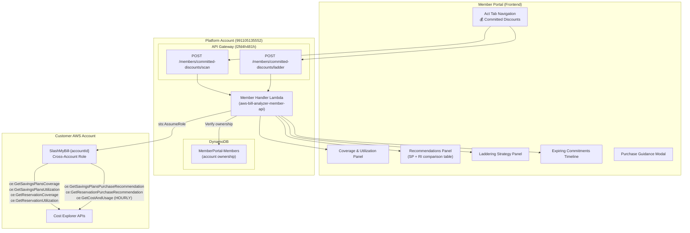

# Design Document: Committed Discount Analyzer

## Overview

SlashMyBill's Act tab currently covers waste cleanup, service optimization (rightsizing, Spot, Graviton), and scheduling. This feature adds a **Committed Discounts** section that analyzes Reserved Instance (RI) and Savings Plan (SP) coverage/utilization, retrieves AWS-native purchase recommendations, and generates an actionable laddering strategy with estimated savings and purchase guidance.

The system uses the AWS Cost Explorer recommendation APIs via the existing cross-account STS AssumeRole pattern (`SlashMyBill-{accountId}` role with SHA-256 ExternalId). Two new API routes are added to the Member Handler Lambda:

- `POST /members/committed-discounts/scan` — Full analysis: coverage, utilization, SP recommendations, RI recommendations, expiring commitments, and a default laddering strategy
- `POST /members/committed-discounts/ladder` — Custom laddering strategy with a user-specified hourly commitment

### Key Design Decisions

1. **P10 Baseline over Average**: The commitment recommendation uses the 10th percentile of hourly spend (not the average) to avoid over-commitment during usage dips. This is the safest commitment level — the "floor" of sustained usage.

2. **Rightsize-First Guard**: Before recommending commitments, the system cross-references pending rightsizing recommendations. Committing on oversized instances locks in waste for 1–3 years.

3. **Quarterly Laddering**: Rather than recommending a single large purchase, the system divides commitments into 4 quarterly tranches. This reduces renewal risk and allows adjustment as usage evolves.

4. **Frontend Caching**: Scan results are cached in `sessionStorage` to avoid repeated Cost Explorer API calls when navigating between tabs. A `scannedAt` timestamp lets the user know data freshness.

5. **Permission Pre-Check**: Before executing the full scan (6+ API calls), a lightweight 1-day coverage check validates that the cross-account role has the required Cost Explorer permissions.

## Architecture



## Components and Interfaces

### Component 1: Committed Discount Scanner

**Purpose**: Orchestrates the full scan — permission check, coverage/utilization retrieval, recommendations, P10 baseline, expiring commitments, and default laddering strategy.

**Interface**:

```python
# POST /members/committed-discounts/scan
# Request:
{
    "accountId": "123456789012"
}

# Response: 200
{
    "scannedAt": "2025-07-15T10:30:00Z",
    "accountId": "123456789012",
    "coverage": {
        "savingsPlans": {
            "overall": 42.5,
            "byService": {
                "Amazon EC2": 55.0,
                "Amazon RDS": 30.2,
                "AWS Lambda": 0.0,
                "Amazon ElastiCache": 18.7,
                "Amazon Redshift": 0.0,
                "Amazon OpenSearch": 0.0
            }
        },
        "reservedInstances": {
            "overall": 38.1,
            "byService": {
                "Amazon EC2": 45.0,
                "Amazon RDS": 22.5,
                "Amazon ElastiCache": 0.0,
                "Amazon Redshift": 0.0,
                "Amazon OpenSearch": 0.0
            }
        }
    },
    "utilization": {
        "savingsPlans": {
            "overall": 91.2,
            "underutilized": []
        },
        "reservedInstances": {
            "overall": 78.5,
            "underutilized": [
                {
                    "id": "ri-0abc123",
                    "instanceType": "m5.xlarge",
                    "utilization": 62.3,
                    "service": "EC2"
                }
            ]
        }
    },
    "baseline": {
        "p10HourlySpend": 12.45,
        "averageHourlySpend": 18.90,
        "variabilityWarning": true,
        "safeCommitmentRange": {"min": 12.45, "max": 13.23},
        "granularity": "HOURLY",
        "dataPoints": 720
    },
    "spRecommendations": [...],
    "riRecommendations": [...],
    "expiringCommitments": [...],
    "ladderingStrategy": {...},
    "organizationSharing": {
        "isManagementAccount": false,
        "multipleAccountsConnected": true,
        "sharingNote": "Savings Plans and RIs can be shared across accounts in the same AWS Organization."
    },
    "rightsizeWarning": {
        "hasRightsizingPending": true,
        "flaggedInstances": [
            {
                "instanceId": "i-0abc123",
                "currentType": "m5.2xlarge",
                "recommendedType": "m5.large",
                "service": "EC2"
            }
        ]
    }
}
```

**Responsibilities**:
- Validate JWT token and account ownership
- Pre-check Cost Explorer permissions with a lightweight 1-day coverage call
- Retrieve SP and RI coverage/utilization for trailing 30 days
- Retrieve SP purchase recommendations (Compute, EC2 Instance, Database types)
- Retrieve RI purchase recommendations (EC2, RDS — Standard and Convertible)
- Calculate P10 baseline from hourly cost data
- Retrieve active commitments with expiration dates
- Cross-reference rightsizing recommendations
- Generate default laddering strategy
- Detect organization sharing context
- Return complete response within 30 seconds

### Component 2: P10 Baseline Calculator

**Purpose**: Calculates the 10th percentile of hourly compute spend to determine the safest commitment level.

**Interface**:

```python
def _calculate_p10_baseline(ce_client, account_id):
    """
    Calculate P10 baseline from hourly cost data.
    
    Returns:
        {
            "p10HourlySpend": float,
            "averageHourlySpend": float,
            "variabilityWarning": bool,  # True if p10 < 70% of average
            "safeCommitmentRange": {"min": float, "max": float},
            "granularity": "HOURLY" | "DAILY",
            "dataPoints": int
        }
    """
```

**Algorithm**:
1. Call `ce:GetCostAndUsage` with HOURLY granularity for trailing 30 days
2. Extract `UnblendedCost` amounts from each hourly period
3. Sort ascending, compute P10 = value at index `len(values) * 0.10`
4. Compute average = sum(values) / len(values)
5. If P10 < 70% of average → set `variabilityWarning = True`
6. Safe commitment range = [P10, min(P10 * 1.1, average * 0.70)]
7. Fallback: if < 7 days of hourly data, use DAILY granularity with note

### Component 3: Savings Plan Recommendation Retriever

**Purpose**: Retrieves and normalizes SP purchase recommendations from AWS Cost Explorer.

**Interface**:

```python
def _get_sp_recommendations(ce_client, average_hourly_spend):
    """
    Retrieve SP recommendations for all types and term-payment combos.
    
    Queries:
        - ComputeSavingsPlans: 1yr NoUpfront, 1yr AllUpfront, 3yr NoUpfront, 3yr AllUpfront
        - EC2InstanceSavingsPlans: same 4 combos
        - (If RDS/ElastiCache spend > $50/mo): Database SP via RI recommendation API
    
    Returns: list of recommendation objects
    """
```

**Response item format**:
```python
{
    "planType": "ComputeSavingsPlans",  # or EC2InstanceSavingsPlans
    "termInYears": 1,
    "paymentOption": "NoUpfront",
    "hourlyCommitment": 5.50,
    "estimatedMonthlySavings": 396.00,
    "estimatedSavingsPercentage": 22.5,
    "estimatedMonthlyOnDemandCost": 1760.00,
    "breakEvenMonths": null,  # null for NoUpfront
    "upfrontCost": 0.0,
    "isAggressive": false,  # true if hourlyCommitment > 70% of avg hourly spend
    "aggressiveNote": null
}
```

### Component 4: Reserved Instance Recommendation Retriever

**Purpose**: Retrieves and normalizes RI purchase recommendations from AWS Cost Explorer.

**Interface**:

```python
def _get_ri_recommendations(ce_client):
    """
    Retrieve RI recommendations for EC2 and RDS.
    
    Queries per service:
        - Standard RI: 1yr (NoUpfront, PartialUpfront, AllUpfront), 3yr (same)
        - Convertible RI: 1yr (NoUpfront, PartialUpfront, AllUpfront), 3yr (same)
    
    Returns: list of recommendation objects
    """
```

**Response item format**:
```python
{
    "service": "EC2",
    "instanceType": "m5.large",
    "region": "us-east-1",
    "offeringClass": "standard",  # or "convertible"
    "termInYears": 1,
    "paymentOption": "AllUpfront",
    "recommendedCount": 3,
    "estimatedMonthlySavings": 125.40,
    "estimatedSavingsPercentage": 40.0,
    "breakEvenMonths": 7.2,
    "upfrontCost": 903.00,
    "standardVsConvertibleNote": "Standard saves 12% more than Convertible for this instance type"
}
```

### Component 5: Laddering Strategy Generator

**Purpose**: Divides the total recommended commitment into quarterly tranches spread over 12 months.

**Interface**:

```python
# POST /members/committed-discounts/ladder
# Request:
{
    "accountId": "123456789012",
    "totalHourlyCommitment": 12.00
}

# Response: 200
{
    "totalHourlyCommitment": 12.00,
    "averageHourlySpend": 18.90,
    "commitmentPercentage": 63.5,
    "isAggressive": false,
    "aggressiveWarning": null,
    "tranches": [
        {
            "trancheNumber": 1,
            "purchaseDate": "2025-07-15",
            "hourlyCommitment": 3.00,
            "cumulativeCommitment": 3.00,
            "estimatedMonthlySavings": 216.00,
            "recommendedType": "ComputeSavingsPlans",
            "rationale": "Flexibility — covers any EC2, Fargate, or Lambda usage"
        },
        {
            "trancheNumber": 2,
            "purchaseDate": "2025-10-15",
            "hourlyCommitment": 3.00,
            "cumulativeCommitment": 6.00,
            "estimatedMonthlySavings": 432.00,
            "recommendedType": "ComputeSavingsPlans",
            "rationale": "Flexibility — usage patterns still stabilizing"
        },
        {
            "trancheNumber": 3,
            "purchaseDate": "2026-01-15",
            "hourlyCommitment": 3.00,
            "cumulativeCommitment": 9.00,
            "estimatedMonthlySavings": 648.00,
            "recommendedType": "EC2InstanceSavingsPlans",
            "rationale": "Deeper discount — usage patterns confirmed stable"
        },
        {
            "trancheNumber": 4,
            "purchaseDate": "2026-04-15",
            "hourlyCommitment": 3.00,
            "cumulativeCommitment": 12.00,
            "estimatedMonthlySavings": 864.00,
            "recommendedType": "EC2InstanceSavingsPlans",
            "rationale": "Deeper discount — final tranche locks in remaining baseline"
        }
    ]
}
```

**Algorithm**:
1. Validate `totalHourlyCommitment` does not exceed 70% of average hourly spend
2. Divide total into 4 equal tranches, rounded to nearest $0.01/hr
3. Assign purchase dates at months 0, 3, 6, 9 from current date
4. Tranches 1–2: recommend Compute SP (flexibility)
5. Tranches 3–4: recommend EC2 Instance SP (deeper discount, if usage stable)
6. Calculate cumulative monthly savings at each tranche point

### Component 6: Expiring Commitments Tracker

**Purpose**: Retrieves active RI and SP details with expiration dates to show upcoming coverage gaps.

**Interface**:

```python
def _get_expiring_commitments(ce_client, sp_client, ec2_client, rds_client):
    """
    Retrieve active commitments expiring in the next 90 days.
    
    Returns:
        {
            "expiring": [
                {
                    "type": "SavingsPlan",
                    "id": "sp-0abc123",
                    "planType": "ComputeSavingsPlans",
                    "hourlyCommitment": 5.50,
                    "monthlyValue": 3960.00,
                    "expiresAt": "2025-08-15",
                    "daysUntilExpiry": 28,
                    "coverageImpact": 15.2,
                    "urgency": "expiring_soon"  # expiring_soon (<30d) or upcoming (30-90d)
                }
            ],
            "nextExpiration": "2025-08-15",  # null if none
            "noUpcomingExpirations": false
        }
    """
```

### Component 7: Frontend Committed Discounts UI

**Purpose**: New section in the Act tab with navigation button, account selector, scan trigger, and result panels.

**Responsibilities**:
- Add "💰 Committed Discounts" button to Act tab navigation (after Scheduler)
- Display account selector and "Scan" button
- Show coverage/utilization summary card at top
- Render SP and RI recommendations in a comparison table
- Display laddering strategy as a timeline
- Show expiring commitments with urgency badges
- Display rightsize-first warning when applicable
- Show organization sharing tip for multi-account members
- Provide "How to Purchase" modal with step-by-step instructions
- Cache scan results in `sessionStorage` keyed by account ID
- Display `scannedAt` timestamp and "Rescan" button

## Data Models

### Scan Response Schema

```json
{
    "scannedAt": "ISO-8601 timestamp",
    "accountId": "12-digit string",
    "coverage": {
        "savingsPlans": {
            "overall": "float [0-100]",
            "byService": {"service_name": "float [0-100]"}
        },
        "reservedInstances": {
            "overall": "float [0-100]",
            "byService": {"service_name": "float [0-100]"}
        }
    },
    "utilization": {
        "savingsPlans": {
            "overall": "float [0-100]",
            "underutilized": [{"id": "string", "utilization": "float", "service": "string"}]
        },
        "reservedInstances": {
            "overall": "float [0-100]",
            "underutilized": [{"id": "string", "instanceType": "string", "utilization": "float", "service": "string"}]
        }
    },
    "baseline": {
        "p10HourlySpend": "float >= 0",
        "averageHourlySpend": "float >= 0",
        "variabilityWarning": "boolean",
        "safeCommitmentRange": {"min": "float", "max": "float"},
        "granularity": "HOURLY | DAILY",
        "dataPoints": "int >= 0"
    },
    "spRecommendations": ["SP recommendation objects"],
    "riRecommendations": ["RI recommendation objects"],
    "expiringCommitments": {
        "expiring": ["commitment objects"],
        "nextExpiration": "ISO-8601 date or null",
        "noUpcomingExpirations": "boolean"
    },
    "ladderingStrategy": {
        "totalHourlyCommitment": "float",
        "tranches": ["tranche objects"]
    },
    "organizationSharing": {
        "isManagementAccount": "boolean",
        "multipleAccountsConnected": "boolean",
        "sharingNote": "string"
    },
    "rightsizeWarning": {
        "hasRightsizingPending": "boolean",
        "flaggedInstances": ["instance objects"]
    }
}
```

### Validation Rules

- `accountId` must be exactly 12 digits and owned by the authenticated member
- Coverage percentages must be in range [0, 100]
- Utilization percentages must be in range [0, 100]
- `underutilized` items must have utilization < 80%
- `p10HourlySpend` must be <= `averageHourlySpend`
- `safeCommitmentRange.min` must be <= `safeCommitmentRange.max`
- Break-even months must be > 0 for upfront payment options
- Laddering tranches must sum to `totalHourlyCommitment` (within $0.01 rounding)
- Each tranche `hourlyCommitment` must be rounded to nearest $0.01
- `totalHourlyCommitment` must not exceed 70% of `averageHourlySpend`
- Expiring commitment `daysUntilExpiry` must be in range [0, 90]

### Frontend Cache Structure (sessionStorage)

```json
{
    "committedDiscounts_{accountId}": {
        "scannedAt": "2025-07-15T10:30:00Z",
        "data": { "...full scan response..." }
    }
}
```


## Correctness Properties

*A property is a characteristic or behavior that should hold true across all valid executions of a system — essentially, a formal statement about what the system should do. Properties serve as the bridge between human-readable specifications and machine-verifiable correctness guarantees.*

### Property 1: Coverage and utilization aggregation produces valid percentages

*For any* set of Cost Explorer coverage/utilization API responses containing one or more time periods with numeric coverage/utilization values, the aggregated overall percentage SHALL be in the range [0, 100], and each per-service breakdown percentage SHALL also be in the range [0, 100]. The overall percentage SHALL equal the weighted average of per-period values (weighted by spend or hours).

**Validates: Requirements 2.1, 2.2, 2.3**

### Property 2: Underutilization flagging threshold

*For any* list of RI or SP items with utilization percentages, the `underutilized` output list SHALL contain exactly those items whose utilization is strictly less than 80%, and each item in the underutilized list SHALL include its specific utilization percentage. Items with utilization >= 80% SHALL NOT appear in the underutilized list.

**Validates: Requirement 2.4**

### Property 3: Recommendation response field completeness

*For any* SP recommendation returned by the system, the output SHALL contain all of: planType, termInYears, paymentOption, hourlyCommitment, estimatedMonthlySavings, estimatedSavingsPercentage, and estimatedMonthlyOnDemandCost. *For any* RI recommendation returned by the system, the output SHALL contain all of: service, instanceType, region, offeringClass, termInYears, paymentOption, recommendedCount, estimatedMonthlySavings, and estimatedSavingsPercentage.

**Validates: Requirements 3.3, 4.4**

### Property 4: Break-even calculation correctness

*For any* recommendation with an upfront payment (upfrontCost > 0) and positive monthly savings (monthlySavings > 0), the break-even point in months SHALL equal `upfrontCost / monthlySavings` (rounded to 1 decimal place). For No Upfront payment options, break-even SHALL be null. Break-even SHALL always be a positive number when present.

**Validates: Requirements 3.4, 4.5**

### Property 5: Aggressive commitment threshold detection

*For any* hourly commitment amount and average hourly on-demand spend where average > 0, the recommendation SHALL be flagged as "aggressive" if and only if `hourlyCommitment > averageHourlySpend * 0.70`. The aggressive note SHALL recommend the 60–70% range. When `averageHourlySpend` is 0, no aggressive flag SHALL be set.

**Validates: Requirements 3.5, 5.6, 10.5**

### Property 6: Laddering strategy structural correctness

*For any* valid total hourly commitment and current date, the laddering strategy SHALL produce exactly 4 tranches where: (a) each tranche's hourly commitment is within $0.01 of 25% of the total, (b) the sum of all tranche commitments equals the total (within $0.01 rounding tolerance), (c) purchase dates are at month offsets 0, 3, 6, 9 from the current date, (d) cumulative commitment at tranche N equals the sum of tranches 1 through N, (e) tranches 1–2 recommend ComputeSavingsPlans and tranches 3–4 recommend EC2InstanceSavingsPlans.

**Validates: Requirements 5.1, 5.2, 5.3, 5.4, 5.5**

### Property 7: P10 baseline calculation correctness

*For any* non-empty list of hourly spend values, the P10 baseline SHALL equal the value at index `floor(len(values) * 0.10)` when values are sorted ascending. The variability warning SHALL be set to true if and only if `p10 < averageHourlySpend * 0.70`. The safe commitment range SHALL be `[p10, min(p10 * 1.1, averageHourlySpend * 0.70)]`, and `safeCommitmentRange.min <= safeCommitmentRange.max` SHALL always hold.

**Validates: Requirements 12.2, 12.3, 12.4**

### Property 8: Diverse workload Compute SP highlighting

*For any* set of service spend values, the Compute Savings Plan SHALL be highlighted as "Recommended for flexibility" if and only if more than 2 services have significant spend (defined as > 10% of total spend). When 2 or fewer services have significant spend, no flexibility highlight SHALL be applied.

**Validates: Requirement 6.2**

### Property 9: Total cost of ownership calculation

*For any* recommendation with term length T (in years), upfront cost U, and monthly recurring cost M, the total cost of ownership SHALL equal `U + (M * T * 12)`. This SHALL hold for all three payment options (No Upfront where U=0, Partial Upfront, All Upfront where M=0).

**Validates: Requirement 6.4**

### Property 10: Annual savings aggregation

*For any* list of recommendations each with an `estimatedMonthlySavings` value, the total estimated annual savings SHALL equal `sum(estimatedMonthlySavings for all recommendations) * 12`. When the recommendations list is empty, annual savings SHALL be 0.

**Validates: Requirement 6.5**

### Property 11: Database SP inclusion threshold

*For any* account with monthly RDS or ElastiCache spend, Database Savings Plan recommendations SHALL be included in the response if and only if the combined RDS + ElastiCache monthly spend exceeds $50. When spend is <= $50, the database SP section SHALL be omitted.

**Validates: Requirement 11.2**

### Property 12: Rightsize-first warning correctness

*For any* set of RI/SP recommendations and pending rightsizing recommendations, the rightsize warning SHALL be triggered if and only if there exists at least one instance type that appears in both the commitment recommendations and the rightsizing recommendations. The warning SHALL list all overlapping instances with their current type and recommended type.

**Validates: Requirements 13.2, 13.3**

### Property 13: Expiring commitments filtering and urgency

*For any* set of active commitments with expiration dates and a reference date, the expiring commitments list SHALL contain exactly those commitments expiring within 90 days of the reference date. Each commitment with `daysUntilExpiry < 30` SHALL have urgency "expiring_soon", and those with `30 <= daysUntilExpiry <= 90` SHALL have urgency "upcoming". The coverage gap percentage SHALL equal `commitmentCoverage / totalCoverage * 100` for each expiring commitment.

**Validates: Requirements 14.2, 14.3, 14.4**

### Property 14: CloudFormation template includes all required CE permissions

*For any* valid 12-digit account ID and member email, the generated CloudFormation template SHALL include all of the following IAM actions: `ce:GetSavingsPlansPurchaseRecommendation`, `ce:GetReservationPurchaseRecommendation`, `ce:GetSavingsPlansUtilization`, `ce:GetSavingsPlansCoverage`, `ce:GetReservationUtilization`, `ce:GetReservationCoverage`, and `ce:GetCostAndUsage`.

**Validates: Requirement 8.1**

### Property 15: AWS console link construction

*For any* valid AWS region string and service type (SavingsPlans or ReservedInstances), the generated console link SHALL contain the correct region code and the correct console path (`/cost-management/home#/savings-plans/purchase` for SP, `/ec2/v2/home#ReservedInstances` for EC2 RI, `/rds/home#reserved-instances` for RDS RI).

**Validates: Requirement 7.3**

## Error Handling

### Member Handler Errors

| Scenario | HTTP Status | Error Code | Behavior |
|----------|-------------|------------|----------|
| Missing or invalid JWT token | 401 | Unauthorized | Return error, no processing |
| Account not owned by member | 403 | Forbidden | Return error |
| Invalid account ID (not 12 digits) | 400 | InvalidAccountId | Return error |
| Cross-account role missing CE permissions | 403 | InsufficientPermissions | Return error listing required IAM actions and template update link |
| Cost Explorer API returns no data | 200 | — | Return 0% coverage/utilization with "insufficient history" message |
| Cost Explorer API timeout (> 25s) | 504 | Timeout | Return timeout error with retry suggestion |
| Cost Explorer API throttling | 429 | Throttled | Return error suggesting retry in 60 seconds |
| Hourly data unavailable (< 7 days) | 200 | — | Fall back to DAILY granularity with note |
| Ladder route: commitment > 70% of average | 200 | — | Return strategy with `isAggressive: true` and warning message |
| Ladder route: totalHourlyCommitment <= 0 | 400 | InvalidInput | Return validation error |
| Ladder route: averageHourlySpend is 0 (no data) | 400 | InsufficientData | Return error indicating no spend data available |
| STS AssumeRole fails | 403 | ConnectionFailed | Return error suggesting re-deploying CloudFormation template |

### Error Recovery Strategy

1. **Permission pre-check**: Before the full scan (6+ API calls), attempt a lightweight `ce:GetSavingsPlansCoverage` with a 1-day range. If this fails with AccessDenied, return immediately with a clear permission error — avoiding wasted API calls.

2. **Partial failure tolerance**: If SP recommendations succeed but RI recommendations fail, return the successful data with an error note on the failed section rather than failing the entire scan.

3. **Timeout management**: Each Cost Explorer API call has a 5-second individual timeout. If the total scan approaches 25 seconds, return whatever data has been collected with a note about incomplete results.

4. **Rate limiting**: Cost Explorer APIs have account-level rate limits. If throttled, return a 429 with a "retry in 60 seconds" message rather than retrying internally (to avoid Lambda timeout).

## Testing Strategy

### Property-Based Tests (using Hypothesis for Python)

Each correctness property maps to a property-based test with minimum 100 iterations:

| Property | Test File | What's Generated |
|----------|-----------|-----------------|
| P1: Coverage aggregation | `member-handler/tests/test_committed_discount_properties.py` | Random lists of coverage periods with percentages (0-100), varying period counts (1-30) |
| P2: Underutilization flagging | `member-handler/tests/test_committed_discount_properties.py` | Random lists of RI/SP items with utilization values (0-100) |
| P3: Recommendation completeness | `member-handler/tests/test_committed_discount_properties.py` | Random API response objects with varying field presence |
| P4: Break-even calculation | `member-handler/tests/test_committed_discount_properties.py` | Random upfront costs (0.01-100000), monthly savings (0.01-10000) |
| P5: Aggressive threshold | `member-handler/tests/test_committed_discount_properties.py` | Random hourly commitments (0.01-1000), average spends (0.01-2000) |
| P6: Laddering structure | `member-handler/tests/test_committed_discount_properties.py` | Random total commitments (0.01-500), random start dates |
| P7: P10 baseline | `member-handler/tests/test_committed_discount_properties.py` | Random lists of hourly spend values (100-1000 items, values 0.01-100) |
| P8: Diverse workload detection | `member-handler/tests/test_committed_discount_properties.py` | Random service spend distributions (1-10 services, values 0-10000) |
| P9: TCO calculation | `member-handler/tests/test_committed_discount_properties.py` | Random terms (1,3), upfront costs (0-50000), monthly costs (0-5000) |
| P10: Annual savings | `member-handler/tests/test_committed_discount_properties.py` | Random lists of recommendations (0-20 items) with monthly savings (0-5000) |
| P11: Database SP threshold | `member-handler/tests/test_committed_discount_properties.py` | Random RDS/ElastiCache monthly spend values (0-1000) |
| P12: Rightsize warning | `member-handler/tests/test_committed_discount_properties.py` | Random RI instance types and rightsizing instance types with varying overlap |
| P13: Expiring commitments | `member-handler/tests/test_committed_discount_properties.py` | Random commitment lists with expiration dates (0-365 days from now) |
| P14: Template permissions | `member-handler/tests/test_committed_discount_properties.py` | Random 12-digit account IDs, random email addresses |
| P15: Console link construction | `member-handler/tests/test_committed_discount_properties.py` | Random AWS region strings, random service types |

Each test is tagged: `# Feature: committed-discount-analyzer, Property {N}: {property_text}`

### Unit Tests (example-based)

- Scan happy path: mock all CE APIs, verify complete response structure
- Permission pre-check failure returns clear error with required actions
- Empty API response returns 0% coverage/utilization
- No SP recommendations returns empty list with "insufficient history" message
- No RI recommendations returns empty list with "no steady-state patterns" message
- Hourly data fallback to daily when < 7 days available
- Ladder route rejects commitment <= 0
- Ladder route warns when commitment > 70% of average
- Rightsize warning appears when overlap exists
- Rightsize warning absent when no overlap
- Organization sharing note for multi-account members
- Management account aggregation behavior
- Expiring soon badge at exactly 30 days boundary
- Cache key structure in sessionStorage

### Integration Tests

- End-to-end scan flow: authenticate → scan → verify response structure
- Cross-account role assumption with CE permissions
- API Gateway route registration for both new routes
- Timeout handling when CE APIs are slow
- Partial failure: SP succeeds but RI fails
- Frontend navigation: click Committed Discounts → section visible, others hidden
- Frontend caching: scan → navigate away → return → cached data displayed
- Frontend rescan: clear cache → fresh API call

### Performance Considerations

- **API call parallelization**: Coverage, utilization, SP recommendations, and RI recommendations can be fetched in parallel using `concurrent.futures.ThreadPoolExecutor` to stay within the 30-second timeout
- **Hourly data volume**: 30 days × 24 hours = 720 data points for P10 calculation — fits comfortably in memory
- **Frontend caching**: sessionStorage avoids repeated 6+ API calls when navigating between tabs
- **Cost Explorer rate limits**: Account-level limits apply; the permission pre-check consumes one call, so budget 5 remaining calls for the full scan

