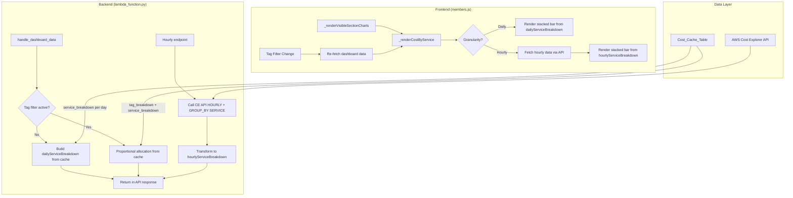

# Design Document: Cost By Service Widget

## Overview

The Cost By Service widget adds a stacked bar chart to the Observe > Cost Analysis section that visualizes AWS service cost breakdown over time. It supports daily (from cache) and hourly (from Cost Explorer API) granularity, respects tag filters via proportional allocation, and follows the existing widget rendering patterns in `members.js`.

The widget reuses the `service_breakdown` data already stored in the DynamoDB `Cost_Cache_Table` for daily view, ensuring instant load with no additional API calls. For hourly drill-down, it calls the Cost Explorer API with `HOURLY` granularity grouped by service.

## Architecture



## Components and Interfaces

### Backend: `handle_dashboard_data` Enhancement

**New response fields added to the existing dashboard data response:**

```python
# Added to the response dict in handle_dashboard_data
{
    "dailyServiceBreakdown": [
        {"date": "2024-01-15", "services": {"Amazon EC2": 55.29, "Amazon RDS": 12.50, ...}},
        {"date": "2024-01-16", "services": {"Amazon EC2": 48.10, "Amazon RDS": 11.80, ...}},
        ...
    ],
    "hourlyServiceBreakdown": [  # Only when hourly=true query param
        {"hour": "2024-01-15T08:00", "services": {"Amazon EC2": 2.31, ...}},
        ...
    ]
}
```

**New helper function: `_build_daily_service_breakdown(cache_items, tag_key=None, tag_value=None)`**

- Input: List of cache items from Cost_Cache_Table, optional tag filter params
- Output: Sorted list of `{"date": str, "services": dict}` entries
- Logic:
  1. Iterate cache items, extract `service_breakdown` from each
  2. Skip items without `service_breakdown`
  3. If tag filter active: compute proportional allocation per service
  4. Merge across accounts by summing per service per day
  5. Sort by date ascending

**New helper function: `_fetch_hourly_service_breakdown(creds, tag_key=None, tag_value=None)`**

- Input: AWS credentials, optional tag filter
- Output: List of `{"hour": str, "services": dict}` entries
- Logic:
  1. Call Cost Explorer `get_cost_and_usage` with HOURLY granularity, GROUP_BY SERVICE, last 3 days
  2. If tag filter: add tag filter to CE query
  3. Transform CE response groups into our format

### Frontend: `_renderCostByService` Function

**New function registered in the widget dispatch:**

```javascript
// In _renderVisibleSectionCharts:
if (toRender.indexOf('dash-cost-by-service') !== -1) 
    _renderCostByService(data.dailyServiceBreakdown || [], data.hourlyServiceBreakdown || []);
```

**Widget HTML structure (injected by render function):**

```html
<div id="dash-cost-by-service" class="observe-widget" style="min-width:380px;">
    <div class="widget-header">
        <span class="widget-title">Cost By Service</span>
        <div class="granularity-toggle">
            <button class="active" data-gran="daily">Daily</button>
            <button data-gran="hourly">Hourly</button>
        </div>
    </div>
    <div class="chart-container" style="height:280px;"></div>
</div>
```

**Rendering logic:**
1. Extract top 8 services by total cost across all days
2. Group remaining into "Other"
3. Build ECharts stacked bar series (one per service)
4. Apply `_treemapColors` palette
5. Configure tooltip with service name, USD cost, and percentage
6. Add legend at bottom
7. Attach resize listener

### Frontend: Granularity Toggle

**Pattern:** Follows existing `_renderDailyTrend` / `_renderHourlyTrend` toggle pattern.

- Daily data is cached in a module-level variable (`_dashServiceDaily`)
- Hourly data is fetched on-demand via `api('GET', '/members/dashboard-data?hourly=true')`
- Toggle state persisted in `sessionStorage.setItem('costByServiceGran', 'daily'|'hourly')`
- Loading spinner shown during hourly fetch

### Widget Registration

```javascript
var OBSERVE_WIDGET_SECTIONS = {
    'observe-cost': ['dash-treemap', 'dash-daily', 'dash-monthly', 'dash-regional', 'dash-cost-by-tag', 'dash-cost-by-service'],
    // ... other sections unchanged
};
```

## Data Models

### Cost_Cache_Table Record (existing, read-only)

| Field | Type | Description |
|-------|------|-------------|
| pk | String | `{email}#{accountId}` |
| sk | String | `DAILY#{YYYY-MM-DD}` |
| cost_amount | Number | Total cost for the day |
| service_breakdown | Map | `{"ServiceName": cost_float, ...}` |
| tag_breakdown | Map | Nested tag key → tag value → cost |

### API Response: `dailyServiceBreakdown`

```json
[
    {
        "date": "2024-01-15",
        "services": {
            "Amazon EC2": 55.29,
            "Amazon RDS": 12.50,
            "Amazon S3": 3.21,
            "AWS Lambda": 1.05
        }
    }
]
```

### API Response: `hourlyServiceBreakdown`

```json
[
    {
        "hour": "2024-01-15T08:00",
        "services": {
            "Amazon EC2": 2.31,
            "Amazon RDS": 0.52
        }
    }
]
```

### Proportional Allocation Formula

When a tag filter is active with total tag cost `T` for a day, and the day's service breakdown has services `{S1: c1, S2: c2, ...}` with total `C`:

```
allocated_cost(Si) = T * (ci / C)
```

Invariant: `sum(allocated_cost(Si) for all i) == T`

## Correctness Properties

*A property is a characteristic or behavior that should hold true across all valid executions of a system — essentially, a formal statement about what the system should do. Properties serve as the bridge between human-readable specifications and machine-verifiable correctness guarantees.*

### Property 1: Daily Service Breakdown Structure

*For any* set of cache records containing `service_breakdown` fields, the `_build_daily_service_breakdown` function SHALL produce an array where each entry has a `date` string in YYYY-MM-DD format and a `services` object mapping service name strings to non-negative numeric costs.

**Validates: Requirements 1.1, 1.2**

### Property 2: Date Ordering Invariant

*For any* set of cache records in any order, the `dailyServiceBreakdown` output array SHALL be sorted in strictly ascending date order.

**Validates: Requirements 1.3**

### Property 3: Multi-Account Merge Correctness

*For any* set of cache records from multiple accounts sharing overlapping dates and services, the merged `dailyServiceBreakdown` entry for a given date SHALL have each service cost equal to the sum of that service's cost across all accounts for that date.

**Validates: Requirements 1.4**

### Property 4: Proportional Tag Allocation

*For any* day with total tag cost `T > 0` and service breakdown `{S1: c1, S2: c2, ...}` with total `C > 0`, the allocated cost for each service SHALL equal `T * (ci / C)`, and the sum of all allocated service costs SHALL equal `T` (within floating-point tolerance).

**Validates: Requirements 2.1**

### Property 5: Hourly Breakdown Structure

*For any* valid Cost Explorer API response with hourly granularity grouped by service, the transformation SHALL produce an array where each entry has an `hour` string in `YYYY-MM-DDTHH:00` format and a `services` object mapping service name strings to non-negative numeric costs.

**Validates: Requirements 3.2**

### Property 6: Top-8 Service Grouping

*For any* service breakdown data with N services (N > 8), the chart SHALL display exactly 8 named service series plus one "Other" series, where "Other" equals the sum of all services not in the top 8 by total cost.

**Validates: Requirements 5.2**

### Property 7: Tooltip Formatter Correctness

*For any* tooltip parameters containing a service name and cost value, the formatter SHALL produce output containing the service name, the cost formatted as USD with exactly 2 decimal places, and the correct percentage of that time period's total cost (within 0.1% tolerance).

**Validates: Requirements 5.4**

## Error Handling

| Scenario | Backend Behavior | Frontend Behavior |
|----------|-----------------|-------------------|
| No cache records exist | Return empty `dailyServiceBreakdown: []` | Display "No service breakdown data available" empty state |
| Cache record missing `service_breakdown` | Skip that day (omit from array) | Chart shows gap for that day |
| Tag filter yields zero cost all days | Return `dailyServiceBreakdown` with all-zero services | Display "No data available for selected tag" message |
| Hourly granularity not enabled | CE API returns error | Display "Enable hourly granularity in AWS Cost Explorer settings" message |
| CE API rate limit / timeout | Return 503 with retry hint | Show "Unable to load hourly data. Try again." with retry button |
| Tag filter + hourly CE call fails | Return error for hourly only | Fall back to daily view, show error toast |
| Zero total cost for a day (division by zero in allocation) | Skip proportional allocation, return zero for all services | Chart shows $0 bar for that day |

## Testing Strategy

### Unit Tests (Example-Based)

- **Backend:**
  - `_build_daily_service_breakdown` with known input → expected output
  - Proportional allocation with known ratios → expected allocated costs
  - Handling of missing `service_breakdown` field
  - Empty cache → empty array
  - Hourly CE response transformation with known data

- **Frontend:**
  - Widget registration in `OBSERVE_WIDGET_SECTIONS`
  - Initial render defaults to daily granularity
  - Toggle switches between daily/hourly views
  - Loading indicator appears during hourly fetch
  - Empty state message for zero data
  - Resize handler attached to chart instance
  - Session storage persistence of granularity

### Property-Based Tests

**Library:** Hypothesis (Python backend), fast-check (JavaScript frontend)

**Configuration:** Minimum 100 iterations per property test.

| Property | Test Description | Tag |
|----------|-----------------|-----|
| 1 | Generate random cache records, verify output structure | Feature: cost-by-service-widget, Property 1: Daily service breakdown structure |
| 2 | Generate cache records in random order, verify ascending date sort | Feature: cost-by-service-widget, Property 2: Date ordering invariant |
| 3 | Generate multi-account overlapping data, verify sum correctness | Feature: cost-by-service-widget, Property 3: Multi-account merge correctness |
| 4 | Generate random service breakdowns + tag costs, verify proportional allocation and sum invariant | Feature: cost-by-service-widget, Property 4: Proportional tag allocation |
| 5 | Generate random CE hourly responses, verify transformation structure | Feature: cost-by-service-widget, Property 5: Hourly breakdown structure |
| 6 | Generate random service data with >8 services, verify top-8 + Other grouping | Feature: cost-by-service-widget, Property 6: Top-8 service grouping |
| 7 | Generate random tooltip params, verify formatter output format and percentage | Feature: cost-by-service-widget, Property 7: Tooltip formatter correctness |

### Integration Tests

- End-to-end: Dashboard API returns `dailyServiceBreakdown` from real cache data
- Tag filter: API returns proportionally allocated data when tag params provided
- Hourly: API calls CE with correct parameters and returns structured response
- Widget renders in browser with ECharts (visual smoke test)
