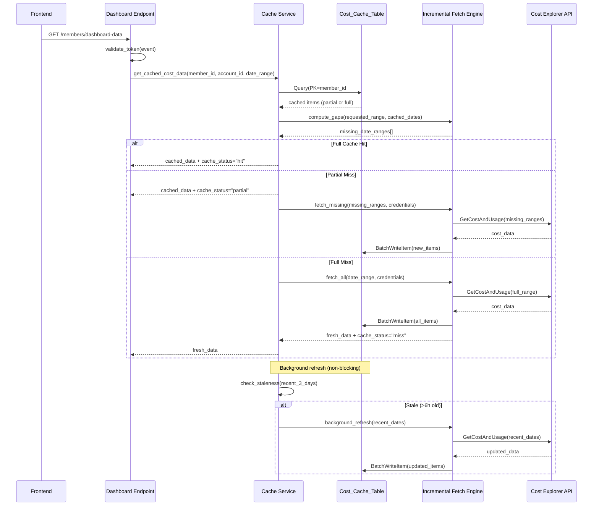
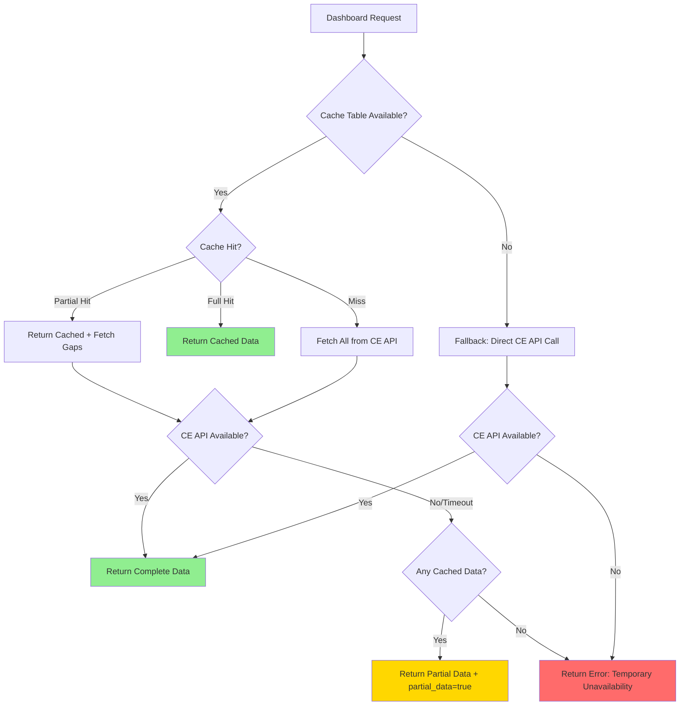

# Design Document: Cost Data Cache

## Overview

The Cost Data Cache introduces a DynamoDB-based caching layer between the `handle_dashboard_data` endpoint and the AWS Cost Explorer API. Currently, every dashboard load triggers real-time cross-account CE API calls via STS AssumeRole, causing 3-8 second load times and occasional timeouts for accounts with extensive cost history.

This design adds a `Cost_Cache_Table` in DynamoDB that stores per-day cost data partitioned by tenant and account. An Incremental Fetch Engine determines which date ranges are missing from the cache and fetches only those gaps. A background refresh mechanism keeps recent data fresh without blocking user requests.

**Key Design Decisions:**
- **Single Lambda architecture**: The cache service runs within the existing `member-handler` Lambda rather than a separate function, avoiding cold start overhead and simplifying deployment.
- **Per-day item granularity**: Each day's cost data is stored as a separate DynamoDB item, enabling efficient range queries and granular TTL expiration.
- **Daily-only granularity**: Only DAILY granularity is supported to limit data volume in DynamoDB. Monthly summaries are computed at query time by aggregating daily items.
- **Tenant-scoped partition keys**: The partition key includes `member_id#account_id` to enforce tenant isolation at the data layer.
- **Stale-while-revalidate pattern**: Serve cached data immediately, refresh in background when stale.
- **Shared cache across consumers**: Both the `member-handler` (dashboard API) and `agent-action` (Bedrock Agent) Lambda read from the same `Cost_Cache_Table`, ensuring consistent data and reduced CE API calls.

## Architecture



### Module Layout

```
member-handler/
├── lambda_function.py          # Existing - modified to integrate cache
├── cache_service.py            # NEW - Cache Service module
├── incremental_fetch_engine.py # NEW - Gap detection + fetch logic
└── ...

agent-action/
├── lambda_function.py          # Existing - modified to read from cache
└── ...
```

## Components and Interfaces

### 1. Cache Service (`cache_service.py`)

The central module that orchestrates cache reads, writes, and background refresh.

```python
class CacheService:
    """Manages cost data caching with tenant isolation."""

    def __init__(self, table_name: str, dynamodb_resource=None):
        """Initialize with DynamoDB table reference."""

    def get_cost_data(
        self,
        member_id: str,
        account_id: str,
        start_date: str,
        end_date: str,
        credentials: dict = None
    ) -> CacheResult:
        """
        Read cost data from cache, fetch missing ranges if needed.
        Returns CacheResult with data and cache_status.
        """

    def write_cost_data(
        self,
        member_id: str,
        account_id: str,
        items: list[CostDataItem]
    ) -> bool:
        """Write fetched cost data items to cache using BatchWriteItem."""

    def invalidate(
        self,
        member_id: str,
        account_id: str,
        start_date: str = None,
        end_date: str = None
    ) -> int:
        """Delete cached items for the given range. Returns count deleted."""

    def delete_account_cache(
        self,
        member_id: str,
        account_id: str
    ) -> int:
        """Delete ALL cached data for an account (used on disconnect)."""

    def should_background_refresh(
        self,
        member_id: str,
        account_id: str
    ) -> bool:
        """Check if recent data is stale (>6h) and refresh not throttled."""

    def trigger_background_refresh(
        self,
        member_id: str,
        account_id: str,
        credentials: dict
    ) -> None:
        """Non-blocking refresh of recent 3 days' data."""
```

### 2. Incremental Fetch Engine (`incremental_fetch_engine.py`)

Handles gap detection and minimal CE API calls.

```python
class IncrementalFetchEngine:
    """Determines missing date ranges and fetches only gaps."""

    def compute_gaps(
        self,
        requested_start: str,
        requested_end: str,
        cached_dates: set[str],
        include_today: bool = True
    ) -> list[DateRange]:
        """
        Compute contiguous date ranges not present in cached_dates.
        Always includes today if include_today=True (intra-day updates).
        Returns minimal list of contiguous DateRange objects.
        """

    def fetch_cost_data(
        self,
        date_ranges: list[DateRange],
        credentials: dict
    ) -> list[CostDataItem]:
        """
        Fetch cost data from CE API for the given date ranges.
        Batches contiguous ranges into minimum API calls.
        Uses DAILY granularity only.
        Implements exponential backoff (max 3 retries) for transient errors.
        """

    def merge_results(
        self,
        cached_items: list[CostDataItem],
        fetched_items: list[CostDataItem]
    ) -> list[CostDataItem]:
        """Merge cached and freshly fetched items, preferring fresh data."""
```

### 3. Data Types

```python
from dataclasses import dataclass
from typing import Optional

@dataclass
class DateRange:
    start: str  # YYYY-MM-DD
    end: str    # YYYY-MM-DD (exclusive, matching CE API convention)

@dataclass
class CostDataItem:
    date: str              # YYYY-MM-DD
    cost_amount: float
    currency: str          # e.g., "USD"
    service_breakdown: dict  # {service_name: cost_amount}
    fetched_at: str        # ISO 8601 timestamp

@dataclass
class CacheResult:
    data: list[CostDataItem]
    cache_status: str      # "hit", "partial", "miss"
    missing_dates: list[str]  # dates that couldn't be retrieved
    partial_data: bool     # True if some data unavailable due to errors
```

### 4. Integration with `handle_dashboard_data`

The existing `handle_dashboard_data` function is modified to use the cache service as the primary data source:

```python
# In lambda_function.py - modified handle_dashboard_data

def handle_dashboard_data(event):
    auth = validate_token(event)
    if isinstance(auth, dict) and 'statusCode' in auth:
        return auth
    member_email = auth['sub']

    # ... existing account retrieval logic ...

    cache_service = CacheService(
        table_name=os.environ.get('COST_CACHE_TABLE_NAME', 'Cost_Cache_Table')
    )

    for acct in accounts[:5]:
        acct_id = acct['accountId']
        try:
            # Assume cross-account role (existing pattern)
            assume_resp = sts_client.assume_role(...)
            creds = assume_resp['Credentials']

            # NEW: Use cache service instead of direct CE calls
            cache_result = cache_service.get_cost_data(
                member_id=member_email,
                account_id=acct_id,
                start_date=start_30d,
                end_date=end_date,
                credentials=creds
            )

            # Trigger background refresh if stale
            if cache_service.should_background_refresh(member_email, acct_id):
                cache_service.trigger_background_refresh(
                    member_email, acct_id, creds
                )

            # Convert cache_result to existing response format
            acct_data = _convert_cache_to_dashboard_format(cache_result)

        except Exception as e:
            # Fallback: direct CE API call (existing behavior)
            acct_data, _ = _gather_account_data(question, creds)
```

### 5. Cache Invalidation Endpoint

A new route added to the member-handler:

```python
# Route: POST /members/cache/invalidate
def handle_cache_invalidate(event):
    """Force refresh of cached cost data for specified accounts/dates."""
    auth = validate_token(event)
    if isinstance(auth, dict) and 'statusCode' in auth:
        return auth
    member_email = auth['sub']

    body = json.loads(event.get('body', '{}'))
    account_ids = body.get('accountIds', [])
    start_date = body.get('startDate')  # optional
    end_date = body.get('endDate')      # optional

    # Verify ownership
    ownership = _verify_account_ownership(member_email, account_ids)
    if ownership is not True:
        return ownership

    cache_service = CacheService(table_name=COST_CACHE_TABLE_NAME)
    deleted_count = 0
    for acct_id in account_ids:
        deleted_count += cache_service.invalidate(
            member_id=member_email,
            account_id=acct_id,
            start_date=start_date,
            end_date=end_date
        )

    return create_response(200, {
        'message': 'Cache invalidated',
        'deletedItems': deleted_count
    })
```

### 6. Account Disconnect Hook

When a member disconnects an account (existing `handle_delete_account`), the cache cleanup is triggered:

```python
# Added to existing handle_delete_account function
cache_service = CacheService(table_name=COST_CACHE_TABLE_NAME)
cache_service.delete_account_cache(member_email, account_id)
```

### 7. Bedrock Agent Integration (`agent-action/lambda_function.py`)

The existing `_get_cost_data` and `_get_monthly_comparison` functions in the agent-action Lambda are modified to read from the cache first, falling back to direct CE API calls only on cache miss. The agent-action Lambda gets DynamoDB read access to the `Cost_Cache_Table`.

```python
# In agent-action/lambda_function.py - modified _get_cost_data

COST_CACHE_TABLE_NAME = os.environ.get('COST_CACHE_TABLE_NAME', 'Cost_Cache_Table')

def _get_cost_data(account_id, member_email):
    """Get cost breakdown from cache first, fall back to CE API."""
    try:
        # Try cache first
        cache_table = dynamodb.Table(COST_CACHE_TABLE_NAME)
        now = datetime.now(timezone.utc)
        end_date = now.replace(day=1)
        start_date = (end_date - timedelta(days=1)).replace(day=1)

        pk = f"{member_email}#{account_id}"
        start_sk = f"DAILY#{start_date.strftime('%Y-%m-%d')}"
        end_sk = f"DAILY#{end_date.strftime('%Y-%m-%d')}"

        resp = cache_table.query(
            KeyConditionExpression=Key('pk').eq(pk) & Key('sk').between(start_sk, end_sk)
        )
        items = resp.get('Items', [])

        if items:
            # Cache hit - aggregate daily items into service breakdown
            services = {}
            daily_costs = []
            for item in items:
                cost = float(item.get('cost_amount', 0))
                date = item['sk'].replace('DAILY#', '')
                daily_costs.append({'date': date, 'cost': round(cost, 2)})
                for svc, svc_cost in item.get('service_breakdown', {}).items():
                    services[svc] = services.get(svc, 0) + float(svc_cost)

            top_services = sorted(
                [{'service': k, 'cost': round(v, 2)} for k, v in services.items()],
                key=lambda x: x['cost'], reverse=True
            )
            total = sum(s['cost'] for s in top_services)
            return {
                'totalCost30Days': round(total, 2),
                'topServices': top_services[:10],
                'dailyCosts': daily_costs[-7:],
                'period': f'{start_date.strftime("%Y-%m-%d")} to {end_date.strftime("%Y-%m-%d")} (from cache)',
            }

        # Cache miss - fall back to direct CE API call (existing behavior)
        creds = _assume_role(account_id, member_email)
        # ... existing CE API logic ...
    except Exception as e:
        # On any cache error, fall back to direct CE API
        return _get_cost_data_direct(account_id, member_email)
```

## Data Models

### Cost_Cache_Table Schema

| Attribute | Type | Key | Description |
|-----------|------|-----|-------------|
| `pk` | String | Partition Key | `{member_email}#{account_id}` |
| `sk` | String | Sort Key | `DAILY#{date}` (e.g., `DAILY#2024-01-15`) |
| `cost_amount` | Number | — | Total cost for this date |
| `currency` | String | — | Currency code (e.g., "USD") |
| `service_breakdown` | Map | — | `{service_name: cost_amount}` |
| `fetched_at` | String | — | ISO 8601 timestamp of when data was fetched |
| `ttl` | Number | — | Unix epoch timestamp (fetched_at + 90 days) |

**Key Design Rationale:**
- **Partition Key** (`pk`): Combines `member_email#account_id` to ensure all queries are scoped to a single tenant's single account. This prevents cross-tenant data access at the DynamoDB level.
- **Sort Key** (`sk`): Uses `DAILY#date` format to enable efficient range queries (e.g., "get all items between DAILY#2024-01-01 and DAILY#2024-01-31") using `begins_with` and `between` conditions. Only DAILY granularity is stored; monthly summaries are computed by aggregating daily items at query time.
- **No GSI**: Intentionally avoids Global Secondary Indexes to prevent any query pattern that could expose data across tenant boundaries.
- **TTL**: DynamoDB automatically deletes items 90 days after write, keeping storage costs bounded.

### Example Items

```json
{
  "pk": "user@example.com#123456789012",
  "sk": "DAILY#2024-01-15",
  "cost_amount": 42.57,
  "currency": "USD",
  "service_breakdown": {
    "Amazon EC2": 25.30,
    "Amazon S3": 8.12,
    "AWS Lambda": 5.15,
    "Amazon RDS": 4.00
  },
  "fetched_at": "2024-01-16T08:30:00Z",
  "ttl": 1713254400
}
```

### Refresh Throttle Tracking

To enforce the "max one refresh per account per hour" rule, a metadata item is stored in the same table:

```json
{
  "pk": "user@example.com#123456789012",
  "sk": "META#last_refresh",
  "last_refresh_at": "2024-01-16T08:30:00Z",
  "ttl": 1713254400
}
```

## Correctness Properties

*A property is a characteristic or behavior that should hold true across all valid executions of a system — essentially, a formal statement about what the system should do. Properties serve as the bridge between human-readable specifications and machine-verifiable correctness guarantees.*

### Property 1: Key Construction Correctness

*For any* valid member_email string and account_id string, the constructed partition key SHALL always equal `{member_email}#{account_id}`, and *for any* valid date string (YYYY-MM-DD format), the constructed sort key SHALL always equal `DAILY#{date}`.

**Validates: Requirements 1.1, 1.2, 2.1, 2.5**

### Property 2: Tenant Isolation via Ownership Verification

*For any* member_email and account_id pair, the cache service SHALL allow access if and only if the account_id belongs to the authenticated member_email in the MemberPortal-Accounts table. For any account_id NOT owned by the member, the service SHALL reject the request.

**Validates: Requirements 2.2, 2.3, 7.5**

### Property 3: Cache Item Completeness

*For any* cost data item written to the Cost_Cache_Table, the item SHALL contain all required fields: pk, sk, cost_amount, currency, service_breakdown, fetched_at, and ttl.

**Validates: Requirements 1.3**

### Property 4: TTL Calculation

*For any* write timestamp, the TTL attribute SHALL be set to exactly 90 days (7,776,000 seconds) after the write timestamp, expressed as a Unix epoch integer.

**Validates: Requirements 1.5, 5.4**

### Property 5: Gap Detection Produces Minimal Contiguous Ranges

*For any* requested date range [start, end) and *any* set of cached dates within that range, the `compute_gaps` function SHALL return a list of contiguous DateRange objects that: (a) cover exactly the dates NOT in the cached set (plus today if within range), and (b) contain the minimum number of contiguous ranges possible.

**Validates: Requirements 3.1, 3.3, 7.3**

### Property 6: Full Cache Hit Requires Zero API Calls

*For any* requested date range where ALL dates (excluding today) exist in the cache, the cache service SHALL return cached data without making any Cost Explorer API calls.

**Validates: Requirements 3.2, 7.2**

### Property 7: Today Always Re-fetched

*For any* requested date range that includes today's date, the Incremental Fetch Engine SHALL include today in the list of dates to fetch from the Cost Explorer API, regardless of whether today's data exists in the cache.

**Validates: Requirements 3.5**

### Property 8: Cache Status Field Correctness

*For any* cache query result, the `cache_status` field SHALL be: "hit" when all requested dates were served from cache, "partial" when some dates were served from cache and others were fetched or unavailable, and "miss" when no dates were served from cache.

**Validates: Requirements 4.5**

### Property 9: Staleness Detection

*For any* `fetched_at` timestamp on the most recent 3 days' cache items, the `should_background_refresh` function SHALL return `True` if and only if the oldest `fetched_at` among those items is more than 6 hours before the current time.

**Validates: Requirements 6.1**

### Property 10: Refresh Rate Limiting

*For any* sequence of `should_background_refresh` calls for the same member_email and account_id, the function SHALL return `True` at most once per 60-minute window.

**Validates: Requirements 6.4**

### Property 11: Write Idempotency (Last Write Wins)

*For any* date and account, if cost data is written twice with different values, a subsequent read SHALL return the data from the most recent write (highest `fetched_at` timestamp).

**Validates: Requirements 5.5**

### Property 12: Partial Failure Resilience

*For any* set of N accounts being processed, if the Cost Explorer API fails for K accounts (where K < N), the cache service SHALL successfully process and return data for the remaining N-K accounts.

**Validates: Requirements 9.4**

### Property 13: Exponential Backoff Retry Logic

*For any* sequence of transient DynamoDB errors, the cache service SHALL retry with exponential backoff delays (base × 2^attempt) and SHALL stop after exactly 3 retry attempts.

**Validates: Requirements 9.5**

## Error Handling

### Error Hierarchy and Fallback Paths



### Error Scenarios

| Scenario | Behavior | Response |
|----------|----------|----------|
| DynamoDB read fails | Fall back to direct CE API call | Normal response (transparent to user) |
| DynamoDB write fails | Log error, return fetched data anyway | Normal response + logged warning |
| CE API timeout (single account) | Return cached data for that account | Partial data with `partial_data: true` |
| CE API timeout (all accounts) | Return whatever is cached | Partial data or error message |
| Both DynamoDB and CE unavailable | Return error | HTTP 503 with clear message |
| STS AssumeRole fails | Skip account, continue others | Partial results for remaining accounts |
| BatchWriteItem partial failure | Retry failed items (up to 3x) | Silent retry, log if exhausted |

### Retry Strategy

```python
def _retry_with_backoff(operation, max_retries=3, base_delay=0.1):
    """Execute operation with exponential backoff for transient errors."""
    for attempt in range(max_retries + 1):
        try:
            return operation()
        except ClientError as e:
            error_code = e.response['Error']['Code']
            if error_code in ('ProvisionedThroughputExceededException',
                              'ThrottlingException',
                              'InternalServerError') and attempt < max_retries:
                delay = base_delay * (2 ** attempt)
                time.sleep(delay)
                continue
            raise
```

## Testing Strategy

### Property-Based Tests (using Hypothesis for Python)

Property-based testing is appropriate for this feature because:
- The cache service has pure functions with clear input/output behavior (key construction, gap detection, TTL calculation)
- Universal properties hold across a wide input space (any member_id, any date range, any set of cached dates)
- The input space is large (arbitrary strings, date combinations, cache states)

**Configuration:**
- Library: `hypothesis` (Python PBT library)
- Minimum iterations: 100 per property test
- Each test tagged with: `Feature: cost-data-cache, Property {N}: {description}`

**Property tests to implement:**
1. Key construction format validation (Property 1)
2. Tenant isolation enforcement (Property 2)
3. Cache item field completeness (Property 3)
4. TTL calculation accuracy (Property 4)
5. Gap detection minimality and correctness (Property 5)
6. Full cache hit = zero API calls (Property 6)
7. Today always in fetch list (Property 7)
8. Cache status field logic (Property 8)
9. Staleness detection threshold (Property 9)
10. Refresh rate limiting (Property 10)
11. Last-write-wins semantics (Property 11)
12. Partial failure isolation (Property 12)
13. Exponential backoff timing (Property 13)

### Unit Tests (Example-Based)

- Cache invalidation deletes correct items
- Account disconnect removes all cache entries
- Background refresh triggered only when stale
- Response format matches existing dashboard-data contract
- Edge case: empty account list returns empty summary
- Edge case: single-day date range
- Edge case: date range spanning month boundary

### Integration Tests

- End-to-end cache read/write with local DynamoDB (moto)
- Verify BatchWriteItem handles 25-item limit correctly
- Verify fallback path when DynamoDB is unavailable
- Verify authentication is checked before cache access
- Verify CloudFormation template deploys correctly

## CloudFormation Additions

The following resources are added to `viewmybill-stack.yaml`:

```yaml
# ============================================================
# DynamoDB Table - Cost Data Cache
# ============================================================
CostCacheTable:
  Type: AWS::DynamoDB::Table
  Properties:
    TableName: Cost_Cache_Table
    BillingMode: PAY_PER_REQUEST
    AttributeDefinitions:
      - AttributeName: pk
        AttributeType: S
      - AttributeName: sk
        AttributeType: S
    KeySchema:
      - AttributeName: pk
        KeyType: HASH
      - AttributeName: sk
        KeyType: RANGE
    TimeToLiveSpecification:
      AttributeName: ttl
      Enabled: true
    SSESpecification:
      SSEEnabled: true
    Tags:
      - Key: Project
        Value: ViewMyBill
```

**IAM Policy addition to MemberHandlerRole:**

```yaml
- PolicyName: DynamoDBCostCacheAccess
  PolicyDocument:
    Version: '2012-10-17'
    Statement:
      - Effect: Allow
        Action:
          - dynamodb:GetItem
          - dynamodb:PutItem
          - dynamodb:UpdateItem
          - dynamodb:DeleteItem
          - dynamodb:Query
          - dynamodb:BatchWriteItem
        Resource:
          - !GetAtt CostCacheTable.Arn
```

**Environment variable addition to MemberHandlerFunction:**

```yaml
COST_CACHE_TABLE_NAME: !Ref CostCacheTable
```

**New API Gateway route:**

```yaml
MemberCacheInvalidateRoute:
  Type: AWS::ApiGatewayV2::Route
  Properties:
    ApiId: !Ref ViewMyBillApi
    RouteKey: 'POST /members/cache/invalidate'
    Target: !Sub 'integrations/${MemberIntegration}'
```
