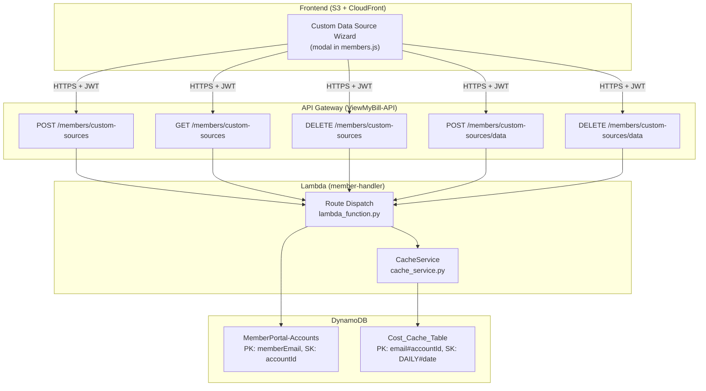
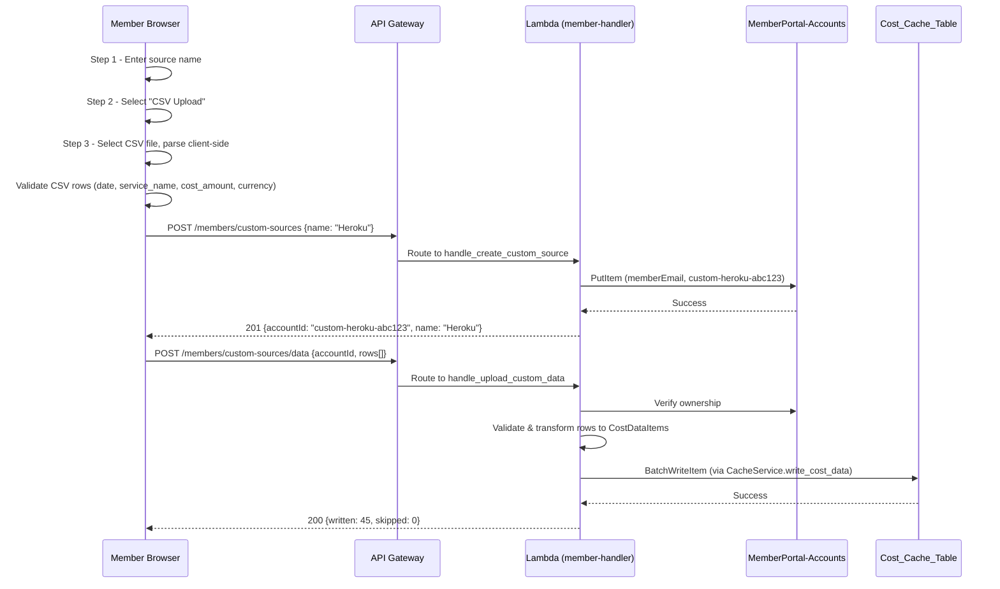
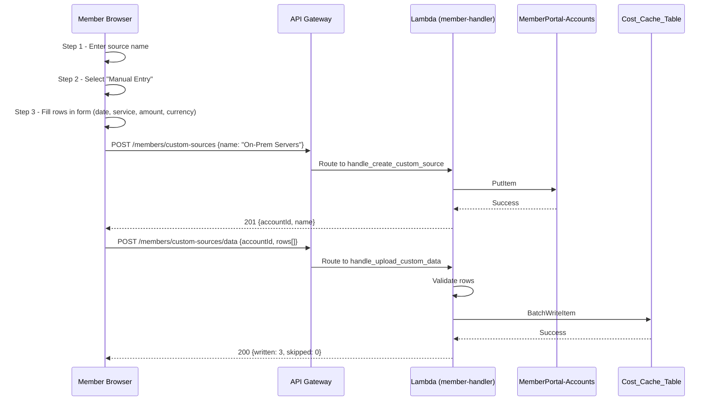

# Design Document: Custom Data Source Wizard

## Overview

The Custom Data Source Wizard enables members to manually configure and populate the Cost_Cache_Table DynamoDB table with cost data that doesn't come from automated API integrations (AWS, Azure, GCP, OpenAI). Members can define named custom data sources (e.g., "On-Prem Servers", "Cloudflare CDN", "Heroku"), then upload cost data via CSV file or manual row-by-row entry. The data is written using the same schema as automated integrations, so it appears seamlessly in the Observe tab alongside existing cloud cost data.

The wizard follows a 4-step flow: Name the source → Choose input method → Upload/Enter data → Confirm and write. The backend reuses the existing CacheService for DynamoDB writes and creates account records in the MemberPortal-Accounts table following the same pattern used by OpenAI connections (`custom-{slug}-{uuid12hex}` as accountId, `cloudProvider: "custom"`).

The feature integrates into the existing member-handler Lambda via new API routes, and the frontend extends `members/members.js` with a wizard modal overlay using the existing UI patterns.

## Architecture




## Sequence Diagrams

### CSV Upload Flow



### Manual Entry Flow




## Components and Interfaces

### Component 1: Custom Source API Routes (member-handler/lambda_function.py)

**Purpose**: Handle CRUD operations for custom data sources and their cost data entries.

**Interface**:
```python
# New routes added to the existing route dispatch
routes = {
    # ... existing routes ...
    'POST /members/custom-sources': handle_create_custom_source,
    'GET /members/custom-sources': handle_list_custom_sources,
    'DELETE /members/custom-sources': handle_delete_custom_source,
    'POST /members/custom-sources/data': handle_upload_custom_data,
    'DELETE /members/custom-sources/data': handle_delete_custom_data,
}
```

**Responsibilities**:
- Create custom data source account records
- List member's custom data sources
- Delete custom data source and its cached data
- Validate and write cost data rows to Cost_Cache_Table
- Delete specific date ranges of custom cost data

### Component 2: CSV Parser (client-side, members.js)

**Purpose**: Parse and validate CSV files in the browser before sending to the API.

**Interface**:
```javascript
/**
 * Parse a CSV string into validated cost data rows.
 * @param {string} csvText - Raw CSV content
 * @returns {{valid: Array, errors: Array}} Parsed rows and validation errors
 */
function parseCustomCostCSV(csvText) { /* ... */ }
```

**Responsibilities**:
- Parse CSV with headers: date, service_name, cost_amount, currency
- Validate date format (YYYY-MM-DD)
- Validate cost_amount is a positive number
- Validate currency is a supported code (USD, EUR, GBP, etc.)
- Aggregate multiple rows for the same date into service_breakdown
- Return validation errors with line numbers


### Component 3: Wizard UI (members.js)

**Purpose**: Multi-step modal wizard for defining sources and entering/uploading data.

**Interface**:
```javascript
/**
 * Open the custom data source wizard modal.
 * Steps: 1) Name → 2) Input method → 3) Data entry/upload → 4) Confirm
 */
function openCustomSourceWizard() { /* ... */ }

/**
 * Navigate between wizard steps.
 * @param {number} step - Target step (1-4)
 */
function wizardGoToStep(step) { /* ... */ }
```

**Responsibilities**:
- Step 1: Collect source name with slug preview
- Step 2: Choose between CSV upload or manual entry
- Step 3a (CSV): File picker, parse, display preview table with error highlights
- Step 3b (Manual): Editable row table with add/remove row buttons
- Step 4: Summary confirmation (source name, row count, date range, total cost)
- Progress indicator showing current step
- Error display and validation feedback

### Component 4: Data Transformation (member-handler)

**Purpose**: Transform validated rows into CostDataItem format and aggregate by date.

**Interface**:
```python
def transform_rows_to_cost_items(rows: list[dict]) -> list[CostDataItem]:
    """
    Transform raw input rows into CostDataItem objects.
    Aggregates rows with the same date into a single item with service_breakdown.
    
    Args:
        rows: List of dicts with keys: date, service_name, cost_amount, currency
    
    Returns:
        List of CostDataItem objects, one per unique date.
    """
```

**Responsibilities**:
- Group rows by date
- Build service_breakdown map from rows sharing the same date
- Sum cost_amounts per date for the total
- Set fetched_at to current UTC timestamp
- Validate currency consistency within a single upload

## Data Models

### Custom Source Account Record (MemberPortal-Accounts)

```python
{
    "memberEmail": "user@example.com",        # PK
    "accountId": "custom-heroku-a1b2c3d4e5f6", # SK - format: custom-{slug}-{uuid12hex}
    "cloudProvider": "custom",                  # Always "custom"
    "connectionStatus": "connected",            # Always "connected" (manual data)
    "displayName": "Heroku",                    # User-provided source name
    "addedAt": "2024-06-15T10:30:00Z",         # ISO 8601
    "lastUpdatedAt": "2024-06-15T10:30:00Z",   # Last data upload timestamp
}
```


### Cost Data Item in Cost_Cache_Table

```python
{
    "pk": "user@example.com#custom-heroku-a1b2c3d4e5f6",  # member_email#account_id
    "sk": "DAILY#2024-06-15",                               # DAILY#{YYYY-MM-DD}
    "cost_amount": "152.30",                                # String decimal
    "currency": "USD",                                      # Currency code
    "service_breakdown": {                                  # Map: service_name → cost_string
        "Heroku Dyno": "120.00",
        "Heroku Postgres": "32.30"
    },
    "tag_breakdown": {},                                    # Empty for custom sources
    "fetched_at": "2024-06-15T10:30:00Z",                  # ISO 8601 upload time
    "ttl": 1726387800                                       # Epoch: 90 days from fetched_at
}
```

### CSV File Format

```
date,service_name,cost_amount,currency
2024-06-01,Heroku Dyno,120.00,USD
2024-06-01,Heroku Postgres,32.30,USD
2024-06-02,Heroku Dyno,118.50,USD
2024-06-02,Heroku Postgres,32.30,USD
```

### API Request/Response Formats

**POST /members/custom-sources** (Create source)
```json
// Request
{"name": "Heroku"}
// Response 201
{"accountId": "custom-heroku-a1b2c3d4e5f6", "name": "Heroku", "displayName": "Heroku"}
```

**GET /members/custom-sources** (List sources)
```json
// Response 200
{"sources": [
  {"accountId": "custom-heroku-a1b2c3d4e5f6", "displayName": "Heroku", "connectionStatus": "connected", "addedAt": "...", "lastUpdatedAt": "..."},
  {"accountId": "custom-onprem-b2c3d4e5f6a7", "displayName": "On-Prem Servers", "connectionStatus": "connected", "addedAt": "...", "lastUpdatedAt": "..."}
]}
```

**DELETE /members/custom-sources** (Delete source)
```json
// Request
{"accountId": "custom-heroku-a1b2c3d4e5f6"}
// Response 200
{"message": "Custom source deleted", "deletedCacheItems": 45}
```

**POST /members/custom-sources/data** (Upload data)
```json
// Request
{"accountId": "custom-heroku-a1b2c3d4e5f6", "rows": [
  {"date": "2024-06-01", "service_name": "Heroku Dyno", "cost_amount": "120.00", "currency": "USD"},
  {"date": "2024-06-01", "service_name": "Heroku Postgres", "cost_amount": "32.30", "currency": "USD"}
]}
// Response 200
{"written": 1, "totalCost": "152.30", "dateRange": {"start": "2024-06-01", "end": "2024-06-01"}}
```

**DELETE /members/custom-sources/data** (Delete data range)
```json
// Request
{"accountId": "custom-heroku-a1b2c3d4e5f6", "startDate": "2024-06-01", "endDate": "2024-06-30"}
// Response 200
{"deleted": 30}
```


## Key Functions with Formal Specifications

### Function 1: handle_create_custom_source()

```python
def handle_create_custom_source(event: dict, member_email: str) -> dict:
    """Create a new custom data source for the authenticated member."""
```

**Preconditions:**
- `member_email` is a valid, authenticated email from JWT
- Request body contains `name` field (non-empty string, max 50 chars)
- `name` contains only alphanumeric characters, spaces, hyphens, and periods

**Postconditions:**
- New record exists in MemberPortal-Accounts with `cloudProvider: "custom"`
- `accountId` follows format `custom-{slug}-{uuid12hex}` where slug is lowercase name with spaces/special chars replaced by hyphens
- `connectionStatus` is set to `"connected"`
- Returns 201 with the created source details
- If name already exists for this member, returns 409

### Function 2: generate_custom_account_id()

```python
def generate_custom_account_id(name: str) -> str:
    """Generate a unique accountId from the source name."""
```

**Preconditions:**
- `name` is a non-empty string

**Postconditions:**
- Returns string matching pattern `custom-{slug}-{12 hex chars}`
- `slug` is derived from name: lowercased, non-alphanumeric replaced with hyphens, max 20 chars, no leading/trailing hyphens
- The 12 hex chars are generated from uuid4 (first 12 chars of hex)

### Function 3: handle_upload_custom_data()

```python
def handle_upload_custom_data(event: dict, member_email: str) -> dict:
    """Validate and write custom cost data rows to Cost_Cache_Table."""
```

**Preconditions:**
- `member_email` is authenticated
- Request body contains `accountId` (string matching `custom-*` pattern)
- Request body contains `rows` (list of 1-1000 dicts)
- Each row has: `date` (YYYY-MM-DD), `service_name` (non-empty string), `cost_amount` (positive decimal string), `currency` (3-letter code)
- The `accountId` belongs to the authenticated member

**Postconditions:**
- Cost data is written to Cost_Cache_Table using CacheService.write_cost_data
- Rows with the same date are aggregated into a single CostDataItem with service_breakdown
- Duplicate dates overwrite existing entries (upsert behavior via PutItem)
- `lastUpdatedAt` on the account record is updated
- Returns count of written items and total cost

**Loop Invariants:**
- All processed rows have been validated before any writes occur
- Aggregation preserves total cost: sum of all row cost_amounts equals sum of all CostDataItem cost_amounts

### Function 4: transform_rows_to_cost_items()

```python
def transform_rows_to_cost_items(rows: list[dict]) -> list[CostDataItem]:
    """Transform validated rows into CostDataItem objects grouped by date."""
```

**Preconditions:**
- All rows are pre-validated (valid date, positive cost, valid currency)
- All rows have the same currency

**Postconditions:**
- Returns one CostDataItem per unique date
- Each item's `cost_amount` equals the sum of all row amounts for that date
- Each item's `service_breakdown` maps service_name to cost_amount for that date
- If multiple rows have same date + service_name, their costs are summed
- `fetched_at` is set to current UTC ISO 8601 timestamp

**Loop Invariants:**
- Running total of cost_amount across all output items equals running total across all processed input rows


### Function 5: parseCustomCostCSV() (Client-side)

```javascript
function parseCustomCostCSV(csvText) {
    // Returns {valid: [{date, service_name, cost_amount, currency}], errors: [{line, message}]}
}
```

**Preconditions:**
- `csvText` is a non-empty string

**Postconditions:**
- First line is treated as header row and validated for required columns
- Each subsequent non-empty line is parsed and validated
- Valid rows are returned with properly typed fields
- Invalid rows produce error entries with line number and descriptive message
- Empty lines are skipped without generating errors
- Trailing whitespace is trimmed from all fields

### Function 6: validate_custom_data_row()

```python
def validate_custom_data_row(row: dict) -> tuple[bool, str]:
    """Validate a single cost data row."""
```

**Preconditions:**
- `row` is a dict (may have missing keys)

**Postconditions:**
- Returns (True, "") if row is valid
- Returns (False, error_message) if invalid
- Validation checks: date matches YYYY-MM-DD and is a real date, service_name is non-empty (max 100 chars), cost_amount is a positive decimal (≤ 999999999.99), currency is a 3-letter uppercase string

## Algorithmic Pseudocode

### CSV Parsing Algorithm (Client-side)

```python
def parse_csv(csv_text: str) -> dict:
    lines = csv_text.strip().split('\n')
    if len(lines) < 2:
        return {"valid": [], "errors": [{"line": 1, "message": "CSV must have header + at least one data row"}]}
    
    header = [col.strip().lower() for col in lines[0].split(',')]
    required = {"date", "service_name", "cost_amount", "currency"}
    if not required.issubset(set(header)):
        return {"valid": [], "errors": [{"line": 1, "message": f"Missing columns: {required - set(header)}"}]}
    
    col_indices = {col: header.index(col) for col in required}
    valid_rows = []
    errors = []
    
    for i, line in enumerate(lines[1:], start=2):
        if not line.strip():
            continue
        fields = line.split(',')
        if len(fields) < len(required):
            errors.append({"line": i, "message": "Not enough columns"})
            continue
        
        row = {col: fields[col_indices[col]].strip() for col in required}
        is_valid, error_msg = validate_row(row)
        if is_valid:
            valid_rows.append(row)
        else:
            errors.append({"line": i, "message": error_msg})
    
    return {"valid": valid_rows, "errors": errors}
```

### Data Aggregation Algorithm (Server-side)

```python
def transform_rows_to_cost_items(rows: list[dict]) -> list[CostDataItem]:
    from collections import defaultdict
    from datetime import datetime, timezone
    
    # Group by date
    date_groups = defaultdict(lambda: {"services": defaultdict(float), "currency": ""})
    
    for row in rows:
        date = row["date"]
        amount = float(row["cost_amount"])
        date_groups[date]["services"][row["service_name"]] += amount
        date_groups[date]["currency"] = row["currency"]
    
    now_iso = datetime.now(timezone.utc).isoformat()
    items = []
    
    for date, group in sorted(date_groups.items()):
        total = sum(group["services"].values())
        items.append(CostDataItem(
            date=date,
            cost_amount=total,
            currency=group["currency"],
            service_breakdown=dict(group["services"]),
            tag_breakdown={},
            fetched_at=now_iso,
        ))
    
    return items
```

### Account ID Generation Algorithm

```python
import re
import uuid

def generate_custom_account_id(name: str) -> str:
    # Slugify: lowercase, replace non-alphanumeric with hyphens, collapse multiple hyphens
    slug = re.sub(r'[^a-z0-9]+', '-', name.lower()).strip('-')[:20]
    # Generate 12 hex chars from UUID4
    hex_id = uuid.uuid4().hex[:12]
    return f"custom-{slug}-{hex_id}"
```


## Example Usage

### Backend: Creating a Custom Source

```python
# In lambda_function.py route handler
def handle_create_custom_source(event, member_email):
    body = json.loads(event.get('body', '{}'))
    name = body.get('name', '').strip()
    
    if not name or len(name) > 50:
        return response(400, {"error": "InvalidRequest", "message": "Name must be 1-50 characters"})
    
    if not re.match(r'^[a-zA-Z0-9 \-\.]+$', name):
        return response(400, {"error": "InvalidRequest", "message": "Name contains invalid characters"})
    
    # Check for duplicate name
    existing = get_custom_sources(member_email)
    if any(s['displayName'].lower() == name.lower() for s in existing):
        return response(409, {"error": "ConflictError", "message": "A source with this name already exists"})
    
    account_id = generate_custom_account_id(name)
    now = datetime.now(timezone.utc).isoformat()
    
    accounts_table.put_item(Item={
        'memberEmail': member_email,
        'accountId': account_id,
        'cloudProvider': 'custom',
        'connectionStatus': 'connected',
        'displayName': name,
        'addedAt': now,
        'lastUpdatedAt': now,
    })
    
    return response(201, {"accountId": account_id, "name": name, "displayName": name})
```

### Backend: Uploading Custom Data

```python
def handle_upload_custom_data(event, member_email):
    body = json.loads(event.get('body', '{}'))
    account_id = body.get('accountId', '')
    rows = body.get('rows', [])
    
    # Validate account ownership and is custom type
    if not account_id.startswith('custom-'):
        return response(400, {"error": "InvalidRequest", "message": "Not a custom data source"})
    
    verify_account_ownership(member_email, account_id)
    
    # Validate row count
    if not rows or len(rows) > 1000:
        return response(400, {"error": "InvalidRequest", "message": "Must provide 1-1000 rows"})
    
    # Validate each row
    errors = []
    for i, row in enumerate(rows):
        is_valid, msg = validate_custom_data_row(row)
        if not is_valid:
            errors.append({"row": i + 1, "message": msg})
    
    if errors:
        return response(400, {"error": "ValidationError", "message": "Invalid rows", "details": errors})
    
    # Transform and write
    items = transform_rows_to_cost_items(rows)
    cache_service.write_cost_data(member_email, account_id, items)
    
    # Update lastUpdatedAt
    update_account_timestamp(member_email, account_id)
    
    total_cost = sum(item.cost_amount for item in items)
    dates = sorted(item.date for item in items)
    
    return response(200, {
        "written": len(items),
        "totalCost": f"{total_cost:.2f}",
        "dateRange": {"start": dates[0], "end": dates[-1]}
    })
```

### Frontend: CSV Upload in Wizard

```javascript
// Step 3a: CSV file upload handler
document.getElementById('csv-file-input').addEventListener('change', async (e) => {
    const file = e.target.files[0];
    if (!file) return;
    
    const text = await file.text();
    const result = parseCustomCostCSV(text);
    
    if (result.errors.length > 0) {
        showCSVErrors(result.errors);
    }
    
    if (result.valid.length > 0) {
        showCSVPreview(result.valid);
        document.getElementById('wizard-next-btn').disabled = false;
    }
});

// Step 4: Confirm and submit
async function submitCustomData() {
    const accountId = wizardState.accountId;
    const rows = wizardState.validRows;
    
    const res = await fetch('/members/custom-sources/data', {
        method: 'POST',
        headers: {'Authorization': `Bearer ${getToken()}`, 'Content-Type': 'application/json'},
        body: JSON.stringify({accountId, rows})
    });
    
    const data = await res.json();
    if (res.ok) {
        notify(`Uploaded ${data.written} days of cost data (${data.totalCost} total)`);
        closeWizard();
        refreshObserveTab();
    } else {
        notify(data.message, 'error');
    }
}
```


## Error Handling

### Error Scenario 1: Invalid CSV Format

**Condition**: CSV file has missing/wrong headers, malformed rows, or unsupported encoding
**Response**: Client-side parser returns errors array with line numbers and messages; wizard displays errors inline with red highlights on affected rows
**Recovery**: User fixes the CSV and re-uploads; previously valid rows remain in preview

### Error Scenario 2: Validation Failures on Upload

**Condition**: Server-side validation catches rows that passed client-side checks (e.g., future dates, negative amounts sneaking through)
**Response**: API returns 400 with `details` array listing each invalid row
**Recovery**: Wizard displays server errors, user fixes data and resubmits

### Error Scenario 3: DynamoDB Write Failure

**Condition**: BatchWriteItem fails or returns unprocessed items after retries
**Response**: CacheService logs error, returns partial success count
**Recovery**: API returns 200 with actual `written` count < expected; user can re-upload failed dates (upsert means no duplicates)

### Error Scenario 4: Account Ownership Violation

**Condition**: Member tries to upload data to an accountId they don't own
**Response**: API returns 403 "Access denied"
**Recovery**: None needed - this is a security violation attempt

### Error Scenario 5: Duplicate Source Name

**Condition**: Member tries to create a source with a name that already exists (case-insensitive)
**Response**: API returns 409 "A source with this name already exists"
**Recovery**: User chooses a different name

## Testing Strategy

### Unit Testing Approach

- Test `generate_custom_account_id()` with various name inputs
- Test `validate_custom_data_row()` with valid/invalid rows
- Test `transform_rows_to_cost_items()` with various groupings
- Test route handlers with mocked DynamoDB using `moto`
- Test CSV parser with valid/malformed CSVs

### Property-Based Testing Approach

**Property Test Library**: `hypothesis` (Python), `fast-check` (JavaScript for CSV parser)

Property tests validate universal correctness of data transformations:
- CSV parsing produces valid objects for all valid inputs
- Account ID generation always matches the required pattern
- Data transformation preserves total cost across aggregation
- Written data always matches Cost_Cache_Table schema

### Integration Testing Approach

- End-to-end test: create source → upload data → verify in Cost_Cache_Table
- Test that custom source data appears in Observe tab aggregation queries
- Test delete source cascades to cache deletion


## Performance Considerations

- **CSV size limit**: Maximum 1000 rows per upload (prevents Lambda timeout at 29s API Gateway limit)
- **DynamoDB BatchWriteItem**: Chunks of 25 items with retry, same as existing CacheService pattern
- **Client-side parsing**: CSV parsed in browser to avoid sending invalid data; reduces server load
- **Payload size**: API Gateway limit is 10MB; 1000 rows of JSON is well under this
- **Observe tab aggregation**: Custom sources use the same Cost_Cache_Table partition key pattern, so existing date-range queries pick them up with no additional logic

## Security Considerations

- **Authentication**: All routes require valid member JWT (existing pattern)
- **Tenant isolation**: Account ownership verified via MemberPortal-Accounts before any write
- **Custom accountId prefix**: `custom-` prefix makes it impossible to collide with real AWS account IDs (12-digit numeric)
- **Input sanitization**: Source names limited to alphanumeric + spaces + hyphens + periods; no script injection risk
- **Cost amount bounds**: Limited to 0.01 - 999,999,999.99 to prevent overflow
- **Rate limiting**: Same Lambda concurrency limits apply; no additional rate limiting needed for wizard

## Dependencies

- **Existing**: `boto3`, `json`, `re`, `uuid`, `datetime` (all already in Lambda)
- **CacheService**: Reuses existing `cache_service.py` for DynamoDB writes
- **Frontend**: No new dependencies (vanilla JS, existing modal pattern)
- **No new infrastructure**: Uses existing DynamoDB tables, API Gateway, Lambda

## Correctness Properties

*A property is a characteristic or behavior that should hold true across all valid executions of a system — essentially, a formal statement about what the system should do. Properties serve as the bridge between human-readable specifications and machine-verifiable correctness guarantees.*

### Property 1: CSV parsing produces valid objects for all valid inputs

*For any* valid CSV string with correct headers and rows containing valid dates (YYYY-MM-DD), non-empty service names (≤100 chars), positive decimal cost amounts (≤999,999,999.99), and 3-letter uppercase currency codes, the parser SHALL return those rows in the `valid` array with no entries in the `errors` array, and all field values SHALL be whitespace-trimmed.

**Validates: Requirements 3.1, 3.5**

### Property 2: CSV parsing reports errors for all invalid rows

*For any* CSV row containing an invalid date, non-positive cost amount, empty service name, or invalid currency code, the parser SHALL include that row in the `errors` array with its line number and a descriptive message.

**Validates: Requirements 3.2, 10.4**

### Property 3: Custom account IDs follow the required format

*For any* non-empty source name string (1-50 chars, containing only alphanumeric, spaces, hyphens, periods), `generate_custom_account_id(name)` SHALL return a string matching the regex `^custom-[a-z0-9\-]{1,20}-[0-9a-f]{12}$`.

**Validates: Requirements 1.3**

### Property 4: Data transformation preserves total cost

*For any* list of valid cost data rows, the sum of all `cost_amount` values in the input rows SHALL equal the sum of all `cost_amount` values in the output CostDataItem objects produced by `transform_rows_to_cost_items()`.

**Validates: Requirements 4.1, 4.2**

### Property 5: Aggregation groups by date with correct service breakdown

*For any* set of input rows containing multiple rows with the same date, the output CostDataItem for that date SHALL have a `service_breakdown` map containing all unique service names from those rows, with costs summed for duplicate service names on the same date.

**Validates: Requirements 4.1, 4.2**

### Property 6: Written data matches Cost_Cache_Table schema

*For any* CostDataItem produced by `transform_rows_to_cost_items()`, when written via CacheService, the resulting DynamoDB item SHALL have: `pk` matching `{email}#{accountId}`, `sk` matching `DAILY#{YYYY-MM-DD}`, `cost_amount` as a string decimal, `currency` as a string, `service_breakdown` as a map of string to string, `fetched_at` as ISO 8601, and `ttl` as an integer epoch 90 days from fetched_at.

**Validates: Requirements 4.3**

### Property 7: Account ownership is enforced on all data operations

*For any* custom data upload, delete, or read request where the `accountId` does not belong to the authenticated member, the system SHALL return a 403 status and perform no writes or deletes to Cost_Cache_Table.

**Validates: Requirements 5.1, 5.3, 7.3**

### Property 8: Duplicate dates are overwritten (upsert)

*For any* custom data source and any date that already has data, uploading new data for that date SHALL overwrite the existing Cost_Cache_Table item for that date, resulting in exactly one item per (accountId, date) pair.

**Validates: Requirements 4.4**

### Property 9: Source deletion cascades to cache data

*For any* custom source that is deleted, all Cost_Cache_Table items with the corresponding partition key SHALL be removed, and the MemberPortal-Accounts record SHALL be removed.

**Validates: Requirements 6.1, 6.2**

### Property 10: Date range deletion removes only items within range

*For any* custom source with data spanning multiple dates, deleting a date range [startDate, endDate] SHALL remove only the Cost_Cache_Table items whose dates fall within that range, leaving all other items intact.

**Validates: Requirements 7.1**
