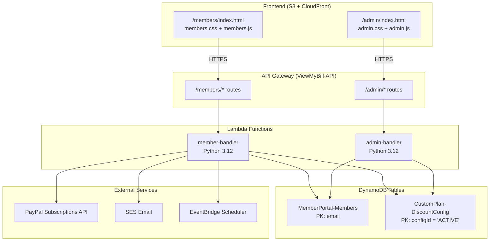
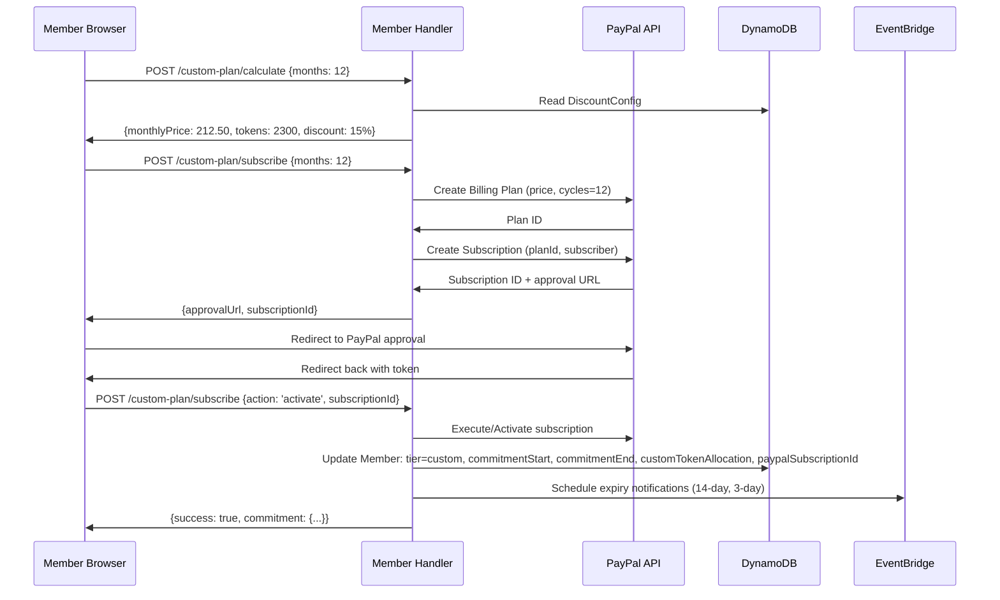

# Custom Subscription Plan - Technical Design Document

## Overview

The Custom Subscription Plan feature extends the existing Free/Growth/Scale tier system with a 4th commitment-based plan option. Members select a commitment period (3–24 months) and receive dynamically calculated discounts on monthly price and token allocation. The system enforces commitment locks (preventing downgrade/cancel), integrates with PayPal for recurring billing, and provides admin visibility into custom plan revenue.

This feature reuses the existing `member-handler` Lambda, `admin-handler` Lambda, PayPal SDK integration, DynamoDB `MemberPortal-Members` table, and SES email infrastructure. A new `CustomPlan-DiscountConfig` DynamoDB table stores admin-configurable discount tiers.

### Key Design Decisions

1. **"custom" as a new tier value** — The existing `tier` field in MemberPortal-Members gains a 4th value: `"custom"`. The `_check_and_consume_credits` function is modified to read a member-specific `customTokenAllocation` field when tier is "custom", bypassing the static `AI_CREDITS` dictionary lookup.

2. **Discount Configuration in DynamoDB** — A separate single-item table (`CustomPlan-DiscountConfig`) stores base price, base tokens, and discount tiers. This allows admin updates without deployment and is read on every custom plan price calculation.

3. **Commitment metadata stored on Member_Record** — Commitment lock dates, PayPal subscription ID, and custom token allocation are stored directly on the member's DynamoDB item. No separate commitments table needed — each member can only have one active commitment.

4. **PayPal Subscriptions API (not Orders)** — Custom plans use PayPal's subscription/billing plan API with a fixed number of billing cycles. A new PayPal plan is created server-side for each unique price/duration combination, then the frontend renders a subscribe button for that plan.

5. **EventBridge Scheduler for expiry notifications** — Commitment expiry emails (14-day and 3-day warnings) are scheduled via EventBridge Scheduler at the time of commitment creation, avoiding polling or cron-based approaches.

6. **Frontend renders dynamically** — The Custom plan card is added to the existing `_showUpgradeModal()` function. Price calculations happen via a new API endpoint (`POST /members/custom-plan/calculate`) to keep discount logic server-side.

## Architecture



### New API Routes

#### Member Handler (`member-handler/lambda_function.py`)

| Route | Method | Auth | Description |
|-------|--------|------|-------------|
| `/members/custom-plan/calculate` | POST | JWT | Calculate price and tokens for a given commitment period |
| `/members/custom-plan/subscribe` | POST | JWT | Create PayPal subscription and activate custom plan |
| `/members/custom-plan/status` | GET | JWT | Get current commitment status (dates, remaining months) |
| `/members/custom-plan/renew` | POST | JWT | Create renewal commitment starting after current one ends |

#### Admin Handler (`admin-handler/lambda_function.py`)

| Route | Method | Auth | Description |
|-------|--------|------|-------------|
| `/admin/custom-plans` | GET | JWT | List all members with active custom plans |
| `/admin/custom-plans/config` | GET | JWT | Get current discount configuration |
| `/admin/custom-plans/config` | PUT | JWT | Update discount configuration |

## Components and Interfaces

### 1. Discount Engine (`member-handler/discount_engine.py`)

A pure-function module imported by the member-handler Lambda:

```python
def calculate_discount(commitment_months: int, config: dict) -> dict:
    """Calculate discounted price and token allocation.
    
    Args:
        commitment_months: 3-24 inclusive
        config: {
            'baseMonthlyPrice': Decimal,  # e.g. 250
            'baseTokenCount': int,        # e.g. 2000
            'discountTiers': [            # sorted by minMonths ascending
                {'minMonths': 3, 'maxMonths': 6, 'discountPercent': 5},
                {'minMonths': 7, 'maxMonths': 12, 'discountPercent': 15},
                {'minMonths': 13, 'maxMonths': 18, 'discountPercent': 25},
                {'minMonths': 19, 'maxMonths': 24, 'discountPercent': 35},
            ]
        }
    
    Returns:
        {
            'monthlyPrice': Decimal,       # discounted price
            'tokenAllocation': int,        # increased tokens
            'discountPercent': int,        # applied discount %
            'commitmentMonths': int,
            'totalCommitmentValue': Decimal,  # monthlyPrice * months
        }
    """
```

**Calculation Logic:**
- Find the discount tier where `minMonths <= commitment_months <= maxMonths`
- `monthlyPrice = baseMonthlyPrice * (1 - discountPercent/100)`
- `tokenAllocation = baseTokenCount * (1 + discountPercent/100)` (rounded to nearest int)
- Both values are bounded: price > 0, tokens >= baseTokenCount

### 2. Commitment Lock Enforcement

Modified `handle_update_tier` in member-handler:

```python
def handle_update_tier(event):
    # ... existing logic ...
    
    # NEW: Check commitment lock before allowing tier change
    member = members_table.get_item(Key={'email': email}).get('Item', {})
    commitment_end = member.get('commitmentEndDate')
    
    if commitment_end:
        now = datetime.now(timezone.utc).isoformat()
        if now < commitment_end:
            remaining = _months_remaining(commitment_end)
            return create_error_response(403, 'CommitmentLocked',
                f'Cannot change plan during active commitment. '
                f'Commitment ends {commitment_end[:10]}, {remaining} months remaining.',
                extra={'commitmentEndDate': commitment_end, 'remainingMonths': remaining})
    
    # ... proceed with tier update ...
```

### 3. Modified Credit System

Updated `_check_and_consume_credits`:

```python
def _check_and_consume_credits(member_email: str, tier: str, cost: int) -> dict:
    # NEW: For custom tier, read member-specific allocation
    if tier == 'custom':
        member = members_table.get_item(Key={'email': member_email}).get('Item', {})
        max_tokens = int(member.get('customTokenAllocation', AI_CREDITS.get('scale', 1500)))
    else:
        max_tokens = AI_CREDITS.get(tier, 100)
    
    # ... rest of function unchanged ...
```

### 4. PayPal Integration Flow



### 5. Expiry Notification System

At commitment creation, two EventBridge Scheduler one-time schedules are created:

1. **14-day warning**: `commitmentEndDate - 14 days` → invokes member-handler with `{_commitmentNotification: {email, type: '14day'}}`
2. **3-day warning**: `commitmentEndDate - 3 days` → invokes member-handler with `{_commitmentNotification: {email, type: '3day'}}`

The member-handler detects `_commitmentNotification` events (same pattern as `_asyncScan`) and sends a styled HTML email via SES.

### 6. Commitment Expiry Processing

A daily EventBridge rule (or checked lazily on login/API call) handles expired commitments:

**Lazy check approach** (preferred — no additional infrastructure):
- On every `_check_and_consume_credits` call for a `custom` tier member, check if `commitmentEndDate < now`
- If expired: update member to `tier: 'scale'`, remove commitment fields, set `customTokenAllocation` to null
- This approach naturally handles expiry without a separate cron job

### 7. Admin Panel Integration

New section in `admin/admin.js`:

```javascript
// Custom Plans tab in admin panel
function loadCustomPlans() {
    api('GET', '/admin/custom-plans').then(function(data) {
        // Render table with: email, monthlyPrice, tokens, startDate, endDate, remaining, status
        // Show total MRR summary card
    });
}

function loadDiscountConfig() {
    api('GET', '/admin/custom-plans/config').then(function(data) {
        // Render editable form: base price, base tokens, discount tiers
    });
}
```

## Data Models

### MemberPortal-Members Table (Extended Fields)

| Attribute | Type | Description |
|-----------|------|-------------|
| `tier` | String | Now accepts: `free`, `growth`, `scale`, **`custom`** |
| `customTokenAllocation` | Number | Monthly token count for custom plan (null if not on custom) |
| `customMonthlyPrice` | Number | Monthly price in USD for custom plan |
| `commitmentStartDate` | String (ISO 8601) | Start of commitment period |
| `commitmentEndDate` | String (ISO 8601) | End of commitment period |
| `commitmentMonths` | Number | Original commitment length (3-24) |
| `commitmentDiscountPercent` | Number | Discount % applied at subscription time |
| `paypalCustomPlanSubId` | String | PayPal subscription ID for the custom plan |
| `commitmentStatus` | String | `active`, `grace_period`, `expired` |
| `commitmentGraceDeadline` | String (ISO 8601) | End of 7-day grace period (set on payment failure) |

### CustomPlan-DiscountConfig Table

| Attribute | Type | Description |
|-----------|------|-------------|
| `configId` (PK) | String | Always `"ACTIVE"` (single-item table) |
| `baseMonthlyPrice` | Number | Base price before discount (must be > 200) |
| `baseTokenCount` | Number | Base monthly tokens before bonus |
| `discountTiers` | List | Array of `{minMonths, maxMonths, discountPercent}` |
| `updatedAt` | String (ISO 8601) | Last update timestamp |
| `updatedBy` | String | Admin email who last updated |

**Key Schema**: Partition key = `configId`
**Billing**: PAY_PER_REQUEST

### Default Discount Configuration

```json
{
    "configId": "ACTIVE",
    "baseMonthlyPrice": 250,
    "baseTokenCount": 2000,
    "discountTiers": [
        {"minMonths": 3, "maxMonths": 6, "discountPercent": 5},
        {"minMonths": 7, "maxMonths": 12, "discountPercent": 15},
        {"minMonths": 13, "maxMonths": 18, "discountPercent": 25},
        {"minMonths": 19, "maxMonths": 24, "discountPercent": 35}
    ]
}
```

## API Request/Response Formats

### POST /members/custom-plan/calculate

```json
// Request
{ "commitmentMonths": 12 }

// Response 200
{
    "monthlyPrice": 212.50,
    "tokenAllocation": 2300,
    "discountPercent": 15,
    "commitmentMonths": 12,
    "totalCommitmentValue": 2550.00,
    "baseMonthlyPrice": 250,
    "baseTokenCount": 2000,
    "scalePrice": 200,
    "savingsVsMonthly": "15%"
}
```

### POST /members/custom-plan/subscribe

```json
// Request (Step 1: Create)
{ "commitmentMonths": 12 }

// Response 200
{
    "paypalApprovalUrl": "https://www.paypal.com/webapps/billing/subscriptions?...",
    "subscriptionId": "I-BW452GLLEP1G",
    "monthlyPrice": 212.50,
    "tokenAllocation": 2300
}
```

```json
// Request (Step 2: Activate after PayPal approval)
{ "action": "activate", "subscriptionId": "I-BW452GLLEP1G" }

// Response 200
{
    "message": "Custom plan activated",
    "tier": "custom",
    "commitment": {
        "startDate": "2026-07-15T00:00:00Z",
        "endDate": "2027-07-15T00:00:00Z",
        "months": 12,
        "monthlyPrice": 212.50,
        "tokenAllocation": 2300,
        "discountPercent": 15
    }
}
```

### GET /members/custom-plan/status

```json
// Response 200 (active commitment)
{
    "hasCommitment": true,
    "status": "active",
    "startDate": "2026-07-15T00:00:00Z",
    "endDate": "2027-07-15T00:00:00Z",
    "remainingMonths": 12,
    "monthlyPrice": 212.50,
    "tokenAllocation": 2300,
    "discountPercent": 15,
    "canRenew": false
}

// Response 200 (no commitment)
{
    "hasCommitment": false,
    "status": null
}
```

### GET /admin/custom-plans

```json
// Response 200
{
    "customPlans": [
        {
            "email": "user@example.com",
            "monthlyPrice": 212.50,
            "tokenAllocation": 2300,
            "commitmentStartDate": "2026-07-15T00:00:00Z",
            "commitmentEndDate": "2027-07-15T00:00:00Z",
            "remainingMonths": 12,
            "status": "active",
            "paypalSubscriptionId": "I-BW452GLLEP1G"
        }
    ],
    "summary": {
        "totalActiveCommitments": 5,
        "totalMonthlyRevenue": 1062.50,
        "gracePeriodCount": 0
    }
}
```

### PUT /admin/custom-plans/config

```json
// Request
{
    "baseMonthlyPrice": 275,
    "baseTokenCount": 2500,
    "discountTiers": [
        {"minMonths": 3, "maxMonths": 6, "discountPercent": 5},
        {"minMonths": 7, "maxMonths": 12, "discountPercent": 15},
        {"minMonths": 13, "maxMonths": 18, "discountPercent": 25},
        {"minMonths": 19, "maxMonths": 24, "discountPercent": 40}
    ]
}

// Response 200
{ "message": "Discount configuration updated", "updatedAt": "2026-07-15T10:30:00Z" }
```

### Error Responses

| Scenario | Status | Error Type | Message |
|----------|--------|------------|---------|
| Commitment months out of range | 400 | `InvalidRequest` | "Commitment period must be between 3 and 24 months" |
| Already has active commitment | 409 | `ConflictError` | "You already have an active commitment until {date}" |
| Commitment lock prevents downgrade | 403 | `CommitmentLocked` | "Cannot change plan during active commitment..." |
| PayPal subscription creation fails | 502 | `PaymentError` | "Failed to create payment subscription. Please try again." |
| Invalid discount config | 400 | `InvalidConfig` | "Discount percentages must be between 1 and 50" |
| Base price too low | 400 | `InvalidConfig` | "Base monthly price must be greater than $200" |
| Payment failed (grace period) | N/A | (internal) | Member retains access for 7 days |

## Frontend Integration

### Custom Plan Card in Upgrade Modal

The `_showUpgradeModal()` function in `members.js` is extended to render a 4th card:

```javascript
// After Scale card rendering...
html += '<div class="plan-card custom-plan-card" style="...">';
html += '<h3>Custom</h3>';
html += '<p style="color:#6b7280;font-size:0.8em;">Commit & save</p>';

if (memberHasActiveCommitment) {
    // Show commitment status
    html += '<div>Ends: ' + commitmentEndDate + '</div>';
    html += '<div>' + remainingMonths + ' months left</div>';
} else {
    // Show month selector dropdown
    html += '<select id="custom-plan-months" onchange="calculateCustomPrice()">';
    for (var m = 3; m <= 24; m++) {
        html += '<option value="' + m + '">' + m + ' months</option>';
    }
    html += '</select>';
    html += '<div id="custom-plan-price">Select months...</div>';
    html += '<div id="custom-plan-tokens"></div>';
    html += '<div id="custom-plan-discount"></div>';
    html += '<div id="paypal-btn-custom" style="margin-top:12px;"></div>';
}
html += '</div>';
```

### Price Calculation Flow (Frontend)

```javascript
function calculateCustomPrice() {
    var months = document.getElementById('custom-plan-months').value;
    api('POST', '/members/custom-plan/calculate', { commitmentMonths: parseInt(months) })
        .then(function(data) {
            document.getElementById('custom-plan-price').textContent = '$' + data.monthlyPrice + '/mo';
            document.getElementById('custom-plan-tokens').textContent = data.tokenAllocation + ' tokens/mo';
            document.getElementById('custom-plan-discount').textContent = data.discountPercent + '% off';
            renderCustomPayPalButton(months, data);
        });
}
```

## Correctness Properties

### Property 1: Discount calculation monotonicity

*For any* two valid commitment periods A and B where A < B, the discount percentage for B SHALL be greater than or equal to the discount percentage for A. Equivalently, the monthly price for B SHALL be less than or equal to the monthly price for A, and the token allocation for B SHALL be greater than or equal to the token allocation for A.

**Validates: Requirements 2.2, 2.3**

### Property 2: Price bounded above zero and below base

*For any* valid commitment period (3-24 months) and any valid discount configuration (discount 1-50%), the calculated monthly price SHALL be greater than 0 AND less than or equal to the base monthly price.

**Validates: Requirements 2.4**

### Property 3: Token allocation bounded above base

*For any* valid commitment period, the calculated token allocation SHALL be greater than or equal to the base token count from the discount configuration.

**Validates: Requirements 2.3**

### Property 4: Commitment lock rejects all tier changes

*For any* member with an active commitment (commitmentEndDate > now), ALL requests to `handle_update_tier` with any tier value SHALL return a 403 status code with the commitment end date and remaining months.

**Validates: Requirements 3.1, 3.2, 3.3**

### Property 5: Commitment lock expires correctly

*For any* member whose commitmentEndDate has passed (commitmentEndDate <= now), the commitment lock SHALL NOT prevent tier changes. The system SHALL allow the member to select any plan.

**Validates: Requirements 3.5**

### Property 6: Custom token allocation override

*For any* member with `tier == 'custom'` and a `customTokenAllocation` value, the `_check_and_consume_credits` function SHALL use `customTokenAllocation` instead of the `AI_CREDITS` dictionary value for the "scale" tier.

**Validates: Requirements 5.1, 5.3**

### Property 7: Discount configuration validation

*For any* discount configuration update, the system SHALL reject configurations where: (a) any discount percentage is outside [1, 50], (b) the base monthly price is <= 200, (c) discount tier ranges have gaps or overlaps for the 3-24 month range.

**Validates: Requirements 8.4, 8.5**

### Property 8: PayPal billing cycles match commitment

*For any* custom plan subscription creation, the PayPal billing plan SHALL specify exactly N billing cycles where N equals the selected commitment period in months (no auto-renewal).

**Validates: Requirements 4.2**

### Property 9: Grace period timing

*For any* payment failure during an active commitment, the member SHALL retain custom tier access for exactly 7 days from the failure timestamp. After 7 days, the member SHALL revert to the free tier.

**Validates: Requirements 4.5**

### Property 10: Expiry transitions to Scale tier

*For any* commitment that expires naturally (no renewal selected), the member's tier SHALL be set to "scale", their token allocation SHALL become 1500, and their commitment fields SHALL be cleared.

**Validates: Requirements 5.5, 7.2**

### Property 11: Existing commitments unaffected by config changes

*For any* admin update to the Discount Configuration, all members with active commitments SHALL retain their original monthly price, token allocation, and commitment dates. Only new subscriptions use the updated config.

**Validates: Requirements 8.3**

### Property 12: Notification scheduling correctness

*For any* new commitment with end date E, the system SHALL schedule exactly two email notifications: one at E - 14 days and one at E - 3 days. If E - 14 days is in the past at creation time (commitment <= 14 days), only the 3-day notification is scheduled.

**Validates: Requirements 7.1, 7.4**

## Error Handling

### Payment Failure Grace Period

When PayPal reports a failed recurring payment (via webhook or checked on API call):

1. Set `commitmentStatus = 'grace_period'`
2. Set `commitmentGraceDeadline = now + 7 days`
3. Send email notification about payment issue
4. On next successful payment: clear grace period, reset to `active`
5. After 7 days with no successful payment: revert to `tier: 'free'`, clear commitment

### PayPal Webhook Integration

Register a PayPal webhook for `PAYMENT.SALE.COMPLETED` and `PAYMENT.SALE.DENIED` events. The webhook endpoint verifies PayPal's signature and updates member records accordingly.

| PayPal Event | Action |
|--------------|--------|
| `BILLING.SUBSCRIPTION.ACTIVATED` | Confirm activation, update member record |
| `PAYMENT.SALE.COMPLETED` | Clear any grace period flag |
| `PAYMENT.SALE.DENIED` | Enter 7-day grace period |
| `BILLING.SUBSCRIPTION.CANCELLED` | Log cancellation (shouldn't happen during commitment) |
| `BILLING.SUBSCRIPTION.EXPIRED` | Trigger expiry transition to Scale tier |

## Testing Strategy

### Testing Framework

- **Unit tests**: `pytest` with `moto` for DynamoDB mocking
- **Property-based tests**: `hypothesis` library for Python
- **Frontend tests**: Manual testing (vanilla JS, consistent with existing approach)

### Property-Based Tests

Each property test runs minimum 100 iterations using `hypothesis`:

| Property | Test Description | Generator Strategy |
|----------|-----------------|-------------------|
| P1: Monotonicity | Generate pairs of commitment months, verify discount ordering | `st.integers(3, 24)` pairs where a < b |
| P2: Price bounds | Generate commitment months + configs, verify 0 < price <= base | `st.integers(3, 24)`, custom config strategy |
| P3: Token bounds | Generate commitment months, verify tokens >= base | `st.integers(3, 24)` |
| P4: Lock rejects changes | Generate member with future end date, try all tier values | `st.datetimes()` in future, `st.sampled_from(['free','growth','scale'])` |
| P5: Lock expiry | Generate member with past end date, verify no block | `st.datetimes()` in past |
| P6: Custom credits | Generate custom allocation values, verify override | `st.integers(100, 10000)` |
| P7: Config validation | Generate invalid configs, verify rejection | Custom strategy with out-of-range values |
| P8: Billing cycles | Generate commitment months, verify PayPal plan spec | `st.integers(3, 24)` |
| P9: Grace period | Generate failure timestamps, verify 7-day window | `st.datetimes()` |
| P10: Expiry transition | Generate expired commitments, verify scale transition | Custom member strategy |
| P11: Config isolation | Update config after commitment, verify original retained | Custom strategy |
| P12: Notification timing | Generate end dates, verify schedule targets | `st.datetimes()` |

### Test Files

- `member-handler/tests/test_discount_engine.py` — Unit + property tests for discount calculations
- `member-handler/tests/test_commitment_lock.py` — Commitment enforcement tests
- `member-handler/tests/test_custom_plan_api.py` — API integration tests with mocked DynamoDB/PayPal

### Test Configuration

- Each property test: `@settings(max_examples=100)`
- Tag format: `# Feature: custom-subscription-plan, Property {N}: {title}`
- Tests use `moto` to mock DynamoDB and `unittest.mock` for PayPal API calls
