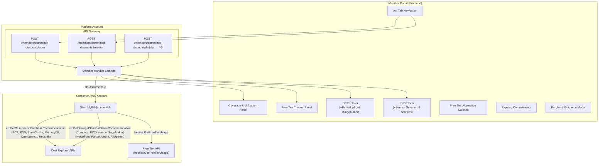

# Design Document: Expanded Commitment Explorer

## Overview

This feature expands the existing Committed Discounts system in the SlashMyBill member portal across five areas: broader RI service coverage, additional SP payment options and plan types, removal of the deprecated laddering strategy, AWS Free Tier usage tracking, and free tier alternative suggestions in recommendations.

The existing system (`member-handler/lambda_function.py`) already queries EC2 and RDS for RI recommendations and Compute/EC2Instance SPs with NoUpfront and AllUpfront payment options. The scan response is cached in `sessionStorage` and rendered via `_committedRenderResults()` in `members/members.js`. The interactive SP/RI Explorer filters cached data client-side.

### Key Design Decisions

1. **Expand RI in-place**: The existing `_get_ri_recommendations` function iterates a `services` list. We add 4 more services to that list and extend the instance-detail extraction logic for each service's response format (ElastiCacheInstanceDetails, MemoryDBInstanceDetails, etc.).

2. **PartialUpfront as third combo**: The existing `_get_sp_recommendations` uses a `term_payment_combos` list. We add `PARTIAL_UPFRONT` entries, expanding from 4 to 6 combinations per plan type.

3. **SageMaker SP as conditional**: SageMaker SP recommendations are only fetched when the account has detectable SageMaker spend, avoiding unnecessary API calls for accounts without ML workloads.

4. **Clean removal of laddering**: The `_generate_laddering_strategy` function, `handle_committed_discount_ladder` route, and all frontend laddering code are deleted. The `/ladder` endpoint returns 404.

5. **Free Tier as separate route**: A new `POST /members/committed-discounts/free-tier` route keeps the feature cleanly separated. A lightweight `freeTierSummary` is included in the main scan response for dashboard display without requiring a separate call.

6. **Free Tier Alternatives are client-side**: The alternative suggestions are computed in the frontend by comparing RI recommendation instance types against known free-tier-eligible types (t2.micro, t3.micro, db.t2.micro, db.t3.micro). No additional backend logic needed.

7. **Backward-compatible scan response**: The scan response drops `ladderingStrategy` and adds `freeTierSummary`. Existing fields remain unchanged. The frontend gracefully handles the missing laddering field.

## Architecture



## Components and Interfaces

### Component 1: Expanded RI Recommendation Retriever

**Purpose**: Extends `_get_ri_recommendations` to query all 6 RI-supported services.

**Changes to existing function**:

```python
def _get_ri_recommendations(ce_client):
    """Retrieve RI purchase recommendations for all 6 supported services."""
    services = [
        'Amazon Elastic Compute Cloud - Compute',
        'Amazon Relational Database Service',
        'Amazon ElastiCache',
        'Amazon MemoryDB',
        'Amazon OpenSearch Service',
        'Amazon Redshift',
    ]
    service_display = {
        'Amazon Elastic Compute Cloud - Compute': 'EC2',
        'Amazon Relational Database Service': 'RDS',
        'Amazon ElastiCache': 'ElastiCache',
        'Amazon MemoryDB': 'MemoryDB',
        'Amazon OpenSearch Service': 'OpenSearch',
        'Amazon Redshift': 'Redshift',
    }
    # ... existing iteration over offering_classes, terms, payment_options ...
```

**Instance detail extraction** (new cases added):

```python
# Existing:
if 'EC2InstanceDetails' in instance_details:
    # ... extract instance_type, region
elif 'RDSInstanceDetails' in instance_details:
    # ... extract instance_type, region

# New:
elif 'ElastiCacheInstanceDetails' in instance_details:
    details = instance_details['ElastiCacheInstanceDetails']
    instance_type = details.get('NodeType', 'unknown')
    region = details.get('Region', 'unknown')
elif 'MemoryDBInstanceDetails' in instance_details:
    details = instance_details['MemoryDBInstanceDetails']
    instance_type = details.get('NodeType', 'unknown')
    region = details.get('Region', 'unknown')
elif 'ESInstanceDetails' in instance_details:
    details = instance_details['ESInstanceDetails']
    instance_type = details.get('InstanceClass', 'unknown')
    region = details.get('Region', 'unknown')
elif 'RedshiftInstanceDetails' in instance_details:
    details = instance_details['RedshiftInstanceDetails']
    instance_type = details.get('NodeType', 'unknown')
    region = details.get('Region', 'unknown')
```

**Response item format** (unchanged, with `service` field now covering 6 values):

```python
{
    "service": "EC2 | RDS | ElastiCache | MemoryDB | OpenSearch | Redshift",
    "instanceType": "cache.r6g.large",
    "region": "us-east-1",
    "offeringClass": "standard | convertible",
    "termInYears": 1,
    "paymentOption": "NoUpfront | PartialUpfront | AllUpfront",
    "recommendedCount": 2,
    "estimatedMonthlySavings": 85.20,
    "estimatedSavingsPercentage": 35.0,
    "breakEvenMonths": 8.1,
    "upfrontCost": 690.00,
    "monthlyRecurringCost": 32.00,
    "standardVsConvertibleNote": "..."
}
```


### Component 2: Expanded SP Recommendation Retriever

**Purpose**: Extends `_get_sp_recommendations` to include PartialUpfront and SageMaker Savings Plans.

**Changes to existing function**:

```python
def _get_sp_recommendations(ce_client, average_hourly_spend):
    """Retrieve SP recommendations for all types and all 6 term-payment combos."""
    plan_types = ['ComputeSavingsPlans', 'EC2InstanceSavingsPlans', 'SageMakerSavingsPlans']
    term_payment_combos = [
        ('ONE_YEAR', 'NO_UPFRONT'),
        ('ONE_YEAR', 'PARTIAL_UPFRONT'),
        ('ONE_YEAR', 'ALL_UPFRONT'),
        ('THREE_YEARS', 'NO_UPFRONT'),
        ('THREE_YEARS', 'PARTIAL_UPFRONT'),
        ('THREE_YEARS', 'ALL_UPFRONT'),
    ]

    recommendations = []

    for plan_type in plan_types:
        for term, payment_option in term_payment_combos:
            try:
                response = ce_client.get_savings_plans_purchase_recommendation(
                    SavingsPlansType=plan_type,
                    TermInYears=term,
                    PaymentOption=payment_option,
                    LookbackPeriodInDays='THIRTY_DAYS',
                )
            except ClientError as e:
                # SageMaker may return empty if no usage — skip silently
                if plan_type == 'SageMakerSavingsPlans':
                    continue
                logger.warning(f"SP recommendation call failed: {plan_type} {term} {payment_option}: {e}")
                continue
            # ... existing normalization logic ...

    # Filter out SageMaker if no recommendations returned (no usage detected)
    has_sagemaker = any(r['planType'] == 'SageMakerSavingsPlans' for r in recommendations)
    # SageMaker omitted naturally if API returns no details
```

**Response item format** (unchanged structure, `planType` now includes `SageMakerSavingsPlans`):

```python
{
    "planType": "ComputeSavingsPlans | EC2InstanceSavingsPlans | SageMakerSavingsPlans",
    "termInYears": 1,
    "paymentOption": "NoUpfront | PartialUpfront | AllUpfront",
    "hourlyCommitment": 5.50,
    "estimatedMonthlySavings": 396.00,
    "estimatedSavingsPercentage": 22.5,
    "estimatedMonthlyOnDemandCost": 1760.00,
    "breakEvenMonths": 4.2,
    "upfrontCost": 1680.00,
    "isAggressive": false,
    "aggressiveNote": null
}
```

### Component 3: Laddering Strategy Removal (Backend)

**Purpose**: Remove all laddering-related backend code.

**Deletions**:
1. Delete `_generate_laddering_strategy()` function entirely
2. Delete `handle_committed_discount_ladder()` route handler
3. Remove the `/ladder` route from the routing table in `lambda_handler()`
4. Remove laddering strategy generation from `handle_committed_discount_scan()`
5. Remove `ladderingStrategy` from the scan response payload

**New 404 handler** (in routing table):

```python
elif path == '/members/committed-discounts/ladder' and method == 'POST':
    return create_error_response(404, 'EndpointRemoved',
        'The /members/committed-discounts/ladder endpoint has been removed. '
        'Laddering strategy is no longer supported.')
```

### Component 4: Free Tier Tracker (Backend)

**Purpose**: New route `POST /members/committed-discounts/free-tier` that retrieves AWS Free Tier usage data.

**Interface**:

```python
def handle_committed_discount_free_tier(event):
    """Retrieve free tier usage data for a customer account.

    Calls freetier:GetFreeTierUsage via the cross-account role and returns
    categorized usage data with alert statuses.
    """
```

**Request**:
```json
{
    "accountId": "123456789012"
}
```

**Response**:
```json
{
    "scannedAt": "2025-07-15T10:30:00Z",
    "accountId": "123456789012",
    "benefits": [
        {
            "service": "Amazon EC2",
            "usageType": "750 hours of t2.micro/t3.micro",
            "limit": { "amount": 750, "unit": "Hrs" },
            "actualUsage": { "amount": 580, "unit": "Hrs" },
            "usagePercentage": 77.3,
            "forecastedUsage": { "amount": 720, "unit": "Hrs" },
            "category": "in-use",
            "alertStatus": null,
            "freeTierType": "12-month",
            "description": "750 hours per month of Linux t2.micro or t3.micro instance usage"
        },
        {
            "service": "AWS Lambda",
            "usageType": "1M requests/month",
            "limit": { "amount": 1000000, "unit": "Requests" },
            "actualUsage": { "amount": 850000, "unit": "Requests" },
            "usagePercentage": 85.0,
            "forecastedUsage": { "amount": 1050000, "unit": "Requests" },
            "category": "in-use",
            "alertStatus": "approaching-limit",
            "freeTierType": "always-free",
            "description": "1 million free requests per month"
        }
    ],
    "summary": {
        "totalBenefitsTracked": 12,
        "inUseCount": 7,
        "unusedCount": 3,
        "approachingLimitCount": 2,
        "exceededCount": 0,
        "estimatedMonthlySavingsFromFreeTier": 45.20
    },
    "eligibility": {
        "accountCreationDate": "2024-09-15",
        "monthsRemaining": 5,
        "isWithin12Months": true
    }
}
```

**Implementation**:

```python
def _get_free_tier_usage(freetier_client):
    """Call freetier:GetFreeTierUsage and normalize the response."""
    ALERT_THRESHOLD = 80  # percentage

    try:
        paginator = freetier_client.get_paginator('get_free_tier_usage')
        benefits = []
        for page in paginator.paginate():
            for item in page.get('freeTierUsages', []):
                limit_amount = float(item.get('limit', {}).get('amount', 0))
                actual_amount = float(item.get('actualUsageAmount', 0))
                forecasted_amount = float(item.get('forecastedUsageAmount', 0))

                # Calculate usage percentage
                usage_pct = round((actual_amount / limit_amount) * 100, 1) if limit_amount > 0 else 0.0

                # Categorize
                if actual_amount > limit_amount:
                    category = 'exceeded'
                elif actual_amount > 0:
                    category = 'in-use'
                else:
                    category = 'unused'

                # Alert status
                alert_status = None
                if usage_pct >= ALERT_THRESHOLD and category != 'exceeded':
                    alert_status = 'approaching-limit'
                elif category == 'exceeded':
                    alert_status = 'exceeded'

                benefits.append({
                    'service': item.get('service', ''),
                    'usageType': item.get('usageType', ''),
                    'limit': {'amount': limit_amount, 'unit': item.get('unit', '')},
                    'actualUsage': {'amount': actual_amount, 'unit': item.get('unit', '')},
                    'usagePercentage': usage_pct,
                    'forecastedUsage': {'amount': forecasted_amount, 'unit': item.get('unit', '')},
                    'category': category,
                    'alertStatus': alert_status,
                    'freeTierType': item.get('freeTierType', 'unknown'),
                    'description': item.get('description', ''),
                })
        return benefits
    except ClientError as e:
        if e.response['Error']['Code'] in ('AccessDeniedException', 'AccessDenied'):
            raise PermissionError('freetier:GetFreeTierUsage')
        raise
```

### Component 5: Free Tier Summary in Scan Response

**Purpose**: Add a lightweight `freeTierSummary` to the main scan response for dashboard display.

**Implementation** (added to `handle_committed_discount_scan`):

```python
# After parallel data retrieval, attempt free tier summary
free_tier_summary = None
if not incomplete:
    try:
        freetier_client = _make_client_from_creds('freetier', creds)
        benefits = _get_free_tier_usage(freetier_client)
        approaching = sum(1 for b in benefits if b['alertStatus'] == 'approaching-limit')
        exceeded = sum(1 for b in benefits if b['category'] == 'exceeded')
        in_use = sum(1 for b in benefits if b['category'] == 'in-use')
        # Estimate savings: sum of (limit * estimated_unit_cost) for in-use benefits
        estimated_savings = _estimate_free_tier_savings(benefits)
        free_tier_summary = {
            'totalBenefitsTracked': len(benefits),
            'approachingLimitCount': approaching,
            'exceededCount': exceeded,
            'inUseCount': in_use,
            'estimatedMonthlySavings': round(estimated_savings, 2),
        }
    except PermissionError:
        free_tier_summary = None  # Permission missing — omit silently
    except Exception as e:
        logger.warning(f"Free tier summary failed (non-fatal): {e}")
```

### Component 6: Frontend — RI Explorer Service Selector

**Purpose**: Add a service filter dropdown to the RI Explorer allowing members to filter by service.

**Changes to `_riExplorerRender`**:

```javascript
// Add service selector to RI Explorer state
var _riExplorerState = {
    selectedService: 'all',  // NEW: 'all' | 'EC2' | 'RDS' | 'ElastiCache' | ...
    selectedInstanceType: '',
    selectedOfferingClass: 'standard',
    selectedTerm: 1,
    selectedPayment: 'NoUpfront',
    compareExpanded: false
};

function _riExplorerRender(riRecommendations) {
    _riExplorerData = riRecommendations || [];

    // Extract unique services for dropdown
    var services = [...new Set(_riExplorerData.map(r => r.service))].sort();

    // Render service selector dropdown
    var html = '<div class="cse-ri-service-selector">';
    html += '<label>Service:</label>';
    html += '<select onchange="_riExplorerServiceChanged(this.value)">';
    html += '<option value="all">All Services</option>';
    services.forEach(function(s) {
        html += '<option value="' + s + '">' + s + '</option>';
    });
    html += '</select></div>';
    // ... rest of existing render logic, filtered by selected service
}

function _riExplorerServiceChanged(service) {
    _riExplorerState.selectedService = service;
    // Re-populate instance type dropdown filtered by service
    _riExplorerUpdateInstanceTypes();
    _riExplorerSelectionChanged();
}
```

### Component 7: Frontend — SP Explorer PartialUpfront & SageMaker

**Purpose**: Add PartialUpfront to payment dropdown and SageMaker as a plan type group.

**Changes to `_spExplorerRender`**:

```javascript
// SP Explorer state updated
var _spExplorerState = {
    selectedPlanType: 'ComputeSavingsPlans',
    selectedTerm: 1,
    selectedPayment: 'NoUpfront',  // Now includes 'PartialUpfront'
    compareExpanded: false
};

function _spExplorerRender(spRecommendations) {
    _spExplorerData = spRecommendations || [];

    // Extract unique plan types (now may include SageMakerSavingsPlans)
    var planTypes = [...new Set(_spExplorerData.map(r => r.planType))];

    // Plan type display names
    var planTypeLabels = {
        'ComputeSavingsPlans': 'Compute Savings Plan',
        'EC2InstanceSavingsPlans': 'EC2 Instance Savings Plan',
        'SageMakerSavingsPlans': 'SageMaker Savings Plan'
    };

    // Payment options now include PartialUpfront
    var paymentOptions = ['NoUpfront', 'PartialUpfront', 'AllUpfront'];
    // ... render with 3 payment options ...
}
```

### Component 8: Frontend — Free Tier Tracker Panel

**Purpose**: New panel in the Committed Discounts section showing free tier usage.

**Interface**:

```javascript
/**
 * Renders the Free Tier Tracker panel.
 * Called after free tier data is loaded (from dedicated route or scan summary).
 *
 * @param {Object} freeTierData - Response from POST /members/committed-discounts/free-tier
 */
function _committedRenderFreeTier(freeTierData) { ... }

/**
 * Triggers the free tier scan for the selected account.
 * Calls POST /members/committed-discounts/free-tier and caches in sessionStorage.
 */
async function _committedScanFreeTier() { ... }
```

**Behavior**:
- Positioned after coverage/utilization panel, before SP/RI recommendations
- Each benefit rendered as a row: service icon, description, progress bar, usage/limit text, alert badge
- Progress bar colors: green (< 80%), amber (80-100%), red (> 100%)
- "Opportunities" subsection for unused benefits (usage = 0)
- Summary line at top: "12 benefits tracked • 7 in use • 2 approaching limit • 0 exceeded"
- Cached in `sessionStorage` as `freeTier_{accountId}`
- Empty state when no data: explains permission requirement with template link

### Component 9: Frontend — Free Tier Alternative Callouts

**Purpose**: Display "💡 Free Tier Alternative" suggestions alongside RI recommendations.

**Interface**:

```javascript
/**
 * Checks if an RI recommendation has a free-tier-eligible alternative.
 * Returns the alternative suggestion or null.
 *
 * @param {Object} riRec - A single RI recommendation object
 * @param {Object} eligibility - Account free tier eligibility info
 * @returns {Object|null} Alternative suggestion with savings comparison
 */
function _checkFreeTierAlternative(riRec, eligibility) {
    // Only for single-instance t-family recommendations
    if (riRec.recommendedCount !== 1) return null;
    if (!riRec.instanceType.startsWith('t')) return null;

    var freeTierTypes = {
        'EC2': ['t2.micro', 't3.micro'],
        'RDS': ['db.t2.micro', 'db.t3.micro']
    };

    var eligible = freeTierTypes[riRec.service];
    if (!eligible) return null;

    // Check if already on free tier type
    if (eligible.includes(riRec.instanceType)) return null;

    // Check eligibility period for time-limited benefits
    if (riRec.service === 'EC2' || riRec.service === 'RDS') {
        if (!eligibility || !eligibility.isWithin12Months) return null;
    }

    return {
        currentType: riRec.instanceType,
        freeTierType: eligible[eligible.length - 1],  // prefer t3.micro
        riMonthlySavings: riRec.estimatedMonthlySavings,
        freeTierMonthlySavings: riRec.estimatedMonthlyOnDemandCost || riRec.estimatedMonthlySavings * 2.5,
        eligibilityMonthsRemaining: eligibility ? eligibility.monthsRemaining : null,
        disclaimer: 'Free tier alternatives require workload validation — verify your application performs acceptably on the smaller instance before migrating.'
    };
}
```

### Component 10: Laddering Removal (Frontend)

**Purpose**: Remove all laddering-related frontend code.

**Deletions from `members/members.js`**:
- `_committedRenderLaddering()` function
- `_committedLadderCustom()` function
- `_committedLadderPreset()` function
- `_committedLadderTermChanged()` function
- `_committedLadderUpdatePresetLabels()` function
- `_committedGetSavingsRate()` helper (if only used by laddering)
- `_committedLadderSelectedTerm` variable
- `_committedLadderLastStrategy` variable
- `_committedLadderLastBaseline` variable
- The `committed-laddering-panel` HTML element reference
- The laddering modal HTML
- The call to `_committedRenderLaddering(data.ladderingStrategy, data.baseline)` in `_committedRenderResults()`

**Deletions from `members/members.css`**:
- All `.cse-ladder-*` CSS classes

## Data Models

### Updated Scan Response Schema (POST /members/committed-discounts/scan)

```json
{
    "scannedAt": "ISO-8601 timestamp",
    "accountId": "12-digit string",
    "coverage": {
        "savingsPlans": {
            "overall": "float [0-100]",
            "byService": { "service_name": "float [0-100]" }
        },
        "reservedInstances": {
            "overall": "float [0-100]",
            "byService": { "service_name": "float [0-100]" }
        }
    },
    "utilization": {
        "savingsPlans": { "overall": "float [0-100]", "underutilized": [] },
        "reservedInstances": { "overall": "float [0-100]", "underutilized": [] }
    },
    "baseline": {
        "p10HourlySpend": "float >= 0",
        "averageHourlySpend": "float >= 0",
        "variabilityWarning": "boolean",
        "safeCommitmentRange": { "min": "float", "max": "float" },
        "granularity": "HOURLY | DAILY",
        "dataPoints": "int >= 0"
    },
    "spRecommendations": {
        "recommendations": [
            "SP objects (Compute, EC2Instance, SageMaker) × 6 term-payment combos"
        ],
        "message": "string | null"
    },
    "riRecommendations": {
        "recommendations": [
            "RI objects for EC2, RDS, ElastiCache, MemoryDB, OpenSearch, Redshift"
        ],
        "message": "string | null"
    },
    "expiringCommitments": {
        "expiring": [],
        "nextExpiration": "ISO-8601 date | null",
        "noUpcomingExpirations": "boolean"
    },
    "freeTierSummary": {
        "totalBenefitsTracked": "int",
        "inUseCount": "int",
        "approachingLimitCount": "int",
        "exceededCount": "int",
        "estimatedMonthlySavings": "float"
    },
    "organizationSharing": { "...existing..." },
    "rightsizeWarning": { "...existing..." }
}
```

**Removed fields**: `ladderingStrategy` (no longer present in response)

### Free Tier Response Schema (POST /members/committed-discounts/free-tier)

```json
{
    "scannedAt": "ISO-8601 timestamp",
    "accountId": "12-digit string",
    "benefits": [
        {
            "service": "string",
            "usageType": "string",
            "limit": { "amount": "float", "unit": "string" },
            "actualUsage": { "amount": "float", "unit": "string" },
            "usagePercentage": "float [0-∞]",
            "forecastedUsage": { "amount": "float", "unit": "string" },
            "category": "in-use | unused | exceeded",
            "alertStatus": "null | approaching-limit | exceeded",
            "freeTierType": "12-month | always-free",
            "description": "string"
        }
    ],
    "summary": {
        "totalBenefitsTracked": "int >= 0",
        "inUseCount": "int >= 0",
        "unusedCount": "int >= 0",
        "approachingLimitCount": "int >= 0",
        "exceededCount": "int >= 0",
        "estimatedMonthlySavingsFromFreeTier": "float >= 0"
    },
    "eligibility": {
        "accountCreationDate": "ISO-8601 date | null",
        "monthsRemaining": "int [0-12] | null",
        "isWithin12Months": "boolean"
    }
}
```

### Frontend Cache Structure

```javascript
// Committed discounts scan (updated — no ladderingStrategy)
sessionStorage['committedDiscounts_{accountId}'] = JSON.stringify({
    scannedAt: '2025-07-15T10:30:00Z',
    data: { /* full scan response without ladderingStrategy */ }
});

// Free tier data (new)
sessionStorage['freeTier_{accountId}'] = JSON.stringify({
    scannedAt: '2025-07-15T10:31:00Z',
    data: { /* full free tier response */ }
});
```

### Validation Rules

- `accountId` must be exactly 12 digits and owned by the authenticated member
- RI `service` must be one of: EC2, RDS, ElastiCache, MemoryDB, OpenSearch, Redshift
- SP `planType` must be one of: ComputeSavingsPlans, EC2InstanceSavingsPlans, SageMakerSavingsPlans
- SP `paymentOption` must be one of: NoUpfront, PartialUpfront, AllUpfront
- Free tier `usagePercentage` = `actualUsage.amount / limit.amount * 100` (can exceed 100)
- Free tier `alertStatus` = "approaching-limit" when `usagePercentage >= 80` and `category != 'exceeded'`
- Free tier `category` = "exceeded" when `actualUsage.amount > limit.amount`
- Free tier alternative only shown when: `recommendedCount === 1`, instance type starts with "t", service is EC2 or RDS, and account is within 12-month eligibility (for time-limited benefits)
- Break-even for PartialUpfront = `upfrontCost / estimatedMonthlySavings`
- The `/ladder` route returns HTTP 404 with `EndpointRemoved` error code
- `freeTierSummary` counts must satisfy: `inUseCount + unusedCount + exceededCount <= totalBenefitsTracked`


## Correctness Properties

*A property is a characteristic or behavior that should hold true across all valid executions of a system — essentially, a formal statement about what the system should do. Properties serve as the bridge between human-readable specifications and machine-verifiable correctness guarantees.*

### Property 1: RI recommendation normalization produces all required fields

*For any* valid Cost Explorer `GetReservationPurchaseRecommendation` API response for any of the 6 supported services (EC2, RDS, ElastiCache, MemoryDB, OpenSearch, Redshift), the normalization function SHALL produce an object containing all of: `service`, `instanceType`, `region`, `offeringClass`, `termInYears`, `paymentOption`, `recommendedCount`, `estimatedMonthlySavings`, `estimatedSavingsPercentage`, `upfrontCost`, and `breakEvenMonths`. The `service` field SHALL be one of the 6 valid service display names. The `instanceType` SHALL be a non-empty string extracted from the service-specific detail key (EC2InstanceDetails, RDSInstanceDetails, ElastiCacheInstanceDetails, MemoryDBInstanceDetails, ESInstanceDetails, or RedshiftInstanceDetails).

**Validates: Requirements 1.4, 2.2**

### Property 2: RI Explorer service filtering returns correct subset

*For any* array of RI recommendations containing items from 1–6 different services and any selected service value (including "all"), the filtering function SHALL return exactly those recommendations whose `service` field matches the selection (or all items when selection is "all"). The count of returned items SHALL equal the count of items in the original array with matching service. No items SHALL be lost or duplicated.

**Validates: Requirements 1.6, 12.1**

### Property 3: SP grouping produces correct partitions including SageMaker

*For any* array of SP recommendations containing N distinct `planType` values (from the set: ComputeSavingsPlans, EC2InstanceSavingsPlans, SageMakerSavingsPlans), the grouping function SHALL produce exactly N groups. Each group SHALL contain only recommendations with the same `planType`. The union of all groups SHALL equal the original array (no items lost or duplicated). When SageMaker recommendations are present, they SHALL form their own distinct group.

**Validates: Requirements 2.4, 3.4**

### Property 4: Break-even calculation correctness for all payment options

*For any* recommendation (SP or RI) where `upfrontCost > 0` and `estimatedMonthlySavings > 0`, the break-even point SHALL equal `upfrontCost / estimatedMonthlySavings` rounded to 1 decimal place. *For any* recommendation where `paymentOption === 'NoUpfront'`, the break-even SHALL be null. This SHALL hold for all three payment options: NoUpfront (break-even = null), PartialUpfront (break-even = upfrontCost / monthlySavings), and AllUpfront (break-even = upfrontCost / monthlySavings). Break-even SHALL always be a positive number when present.

**Validates: Requirements 2.5**

### Property 5: Scan response excludes laddering data

*For any* valid scan request and any combination of Cost Explorer API responses, the scan response object SHALL NOT contain a `ladderingStrategy` key. The response SHALL NOT contain any key or value referencing "ladder" or "laddering". The set of top-level response keys SHALL be exactly: `scannedAt`, `accountId`, `coverage`, `utilization`, `baseline`, `spRecommendations`, `riRecommendations`, `expiringCommitments`, `freeTierSummary`, `organizationSharing`, `rightsizeWarning`, and optionally `errors`.

**Validates: Requirements 4.3, 4.4, 12.4, 12.5**

### Property 6: Free tier benefit categorization correctness

*For any* free tier benefit with `actualUsage.amount` and `limit.amount` where `limit.amount > 0`: (a) if `actualUsage.amount > limit.amount` then `category` SHALL be "exceeded" and `alertStatus` SHALL be "exceeded"; (b) if `actualUsage.amount > 0` and `actualUsage.amount <= limit.amount` then `category` SHALL be "in-use"; (c) if `actualUsage.amount === 0` then `category` SHALL be "unused" and `alertStatus` SHALL be null. Additionally, `alertStatus` SHALL be "approaching-limit" if and only if `usagePercentage >= 80` AND `category` is not "exceeded".

**Validates: Requirements 6.3, 6.4, 7.3, 7.4**

### Property 7: Free tier summary count aggregation

*For any* list of categorized free tier benefits, the summary SHALL satisfy: `inUseCount` equals the count of benefits with `category === 'in-use'`, `unusedCount` equals the count with `category === 'unused'`, `exceededCount` equals the count with `category === 'exceeded'`, `approachingLimitCount` equals the count with `alertStatus === 'approaching-limit'`, and `totalBenefitsTracked` equals the length of the benefits list. The invariant `inUseCount + unusedCount + exceededCount === totalBenefitsTracked` SHALL always hold.

**Validates: Requirements 7.6, 12.6**

### Property 8: Free tier alternative eligibility determination

*For any* RI recommendation, a free tier alternative SHALL be suggested if and only if ALL of the following conditions are met: (a) `recommendedCount === 1`, (b) `instanceType` starts with "t" (t-family burstable), (c) `service` is "EC2" or "RDS", (d) the instance type is NOT already a free-tier-eligible type (t2.micro, t3.micro, db.t2.micro, db.t3.micro), and (e) for time-limited benefits (EC2, RDS), the account `isWithin12Months` is true. For always-free benefits (Lambda, DynamoDB, CloudWatch), condition (e) SHALL be bypassed — alternatives SHALL be shown regardless of account age.

**Validates: Requirements 9.1, 9.3, 9.6, 10.1, 10.2, 10.4**

### Property 9: Free tier alternative savings comparison calculation

*For any* RI recommendation that qualifies for a free tier alternative, the savings comparison SHALL correctly calculate: `riMonthlySavings` equals the RI's `estimatedMonthlySavings` (savings vs on-demand from purchasing the RI), and `freeTierMonthlySavings` equals the full on-demand monthly cost of the current instance (since free tier has zero cost). The relationship `freeTierMonthlySavings >= riMonthlySavings` SHALL always hold (free tier saves more than RI because it eliminates all cost, not just a discount).

**Validates: Requirements 9.5**

### Property 10: Free tier eligibility expiry note threshold

*For any* account with a known `accountCreationDate` and `monthsRemaining` value, the expiry warning note SHALL be displayed if and only if `monthsRemaining < 3` AND `monthsRemaining > 0` AND `isWithin12Months === true`. When `monthsRemaining >= 3` or `isWithin12Months === false`, no expiry note SHALL be shown. The note SHALL include the exact `monthsRemaining` value.

**Validates: Requirements 10.3**

## Error Handling

### Backend Error Scenarios

| Scenario | HTTP Status | Error Code | Behavior |
|----------|-------------|------------|----------|
| Missing/invalid JWT token | 401 | Unauthorized | Return error, no processing |
| Account not owned by member | 403 | Forbidden | Return error |
| Invalid account ID (not 12 digits) | 400 | InvalidAccountId | Return error |
| Cross-account role missing CE permissions | 403 | InsufficientPermissions | Return error with required actions list |
| Cross-account role missing freetier permission | 403 | InsufficientPermissions | Return error listing `freetier:GetFreeTierUsage` |
| Cost Explorer API returns no data for a service | 200 | — | Return empty list for that service with "no steady-state usage" message |
| Cost Explorer API timeout (> 25s) | 504 | Timeout | Return partial data collected so far |
| Cost Explorer API throttling | 429 | Throttled | Return error suggesting retry in 60 seconds |
| SageMaker SP query returns no data | 200 | — | Omit SageMaker from response (not an error) |
| Free Tier API unavailable | 200 | — | Return empty benefits list with error message |
| Free Tier API AccessDenied | 200 | — | Return empty benefits with permission error message and template link |
| Request to removed /ladder endpoint | 404 | EndpointRemoved | Return message indicating endpoint removed |
| RI query fails for one service but others succeed | 200 | — | Return successful services, note failed service in errors |
| STS AssumeRole fails | 403 | ConnectionFailed | Return error suggesting re-deploy CloudFormation |

### Partial Failure Strategy

The expanded scan now makes more API calls (6 RI services × 2 classes × 2 terms × 3 payments = 72 RI calls, plus 3 SP types × 6 combos = 18 SP calls, plus free tier). Partial failure handling is critical:

1. **Per-service isolation**: If ElastiCache RI calls fail but EC2/RDS succeed, return the successful data with an error note for ElastiCache.
2. **Free tier non-blocking**: If `freetier:GetFreeTierUsage` fails, the scan still returns all commitment data. `freeTierSummary` is set to null with an error note.
3. **SageMaker graceful omission**: If SageMaker SP calls return no data or fail, simply omit SageMaker from the response — no error surfaced to the user.
4. **Timeout budget**: Total scan budget remains 25 seconds. With more API calls, the ThreadPoolExecutor parallelism is essential. If timeout is reached, return whatever data has been collected.

### Frontend Error Scenarios

| Scenario | Behavior |
|----------|----------|
| Scan response missing `ladderingStrategy` | Gracefully ignored — no laddering panel rendered |
| Free tier data unavailable (null `freeTierSummary`) | Free Tier Tracker shows empty state with permission instructions |
| RI recommendations empty for some services | Service selector only shows services with data |
| SageMaker SP not in response | SP Explorer omits SageMaker group (no empty placeholder) |
| Free tier alternative eligibility unknown | Show alternative with caveat about verifying eligibility |
| sessionStorage `freeTier_{accountId}` missing | Free Tier Tracker shows "Scan required" state |
| PartialUpfront combination not found in cache | SP Explorer shows "Not available" for that combination |

## Testing Strategy

### Property-Based Tests (using Hypothesis for Python backend, fast-check for JavaScript frontend)

This feature has both backend computation (normalization, categorization, aggregation) and frontend logic (filtering, eligibility checks, savings calculations) suitable for property-based testing.

**Backend test file**: `member-handler/tests/test_expanded_commitment_properties.py`
**Frontend test file**: `members/tests/expanded-commitment-explorer.property.test.js`

**Configuration**: Minimum 100 iterations per property test.

| Property | Test Location | What's Generated |
|----------|--------------|-----------------|
| P1: RI normalization completeness | Backend | Random CE API response objects for each of 6 services with varying instance detail structures |
| P2: RI service filtering | Frontend | Random arrays of 1-50 RI recommendations with 1-6 services, random service selections |
| P3: SP grouping with SageMaker | Frontend | Random SP arrays (1-30 items) with 1-3 distinct planTypes including SageMaker |
| P4: Break-even calculation | Backend + Frontend | Random upfront costs (0.01-100000), monthly savings (0.01-10000), all 3 payment options |
| P5: No laddering in response | Backend | Random scan scenarios with varying CE API responses, verify response structure |
| P6: Free tier categorization | Backend | Random usage amounts (0-2000), limits (1-1000), verify category and alertStatus |
| P7: Free tier summary counts | Backend + Frontend | Random benefits lists (0-20 items) with random categories |
| P8: Free tier alternative eligibility | Frontend | Random RI recommendations with varying counts (1-10), instance types (t2.*, m5.*, etc.), services, and eligibility states |
| P9: Free tier savings comparison | Frontend | Random RI recommendations with on-demand costs (1-5000), monthly savings (1-2000) |
| P10: Eligibility expiry note | Frontend | Random monthsRemaining values (0-12), random isWithin12Months booleans |

Each test is tagged:
- Backend: `# Feature: expanded-commitment-explorer, Property {N}: {property_text}`
- Frontend: `// Feature: expanded-commitment-explorer, Property {N}: {property_text}`

### Unit Tests (example-based)

**Backend**:
- Scan happy path with all 6 RI services returning data
- Scan with SageMaker SP data present
- Scan with SageMaker SP data absent (omitted from response)
- Scan response has no `ladderingStrategy` key
- `/ladder` endpoint returns 404 with correct message
- Free tier route happy path with mixed benefit categories
- Free tier route with AccessDenied returns permission error
- Free tier route with API unavailable returns empty benefits
- PartialUpfront SP recommendations included in response
- RI recommendations for ElastiCache/MemoryDB/OpenSearch/Redshift with correct instance detail extraction

**Frontend**:
- RI Explorer renders service selector with correct options
- RI Explorer filters by service correctly
- SP Explorer shows PartialUpfront in payment dropdown
- SP Explorer renders SageMaker group when data present
- SP Explorer omits SageMaker group when data absent
- Free Tier Tracker renders with sample data
- Free Tier Tracker shows empty state when no data
- Free Tier Tracker shows amber for approaching-limit benefits
- Free Tier Tracker shows red for exceeded benefits
- Free Tier Tracker "Opportunities" section shows unused benefits
- Free tier alternative callout appears for qualifying t-family single-instance RI
- Free tier alternative does NOT appear for multi-instance RI (count > 1)
- Free tier alternative does NOT appear for non-t-family instances
- Free tier alternative does NOT appear when account past 12-month eligibility
- Free tier alternative shows caveat when eligibility unknown
- Committed discounts section renders without laddering panel
- No errors when scan response lacks `ladderingStrategy` field

### Integration Tests

- Full scan flow: mock all 6 RI services + 3 SP types + free tier → verify complete response structure
- Free tier route: mock freetier API → verify response with correct categorization
- Scan with partial failure: mock one RI service failing → verify other services still returned
- Frontend: scan → cache → RI Explorer with service selector → filter → display updates
- Frontend: scan → cache → SP Explorer with PartialUpfront → selection change → correct display
- Frontend: free tier scan → cache → Free Tier Tracker renders with progress bars
- Frontend: scan with free tier summary → Free Tier Tracker shows summary counts
