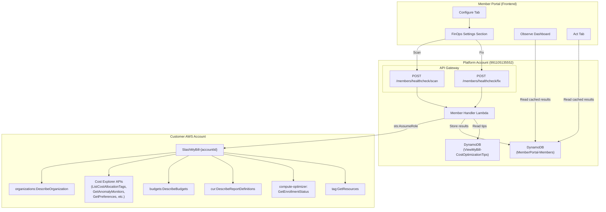
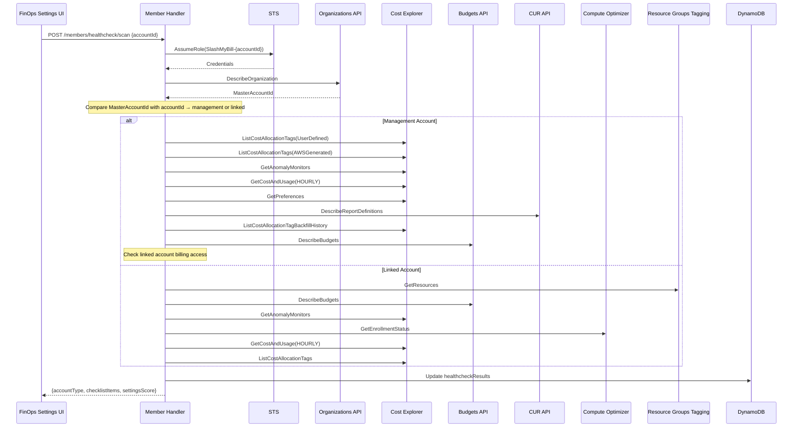

# Design Document: FinOps Settings Healthcheck

## Overview

The FinOps Settings Healthcheck adds a scored audit of AWS billing and cost management best practices to the SlashMyBill Member Portal. It detects whether each connected account is a management (payer) or linked account, runs a tailored checklist of FinOps settings checks via the existing cross-account role (`SlashMyBill-{accountId}`), and lets members fix misconfigured settings with one click.

The feature touches four layers:

1. **Backend** — Two new routes in `member-handler/lambda_function.py`: `POST /members/healthcheck/scan` (runs all checks for an account) and `POST /members/healthcheck/fix` (executes a single remediation action). Results are persisted in DynamoDB on the member record.
2. **Frontend** — A new "FinOps Settings" sub-section inside the existing Configure tab (`accounts-tab`), with an account selector, score display, and checklist cards. The Observe dashboard gets a FinOps Score KPI card, and the Act tab waste scan gets a FinOps Settings summary card.
3. **Cross-account role** — The CloudFormation template generator (`handle_generate_template`) is updated to include write permissions for remediation actions (`ce:UpdateCostAllocationTagsStatus`, `ce:CreateAnomalyMonitor`, etc.) and read permissions for new checks (`organizations:DescribeOrganization`, `compute-optimizer:GetEnrollmentStatus`).
4. **Integrations** — Knowledge base tips get healthcheck entries, the AI prompt learns about FinOps Settings, and scan results feed the dashboard and Act tab.

### Key Design Decisions

1. **Single scan endpoint, not per-check endpoints**: One `POST /members/healthcheck/scan` call runs all checks sequentially and returns the full checklist. This keeps the frontend simple (one loading state) and reduces round trips. Individual checks that fail don't block the rest — they get an "error" status.

2. **Reuse `_assume_role_for_account` helper**: The existing STS AssumeRole pattern with SHA-256 ExternalId is reused. The healthcheck scan assumes the role once and creates all needed service clients from the same credentials.

3. **DynamoDB single-table storage**: Scan results are stored as a `healthcheckResults` map attribute on the member item in `MemberPortal-Members`, keyed by accountId. This follows the same pattern used for `userSchedules` and `dashboardWidgets` — no new table needed.

4. **Configure tab left-nav pattern**: The FinOps Settings section uses the same left-nav + content-area layout already used in the Plan and Act tabs. The Configure tab gets a left nav with "AWS Accounts" and "FinOps Settings" buttons.

5. **Account type detection via organizations:DescribeOrganization**: Comparing `MasterAccountId` with the connected accountId is the most reliable method. If the call fails (standalone account or missing permissions), we default to linked account behavior with a note.

6. **Fix actions are granular**: Each fix action (`activate_user_tags`, `create_anomaly_monitor`, etc.) is a separate `fixAction` value on the fix endpoint. This lets the frontend update individual checklist items without a full rescan.

## Architecture



### Scan Flow Sequence



## Components and Interfaces

### Backend: Healthcheck Scan Handler

**Function**: `handle_healthcheck_scan(event)` in `member-handler/lambda_function.py`

**Route**: `POST /members/healthcheck/scan`

**Request Body**:
```json
{
  "accountId": "123456789012"
}
```

**Response Body**:
```json
{
  "accountId": "123456789012",
  "accountType": "management",
  "accountTypeBadge": "👑 Management Account",
  "scanTimestamp": "2025-07-15T10:30:00Z",
  "settingsScore": { "passed": 7, "total": 9 },
  "checklistItems": [
    {
      "id": "cost_allocation_tags",
      "name": "Cost Allocation Tags (User-Defined)",
      "status": "pass",
      "description": "All 4 user-defined tags are active",
      "guidance": "Recommended tags: Environment, Owner, CostCenter, Application",
      "fixAction": "activate_user_tags",
      "fixLabel": "Activate",
      "details": {
        "tags": [
          { "tagKey": "Environment", "status": "Active" },
          { "tagKey": "Owner", "status": "Inactive" }
        ]
      }
    }
  ]
}
```

**Logic**:
1. Validate JWT token via `validate_token(event)`
2. Parse `accountId` from body, validate 12-digit format
3. Verify account ownership via `_verify_account_ownership`
4. Assume cross-account role via `_assume_role_for_account(member_email, account_id)`
5. Detect account type: call `organizations:DescribeOrganization`, compare `MasterAccountId` with `accountId`. On `AccessDeniedException`, default to linked.
6. Run checklist checks based on account type (management: 9 checks, linked: 6 checks). Each check is wrapped in try/except — failures produce `"error"` status items.
7. Compute `settingsScore` as `{passed, total}`.
8. Store results in DynamoDB under `healthcheckResults.{accountId}`.
9. Return full response.

### Backend: Healthcheck Fix Handler

**Function**: `handle_healthcheck_fix(event)` in `member-handler/lambda_function.py`

**Route**: `POST /members/healthcheck/fix`

**Request Body**:
```json
{
  "accountId": "123456789012",
  "fixAction": "activate_user_tags",
  "params": { "tagKeys": ["Environment", "Owner"] }
}
```

**Supported fixAction values**:

| fixAction | AWS API Call | Account Type |
|-----------|-------------|--------------|
| `activate_user_tags` | `ce:UpdateCostAllocationTagsStatus` | management |
| `activate_aws_tags` | `ce:UpdateCostAllocationTagsStatus` | management |
| `create_anomaly_monitor` | `ce:CreateAnomalyMonitor` + `ce:CreateAnomalySubscription` | both |
| `enable_rightsizing` | `ce:UpdatePreferences` | management |
| `start_tag_backfill` | `ce:StartCostAllocationTagBackfill` | management |
| `enroll_compute_optimizer` | `compute-optimizer:UpdateEnrollmentStatus` | linked |

**Response Body** (success):
```json
{
  "success": true,
  "fixAction": "activate_user_tags",
  "updatedItem": {
    "id": "cost_allocation_tags",
    "name": "Cost Allocation Tags (User-Defined)",
    "status": "pass",
    "description": "All tags activated successfully"
  }
}
```

**Logic**:
1. Validate JWT, parse body, verify account ownership
2. Assume cross-account role
3. Detect account type (reuse cached result from DynamoDB if available)
4. Validate that `fixAction` is applicable to the detected account type
5. Execute the corresponding AWS API call
6. Update the specific checklist item in `healthcheckResults.{accountId}` in DynamoDB
7. Return updated item

### Backend: Account Type Detection Helper

**Function**: `_detect_account_type(org_client, account_id)`

```python
def _detect_account_type(org_client, account_id):
    """Detect if account is management or linked.
    Returns ('management', None) or ('linked', note_string).
    """
    try:
        resp = org_client.describe_organization()
        master_id = resp['Organization']['MasterAccountId']
        if master_id == account_id:
            return 'management', None
        return 'linked', None
    except ClientError as e:
        if e.response['Error']['Code'] == 'AccessDeniedException':
            return 'linked', 'Organization data unavailable'
        if e.response['Error']['Code'] == 'AWSOrganizationsNotInUseException':
            return 'linked', 'Account is not part of an AWS Organization'
        raise
```

### Backend: Individual Check Functions

Each check is a standalone function that takes cross-account service clients and returns a checklist item dict:

```python
def _check_cost_allocation_tags(ce_client):
    """Check user-defined cost allocation tags. Returns checklist item dict."""

def _check_aws_generated_tags(ce_client):
    """Check aws:createdBy tag status. Returns checklist item dict."""

def _check_anomaly_detection(ce_client):
    """Check for existing anomaly monitors. Returns checklist item dict."""

def _check_hourly_granularity(ce_client):
    """Probe HOURLY granularity availability. Returns checklist item dict."""

def _check_ce_preferences(ce_client):
    """Check rightsizing recommendations preference. Returns checklist item dict."""

def _check_cur_reports(cur_client):
    """Check for CUR report definitions. Returns checklist item dict."""

def _check_tag_backfill(ce_client):
    """Check tag backfill history. Returns checklist item dict."""

def _check_linked_billing_access(org_client):
    """Check if linked accounts have billing access. Returns checklist item dict."""

def _check_budgets(budgets_client, account_id):
    """Check for existing budgets. Returns checklist item dict."""

def _check_tag_coverage(tagging_client):
    """Check resource tag coverage percentage. Returns checklist item dict."""

def _check_compute_optimizer(co_client):
    """Check Compute Optimizer enrollment. Returns checklist item dict."""

def _check_tag_activation_status(ce_client):
    """Read-only check of cost allocation tag status for linked accounts. Returns checklist item dict."""
```

Each function returns a dict with this shape:
```python
{
    'id': 'cost_allocation_tags',
    'name': 'Cost Allocation Tags (User-Defined)',
    'status': 'pass' | 'warning' | 'fail' | 'error',
    'description': 'Human-readable status description',
    'guidance': 'Best-practice recommendation text',
    'fixAction': 'activate_user_tags' | None,
    'fixLabel': 'Activate' | 'Setup' | 'Enable' | 'Enroll' | None,
    'details': {}  # check-specific details (tag lists, report names, etc.)
}
```

### Frontend: FinOps Settings Section

The Configure tab (`accounts-tab`) is restructured to include a left-nav with two sections:

```
┌─────────────────────────────────────────────────────┐
│ Configure                                            │
├──────────────┬──────────────────────────────────────┤
│              │                                       │
│ 🔧 AWS      │  [Account Selector Dropdown]          │
│   Accounts   │                                       │
│              │  FinOps Score: 7/9 configured  ████░  │
│ ⚙️ FinOps   │  👑 Management Account                │
│   Settings   │                                       │
│   (active)   │  ✅ Cost Allocation Tags (User)       │
│              │     4/4 active                        │
│              │                                       │
│              │  ✅ AWS-Generated Tags                │
│              │     aws:createdBy active              │
│              │                                       │
│              │  ❌ Cost Anomaly Detection      [Setup]│
│              │     No monitors configured            │
│              │                                       │
│              │  ✅ Hourly Granularity                │
│              │     Enabled                           │
│              │                                       │
│              │  ...                                  │
│              │                                       │
│              │  [🔍 Scan Settings]                   │
└──────────────┴──────────────────────────────────────┘
```

**Key UI elements**:
- Account selector dropdown: populated from connected accounts with `connectionStatus === 'connected'`
- Score bar: "X/Y FinOps settings configured" with a progress bar (green ≥80%, amber 50-79%, red <50%)
- Account type badge: "👑 Management Account" or "🔗 Linked Account"
- Checklist items: status icon + name + description + guidance + fix button (where applicable)
- Scan button: triggers `POST /members/healthcheck/scan`
- Loading states: spinner on individual items during fix, full-section spinner during scan

### Frontend: Observe Dashboard KPI Card

A new KPI card is added to the `dash-kpi-bar` div:

```html
<div class="kpi-card" id="dash-kpi-finops-score" onclick="switchToFinOpsSettings()">
  <div class="kpi-label">FinOps Score</div>
  <div class="kpi-value" style="color: #22c55e;">7/9</div>
</div>
```

- Color: green (≥80%), amber (50-79%), red (<50%)
- Click navigates to Configure → FinOps Settings
- Shows "Not scanned" with "Scan →" link if no results exist
- Data source: `healthcheckResults` from the member's DynamoDB record (loaded with dashboard data)

### Frontend: Act Tab FinOps Settings Card

When the waste scan runs, the frontend checks for cached healthcheck results. If failing items exist, a summary card is injected into `act-cards-grid`:

```html
<div class="act-card">
  <div class="act-card-header">
    <span>⚙️ FinOps Settings</span>
    <span class="act-card-badge">3 issues</span>
  </div>
  <div class="act-card-body">
    <div>Score: 6/9 configured</div>
    <ul>
      <li>❌ Cost Anomaly Detection</li>
      <li>❌ Tag Backfill</li>
      <li>❌ Compute Optimizer</li>
    </ul>
  </div>
  <button onclick="switchToFinOpsSettings()" class="btn btn-primary btn-sm">
    Fix in Settings →
  </button>
</div>
```

### Cross-Account Role Template Update

The `handle_generate_template` function's `SlashMyBillBillingAccess` policy gets these additional actions:

```python
# FinOps Settings Healthcheck — read permissions
'ce:GetAnomalyMonitors',
'ce:GetAnomalySubscriptions',
'ce:ListCostAllocationTagBackfillHistory',
'compute-optimizer:GetEnrollmentStatus',
'organizations:DescribeOrganization',

# FinOps Settings Healthcheck — write permissions (fix actions)
'ce:UpdateCostAllocationTagsStatus',
'ce:CreateAnomalyMonitor',
'ce:CreateAnomalySubscription',
'ce:StartCostAllocationTagBackfill',
'compute-optimizer:UpdateEnrollmentStatus',
```

Note: `ce:ListCostAllocationTags`, `ce:GetPreferences`, `ce:UpdatePreferences`, `cur:DescribeReportDefinitions`, `budgets:DescribeBudgets`, and `tag:GetResources` are already in the template.

### Knowledge Base Tips

New tips are added to `knowledge-base/aws-cost-optimization-tips.json` with this structure:

```json
{
  "id": "finops-settings-001",
  "service": "General",
  "category": "finops-settings",
  "title": "Activate Cost Allocation Tags",
  "description": "Enable user-defined cost allocation tags (Environment, Owner, CostCenter, Application) to categorize costs in billing reports.",
  "estimatedSavings": "N/A",
  "difficulty": "easy",
  "automatedCheck": "ce:ListCostAllocationTags → check active vs inactive count",
  "checkImplemented": true,
  "actionType": "deep-link",
  "actionTarget": "configure:finops-settings",
  "actionLabel": "Check in FinOps Settings",
  "level": 1,
  "serviceKey": "General",
  "implementedInHealthcheck": true,
  "accountTypeScope": "management"
}
```

### AI Chat Integration

The `SLASHMYBILL PLATFORM FEATURES` block in both AI prompt locations gets a new line:

```
- Configure → FinOps Settings: Check and fix AWS billing best practices (cost allocation tags, anomaly detection, rightsizing, hourly granularity)
```

The data-gathering pipeline includes `healthcheckResults` from the member's DynamoDB record when building the AI context, enabling the AI to recommend FinOps Settings fixes contextually.

## Data Models

### DynamoDB: healthcheckResults (on MemberPortal-Members)

Stored as a map attribute on the member item:

```json
{
  "healthcheckResults": {
    "123456789012": {
      "accountId": "123456789012",
      "accountType": "management",
      "scanTimestamp": "2025-07-15T10:30:00Z",
      "settingsScore": { "passed": 7, "total": 9 },
      "checklistItems": [
        {
          "id": "cost_allocation_tags",
          "name": "Cost Allocation Tags (User-Defined)",
          "status": "pass",
          "description": "4/4 user-defined tags active",
          "guidance": "Recommended: Environment, Owner, CostCenter, Application",
          "fixAction": "activate_user_tags",
          "fixLabel": "Activate",
          "details": {
            "tags": [
              { "tagKey": "Environment", "status": "Active" },
              { "tagKey": "Owner", "status": "Active" }
            ]
          }
        }
      ]
    }
  }
}
```

### Checklist Item Schema

| Field | Type | Description |
|-------|------|-------------|
| `id` | string | Unique identifier for the check (e.g., `cost_allocation_tags`) |
| `name` | string | Display name |
| `status` | enum | `pass`, `warning`, `fail`, `error` |
| `description` | string | Human-readable current state |
| `guidance` | string | Best-practice recommendation |
| `fixAction` | string\|null | Fix action identifier, null if manual-only |
| `fixLabel` | string\|null | Button label: "Activate", "Setup", "Enable", "Enroll", "Start Backfill" |
| `details` | object | Check-specific data (tag lists, report names, coverage %) |

### Management Account Checks (9 items)

| # | Check ID | Check Name | API Call | Fix Available |
|---|----------|-----------|----------|---------------|
| 1 | `cost_allocation_tags` | Cost Allocation Tags (User-Defined) | `ce:ListCostAllocationTags(UserDefined)` | Yes — `activate_user_tags` |
| 2 | `aws_generated_tags` | AWS-Generated Tags | `ce:ListCostAllocationTags(AWSGenerated)` | Yes — `activate_aws_tags` |
| 3 | `anomaly_detection` | Cost Anomaly Detection | `ce:GetAnomalyMonitors` | Yes — `create_anomaly_monitor` |
| 4 | `hourly_granularity` | Hourly Granularity | `ce:GetCostAndUsage(HOURLY)` | No — manual |
| 5 | `ce_preferences` | CE Preferences (Right-Sizing) | `ce:GetPreferences` | Yes — `enable_rightsizing` |
| 6 | `cur_reports` | Cost and Usage Report | `cur:DescribeReportDefinitions` | No — manual |
| 7 | `tag_backfill` | Tag Backfill | `ce:ListCostAllocationTagBackfillHistory` | Yes — `start_tag_backfill` |
| 8 | `linked_billing_access` | Linked Account Billing Access | Organization settings check | No — manual |
| 9 | `budgets` | Budgets | `budgets:DescribeBudgets` | No — link to Plan → Budget |

### Linked Account Checks (6 items)

| # | Check ID | Check Name | API Call | Fix Available |
|---|----------|-----------|----------|---------------|
| 1 | `tag_coverage` | Resource Tag Coverage | `tag:GetResources` | No — link to Plan → Tag Resources |
| 2 | `budgets` | Budgets | `budgets:DescribeBudgets` | No — link to Plan → Budget |
| 3 | `anomaly_detection` | Cost Anomaly Detection | `ce:GetAnomalyMonitors` | Yes — `create_anomaly_monitor` |
| 4 | `compute_optimizer` | Compute Optimizer | `compute-optimizer:GetEnrollmentStatus` | Yes — `enroll_compute_optimizer` |
| 5 | `hourly_granularity` | Hourly Granularity | `ce:GetCostAndUsage(HOURLY)` | No — manual (management account) |
| 6 | `tag_activation_status` | Tag Activation Status | `ce:ListCostAllocationTags` | No — read-only |


## Correctness Properties

*A property is a characteristic or behavior that should hold true across all valid executions of a system — essentially, a formal statement about what the system should do. Properties serve as the bridge between human-readable specifications and machine-verifiable correctness guarantees.*

### Property 1: Account type classification is correct

*For any* 12-digit account ID and any `MasterAccountId` returned by `organizations:DescribeOrganization`, the `_detect_account_type` function SHALL return `"management"` if and only if the account ID equals the `MasterAccountId`, and `"linked"` otherwise.

**Validates: Requirements 1.2, 1.3**

### Property 2: Checklist item status classification follows threshold rules

*For any* list of cost allocation tags with varying active/inactive counts, *for any* backfill history with varying completion states, and *for any* tag coverage percentage, the corresponding check functions SHALL classify status as:
- Cost allocation tags: `pass` when all tags active, `warning` when some inactive, `fail` when no tags exist
- Tag backfill: `pass` when a completed backfill exists, `warning` when in-progress, `fail` when no history
- Tag coverage: `pass` when coverage > 80%, `warning` when 50–80%, `fail` when < 50%

**Validates: Requirements 2.3, 8.2, 11.3**

### Property 3: Score computation and color coding are consistent

*For any* list of checklist items with random `pass`/`warning`/`fail`/`error` statuses, the settings score SHALL equal the count of `pass` items over the total count, the formatted string SHALL be `"{passed}/{total} FinOps settings configured"`, and the color code SHALL be green when passed/total ≥ 80%, amber when 50–79%, and red when < 50%.

**Validates: Requirements 17.3, 23.2**

### Property 4: Scan resilience — individual check failures do not block other checks

*For any* set of checklist checks where a random subset throws exceptions, the scan result SHALL contain a checklist item for every check (not just the successful ones), with failing checks marked as `"error"` and all other checks producing their normal status.

**Validates: Requirements 18.5**

### Property 5: Scan idempotence — same inputs produce same outputs

*For any* set of mocked AWS API responses, running the scan logic twice with the same inputs SHALL produce identical `checklistItems` statuses and `settingsScore`.

**Validates: Requirements 18.6**

### Property 6: Fix action account type validation

*For any* combination of `fixAction` and detected `accountType`, the fix handler SHALL reject fix actions that are not applicable to the account type (e.g., `activate_user_tags` on a linked account, `enroll_compute_optimizer` on a management account) and accept only valid combinations.

**Validates: Requirements 19.6**

### Property 7: CloudFormation template permissions are a superset of existing permissions

*For any* account ID, the generated CloudFormation template SHALL contain all IAM actions that were present before the healthcheck feature, plus the new healthcheck-specific actions. No existing permission SHALL be removed.

**Validates: Requirements 20.2, 20.3**

### Property 8: Scan result schema completeness

*For any* completed scan (regardless of account type or individual check outcomes), the result object SHALL contain all required fields: `accountId`, `accountType`, `scanTimestamp`, `settingsScore` (with `passed` and `total`), and a `checklistItems` array where each item has `id`, `name`, `status`, `description`, and `guidance`.

**Validates: Requirements 18.3, 25.2**

## Error Handling

### Cross-Account Role Errors

| Error | Handling |
|-------|----------|
| STS `AccessDeniedException` | Return 403 with message "Cannot access account — please re-establish the connection by updating the CloudFormation stack" |
| STS `ExpiredTokenException` | Retry once, then return 403 |
| Role not found | Return 403 with message "Cross-account role not found — please deploy the CloudFormation template" |

### Individual Check Errors

Each check function is wrapped in try/except. If a check fails:
- The checklist item gets `status: "error"` and `description` contains the error message
- The scan continues with remaining checks
- The errored item is excluded from the score numerator but included in the denominator

### Fix Action Errors

| Error | HTTP Status | Message |
|-------|-------------|---------|
| Invalid `fixAction` value | 400 | "Unknown fix action: {fixAction}" |
| `fixAction` not applicable to account type | 400 | "Fix action '{fixAction}' is not available for {accountType} accounts" |
| Missing required params | 400 | "Missing required parameter: {param}" |
| AWS API permission denied | 403 | "Permission denied — update your CloudFormation stack to enable this action" |
| AWS API throttling | 429 | "AWS rate limit exceeded — please try again in a few seconds" |
| AWS API error | 500 | "AWS API error: {error_message}" |

### Frontend Error Handling

- **Scan errors**: Display error banner at top of FinOps Settings section with retry button
- **Fix errors**: Display inline error message on the affected checklist item with the error text
- **Network errors**: Display "Connection error — please check your internet connection" toast
- **Auth errors (401)**: Redirect to login page

### Rate Limiting

- Scan endpoint: No credit cost (it's a configuration check, not a resource scan)
- Fix endpoint: No credit cost (one-time configuration changes)
- AWS API throttling: Exponential backoff with 3 retries on `ThrottlingException`

## Testing Strategy

### Unit Tests (Example-Based)

Unit tests cover specific scenarios, edge cases, and error conditions:

1. **Account type detection**: Test management detection (IDs match), linked detection (IDs differ), AccessDeniedException fallback, AWSOrganizationsNotInUseException fallback
2. **Individual check functions**: Test each of the 12 check functions with mock AWS responses for pass, fail, warning, and error states
3. **Fix action execution**: Test each of the 6 fix actions with mock AWS clients, verify correct API calls and parameters
4. **Fix action validation**: Test that management-only fixes are rejected for linked accounts
5. **Score calculation**: Test score computation with various checklist item combinations
6. **Response structure**: Test that scan response contains all required fields
7. **DynamoDB persistence**: Test that scan results are stored correctly and fix actions update individual items
8. **Template update**: Test that generated template includes new permissions alongside existing ones
9. **Error handling**: Test 403 on role assumption failure, error status on individual check failures, appropriate error codes on fix failures

### Property-Based Tests

Property-based tests verify universal properties across many generated inputs. Use `hypothesis` (Python) with minimum 100 iterations per property.

Each property test must be tagged with a comment referencing the design property:
- Tag format: **Feature: finops-settings-healthcheck, Property {number}: {property_text}**

**Property tests to implement:**

1. **Account type classification** — Generate random 12-digit account IDs and MasterAccountIds, verify classification logic
2. **Status classification thresholds** — Generate random tag lists, backfill histories, and coverage percentages, verify status follows threshold rules
3. **Score computation** — Generate random checklist item lists with random statuses, verify score math and color coding
4. **Scan resilience** — Generate random check function behaviors (some succeed, some throw), verify all items present in result
5. **Scan idempotence** — Generate random mock responses, run scan twice, verify identical output
6. **Fix action validation** — Generate random fixAction + accountType pairs, verify validation logic
7. **Template permissions superset** — Generate template, verify it's a superset of the known existing permissions
8. **Result schema completeness** — Generate random scan outcomes, verify all required fields present

### Integration Tests

Integration tests verify end-to-end behavior with mocked AWS services:

1. **Full scan flow**: Mock all AWS clients, call scan endpoint, verify complete response
2. **Fix then re-scan**: Execute a fix action, then re-scan, verify the fixed item now passes
3. **Dashboard data includes healthcheck**: After a scan, verify dashboard data endpoint includes FinOps Score
4. **Act tab integration**: After a scan with failures, verify waste scan includes FinOps Settings card data
5. **AI context includes healthcheck**: After a scan, verify AI prompt includes healthcheck results

### Test Configuration

- **Framework**: pytest with hypothesis for property-based tests
- **Mocking**: unittest.mock for AWS service clients (boto3)
- **Property test iterations**: Minimum 100 per property (configured via `@settings(max_examples=100)`)
- **Test location**: `member-handler/tests/test_healthcheck.py` for unit + property tests
