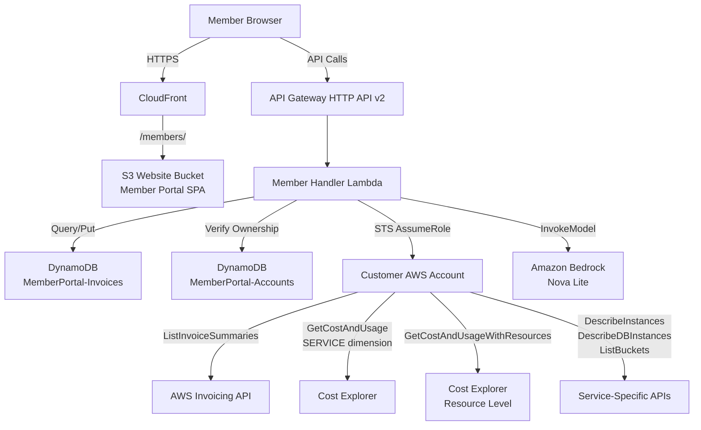
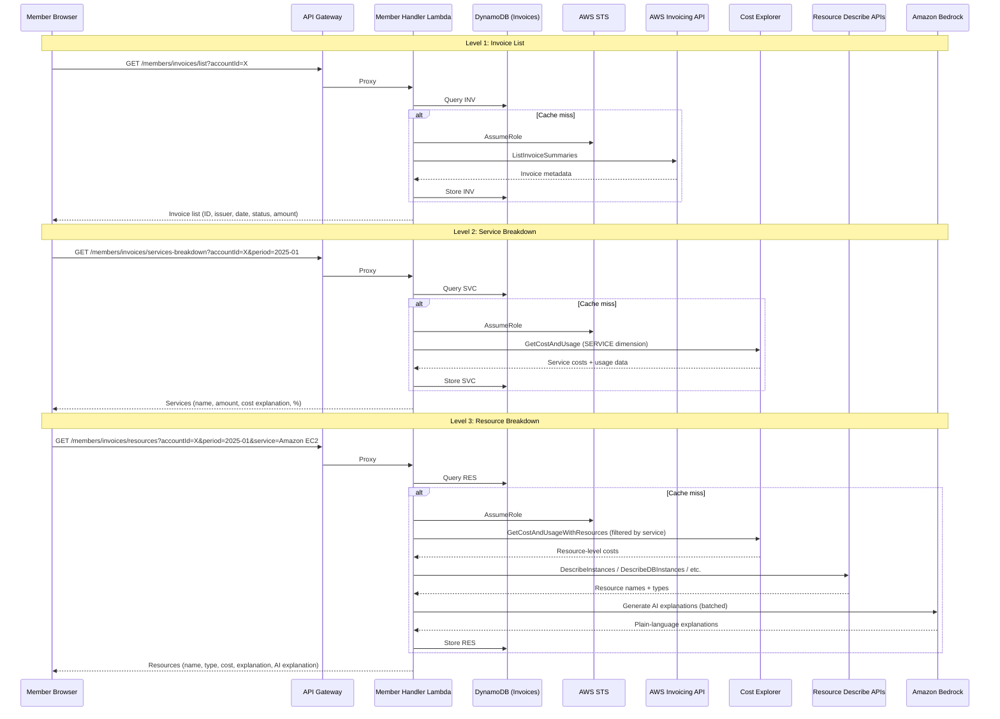
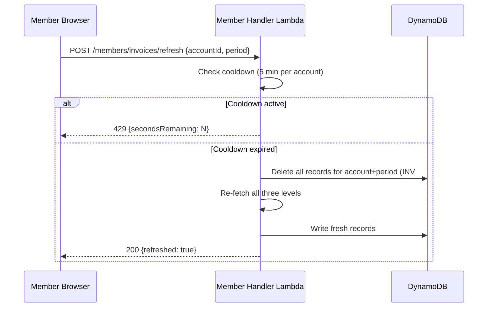

# Design Document: Invoice Drilldown

## Overview

Invoice Drilldown transforms the existing Invoice Explorer from a flat service-level table into a hierarchical three-level drill-down interface: **Invoice → Service → Resource**. Members can expand an invoice to see service-level cost breakdowns, then expand a service to see individual resource-level costs with both formula-based and AI-generated explanations.

This feature introduces two new AWS data sources:
1. **AWS Invoicing API** (`ListInvoiceSummaries`) — for invoice-level metadata (invoice ID, issuer, payment date, payment status, total amount)
2. **Cost Explorer `GetCostAndUsageWithResources`** — for resource-level cost granularity (individual EC2 instances, RDS databases, S3 buckets, etc.)

It also adds resource metadata enrichment via service-specific Describe APIs and AI-powered cost explanations via Amazon Bedrock (Nova Lite).

### Key Design Decisions

1. **Three-level DynamoDB schema** — Extend the existing `MemberPortal-Invoices` table with new sort key patterns for invoice-level (`INV#{invoiceId}`) and resource-level (`RES#{period}#{service}#{resourceId}`) records, keeping all data in a single table with the same partition key pattern.

2. **Lazy loading at each level** — Each drill-down level fetches data on-demand when expanded. The frontend makes separate API calls for invoice list, service breakdown, and resource breakdown. This keeps initial page load fast and avoids fetching resource data the user may never need.

3. **AWS Invoicing API with Cost Explorer fallback** — The `ListInvoiceSummaries` API provides real invoice metadata, but may not be available for all accounts (requires `invoicing:ListInvoiceSummaries` permission). When unavailable, the system falls back to generating synthetic invoice records from Cost Explorer monthly aggregations.

4. **`GetCostAndUsageWithResources` for resource data** — This is the correct API for resource-level granularity (requires a filter and returns resource IDs). It requires hourly-level data to be enabled in the customer account and only provides 14 days of historical data at resource level.

5. **Batched AI explanations** — When expanding a service to show resources, all resource cost data is sent to Bedrock in a single call to minimize latency and API costs. Individual explanations are parsed from the response and cached alongside cost data.

6. **Reuse existing member-handler Lambda** — New routes are added to the existing monolithic Lambda, reusing auth, account ownership verification, and cross-account role assumption infrastructure.

7. **Client-side session cache** — The frontend caches expanded drill-down data in memory for the current session, so re-expanding a previously loaded level is instant without an API call.

## Architecture

### System Context Diagram



### Three-Level Drill-Down Flow



### Refresh Flow



## Components and Interfaces

### Component 1: Invoice Drilldown API (Member Handler Lambda — new routes)

**Purpose**: Serves hierarchical invoice data at three levels with lazy loading. Manages the multi-level cache and orchestrates cross-account data fetching.

**New Routes**:

| Method | Route | Description |
|--------|-------|-------------|
| GET | /members/invoices/list | Invoice-level records with Billing API metadata |
| GET | /members/invoices/services-breakdown | Service-level breakdown for a specific invoice period |
| GET | /members/invoices/resources | Resource-level breakdown for a specific service+period |
| POST | /members/invoices/refresh | Force re-sync all levels for an account+period |

**Note**: The existing routes (`GET /members/invoices`, `GET /members/invoices/summary`, `GET /members/invoices/services`) remain unchanged for backward compatibility. The new routes provide the hierarchical drill-down experience.

#### GET /members/invoices/list

**Query Parameters**:
- `accountId` (required) — AWS account ID (12 digits)
- `page` (optional, default: 1) — Page number
- `pageSize` (optional, default: 25, max: 100) — Items per page
- `sortBy` (optional, default: paymentDate) — Sort field: paymentDate, amount, status
- `sortOrder` (optional, default: desc) — asc or desc

**Response** (200):
```json
{
  "items": [
    {
      "invoiceId": "INV-2025-01-AWS-123456",
      "issuer": "Amazon Web Services",
      "paymentDate": "2025-01-15",
      "paymentStatus": "paid",
      "totalAmount": 1234.56,
      "currency": "USD",
      "period": "2025-01"
    }
  ],
  "pagination": {
    "page": 1,
    "pageSize": 25,
    "totalItems": 12,
    "totalPages": 1
  }
}
```

#### GET /members/invoices/services-breakdown

**Query Parameters**:
- `accountId` (required) — AWS account ID
- `period` (required) — Invoice period (YYYY-MM)

**Response** (200):
```json
{
  "period": "2025-01",
  "totalAmount": 1234.56,
  "services": [
    {
      "serviceName": "Amazon EC2",
      "amount": 456.78,
      "percentage": 37.0,
      "costExplanation": "730 hours × $0.0464/hr (full month)",
      "usageTypes": [
        {"type": "BoxUsage:t3.medium", "cost": 33.87, "unit": "Hrs", "quantity": 730}
      ]
    }
  ]
}
```

#### GET /members/invoices/resources

**Query Parameters**:
- `accountId` (required) — AWS account ID
- `period` (required) — Invoice period (YYYY-MM)
- `service` (required) — AWS service name (e.g., "Amazon EC2")

**Response** (200):
```json
{
  "period": "2025-01",
  "service": "Amazon EC2",
  "totalAmount": 456.78,
  "resources": [
    {
      "resourceId": "i-0abc123def456789",
      "resourceName": "web-server-prod",
      "resourceType": "t3.medium",
      "amount": 33.87,
      "costExplanation": "730 hours × $0.0464/hr (full month)",
      "aiExplanation": "You ran a medium-sized server (t3.medium) named 'web-server-prod' continuously for the entire month. At AWS's rate of $0.0464 per hour, that's 730 hours × $0.0464 = $33.87.",
      "usageTypes": [
        {"type": "BoxUsage:t3.medium", "cost": 33.87, "unit": "Hrs", "quantity": 730}
      ]
    }
  ],
  "warnings": []
}
```

### Component 2: Invoice Data Fetcher (invoice_drilldown.py)

**Purpose**: New module that handles fetching and normalizing data for all three drill-down levels. Extends the existing `invoice_sync.py` pattern.

**Interface**:
```python
def fetch_invoice_list(member_email: str, account_id: str) -> list[dict]:
    """Fetch invoice-level metadata from AWS Invoicing API.
    Falls back to Cost Explorer monthly aggregation if Invoicing API unavailable."""

def fetch_service_breakdown(member_email: str, account_id: str, period: str) -> list[dict]:
    """Fetch service-level cost breakdown for a specific period.
    Uses GetCostAndUsage with SERVICE dimension + USAGE_TYPE for explanations."""

def fetch_resource_breakdown(member_email: str, account_id: str, period: str, service: str) -> list[dict]:
    """Fetch resource-level costs for a specific service+period.
    Uses GetCostAndUsageWithResources, enriches with Describe APIs, generates AI explanations."""

def enrich_resource_metadata(credentials: dict, service: str, resource_ids: list[str]) -> dict:
    """Call service-specific Describe APIs to get resource names and types.
    Returns {resource_id: {name: str, type: str}}."""

def generate_ai_explanations(service: str, resources: list[dict]) -> dict:
    """Batch call to Bedrock Nova Lite for AI-powered cost explanations.
    Returns {resource_id: explanation_text}."""
```

**Responsibilities**:
- STS AssumeRole into customer account (reuses existing `_assume_role` pattern)
- Call AWS Invoicing API (`ListInvoiceSummaries`) with fallback to Cost Explorer
- Call `GetCostAndUsageWithResources` for resource-level data
- Call service-specific Describe APIs for resource metadata enrichment
- Generate formula-based cost explanations from usage data
- Batch AI explanation generation via Bedrock
- Normalize all data into DynamoDB record format
- Handle partial failures gracefully (return what's available)

### Component 3: Cost Explanation Generator

**Purpose**: Generates human-readable cost explanation strings from usage data.

**Interface**:
```python
def generate_cost_explanation(usage_types: list[dict]) -> str:
    """Generate formula-based cost explanation from usage type data.
    
    Args:
        usage_types: [{type, cost, unit, quantity}]
    
    Returns:
        Explanation string like "730 hours × $0.0464/hr (full month)"
        or "See resource breakdown for details" if insufficient data.
    """

def format_rate(cost: float, quantity: float, unit: str) -> str:
    """Format a unit rate with appropriate precision.
    Returns rate string like "$0.0464/hr" or "$0.023/GB"."""
```

**Rules**:
- Format: `"{quantity} {unit} × ${rate}/{unit_abbrev}"`
- Annotate with "(full month)" when hours ≈ 730 (±10)
- Multiple usage types → separate lines
- Blended/amortized costs without clear rate → "Monthly charge: ${amount}"
- Rates rounded to 4 significant digits, totals to 2 decimal places

### Component 4: Resource Metadata Enrichment Service

**Purpose**: Maps raw resource IDs from Cost Explorer to human-readable names and types using service-specific AWS APIs.

**Supported Services**:

| Service | API Call | Name Source | Type Source |
|---------|----------|-------------|-------------|
| Amazon EC2 | `ec2:DescribeInstances` | Name tag | InstanceType |
| Amazon RDS | `rds:DescribeDBInstances` | DBInstanceIdentifier | DBInstanceClass |
| Amazon S3 | `s3:ListBuckets` | BucketName | "Standard" |
| AWS Lambda | `lambda:ListFunctions` | FunctionName | Runtime |
| Amazon EBS | `ec2:DescribeVolumes` | Name tag | VolumeType + Size |
| Amazon ElastiCache | `elasticache:DescribeCacheClusters` | CacheClusterId | CacheNodeType |
| Amazon DynamoDB | (from resource ID) | Table name from ARN | "Table" |

**Fallback**: If the Describe API fails or the resource no longer exists, return the raw resource ID as the name and "Unknown" as the type.

**Timeout**: 10 seconds per Describe API call. On timeout, return raw IDs with a warning.

### Component 5: AI Cost Explanation Service

**Purpose**: Generates conversational, plain-language cost explanations via Amazon Bedrock (Nova Lite).

**Interface**:
```python
def generate_ai_cost_explanations(
    service_name: str,
    resources: list[dict],
    context: dict
) -> dict[str, str]:
    """Generate AI explanations for a batch of resources.
    
    Args:
        service_name: AWS service (e.g., "Amazon EC2")
        resources: List of resource dicts with cost data
        context: Additional context (pricing model, usage patterns)
    
    Returns:
        {resource_id: ai_explanation_text}
    """
```

**Prompt Template**:
```
You are a cloud cost analyst explaining AWS charges to a non-technical business owner.
For each resource below, write a 1-2 sentence explanation of what was charged and why,
in plain language. Include the resource name, what it does, and how the cost was calculated.

Service: {service_name}
Resources:
{for each resource}
- Resource: {name} ({type}), Cost: ${amount}, Usage: {quantity} {unit} at ${rate}/{unit}
{end for}

Respond with one explanation per resource, formatted as:
RESOURCE_ID: explanation text
```

**Rules**:
- Only generate AI explanations for resources with cost > $1.00
- Batch all resources in a single Bedrock call per service expansion
- Cache AI explanations with the same 90-day TTL as cost data
- Timeout: 15 seconds. On timeout, fall back to formula-based explanation
- Model: Nova Lite (`us.amazon.nova-2-lite-v1:0`)

### Component 6: Invoice Drilldown Frontend

**Purpose**: Renders the hierarchical expandable UI with three levels of drill-down.

**Structure**:
```
┌─────────────────────────────────────────────────────────────────┐
│ Invoice ID    │ Issued By │ Payment Date │ Status  │ Amount     │
├─────────────────────────────────────────────────────────────────┤
│ ▶ INV-2025-01 │ AWS       │ Jan 15, 2025 │ ● Paid  │ $1,234.56  │
│ ▼ INV-2024-12 │ AWS       │ Dec 15, 2024 │ ● Paid  │ $1,100.23  │
│   ├─ Service Name      │ Amount    │ %     │ Explanation        │
│   ├─ ▶ Amazon EC2      │ $456.78   │ 41.5% │ 730 hrs × $0.046  │
│   ├─ ▼ Amazon RDS      │ $234.56   │ 21.3% │ 730 hrs × $0.32   │
│   │   ├─ Resource       │ Type      │ Amount │ Explanation       │
│   │   ├─ prod-db        │ db.r5.lg  │ $180.00│ 730 hrs × $0.246 │
│   │   │   💡 AI: You ran a large RDS database...                │
│   │   └─ staging-db     │ db.t3.med │ $54.56 │ 730 hrs × $0.074 │
│   │       💡 AI: You ran a medium staging database...           │
│   └─ ▶ Amazon S3       │ $89.12    │ 8.1%  │ 500 GB × $0.023   │
│ ▶ INV-2024-11 │ AWS       │ Nov 15, 2024 │ ● Paid  │ $987.65    │
└─────────────────────────────────────────────────────────────────┘
```

**Behavior**:
- Click invoice row → expand/collapse service level
- Click service row → expand/collapse resource level
- Click already-expanded row → collapse (hides all children)
- Multiple invoices can be expanded simultaneously
- Multiple services within an invoice can be expanded simultaneously
- Loading spinner shown inline while fetching each level
- Error messages shown inline with retry button
- Client-side session cache prevents redundant API calls

**Visual Design**:
- Level 1 (Invoice): Full-width rows, bold text, status badge (green/amber/red)
- Level 2 (Service): Indented 24px, percentage bar, lighter background
- Level 3 (Resource): Indented 48px, resource type badge, monospace for raw IDs
- AI explanation: Light-blue info box with 🤖 icon, below formula explanation

## Data Models

### DynamoDB Table: MemberPortal-Invoices (Extended Schema)

The existing table is extended with new sort key patterns for the three drill-down levels. The partition key pattern remains `{memberEmail}#{accountId}`.

#### Invoice-Level Records (NEW)

| Attribute | Type | Key | Description |
|-----------|------|-----|-------------|
| `pk` | String | PK | `{memberEmail}#{accountId}` |
| `sk` | String | SK | `INV#{invoiceId}` |
| `recordType` | String | — | `"invoice"` |
| `invoiceId` | String | — | AWS invoice ID or synthetic `{YYYY-MM}-monthly` |
| `issuer` | String | — | "Amazon Web Services" |
| `paymentDate` | String | — | ISO 8601 date (YYYY-MM-DD) |
| `paymentStatus` | String | — | "paid" \| "pending" \| "overdue" |
| `totalAmount` | Number | — | Total invoice amount (2 decimal places, USD) |
| `currency` | String | — | "USD" |
| `period` | String | — | Billing period (YYYY-MM) |
| `source` | String | — | "billing_api" \| "cost_explorer_fallback" |
| `lastSyncedAt` | String | — | ISO 8601 timestamp |
| `ttl` | Number | — | TTL epoch (90 days from sync) |

#### Service-Level Records (EXISTING — enhanced)

The existing records with `sk = {YYYY-MM}#{serviceName}` continue to serve the service level. Enhanced with:

| Attribute | Type | Description |
|-----------|------|-------------|
| `recordType` | String | `"service"` (added to existing records) |
| `costExplanation` | String | Formula-based explanation string |
| `percentage` | Number | Percentage of invoice total |

#### Resource-Level Records (NEW)

| Attribute | Type | Key | Description |
|-----------|------|-----|-------------|
| `pk` | String | PK | `{memberEmail}#{accountId}` |
| `sk` | String | SK | `RES#{YYYY-MM}#{serviceName}#{resourceId}` |
| `recordType` | String | — | `"resource"` |
| `resourceId` | String | — | AWS resource ID (e.g., i-0abc123def456789) |
| `resourceName` | String | — | Human-readable name (from Describe API) or raw ID |
| `resourceType` | String | — | Resource type (e.g., "t3.medium", "gp3", "Unknown") |
| `service` | String | — | Parent service name |
| `period` | String | — | Billing period (YYYY-MM) |
| `amount` | Number | — | Cost amount (2 decimal places, USD) |
| `currency` | String | — | "USD" |
| `costExplanation` | String | — | Formula-based explanation |
| `aiExplanation` | String | — | AI-generated explanation (or null if cost < $1) |
| `usageTypes` | List | — | [{type, cost, unit, quantity}] |
| `lastSyncedAt` | String | — | ISO 8601 timestamp |
| `ttl` | Number | — | TTL epoch (90 days from sync) |

#### Access Patterns

| Access Pattern | Key Condition | Use Case |
|----------------|---------------|----------|
| Get all invoices for account | `pk = email#acctId AND sk begins_with "INV#"` | Invoice list (Level 1) |
| Get services for period | `pk = email#acctId AND sk begins_with "{YYYY-MM}#"` | Service breakdown (Level 2) |
| Get resources for service+period | `pk = email#acctId AND sk begins_with "RES#{YYYY-MM}#{service}#"` | Resource breakdown (Level 3) |
| Get all records for account | `pk = email#acctId` | Full refresh/delete |

### Cross-Account IAM Permissions Required

The existing `SlashMyBill-{AccountID}` role needs these additional permissions:

```json
{
  "Effect": "Allow",
  "Action": [
    "invoicing:ListInvoiceSummaries",
    "ce:GetCostAndUsageWithResources",
    "ec2:DescribeInstances",
    "rds:DescribeDBInstances",
    "s3:ListBuckets",
    "lambda:ListFunctions",
    "ec2:DescribeVolumes",
    "elasticache:DescribeCacheClusters"
  ],
  "Resource": "*"
}
```

**Note**: `ce:GetCostAndUsage` and `ec2:DescribeInstances` are already included in the existing ReadOnlyAccess policy. The new permissions needed are `invoicing:ListInvoiceSummaries` and `ce:GetCostAndUsageWithResources`.


## Correctness Properties

*A property is a characteristic or behavior that should hold true across all valid executions of a system — essentially, a formal statement about what the system should do. Properties serve as the bridge between human-readable specifications and machine-verifiable correctness guarantees.*

### Property 1: Account ownership enforcement

*For any* API request to any drill-down endpoint (invoice list, service breakdown, resource breakdown, or refresh), the system must verify that the requested `accountId` belongs to the authenticated member before accessing any data. If the account does not belong to the member, the system must return a 403 error and never return data or make cross-account API calls.

**Validates: Requirements 9.4, 10.6**

### Property 2: Cache-hit returns cached data without external calls

*For any* drill-down level (invoice, service, resource, or AI explanation) where valid cached data exists in DynamoDB within the TTL period, the system must return the cached data directly without calling any external AWS API (Billing API, Cost Explorer, Describe APIs, or Bedrock).

**Validates: Requirements 1.3, 2.2, 3.2, 13.4**

### Property 3: TTL correctness for all record types

*For any* record written to DynamoDB at any drill-down level (invoice, service, resource, or AI explanation), the `ttl` attribute must equal the `lastSyncedAt` timestamp (as epoch seconds) plus exactly 7,776,000 seconds (90 days).

**Validates: Requirements 1.2, 3.9, 8.3, 13.3**

### Property 4: No partial data stored on API failure

*For any* failed external API call (Billing API error, Cost Explorer error, or timeout), the system must not write any records to DynamoDB for that request. The cache state before the failed call must be identical to the cache state after.

**Validates: Requirements 1.5**

### Property 5: Cost explanation format correctness

*For any* service or resource with valid usage data (quantity > 0, unit non-empty, rate derivable), the generated Cost_Explanation must match the format `"{quantity} {unit} × ${rate}/{unit_abbrev}"`. When the unit is hours and quantity is within [720, 740], the explanation must include the annotation "(full month)". When multiple usage types exist, each must appear on a separate line. Rates must be rounded to 4 significant digits and totals to 2 decimal places.

**Validates: Requirements 2.4, 11.1, 11.2, 11.3, 11.5**

### Property 6: Sort order correctness

*For any* response from the service-breakdown or resource-breakdown endpoints, consecutive items must be in non-increasing order by cost (descending). For the invoice-list endpoint with default parameters, consecutive items must be in non-increasing order by payment date. When a sort field and direction are specified, the ordering must respect that constraint.

**Validates: Requirements 2.6, 3.8, 5.5, 10.1, 10.2, 10.3**

### Property 7: Service cost threshold filtering

*For any* service-breakdown response, every service in the returned list must have a cost amount greater than or equal to $0.01. No service with cost below $0.01 may appear in the response.

**Validates: Requirements 2.7**

### Property 8: Pagination completeness and consistency

*For any* paginated invoice-list response with `totalItems = N` and `pageSize = P`, traversing all pages (1 through ceil(N/P)) must yield exactly N items with no duplicates and no missing items. The `pageSize` must default to 25 and be capped at 100.

**Validates: Requirements 10.5**

### Property 9: Input validation rejects invalid parameters

*For any* string provided as an `accountId` parameter, the system must accept it if and only if it matches the format of exactly 12 digits. For any `period` parameter, it must match `YYYY-MM` where YYYY is a 4-digit year and MM is 01-12. For any `service` parameter, it must be non-empty. All other values must be rejected with a 400 error containing a descriptive message.

**Validates: Requirements 10.4**

### Property 10: DynamoDB key pattern correctness

*For any* record stored in the Invoice_Cache, the partition key must equal `{memberEmail}#{accountId}`, and the sort key must follow the pattern: `INV#{invoiceId}` for invoice-level records, `{YYYY-MM}#{serviceName}` for service-level records, or `RES#{YYYY-MM}#{serviceName}#{resourceId}` for resource-level records.

**Validates: Requirements 8.1**

### Property 11: Rate limiting on refresh

*For any* sequence of refresh requests for the same account, only the first request within a 5-minute window must execute the sync. All subsequent requests within that window must return a 429 response with a `secondsRemaining` value equal to 300 minus the elapsed seconds since the last successful refresh.

**Validates: Requirements 8.5**

### Property 12: Percentage calculation accuracy

*For any* service in a service-breakdown response with amount `A` and invoice total `T` where T > 0, the displayed percentage must equal `round((A / T) * 100, 1)` (rounded to 1 decimal place). The sum of all service percentages must be within ±0.5 of 100%.

**Validates: Requirements 6.4**

### Property 13: Currency formatting correctness

*For any* numeric amount displayed in the UI or returned in API responses, the formatted string must include a dollar sign prefix, use comma as thousands separator, and show exactly 2 decimal places (e.g., `$1,234.56`). Negative amounts must display with a minus sign before the dollar sign.

**Validates: Requirements 5.4, 6.2, 7.2**

### Property 14: Date formatting correctness

*For any* valid ISO 8601 date string (YYYY-MM-DD), the formatted display must match the pattern `"Mon DD, YYYY"` where Mon is the abbreviated month name (Jan, Feb, ..., Dec), DD is the day without leading zero for single digits, and YYYY is the 4-digit year.

**Validates: Requirements 5.2**

### Property 15: Resource enrichment graceful degradation

*For any* resource where the metadata enrichment API call fails (timeout, access denied, resource deleted), the system must return the raw resource ID as the `resourceName` and `"Unknown"` as the `resourceType`. The response must never fail entirely due to enrichment failures.

**Validates: Requirements 3.5**

### Property 16: AI explanation cost threshold

*For any* resource with a cost amount less than or equal to $1.00, the system must not call Amazon Bedrock and must return `null` for the `aiExplanation` field. For any resource with cost greater than $1.00, the system must attempt AI explanation generation (subject to Bedrock availability).

**Validates: Requirements 13.8**

### Property 17: AI prompt context completeness

*For any* Bedrock API call for AI explanation generation, the prompt must include: the service name, each resource's name and type, the cost amount, usage quantity, usage unit, and the effective rate. Missing any of these fields from the prompt when they are available in the source data is a violation.

**Validates: Requirements 13.5**

## Error Handling

### Frontend Error Handling

| Scenario | User Message | Action |
|----------|-------------|--------|
| No accounts connected | "Connect an AWS account to explore invoices" | Show link to Configure tab |
| Invoice level loading | Skeleton loader with shimmer | Show within invoice table area |
| Service level loading | Inline spinner below expanded invoice | Show within expanded area |
| Resource level loading | Inline spinner below expanded service | Show within expanded area |
| Billing API access denied | "Invoice metadata unavailable — update your IAM role permissions" | Show inline with link to template |
| Resource data not available | "Resource-level data requires Cost Explorer hourly granularity to be enabled" | Show inline with AWS docs link |
| Resource names unavailable | "Resource names unavailable (missing permissions)" | Show raw IDs with warning badge |
| API timeout (30s) | "Request timed out. Try again." | Show retry button inline |
| Rate limited (refresh) | "Please wait X seconds before refreshing again" | Disable refresh button with countdown |
| Empty service expansion | "No resource-level data available for this service" | Show info message inline |
| Bedrock AI unavailable | (silently fall back to formula explanation) | No user-visible error |
| Network error | "Failed to load data. Check your connection." | Show retry button inline |

### Backend Error Handling

| Scenario | Status | Response | Recovery |
|----------|--------|----------|----------|
| Invalid accountId format | 400 | `{"error": "ValidationError", "message": "Account ID must be 12 digits"}` | Client fixes input |
| Invalid period format | 400 | `{"error": "ValidationError", "message": "Period must be YYYY-MM format"}` | Client fixes input |
| Empty service parameter | 400 | `{"error": "ValidationError", "message": "Service name is required"}` | Client fixes input |
| Account not owned by member | 403 | `{"error": "AccessDenied", "message": "Account does not belong to you"}` | Log attempt, block |
| Missing auth token | 401 | `{"error": "Unauthorized", "message": "Authentication required"}` | Client re-authenticates |
| Billing API access denied | 403 | `{"error": "PermissionDenied", "message": "Update IAM role to include invoicing:ListInvoiceSummaries"}` | Guide user to update template |
| Billing API unavailable | (fallback) | Return synthetic invoices from Cost Explorer | Transparent to user |
| Cost Explorer not enabled | 400 | `{"error": "CostExplorerNotEnabled", "message": "Enable Cost Explorer in AWS Billing Console"}` | Provide enablement link |
| Resource-level data unavailable | 400 | `{"error": "ResourceDataUnavailable", "message": "Enable hourly-level data in Cost Explorer"}` | Provide AWS docs link |
| Resource Describe API timeout (>10s) | 200 | Return data with raw IDs + `warnings: ["Resource names unavailable"]` | Graceful degradation |
| Cost Explorer throttled | 429 | `{"error": "Throttled", "message": "AWS rate limit reached, try again shortly"}` | Exponential backoff exhausted |
| Refresh rate limited | 429 | `{"error": "RateLimited", "message": "Refresh available in X seconds", "secondsRemaining": N}` | Client shows countdown |
| Bedrock timeout (>15s) | (fallback) | Return formula-based explanation, `aiExplanation: null` | Transparent fallback |
| Bedrock API error | (fallback) | Return formula-based explanation, `aiExplanation: null` | Transparent fallback |
| DynamoDB write throttled | 500 | `{"error": "ServerError", "message": "Temporary storage error, please retry"}` | Auto-retry with backoff |
| Zero resources for service | 200 | `{"resources": [], "message": "No resource-level data available"}` | Empty state in UI |

## Testing Strategy

### Unit Testing Approach

**Backend (Python — pytest)**:
- Test cost explanation generation with various usage data combinations
- Test invoice record normalization from Billing API response format
- Test resource record normalization from GetCostAndUsageWithResources response
- Test DynamoDB key pattern generation for all three levels
- Test input validation (accountId, period, service parameters)
- Test rate limiting logic (cooldown tracking, seconds remaining calculation)
- Test percentage calculation accuracy
- Test sort ordering for all supported fields
- Test pagination logic (page boundaries, last page)
- Test AI prompt construction with various resource data
- Test fallback behavior (Billing API → Cost Explorer, enrichment failure → raw IDs)
- Test currency and date formatting utilities
- Mock STS, Cost Explorer, Describe APIs, and Bedrock responses

**Frontend (manual + basic assertions)**:
- Test expand/collapse state management
- Test client-side session cache behavior
- Test loading/error state rendering
- Test currency and date formatting functions

### Property-Based Testing Approach

**Property Test Library**: Hypothesis (Python)

**Configuration**: Minimum 100 iterations per property test.

| Property | Test Description | Generator Strategy |
|----------|-----------------|-------------------|
| P1: Account ownership | Generate random email/accountId pairs, verify access control | `st.emails()`, `st.from_regex(r'\d{12}')` |
| P2: Cache-hit behavior | Generate valid cached records, verify no external calls | Custom strategy for DynamoDB items |
| P3: TTL correctness | Generate random sync timestamps, verify TTL = ts + 90 days | `st.integers(min_value=1700000000, max_value=1800000000)` |
| P4: No partial writes on error | Generate error scenarios, verify cache unchanged | `st.sampled_from([AccessDenied, Timeout, ...])` |
| P5: Cost explanation format | Generate usage data (quantity, unit, rate), verify format | `st.floats(min_value=0.001)`, `st.sampled_from(units)` |
| P6: Sort correctness | Generate random cost/date lists, verify ordering | `st.lists(st.floats(min_value=0))` |
| P7: Cost threshold | Generate services with costs around $0.01, verify filtering | `st.floats(min_value=0, max_value=0.05)` |
| P8: Pagination | Generate lists of N items, verify page traversal | `st.integers(min_value=0, max_value=500)` |
| P9: Input validation | Generate random strings, verify accept/reject | `st.text()`, `st.from_regex(...)` |
| P10: Key patterns | Generate email/account/period/service/resource combos, verify keys | Custom composite strategy |
| P11: Rate limiting | Generate timestamp sequences, verify cooldown logic | `st.lists(st.floats(min_value=0, max_value=600))` |
| P12: Percentage accuracy | Generate amounts and totals, verify percentage formula | `st.floats(min_value=0.01, max_value=100000)` |
| P13: Currency formatting | Generate numeric amounts, verify format pattern | `st.floats(min_value=-999999, max_value=999999)` |
| P14: Date formatting | Generate ISO dates, verify display format | `st.dates(min_value=date(2015,1,1))` |
| P16: AI threshold | Generate costs around $1.00, verify Bedrock call decision | `st.floats(min_value=0, max_value=5)` |

Each property test is tagged with: **Feature: invoice-drilldown, Property {N}: {property_text}**

### Integration Testing Approach

- End-to-end test: full drill-down flow from invoice list → service expansion → resource expansion
- Test with mocked AWS APIs: Billing API, Cost Explorer, GetCostAndUsageWithResources, Describe APIs, Bedrock
- Test cache miss → fetch → store → cache hit cycle for all three levels
- Test refresh flow: delete old records, re-fetch, verify fresh data
- Test Billing API fallback to Cost Explorer synthetic invoices
- Test concurrent requests for the same account (race condition on cache writes)
- Test with large datasets (50+ services, 200+ resources per service)
- Test cross-account role assumption with various permission configurations

### Performance Considerations

- **Lazy loading**: Only fetch data when a level is expanded — initial page load only fetches invoice list
- **Batched AI calls**: Single Bedrock call per service expansion (not per resource)
- **Client-side cache**: Re-expanding a level is instant (no API call)
- **DynamoDB single-table design**: All three levels in one table with efficient key patterns
- **Resource API parallelism**: Describe API calls for different services can run in parallel
- **Cost Explorer rate limits**: 5 req/s — sequential calls with 0.25s delay between them
- **GetCostAndUsageWithResources limitation**: Only 14 days of historical resource data available
- **Bedrock latency**: ~2-5s for AI explanation generation — shown asynchronously after formula loads

### Security Considerations

- **Account ownership verification**: Every endpoint validates accountId belongs to authenticated member
- **Cross-account access**: Reuses existing STS AssumeRole + ExternalId pattern
- **No new IAM permissions in platform account**: All new permissions are in the customer's cross-account role
- **AI data handling**: Cost data sent to Bedrock contains service names and amounts only — no PII
- **Rate limiting**: Prevents abuse of refresh endpoint and Bedrock calls
- **TTL-based retention**: All cached data auto-expires after 90 days

## Dependencies

| Dependency | Purpose | Already in Stack |
|------------|---------|-----------------|
| AWS Invoicing API (`ListInvoiceSummaries`) | Invoice metadata | No (new API, requires permission) |
| AWS Cost Explorer (`GetCostAndUsageWithResources`) | Resource-level costs | No (new API call, permission may exist) |
| AWS Cost Explorer (`GetCostAndUsage`) | Service-level costs | Yes (existing) |
| AWS STS | Cross-account role assumption | Yes |
| DynamoDB (`MemberPortal-Invoices`) | Multi-level cache | Yes (table exists, new key patterns) |
| Amazon Bedrock (Nova Lite) | AI cost explanations | Yes (model already configured) |
| EC2 DescribeInstances | Resource name enrichment | Yes (in ReadOnlyAccess) |
| RDS DescribeDBInstances | Resource name enrichment | Yes (in ReadOnlyAccess) |
| S3 ListBuckets | Resource name enrichment | Yes (in ReadOnlyAccess) |
| Lambda ListFunctions | Resource name enrichment | Yes (in ReadOnlyAccess) |
| API Gateway HTTP API | Route new endpoints | Yes (add routes) |
| Member Handler Lambda | Host new route handlers | Yes (add code) |
| Chart.js | (not needed for drill-down) | Yes |

## Open Questions / Constraints

1. **GetCostAndUsageWithResources 14-day limit**: Resource-level data is only available for the past 14 days. For older periods, the resource breakdown will show "Resource-level data not available for periods older than 14 days." This is an AWS limitation.

2. **Billing API availability**: The AWS Invoicing API (`ListInvoiceSummaries`) is relatively new (2024-12-01). Not all accounts may have access. The Cost Explorer fallback ensures the feature works regardless.

3. **Cross-account role permissions**: Existing deployed roles may not include `invoicing:ListInvoiceSummaries`. The system gracefully falls back and advises users to update their CloudFormation template.

4. **Bedrock cost**: Each AI explanation call costs ~$0.001-0.003. With the $1.00 threshold and caching, costs are minimal but should be monitored.

5. **Resource ID format variability**: Different AWS services use different resource ID formats (ARNs, instance IDs, bucket names). The enrichment service must handle all formats.
