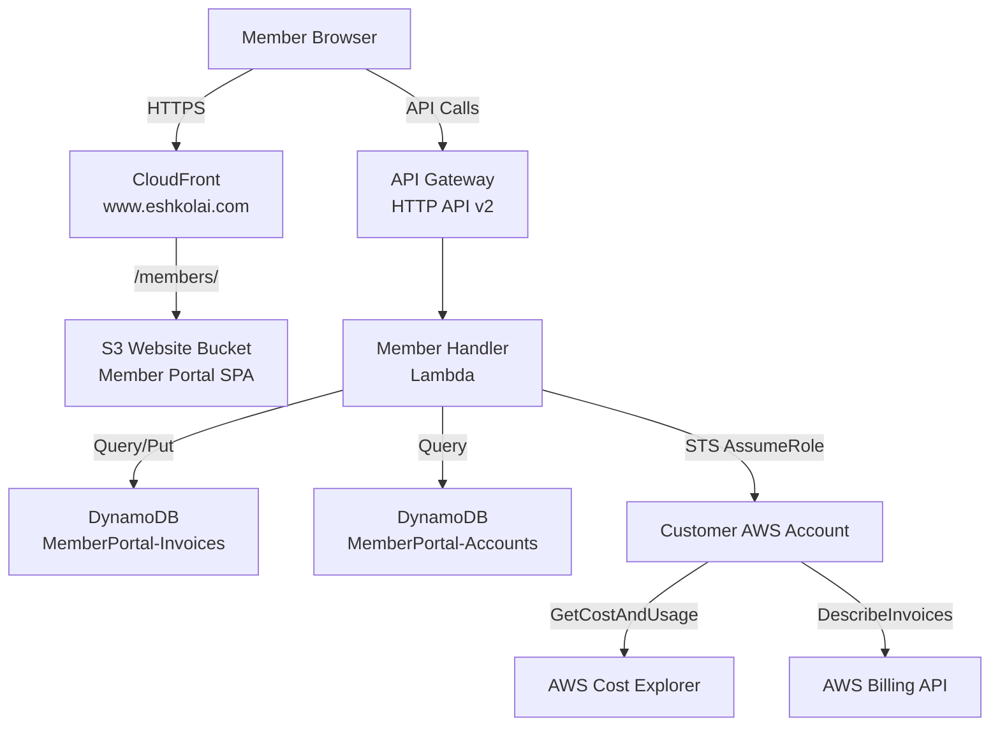
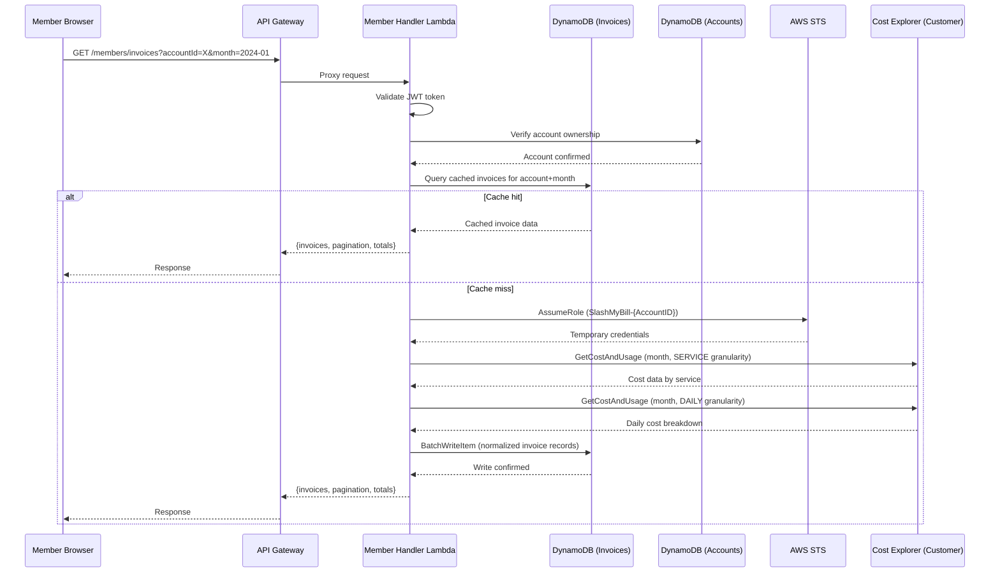
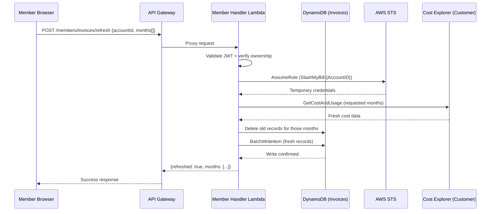

# Design Document: Invoice Explorer

## Overview

Invoice Explorer is a feature within the SlashMyBill member portal that allows members to browse, search, and drill into their AWS invoices across all connected accounts. Rather than relying solely on the AI agent for cost questions, members get a structured, tabular interface to explore historical invoices, filter by service/date/account, view line-item breakdowns, and track spending trends over time.

The feature leverages the existing cross-account IAM role assumption model (`SlashMyBill-{AccountID}`) to pull invoice data from AWS Cost Explorer and stores normalized invoice snapshots in DynamoDB for fast retrieval and offline browsing. This avoids repeated cross-account API calls and provides a consistent, searchable dataset even when the member's AWS account is temporarily unreachable.

### Key Design Decisions

1. **DynamoDB for invoice storage** — Normalized invoice data is cached in a new DynamoDB table (`MemberPortal-Invoices`) after the first fetch. This enables fast filtering, pagination, and search without hitting AWS Cost Explorer rate limits on every page load.
2. **Cost Explorer as data source** — AWS Cost Explorer `GetCostAndUsage` API provides the most structured invoice-level data (service, usage type, linked account, tags). This is preferred over parsing PDF invoices which is fragile and limited.
3. **Incremental sync model** — Invoice data is synced on-demand when a member opens the explorer, fetching only months not yet cached. A background refresh can be triggered manually or via the existing scheduler infrastructure.
4. **Server-side pagination and filtering** — The Lambda handler performs filtering and pagination server-side to keep frontend payloads small and responsive, even for accounts with years of billing history.
5. **Reuse existing member-handler Lambda** — New API routes are added to the existing `member-handler` Lambda to avoid deploying a separate function. This keeps the deployment simple and reuses auth, account ownership verification, and cross-account role assumption logic.
6. **Frontend as a new tab in the member portal** — The invoice explorer is rendered as a new tab/section in the existing `members/index.html` dashboard, consistent with how other features (schedules, actions, tags) are presented.

## Architecture

### System Context Diagram



### Invoice Data Sync Flow



### Invoice Refresh Flow



## Components and Interfaces

### Component 1: Invoice Explorer API (Member Handler Lambda — new routes)

**Purpose**: Serves invoice data to the frontend with filtering, pagination, and search. Manages the invoice cache in DynamoDB and orchestrates cross-account data fetching.

**Interface**:

| Method | Route | Description |
|--------|-------|-------------|
| GET | /members/invoices | List invoices with filters and pagination |
| POST | /members/invoices/refresh | Force re-sync invoice data from AWS |
| GET | /members/invoices/summary | Get spending summary (totals, trends) |
| GET | /members/invoices/services | Get distinct services for filter dropdown |

**Query Parameters (GET /members/invoices)**:
- `accountId` (required) — Connected AWS account ID
- `month` (optional) — Filter by billing month (YYYY-MM format)
- `service` (optional) — Filter by AWS service name
- `minCost` / `maxCost` (optional) — Cost range filter
- `search` (optional) — Free-text search across service names and usage types
- `page` (optional, default: 1) — Page number
- `pageSize` (optional, default: 50, max: 200) — Items per page
- `sortBy` (optional, default: cost) — Sort field (cost, service, date)
- `sortOrder` (optional, default: desc) — Sort direction (asc, desc)

**Responsibilities**:
- JWT token validation and account ownership verification
- Cache-first data retrieval with automatic sync on miss
- Server-side filtering, sorting, and pagination
- Cost aggregation for summary views
- Rate limiting on refresh operations (max 1 refresh per account per 5 minutes)

### Component 2: Invoice Data Sync Service (within Member Handler Lambda)

**Purpose**: Fetches invoice data from customer AWS accounts via cross-account role assumption and normalizes it into DynamoDB records.

**Interface**:
```python
def sync_invoice_data(member_email: str, account_id: str, months: list[str]) -> dict:
    """
    Fetch and cache invoice data for specified months.
    
    Args:
        member_email: Authenticated member's email
        account_id: Target AWS account ID
        months: List of months to sync (YYYY-MM format)
    
    Returns:
        {synced_months: [...], record_count: int, total_cost: float}
    """
```

**Responsibilities**:
- STS AssumeRole into customer account using existing cross-account model
- Call Cost Explorer GetCostAndUsage with SERVICE and DAILY granularity
- Normalize response into flat DynamoDB records
- Handle partial failures (some months succeed, others fail)
- Respect Cost Explorer API rate limits (5 requests/second)

### Component 3: Invoice Explorer Frontend (Member Portal Tab)

**Purpose**: Provides an interactive table-based UI for browsing and filtering invoice data, with summary cards and trend charts.

**Interface** (DOM structure):
- Tab button in the member portal navigation
- Summary cards row (total spend, month-over-month change, top service)
- Filter bar (account selector, month picker, service dropdown, search input)
- Sortable data table with pagination controls
- Expandable row detail showing daily breakdown
- Export button (CSV download)

**Responsibilities**:
- Render invoice data in a sortable, paginated table
- Provide filter controls that trigger API calls with updated parameters
- Display summary statistics and mini trend charts (Chart.js)
- Handle loading states, empty states, and error states
- Support CSV export of filtered results

### Component 4: DynamoDB Invoice Storage

**Purpose**: Persistent cache of normalized invoice line items, enabling fast queries without repeated cross-account API calls.

**Interface** (DynamoDB access patterns):
- Query by `memberEmail#accountId` (partition key) + `month#service` (sort key)
- Filter by cost range, service name
- Aggregate totals by month or service using DynamoDB queries

**Responsibilities**:
- Store normalized invoice records with TTL for automatic cleanup
- Support efficient range queries for date-based filtering
- Enable cost aggregation queries for summary views

## Data Models

### DynamoDB Table: MemberPortal-Invoices

**Table Schema**:

| Attribute | Type | Key | Description |
|-----------|------|-----|-------------|
| `pk` | String | Partition Key | `{memberEmail}#{accountId}` |
| `sk` | String | Sort Key | `{YYYY-MM}#{serviceName}` |
| `memberEmail` | String | — | Member's email address |
| `accountId` | String | — | AWS account ID |
| `month` | String | — | Billing month (YYYY-MM) |
| `service` | String | — | AWS service name (e.g., "Amazon EC2") |
| `cost` | Number | — | Total cost for this service in this month (USD) |
| `currency` | String | — | Currency code (default: USD) |
| `usageTypes` | List | — | Breakdown by usage type [{type, cost, unit, quantity}] |
| `dailyCosts` | Map | — | Daily cost breakdown {day: cost} for the month |
| `region` | String | — | Primary region (if available from CE grouping) |
| `lastSyncedAt` | String | — | ISO 8601 timestamp of last data refresh |
| `ttl` | Number | — | TTL epoch (90 days from sync) for automatic cleanup |

**GSI: month-index**

| Attribute | Type | Key | Description |
|-----------|------|-----|-------------|
| `pk` | String | Partition Key | Same as table PK |
| `month` | String | Sort Key | Billing month for efficient month-range queries |

**Capacity**: On-demand (PAY_PER_REQUEST) — consistent with all other tables in the stack.

### Invoice Summary Response Model

```python
InvoiceSummary = {
    "totalCost": float,           # Total spend across all services for the period
    "currency": str,              # "USD"
    "monthOverMonthChange": float, # Percentage change vs previous month
    "topService": {
        "name": str,              # Service with highest spend
        "cost": float,            # That service's cost
        "percentage": float       # Percentage of total
    },
    "serviceCount": int,          # Number of distinct services
    "months": [str],              # Available months in cache (YYYY-MM)
    "lastSyncedAt": str           # ISO 8601 timestamp
}
```

### Invoice List Response Model

```python
InvoiceListResponse = {
    "items": [
        {
            "service": str,       # AWS service name
            "cost": float,        # Cost in USD
            "month": str,         # YYYY-MM
            "usageTypes": [       # Detailed breakdown
                {
                    "type": str,      # Usage type description
                    "cost": float,    # Cost for this usage type
                    "unit": str,      # Unit of measurement
                    "quantity": float  # Usage quantity
                }
            ],
            "dailyCosts": {str: float},  # {"01": 1.23, "02": 4.56, ...}
            "region": str         # Primary region
        }
    ],
    "pagination": {
        "page": int,
        "pageSize": int,
        "totalItems": int,
        "totalPages": int
    },
    "totals": {
        "totalCost": float,       # Sum of all items (filtered)
        "serviceCount": int       # Distinct services in result
    },
    "filters": {                  # Echo back applied filters
        "accountId": str,
        "month": str,
        "service": str,
        "search": str
    }
}
```

### API Request/Response Models

**GET /members/invoices**
```
Request:  Query params (accountId, month, service, search, page, pageSize, sortBy, sortOrder)
Response: InvoiceListResponse (see above)
```

**POST /members/invoices/refresh**
```
Request:  { "accountId": string, "months": [string] }
Response: { "refreshed": true, "months": [...], "recordCount": int }
```

**GET /members/invoices/summary**
```
Request:  Query params (accountId, startMonth, endMonth)
Response: InvoiceSummary (see above)
```

**GET /members/invoices/services**
```
Request:  Query params (accountId)
Response: { "services": [string] }
```

**Error Response (all endpoints)**
```
{ "error": string, "message": string, "code": number }
```

### CloudFormation Resources (additions to viewmybill-stack.yaml)

| Resource | Type | Purpose |
|----------|------|---------|
| InvoicesTable | AWS::DynamoDB::Table | Invoice data cache |
| InvoicesMonthIndex | GSI on InvoicesTable | Month-based range queries |
| MemberHandlerRole update | Policy addition | DynamoDB CRUD on InvoicesTable |
| New API routes (4) | AWS::ApiGatewayV2::Route | Invoice explorer endpoints |

## Correctness Properties

*A property is a characteristic or behavior that should hold true across all valid executions of a system-essentially, a formal statement about what the system should do. Properties serve as the bridge between human-readable specifications and machine-verifiable correctness guarantees.*

### Property 1: Account ownership enforcement

*For any* invoice API request (invoices, summary, services, or refresh), the system must verify that the requested `accountId` belongs to the authenticated member. If the account does not belong to the member, the system must return a 403 error and never return invoice data from another member's account.

**Validates: Requirements 1.1, 1.2, 1.3, 11.2**

### Property 2: Pagination consistency

*For any* paginated invoice query with `totalItems = N` and `pageSize = P`, the total number of items returned across all pages (1 through ceil(N/P)) must equal exactly N, with no duplicates and no missing items.

**Validates: Requirements 3.1, 3.4**

### Property 3: Cost aggregation accuracy

*For any* set of invoice records for a given account and period, the `totalCost` in the summary response must equal the sum of all individual `cost` values for that account and period, within floating-point precision (±0.01).

**Validates: Requirements 6.1**

### Property 4: Sort order correctness

*For any* invoice list response with a specified `sortBy` field and `sortOrder`, each consecutive pair of items must respect the ordering constraint (non-increasing for desc, non-decreasing for asc) on the sort field.

**Validates: Requirements 5.1, 5.2**

### Property 5: Filter correctness

*For any* invoice dataset and any combination of filters (service, month, cost range, search text), every item in the response must satisfy all applied filter criteria (no false positives), and the reported totalItems must equal the count of all items in the dataset that match the filters (no false negatives).

**Validates: Requirements 4.1, 4.2, 4.3, 4.4, 4.5**

### Property 6: Cache freshness guarantee

*For any* invoice record in DynamoDB, the TTL must be set to 90 days from the sync timestamp. After a successful refresh operation, the `lastSyncedAt` for all affected records must be updated to the current timestamp.

**Validates: Requirements 2.4, 7.2**

### Property 7: Month format validation

*For any* string provided as a month parameter, the system must accept it if and only if it matches the format `YYYY-MM` where YYYY is a 4-digit year between 2015 and the current year, and MM is between 01 and 12. All other strings must be rejected with a 400 error.

**Validates: Requirements 8.1, 8.2**

### Property 8: Rate limiting on refresh

*For any* sequence of refresh requests for the same account within a 5-minute window, only the first request should execute the sync. Subsequent requests must return a 429 response indicating the cooldown period remaining.

**Validates: Requirements 7.3, 7.4**

### Property 9: Summary statistics correctness

*For any* two consecutive months of invoice data, the month-over-month percentage change must equal `((currentMonth - previousMonth) / previousMonth) * 100`, and the top service must be the service with the maximum cost value among all services in the period.

**Validates: Requirements 6.2, 6.3**

### Property 10: Services list completeness

*For any* set of invoice records in the cache for a given account, the services endpoint must return exactly the set of distinct service names present in those records — no extras and no omissions.

**Validates: Requirements 11.1**

### Property 11: CSV export fidelity

*For any* filtered invoice result set, the exported CSV must contain exactly the same items as the API response for that filter configuration, with all fields (service, cost, month, region) accurately represented.

**Validates: Requirements 9.6**

## Error Handling

### Frontend Error Handling

| Scenario | User Message | Action |
|----------|-------------|--------|
| No accounts connected | "Connect an AWS account to explore invoices" | Show link to account setup |
| Account sync in progress | "Loading invoice data..." | Show skeleton loader |
| Cost Explorer not enabled | "Cost Explorer is not enabled for this account" | Show enablement instructions |
| Cross-account role missing | "Access denied — please re-deploy the CloudFormation template" | Show template link |
| Network error | "Failed to load invoices. Please try again." | Show retry button |
| Rate limited (refresh) | "Please wait before refreshing again" | Disable refresh button with countdown |
| No data for selected month | "No invoice data found for this period" | Show empty state with suggestion |
| API timeout | "Request timed out. Try a smaller date range." | Suggest narrowing filters |

### Backend Error Handling

| Scenario | Status | Response | Recovery |
|----------|--------|----------|----------|
| Invalid accountId format | 400 | "Invalid account ID format" | Client fixes input |
| Account not owned by member | 403 | "Account does not belong to you" | Log attempt, block |
| Cost Explorer API throttled | 429 | "AWS rate limit reached, retry shortly" | Exponential backoff |
| STS AssumeRole fails | 403 | "Cannot access account — check IAM role" | Guide user to re-deploy template |
| Cost Explorer not activated | 400 | "Cost Explorer not enabled for this account" | Provide enablement link |
| DynamoDB write throttled | 500 | "Temporary storage error" | Auto-retry with backoff |
| Invalid month format | 400 | "Month must be in YYYY-MM format" | Client fixes input |
| Refresh rate limited | 429 | "Refresh available in X minutes" | Return cooldown remaining |

## Testing Strategy

### Unit Testing Approach

- Test invoice data normalization from Cost Explorer response format to DynamoDB record format
- Test pagination logic (page boundaries, last page with fewer items)
- Test filter application (service filter, cost range, search matching)
- Test sort ordering for all supported fields
- Test rate limiting logic (cooldown tracking)
- Test error handling for each AWS API failure mode
- Mock STS and Cost Explorer responses

### Property-Based Testing Approach

**Property Test Library**: Hypothesis (Python)

| Property | Test Description | Generator Strategy |
|----------|-----------------|-------------------|
| P1 | Account ownership | Generate random email/accountId pairs, verify access control |
| P2 | Pagination consistency | Generate lists of N items, verify page traversal completeness |
| P3 | Cost aggregation | Generate random cost arrays, verify sum matches total |
| P4 | Sort correctness | Generate random cost lists, verify ordering after sort |
| P5 | Filter completeness | Generate items with random services, verify filter results |
| P7 | Month validation | Generate random strings, verify format acceptance/rejection |
| P8 | Rate limiting | Generate request sequences with timestamps, verify cooldown |

### Integration Testing Approach

- End-to-end test with mocked AWS APIs: full flow from API request through DynamoDB cache to response
- Test cache hit vs cache miss paths
- Test concurrent refresh requests for rate limiting
- Test with large datasets (1000+ line items) for pagination performance
- Frontend integration tests for table rendering, filter interactions, and export functionality

## Performance Considerations

- **DynamoDB on-demand**: No capacity planning needed; scales automatically with usage
- **Cache-first architecture**: Most requests served from DynamoDB (single-digit ms latency) without cross-account API calls
- **Pagination**: Server-side pagination keeps response payloads under 100KB even for accounts with hundreds of services
- **Cost Explorer rate limits**: 5 requests/second per account — the sync service respects this with sequential calls and backoff
- **TTL cleanup**: 90-day TTL on invoice records prevents unbounded table growth
- **Frontend lazy loading**: Daily breakdown data loaded on row expansion, not on initial table render

## Security Considerations

- **Account ownership verification**: Every request validates that the target accountId belongs to the authenticated member (reuses existing `_verify_account_ownership` function)
- **Cross-account access**: Uses the same STS AssumeRole + ExternalId model as all other features — no new IAM permissions needed in customer accounts (Cost Explorer read is already in the ReadOnlyAccess policy)
- **No sensitive data exposure**: Invoice data contains service names and costs only — no resource IDs, tags, or PII beyond what the member already has access to
- **Rate limiting**: Prevents abuse of the refresh endpoint which triggers cross-account API calls
- **TTL-based data retention**: Invoice cache automatically expires after 90 days, limiting data exposure window

## Dependencies

| Dependency | Purpose | Already in Stack |
|------------|---------|-----------------|
| AWS Cost Explorer API | Invoice data source | Yes (used by AI agent) |
| AWS STS | Cross-account role assumption | Yes |
| DynamoDB | Invoice data cache | Yes (new table needed) |
| API Gateway HTTP API | Route new endpoints | Yes (add routes) |
| Member Handler Lambda | Host new route handlers | Yes (add code) |
| Chart.js | Frontend trend mini-charts | Yes (already loaded in portal) |
| Existing cross-account IAM role | Access customer Cost Explorer | Yes (ReadOnlyAccess includes ce:*) |
