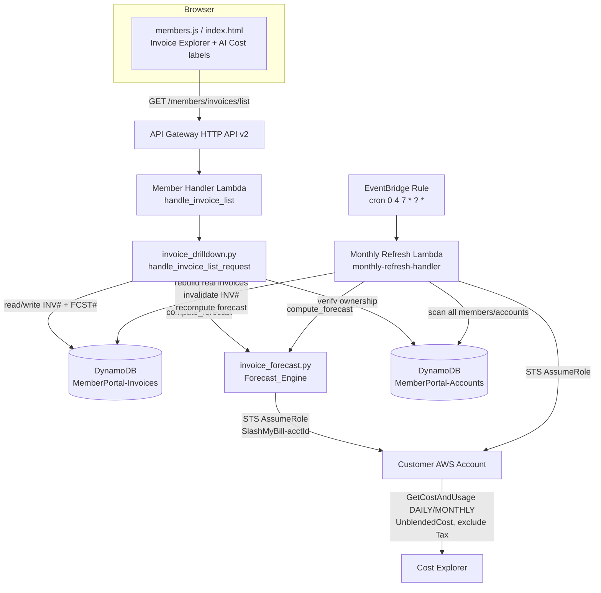
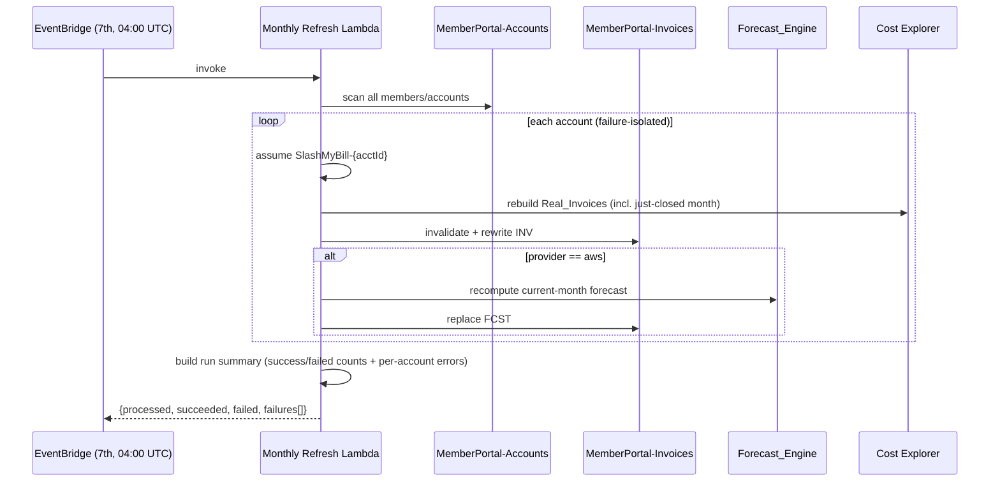

# Design Document: Invoice Forecast and "AI Cost" Rename

## Overview

This feature delivers two capabilities to the SlashMyBill member portal, both grounded in the existing Invoice Explorer drill-down stack (`member-handler/invoice_drilldown.py`, `members/members.js`, `members/index.html`) and the existing scheduled-refresh infrastructure (`daily-refresh-handler/`, EventBridge rules in `infrastructure/viewmybill-stack.yaml`).

**Part 1 — "AI Cost" rename (Requirements 1–5).** The user-facing string "OpenAI" is replaced with "AI Cost" on eight enumerated presentation surfaces. This is implemented as a single, presentation-layer label-mapping approach: a small set of display helpers (`_aiCostProviderLabel`, `_aiCostIssuerLabel`) plus static text edits in `members/members.js` and `members/index.html`. No internal identifier changes: the section id `observe-openai`, the `cloudProvider === 'openai'` Provider_Key, `vendorType === 'ai_vendor'`, KMS encryption contexts, and API routes (`/members/accounts/add-openai`, `/members/accounts/test-openai-connection`) all remain byte-for-byte unchanged.

**Part 2 — Forecasted Invoice (Requirements 6–13).** A new pure-logic module `member-handler/invoice_forecast.py` (the Forecast_Engine) computes a projected full-month total for the current, in-progress month for AWS accounts only. During the forecast window (UTC day-of-month ≥ 4 through month end) it pulls DAILY unblended cost (excluding Tax) for the current month, computes a median-based variable projection, detects fixed-cost components from the single most recent closed month, and emits a synthetic Forecast_Invoice record (`invoiceId = "Forecast-<YYYY-MM>"`, status `Forecast`). The forecast is cached in `MemberPortal-Invoices` with a new `FCST#` sort-key prefix and `recordType = "forecast"`, merged into the existing invoice list by `handle_invoice_list_request`, sorted to the top, and rendered with an em-dash payment date and a distinct "Forecast" status badge. Once the month closes, the real actual invoice supersedes the forecast. A new monthly EventBridge rule fires on the 7th (UTC) and triggers a full refresh across all members and accounts.

### Key Design Decisions

1. **Display-only rename via a label map.** Rather than touch data records, the rename is a thin presentation transform. Two helpers map the Provider_Key `openai` → "AI Cost" (provider display) and the stored issuer `"OpenAI"` → "AI Cost" (Invoice Explorer). Everywhere else the rename is a static text edit on a known set of DOM-producing lines. This keeps the change auditable and guarantees internal identifiers are untouched (Requirements 1.4, 3.4, 4.4, 5.4).

2. **Forecast as a separate pure module.** The forecast math (median, variable projection, fixed-cost detection, rounding) lives in `invoice_forecast.py` as pure functions that take cost arrays and return numbers/records. AWS I/O (Cost Explorer, STS) is isolated in thin fetch wrappers reusing the established `_assume_role` pattern. This makes the math property-testable without AWS.

3. **New sort-key prefix `FCST#` in the existing table.** The forecast record lives in `MemberPortal-Invoices` alongside `INV#` (real invoice list), `{YYYY-MM}#` (service), and `RES#` (resource) records, using `sk = "FCST#{YYYY-MM}"`. This reuses the existing partition key `{memberEmail}#{accountId}`, TTL, and cross-account access with no new table.

4. **`recordType` discriminator.** Real invoice-list records are tagged `recordType = "real"` and forecast records `recordType = "forecast"` (Requirement 12.1), so the merge logic can enforce "at most one record per account per month, real wins" (Requirement 10.4).

5. **Merge-and-supersede at read time.** `handle_invoice_list_request` reads the `INV#` real records and the `FCST#` forecast record, drops the forecast if a real invoice already exists for the same period, checks forecast staleness (stored month vs. current UTC month), recomputes if stale, and positions the forecast at the top of the default sort (Requirements 9, 10, 12).

6. **Reuse scheduled-refresh patterns for the monthly job.** The Monthly_Refresh_Job is a new Lambda (`monthly-refresh-handler/`) modeled directly on `daily-refresh-handler/lambda_function.py`: scan `MemberPortal-Accounts`, assume each `SlashMyBill-{accountId}` role, rebuild invoices, with per-account try/except isolation and a run summary. It is triggered by a new EventBridge `cron(0 4 7 * ? *)` rule, mirroring `DailyRefreshSchedule`.

## Architecture

### System Context Diagram



### Forecast Read / Merge Flow

```mermaid
sequenceDiagram
    participant U as Member Browser
    participant ILR as handle_invoice_list_request
    participant DDB as MemberPortal-Invoices
    participant FE as Forecast_Engine
    participant CE as Cost Explorer

    U->>ILR: GET /members/invoices/list?accountId=X
    ILR->>ILR: validate + verify ownership
    ILR->>DDB: query pk=email#X, sk begins_with INV#
    ILR->>DDB: get pk=email#X, sk=FCST#{currentMonth}
    alt Provider is AWS and in forecast window (day>=4)
        alt cached forecast month == current UTC month
            ILR->>ILR: use cached forecast
        else stale or missing
            ILR->>FE: compute_forecast(email, X, 'aws')
            FE->>CE: GetCostAndUsage DAILY (exclude Tax) current month
            FE->>CE: GetCostAndUsage MONTHLY prior closed month
            FE-->>ILR: Forecast_Invoice or None
            ILR->>DDB: put/replace FCST# (or delete if None)
        end
    end
    ILR->>ILR: drop forecast if real invoice exists for same period (10.2/10.4)
    ILR->>ILR: sort real invoices; place forecast at top (9.6)
    ILR-->>U: items[] (forecast first, em-dash payment date)
```

### Monthly Scheduled Refresh Flow



## Components and Interfaces

### Component 1: AI Cost Display Mapping (frontend — `members/members.js`, `members/index.html`)

**Purpose**: Replace the user-facing "OpenAI" term with "AI Cost" on the eight enumerated surfaces (Requirement 5.2) while leaving internal identifiers unchanged.

**New helpers (members.js)**:
```javascript
// Presentation-layer label constant
var AI_COST_LABEL = 'AI Cost';

// Map an internal Provider_Key to its user-facing provider name.
// Only 'openai' is remapped; all other keys pass through unchanged. (Req 3.2, 3.5)
function _aiCostProviderLabel(providerKey) {
    return (String(providerKey || '').trim().toLowerCase() === 'openai')
        ? AI_COST_LABEL
        : providerKey;
}

// Map a stored invoice issuer to its user-facing label for the Invoice Explorer.
// "OpenAI" -> "AI Cost"; AWS issuer and all others pass through unchanged. (Req 4.1–4.5)
function _aiCostIssuerLabel(issuer) {
    var v = String(issuer == null ? '' : issuer);
    if (v.trim().toLowerCase() === 'openai') return AI_COST_LABEL;
    return v; // empty -> caller applies existing default issuer (Req 4.5)
}
```

**Exact rename surfaces and locations**:

| # (Req 5.2) | Surface | File | Location / current text | Change |
|---|---|---|---|---|
| 1 | Observe-tab AI usage nav button | `members/index.html` | line ~975 button text `🤖 OpenAI` (inside `#observe-openai-nav-btn`) | text → `🤖 AI Cost`; **keep** `data-section="observe-openai"`, `id="observe-openai-nav-btn"`, `onclick` arg |
| 1 | Observe nav model array | `members/members.js` | line ~3621 `{ id: 'observe-openai', label: 'OpenAI', icon: '🤖' }` | `label` → `'AI Cost'`; **keep** `id: 'observe-openai'` |
| 2 | AI usage dashboard heading | `members/members.js` | line ~13591 `<h3 ...>OpenAI Usage Dashboard</h3>` | → `AI Cost Usage Dashboard` |
| 2 | Dashboard account-selector labels | `members/members.js` | `_renderOpenAIDashboard` account `<option>` text (line ~13596) | provider-derived names use `_aiCostProviderLabel`; member-supplied `accountName` preserved (Req 3.3) |
| 3 | AI usage dashboard empty state | `members/members.js` | line ~13575 "No OpenAI accounts connected" / "Connect an OpenAI account..." | → "No AI Cost accounts connected" / "Connect an AI Cost account..." |
| 4 | Configure wizard (provider select, headers, submit, confirm) | `members/members.js` | line ~13360 provider option `OpenAI`; ~13369 `Connect OpenAI` header; ~13391 `Connect OpenAI` submit; confirmation/notify text | "OpenAI" → "AI Cost"; **keep** product detail `ChatGPT, GPT-4, DALL-E, Whisper` byte-for-byte (Req 2.4); **keep** `#ai-vendor-select-openai` id, `.openai-test-btn` class, routes |
| 5 | AI connections list empty state | `members/index.html` | line ~871 `#ai-vendors-empty` "...connect OpenAI." | → "...connect AI Cost." |
| 6 | Default AI account display name | `members/members.js` | line ~13276 `esc(a.accountName || 'OpenAI Connection')` | fallback → `'AI Cost Connection'`; member-supplied `accountName` preserved (Req 3.1, 3.3) |
| 7 | Provider display for `openai` accounts | `members/members.js` | provider-name render sites for AI vendor accounts (e.g. account list/cards) | wrap provider display in `_aiCostProviderLabel(a.cloudProvider)` |
| 8 | Invoice Explorer "Issued By" | `members/members.js` | line ~12562 `esc(inv.issuer || 'Amazon Web Services')` in `_ddRenderInvoices` | → `esc(_aiCostIssuerLabel(inv.issuer) || 'Amazon Web Services')` |

**Unchanged (Requirements 1.4, 5.4)**: `observe-openai` section id and `observe-section-observe-openai`, `cloudProvider === 'openai'` / `vendorType === 'ai_vendor'` filters, function names `_validateOpenAIKey` / `_testOpenAIConnection` / `_renderOpenAIDashboard`, element ids `#openai-dashboard` / `#ai-vendor-select-openai`, CSS class `.openai-test-btn`, and routes `/members/accounts/add-openai`, `/members/accounts/test-openai-connection`.

### Component 2: Forecast Engine (`member-handler/invoice_forecast.py` — new module)

**Purpose**: Pure-logic + thin-I/O module that decides whether to produce a Forecast_Invoice, computes the projected total, and returns a forecast record. AWS access reuses the `_assume_role` pattern (SHA-256 ExternalId) already used in `invoice_drilldown.py` and `invoice_sync.py`.

**Public interface**:
```python
# Module constants
FORECAST_START_DAY = 4          # forecast window begins on UTC day-of-month 4 (Req 6.2)
RECORD_TYPE_FORECAST = "forecast"
RECORD_TYPE_REAL = "real"
FORECAST_SK_PREFIX = "FCST#"

def compute_forecast(
    member_email: str,
    account_id: str,
    provider_key: str,
    now: datetime | None = None,
    default_issuer: str = "Amazon Web Services",
    latest_real_issuer: str | None = None,
) -> dict | None:
    """Produce a Forecast_Invoice record for the Current_Month, or None.

    Returns None (forecast omitted) when, per Requirements 6/8/11:
      - provider_key is not 'aws' (case-insensitive, trimmed)        (Req 11.1–11.3)
      - now (UTC) is before FORECAST_START_DAY                       (Req 6.2)
      - Month_To_Date_Cost is null/error/<= 0.00                     (Req 6.4)
      - Elapsed_Days == 0                                            (Req 8.8)
      - Cost Explorer retrieval fails                                (Req 8.11)
    On success returns a forecast record dict (see Data Models).
    """

def is_in_forecast_window(now: datetime) -> bool:
    """True iff now (UTC) day-of-month is >= FORECAST_START_DAY and <= last day."""

def is_aws_provider(provider_key: str | None) -> bool:
    """True iff provider_key.strip().lower() == 'aws'. None/empty -> False (Req 11.3)."""

def fetch_daily_cost_series(creds: dict, year: int, month: int, now: datetime) -> list[float]:
    """GetCostAndUsage DAILY, UnblendedCost, excluding RECORD_TYPE Tax, for the
    elapsed days of the Current_Month. Returns per-day totals (one float per
    fully elapsed day). (Req 8.3)"""

def median(values: list[float]) -> float:
    """Median: middle value when len is odd; mean of two middle values when
    even. Empty list -> 0.0. (Req 8.4)"""

def compute_variable_forecast(mtd_cost: float, median_daily: float, remaining_days: int) -> float:
    """Month_To_Date_Cost + (Median_Daily_Cost * Remaining_Days). (Req 8.2)"""

def detect_fixed_components(creds: dict, account_id: str, prev_period: str) -> list[dict]:
    """Analyze the single most recent Closed_Month (prev_period, YYYY-MM) via
    GetCostAndUsage (SERVICE, exclude Tax). For each recurring component record
    both its absolute amount and its share of that month's total, so it can be
    applied as a fixed amount or a percentage. Empty list if none. (Req 8.5, 8.7)"""

def compute_fixed_forecast(components: list[dict], projected_total: float) -> float:
    """Apply each Fixed_Cost_Model to the Current_Month and sum. Fixed-amount
    components contribute their amount; percentage components contribute
    share * projected_total. Empty components -> 0.0. (Req 8.6, 8.7)"""

def round_half_up_2dp(value: float) -> Decimal:
    """Round to 2 decimal places using ROUND_HALF_UP. (Req 8.9)"""

def build_forecast_record(
    current_month: str, total: Decimal, issuer: str,
    mtd: float, median_daily: float, variable: float, fixed: float,
    elapsed_days: int, remaining_days: int,
) -> dict:
    """Assemble the Forecast_Invoice record. invoiceId='Forecast-<YYYY-MM>',
    paymentStatus='Forecast', paymentDate='', recordType='forecast'. (Req 7.1, 7.3)"""
```

**Computation sequence inside `compute_forecast`** (all UTC):
1. `is_aws_provider(provider_key)` is false → return `None` (Req 11.2/11.3, record skip reason for missing key).
2. `is_in_forecast_window(now)` is false → return `None` (Req 6.2).
3. Derive `current_month = now.strftime('%Y-%m')`; if it does not match `^\d{4}-(0[1-9]|1[0-2])$`, raise `ForecastError` (Req 7.2).
4. `daily = fetch_daily_cost_series(...)`; on Cost Explorer failure raise/propagate so caller omits and retains prior record (Req 8.11).
5. `elapsed_days = len(daily)`; if `0` → return `None` (Req 8.8).
6. `mtd = sum(daily)`; if `mtd is None or mtd <= 0.0` → return `None` (Req 6.4).
7. `days_in_month` from calendar; `remaining_days = days_in_month - elapsed_days`.
8. `median_daily = median(daily)`; `variable = compute_variable_forecast(mtd, median_daily, remaining_days)`.
9. `components = detect_fixed_components(...)` for the single prior closed month; `fixed = compute_fixed_forecast(components, variable)`.
10. `total = round_half_up_2dp(variable + fixed)` (Req 8.1, 8.9).
11. Issuer = `latest_real_issuer` if present else `default_issuer` (Req 9.3, 9.4).
12. Return `build_forecast_record(...)`.

### Component 3: Invoice List Integration (`member-handler/invoice_drilldown.py` — modified)

**Purpose**: Merge the forecast into the existing invoice list, enforce supersession and staleness, and sort the forecast to the top. Changes are localized to `handle_invoice_list_request` plus three new cache helpers.

**Modified `handle_invoice_list_request` (additional steps after existing cache read)**:
- After obtaining `items` (real `INV#` records), look up the account's `cloudProvider` from `MemberPortal-Accounts` (already queried during ownership verification — extend the projection to include `cloudProvider`).
- Call `_get_or_refresh_forecast(member_email, account_id, provider_key, items)` which:
  - Reads `FCST#{currentMonth}` (sk begins_with `FCST#`).
  - If a real invoice with the same `period` as the forecast exists in `items`, deletes the forecast record and returns `None` (Req 10.2, 10.4).
  - If cached forecast `forecastMonth == currentMonth` → return it (Req 12.2).
  - If stale (`forecastMonth != currentMonth`) or missing → call `compute_forecast(...)`; on success replace the record, on `None` delete any stale record, on failure delete stale record and surface `forecastUnavailable` (Req 12.3, 12.4, 8.11).
- If a forecast is returned, prepend it to the response items so it occupies ordinal position 0 regardless of the empty `paymentDate` (Req 9.1, 9.6), then apply existing sort to the remaining real invoices.
- The forecast response item carries `paymentDate: ""` (rendered as em-dash, Req 9.5), `paymentStatus: "Forecast"` (Req 7.3/7.4), and `issuer` from the most recent real invoice (Req 9.3) or the default (Req 9.4).

**New cache helpers** (mirroring `_read_invoice_cache` / `_write_invoice_cache`):
```python
def _read_forecast_record(member_email: str, account_id: str, current_month: str) -> dict | None:
    """Get pk={email}#{accountId}, sk=FCST#{current_month}. None if absent/expired."""

def _write_forecast_record(member_email: str, account_id: str, record: dict) -> None:
    """Put the forecast record with sk=FCST#{forecastMonth}, recordType='forecast',
    lastSyncedAt, ttl = epoch + 90 days."""

def _delete_forecast_record(member_email: str, account_id: str, month: str) -> None:
    """Delete pk={email}#{accountId}, sk=FCST#{month} (stale/superseded)."""
```

Existing `_write_invoice_cache` is updated to stamp `recordType = "real"` on `INV#` records (Req 12.1).

### Component 4: Monthly Refresh Job (`monthly-refresh-handler/lambda_function.py` — new)

**Purpose**: Scheduled full refresh on the 7th (UTC). Modeled on `daily-refresh-handler/lambda_function.py`.

**Interface**:
```python
def lambda_handler(event, context) -> dict:
    """EventBridge entry point. Scan MemberPortal-Accounts, refresh every
    member/account with per-account failure isolation, return a run summary.
    Idempotent (Req 13.1, 13.4, 13.5)."""

def _refresh_account_monthly(member_email: str, account_id: str, provider_key: str, now: datetime) -> dict:
    """For one account:
      1. Rebuild Real_Invoices including the just-Closed_Month via Cost Explorer
         monthly aggregation (reuses fetch_invoice_list / CE fallback logic).
      2. Invalidate + rewrite INV# records (recordType='real').            (Req 13.2, 13.3)
      3. If provider is AWS: recompute current-month forecast and
         replace FCST#{currentMonth} (or delete if compute returns None).  (Req 13.2)
    Returns a per-account result {accountId, status, error?}."""

def _build_run_summary(results: list[dict]) -> dict:
    """{'processed': n, 'succeeded': s, 'failed': f, 'failures': [...]}"""
```

**Idempotency**: all writes are deterministic upserts keyed by `(pk, sk)`; rebuilding the same month produces identical `INV#`/`FCST#` records, so repeated runs on the 7th converge to the same state (Req 13.5).

**Failure isolation**: each account is processed in its own `try/except`; a failure is recorded in the summary and the loop continues (Req 13.4).

### Component 5: Forecast Frontend Rendering (`members/members.js` — modified)

**Purpose**: Render the forecast row in the existing invoice table with a distinct badge and em-dash payment date.

- `_ddStatusBadge(status)` (line ~12468): add a branch for `s === 'forecast'` returning a `dd-status-forecast` class distinct from `dd-status-paid` / `dd-status-pending` / `dd-status-overdue`, with label text exactly "Forecast" (Req 7.4, 7.5). A matching `.dd-status-forecast` style (e.g. blue/indigo) is added to `members/members.css`.
- `_ddFormatDate(isoDate)` (line ~12457): already returns the em-dash `\u2014` for empty/missing dates, satisfying Req 9.5 when the forecast `paymentDate` is `""`.
- `_ddRenderInvoices(data)` (line ~12533): no ordering change needed — the backend returns the forecast first; the existing per-item loop renders it using the same five columns in the same order as real invoices (Req 7.6). The issuer cell applies `_aiCostIssuerLabel` (Component 1, surface 8).

## Data Models

### DynamoDB Table: `MemberPortal-Invoices` (extended)

Partition key `pk = {memberEmail}#{accountId}`; sort key `sk` discriminates record kinds. The forecast adds the `FCST#` prefix; existing `INV#`, `{YYYY-MM}#`, and `RES#` prefixes are unchanged.

#### Forecast_Invoice record (NEW)

| Attribute | Type | Key | Description |
|---|---|---|---|
| `pk` | String | PK | `{memberEmail}#{accountId}` |
| `sk` | String | SK | `FCST#{YYYY-MM}` (the Current_Month) |
| `recordType` | String | — | `"forecast"` (Req 12.1) |
| `invoiceId` | String | — | `Forecast-{YYYY-MM}` (Req 7.1) |
| `issuer` | String | — | Most recent Real_Invoice issuer, else default issuer (Req 9.3, 9.4) |
| `paymentDate` | String | — | `""` — rendered as em-dash "—" (Req 9.5) |
| `paymentStatus` | String | — | `"Forecast"` (Req 7.3) |
| `totalAmount` | Number | — | Forecast_Total, 2dp ROUND_HALF_UP, USD (Req 8.9, 8.10) |
| `currency` | String | — | `"USD"` (Req 8.10) |
| `period` | String | — | `{YYYY-MM}` (Current_Month) |
| `forecastMonth` | String | — | `{YYYY-MM}` used for staleness check (Req 12.2, 12.3) |
| `monthToDateCost` | Number | — | Month_To_Date_Cost (audit/debug) |
| `medianDailyCost` | Number | — | Median_Daily_Cost (Req 8.4) |
| `variableCostForecast` | Number | — | Variable_Cost_Forecast (Req 8.2) |
| `fixedCostForecast` | Number | — | Fixed_Cost_Forecast (Req 8.6) |
| `elapsedDays` | Number | — | Fully elapsed days with data |
| `remainingDays` | Number | — | `Days_In_Month - Elapsed_Days` |
| `source` | String | — | `"forecast_engine"` |
| `lastSyncedAt` | String | — | ISO 8601 timestamp |
| `ttl` | Number | — | epoch + 90 days |

#### Fixed_Cost_Component (in-memory shape produced by `detect_fixed_components`)

```json
{ "service": "AWS Support (Business)", "amount": 100.00, "share": 0.083, "model": "fixed" }
```
`model` is `"fixed"` (apply `amount`) or `"percentage"` (apply `share * projected_total`).

#### Real_Invoice record (existing `INV#`, enhanced)

The existing `INV#{invoiceId}` records written by `_write_invoice_cache` gain `recordType = "real"` (Req 12.1). All other fields (`invoiceId`, `issuer`, `paymentDate`, `paymentStatus`, `totalAmount`, `currency`, `period`, `source`, `lastSyncedAt`, `ttl`) are unchanged. Cost Explorer fallback records keep `invoiceId = "{YYYY-MM}-monthly"`, `paymentStatus = "paid"`, `paymentDate = next-month-15`, `source = "cost_explorer_fallback"`.

### Forecast response item (API → frontend)

```json
{
  "invoiceId": "Forecast-2026-06",
  "issuer": "Amazon Web Services",
  "paymentDate": "",
  "paymentStatus": "Forecast",
  "totalAmount": 1234.56,
  "currency": "USD",
  "period": "2026-06"
}
```

### Cross-account IAM (existing, sufficient)

The Forecast_Engine and Monthly_Refresh_Job use only `ce:GetCostAndUsage` via the existing `SlashMyBill-{accountId}` role; no new cross-account permissions are required. The new Monthly Refresh Lambda role mirrors `DailyRefreshRole` (sts:AssumeRole; DynamoDB Scan/Query/PutItem/BatchWriteItem on `MemberPortal-Accounts` and `MemberPortal-Invoices`; `ce:GetCostAndUsage`).

## Correctness Properties

*A property is a characteristic or behavior that should hold true across all valid executions of a system — essentially, a formal statement about what the system should do. Properties serve as the bridge between human-readable specifications and machine-verifiable correctness guarantees.*

The properties below were derived from the prework analysis. Redundant per-surface and per-criterion checks were consolidated: the many display-substitution criteria collapse into the label/identifier properties; the forecast-existence criteria (6.3, 9.1, 9.2, 10.1–10.4) collapse into a single per-account-per-month uniqueness/precedence property.

### Property 1: Issuer and provider display mapping

*For any* issuer or provider string, the display helper SHALL return "AI Cost" when the input equals "openai" (case-insensitive, trimmed), SHALL return "Amazon Web Services" when the input is empty or null, SHALL return the input unchanged for every other value, and SHALL never return a string containing "OpenAI" (in any letter case) for the `openai` and empty/null cases.

**Validates: Requirements 1.1, 1.5, 3.2, 3.5, 4.1, 4.2, 4.3, 4.5, 5.1, 5.3**

### Property 2: Account display name handling

*For any* account, when the account has no member-supplied name and its Provider_Key is `openai`, the displayed default name SHALL contain "AI Cost" and SHALL NOT contain "OpenAI"; and *for any* non-empty member-supplied account name, the displayed name SHALL equal that name byte-for-byte (preserving case, surrounding whitespace, and any embedded "OpenAI" substring).

**Validates: Requirements 3.1, 3.3**

### Property 3: Display transform preserves internal identifiers

*For any* internal identifier, route path, encryption-context string, stored Provider_Key, or stored issuer value, applying the presentation-layer "AI Cost" substitution SHALL leave that stored/internal value byte-for-byte unchanged (the substitution affects only rendered output, never data, request payloads, or identifiers).

**Validates: Requirements 1.4, 2.3, 3.4, 4.4, 5.4**

### Property 4: Forecast window predicate

*For any* UTC datetime, `is_in_forecast_window` SHALL return true if and only if the day-of-month is greater than or equal to 4 and less than or equal to the last calendar day of that month.

**Validates: Requirements 6.1, 6.2**

### Property 5: Forecast identifier format and validation

*For any* valid (year, month) with month in 1–12, `forecast_invoice_id` SHALL produce a string matching `^Forecast-\d{4}-(0[1-9]|1[0-2])$` whose `YYYY-MM` parses back to the same year and month; and *for any* invalid month value, it SHALL raise an error (causing the engine to omit the forecast with an error indication).

**Validates: Requirements 7.1, 7.2**

### Property 6: Median definition

*For any* non-empty list of daily cost values, `median` SHALL equal the middle value when the count is odd and the arithmetic mean of the two middle values when the count is even.

**Validates: Requirements 8.4**

### Property 7: Variable forecast formula

*For any* month-to-date cost, daily cost series, and days-in-month, `compute_variable_forecast` SHALL equal `mtd_cost + median(daily_series) * (days_in_month - len(daily_series))`, where `len(daily_series)` is Elapsed_Days and `(days_in_month - len(daily_series))` is Remaining_Days.

**Validates: Requirements 8.2**

### Property 8: Forecast total composition and rounding

*For any* variable forecast and any (possibly empty) set of fixed-cost models, the Forecast_Total SHALL equal `round_half_up(variable + Σ fixed_amounts, 2)`, SHALL have at most two decimal places, and SHALL equal `variable` rounded when the fixed-cost model set is empty.

**Validates: Requirements 8.1, 8.6, 8.7, 8.9**

### Property 9: Fixed-cost detection records amount and percentage

*For any* most-recent closed-month breakdown (a positive total and a list of components), each detected `FixedCostModel` SHALL record a `fixed_amount` equal to its component's monetary amount and a `pct_of_total` equal to that amount divided by the closed-month total, so the component can later be applied as either a fixed amount or a percentage.

**Validates: Requirements 8.5**

### Property 10: Forecast omission conditions

*For any* forecast computation where the month-to-date cost is null, an error, or not greater than 0.00, OR where Elapsed_Days is zero, OR where Cost Explorer retrieval fails, `build_forecast_record` SHALL return an omitted result (no forecast record) with a reason code and SHALL NOT mutate any previously stored invoice record.

**Validates: Requirements 6.4, 8.8, 8.11**

### Property 11: At most one record per account per month with real precedence

*For any* set of invoice records (a mix of forecast and real records across months) for a single account, the merged Invoice_Explorer output SHALL contain at most one record per calendar month, and whenever both a Real_Invoice and a Forecast_Invoice exist for the same month, the merged output SHALL retain the Real_Invoice and exclude the Forecast_Invoice.

**Validates: Requirements 6.3, 9.1, 9.2, 10.1, 10.2, 10.3, 10.4**

### Property 12: Forecast issuer derivation

*For any* account with a set of prior Real_Invoices, the Forecast_Invoice "Issued By" value SHALL equal the issuer of the most recent Real_Invoice for that account; and when the account has no prior Real_Invoice, it SHALL equal the account's configured default issuer value.

**Validates: Requirements 9.3, 9.4**

### Property 13: Forecast payment-date rendering

*For any* Forecast_Invoice item (status "Forecast" or empty payment date), the Invoice_Explorer SHALL render the em-dash character ("—", U+2014) as the sole content of the Payment Date column.

**Validates: Requirements 9.5**

### Property 14: Forecast sorts to the top

*For any* list of invoice items that includes a Forecast_Invoice for the Current_Month, after applying the default sort the Forecast_Invoice SHALL occupy the first (index 0) position, ahead of all Real_Invoices, regardless of its empty payment date.

**Validates: Requirements 9.6**

### Property 15: Status badge distinctness

*For the* set of status indicators {paid, pending, overdue, forecast}, the (label text, color) pairs SHALL be pairwise distinct, so no two indicators share the same combination of label and color, and the forecast indicator's label SHALL be exactly "Forecast".

**Validates: Requirements 7.5**

### Property 16: Provider scope of forecasting

*For any* set of accounts with mixed Provider_Key values, when the Forecast_Engine runs in the forecast window it SHALL produce a Forecast_Invoice exactly for those accounts whose Provider_Key equals `aws` (trimmed, case-insensitive), SHALL produce zero forecasts for accounts whose Provider_Key is any other value, and SHALL treat null, empty, or absent Provider_Key as non-AWS (zero forecasts, with a recorded skip reason).

**Validates: Requirements 11.1, 11.2, 11.3, 11.4**

### Property 17: Record-type discriminator and staleness handling

*For any* stored forecast record, it SHALL carry `recordType = "forecast"` distinguishing it from real records; *for any* request where the cached forecast's stored month equals the current UTC month, the engine SHALL return the cached forecast without recomputation; and *for any* request where the stored month differs from the current UTC month, the engine SHALL NOT return the stale record and SHALL replace or remove it.

**Validates: Requirements 12.1, 12.2, 12.3**

### Property 18: Monthly refresh resilience and count invariant

*For any* list of N accounts where each account's refresh independently succeeds or fails, the Monthly_Refresh_Job SHALL attempt all N accounts (never short-circuit on a failure), SHALL record an entry for each failed account, and the resulting summary SHALL satisfy `accountsProcessed + accountsFailed == N`.

**Validates: Requirements 13.4**

### Property 19: Monthly refresh idempotence

*For any* account state, running the Monthly_Refresh_Job twice SHALL produce the same resulting set of invoice records as running it once (the second run overwrites by the same `pk`/`sk` from the same deterministic source data).

**Validates: Requirements 13.5**

## Error Handling

### Frontend (rename)

| Scenario | Behavior |
|----------|----------|
| AI connection request fails (Req 2.5) | Show error message using "AI Cost" (never "OpenAI"); retain all member-entered wizard inputs (no clearing) |
| An enumerated surface fails to render (Req 5.5) | Show error indication naming the unavailable surface; the indication contains no "OpenAI" |
| `_displayIssuer` receives null/empty (Req 4.5) | Return the existing default issuer "Amazon Web Services"; never "OpenAI" |

### Forecast Engine

| Scenario | HTTP / behavior | Reason code |
|----------|-----------------|-------------|
| Current date before the 4th (Req 6.2) | No forecast produced | `before_window` |
| MTD null / error / ≤ 0.00 (Req 6.4) | Omit forecast; list returns real invoices only | `no_mtd_cost` |
| Elapsed_Days == 0 (Req 8.8) | Omit forecast | `zero_elapsed_days` |
| Cost Explorer retrieval fails (Req 8.11) | Omit forecast; retain any prior record unchanged; surface "forecast unavailable" indication | `ce_error` |
| Invalid/undeterminable month (Req 7.2) | No forecast; error indication reporting the invalid month value | `invalid_month` |
| Provider_Key not `aws` / null / empty (Req 11.2, 11.3) | Zero forecasts; record skip indication with account + reason | `not_aws` |
| Real_Invoice already issued for current month (Req 9.2) | No forecast included for that month | `real_invoice_exists` |
| Stale-forecast recompute fails (Req 12.4) | Remove stale forecast from cache; return no projection + "forecast unavailable" indication | `stale_recompute_failed` |
| Closed-month actuals unavailable on supersession (Req 10.5) | Retain existing `Forecast-<YYYY-MM>` record; indicate actuals pending | `actuals_pending` |

The forecast is always **additive and best-effort**: any failure in the forecast path leaves the real-invoice list intact and never blocks the response. This mirrors the existing `fetch_invoice_list` Cost Explorer fallback behavior in `invoice_drilldown.py`.

### Monthly Refresh Job

| Scenario | Behavior |
|----------|----------|
| STS AssumeRole fails for an account | Log error with email + accountId, record failure, continue (Req 13.4) |
| Cost Explorer error for an account | Record failure for that account, continue with remaining accounts (Req 13.4) |
| DynamoDB write error for an account | Record failure, continue; idempotent re-run will reconcile (Req 13.4, 13.5) |
| Members table scan fails | Abort run with logged error (cannot enumerate work); EventBridge retry applies |
| Re-invocation (at-least-once delivery) | Safe — deterministic overwrite by `pk`/`sk` makes the run idempotent (Req 13.5) |

## Testing Strategy

### Dual approach

- **Property-based tests** verify the universal properties above across generated inputs (minimum 100 iterations each).
- **Unit / example tests** verify concrete surfaces, specific constants, and UI strings.
- **Integration / smoke tests** verify external wiring (Cost Explorer call shape, EventBridge schedule) that does not vary meaningfully with input.

### Property-Based Tests

The forecast math and display helpers are pure functions, making them ideal PBT targets. Backend uses **Hypothesis** (Python); frontend helpers use **fast-check** (JavaScript). Each test runs ≥ 100 iterations and is tagged `# Feature: invoice-forecast-and-ai-cost-rename, Property {N}: {property_text}`.

| Property | Library / file | Generators |
|----------|----------------|------------|
| P1 Issuer/provider mapping | fast-check, `members/tests/label_helper.property.test.js` | Random strings incl. "OpenAI" case variants, empty, null, AWS, arbitrary |
| P2 Account-name handling | fast-check, same file | Random accounts: blank vs non-blank names (incl. embedded "OpenAI"), provider variants |
| P3 Identifier invariant | fast-check, same file | Random identifier/route strings; assert unchanged through transform |
| P4 Window predicate | Hypothesis, `member-handler/tests/test_forecast_properties.py` | Random UTC datetimes across all months incl. leap years |
| P5 Forecast id format | Hypothesis, same | Random years, months valid + invalid |
| P6 Median | Hypothesis, same | Random non-empty float lists (odd/even lengths) |
| P7 Variable formula | Hypothesis, same | Random mtd, daily series, days_in_month |
| P8 Total + rounding | Hypothesis, same | Random variable + fixed-model sets incl. empty |
| P9 Fixed detection | Hypothesis, same | Random closed-month components + positive totals |
| P10 Omission conditions | Hypothesis, same | mtd ≤ 0 / error sentinel, empty series, raising fetcher |
| P11 Per-month uniqueness + precedence | Hypothesis, `test_invoice_merge_properties.py` | Random mixed forecast/real record sets across months |
| P12 Issuer derivation | Hypothesis, same | Random real-invoice sets + accounts without invoices |
| P13 Em-dash render | fast-check, `members/tests/invoice_render.property.test.js` | Random forecast items (empty/blank payment dates) |
| P14 Top-of-sort | fast-check, same | Random item lists including a current-month forecast |
| P15 Badge distinctness | fast-check, same | Enumerated status set {paid,pending,overdue,forecast} |
| P16 Provider scope | Hypothesis, `test_forecast_properties.py` | Random account sets with mixed/blank/null providers |
| P17 Record-type + staleness | Hypothesis, `test_invoice_merge_properties.py` | Random stored months vs current month |
| P18 Refresh resilience | Hypothesis, `monthly-refresh/tests/test_refresh_properties.py` | Random account lists (1–50) with random per-account success/failure |
| P19 Refresh idempotence | Hypothesis, same | Random account states; assert refresh∘refresh == refresh on resulting records |

### Unit / Example Tests

- Rename surfaces: dashboard heading is exactly "AI Cost Usage Dashboard" (1.2); dashboard and connections empty states contain "AI Cost", no "OpenAI" (1.3, 2.2); wizard option/buttons/confirmation use "AI Cost" (2.1); product text "ChatGPT, GPT-4, DALL-E, Whisper" preserved (2.4); failure path keeps inputs and uses "AI Cost" (2.5, 5.5); enumerated-surfaces sweep asserts none of the eight surfaces render "OpenAI" (5.2).
- Wizard submit POSTs to `/members/accounts/add-openai` with provider key `openai` unchanged (2.3 example).
- Forecast constants: status is exactly "Forecast" (7.3); rendered status label is "Forecast" (7.4); five columns in the same order as real invoices (7.6); total recorded in USD (8.10).
- Supersession edge: closed-month actuals unavailable → forecast retained + pending indication (10.5); stale recompute failure → remove + unavailable (12.4).

### Integration / Smoke Tests

- Cost Explorer call shape: `GetCostAndUsage` uses `UnblendedCost` and the `Not RECORD_TYPE = Tax` filter, at DAILY granularity for the current month and SERVICE grouping for the closed month (8.3) — 1–2 representative calls against a mocked CE client.
- Monthly refresh: rebuilds real invoices including the just-closed month and recomputes the forecast for an AWS account (13.2); invalidates `INV#` cache before rewrite (13.3) — example-based with mocked CE + local DynamoDB.
- Schedule smoke: the EventBridge Rule `slashmybill-monthly-invoice-refresh` exists with `ScheduleExpression = cron(0 4 7 * ? *)` and targets `slashmybill-monthly-refresh` (13.1) — single CloudFormation/synth assertion.

### Test Configuration Notes

- Property tests: minimum 100 iterations (Hypothesis `max_examples=100`, fast-check `numRuns: 100`).
- AWS access (STS, Cost Explorer, DynamoDB) is mocked in property tests to keep them fast and deterministic; real-service behavior is covered by the small integration set.
