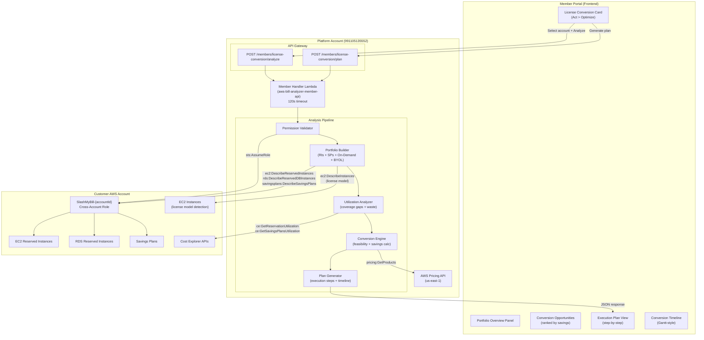
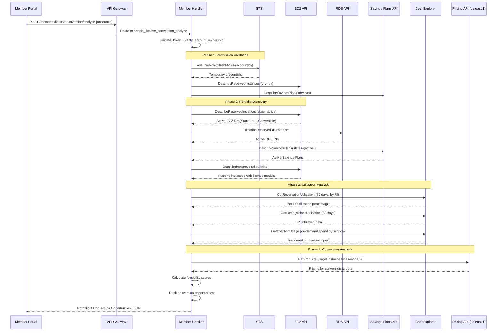
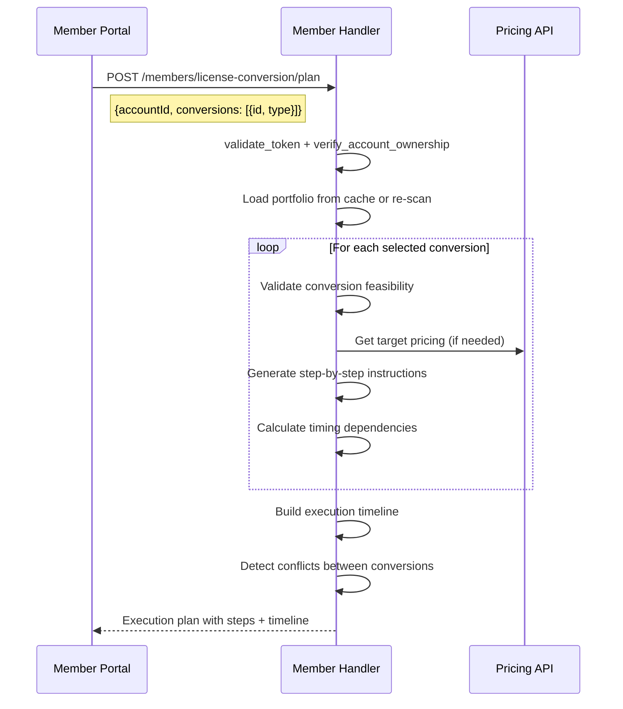

# Design Document: License Conversion Optimizer

## Overview

The License Conversion Optimizer is a complementary tool to the existing Windows/SQL Server Licensing Optimizer that provides a broader license conversion workflow across all AWS services. While the existing optimizer focuses on Windows/SQL licensing strategies (BYOL, Optimize CPUs, Dedicated Host), this feature helps members understand when and how to convert between licensing models — including Reserved Instance conversions (Standard ↔ Convertible, RI ↔ Savings Plan), license model changes (License Included ↔ BYOL for any service), and commitment type transitions (On-Demand → RI, RI → Savings Plan, expiring RI renewal vs. SP migration).

The system analyzes a member's current licensing portfolio across EC2, RDS, ElastiCache, OpenSearch, and Redshift, identifies conversion opportunities based on utilization patterns, pricing differentials, and commitment expiration timelines, then generates a prioritized conversion plan with step-by-step execution guidance. It operates via two new API routes on the Member Handler Lambda using the existing cross-account STS AssumeRole pattern.

### Key Design Decisions

1. **Portfolio-first approach**: Rather than analyzing individual instances, the optimizer builds a complete licensing portfolio view first — all active RIs, Savings Plans, on-demand instances, and BYOL deployments. This enables cross-service optimization that single-instance analysis misses.

2. **Conversion feasibility scoring**: Each conversion opportunity gets a feasibility score (0–100) based on: remaining term value, utilization rate, pricing differential, and execution complexity. This prevents recommending conversions that are technically possible but financially unwise.

3. **Two-endpoint design**: `POST /members/license-conversion/analyze` performs the full portfolio analysis and generates conversion opportunities. `POST /members/license-conversion/plan` generates a detailed execution plan for selected conversions with step-by-step instructions.

4. **Complementary to existing tools**: This feature does NOT duplicate the Windows/SQL Licensing Optimizer's instance-level analysis. Instead, it focuses on commitment-level conversions (RI exchanges, SP migrations) and cross-service license model changes. It references the existing optimizer for Windows/SQL-specific recommendations.

5. **RI exchange rule awareness**: AWS RI exchanges have specific rules (equal or greater value, same instance family for Standard, any family for Convertible). The optimizer encodes these rules and only recommends feasible exchanges.

6. **Savings Plan migration calculator**: For members with expiring RIs, the optimizer calculates whether migrating to Savings Plans would provide better coverage and flexibility, factoring in the member's actual usage patterns.

## Architecture



## Sequence Diagrams

### Main Analysis Flow



### Execution Plan Generation




## Components and Interfaces

### Component 1: Portfolio Builder

**Purpose**: Discovers all active licensing commitments (RIs, Savings Plans) and on-demand instances across the account, building a unified portfolio view.

**Interface**:

```python
def _build_licensing_portfolio(cross_account_session, account_id: str) -> dict:
    """
    Build complete licensing portfolio for an account.
    
    Returns:
        {
            "ec2ReservedInstances": [...],
            "rdsReservedInstances": [...],
            "savingsPlans": [...],
            "onDemandInstances": [...],
            "byolInstances": [...],
            "summary": {
                "totalCommitments": int,
                "totalMonthlyCommitmentCost": float,
                "totalOnDemandSpend": float,
                "coveragePercentage": float,
                "serviceBreakdown": {...}
            }
        }
    """
```

**Responsibilities**:
- Query EC2 DescribeReservedInstances for all active/payment-pending RIs
- Query RDS DescribeReservedDBInstances for active RDS RIs
- Query DescribeSavingsPlans for active Savings Plans
- Query EC2 DescribeInstances to detect license models (LI vs BYOL)
- Classify each commitment by type, family, term, payment option
- Calculate total monthly commitment cost and on-demand spend
- Identify coverage gaps (on-demand instances without RI/SP coverage)

### Component 2: Conversion Engine

**Purpose**: Analyzes the portfolio to identify conversion opportunities, calculates feasibility scores, and estimates savings for each conversion path.

**Interface**:

```python
def _analyze_conversions(portfolio: dict, utilization: dict, pricing_cache: dict) -> list:
    """
    Identify and score all viable conversion opportunities.
    
    Returns list of conversion opportunities:
        [
            {
                "id": "conv-uuid",
                "type": "ri_to_sp" | "ri_exchange" | "license_model_change" | 
                        "ri_renewal" | "on_demand_to_committed",
                "source": {...},  # current commitment/instance details
                "target": {...},  # proposed conversion target
                "feasibilityScore": int (0-100),
                "estimatedMonthlySavings": float,
                "estimatedAnnualSavings": float,
                "savingsPercentage": float,
                "complexity": "low" | "medium" | "high",
                "timing": "immediate" | "at_expiry" | "scheduled",
                "risks": [...],
                "prerequisites": [...]
            }
        ]
    """
```

**Responsibilities**:
- Identify underutilized RIs eligible for exchange
- Detect expiring RIs that should migrate to Savings Plans
- Find on-demand instances that would benefit from commitments
- Calculate RI exchange feasibility (value rules, family constraints)
- Score each opportunity by savings potential, risk, and complexity
- Detect license model change opportunities (LI → BYOL where SA exists)
- Cross-reference with Committed Discount Analyzer to avoid duplicate recommendations

### Component 3: Feasibility Scorer

**Purpose**: Calculates a 0–100 feasibility score for each conversion opportunity based on multiple weighted factors.

**Interface**:

```python
def _calculate_feasibility_score(conversion: dict, portfolio: dict, utilization: dict) -> int:
    """
    Score a conversion opportunity from 0 (infeasible) to 100 (highly recommended).
    
    Scoring weights:
        - Savings potential: 35%
        - Utilization improvement: 25%
        - Execution complexity: 20%
        - Risk level: 20%
    
    Returns: int in range [0, 100]
    """
```

**Responsibilities**:
- Calculate savings potential as percentage of current cost
- Assess utilization improvement (will the new commitment be better utilized?)
- Evaluate execution complexity (single API call vs. multi-step process)
- Assess risk (lock-in period, flexibility loss, coverage gaps during transition)
- Apply penalty for conversions that reduce flexibility
- Apply bonus for conversions that consolidate fragmented commitments

### Component 4: Plan Generator

**Purpose**: Generates detailed execution plans with step-by-step instructions, timing dependencies, and conflict detection for selected conversions.

**Interface**:

```python
def _generate_execution_plan(selected_conversions: list, portfolio: dict) -> dict:
    """
    Generate a detailed execution plan for selected conversions.
    
    Returns:
        {
            "planId": "plan-uuid",
            "generatedAt": "ISO-8601",
            "totalEstimatedSavings": float,
            "executionWindow": {"start": "date", "end": "date"},
            "steps": [
                {
                    "stepNumber": int,
                    "conversionId": str,
                    "action": str,
                    "description": str,
                    "instructions": [str],
                    "awsConsoleLink": str,
                    "estimatedDuration": str,
                    "dependsOn": [int],
                    "warnings": [str]
                }
            ],
            "conflicts": [...],
            "timeline": [...]
        }
    """
```

**Responsibilities**:
- Order conversions by dependency (some must happen before others)
- Generate AWS Console deep links for each step
- Detect conflicts (e.g., two conversions targeting the same RI)
- Calculate execution timeline with parallel and sequential steps
- Include rollback guidance for reversible conversions
- Add warnings for irreversible actions (Standard RI modifications)

### Component 5: License Conversion Frontend UI

**Purpose**: New wizard card in Act > Optimize providing portfolio visualization, opportunity browsing, and plan execution guidance.

**Responsibilities**:
- Add "🔄 License Conversion" card to Act > Optimize section
- Display portfolio summary with commitment breakdown by service
- Render conversion opportunities as sortable/filterable cards
- Show feasibility scores with color-coded indicators (green/yellow/red)
- Display execution plan as a step-by-step checklist with progress tracking
- Render timeline as a Gantt-style visualization
- Cache analysis results in `sessionStorage` keyed by account ID
- Link to existing Windows/SQL Licensing Optimizer for instance-level recommendations

## Data Models

### Portfolio Item (EC2 Reserved Instance)

```python
@dataclass
class EC2ReservedInstance:
    ri_id: str                    # ri-0abc123
    instance_type: str            # m5.xlarge
    instance_family: str          # m5
    offering_class: str           # standard | convertible
    scope: str                    # Region | Availability Zone
    availability_zone: str | None
    tenancy: str                  # default | dedicated
    platform: str                 # Linux/UNIX | Windows | Windows with SQL Standard
    instance_count: int
    state: str                    # active | payment-pending | retired
    start_date: str               # ISO-8601
    end_date: str                 # ISO-8601
    duration_seconds: int
    term_remaining_days: int
    offering_type: str            # No Upfront | Partial Upfront | All Upfront
    fixed_price: float            # upfront cost paid
    recurring_hourly: float       # hourly recurring charge
    monthly_cost: float           # calculated: recurring_hourly * 730
    utilization_pct: float        # from Cost Explorer (0-100)
    is_underutilized: bool        # utilization < 80%
    exchange_eligible: bool       # True for Convertible, False for Standard
    days_until_expiry: int
    expiry_urgency: str           # active | expiring_soon (<60d) | expiring (<30d)
```

### Portfolio Item (Savings Plan)

```python
@dataclass
class SavingsPlanItem:
    sp_id: str                    # sp-0abc123
    sp_arn: str
    plan_type: str                # ComputeSavingsPlans | EC2InstanceSavingsPlans | SageMakerSavingsPlans
    payment_option: str           # No Upfront | Partial Upfront | All Upfront
    term_in_years: int            # 1 | 3
    hourly_commitment: float
    monthly_cost: float           # hourly_commitment * 730
    state: str                    # active | queued | expired
    start_date: str
    end_date: str
    days_until_expiry: int
    utilization_pct: float
    is_underutilized: bool
    covered_services: list[str]   # services benefiting from this SP
    instance_family: str | None   # for EC2 Instance SP only
    region: str | None            # for EC2 Instance SP only
```

### Conversion Opportunity

```python
@dataclass
class ConversionOpportunity:
    id: str                       # conv-uuid
    type: str                     # ri_to_sp | ri_exchange | license_model_change | 
                                  # ri_renewal | on_demand_to_committed | sp_upgrade
    source_id: str                # ID of the source commitment/instance
    source_type: str              # ec2_ri | rds_ri | savings_plan | on_demand_instance
    source_description: str       # human-readable description
    target_description: str       # what it converts to
    feasibility_score: int        # 0-100
    estimated_monthly_savings: float
    estimated_annual_savings: float
    savings_percentage: float
    complexity: str               # low | medium | high
    timing: str                   # immediate | at_expiry | scheduled
    timing_date: str | None       # when to execute (ISO-8601)
    risks: list[str]
    prerequisites: list[str]
    conversion_rules: dict        # AWS-specific rules that apply
    is_reversible: bool
```

### Validation Rules

- `accountId` must be exactly 12 digits and owned by the authenticated member
- `feasibilityScore` must be in range [0, 100]
- `utilization_pct` must be in range [0, 100]
- `estimatedMonthlySavings` must be >= 0 (no negative savings recommendations)
- `savingsPercentage` must be in range [0, 100]
- `days_until_expiry` must be >= 0
- `term_remaining_days` must be >= 0
- RI exchange value: target value must be >= source remaining value
- Conversion plan steps must have valid dependency ordering (no circular deps)
- Selected conversions must not conflict (same source commitment in multiple conversions)


## API Contract

### Endpoint: `POST /members/license-conversion/analyze`

**Request:**
```json
{
  "accountId": "123456789012"
}
```

**Response:**
```json
{
  "success": true,
  "analyzedAt": "2025-07-15T10:30:00Z",
  "accountId": "123456789012",
  "portfolio": {
    "ec2ReservedInstances": [
      {
        "riId": "ri-0abc123",
        "instanceType": "m5.xlarge",
        "instanceFamily": "m5",
        "offeringClass": "convertible",
        "platform": "Linux/UNIX",
        "instanceCount": 3,
        "offeringType": "Partial Upfront",
        "monthlyRecurringCost": 145.26,
        "utilizationPct": 62.3,
        "isUnderutilized": true,
        "daysUntilExpiry": 45,
        "expiryUrgency": "expiring_soon",
        "exchangeEligible": true
      }
    ],
    "rdsReservedInstances": [
      {
        "riId": "ri-rds-xyz789",
        "dbInstanceClass": "db.r5.large",
        "engine": "postgresql",
        "multiAz": false,
        "instanceCount": 1,
        "offeringType": "All Upfront",
        "monthlyRecurringCost": 0.00,
        "utilizationPct": 95.0,
        "isUnderutilized": false,
        "daysUntilExpiry": 180,
        "expiryUrgency": "active"
      }
    ],
    "savingsPlans": [
      {
        "spId": "sp-0def456",
        "planType": "ComputeSavingsPlans",
        "hourlyCommitment": 5.50,
        "monthlyCost": 4015.00,
        "paymentOption": "No Upfront",
        "termInYears": 1,
        "utilizationPct": 88.5,
        "isUnderutilized": false,
        "daysUntilExpiry": 220,
        "coveredServices": ["EC2", "Lambda", "Fargate"]
      }
    ],
    "onDemandInstances": [
      {
        "instanceId": "i-0ghi789",
        "instanceType": "c5.2xlarge",
        "platform": "Linux/UNIX",
        "licenseModel": "License Included",
        "monthlyOnDemandCost": 248.20,
        "runningHoursLast30d": 720,
        "isFullTime": true,
        "hasCoverage": false
      }
    ],
    "summary": {
      "totalCommitments": 5,
      "totalMonthlyCommitmentCost": 4890.00,
      "totalOnDemandSpend": 1240.00,
      "overallCoveragePercentage": 79.8,
      "serviceBreakdown": {
        "EC2": {"committed": 3200.00, "onDemand": 890.00, "coverage": 78.2},
        "RDS": {"committed": 1200.00, "onDemand": 150.00, "coverage": 88.9},
        "Lambda": {"committed": 490.00, "onDemand": 200.00, "coverage": 71.0}
      }
    }
  },
  "conversionOpportunities": [
    {
      "id": "conv-001",
      "type": "ri_exchange",
      "sourceDescription": "3x m5.xlarge Convertible RI (62% utilized, expires in 45 days)",
      "targetDescription": "Exchange to 2x m5.2xlarge Convertible RI (better match for workload)",
      "feasibilityScore": 85,
      "estimatedMonthlySavings": 120.00,
      "estimatedAnnualSavings": 1440.00,
      "savingsPercentage": 27.5,
      "complexity": "low",
      "timing": "immediate",
      "risks": ["New RI locks in for remaining term (45 days)"],
      "prerequisites": ["Convertible RI exchange requires equal or greater value"]
    },
    {
      "id": "conv-002",
      "type": "ri_to_sp",
      "sourceDescription": "3x m5.xlarge Convertible RI expiring in 45 days",
      "targetDescription": "Migrate to Compute Savings Plan ($2.10/hr, 1-year No Upfront)",
      "feasibilityScore": 92,
      "estimatedMonthlySavings": 85.00,
      "estimatedAnnualSavings": 1020.00,
      "savingsPercentage": 19.5,
      "complexity": "low",
      "timing": "at_expiry",
      "timingDate": "2025-08-29",
      "risks": ["Coverage gap if SP not purchased before RI expires"],
      "prerequisites": ["Purchase SP 1-2 days before RI expiration"]
    },
    {
      "id": "conv-003",
      "type": "on_demand_to_committed",
      "sourceDescription": "c5.2xlarge running 24/7 on-demand ($248/mo)",
      "targetDescription": "Purchase Compute SP or EC2 RI for c5.2xlarge",
      "feasibilityScore": 95,
      "estimatedMonthlySavings": 89.00,
      "estimatedAnnualSavings": 1068.00,
      "savingsPercentage": 35.9,
      "complexity": "low",
      "timing": "immediate",
      "risks": ["1-year commitment lock-in"],
      "prerequisites": ["Confirm instance will run for at least 12 months"]
    },
    {
      "id": "conv-004",
      "type": "license_model_change",
      "sourceDescription": "Windows EC2 instances using License Included",
      "targetDescription": "Convert to BYOL (requires Software Assurance)",
      "feasibilityScore": 70,
      "estimatedMonthlySavings": 340.00,
      "estimatedAnnualSavings": 4080.00,
      "savingsPercentage": 42.0,
      "complexity": "high",
      "timing": "scheduled",
      "risks": ["Requires active Software Assurance", "Instance stop/start required"],
      "prerequisites": ["Verify Software Assurance coverage", "Schedule maintenance window"],
      "crossReference": "See Windows/SQL Licensing Optimizer for detailed instance analysis"
    }
  ],
  "totalPotentialSavings": {
    "monthly": 634.00,
    "annual": 7608.00,
    "percentageOfCurrentSpend": 10.3
  }
}
```

### Endpoint: `POST /members/license-conversion/plan`

**Request:**
```json
{
  "accountId": "123456789012",
  "selectedConversions": ["conv-002", "conv-003"]
}
```

**Response:**
```json
{
  "success": true,
  "planId": "plan-abc123",
  "generatedAt": "2025-07-15T10:35:00Z",
  "totalEstimatedSavings": {
    "monthly": 174.00,
    "annual": 2088.00
  },
  "executionWindow": {
    "start": "2025-07-16",
    "end": "2025-08-30"
  },
  "steps": [
    {
      "stepNumber": 1,
      "conversionId": "conv-003",
      "action": "Purchase Compute Savings Plan",
      "description": "Purchase a Compute Savings Plan to cover the c5.2xlarge instance currently running on-demand.",
      "instructions": [
        "Navigate to AWS Cost Management > Savings Plans > Purchase",
        "Select 'Compute Savings Plans' for maximum flexibility",
        "Set hourly commitment to $0.34 (covers c5.2xlarge in us-east-1)",
        "Choose '1 Year' term with 'No Upfront' payment",
        "Review and confirm purchase"
      ],
      "awsConsoleLink": "https://console.aws.amazon.com/cost-management/home#/savings-plans/purchase",
      "estimatedDuration": "5 minutes",
      "dependsOn": [],
      "warnings": ["Savings Plan activates immediately — ensure instance will run for 12 months"],
      "savingsOnCompletion": {"monthly": 89.00}
    },
    {
      "stepNumber": 2,
      "conversionId": "conv-002",
      "action": "Purchase replacement Savings Plan before RI expiry",
      "description": "Purchase a Compute Savings Plan to replace the expiring m5.xlarge Convertible RI. Execute 1-2 days before expiration to avoid coverage gap.",
      "instructions": [
        "Wait until 2025-08-27 (2 days before RI expiry)",
        "Navigate to AWS Cost Management > Savings Plans > Purchase",
        "Select 'Compute Savings Plans'",
        "Set hourly commitment to $2.10 (covers equivalent of 3x m5.xlarge)",
        "Choose '1 Year' term with 'No Upfront' payment",
        "Review and confirm purchase"
      ],
      "awsConsoleLink": "https://console.aws.amazon.com/cost-management/home#/savings-plans/purchase",
      "estimatedDuration": "5 minutes",
      "scheduledDate": "2025-08-27",
      "dependsOn": [],
      "warnings": [
        "Do NOT purchase before 2025-08-27 — you'd pay double during overlap",
        "SP starts immediately, RI expires 2025-08-29 — 2 days of overlap is acceptable"
      ],
      "savingsOnCompletion": {"monthly": 85.00}
    }
  ],
  "conflicts": [],
  "timeline": [
    {"date": "2025-07-16", "action": "Purchase SP for c5.2xlarge", "step": 1},
    {"date": "2025-08-27", "action": "Purchase replacement SP for m5.xlarge RI", "step": 2},
    {"date": "2025-08-29", "action": "m5.xlarge RI expires (covered by new SP)", "step": null}
  ]
}
```


## Key Functions with Formal Specifications

### Function 1: build_licensing_portfolio()

```python
def build_licensing_portfolio(cross_account_session, account_id: str) -> dict:
    """Build complete licensing portfolio for an AWS account."""
```

**Preconditions:**
- `cross_account_session` is a valid boto3 session with assumed role credentials
- `account_id` is a 12-digit string matching the assumed role's account
- The assumed role has permissions: `ec2:DescribeReservedInstances`, `ec2:DescribeInstances`, `rds:DescribeReservedDBInstances`, `savingsplans:DescribeSavingsPlans`

**Postconditions:**
- Returns a dict containing `ec2ReservedInstances`, `rdsReservedInstances`, `savingsPlans`, `onDemandInstances`, `byolInstances`, and `summary`
- All monetary values are in USD, rounded to 2 decimal places
- `summary.totalMonthlyCommitmentCost` equals the sum of all individual commitment monthly costs
- `summary.overallCoveragePercentage` is in range [0, 100]
- Each RI/SP item includes `daysUntilExpiry` calculated from current date
- No duplicate items across categories (an instance appears in exactly one category)

**Loop Invariants:**
- For pagination loops: all previously fetched items remain in the result set
- Running total of monthly costs equals sum of individual items processed so far

### Function 2: calculate_feasibility_score()

```python
def calculate_feasibility_score(
    conversion_type: str,
    savings_percentage: float,
    utilization_current: float,
    utilization_projected: float,
    complexity: str,
    remaining_term_days: int,
    is_reversible: bool
) -> int:
    """Calculate feasibility score for a conversion opportunity."""
```

**Preconditions:**
- `conversion_type` is one of: `ri_to_sp`, `ri_exchange`, `license_model_change`, `ri_renewal`, `on_demand_to_committed`, `sp_upgrade`
- `savings_percentage` is in range [0, 100]
- `utilization_current` is in range [0, 100]
- `utilization_projected` is in range [0, 100]
- `complexity` is one of: `low`, `medium`, `high`
- `remaining_term_days` is >= 0

**Postconditions:**
- Returns an integer in range [0, 100]
- Score increases monotonically with `savings_percentage` (all else equal)
- Score increases when `utilization_projected` > `utilization_current`
- Score decreases with higher `complexity` (all else equal)
- Score of 0 indicates infeasible conversion (e.g., Standard RI exchange attempt)
- Reversible conversions score >= irreversible conversions (all else equal)

**Loop Invariants:** N/A (no loops)

### Function 3: identify_ri_exchange_opportunities()

```python
def identify_ri_exchange_opportunities(
    convertible_ris: list,
    utilization_data: dict,
    pricing_cache: dict
) -> list:
    """Identify viable RI exchange opportunities for underutilized Convertible RIs."""
```

**Preconditions:**
- `convertible_ris` contains only RIs with `offeringClass == 'convertible'`
- Each RI in the list has valid `instanceType`, `instanceCount`, and `recurringHourly` fields
- `utilization_data` maps RI IDs to utilization percentages (0-100)
- `pricing_cache` contains hourly rates for candidate target instance types

**Postconditions:**
- Returns a list of ConversionOpportunity objects
- Each opportunity has `type == 'ri_exchange'`
- Target RI value >= source RI remaining value (AWS exchange rule)
- Only RIs with utilization < 80% are considered for exchange
- Each opportunity includes the specific target instance type and count
- `estimatedMonthlySavings` >= 0 for all returned opportunities

**Loop Invariants:**
- For each RI processed: exchange value constraint (target >= source) holds
- All previously validated exchanges remain in the result set

### Function 4: calculate_ri_to_sp_migration()

```python
def calculate_ri_to_sp_migration(
    expiring_ris: list,
    on_demand_usage: dict,
    sp_pricing: dict
) -> list:
    """Calculate savings from migrating expiring RIs to Savings Plans."""
```

**Preconditions:**
- `expiring_ris` contains RIs with `daysUntilExpiry` <= 90
- `on_demand_usage` contains hourly usage data for the services covered by these RIs
- `sp_pricing` contains Savings Plan rates for Compute SP and EC2 Instance SP

**Postconditions:**
- Returns a list of ConversionOpportunity objects with `type == 'ri_to_sp'`
- Each opportunity has `timing == 'at_expiry'` with a specific `timingDate`
- `timingDate` is 1-2 days before the RI expiration date
- SP hourly commitment is calculated to cover the equivalent workload
- Savings are calculated as: (current RI effective rate) - (SP effective rate)
- Only returns opportunities where SP provides equal or better coverage at lower cost

**Loop Invariants:**
- For each expiring RI: the proposed SP commitment covers at least the same workload hours
- Cumulative SP commitment does not exceed the member's total on-demand spend

### Function 5: detect_on_demand_commitment_candidates()

```python
def detect_on_demand_commitment_candidates(
    on_demand_instances: list,
    running_hours: dict,
    sp_pricing: dict,
    ri_pricing: dict
) -> list:
    """Identify on-demand instances that would benefit from committed pricing."""
```

**Preconditions:**
- `on_demand_instances` contains instances with `hasCoverage == False`
- `running_hours` maps instance IDs to hours run in the last 30 days
- `sp_pricing` and `ri_pricing` contain rates for candidate commitment types
- All pricing is for the same region as the instances

**Postconditions:**
- Only instances running >= 680 hours/month (93% uptime) are recommended for commitment
- Each opportunity includes both SP and RI options with comparative savings
- `estimatedMonthlySavings` is calculated as: on_demand_cost - committed_cost
- Opportunities are sorted by `estimatedMonthlySavings` descending
- No instance appears in multiple opportunities

**Loop Invariants:**
- All previously identified candidates have running_hours >= 680
- Running savings total equals sum of individual opportunity savings

## Algorithmic Pseudocode

### Main Analysis Algorithm

```python
def handle_license_conversion_analyze(event: dict) -> dict:
    """
    Main analysis endpoint handler.
    
    ALGORITHM:
    1. Validate authentication and account ownership
    2. Assume cross-account role
    3. Pre-validate required permissions
    4. Build licensing portfolio (parallel API calls)
    5. Retrieve utilization data from Cost Explorer
    6. Identify conversion opportunities (5 types)
    7. Score and rank opportunities
    8. Calculate total potential savings
    9. Return portfolio + opportunities
    """
    # Phase 1: Auth + Permissions
    member = validate_token(event)
    if 'statusCode' in member:
        return member
    
    body = json.loads(event.get('body', '{}'))
    account_id = body.get('accountId', '')
    
    ownership = _verify_account_ownership(member['sub'], [account_id])
    if ownership is not True:
        return ownership
    
    # Phase 2: Assume role + permission check
    session = _assume_cross_account_role(account_id, member['sub'])
    if not session:
        return create_error_response(403, 'ConnectionFailed', 
            'Cannot access account. Verify cross-account role is deployed.')
    
    missing_perms = _validate_conversion_permissions(session)
    if missing_perms:
        return create_error_response(403, 'InsufficientPermissions',
            f'Missing permissions: {", ".join(missing_perms)}')
    
    # Phase 3: Build portfolio (parallel)
    portfolio = build_licensing_portfolio(session, account_id)
    
    # Phase 4: Utilization analysis
    utilization = _get_utilization_data(session, portfolio)
    
    # Phase 5: Pricing lookup
    pricing_cache = _build_pricing_cache(portfolio, session)
    
    # Phase 6: Identify conversions (all 5 types in parallel)
    with concurrent.futures.ThreadPoolExecutor(max_workers=5) as executor:
        futures = {
            executor.submit(_identify_ri_exchanges, portfolio, utilization, pricing_cache): 'ri_exchange',
            executor.submit(_identify_ri_to_sp, portfolio, utilization, pricing_cache): 'ri_to_sp',
            executor.submit(_identify_license_model_changes, portfolio, pricing_cache): 'license_model_change',
            executor.submit(_identify_on_demand_candidates, portfolio, pricing_cache): 'on_demand_to_committed',
            executor.submit(_identify_sp_upgrades, portfolio, utilization, pricing_cache): 'sp_upgrade',
        }
        
        opportunities = []
        for future in concurrent.futures.as_completed(futures):
            opportunities.extend(future.result())
    
    # Phase 7: Score and rank
    for opp in opportunities:
        opp['feasibilityScore'] = calculate_feasibility_score(
            opp['type'], opp['savingsPercentage'],
            opp.get('utilizationCurrent', 0), opp.get('utilizationProjected', 0),
            opp['complexity'], opp.get('remainingTermDays', 0),
            opp.get('isReversible', False)
        )
    
    opportunities.sort(key=lambda x: x['feasibilityScore'], reverse=True)
    
    # Phase 8: Total savings (best non-conflicting set)
    total_savings = _calculate_non_conflicting_savings(opportunities)
    
    return create_response(200, {
        'success': True,
        'analyzedAt': datetime.now(timezone.utc).isoformat(),
        'accountId': account_id,
        'portfolio': portfolio,
        'conversionOpportunities': opportunities,
        'totalPotentialSavings': total_savings
    })
```

### Feasibility Scoring Algorithm

```python
def calculate_feasibility_score(
    conversion_type: str,
    savings_percentage: float,
    utilization_current: float,
    utilization_projected: float,
    complexity: str,
    remaining_term_days: int,
    is_reversible: bool
) -> int:
    """
    ALGORITHM: Weighted multi-factor scoring
    
    Weights:
        savings_potential = 35%
        utilization_improvement = 25%
        complexity_factor = 20%
        risk_factor = 20%
    
    Each factor produces a score in [0, 100], then weighted sum gives final score.
    """
    # Factor 1: Savings potential (35%)
    # Linear scale: 0% savings = 0, 50%+ savings = 100
    savings_score = min(savings_percentage * 2, 100)
    
    # Factor 2: Utilization improvement (25%)
    # Positive delta = good, negative delta = bad
    util_delta = utilization_projected - utilization_current
    if util_delta >= 20:
        util_score = 100
    elif util_delta >= 0:
        util_score = 50 + (util_delta * 2.5)
    else:
        util_score = max(0, 50 + (util_delta * 2.5))
    
    # Factor 3: Complexity (20%)
    complexity_scores = {'low': 100, 'medium': 60, 'high': 30}
    complexity_score = complexity_scores.get(complexity, 50)
    
    # Factor 4: Risk (20%)
    risk_score = 80  # base
    if not is_reversible:
        risk_score -= 20
    if remaining_term_days > 365:
        risk_score -= 15  # long lock-in
    elif remaining_term_days < 30:
        risk_score += 10  # short remaining = low risk
    
    risk_score = max(0, min(100, risk_score))
    
    # Weighted sum
    final = (
        savings_score * 0.35 +
        util_score * 0.25 +
        complexity_score * 0.20 +
        risk_score * 0.20
    )
    
    return max(0, min(100, round(final)))
```

### RI Exchange Value Calculation

```python
def _calculate_ri_exchange_value(ri: dict, remaining_term_days: int) -> float:
    """
    Calculate the remaining value of a Convertible RI for exchange purposes.
    
    AWS Rule: When exchanging Convertible RIs, the target RI must have
    an equal or greater value than the source RI.
    
    Value = (remaining_hours * hourly_rate) + remaining_upfront_amortization
    
    PRECONDITION: ri['offeringClass'] == 'convertible'
    POSTCONDITION: returned value >= 0
    """
    remaining_hours = remaining_term_days * 24
    
    # Recurring portion
    recurring_value = remaining_hours * ri['recurringHourly'] * ri['instanceCount']
    
    # Upfront amortization (if Partial or All Upfront)
    total_term_hours = ri['durationSeconds'] / 3600
    elapsed_hours = total_term_hours - remaining_hours
    if total_term_hours > 0:
        remaining_upfront = ri['fixedPrice'] * (remaining_hours / total_term_hours)
    else:
        remaining_upfront = 0
    
    return recurring_value + remaining_upfront
```

## Example Usage

```python
# Example 1: Analyze license conversion opportunities
import requests

response = requests.post(
    'https://api.slashmycloudbill.com/members/license-conversion/analyze',
    headers={'Authorization': f'Bearer {token}'},
    json={'accountId': '123456789012'}
)

result = response.json()
print(f"Portfolio: {result['portfolio']['summary']['totalCommitments']} commitments")
print(f"Coverage: {result['portfolio']['summary']['overallCoveragePercentage']}%")
print(f"Opportunities found: {len(result['conversionOpportunities'])}")
print(f"Total potential savings: ${result['totalPotentialSavings']['annual']}/year")

# Example 2: Generate execution plan for selected conversions
top_opportunities = [
    opp['id'] for opp in result['conversionOpportunities']
    if opp['feasibilityScore'] >= 80
]

plan_response = requests.post(
    'https://api.slashmycloudbill.com/members/license-conversion/plan',
    headers={'Authorization': f'Bearer {token}'},
    json={
        'accountId': '123456789012',
        'selectedConversions': top_opportunities
    }
)

plan = plan_response.json()
print(f"\nExecution Plan ({len(plan['steps'])} steps):")
for step in plan['steps']:
    print(f"  Step {step['stepNumber']}: {step['action']}")
    print(f"    Saves: ${step['savingsOnCompletion']['monthly']}/mo")
    if step.get('scheduledDate'):
        print(f"    Schedule for: {step['scheduledDate']}")

# Example 3: Feasibility scoring
score = calculate_feasibility_score(
    conversion_type='ri_to_sp',
    savings_percentage=25.0,
    utilization_current=62.0,
    utilization_projected=90.0,
    complexity='low',
    remaining_term_days=45,
    is_reversible=False
)
print(f"\nFeasibility score: {score}/100")  # Expected: ~85
```


## Correctness Properties

### Property 1: Feasibility score is bounded and monotonic with savings

*For any* conversion opportunity with valid inputs (savings_percentage in [0,100], utilization values in [0,100], complexity in {low, medium, high}), the feasibility score SHALL be an integer in the range [0, 100]. Furthermore, for two opportunities that differ only in savings_percentage where savings_a > savings_b, the score for opportunity A SHALL be >= the score for opportunity B.

**Validates: Feasibility Scorer component**

### Property 2: RI exchange value constraint

*For any* Convertible RI exchange opportunity returned by the system, the target RI's total value (remaining_hours × target_hourly_rate × target_count) SHALL be greater than or equal to the source RI's remaining value (remaining_hours × source_hourly_rate × source_count + remaining_upfront_amortization). Opportunities violating this constraint SHALL NOT appear in the results.

**Validates: RI Exchange identification**

### Property 3: Portfolio monetary totals are consistent

*For any* portfolio returned by the analyze endpoint, the `summary.totalMonthlyCommitmentCost` SHALL equal the sum of `monthlyRecurringCost` (or `monthlyCost`) across all items in `ec2ReservedInstances`, `rdsReservedInstances`, and `savingsPlans`. The difference SHALL be less than $0.01 (rounding tolerance).

**Validates: Portfolio Builder component**

### Property 4: No duplicate recommendations across conversion types

*For any* source commitment (identified by its ID), at most ONE conversion opportunity of each type SHALL be returned. A single RI may appear as source in an `ri_exchange` opportunity AND an `ri_to_sp` opportunity (different types), but SHALL NOT appear in two `ri_exchange` opportunities.

**Validates: Conversion Engine deduplication**

### Property 5: Timing constraints for RI-to-SP migrations

*For any* `ri_to_sp` conversion opportunity, the `timingDate` SHALL be between 1 and 3 days before the source RI's expiration date. The `timing` field SHALL be `at_expiry`. If the RI expires in less than 3 days from the analysis date, the `timing` SHALL be `immediate` instead.

**Validates: RI-to-SP migration timing logic**

### Property 6: On-demand commitment candidates meet uptime threshold

*For any* `on_demand_to_committed` conversion opportunity, the source instance SHALL have run for at least 680 hours in the last 30 days (93% uptime). Instances with fewer running hours SHALL NOT be recommended for committed pricing.

**Validates: On-demand candidate detection**

### Property 7: Execution plan step ordering respects dependencies

*For any* execution plan with N steps, if step B has `dependsOn: [A]`, then step A's `stepNumber` SHALL be less than step B's `stepNumber`. There SHALL be no circular dependencies (the dependency graph is a DAG). Steps with no dependencies MAY execute in parallel.

**Validates: Plan Generator ordering**

### Property 8: Conflict detection prevents double-conversion

*For any* execution plan generated from a set of selected conversions, if two conversions reference the same source commitment ID, the plan SHALL include a conflict entry identifying both conversions and SHALL NOT include steps for both — only the higher-scoring conversion's steps SHALL be included.

**Validates: Plan Generator conflict detection**

### Property 9: Savings calculations are non-negative

*For any* conversion opportunity returned by the system, `estimatedMonthlySavings` SHALL be >= 0 and `estimatedAnnualSavings` SHALL equal `estimatedMonthlySavings * 12`. The `savingsPercentage` SHALL be in range [0, 100] and SHALL equal `(estimatedMonthlySavings / currentMonthlyCost) * 100` within 0.1% tolerance.

**Validates: All savings calculations**

### Property 10: Coverage percentage bounds

*For any* portfolio summary, `overallCoveragePercentage` SHALL be in range [0, 100]. It SHALL equal `totalMonthlyCommitmentCost / (totalMonthlyCommitmentCost + totalOnDemandSpend) * 100` when total spend > 0. When total spend is 0, coverage SHALL be 0.

**Validates: Portfolio summary calculations**

### Property 11: Expiry urgency classification

*For any* commitment item in the portfolio, the `expiryUrgency` field SHALL be: `expiring` if `daysUntilExpiry` < 30, `expiring_soon` if 30 <= `daysUntilExpiry` < 60, and `active` if `daysUntilExpiry` >= 60. This classification SHALL be consistent across all portfolio item types.

**Validates: Portfolio Builder urgency classification**

### Property 12: Utilization threshold for underutilization flag

*For any* commitment item (RI or SP) in the portfolio, `isUnderutilized` SHALL be `True` if and only if `utilizationPct` < 80. Items with `utilizationPct` >= 80 SHALL have `isUnderutilized == False`.

**Validates: Utilization analysis**

## Error Handling

### Error Scenario 1: Cross-Account Role Not Found

**Condition**: STS AssumeRole fails because the `SlashMyBill-{accountId}` role doesn't exist
**Response**: HTTP 403, error code `ConnectionFailed`
**Recovery**: Return message instructing member to deploy the CloudFormation template. Include template download link.

### Error Scenario 2: Insufficient Permissions

**Condition**: Role exists but lacks required permissions (ec2:DescribeReservedInstances, savingsplans:DescribeSavingsPlans, ce:GetReservationUtilization, etc.)
**Response**: HTTP 403, error code `InsufficientPermissions`
**Recovery**: Return list of missing permissions and link to update the cross-account role template.

### Error Scenario 3: No Commitments Found

**Condition**: Account has no active RIs, Savings Plans, or significant on-demand spend
**Response**: HTTP 200 with empty portfolio and a guidance message
**Recovery**: Return message: "No active commitments or significant on-demand spend found. Consider using the Committed Discount Analyzer to evaluate initial commitment purchases."

### Error Scenario 4: Cost Explorer Data Unavailable

**Condition**: Cost Explorer APIs return no data (new account, CE not activated)
**Response**: HTTP 200 with portfolio data but no utilization metrics
**Recovery**: Proceed with portfolio discovery only. Note: "Cost Explorer data unavailable — utilization analysis requires Cost Explorer to be activated (24-48 hour delay for new accounts)."

### Error Scenario 5: Pricing API Timeout

**Condition**: Pricing API calls exceed 5-second individual timeout
**Response**: HTTP 200 with partial results
**Recovery**: Return portfolio and opportunities that don't require pricing lookups. Note which opportunities have estimated (rather than exact) savings.

### Error Scenario 6: Lambda Timeout Approaching

**Condition**: Execution time exceeds 100 seconds (approaching 120s Lambda timeout)
**Response**: HTTP 200 with partial results
**Recovery**: Return whatever analysis has completed. Include `"partial": true` flag and note: "Analysis timed out. Showing results for {N} of {M} commitments analyzed."

### Error Scenario 7: Invalid Conversion Selection

**Condition**: Member selects a conversion ID that doesn't exist or is no longer valid
**Response**: HTTP 400, error code `InvalidConversion`
**Recovery**: Return message identifying which conversion IDs are invalid and suggest re-running the analysis.

| Error | HTTP Status | Error Code | User Message |
|-------|-------------|------------|-------------|
| Role not found | 403 | ConnectionFailed | "Cannot access account. Verify cross-account role is deployed." |
| Missing permissions | 403 | InsufficientPermissions | "Missing permissions: {list}. Update the cross-account role." |
| No commitments | 200 | — | Portfolio with guidance to use Committed Discount Analyzer |
| CE not activated | 200 | — | Partial results without utilization data |
| Pricing timeout | 200 | — | Partial results with estimated savings |
| Lambda timeout | 200 | — | Partial results with `partial: true` flag |
| Invalid conversion ID | 400 | InvalidConversion | "Conversion {id} not found. Re-run analysis." |
| Account not owned | 403 | Forbidden | "Account does not belong to you." |

## Testing Strategy

### Unit Testing Approach

- Portfolio builder: mock EC2/RDS/SP APIs, verify correct classification and aggregation
- Feasibility scorer: test boundary conditions (0%, 50%, 100% savings; all complexity levels)
- RI exchange calculator: verify value constraint enforcement with known RI parameters
- Plan generator: verify step ordering, conflict detection, and timeline generation
- Error handling: verify graceful degradation for each error scenario

### Property-Based Testing Approach

**Property Test Library**: Hypothesis (Python)

Each correctness property maps to a property-based test with minimum 100 iterations:

| Property | Test Strategy |
|----------|--------------|
| P1: Score bounds + monotonicity | Generate random valid inputs, verify [0,100] range and monotonicity |
| P2: RI exchange value | Generate random RI pairs, verify target >= source value |
| P3: Portfolio totals | Generate random portfolio items, verify sum consistency |
| P4: No duplicate sources | Generate random opportunities, verify uniqueness per type |
| P5: Timing constraints | Generate random expiry dates, verify timingDate placement |
| P6: Uptime threshold | Generate random running hours, verify 680h threshold |
| P7: Step ordering | Generate random dependency graphs, verify topological order |
| P8: Conflict detection | Generate overlapping conversions, verify conflict flagging |
| P9: Savings non-negative | Generate random cost pairs, verify savings >= 0 |
| P10: Coverage bounds | Generate random spend values, verify [0,100] range |
| P11: Expiry urgency | Generate random daysUntilExpiry, verify classification |
| P12: Utilization threshold | Generate random utilization values, verify 80% threshold |

### Integration Testing Approach

- End-to-end test with mocked AWS APIs simulating a realistic portfolio
- Verify the analyze → plan workflow produces consistent results
- Test with edge cases: account with only RIs, only SPs, only on-demand, mixed
- Verify cross-reference with Committed Discount Analyzer doesn't produce conflicts

## Performance Considerations

| Phase | Target Time | Strategy |
|-------|-------------|----------|
| Permission validation | <2s | Single STS call + lightweight test calls |
| Portfolio discovery | <8s | Parallel DescribeReservedInstances + DescribeSavingsPlans + DescribeInstances |
| Utilization retrieval | <5s | Parallel CE calls for RI and SP utilization |
| Pricing lookups | <5s | Cached per instance type, parallel queries |
| Conversion analysis | <3s | In-memory computation with ThreadPoolExecutor |
| Plan generation | <2s | In-memory graph traversal and step ordering |
| **Total** | **<25s** | Well within 120s Lambda timeout |

**Caching strategy**: Frontend caches analysis results in `sessionStorage` keyed by `licenseConversion_{accountId}`. Results include `analyzedAt` timestamp. Cache is invalidated after 1 hour or on manual "Re-analyze" click.

## Security Considerations

- All API calls require valid JWT/Cognito token with member role
- Account ownership verified before any cross-account access
- Cross-account role uses ExternalId = SHA256(memberEmail) to prevent confused deputy
- No write operations performed on customer accounts — analysis is read-only
- Pricing data retrieved from platform account (no cross-account needed)
- Execution plans provide instructions only — no automated purchases or modifications
- Plan IDs are UUIDs, not guessable sequences

## Dependencies

| Dependency | Purpose | Version/Notes |
|------------|---------|---------------|
| boto3 | AWS SDK for Python | Already in Lambda layer |
| concurrent.futures | Parallel API calls | Python stdlib |
| AWS Pricing API | Instance pricing lookups | us-east-1 only |
| AWS Cost Explorer | Utilization data | Requires CE activation in customer account |
| AWS EC2 API | RI and instance discovery | Via cross-account role |
| AWS RDS API | RDS RI discovery | Via cross-account role |
| AWS Savings Plans API | SP discovery | Via cross-account role |
| Committed Discount Analyzer | Cross-reference to avoid duplicate recs | Internal feature |
| Windows/SQL Licensing Optimizer | Cross-reference for license model changes | Internal feature |

## Frontend Design

### Wizard Card (Act > Optimize)

New card alongside existing optimization wizards:

```
┌─────────────────────────────────┐
│  🔄 License Conversion          │
│                                 │
│  Analyze your licensing         │
│  portfolio and find conversion  │
│  opportunities — RI exchanges,  │
│  SP migrations, and model       │
│  changes across all services.   │
│                                 │
│  [Analyze Portfolio ▶]          │
└─────────────────────────────────┘
```

### Portfolio Overview Panel

```
┌─────────────────────────────────────────────────────────────┐
│  License Portfolio Overview                                  │
│  Account: 123456789012                    Analyzed: 2 min ago│
├─────────────────────────────────────────────────────────────┤
│  5 commitments │ 79.8% coverage │ $4,890/mo committed       │
├─────────────────────────────────────────────────────────────┤
│  By Type:                                                    │
│  ████████████████ EC2 RIs: 3 ($2,400/mo)                    │
│  ████████         RDS RIs: 1 ($1,200/mo)                    │
│  ██████████████   Savings Plans: 1 ($4,015/mo)              │
├─────────────────────────────────────────────────────────────┤
│  ⚠️ 1 RI expiring in 45 days │ 1 RI underutilized (62%)    │
│  💡 $1,240/mo on-demand spend could be committed            │
└─────────────────────────────────────────────────────────────┘
```

### Conversion Opportunities Panel

```
┌─────────────────────────────────────────────────────────────┐
│  Conversion Opportunities (4 found)     Total: $634/mo      │
│  Sort: [Score ▼] [Savings] [Complexity]                     │
├─────────────────────────────────────────────────────────────┤
│  ☐ 🟢 95/100 │ On-Demand → Committed │ $89/mo │ Low        │
│    c5.2xlarge running 24/7 → Compute SP ($0.34/hr)          │
│    [View Details]                                            │
├─────────────────────────────────────────────────────────────┤
│  ☐ 🟢 92/100 │ RI → Savings Plan │ $85/mo │ Low            │
│    3x m5.xlarge RI (expires Aug 29) → Compute SP            │
│    ⏰ Schedule for Aug 27                                    │
│    [View Details]                                            │
├─────────────────────────────────────────────────────────────┤
│  ☐ 🟢 85/100 │ RI Exchange │ $120/mo │ Low                  │
│    3x m5.xlarge → 2x m5.2xlarge (better workload match)     │
│    [View Details]                                            │
├─────────────────────────────────────────────────────────────┤
│  ☐ 🟡 70/100 │ License Model Change │ $340/mo │ High        │
│    Windows LI → BYOL (requires Software Assurance)           │
│    → See Windows/SQL Licensing Optimizer                     │
│    [View Details]                                            │
├─────────────────────────────────────────────────────────────┤
│  [Generate Execution Plan for Selected ▶]                    │
└─────────────────────────────────────────────────────────────┘
```

## Cross-Account Role Permissions

The `SlashMyBill-{accountId}` role template needs these permissions for this feature:

```json
{
  "Effect": "Allow",
  "Action": [
    "ec2:DescribeReservedInstances",
    "ec2:DescribeReservedInstancesModifications",
    "ec2:DescribeInstances",
    "rds:DescribeReservedDBInstances",
    "savingsplans:DescribeSavingsPlans",
    "savingsplans:DescribeSavingsPlanRates",
    "ce:GetReservationUtilization",
    "ce:GetReservationCoverage",
    "ce:GetSavingsPlansUtilization",
    "ce:GetSavingsPlansCoverage",
    "ce:GetCostAndUsage"
  ],
  "Resource": "*"
}
```

Most of these overlap with the Committed Discount Analyzer permissions. New additions:
- `ec2:DescribeReservedInstances` (for RI portfolio discovery)
- `ec2:DescribeReservedInstancesModifications` (for exchange history)
- `rds:DescribeReservedDBInstances` (for RDS RI discovery)
- `savingsplans:DescribeSavingsPlans` (for SP portfolio)
- `savingsplans:DescribeSavingsPlanRates` (for SP rate details)

## Files to Modify

| File | Change |
|------|--------|
| `member-handler/lambda_function.py` | Add `handle_license_conversion_analyze()` and `handle_license_conversion_plan()` functions (~350 lines) |
| `members/members.js` | Add License Conversion wizard UI (card + portfolio + opportunities + plan view) |
| `members/members.css` | Add styles for feasibility score badges, timeline, portfolio cards |
| `members/index.html` | Bump `members.js?v=XX` version |
| `.github/workflows/deploy.yml` | Add `POST /members/license-conversion/analyze` and `POST /members/license-conversion/plan` routes |
| `infrastructure/viewmybill-stack.yaml` | Add route resources (optional — CI/CD handles it) |
| `agent-action/agent-instructions.md` | Reference the new wizard in optimization section |
| `members/help.js` | Add help topic for License Conversion |

## API Gateway Routes

Add to the existing member routes:

```yaml
MemberLicenseConversionAnalyzeRoute:
  Type: AWS::ApiGatewayV2::Route
  Properties:
    ApiId: !Ref ViewMyBillApi
    RouteKey: 'POST /members/license-conversion/analyze'
    Target: !Sub 'integrations/${MemberIntegration}'

MemberLicenseConversionPlanRoute:
  Type: AWS::ApiGatewayV2::Route
  Properties:
    ApiId: !Ref ViewMyBillApi
    RouteKey: 'POST /members/license-conversion/plan'
    Target: !Sub 'integrations/${MemberIntegration}'
```
