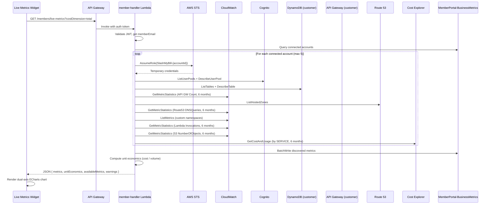

# Design Document — Live Business Metrics

## Overview

This feature replaces the manually-entered Unit Cost Trend widget with a fully automated live metrics system. The backend discovers operational metrics from the customer's AWS account (Cognito, DynamoDB, API Gateway, Route 53, CloudWatch custom, Lambda, S3) via the existing cross-account role, combines them with Cost Explorer service-level cost data, and computes unit economics (cost-per-unit) as a 6-month time-series. The frontend renders a dual-axis ECharts chart with metric/cost-dimension selectors.

### Key Design Decisions

1. **Single Lambda handler** — The new `GET /members/live-metrics` endpoint is added to the existing `member-handler` Lambda rather than creating a new service. This keeps deployment simple (push to main) and reuses the existing auth, STS, and DynamoDB patterns.

2. **On-demand discovery** — Metrics are discovered live on each request rather than via a scheduled job. This avoids additional infrastructure (EventBridge rules, separate Lambda) and ensures data freshness. Results are persisted to DynamoDB so historical data survives even if the AWS account changes.

3. **Parallel per-account, sequential per-source** — For each connected account, we assume the cross-account role once and then query each metric source sequentially. Multiple accounts are processed sequentially to stay within Lambda concurrency limits and avoid STS throttling.

4. **Graceful degradation per source** — Each metric source is wrapped in its own try/except. If Cognito fails, DynamoDB metrics still return. Warnings are collected and returned to the frontend.

5. **Reuse existing table schema** — The `MemberPortal-BusinessMetrics` table already has `memberEmail` (PK) and `metricMonth` (SK). We add a `source` field to distinguish auto-discovered from manual metrics, and use a composite SK format `{metricMonth}#{metricName}` to support multiple metrics per month.

## Architecture



## Components and Interfaces

### Backend Components

#### 1. MetricsDiscoveryService (Python module in member-handler)

A set of functions responsible for discovering metrics from each AWS service source.

```python
def discover_all_metrics(credentials: dict, account_id: str) -> tuple[list[dict], list[str]]:
    """
    Run all metric source discoveries for a single account.
    Returns (discovered_metrics, warnings).
    Each metric: {metricName, volume, source, month, description, accountId}
    """

def _discover_cognito_metrics(credentials: dict) -> list[dict]:
    """Discover user counts from Cognito User Pools."""

def _discover_dynamodb_metrics(credentials: dict) -> list[dict]:
    """Discover item counts from DynamoDB tables (up to 20)."""

def _discover_apigateway_metrics(credentials: dict) -> list[dict]:
    """Discover API request counts per API for last 6 months."""

def _discover_route53_metrics(credentials: dict) -> list[dict]:
    """Discover DNS query counts per hosted zone for last 6 months."""

def _discover_cloudwatch_custom_metrics(credentials: dict) -> list[dict]:
    """Discover custom namespace metrics (up to 10 namespaces, 5 metrics each)."""

def _discover_lambda_metrics(credentials: dict) -> list[dict]:
    """Discover Lambda invocation counts per month for last 6 months."""

def _discover_s3_metrics(credentials: dict) -> list[dict]:
    """Discover S3 object counts per bucket for last 6 months."""
```

#### 2. UnitEconomicsEngine (Python module in member-handler)

```python
def compute_unit_economics(
    metrics: list[dict],
    cost_data: dict,
    cost_dimension: str = 'total'
) -> list[dict]:
    """
    Compute cost-per-unit for each metric and month.
    Returns time-series: [{month, metricName, volume, cost, costPerUnit}]
    cost_dimension: 'total' | service name | 'tag:Key=Value'
    """

def fetch_cost_data(
    credentials: dict,
    cost_dimension: str = 'total',
    months: int = 6
) -> dict:
    """
    Fetch cost data from Cost Explorer.
    Returns {month: cost_amount} for the selected dimension.
    """
```

#### 3. LiveMetricsHandler (route handler in member-handler)

```python
def handle_live_metrics(event) -> dict:
    """
    GET /members/live-metrics?costDimension=total&metricName=...
    Orchestrates discovery, persistence, and unit economics computation.
    """
```

### Frontend Components

#### 4. Live Metrics Widget (in members.js)

Replaces the existing `_renderUnitEconomics` function and the `dash-unit-economics` widget definition.

```
Functions:
- _renderLiveMetrics(data)          — Main render function for the widget
- _fetchLiveMetrics(costDimension)  — API call to GET /members/live-metrics
- _buildMetricSelector(metrics)     — Populate metric dropdown
- _buildCostDimensionSelector(dims) — Populate cost dimension dropdown
- _updateLiveMetricsChart(data)     — Update ECharts with selected metric/dimension
```

### API Interface

#### GET /members/live-metrics

**Query Parameters:**
| Parameter | Type | Default | Description |
|-----------|------|---------|-------------|
| costDimension | string | "total" | Cost grouping: "total", service name, or "tag:Key=Value" |

**Response (200):**
```json
{
  "metrics": [
    {
      "metricName": "Cognito:MyPool active users",
      "source": "aws-cognito",
      "months": [
        {"month": "2025-01", "volume": 1250},
        {"month": "2025-02", "volume": 1340}
      ]
    }
  ],
  "unitEconomics": [
    {
      "month": "2025-01",
      "metricName": "Cognito:MyPool active users",
      "volume": 1250,
      "cost": 487.32,
      "costPerUnit": 0.389856
    }
  ],
  "availableMetrics": [
    {"name": "Cognito:MyPool active users", "source": "aws-cognito", "group": "Auto-Discovered"},
    {"name": "Monthly Transactions", "source": "manual", "group": "Manual"}
  ],
  "availableCostDimensions": [
    {"value": "total", "label": "Total Account Cost"},
    {"value": "Amazon Cognito", "label": "Amazon Cognito"},
    {"value": "Amazon DynamoDB", "label": "Amazon DynamoDB"}
  ],
  "warnings": ["Cognito access denied for account 123456789012"]
}
```

**Response (200, no accounts):**
```json
{
  "metrics": [],
  "unitEconomics": [],
  "availableMetrics": [],
  "availableCostDimensions": [],
  "warnings": []
}
```

## Data Models

### MemberPortal-BusinessMetrics Table (Enhanced Schema)

The existing table uses `memberEmail` (PK) and `metricMonth` (SK). To support multiple metrics per month, the SK format changes to `{YYYY-MM}#{metricName}` for auto-discovered metrics. Existing manual entries (SK = `YYYY-MM`) remain compatible.

| Attribute | Type | Description |
|-----------|------|-------------|
| memberEmail | String (PK) | Member's email address |
| metricMonth | String (SK) | `YYYY-MM#metricName` for auto-discovered, `YYYY-MM` for legacy manual |
| metricName | String | Human-readable metric name (e.g., "Cognito:MyPool active users") |
| metricVolume | Number | Metric volume for that month |
| source | String | `aws-cognito`, `aws-dynamodb`, `aws-apigateway`, `aws-route53`, `aws-cloudwatch-custom`, `aws-lambda`, `aws-s3`, or `manual` |
| accountId | String | AWS account ID the metric was discovered from |
| description | String | Human-readable description |
| updatedAt | String | ISO 8601 timestamp of last update |
| businessUnitLink | String (optional) | For manual metrics, optional business unit tag |

### Discovered Metric Object (In-Memory)

```python
{
    "metricName": str,       # e.g. "Cognito:MyPool active users"
    "volume": int | float,   # metric value for the month
    "source": str,           # source identifier
    "month": str,            # "YYYY-MM"
    "description": str,      # human-readable
    "accountId": str,        # AWS account ID
}
```

### Unit Economics Entry (API Response)

```python
{
    "month": str,            # "YYYY-MM"
    "metricName": str,       # metric name
    "volume": int | float,   # metric volume
    "cost": float,           # cost for selected dimension
    "costPerUnit": float | None,  # cost / volume, null if volume is 0
}
```

### Cost Data Structure (In-Memory)

```python
{
    "2025-01": {
        "total": 1523.45,
        "Amazon Cognito": 12.30,
        "Amazon DynamoDB": 45.67,
        ...
    },
    "2025-02": { ... }
}
```


## Correctness Properties

*A property is a characteristic or behavior that should hold true across all valid executions of a system — essentially, a formal statement about what the system should do. Properties serve as the bridge between human-readable specifications and machine-verifiable correctness guarantees.*

### Property 1: Source labeling correctness

*For any* discovered metric returned by the Metrics_Discovery_Service, the `source` field SHALL match the expected source identifier for the metric's origin service: "aws-cognito" for Cognito metrics, "aws-dynamodb" for DynamoDB metrics, "aws-apigateway" for API Gateway metrics, "aws-route53" for Route 53 metrics, "aws-cloudwatch-custom" for custom CloudWatch metrics, "aws-lambda" for Lambda metrics, and "aws-s3" for S3 metrics. Additionally, each metric SHALL contain the resource name (pool name, table name, API name, zone name, namespace, etc.) in its `metricName` field.

**Validates: Requirements 1.4, 2.2, 3.2, 4.2, 5.3, 6.3**

### Property 2: Zero-count metric exclusion

*For any* set of DynamoDB tables with varying item counts (including zero), the Metrics_Discovery_Service SHALL never include a metric with volume equal to zero in the discovered metrics output. The count of returned DynamoDB metrics SHALL equal the count of input tables with item counts greater than zero.

**Validates: Requirements 2.3**

### Property 3: Custom namespace filtering and capping

*For any* list of CloudWatch namespaces containing a mix of AWS-managed (prefixed with "AWS/") and custom namespaces, the Metrics_Discovery_Service SHALL return only namespaces that do not start with "AWS/", capped at 10 namespaces with up to 5 metrics per namespace.

**Validates: Requirements 5.1**

### Property 4: Unit economics computation correctness

*For any* combination of metric volumes and cost data across 6 months: (a) when both cost and volume are positive, `costPerUnit` SHALL equal `round(cost / volume, 6)`; (b) when volume is zero, `costPerUnit` SHALL be `null`; (c) when cost data is missing for a month, cost SHALL be treated as zero; (d) each output entry SHALL contain the fields: month, metricName, volume, cost, and costPerUnit.

**Validates: Requirements 7.4, 8.1, 8.3, 8.4**

### Property 5: Metric upsert idempotence

*For any* discovered metric written to the MemberPortal-BusinessMetrics table, writing the same metric (same memberEmail, month, and metricName) a second time with a different volume SHALL result in exactly one record with the updated volume value, not a duplicate.

**Validates: Requirements 9.3**

### Property 6: Manual metric preservation

*For any* manually-entered metric (source = "manual") in the MemberPortal-BusinessMetrics table, the Metrics_Discovery_Service SHALL never overwrite or delete that metric during auto-discovery, even when an auto-discovered metric exists with a similar name for the same month.

**Validates: Requirements 9.4**

### Property 7: Default cost dimension mapping

*For any* metric with a known source identifier, the default cost dimension SHALL map to the most closely associated AWS service: "aws-cognito" → "Amazon Cognito", "aws-dynamodb" → "Amazon DynamoDB", "aws-apigateway" → "Amazon API Gateway", "aws-route53" → "Amazon Route 53", "aws-lambda" → "AWS Lambda", "aws-s3" → "Amazon Simple Storage Service". For "aws-cloudwatch-custom" and "manual" sources, the default SHALL be "total".

**Validates: Requirements 13.3**

### Property 8: Graceful degradation under partial source failures

*For any* subset of metric sources that fail during discovery, the Metrics_Discovery_Service SHALL still return metrics from all non-failing sources, and the `warnings` array SHALL contain exactly one entry per failed source identifying the source and the failure reason.

**Validates: Requirements 15.1**

## Error Handling

### Backend Error Handling

| Error Scenario | Handling Strategy | User Impact |
|---|---|---|
| STS AssumeRole fails for an account | Skip account, add to warnings array | Other accounts still processed |
| Individual metric source throws AccessDeniedException | Skip that source, add to warnings | Other sources still return data |
| Cost Explorer returns no data | Treat cost as 0 for affected months | Volume bars shown, cost line shows $0 |
| Cost Explorer API throttled | Retry with exponential backoff (up to 3 retries) | Slight delay, data still returned |
| DynamoDB write fails for metric persistence | Log error, continue — metrics still returned in response | Historical data not saved but current data shown |
| Lambda timeout approaching (>25s) | Stop processing remaining accounts, return partial results | Partial data with warning |
| Invalid/expired JWT token | Return 401 Unauthorized | User prompted to re-login |
| No connected accounts | Return 200 with empty arrays | Widget shows "Connect an AWS account" message |

### Frontend Error Handling

| Error Scenario | Handling Strategy |
|---|---|
| API returns 401 | Redirect to login |
| API returns 500 | Show error banner: "Failed to load live metrics. Please try again." |
| API returns warnings array | Show dismissible notification banner above chart listing warnings |
| Cost data unavailable (all null) | Render volume bars only, hide cost-per-unit line, show info message |
| No metrics discovered | Show empty state: "No business metrics discovered. Connect an AWS account to get started." |
| ECharts not loaded | Graceful fallback — show text-based table of data |
| Network timeout | Show retry button with "Request timed out" message |

## Testing Strategy

### Unit Tests (pytest)

Focus on specific examples and edge cases:

- **Metric discovery functions**: Mock each AWS service, verify correct metric structure returned
- **Empty account scenarios**: No Cognito pools, no DynamoDB tables, no APIs — verify empty results without errors
- **Permission denied scenarios**: Each source returning AccessDeniedException — verify graceful skip
- **Cost Explorer edge cases**: Missing months, zero costs, single month of data
- **Unit economics specific calculations**: Cost per user, cost per API request, cost per DynamoDB item, cost per transaction with concrete values
- **SK format**: Verify composite sort key `{YYYY-MM}#{metricName}` is correctly constructed
- **Manual metric coexistence**: Verify manual and auto-discovered metrics don't conflict

### Property-Based Tests (Hypothesis)

Use the `hypothesis` library for Python property-based testing. Each property test runs a minimum of 100 iterations.

- **Property 1 (Source labeling)**: Generate random resource names and metric source types, verify source field and metricName correctness
  - Tag: `Feature: live-business-metrics, Property 1: Source labeling correctness`
- **Property 2 (Zero-count exclusion)**: Generate random lists of tables with random item counts (0 to 1M), verify no zero-count metrics in output
  - Tag: `Feature: live-business-metrics, Property 2: Zero-count metric exclusion`
- **Property 3 (Namespace filtering)**: Generate random namespace lists mixing "AWS/" and custom prefixes, verify filtering and capping
  - Tag: `Feature: live-business-metrics, Property 3: Custom namespace filtering and capping`
- **Property 4 (Unit economics computation)**: Generate random cost/volume pairs for 6 months, verify computation rules
  - Tag: `Feature: live-business-metrics, Property 4: Unit economics computation correctness`
- **Property 5 (Upsert idempotence)**: Generate random metrics, write twice, verify single record with latest value
  - Tag: `Feature: live-business-metrics, Property 5: Metric upsert idempotence`
- **Property 6 (Manual preservation)**: Generate manual + auto-discovered metrics with overlapping names, verify manual metrics untouched
  - Tag: `Feature: live-business-metrics, Property 6: Manual metric preservation`
- **Property 7 (Cost dimension mapping)**: Generate random metrics with all source types, verify default cost dimension
  - Tag: `Feature: live-business-metrics, Property 7: Default cost dimension mapping`
- **Property 8 (Graceful degradation)**: Generate random subsets of failing sources, verify partial results and warnings
  - Tag: `Feature: live-business-metrics, Property 8: Graceful degradation under partial source failures`

### Integration Tests

- **End-to-end API test**: Mock all AWS services, call `handle_live_metrics`, verify complete response structure
- **Multi-account aggregation**: Mock 3 accounts with different metric profiles, verify metrics merged correctly
- **Tag-based cost dimension**: Mock Cost Explorer with tag filter, verify filtered cost data flows through to unit economics
- **Existing manual metrics**: Pre-populate DynamoDB with manual metrics, run discovery, verify both appear in response

### Frontend Tests (Manual)

- Verify dual-axis chart renders with volume bars and cost-per-unit line
- Verify metric selector dropdown populates and updates chart on selection
- Verify cost dimension selector updates cost-per-unit line
- Verify empty state message when no metrics
- Verify warning banner displays and is dismissible
- Verify "Auto" / "Manual" badges on metric names
