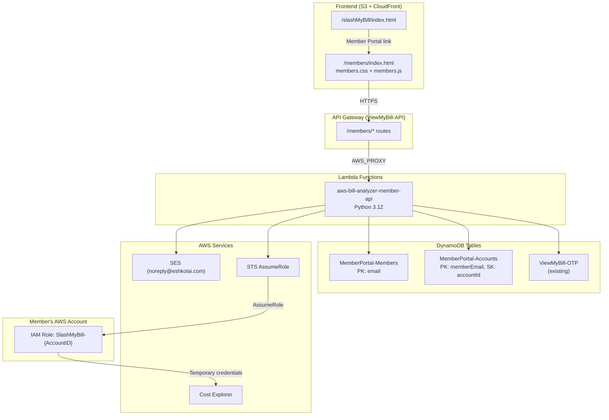

# Member Portal - Technical Design Document

## Overview

The Member Portal extends the SlashMyBill platform with a self-service area where registered members can connect multiple AWS accounts for FinOps visibility. The feature adds a registration/login flow (email + OTP + password), a dashboard for managing AWS accounts, CloudFormation template generation for cross-account IAM role setup, and connection testing via STS AssumeRole + Cost Explorer.

The portal reuses the existing API Gateway (`ViewMyBill-API`), SES OTP infrastructure, DynamoDB patterns, and the admin panel's vanilla HTML/CSS/JS frontend approach. A single new Lambda function (`aws-bill-analyzer-member-api`) handles all member API routes, following the same routing pattern as `admin-handler/lambda_function.py`.

### Key Design Decisions

1. **Single Lambda for all member routes** — Mirrors the admin-handler pattern. One Lambda handles registration, login, account CRUD, CF template generation, and connection testing. This keeps deployment simple and avoids cold-start multiplication.

2. **Shared JWT_SECRET with admin-handler** — Both Lambdas use the same secret for JWT signing. Member tokens include a `role: "member"` claim to distinguish them from admin tokens, preventing cross-use.

3. **Frontend as static files under `/members/`** — Same pattern as `admin/` — three files (`index.html`, `members.css`, `members.js`) deployed to S3 under the `members/` prefix. No build step, no framework.

4. **OTP reuse** — Registration OTP uses the existing `ViewMyBill-OTP` table and SES sender. The member Lambda calls the OTP table directly (same pattern as `otp-handler`) rather than invoking the OTP Lambda, to avoid an extra hop.

5. **CloudFormation template generated server-side** — The Account API generates a YAML string with the member's Account ID and email hash baked in. This is returned as a downloadable file, not stored in S3.

## Architecture



### API Routes

All routes are prefixed with `/members/` and integrated with the single member Lambda:

| Route | Method | Auth | Description |
|-------|--------|------|-------------|
| `/members/register` | POST | None | Send OTP, verify OTP, create member |
| `/members/login` | POST | None | Authenticate and return JWT |
| `/members/accounts` | GET | JWT | List member's accounts |
| `/members/accounts` | POST | JWT | Add new account |
| `/members/accounts` | PUT | JWT | Edit account (change Account ID) |
| `/members/accounts` | DELETE | JWT | Delete account |
| `/members/accounts/template` | POST | JWT | Generate CF template for account |
| `/members/accounts/test` | POST | JWT | Test cross-account connection |

## Components and Interfaces

### 1. Member API Lambda (`member-handler/lambda_function.py`)

Single Lambda function following the admin-handler routing pattern:

```python
# Route dispatch (same pattern as admin-handler)
routes = {
    'POST /members/register': handle_register,
    'POST /members/login': handle_login,
    'GET /members/accounts': handle_get_accounts,
    'POST /members/accounts': handle_add_account,
    'PUT /members/accounts': handle_edit_account,
    'DELETE /members/accounts': handle_delete_account,
    'POST /members/accounts/template': handle_generate_template,
    'POST /members/accounts/test': handle_test_connection,
}
```

**Dependencies**: `boto3`, `bcrypt`, `PyJWT`, `pyyaml`

**Environment Variables**:
- `JWT_SECRET` — shared with admin-handler
- `MEMBERS_TABLE_NAME` — `MemberPortal-Members`
- `ACCOUNTS_TABLE_NAME` — `MemberPortal-Accounts`
- `OTP_TABLE_NAME` — `ViewMyBill-OTP`
- `SES_SENDER_EMAIL` — `noreply@eshkolai.com`
- `PLATFORM_ACCOUNT_ID` — `991105135552`

### 2. Registration Flow

The registration is a multi-step process handled by a single `POST /members/register` endpoint with an `action` field:

1. **`action: "send-otp"`** — Validates email, checks for existing member, generates 6-digit OTP, stores in OTP table with 5-min TTL, sends via SES.
2. **`action: "verify-otp"`** — Verifies OTP against OTP table, returns a short-lived `otpToken` (JWT, 10-min expiry) confirming email ownership.
3. **`action: "create-account"`** — Requires valid `otpToken`, validates password (≥8 chars), hashes with bcrypt, creates member record.

### 3. Authentication

- Login verifies email + bcrypt password hash, returns JWT with 24h expiry
- JWT payload: `{ sub: email, role: "member", iat, exp }`
- `validate_token()` checks signature, expiry, and `role == "member"`
- All protected endpoints call `validate_token()` first

### 4. Account Management

- **Add**: Validates 12-digit Account ID, creates record with `connectionStatus: "pending"`
- **Edit**: Deletes old record, creates new with updated Account ID, resets status to "pending", preserves `addedAt`
- **Delete**: Removes record by composite key `(memberEmail, accountId)`
- **List**: Queries Accounts table by `memberEmail` partition key

### 5. CloudFormation Template Generator

Generates a YAML CloudFormation template string with:
- IAM role named `SlashMyBill-{AccountID}`
- Trust policy allowing account `991105135552` to assume via STS
- ExternalId condition using SHA-256 hash of member's email
- Read-only policy for Cost Explorer and Billing APIs
- Outputs section with role ARN

The template is returned as a YAML string in the API response body. The frontend triggers a file download.

### 6. Connection Tester

1. Calls `sts:AssumeRole` with the role ARN and ExternalId
2. On success, uses temporary credentials to call `ce:GetCostAndUsage` for the last 7 days
3. Updates `connectionStatus` and `lastTestedAt` in Accounts table
4. Returns descriptive error messages for each failure mode

### 7. Frontend (`members/`)

Three static files following the admin panel pattern:

- **`members/index.html`** — Login view, registration view, dashboard view (all in one page, toggled via JS)
- **`members/members.css`** — Reuses CSS variables and component styles from admin.css
- **`members/members.js`** — SPA-like routing via `hidden` attribute toggling, API calls via `fetch()`

**Views**:
- Login form (default view)
- Registration form (multi-step: email → OTP → password)
- Dashboard (accounts table with action buttons)
- Add/Edit Account modal
- CF Template download (triggered from dashboard)


## Data Models

### MemberPortal-Members Table

| Attribute | Type | Description |
|-----------|------|-------------|
| `email` (PK) | String | Member's email address (lowercase) |
| `passwordHash` | String | bcrypt hash of the member's password |
| `displayName` | String | Derived from email (part before @) |
| `createdAt` | String (ISO 8601) | Registration timestamp |
| `lastLoginAt` | String (ISO 8601) | Last successful login timestamp |

**Key Schema**: Partition key = `email`
**Billing**: PAY_PER_REQUEST
**Encryption**: SSE enabled

### MemberPortal-Accounts Table

| Attribute | Type | Description |
|-----------|------|-------------|
| `memberEmail` (PK) | String | Member's email (foreign key to Members table) |
| `accountId` (SK) | String | 12-digit AWS Account ID |
| `roleName` | String | `SlashMyBill-{accountId}` |
| `connectionStatus` | String | One of: `pending`, `connected`, `failed`, `partial` |
| `addedAt` | String (ISO 8601) | When the account was first added |
| `lastTestedAt` | String (ISO 8601) | Last connection test timestamp (null if never tested) |

**Key Schema**: Partition key = `memberEmail`, Sort key = `accountId`
**Billing**: PAY_PER_REQUEST
**Encryption**: SSE enabled

### JWT Token Payload (Member)

```json
{
  "sub": "user@example.com",
  "role": "member",
  "iat": 1700000000,
  "exp": 1700086400
}
```

### OTP Token Payload (Registration)

```json
{
  "sub": "user@example.com",
  "purpose": "registration",
  "iat": 1700000000,
  "exp": 1700000600
}
```

### CloudFormation Template Structure

```yaml
AWSTemplateFormatVersion: '2010-09-09'
Description: 'SlashMyBill cross-account access role for {AccountID}'
Resources:
  SlashMyBillRole:
    Type: AWS::IAM::Role
    Properties:
      RoleName: 'SlashMyBill-{AccountID}'
      AssumeRolePolicyDocument:
        Version: '2012-10-17'
        Statement:
          - Effect: Allow
            Principal:
              AWS: 'arn:aws:iam::991105135552:root'
            Action: 'sts:AssumeRole'
            Condition:
              StringEquals:
                'sts:ExternalId': '{sha256-hash-of-email}'
      Policies:
        - PolicyName: SlashMyBillReadOnly
          PolicyDocument:
            Version: '2012-10-17'
            Statement:
              - Effect: Allow
                Action:
                  - 'ce:GetCostAndUsage'
                  - 'ce:GetCostForecast'
                  - 'ce:GetReservationUtilization'
                  - 'ce:GetSavingsPlansUtilization'
                  - 'budgets:ViewBudget'
                  - 'cur:DescribeReportDefinitions'
                Resource: '*'
Outputs:
  RoleArn:
    Description: 'ARN of the SlashMyBill cross-account role'
    Value: !GetAtt SlashMyBillRole.Arn
```

### API Request/Response Formats

**POST /members/register (send-otp)**
```json
// Request
{ "action": "send-otp", "email": "user@example.com" }
// Response 200
{ "message": "OTP sent successfully", "email": "user@example.com" }
```

**POST /members/register (verify-otp)**
```json
// Request
{ "action": "verify-otp", "email": "user@example.com", "otp": "123456" }
// Response 200
{ "verified": true, "otpToken": "eyJ..." }
```

**POST /members/register (create-account)**
```json
// Request
{ "action": "create-account", "otpToken": "eyJ...", "password": "securepass", "confirmPassword": "securepass" }
// Response 201
{ "message": "Registration successful", "email": "user@example.com" }
```

**POST /members/login**
```json
// Request
{ "email": "user@example.com", "password": "securepass" }
// Response 200
{ "token": "eyJ...", "email": "user@example.com", "displayName": "user" }
```

**GET /members/accounts**
```json
// Response 200
{ "accounts": [{ "accountId": "123456789012", "roleName": "SlashMyBill-123456789012", "connectionStatus": "connected", "addedAt": "...", "lastTestedAt": "..." }] }
```

**POST /members/accounts**
```json
// Request
{ "accountId": "123456789012" }
// Response 201
{ "message": "Account added", "account": { ... } }
```

**POST /members/accounts/template**
```json
// Request
{ "accountId": "123456789012" }
// Response 200
{ "template": "AWSTemplateFormatVersion: ...", "filename": "SlashMyBill-123456789012.yaml" }
```

**POST /members/accounts/test**
```json
// Request
{ "accountId": "123456789012" }
// Response 200
{ "status": "connected", "message": "Connection successful" }
```

## Correctness Properties

*A property is a characteristic or behavior that should hold true across all valid executions of a system — essentially, a formal statement about what the system should do. Properties serve as the bridge between human-readable specifications and machine-verifiable correctness guarantees.*

### Property 1: OTP generation stores a valid 6-digit code

*For any* valid email address, calling the send-otp action should store a 6-digit numeric code in the OTP table with a TTL of 300 seconds from the current time.

**Validates: Requirements 1.2**

### Property 2: OTP verification round-trip

*For any* valid email and its corresponding stored OTP code, submitting that exact code should return a verified response with a valid otpToken. Submitting any other code (wrong digits, expired, or empty) should return a 400 error.

**Validates: Requirements 1.3, 1.4**

### Property 3: Password validation rejects weak passwords

*For any* string shorter than 8 characters, or any pair of non-matching password and confirmPassword strings, the registration API should reject the submission and not create a member record.

**Validates: Requirements 1.5**

### Property 4: Registration round-trip

*For any* valid registration input (verified email, password ≥ 8 chars), the Registration API should store a member record such that `bcrypt.checkpw(password, storedHash)` returns true, and the member's displayName equals the local part of the email.

**Validates: Requirements 1.6**

### Property 5: Duplicate member detection

*For any* email that already exists in the Members table, attempting to register with that email again should return a 409 status and not modify the existing record.

**Validates: Requirements 1.7**

### Property 6: Login produces valid JWT with correct expiry

*For any* registered member, submitting the correct email and password should return a JWT that decodes with the correct `sub` (email), `role` ("member"), and an `exp` exactly 86400 seconds after `iat`. The `lastLoginAt` field in the Members table should be updated.

**Validates: Requirements 2.2, 2.4**

### Property 7: Invalid credentials are rejected

*For any* email/password combination where the password does not match the stored bcrypt hash (or the email does not exist), the Auth API should return a 401 status.

**Validates: Requirements 2.3**

### Property 8: JWT validation on protected endpoints

*For any* protected endpoint and any request with a missing, malformed, expired, or incorrectly-signed JWT, the API should return a 401 status. For any request with a valid member JWT, the API should proceed to handle the request.

**Validates: Requirements 2.6, 2.7, 3.6, 4.6, 5.7, 6.6, 7.5**

### Property 9: Account ID validation

*For any* string that is not exactly 12 decimal digits, the add-account and edit-account endpoints should reject the input with a 400 status. For any string that is exactly 12 decimal digits, the validation should pass.

**Validates: Requirements 3.2, 6.2**

### Property 10: Add account creates correct record

*For any* valid 12-digit Account ID and authenticated member, adding the account should create a record in the Accounts table with `connectionStatus` set to `"pending"`, `roleName` set to `"SlashMyBill-{accountId}"`, and a valid `addedAt` timestamp.

**Validates: Requirements 3.3**

### Property 11: Duplicate account detection

*For any* Account ID that already exists for a given member, attempting to add or edit to that Account ID should return a 409 status and not modify existing records.

**Validates: Requirements 3.4, 6.4**

### Property 12: Edit account preserves addedAt and resets status

*For any* existing account record, editing the Account ID should delete the old record, create a new record with the updated Account ID, reset `connectionStatus` to `"pending"`, set `roleName` to `"SlashMyBill-{newAccountId}"`, and preserve the original `addedAt` timestamp.

**Validates: Requirements 6.3**

### Property 13: Delete account removes record

*For any* existing account record, deleting it should result in the record no longer being present in the Accounts table. Deleting a non-existent account should return a 404 status.

**Validates: Requirements 7.2, 7.4**

### Property 14: CloudFormation template round-trip

*For any* valid 12-digit Account ID and any valid email address, generating the CloudFormation template and then parsing the resulting YAML should produce a valid CloudFormation structure containing: a role named `SlashMyBill-{AccountID}`, a trust policy referencing account `991105135552`, an ExternalId matching the SHA-256 hash of the email, only the specified read-only Cost Explorer and Billing actions (no write/admin permissions), a Description field, and an Outputs section with the role ARN.

**Validates: Requirements 4.1, 4.2, 4.3, 4.4, 4.5, 11.1, 11.2, 11.3, 11.4, 11.5**

### Property 15: Connection test status mapping

*For any* account connection test, the resulting `connectionStatus` should be: `"connected"` if both STS AssumeRole and Cost Explorer calls succeed, `"failed"` if STS AssumeRole fails, or `"partial"` if STS succeeds but Cost Explorer fails. The `lastTestedAt` timestamp should be updated in all cases.

**Validates: Requirements 5.3, 5.4, 5.5**

### Property 16: Dashboard renders account information correctly

*For any* account record, the dashboard rendering should display the Account ID, role name, connection status, and last tested timestamp. The status indicator color should be: green for `"connected"`, yellow for `"pending"`, red for `"failed"`, orange for `"partial"`.

**Validates: Requirements 8.2, 8.3**

## Error Handling

### API Error Response Format

All errors follow the existing pattern from `admin-handler`:

```json
{
  "error": "ErrorType",
  "message": "Human-readable description",
  "code": 400
}
```

### Error Categories

| Scenario | Status | Error Type | Message |
|----------|--------|------------|---------|
| Invalid JSON body | 400 | `InvalidRequest` | "Invalid request body" |
| Missing required fields | 400 | `InvalidRequest` | "Field '{name}' is required" |
| Invalid email format | 400 | `InvalidEmail` | "Please provide a valid email address" |
| Invalid Account ID format | 400 | `InvalidAccountId` | "Account ID must be exactly 12 digits" |
| Password too short | 400 | `InvalidPassword` | "Password must be at least 8 characters" |
| Passwords don't match | 400 | `InvalidPassword` | "Passwords do not match" |
| Invalid/expired OTP | 400 | `InvalidOTP` | "Invalid or expired OTP code" |
| Invalid/expired otpToken | 400 | `InvalidToken` | "Email verification token is invalid or expired" |
| OTP rate limited | 429 | `RateLimited` | "Please wait before requesting a new code" |
| Invalid credentials | 401 | `AuthError` | "Invalid email or password" |
| Missing/invalid JWT | 401 | `AuthError` | "Authentication required" |
| Expired JWT | 401 | `AuthError` | "Session expired, please log in again" |
| Duplicate email | 409 | `ConflictError` | "An account with this email already exists" |
| Duplicate Account ID | 409 | `ConflictError` | "This AWS account is already connected" |
| Account not found | 404 | `NotFound` | "Account not found" |
| STS AssumeRole failed | 400 | `ConnectionFailed` | "Role does not exist or trust policy is misconfigured" |
| Cost Explorer call failed | 400 | `PartialConnection` | "Role assumed successfully but Cost Explorer access denied" |
| DynamoDB error | 500 | `ServerError` | "An unexpected error occurred. Please try again." |
| SES send failure | 500 | `SendFailed` | "Failed to send verification email" |

### Frontend Error Handling

- API errors are displayed as notification banners (same pattern as admin panel)
- 401 errors trigger automatic redirect to login view and clear sessionStorage
- Network errors show a generic "Connection error, please try again" message
- Loading indicators are hidden on both success and error

### Connection Test Error Messages

The connection test provides actionable guidance:

- **STS failure**: "The IAM role `SlashMyBill-{AccountID}` was not found in account {AccountID}. Please deploy the CloudFormation template first."
- **CE failure**: "The role was assumed successfully, but Cost Explorer access was denied. Please verify the role policy includes `ce:GetCostAndUsage` permission."
- **Success**: "Connection verified. Cost data is accessible."

## Testing Strategy

### Testing Framework

- **Unit tests**: `pytest` with `moto` for AWS service mocking
- **Property-based tests**: `hypothesis` library for Python
- **Frontend tests**: Manual testing (vanilla JS, no test framework — consistent with existing admin panel approach)

### Unit Tests

Unit tests focus on specific examples, edge cases, and integration points:

1. **Registration flow**: Test the three-step registration with specific valid/invalid inputs
2. **Login**: Test with correct credentials, wrong password, non-existent email
3. **Account CRUD**: Test add, edit, delete with specific Account IDs
4. **CF template**: Test with a specific Account ID and verify YAML structure
5. **Connection test**: Mock STS and CE responses for success, STS failure, CE failure
6. **Token validation**: Test with expired token, wrong signature, missing header
7. **Edge cases**: Empty body, missing fields, malformed JSON, SQL injection attempts in email

### Property-Based Tests

Each property test runs a minimum of 100 iterations using `hypothesis`. Each test is tagged with a comment referencing the design property.

```python
# Feature: member-portal, Property 14: CloudFormation template round-trip
@given(
    account_id=st.from_regex(r'[0-9]{12}', fullmatch=True),
    email=st.emails()
)
def test_cf_template_roundtrip(account_id, email):
    template_yaml = generate_cf_template(account_id, email)
    parsed = yaml.safe_load(template_yaml)
    assert parsed['AWSTemplateFormatVersion'] == '2010-09-09'
    # ... verify structure
```

Property tests to implement:

| Property | Test Description | Generator Strategy |
|----------|-----------------|-------------------|
| P1: OTP generation | Generate random valid emails, verify 6-digit code stored | `st.emails()` |
| P2: OTP verification | Generate emails + OTP codes, test match/mismatch | `st.emails()`, `st.from_regex(r'[0-9]{6}')` |
| P3: Password validation | Generate strings of various lengths | `st.text(min_size=0, max_size=20)` |
| P4: Registration round-trip | Generate email + password pairs, verify bcrypt | `st.emails()`, `st.text(min_size=8, max_size=72)` |
| P5: Duplicate member | Register twice with same email | `st.emails()` |
| P6: Login JWT | Register then login, verify JWT claims | `st.emails()`, `st.text(min_size=8)` |
| P7: Invalid credentials | Generate wrong passwords | `st.emails()`, `st.text()` |
| P8: JWT validation | Generate valid/invalid/expired tokens | Custom JWT strategy |
| P9: Account ID validation | Generate strings of various formats | `st.text()`, `st.from_regex(r'[0-9]{12}')` |
| P10: Add account | Generate valid Account IDs | `st.from_regex(r'[0-9]{12}')` |
| P11: Duplicate account | Add same Account ID twice | `st.from_regex(r'[0-9]{12}')` |
| P12: Edit account | Generate old + new Account IDs | `st.from_regex(r'[0-9]{12}')` pairs |
| P13: Delete account | Add then delete | `st.from_regex(r'[0-9]{12}')` |
| P14: CF template round-trip | Generate Account IDs + emails, parse YAML | `st.from_regex(r'[0-9]{12}')`, `st.emails()` |
| P15: Connection status mapping | Mock STS/CE success/failure combinations | `st.sampled_from(['success', 'sts_fail', 'ce_fail'])` |
| P16: Dashboard rendering | Generate account records with various statuses | Custom account strategy |

### Test Configuration

- Each property test: `@settings(max_examples=100)`
- Tag format: `# Feature: member-portal, Property {N}: {title}`
- Each correctness property is implemented by a single property-based test
- Tests use `moto` to mock DynamoDB, SES, STS, and Cost Explorer
- Test file: `member-handler/tests/test_member_api.py` (unit) and `member-handler/tests/test_member_properties.py` (property)
