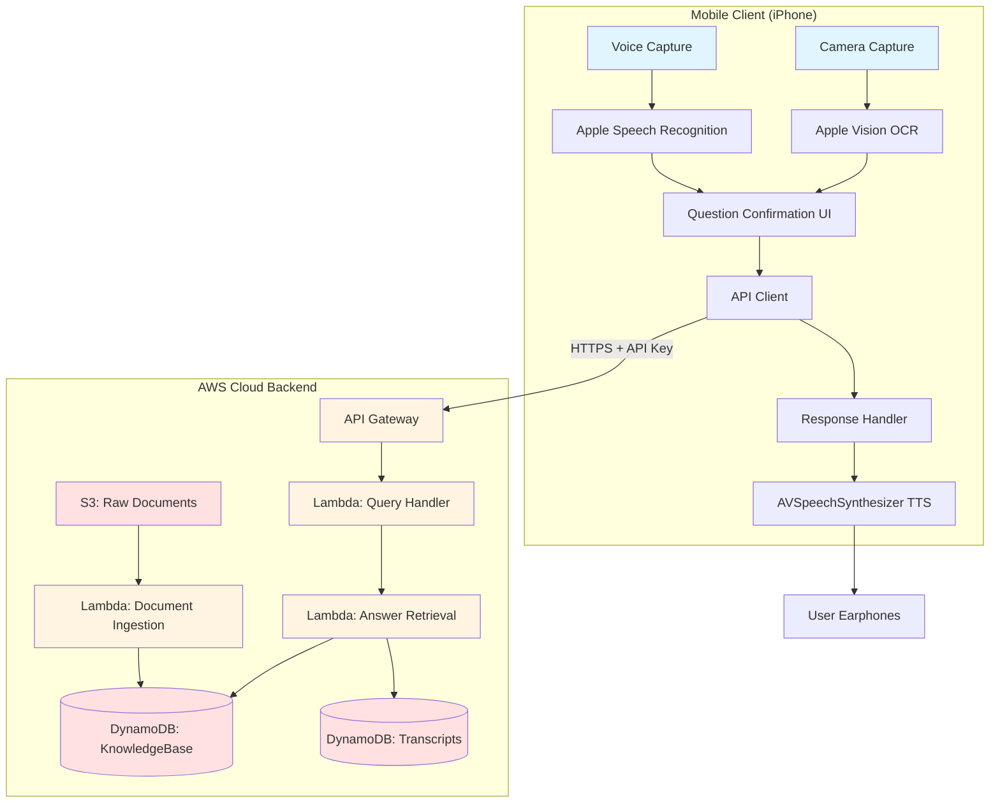
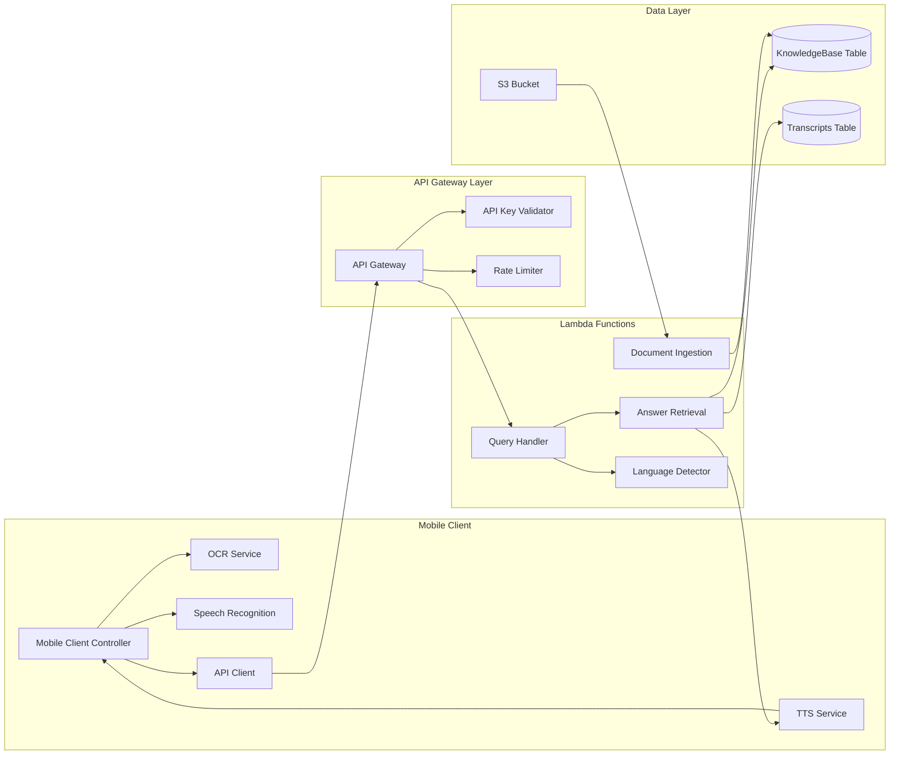
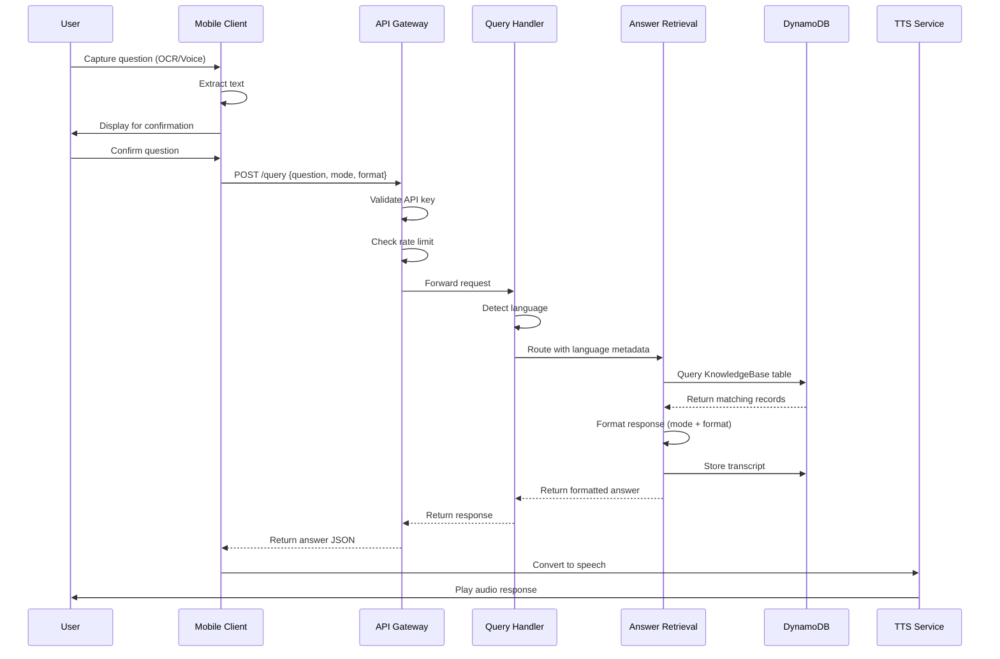
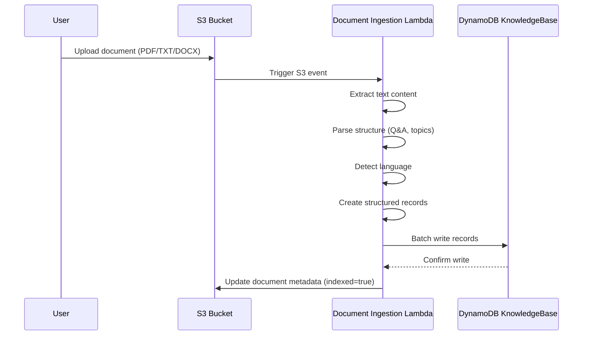

# Design Document: Mobile-to-Cloud Personal Knowledge Assistant

## Overview

The Mobile-to-Cloud Personal Knowledge Assistant is a serverless system that enables users to capture questions via iPhone (camera OCR or voice), retrieve answers from a cloud-hosted knowledge base, and receive spoken responses. The system is built on AWS serverless architecture to minimize costs, supports Hebrew and English languages, and operates in two response modes: Multiple Choice and Conversation.

### Design Goals

1. **Cost Efficiency**: Zero fixed monthly costs through serverless architecture (Lambda, API Gateway, DynamoDB, S3)
2. **Language Support**: Seamless bilingual operation (Hebrew and English) with automatic language detection
3. **Response Flexibility**: Two modes (Multiple Choice and Conversation) with short/long format options
4. **Rapid Deployment**: No App Store publishing required (iOS Shortcuts, web app, or TestFlight)
5. **Privacy**: User-owned knowledge base with configurable logging
6. **Performance**: Sub-3-second end-to-end response time for 95% of queries

### System Context

The system consists of three primary layers:

1. **Mobile Client Layer**: iPhone application using native iOS frameworks for capture and playback
2. **API Layer**: AWS API Gateway providing authenticated HTTPS endpoints
3. **Backend Layer**: AWS Lambda functions for processing, DynamoDB for storage, S3 for documents

## Architecture

### High-Level Architecture



### Component Architecture



### Data Flow Diagrams

#### Question Processing Flow



#### Document Ingestion Flow



## Components and Interfaces

### Mobile Client Components

#### 1. Camera Capture Module

**Technology**: iOS Shortcuts or Swift with AVFoundation + Vision Framework

**Responsibilities**:
- Capture image from camera
- Invoke Apple Vision Framework for OCR
- Extract text from image
- Handle Hebrew and English text recognition

**Interface**:
```swift
protocol CameraCaptureService {
    func captureImage() async throws -> UIImage
    func extractText(from image: UIImage) async throws -> String
}
```

**Implementation Notes**:
- Use `VNRecognizeTextRequest` with language hints for Hebrew/English
- Set `recognitionLevel` to `.accurate` for better quality
- Handle orientation and image quality issues
- Timeout: 3 seconds for OCR processing

#### 2. Voice Capture Module

**Technology**: iOS Speech Framework (SFSpeechRecognizer)

**Responsibilities**:
- Record audio from microphone
- Convert speech to text
- Auto-detect language (Hebrew/English)
- Handle speech recognition errors

**Interface**:
```swift
protocol VoiceCaptureService {
    func startRecording() async throws
    func stopRecording() async throws -> String
    func detectLanguage(from audio: AVAudioBuffer) -> String
}
```

**Implementation Notes**:
- Use `SFSpeechRecognizer` with locale detection
- Support both `he-IL` and `en-US` locales
- Implement voice activity detection for auto-stop
- Timeout: 2 seconds after speech ends

#### 3. API Client Module

**Responsibilities**:
- Send authenticated HTTPS requests to API Gateway
- Handle network errors and retries
- Manage API key storage (Keychain)
- Parse JSON responses

**Interface**:
```swift
protocol APIClient {
    func sendQuery(
        question: String,
        mode: ResponseMode,
        format: ResponseFormat
    ) async throws -> AnswerResponse
    
    func authenticate(apiKey: String) async throws -> Bool
}

enum ResponseMode {
    case multipleChoice
    case conversation
}

enum ResponseFormat {
    case short
    case long
}

struct AnswerResponse: Codable {
    let answer: String
    let language: String
    let sourceDocumentId: String?
    let timestamp: Date
}
```

**Error Handling**:
- Network errors: Retry up to 3 times with exponential backoff
- 401 Unauthorized: Prompt user to re-enter API key
- 429 Rate Limited: Display wait time to user
- 500 Server Error: Display error and offer retry

#### 4. Text-to-Speech Module

**Technology**: AVSpeechSynthesizer (iOS native)

**Responsibilities**:
- Convert text responses to speech
- Use appropriate voice for language (Hebrew/English)
- Support speed and voice customization
- Route audio to earphones if connected

**Interface**:
```swift
protocol TTSService {
    func speak(
        text: String,
        language: String,
        rate: Float
    ) async throws
    
    func stop()
    func pause()
    func resume()
}
```

**Implementation Notes**:
- Use `AVSpeechSynthesisVoice` with language code (`he-IL` or `en-US`)
- Default rate: 0.5 (adjustable by user)
- Detect audio route (speaker vs earphones) via `AVAudioSession`

### API Gateway Layer

#### API Gateway Configuration

**Service**: AWS API Gateway (REST API)

**Endpoints**:

1. **POST /query**
   - Description: Submit question and receive answer
   - Authentication: API Key (x-api-key header)
   - Rate Limit: 100 requests/hour per API key
   - Request Body:
   ```json
   {
     "question": "string",
     "mode": "multiple_choice" | "conversation",
     "format": "short" | "long"
   }
   ```
   - Response Body:
   ```json
   {
     "answer": "string",
     "language": "he" | "en",
     "sourceDocumentId": "string",
     "timestamp": "ISO8601 string"
   }
   ```
   - Error Responses:
     - 400: Invalid request format
     - 401: Invalid or missing API key
     - 429: Rate limit exceeded
     - 500: Internal server error

2. **GET /health**
   - Description: Health check endpoint
   - Authentication: None
   - Response: `{"status": "healthy"}`

**Security Configuration**:
- HTTPS only (TLS 1.2+)
- API Key authentication via usage plans
- CORS enabled for web app deployment
- Request validation enabled
- CloudWatch logging for all requests

**Rate Limiting**:
- Usage Plan: 100 requests per hour per API key
- Burst limit: 10 requests per second
- Throttle on quota exceeded

### Lambda Functions

#### 1. Query Handler Lambda

**Runtime**: Python 3.11
**Memory**: 256 MB
**Timeout**: 10 seconds

**Responsibilities**:
- Receive query requests from API Gateway
- Detect question language
- Route to Answer Retrieval Lambda
- Log request metadata
- Return formatted response

**Environment Variables**:
- `ANSWER_RETRIEVAL_FUNCTION_ARN`: ARN of Answer Retrieval Lambda
- `LOG_LEVEL`: Logging verbosity (INFO, ERROR)
- `ENABLE_DETAILED_LOGGING`: Boolean flag

**Handler Function**:
```python
def lambda_handler(event, context):
    """
    Process incoming query request
    
    Args:
        event: API Gateway proxy event
        context: Lambda context
        
    Returns:
        API Gateway proxy response
    """
    # Parse request body
    # Detect language
    # Invoke Answer Retrieval Lambda
    # Format response
    # Return to API Gateway
```

**Language Detection Logic**:
- Use `langdetect` library or simple heuristic (Hebrew Unicode range: U+0590 to U+05FF)
- Default to English if detection fails
- Cache detection result for transcript storage

#### 2. Answer Retrieval Lambda

**Runtime**: Python 3.11
**Memory**: 512 MB
**Timeout**: 5 seconds

**Responsibilities**:
- Search DynamoDB KnowledgeBase table
- Rank results by relevance
- Format answer based on mode and format
- Store transcript in DynamoDB
- Return answer to Query Handler

**Environment Variables**:
- `KNOWLEDGE_BASE_TABLE`: DynamoDB table name
- `TRANSCRIPTS_TABLE`: DynamoDB table name
- `SEARCH_TIMEOUT_MS`: Maximum search time (2000ms)

**Search Algorithm**:
1. Extract keywords from question (remove stop words)
2. Query DynamoDB with language filter
3. Score results based on keyword matches
4. Return top result or "no answer found"

**Response Formatting**:
- Multiple Choice + Short: Return letter only (e.g., "A")
- Multiple Choice + Long: Return letter + option + explanation
- Conversation + Short: Return brief answer (1-2 sentences)
- Conversation + Long: Return detailed explanation

**Handler Function**:
```python
def lambda_handler(event, context):
    """
    Retrieve answer from knowledge base
    
    Args:
        event: Contains question, language, mode, format
        context: Lambda context
        
    Returns:
        Formatted answer response
    """
    # Parse input
    # Search DynamoDB
    # Rank results
    # Format answer
    # Store transcript
    # Return response
```

#### 3. Document Ingestion Lambda

**Runtime**: Python 3.11
**Memory**: 1024 MB
**Timeout**: 60 seconds

**Trigger**: S3 event (ObjectCreated)

**Responsibilities**:
- Extract text from uploaded documents (PDF, TXT, DOCX)
- Parse document structure (questions, answers, topics)
- Detect language
- Create structured records
- Write records to DynamoDB KnowledgeBase table
- Update S3 object metadata (indexed=true)

**Environment Variables**:
- `KNOWLEDGE_BASE_TABLE`: DynamoDB table name
- `SUPPORTED_FORMATS`: ["pdf", "txt", "docx"]

**Document Parsing Logic**:

For Multiple Choice Documents:
```
Question: What is the capital of France?
A) London
B) Paris
C) Berlin
D) Madrid
Answer: B
Explanation: Paris is the capital and largest city of France.
```

Parsing steps:
1. Extract question text (line starting with "Question:")
2. Extract options (lines starting with A), B), C), D))
3. Extract correct answer (line starting with "Answer:")
4. Extract explanation (line starting with "Explanation:")
5. Detect language from question text
6. Extract topics from document metadata or filename

**Handler Function**:
```python
def lambda_handler(event, context):
    """
    Process uploaded document
    
    Args:
        event: S3 event notification
        context: Lambda context
        
    Returns:
        Processing status
    """
    # Get S3 object details
    # Download document
    # Extract text based on format
    # Parse structure
    # Detect language
    # Create records
    # Batch write to DynamoDB
    # Update S3 metadata
```

**Text Extraction Libraries**:
- PDF: `PyPDF2` or `pdfplumber`
- DOCX: `python-docx`
- TXT: Built-in file reading

## Data Models

### DynamoDB Tables

#### KnowledgeBase Table

**Purpose**: Store indexed question-answer records from ingested documents

**Primary Key**:
- Partition Key: `recordId` (String) - UUID for each record
- Sort Key: None

**Attributes**:
```json
{
  "recordId": "uuid-string",
  "documentId": "string",
  "questionText": "string",
  "answerOptions": [
    {
      "letter": "A",
      "text": "string"
    },
    {
      "letter": "B",
      "text": "string"
    }
  ],
  "correctAnswer": "string",
  "explanation": "string",
  "language": "he" | "en",
  "topics": ["string"],
  "keywords": ["string"],
  "createdAt": "ISO8601 timestamp",
  "updatedAt": "ISO8601 timestamp"
}
```

**Global Secondary Indexes**:

1. **LanguageIndex**
   - Partition Key: `language`
   - Sort Key: `createdAt`
   - Purpose: Query records by language

2. **DocumentIndex**
   - Partition Key: `documentId`
   - Sort Key: `createdAt`
   - Purpose: Query all records from a specific document

**Capacity Mode**: On-Demand (pay per request)

**Point-in-Time Recovery**: Enabled

#### Transcripts Table

**Purpose**: Store question-answer interaction history

**Primary Key**:
- Partition Key: `userId` (String) - API key hash or user identifier
- Sort Key: `timestamp` (String) - ISO8601 timestamp

**Attributes**:
```json
{
  "userId": "string",
  "timestamp": "ISO8601 string",
  "transcriptId": "uuid-string",
  "questionText": "string",
  "answerText": "string",
  "language": "he" | "en",
  "mode": "multiple_choice" | "conversation",
  "format": "short" | "long",
  "sourceDocumentId": "string",
  "sourceRecordId": "string",
  "responseTimeMs": "number"
}
```

**Global Secondary Indexes**:

1. **LanguageTimestampIndex**
   - Partition Key: `language`
   - Sort Key: `timestamp`
   - Purpose: Query transcripts by language and date range

**Capacity Mode**: On-Demand

**TTL**: Optional (90 days for privacy)

**Point-in-Time Recovery**: Enabled

### S3 Bucket Structure

**Bucket Name**: `mobile-knowledge-assistant-documents-{account-id}`

**Folder Structure**:
```
/raw-documents/
  /{documentId}/
    /original.{pdf|txt|docx}
    /metadata.json

/processed/
  /{documentId}/
    /extracted-text.txt
    /records.json
```

**Object Metadata**:
```json
{
  "documentId": "uuid-string",
  "uploadedAt": "ISO8601 timestamp",
  "language": "he" | "en",
  "topics": ["string"],
  "format": "pdf" | "txt" | "docx",
  "indexed": "true" | "false",
  "recordCount": "number"
}
```

**Lifecycle Policy**:
- Transition to Intelligent-Tiering after 30 days
- No automatic deletion (user-controlled)

**Versioning**: Enabled

**Encryption**: SSE-S3 (server-side encryption)

### API Request/Response Schemas

#### Query Request Schema

```json
{
  "$schema": "http://json-schema.org/draft-07/schema#",
  "type": "object",
  "required": ["question", "mode", "format"],
  "properties": {
    "question": {
      "type": "string",
      "minLength": 1,
      "maxLength": 1000
    },
    "mode": {
      "type": "string",
      "enum": ["multiple_choice", "conversation"]
    },
    "format": {
      "type": "string",
      "enum": ["short", "long"]
    }
  }
}
```

#### Query Response Schema

```json
{
  "$schema": "http://json-schema.org/draft-07/schema#",
  "type": "object",
  "required": ["answer", "language", "timestamp"],
  "properties": {
    "answer": {
      "type": "string"
    },
    "language": {
      "type": "string",
      "enum": ["he", "en"]
    },
    "sourceDocumentId": {
      "type": "string"
    },
    "sourceRecordId": {
      "type": "string"
    },
    "timestamp": {
      "type": "string",
      "format": "date-time"
    }
  }
}
```


## Correctness Properties

*A property is a characteristic or behavior that should hold true across all valid executions of a system-essentially, a formal statement about what the system should do. Properties serve as the bridge between human-readable specifications and machine-verifiable correctness guarantees.*

### Property Reflection

After analyzing all acceptance criteria, I identified the following redundancies:

- **7.4 and 9.5**: Both require language filtering in search - can be combined into one property
- **8.5 and 10.9**: Duplicate requirements about mode toggling
- **19.4 and 8.2**: Both address explanation inclusion in long format multiple choice - can be combined
- **20.3 and 20.5**: Both address round-trip validation - 20.3 is the comprehensive property

The following properties represent the unique, non-redundant correctness requirements:

### Property 1: OCR Language Support

*For any* image containing Hebrew or English text, the OCR service should successfully extract the text in the correct language.

**Validates: Requirements 1.5**

### Property 2: OCR Success Display

*For any* successful OCR extraction, the mobile client should display the extracted text for user confirmation.

**Validates: Requirements 1.3**

### Property 3: OCR Failure Handling

*For any* OCR extraction failure, the mobile client should display an error message and provide a retry option.

**Validates: Requirements 1.4**

### Property 4: Speech Recognition Language Support

*For any* audio input in Hebrew or English, the speech recognition service should successfully transcribe the speech in the correct language.

**Validates: Requirements 2.5**

### Property 5: Language Auto-Detection

*For any* audio input in Hebrew or English, the speech recognition service should automatically detect and identify the correct language.

**Validates: Requirements 2.6**

### Property 6: Speech Recognition Success Display

*For any* successful speech recognition, the mobile client should display the transcribed text for user confirmation.

**Validates: Requirements 2.3**

### Property 7: Speech Recognition Failure Handling

*For any* speech recognition failure, the mobile client should display an error message and provide a retry option.

**Validates: Requirements 2.4**

### Property 8: API Key Validation

*For any* request received by the API Gateway, the authentication service should validate the API key before processing.

**Validates: Requirements 3.2**

### Property 9: Authentication Failure Response

*For any* request with invalid or expired credentials, the API Gateway should return a 401 Unauthorized response.

**Validates: Requirements 3.3, 3.4**

### Property 10: Credential Inclusion

*For any* API request from the mobile client, authentication credentials should be included in the request headers.

**Validates: Requirements 3.5**

### Property 11: Request Forwarding

*For any* authenticated request, the API Gateway should forward it to the Answer Retrieval Engine.

**Validates: Requirements 4.2**

### Property 12: Request Logging

*For any* request received by the cloud backend, the system should log the question with timestamp and language metadata.

**Validates: Requirements 4.3**

### Property 13: Loading Indicator Display

*For any* pending API request, the mobile client should display a loading indicator until the response is received.

**Validates: Requirements 4.4**

### Property 14: Network Failure Handling

*For any* network connectivity failure, the mobile client should display an error message and offer to retry.

**Validates: Requirements 4.5**

### Property 15: Unique Document ID Assignment

*For any* uploaded document, the document ingestion service should assign a unique document ID.

**Validates: Requirements 5.3**

### Property 16: Document Format Support

*For any* document in PDF, TXT, or DOCX format, the knowledge base should successfully process and store it.

**Validates: Requirements 5.4**

### Property 17: Document Metadata Preservation

*For any* stored document, metadata including source, topic labels, and language should be present.

**Validates: Requirements 5.5**

### Property 18: Text Extraction on Upload

*For any* document added to the knowledge base, the document ingestion service should extract text content.

**Validates: Requirements 6.1**

### Property 19: Structured Record Creation

*For any* extracted text, the document ingestion service should create structured records in the database.

**Validates: Requirements 6.2**

### Property 20: Metadata Preservation in Records

*For any* created record, the source document ID, section labels, topic labels, and language should be preserved from the source document.

**Validates: Requirements 6.3**

### Property 21: Multiple Choice Format Parsing

*For any* multiple choice format document, the document ingestion service should correctly parse question text, answer options, correct answer, and explanation.

**Validates: Requirements 6.4, 19.1**

### Property 22: Indexing Status Update

*For any* completed document ingestion, the document should be marked as indexed.

**Validates: Requirements 6.5**

### Property 23: Search Execution

*For any* question received, the answer retrieval engine should search the structured database for relevant records.

**Validates: Requirements 7.1**

### Property 24: Relevance-Based Ranking

*For any* search returning multiple relevant records, the results should be ordered by relevance score in descending order.

**Validates: Requirements 7.3**

### Property 25: Language-Filtered Search

*For any* question in a specific language, the answer retrieval engine should search only records matching that language.

**Validates: Requirements 7.4, 9.5**

### Property 26: No Answer Response

*For any* question with no matching records in the database, the answer retrieval engine should return a "no answer found" response.

**Validates: Requirements 7.5**

### Property 27: Multiple Choice Short Format

*For any* multiple choice question with short response format selected, the answer should contain only the answer letter (e.g., "A").

**Validates: Requirements 8.1**

### Property 28: Multiple Choice Long Format

*For any* multiple choice question with long response format selected, the answer should contain the letter, option text, and explanation.

**Validates: Requirements 8.2, 19.4**

### Property 29: Conversation Short Format

*For any* conversation mode question with short response format selected, the answer should be brief (maximum 2 sentences or 100 words).

**Validates: Requirements 8.3**

### Property 30: Conversation Long Format

*For any* conversation mode question with long response format selected, the answer should provide a complete explanation.

**Validates: Requirements 8.4**

### Property 31: Hebrew Question Hebrew Answer

*For any* question detected as Hebrew, the answer retrieval engine should return an answer in Hebrew.

**Validates: Requirements 9.1**

### Property 32: English Question English Answer

*For any* question detected as English, the answer retrieval engine should return an answer in English.

**Validates: Requirements 9.2**

### Property 33: Automatic Language Detection

*For any* question received, the cloud backend should automatically detect the language (Hebrew or English).

**Validates: Requirements 9.3**

### Property 34: Default Language Fallback

*For any* question where language cannot be determined, the cloud backend should default to English.

**Validates: Requirements 9.4**

### Property 35: Text-to-Speech Conversion

*For any* text response received, the TTS service should convert it to audio.

**Validates: Requirements 10.1**

### Property 36: Audio Playback

*For any* generated audio, the mobile client should play it through the device's audio output.

**Validates: Requirements 10.2**

### Property 37: Multiple Choice TTS Content

*For any* multiple choice mode response, the TTS service should read the answer letter and option text.

**Validates: Requirements 10.3**

### Property 38: Conversation TTS Content

*For any* conversation mode response, the TTS service should read the full conversational response text.

**Validates: Requirements 10.4**

### Property 39: Hebrew Voice Synthesis

*For any* Hebrew text response, the TTS service should use Hebrew voice synthesis.

**Validates: Requirements 10.5**

### Property 40: English Voice Synthesis

*For any* English text response, the TTS service should use English voice synthesis.

**Validates: Requirements 10.6**

### Property 41: Earphone Audio Routing

*For any* audio output when earphones are connected, the mobile client should route audio to the earphones.

**Validates: Requirements 10.7**

### Property 42: Transcript Storage

*For any* answer returned to the user, the cloud backend should store the question and answer in the transcript store.

**Validates: Requirements 11.1**

### Property 43: Transcript Metadata Completeness

*For any* stored transcript, the record should include timestamp, question text, answer text, language, and response mode.

**Validates: Requirements 11.2**

### Property 44: Transcript Source Association

*For any* stored transcript, the source document ID should be recorded.

**Validates: Requirements 11.3**

### Property 45: Transcript Query Support

*For any* query to the transcript store with date range and language filters, the system should return matching transcripts.

**Validates: Requirements 11.5**

### Property 46: Hourly Rate Limiting

*For any* user making more than 100 requests in a one-hour period, subsequent requests should be blocked until the hour resets.

**Validates: Requirements 12.1**

### Property 47: Rate Limit Response Code

*For any* request that exceeds rate limits, the API Gateway should return a 429 Too Many Requests response.

**Validates: Requirements 12.2**

### Property 48: Daily Quota Enforcement

*For any* user exceeding their daily request quota, subsequent requests should be blocked until the daily reset.

**Validates: Requirements 12.3**

### Property 49: Request Count Tracking

*For any* API key, the authentication service should track the number of requests made.

**Validates: Requirements 12.4**

### Property 50: Suspicious Pattern Blocking

*For any* API key exhibiting suspicious patterns (e.g., rapid repeated identical requests), the API Gateway should temporarily block the key.

**Validates: Requirements 12.5**

### Property 51: Error Message Display

*For any* error condition, the mobile client should display a descriptive error message to the user.

**Validates: Requirements 14.1**

### Property 52: Error Message TTS

*For any* error condition, the TTS service should read the error message aloud.

**Validates: Requirements 14.2**

### Property 53: Network Error Retry Option

*For any* network error, the mobile client should offer to retry the request.

**Validates: Requirements 14.3**

### Property 54: Authentication Failure Prompt

*For any* authentication failure, the mobile client should prompt the user to check their credentials.

**Validates: Requirements 14.4**

### Property 55: Graceful Error Handling

*For any* backend error response, the mobile client should handle it gracefully without crashing.

**Validates: Requirements 14.5**

### Property 56: Metadata-Only Logging

*For any* request when logging is enabled, the cloud backend should log request metadata without including the full question content.

**Validates: Requirements 15.1**

### Property 57: Credential Exclusion from Logs

*For any* log entry, authentication credentials should never be present.

**Validates: Requirements 15.3**

### Property 58: Error-Only Logging When Disabled

*For any* request when detailed logging is disabled, the cloud backend should log only error events.

**Validates: Requirements 15.4**

### Property 59: Log Retention Policy

*For any* log entry older than 90 days, the cloud backend should automatically delete it.

**Validates: Requirements 15.5**

### Property 60: Hands-Free Mode Confirmation Skip

*For any* capture operation when hands-free mode is enabled, the mobile client should skip confirmation steps and proceed directly to sending the request.

**Validates: Requirements 17.3**

### Property 61: Preference Persistence

*For any* user preference setting (capture mode, response format), the mobile client should remember it across sessions.

**Validates: Requirements 17.4**

### Property 62: Progress Indicator Display

*For any* processing operation (OCR, speech recognition, API request), the mobile client should display progress indicators.

**Validates: Requirements 17.5**

### Property 63: Option Letter Association

*For any* parsed multiple choice question, each option letter should be correctly associated with its corresponding option text.

**Validates: Requirements 19.2**

### Property 64: Correct Answer Return

*For any* multiple choice question, the answer retrieval engine should return the correct option letter as stored in the database.

**Validates: Requirements 19.3**

### Property 65: Multiple Choice Storage Completeness

*For any* multiple choice question stored in the database, all options and the explanation should be present.

**Validates: Requirements 19.5**

### Property 66: Document Parsing

*For any* document, the document ingestion service should parse it into structured records.

**Validates: Requirements 20.1**

### Property 67: Round-Trip Document Processing

*For any* successfully ingested document, parsing then formatting then parsing should produce equivalent structured records (parse(format(parse(doc))) ≡ parse(doc)).

**Validates: Requirements 20.3, 20.5**

### Property 68: Formatting Error Logging

*For any* formatting error during round-trip validation, the document ingestion service should log the discrepancy with the document ID.

**Validates: Requirements 20.4**


## Error Handling

### Error Categories

The system handles four primary categories of errors:

1. **Client-Side Errors**: OCR failures, speech recognition failures, permission denials
2. **Network Errors**: Connectivity issues, timeouts, DNS failures
3. **Authentication Errors**: Invalid API keys, expired tokens, rate limiting
4. **Backend Errors**: Database failures, Lambda timeouts, service unavailability

### Error Handling Strategy

#### Mobile Client Error Handling

**OCR Errors**:
- **Cause**: Poor image quality, unsupported text, low lighting
- **Handling**: Display error message "Unable to extract text from image", offer retry with tips (better lighting, closer distance)
- **TTS**: Read error message aloud
- **Logging**: Log error locally with image metadata (size, format)

**Speech Recognition Errors**:
- **Cause**: Background noise, unclear speech, unsupported language
- **Handling**: Display error message "Unable to understand speech", offer retry
- **TTS**: Read error message aloud
- **Logging**: Log error locally with audio metadata (duration, volume level)

**Network Errors**:
- **Cause**: No internet connection, API Gateway unreachable, timeout
- **Handling**: Display error message "Network connection failed", offer retry with exponential backoff (1s, 2s, 4s)
- **TTS**: Read error message aloud
- **Logging**: Log error locally with network status
- **Retry Logic**: Maximum 3 retries with exponential backoff

**Permission Errors**:
- **Cause**: Camera/microphone permissions denied
- **Handling**: Display error message "Permission required", provide link to settings
- **TTS**: Read error message aloud
- **Logging**: Log permission status

#### API Gateway Error Handling

**Authentication Errors (401)**:
- **Response**: `{"error": "Unauthorized", "message": "Invalid or missing API key"}`
- **Client Handling**: Display error, prompt user to check API key in settings
- **Logging**: Log authentication attempt with API key hash (not full key)

**Rate Limiting Errors (429)**:
- **Response**: `{"error": "Too Many Requests", "message": "Rate limit exceeded", "retryAfter": 3600}`
- **Client Handling**: Display error with wait time, disable request button until retry time
- **Logging**: Log rate limit event with API key hash and request count

**Validation Errors (400)**:
- **Response**: `{"error": "Bad Request", "message": "Invalid request format", "details": "..."}`
- **Client Handling**: Display error message, log issue for debugging
- **Logging**: Log validation failure with request payload (sanitized)

**Server Errors (500)**:
- **Response**: `{"error": "Internal Server Error", "message": "An error occurred processing your request"}`
- **Client Handling**: Display generic error, offer retry
- **Logging**: Log error with request ID for correlation

#### Lambda Function Error Handling

**Query Handler Lambda**:
- **Language Detection Failure**: Default to English, log warning
- **Answer Retrieval Lambda Invocation Failure**: Return error response to client, log error with stack trace
- **Timeout**: Return 504 Gateway Timeout to client
- **Exception Handling**: Catch all exceptions, log with context, return 500 error

**Answer Retrieval Lambda**:
- **DynamoDB Query Failure**: Retry up to 3 times with exponential backoff, return error if all retries fail
- **No Results Found**: Return "no answer found" response (not an error)
- **Transcript Storage Failure**: Log error but still return answer to user (transcript storage is non-critical)
- **Timeout**: Log timeout, return partial results if available

**Document Ingestion Lambda**:
- **S3 Download Failure**: Retry up to 3 times, log error, mark document as failed
- **Text Extraction Failure**: Log error with document ID, mark document as failed, send notification
- **Parsing Failure**: Log error with document content sample, mark document as failed
- **DynamoDB Write Failure**: Retry up to 3 times, log error, mark document as failed
- **Round-Trip Validation Failure**: Log discrepancy, continue processing (validation is non-blocking)

#### DynamoDB Error Handling

**Throttling Errors**:
- **Handling**: Automatic retry with exponential backoff (AWS SDK default)
- **Logging**: Log throttling events for capacity planning

**Conditional Check Failures**:
- **Handling**: Log warning, continue processing
- **Use Case**: Duplicate record prevention

**Item Not Found**:
- **Handling**: Return empty result set (not an error)

### Error Response Format

All API error responses follow this structure:

```json
{
  "error": "ErrorType",
  "message": "Human-readable error message",
  "details": "Optional detailed information",
  "requestId": "uuid",
  "timestamp": "ISO8601 timestamp",
  "retryAfter": "Optional seconds to wait before retry"
}
```

### Error Logging

**Log Levels**:
- **ERROR**: System failures requiring attention (Lambda errors, DynamoDB failures)
- **WARN**: Recoverable issues (language detection fallback, retry attempts)
- **INFO**: Normal operations (request received, document ingested)
- **DEBUG**: Detailed debugging information (disabled in production)

**Log Format**:
```json
{
  "level": "ERROR",
  "timestamp": "ISO8601",
  "requestId": "uuid",
  "component": "QueryHandler",
  "message": "Failed to retrieve answer",
  "error": {
    "type": "DynamoDBException",
    "message": "...",
    "stackTrace": "..."
  },
  "context": {
    "language": "en",
    "mode": "conversation"
  }
}
```

**Privacy Considerations**:
- Never log full question text (only metadata)
- Never log API keys or authentication tokens
- Hash user identifiers before logging
- Sanitize error messages to remove PII

### Monitoring and Alerts

**CloudWatch Alarms**:
- Lambda error rate > 5% over 5 minutes
- API Gateway 5xx error rate > 1% over 5 minutes
- DynamoDB throttling events > 10 per minute
- Lambda duration > 80% of timeout threshold

**Metrics to Track**:
- Request count by endpoint
- Error rate by error type
- Response time percentiles (p50, p95, p99)
- API key usage by user
- Document ingestion success/failure rate

## Testing Strategy

### Overview

The testing strategy employs a dual approach combining unit tests for specific examples and edge cases with property-based tests for universal correctness properties. This ensures both concrete bug detection and general correctness verification.

### Property-Based Testing

**Framework**: We will use **Hypothesis** for Python (Lambda functions) and **SwiftCheck** for Swift (iOS client).

**Configuration**:
- Minimum 100 iterations per property test (due to randomization)
- Each test tagged with comment referencing design property
- Tag format: `# Feature: mobile-knowledge-assistant, Property {number}: {property_text}`

**Property Test Implementation Guidelines**:

1. **Each correctness property maps to ONE property-based test**
2. **Generate random inputs** covering the full input space
3. **Assert universal properties** that must hold for all inputs
4. **Use appropriate generators** for domain-specific data types

**Example Property Test (Python/Hypothesis)**:

```python
from hypothesis import given, strategies as st
import pytest

@given(
    question=st.text(min_size=1, max_size=1000),
    language=st.sampled_from(['he', 'en'])
)
def test_language_filtered_search(question, language):
    """
    Feature: mobile-knowledge-assistant, Property 25: Language-Filtered Search
    
    For any question in a specific language, the answer retrieval engine 
    should search only records matching that language.
    """
    # Setup: Create test records in both languages
    records_he = create_test_records(language='he', count=10)
    records_en = create_test_records(language='en', count=10)
    
    # Execute: Search with specified language
    results = answer_retrieval_engine.search(
        question=question,
        language=language
    )
    
    # Assert: All results match the query language
    for result in results:
        assert result['language'] == language
```

**Example Property Test (Swift/SwiftCheck)**:

```swift
import XCTest
import SwiftCheck

class OCRPropertyTests: XCTestCase {
    // Feature: mobile-knowledge-assistant, Property 1: OCR Language Support
    func testOCRLanguageSupport() {
        property("For any image with Hebrew or English text, OCR extracts correctly") <- forAll { (text: String, language: Language) in
            // Generate image with text
            let image = generateImageWithText(text, language: language)
            
            // Extract text via OCR
            let extracted = try? ocrService.extractText(from: image)
            
            // Assert: Extracted text matches original
            return extracted == text
        }
    }
}
```

### Unit Testing

**Purpose**: Unit tests complement property tests by:
- Testing specific examples that demonstrate correct behavior
- Testing edge cases explicitly
- Testing integration points between components
- Testing error conditions with specific inputs

**Unit Test Coverage**:

1. **Mobile Client Tests** (Swift/XCTest):
   - Camera capture activation (Requirement 1.1)
   - Voice capture activation (Requirement 2.1)
   - Mode toggle functionality (Requirement 8.5)
   - Format toggle functionality (Requirement 8.6)
   - HTTPS-only communication (Requirement 3.1)
   - User confirmation flow (Requirement 4.1)
   - Three-step interaction flow (Requirement 17.1)
   - Single-tap shortcut (Requirement 17.2)
   - Web app permissions (Requirement 16.3)
   - Logging configuration (Requirement 15.2)
   - Data retention configuration (Requirement 18.4)
   - Data export functionality (Requirement 18.5)
   - TTS settings adjustment (Requirement 10.8)
   - Formatting function existence (Requirement 20.2)

2. **API Gateway Tests** (Integration Tests):
   - HTTPS endpoint acceptance
   - API key validation
   - Rate limiting enforcement
   - Request forwarding to Lambda

3. **Lambda Function Tests** (Python/pytest):
   - Query Handler: Language detection, request routing, response formatting
   - Answer Retrieval: Search execution, ranking, response formatting, transcript storage
   - Document Ingestion: Text extraction, parsing, record creation, indexing

4. **DynamoDB Tests** (Integration Tests):
   - Record creation and retrieval
   - Query by language
   - Query by document ID
   - Transcript storage and querying

### Test Data Generation

**Generators for Property Tests**:

1. **Text Generators**:
   - Hebrew text: Unicode range U+0590 to U+05FF
   - English text: ASCII letters and common punctuation
   - Mixed text: Combination of Hebrew and English
   - Empty strings and whitespace-only strings (edge cases)

2. **Question Generators**:
   - Valid questions (1-1000 characters)
   - Questions in Hebrew
   - Questions in English
   - Questions with special characters

3. **Document Generators**:
   - Multiple choice format documents
   - Plain text documents
   - Documents with various encodings (UTF-8, UTF-16)
   - Documents in different formats (PDF, TXT, DOCX)

4. **API Request Generators**:
   - Valid requests with all required fields
   - Requests with invalid API keys
   - Requests with missing fields
   - Requests exceeding rate limits

### Integration Testing

**End-to-End Tests**:
1. Complete flow: Camera capture → OCR → API request → Answer retrieval → TTS playback
2. Complete flow: Voice capture → Speech recognition → API request → Answer retrieval → TTS playback
3. Document upload → Ingestion → Indexing → Query → Answer retrieval
4. Transcript storage → Query by date range → Retrieval

**Integration Test Environment**:
- Separate AWS account or isolated environment
- Test data seeded in DynamoDB
- Mock S3 bucket with test documents
- Test API keys with separate rate limits

### Performance Testing

**Load Tests**:
- Simulate 100 concurrent users
- Test rate limiting behavior under load
- Measure response times at various load levels
- Test Lambda cold start impact

**Stress Tests**:
- Test system behavior at 2x expected load
- Test DynamoDB throttling and retry behavior
- Test API Gateway throttling

**Performance Targets**:
- OCR: < 3 seconds for 95% of images
- Speech recognition: < 2 seconds for 95% of audio
- Answer retrieval: < 2 seconds for 95% of queries
- End-to-end: < 10 seconds for 95% of requests

### Test Execution

**Continuous Integration**:
- Run unit tests on every commit
- Run property tests on every pull request
- Run integration tests on merge to main branch
- Run performance tests weekly

**Test Reporting**:
- Code coverage target: 80% for Lambda functions
- Property test coverage: All 68 properties implemented
- Integration test coverage: All critical paths
- Performance test results: Track trends over time

### Edge Cases and Error Conditions

**Explicit Edge Case Tests** (Unit Tests):
- Empty question text
- Question exceeding maximum length (1000 characters)
- Unsupported document format
- Document with no extractable text
- Malformed multiple choice format
- Network timeout scenarios
- DynamoDB throttling scenarios
- Lambda timeout scenarios
- Invalid API key formats
- Expired API keys
- Rate limit boundary conditions (exactly 100 requests)
- Concurrent requests from same API key
- Hebrew text with English punctuation
- English text with Hebrew characters
- Audio with background noise
- Images with poor lighting
- Images with skewed text
- Documents with mixed languages

### Test Maintenance

**Property Test Maintenance**:
- Review property tests when requirements change
- Update generators when data models change
- Increase iteration count if bugs are found
- Add shrinking strategies for complex data types

**Unit Test Maintenance**:
- Update tests when implementation changes
- Remove obsolete tests when features are removed
- Refactor tests to reduce duplication
- Keep test data fixtures up to date

---

## Deployment Architecture

### AWS Resource Configuration

**Lambda Functions**:
- Runtime: Python 3.11
- Architecture: arm64 (Graviton2 for cost savings)
- VPC: No VPC (public internet access)
- IAM Roles: Least privilege (specific DynamoDB/S3 permissions)

**API Gateway**:
- Type: REST API (not HTTP API, for usage plans support)
- Stage: production
- Caching: Disabled (to minimize costs)
- Logging: CloudWatch Logs (error level only)

**DynamoDB**:
- Billing Mode: On-Demand
- Encryption: AWS managed keys
- Backups: Point-in-time recovery enabled
- Streams: Disabled (not needed)

**S3**:
- Storage Class: Intelligent-Tiering (automatic cost optimization)
- Versioning: Enabled
- Encryption: SSE-S3
- Lifecycle: Transition to Glacier after 1 year (optional)

### Cost Optimization

**Estimated Monthly Costs** (assuming 1000 queries/month):
- API Gateway: $3.50 (1000 requests)
- Lambda: $0.20 (1000 invocations, 256MB, 2s avg)
- DynamoDB: $1.25 (on-demand reads/writes)
- S3: $0.50 (storage + requests)
- **Total: ~$5.50/month**

**Cost Control Measures**:
- API Gateway usage plans (100 req/hour cap)
- Lambda memory optimization (right-sizing)
- DynamoDB on-demand (no provisioned capacity)
- S3 Intelligent-Tiering (automatic optimization)
- CloudWatch log retention (7 days)

### Security Considerations

**Authentication**:
- API keys stored in AWS Secrets Manager
- API keys rotated every 90 days
- API keys hashed before logging

**Authorization**:
- Lambda execution roles with minimal permissions
- S3 bucket policies restricting access
- DynamoDB table policies restricting access

**Data Protection**:
- All data encrypted at rest (S3, DynamoDB)
- All data encrypted in transit (HTTPS/TLS 1.2+)
- No PII in logs
- Optional transcript TTL for privacy

**Network Security**:
- API Gateway with AWS WAF (optional)
- Rate limiting at API Gateway level
- CloudFront for DDoS protection (optional)

---

This design document provides a comprehensive blueprint for implementing the Mobile-to-Cloud Personal Knowledge Assistant. The architecture prioritizes cost efficiency through serverless services, supports bilingual operation, and ensures correctness through property-based testing.

