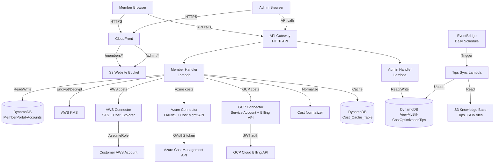
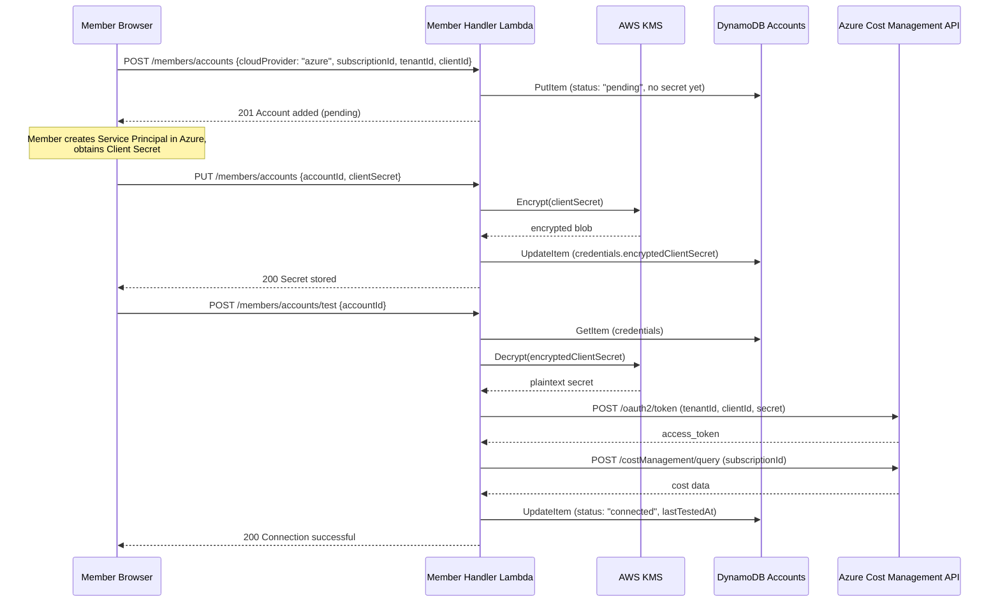
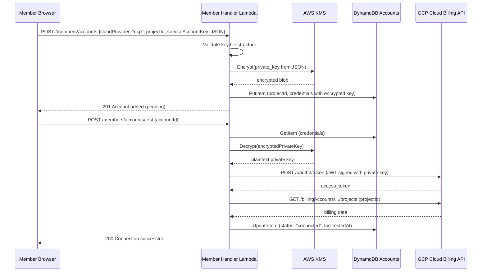

# Design Document: Multi-Cloud Support

## Overview

This design extends the SlashMyBill FinOps platform from an AWS-only solution to a multi-cloud platform supporting AWS, Microsoft Azure, and Google Cloud Platform (GCP). The extension follows a provider-abstraction pattern where each cloud provider has a dedicated connector module, while a shared Cost Normalizer transforms provider-specific responses into a unified schema for display and AI analysis.

### Key Design Decisions

1. **Provider Connector Pattern** — Each cloud provider (AWS, Azure, GCP) gets a dedicated connector module implementing a common interface (`authenticate`, `test_connection`, `get_cost_data`). This isolates provider-specific logic and makes adding future providers straightforward.

2. **Credentials stored encrypted in DynamoDB** — Azure Client Secrets and GCP private keys are encrypted with AWS KMS before storage in the existing `MemberPortal-Accounts` table. Decryption happens only at connection-test or cost-retrieval time, with plaintext discarded immediately after use.

3. **Backward-compatible schema extension** — The existing Accounts table gains a `cloudProvider` attribute and a `credentials` map. Records without `cloudProvider` default to `"aws"` in all read paths, ensuring zero disruption for existing members.

4. **Unified cost normalization** — A `Cost_Normalizer` module transforms provider-specific cost responses (AWS Cost Explorer, Azure Cost Management, GCP BigQuery Billing) into a common schema: `{date, service_name, cost_amount, currency, cloud_provider, account_id}`.

5. **Daily tips sync via EventBridge + Lambda** — A scheduled Lambda reads curated JSON files for Azure and GCP tips and upserts them into the existing Tips table with a `cloudProvider` attribute. Tips removed from source are marked `deprecated` rather than deleted.

6. **Frontend provider selection** — The "Add Account" flow gains a provider-selection step before showing provider-specific forms. The dashboard gains provider icons, color coding, and filter toggles.

7. **Existing AWS flow unchanged** — The CloudFormation template generation, STS AssumeRole connection test, and Cost Explorer retrieval remain identical. The only addition is the `cloudProvider: "aws"` attribute on new records.

## Architecture

### System Context Diagram



### Connection Flow — Azure



### Connection Flow — GCP



## Components and Interfaces

### 1. Provider Connector Interface (Python module pattern)

Each connector implements the same interface:

```python
class ProviderConnector:
    """Base interface for cloud provider connectors."""
    
    def authenticate(self, credentials: dict) -> dict:
        """Authenticate with the provider. Returns auth context (token, session, etc.)."""
        raise NotImplementedError
    
    def test_connection(self, auth_context: dict, account_id: str) -> dict:
        """Test connectivity by reading cost data. Returns {success, message, details}."""
        raise NotImplementedError
    
    def get_cost_data(self, auth_context: dict, account_id: str, start_date: str, end_date: str) -> list[dict]:
        """Retrieve cost data for the given period. Returns list of raw cost records."""
        raise NotImplementedError
```

### 2. AWS Connector (existing, unchanged)

**Module:** `member-handler/connectors/aws_connector.py`

- Uses STS `AssumeRole` with external ID derived from member email
- Calls `ce:GetCostAndUsage` for cost data
- Existing logic extracted into connector pattern (no behavior change)

### 3. Azure Connector (new)

**Module:** `member-handler/connectors/azure_connector.py`

**Authentication:**
- OAuth2 client credentials flow: `POST https://login.microsoftonline.com/{tenantId}/oauth2/v2.0/token`
- Scope: `https://management.azure.com/.default`
- Requires: Tenant ID, Client ID, Client Secret

**Cost Data Retrieval:**
- `POST https://management.azure.com/subscriptions/{subscriptionId}/providers/Microsoft.CostManagement/query?api-version=2023-11-01`
- Request body specifies time period, granularity (daily), and grouping by service name
- Response contains rows with `[cost, date, serviceName, currency]`

**Dependencies:** `requests` library (already available in Lambda layer) or `urllib3` (built-in)

### 4. GCP Connector (new)

**Module:** `member-handler/connectors/gcp_connector.py`

**Authentication:**
- Self-signed JWT: Create JWT with `iss` = service account email, `scope` = `https://www.googleapis.com/auth/cloud-billing.readonly`
- Sign with private key from service account JSON
- Exchange for access token: `POST https://oauth2.googleapis.com/token`

**Cost Data Retrieval:**
- Option A (BigQuery Billing Export): `POST https://bigquery.googleapis.com/bigquery/v2/projects/{projectId}/queries` — query the billing export dataset
- Option B (Cloud Billing API): `GET https://cloudbilling.googleapis.com/v1/billingAccounts/{billingAccountId}/projects` for project billing info
- Primary approach: Cloud Billing API for simplicity; BigQuery for detailed breakdowns if billing export is configured

**Dependencies:** `PyJWT` (already in Lambda for member auth), `cryptography` (for RS256 signing)

### 5. Cost Normalizer (new)

**Module:** `member-handler/cost_normalizer.py`

**Responsibilities:**
- Transform AWS Cost Explorer response → common schema
- Transform Azure Cost Management response → common schema
- Transform GCP Billing response → common schema
- Aggregate costs across providers for unified display
- Handle currency (all providers report in USD by default; pass through as-is)

**Common Schema:**
```python
NormalizedCostRecord = {
    "date": str,            # "2024-01-15"
    "service_name": str,    # "Virtual Machines", "Compute Engine", "Amazon EC2"
    "cost_amount": float,   # 45.23
    "currency": str,        # "USD"
    "cloud_provider": str,  # "aws" | "azure" | "gcp"
    "account_id": str,      # The provider-specific account identifier
}
```

### 6. Member Handler Lambda (extended)

**New/Modified Routes:**

| Method | Path | Change | Description |
|--------|------|--------|-------------|
| POST | /members/accounts | Modified | Accept `cloudProvider` field, route to provider-specific validation |
| POST | /members/accounts/test | Modified | Dispatch to correct connector based on `cloudProvider` |
| GET | /members/accounts | Modified | Return `cloudProvider` field, backfill "aws" for legacy records |
| GET | /members/dashboard-data | Modified | Aggregate cost data across all providers |
| POST | /members/accounts/ai-query | Modified | Include multi-cloud context in AI prompt |

**Input Validation (provider-specific):**
- AWS: `accountId` must match `^\d{12}$`
- Azure: `subscriptionId` must match UUID format `^[0-9a-f]{8}-[0-9a-f]{4}-[0-9a-f]{4}-[0-9a-f]{4}-[0-9a-f]{12}$` (case-insensitive), `tenantId` same UUID format
- GCP: `projectId` must match `^[a-z][a-z0-9-]{4,28}[a-z0-9]$`

### 7. Admin Handler Lambda (extended)

**New/Modified Routes:**

| Method | Path | Change | Description |
|--------|------|--------|-------------|
| GET | /admin/tips | Modified | Accept `?cloudProvider=` filter param, backfill `cloud` field |
| POST | /admin/tips | Modified | Require `cloudProvider` field on new tips |
| GET | /admin/tips-sync/status | Modified | Return per-provider sync status |

### 8. Tips Sync Lambda (extended)

**Module:** `tips-sync/lambda_function.py` (existing, extended)

**New Behavior:**
- Read `azure-cost-optimization-tips.json` from S3 knowledge base
- Read `gcp-cost-optimization-tips.json` from S3 knowledge base
- Upsert tips with `cloudProvider` attribute
- Compare by composite key `(service, tipId)` — update only changed tips
- Mark removed tips as `deprecated: true`
- Log per-provider sync summary
- Continue processing remaining providers if one fails

### 9. Frontend — Member Portal (extended)

**New UI Elements:**
- Provider selection step in "Add Account" modal (3 cards: AWS, Azure, GCP with logos)
- Provider-specific forms after selection
- Provider icons in accounts list (AWS orange, Azure blue, GCP red)
- Provider filter toggle on dashboard
- Provider breakdown pie chart
- Provider-specific identifier labels ("Account ID", "Subscription ID", "Project ID")
- Summary count of accounts per provider in dashboard header

### 10. Frontend — Admin Panel (extended)

**New UI Elements:**
- "Cloud Provider" dropdown in tip creation/edit form
- Provider tabs/filter on tips list page
- Per-provider sync status display with last sync timestamp

## Data Models

### Accounts Table Schema (extended)

**Table:** `MemberPortal-Accounts`
**Partition Key:** `memberEmail` (String)
**Sort Key:** `accountId` (String)

| Attribute | Type | Required | Description |
|-----------|------|----------|-------------|
| memberEmail | String | Yes | Member's email (PK) |
| accountId | String | Yes | Provider-specific ID (SK): AWS 12-digit, Azure Subscription UUID, GCP Project ID |
| accountName | String | Yes | Display name |
| cloudProvider | String | Yes* | "aws", "azure", or "gcp" (*defaults to "aws" for legacy records) |
| connectionStatus | String | Yes | "pending", "connected", "failed", "partial" |
| addedAt | String | Yes | ISO 8601 timestamp |
| lastTestedAt | String | No | ISO 8601 timestamp of last successful test |
| roleName | String | No | AWS only: IAM role name |
| credentials | Map | No | Encrypted provider-specific credentials |

**Credentials Map Structure:**

For Azure:
```json
{
  "tenantId": "uuid-string",
  "clientId": "uuid-string",
  "encryptedClientSecret": "base64-encoded-kms-ciphertext"
}
```

For GCP:
```json
{
  "clientEmail": "sa@project.iam.gserviceaccount.com",
  "projectId": "my-project-123",
  "privateKeyId": "key-id",
  "encryptedPrivateKey": "base64-encoded-kms-ciphertext"
}
```

For AWS: No `credentials` map needed (uses STS AssumeRole with role name).

### Tips Table Schema (extended)

**Table:** `ViewMyBill-CostOptimizationTips`
**Partition Key:** `service` (String)
**Sort Key:** `tipId` (String)

| Attribute | Type | Required | Description |
|-----------|------|----------|-------------|
| service | String | Yes | Service name (PK) |
| tipId | String | Yes | Unique tip ID (SK), e.g., "azure-vm-001" |
| cloudProvider | String | Yes* | "aws", "azure", or "gcp" (*backfill "aws" for legacy) |
| category | String | Yes | Tip category |
| title | String | Yes | Short title |
| description | String | Yes | Detailed recommendation |
| estimatedSavings | String | No | Expected savings range |
| difficulty | String | No | "easy", "medium", "hard" |
| deprecated | Boolean | No | True if removed from source file |
| lastSyncedAt | String | No | ISO 8601 timestamp of last sync |

### Cost Cache Table Schema (existing, extended key format)

**Table:** `Cost_Cache_Table`
**Partition Key:** `cacheKey` (String)

Cache key format extended to include provider:
- Old: `{memberEmail}#{accountId}#{dateRange}`
- New: `{memberEmail}#{cloudProvider}#{accountId}#{dateRange}`

### Knowledge Base Files (new)

```
knowledge-base/
├── aws-cost-optimization-tips.json     # Existing
├── azure-cost-optimization-tips.json   # New
└── gcp-cost-optimization-tips.json     # New
```

Each file follows the same structure as the existing AWS tips file:
```json
{
  "version": "1.0",
  "lastUpdated": "2026-XX-XX",
  "cloudProvider": "azure",
  "tips": [
    {
      "id": "azure-vm-001",
      "service": "Virtual Machines",
      "category": "right-sizing",
      "title": "...",
      "description": "...",
      "estimatedSavings": "20-40%",
      "difficulty": "easy"
    }
  ]
}
```

### API Request/Response Models

**POST /members/accounts (extended)**
```
Request:  {
  "cloudProvider": "aws" | "azure" | "gcp",
  "accountId": string,          // AWS: 12 digits, Azure: subscription UUID, GCP: project ID
  "accountName": string,        // Optional display name
  // Azure-specific:
  "tenantId": string,           // UUID
  "clientId": string,           // UUID
  "clientSecret": string,       // Optional, can be added later
  // GCP-specific:
  "serviceAccountKey": object   // Full JSON key file content
}
Response: { "message": string, "account": AccountRecord }
```

**POST /members/accounts/test (extended)**
```
Request:  { "accountId": string }
Response: { 
  "message": string, 
  "connectionStatus": string,
  "cloudProvider": string,
  "details": { ... provider-specific details ... }
}
```

**GET /members/dashboard-data (extended response)**
```
Response: {
  "costByProvider": {
    "aws": { "total": number, "services": [...] },
    "azure": { "total": number, "services": [...] },
    "gcp": { "total": number, "services": [...] }
  },
  "totalCost": number,
  "providerBreakdown": [
    { "provider": "aws", "amount": number, "percentage": number },
    ...
  ],
  // ... existing fields preserved
}
```


## Correctness Properties

*A property is a characteristic or behavior that should hold true across all valid executions of a system — essentially, a formal statement about what the system should do. Properties serve as the bridge between human-readable specifications and machine-verifiable correctness guarantees.*

### Property 1: Provider-specific input format validation

*For any* string input, the provider-specific validators should accept it if and only if it matches the correct format: AWS Account ID accepts exactly 12-digit strings, Azure Subscription/Tenant ID accepts valid UUID strings (case-insensitive), and GCP Project ID accepts 6-to-30 character strings of lowercase alphanumeric characters and hyphens starting with a letter. All other strings should be rejected.

**Validates: Requirements 1.5**

### Property 2: Account creation stores correct cloudProvider

*For any* valid account submission with a specified cloudProvider value ("aws", "azure", or "gcp"), the stored record in the Accounts Table SHALL contain that exact cloudProvider value, the correct provider-specific identifier as the accountId, and a connectionStatus of "pending".

**Validates: Requirements 1.6, 2.1, 3.1, 9.1**

### Property 3: GCP service account key file validation

*For any* JSON object, the GCP key file validator should accept it if and only if it contains all required fields: `type`, `project_id`, `private_key_id`, `private_key`, and `client_email`. Objects missing any of these fields should be rejected with a 400 status.

**Validates: Requirements 3.3, 3.6**

### Property 4: Credential encryption round-trip

*For any* sensitive credential string (Azure Client Secret or GCP private key), after storage the encrypted value in the database should not equal the plaintext input, and after decryption the recovered value should equal the original plaintext input.

**Validates: Requirements 2.4, 3.4, 10.1**

### Property 5: Successful connection test updates status

*For any* account (regardless of cloud provider) where the connection test succeeds, the Account API SHALL update the connectionStatus to "connected" and set lastTestedAt to a valid ISO 8601 timestamp that is greater than or equal to the time the test was initiated.

**Validates: Requirements 4.2, 4.5**

### Property 6: Cost normalization produces complete common schema

*For any* valid provider-specific cost response (from AWS Cost Explorer, Azure Cost Management, or GCP Billing API), the Cost Normalizer SHALL produce records where every record contains all required fields: `date` (valid date string), `service_name` (non-empty string), `cost_amount` (non-negative number), `currency` (non-empty string), `cloud_provider` (one of "aws", "azure", "gcp"), and `account_id` (non-empty string).

**Validates: Requirements 5.3, 6.4**

### Property 7: Provider breakdown percentages are consistent

*For any* set of cost amounts across multiple providers where total cost is greater than zero, the provider breakdown percentages SHALL each be non-negative, sum to 100% (within floating-point tolerance of ±0.01%), and each percentage SHALL equal that provider's cost divided by total cost times 100.

**Validates: Requirements 5.4**

### Property 8: Only connected accounts contribute to cost calculations

*For any* set of accounts with mixed connectionStatus values ("pending", "connected", "failed", "partial"), the unified cost calculation SHALL include cost data only from accounts with connectionStatus equal to "connected". Accounts with any other status SHALL be excluded from totals.

**Validates: Requirements 5.6**

### Property 9: Failed account retrieval does not block others

*For any* set of N accounts where K accounts fail cost retrieval (0 ≤ K < N), the system SHALL still return normalized cost data for the remaining N-K successful accounts. The total result set size should equal the sum of records from successful accounts.

**Validates: Requirements 6.5**

### Property 10: Cache key uniquely identifies provider and account

*For any* cost data retrieval, the cache key stored in Cost_Cache_Table SHALL contain both the cloudProvider value and the accountId, ensuring that the same accountId string used across different providers produces distinct cache keys.

**Validates: Requirements 6.6**

### Property 11: Admin tips filtering returns only matching provider

*For any* cloudProvider filter value and any set of tips in the Tips Table, the filtered result SHALL contain only tips whose cloudProvider attribute matches the filter value. No tips from other providers should appear in the result.

**Validates: Requirements 7.4**

### Property 12: Member sees only tips for connected providers

*For any* member with a specific set of connected cloud providers, the tips displayed to that member SHALL include only tips whose cloudProvider attribute matches one of the member's connected providers. Tips for providers the member has not connected SHALL be excluded.

**Validates: Requirements 7.6**

### Property 13: Tips sync updates only changed tips and preserves admin modifications

*For any* set of source tips and existing tips in the database, the sync operation SHALL: (a) not modify tips whose content matches the source, (b) update only tips where source content differs from stored content, and (c) preserve any admin-modified fields (fields not present in the source file) on updated records.

**Validates: Requirements 8.4, 8.5**

### Property 14: Removed tips are deprecated, not deleted

*For any* tip that exists in the Tips Table but is absent from the current source file, the sync operation SHALL set `deprecated: true` on that record rather than deleting it. The record SHALL remain queryable in the database after sync completes.

**Validates: Requirements 8.6**

### Property 15: Sync summary counts match actual operations

*For any* sync execution, the logged summary counts (tips added, tips updated, tips deprecated) SHALL exactly equal the number of actual insert, update, and deprecation operations performed during that sync run.

**Validates: Requirements 8.7**

### Property 16: Sync continues processing after single-provider failure

*For any* sync execution where one provider's source file is unavailable or malformed, the sync SHALL still complete processing for the remaining provider(s) and produce correct results for those providers.

**Validates: Requirements 8.8**

### Property 17: Legacy records default to AWS

*For any* account record in the Accounts Table that lacks a `cloudProvider` attribute, all read operations SHALL return that record with `cloudProvider` set to "aws".

**Validates: Requirements 9.3, 13.2**

### Property 18: Duplicate accountId rejected regardless of provider

*For any* member who already has an account with a given accountId, attempting to add another account with the same accountId (regardless of the cloudProvider value specified) SHALL result in a 409 Conflict response and the existing record SHALL remain unchanged.

**Validates: Requirements 9.4, 9.5**

### Property 19: Only valid cloudProvider values accepted

*For any* string value submitted as the `cloudProvider` field that is not exactly one of "aws", "azure", or "gcp", the Account API SHALL reject the request with a 400 status. Only these three exact string values are accepted.

**Validates: Requirements 9.6**

### Property 20: No sensitive credentials in API responses

*For any* API response from account-related endpoints (GET /members/accounts, POST /members/accounts, POST /members/accounts/test), the response body SHALL never contain the values of sensitive credential fields (Azure Client Secret, GCP private key, encrypted blobs). Only non-sensitive identifiers (Subscription ID, Tenant ID, Client ID, Project ID, client_email) may appear.

**Validates: Requirements 10.3**

## Error Handling

### Provider Connection Errors

| Scenario | Provider | HTTP Status | User Message |
|----------|----------|-------------|--------------|
| Invalid Service Principal credentials | Azure | 400 | "Azure authentication failed. Please verify your Service Principal credentials (Tenant ID, Client ID, Client Secret) and ensure the 'Cost Management Reader' role is assigned." |
| Expired Client Secret | Azure | 400 | "Azure Client Secret has expired. Please generate a new secret in Azure AD and update it here." |
| Insufficient permissions | Azure | 400 | "Azure connection succeeded but cost data access was denied. Please verify the 'Cost Management Reader' role is assigned to the subscription." |
| Invalid service account key | GCP | 400 | "GCP authentication failed. Please verify your service account key file is valid and the account has 'Billing Account Viewer' role." |
| Billing not enabled | GCP | 400 | "GCP billing data is not accessible. Please ensure billing is enabled for this project and the service account has appropriate permissions." |
| KMS decryption failure | Any | 500 | "Unable to access stored credentials. Please contact support." |
| Provider API timeout | Any | 504 | "Connection to {provider} timed out. Please try again." |
| Provider API rate limit | Any | 429 | "{Provider} API rate limit reached. Please wait a moment and try again." |
| Invalid cloudProvider value | Any | 400 | "Invalid cloud provider. Supported values: aws, azure, gcp." |
| Duplicate account | Any | 409 | "An account with this identifier is already connected." |
| Malformed GCP key file | GCP | 400 | "The service account key file is invalid. Required fields: type, project_id, private_key_id, private_key, client_email." |

### Tips Sync Errors

| Scenario | Behavior |
|----------|----------|
| Source file not found in S3 | Log error, skip provider, continue with others |
| Source file malformed JSON | Log error with file details, skip provider, continue |
| DynamoDB write throttled | Retry with exponential backoff (3 attempts) |
| DynamoDB batch write partial failure | Retry failed items, log any persistent failures |
| Lambda timeout approaching | Log partial progress, mark sync as incomplete |

### Backward Compatibility Error Handling

- All existing AWS error messages and HTTP status codes remain unchanged
- New provider-specific errors use the same response format: `{"error": "ErrorCode", "message": "Human-readable message"}`
- Legacy records without `cloudProvider` never trigger validation errors on read

## Testing Strategy

### Dual Testing Approach

This feature requires both unit tests and property-based tests:

- **Unit tests**: Verify specific examples, integration points with external APIs (mocked), edge cases, and error conditions
- **Property-based tests**: Verify universal properties across randomly generated inputs for validation logic, data transformation, and business rules

### Property-Based Testing Configuration

- **Library**: [Hypothesis](https://hypothesis.readthedocs.io/) for Python (backend Lambda tests)
- **Minimum iterations**: 100 per property test
- **Each property test must reference its design document property**
- **Tag format**: `Feature: multi-cloud-support, Property {number}: {property_text}`
- **Each correctness property is implemented by a single property-based test**

### Backend Tests (Python + Hypothesis)

**Property Tests:**

| Property | Test Description | Generator Strategy |
|----------|-----------------|-------------------|
| P1 | Input format validation | `st.text()` for random strings + `st.from_regex()` for valid formats |
| P2 | Account creation stores cloudProvider | `st.sampled_from(["aws","azure","gcp"])` + provider-specific ID generators |
| P3 | GCP key file validation | `st.fixed_dictionaries()` with optional keys removed |
| P4 | Credential encryption round-trip | `st.text(min_size=1, max_size=1000)` for secrets + mock KMS |
| P5 | Connection status update | `st.sampled_from(providers)` + mock connectors |
| P6 | Cost normalization schema | Custom strategies generating provider-specific responses |
| P7 | Percentage consistency | `st.lists(st.floats(min_value=0.01, max_value=1000000), min_size=2, max_size=3)` |
| P8 | Only connected accounts in calculations | `st.lists(st.tuples(st.sampled_from(statuses), st.floats()))` |
| P9 | Failed accounts don't block others | `st.lists(st.booleans())` for success/failure per account |
| P10 | Cache key uniqueness | `st.tuples(st.sampled_from(providers), st.text(min_size=1))` |
| P11 | Admin tips filtering | `st.lists(tip_strategy)` + `st.sampled_from(providers)` |
| P12 | Member tips filtering | `st.sets(st.sampled_from(providers))` + `st.lists(tip_strategy)` |
| P13 | Sync preserves admin fields | Custom strategy for source/existing tip pairs |
| P14 | Deprecated not deleted | `st.lists(tip_strategy)` for existing, subset for source |
| P15 | Sync summary counts | Custom strategy for sync scenarios |
| P16 | Sync continues after failure | `st.lists(st.booleans(), min_size=2, max_size=3)` for provider success |
| P17 | Legacy records default aws | `st.fixed_dictionaries()` without cloudProvider field |
| P18 | Duplicate rejection | `st.text(min_size=1)` for accountId + `st.sampled_from(providers)` |
| P19 | Valid cloudProvider values | `st.text()` for random strings |
| P20 | No secrets in responses | Custom strategy generating accounts with credentials |

**Unit Tests:**

- Azure OAuth2 token exchange (mock Azure API, verify request format)
- GCP JWT signing and token exchange (mock GCP API, verify JWT claims)
- AWS connection test unchanged behavior (regression)
- CloudFormation template generation unchanged (regression)
- KMS encryption failure handling (mock KMS error)
- Provider API timeout handling (mock timeout)
- Add account without auth token (verify 401)
- Azure account without Client Secret (verify pending status)
- Dashboard with mixed provider accounts (verify UI data structure)
- AI chat context includes provider list (verify prompt construction)
- Tips sync with empty source file (verify graceful handling)
- Tips sync with malformed JSON (verify error logging)

### Frontend Tests (JavaScript)

**Unit Tests:**
- Provider selection modal shows 3 options
- Selecting AWS shows 12-digit form
- Selecting Azure shows Subscription/Tenant/Client ID form
- Selecting GCP shows Project ID + file upload form
- Provider icons rendered correctly for each provider
- Provider filter toggle works
- Dashboard shows combined totals
- Account list shows provider-specific labels

### Test File Structure

```
member-handler/
├── connectors/
│   ├── __init__.py
│   ├── aws_connector.py
│   ├── azure_connector.py
│   ├── gcp_connector.py
│   └── base_connector.py
├── cost_normalizer.py
├── tests/
│   ├── test_validation_properties.py      # P1, P2, P3, P19
│   ├── test_encryption_properties.py      # P4
│   ├── test_connection_properties.py      # P5, P18
│   ├── test_normalizer_properties.py      # P6, P7, P8, P9, P10
│   ├── test_tips_properties.py            # P11, P12
│   ├── test_sync_properties.py            # P13, P14, P15, P16
│   ├── test_backward_compat_properties.py # P17
│   ├── test_security_properties.py        # P20
│   ├── test_azure_connector_unit.py       # Azure integration mocks
│   ├── test_gcp_connector_unit.py         # GCP integration mocks
│   ├── test_aws_connector_unit.py         # AWS regression tests
│   └── conftest.py                        # Shared fixtures, mock KMS/DynamoDB
tips-sync/
├── tests/
│   ├── test_sync_unit.py                  # Sync behavior with mocks
│   └── conftest.py
```
