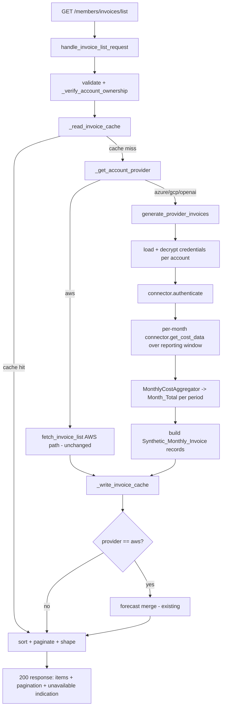
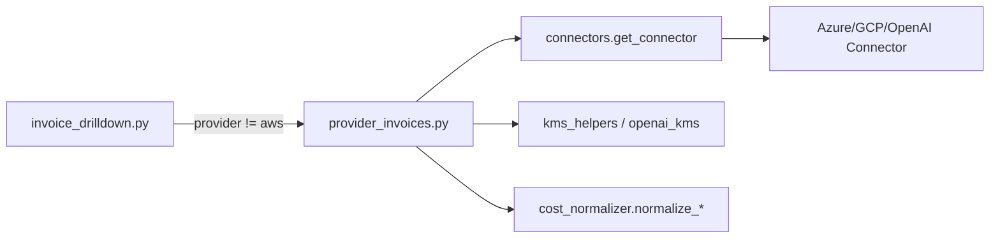

# Design Document

## Overview

The Invoice Explorer in the SlashMyBill member portal currently produces monthly invoices for AWS accounts only. When the AWS Invoicing API is unavailable, AWS invoices are synthesized from Cost Explorer monthly aggregation: one record per month with `invoiceId` `"<YYYY-MM>-monthly"`, issuer `"Amazon Web Services"`, status `"paid"`, a payment date on the 15th of the following month, and a 90-day-TTL cache row in `MemberPortal-Invoices` under `INV#{invoiceId}` with `recordType` `"real"`.

This feature extends that synthetic-monthly-invoice model to **every** connected provider — AWS, Azure, GCP, and the OpenAI AI vendor — so the per-account Invoice Explorer shows monthly invoices for whichever provider the selected account belongs to. It reuses the existing five-column shape (Invoice ID, Issued By, Payment Date, Status, Total Amount), the identical `MemberPortal-Invoices` caching scheme, and the existing `GET /members/invoices/list` and `POST /members/invoices/refresh` endpoints in `member-handler/invoice_drilldown.py`.

The design is deliberately additive and non-disruptive:

- **AWS behavior is unchanged.** AWS accounts continue to flow through the existing `fetch_invoice_list` → Invoicing API / Cost Explorer fallback path. No AWS code path is modified.
- **Non-AWS cost data** is retrieved through the existing `ProviderConnector` abstraction (`member-handler/connectors/`), where each connector exposes `authenticate(credentials)` and `get_cost_data(auth_context, account_id, start_date, end_date)`, with per-account credentials decrypted from KMS using an encryption context of `memberEmail` + `accountId`.
- **Forecasting remains AWS-only.** Non-AWS accounts show real monthly invoices but never a `Forecast-<YYYY-MM>` row, consistent with the prior `invoice-forecast-and-ai-cost-rename` spec.
- **OpenAI display rename.** OpenAI invoices store the issuer as `"OpenAI"` and carry the internal Provider_Key `openai` unchanged; the user-facing "Issued By" column is rendered as "AI Cost" purely at the presentation layer (the existing `_aiCostIssuerLabel` helper in `members/members.js`).

### Key existing facts the design aligns with

| Concern | Existing implementation |
|---|---|
| Invoice list handler | `handle_invoice_list_request(event, member_email)` in `invoice_drilldown.py` |
| Refresh handler | `handle_drilldown_refresh_request(event, member_email)` (5-minute per-account cooldown) |
| AWS synthetic generation | Cost Explorer fallback in `invoice_drilldown.py` (`<YYYY-MM>-monthly`, issuer `"Amazon Web Services"`, pay date 15th of next month, `<0.01` omitted) |
| Provider lookup | `_get_account_provider(member_email, account_id)` — absent/empty `cloudProvider` defaults to `aws` |
| Cache read/write | `_read_invoice_cache` / `_write_invoice_cache` — PK `{memberEmail}#{accountId}`, SK `INV#{invoiceId}`, `recordType="real"`, `ttl = now + 7776000` (90 days) |
| Connector registry | `connectors.get_connector(provider_name)` returns a connector instance or `None` |
| Connector cost shape | Azure/GCP `get_cost_data` returns `{cost_by_service: [{service, cost_usd}], daily_cost_trend, provider, error}`; OpenAI returns a raw list normalized via `cost_normalizer.normalize_openai` |
| Credential storage | Account record `credentials` dict — Azure `encryptedClientSecret`/`tenantId`/`clientId`, OpenAI `encryptedApiKey`; OpenAI decrypts with `decrypt_openai_key(enc, memberEmail, accountId)` (KMS encryption context) |
| Frontend rename | `_aiCostIssuerLabel(issuer)` maps stored `"OpenAI"` → `"AI Cost"`; account-list rename keys off `cloudProvider === 'openai'` |

## Architecture

The feature inserts a **provider router** at the top of the invoice-generation path. `handle_invoice_list_request` already resolves the Provider_Key via `_get_account_provider`. The new logic branches on that key:

- `aws` → existing AWS path (unchanged).
- `azure` / `gcp` / `openai` → new `generate_provider_invoices(...)` path that authenticates the connector, fetches monthly Cost_Data, aggregates Month_Totals, and builds Synthetic_Monthly_Invoice records in the identical shape.

Both branches then share the existing caching, sorting, pagination, and response-shaping code. Forecast merge runs only for `aws` (the existing `_get_or_refresh_forecast` already gates on `invoice_forecast.is_aws_provider(provider_key)`).



### New module

A new helper module `member-handler/provider_invoices.py` holds the non-AWS generation logic so `invoice_drilldown.py` only gains a thin branch. It depends only on `connectors`, `cost_normalizer`, and standard library, keeping it unit-testable in isolation.



## Components and Interfaces

### 1. Provider router (in `invoice_drilldown.py`)

The cache-miss branch of `handle_invoice_list_request` changes from "always call `fetch_invoice_list`" to:

```python
provider_key = _get_account_provider(member_email, account_id)  # 'aws' default
if provider_key == 'aws':
    items = fetch_invoice_list(member_email, account_id)        # unchanged
    provider_unavailable = False
else:
    items, provider_unavailable = generate_provider_invoices(
        member_email, account_id, provider_key)
```

`provider_unavailable` is surfaced in the response as an `invoiceDataUnavailable` flag (Req 6.4, 7.2). The existing `forecastUnavailable`/`forecastDiag` fields are retained unchanged.

The refresh handler (`handle_drilldown_refresh_request`) re-uses the same router for its re-fetch step: after deleting `INV#` rows, it regenerates via the AWS path for `aws` and via `generate_provider_invoices` for non-AWS, keeping the existing 5-minute cooldown and error semantics (Req 9).

### 2. `provider_invoices.generate_provider_invoices(member_email, account_id, provider_key)`

Signature:

```python
def generate_provider_invoices(member_email, account_id, provider_key) -> tuple[list[dict], bool]:
    """Return (invoice_records, unavailable_flag) for a non-AWS account.

    invoice_records are dicts in the canonical invoice shape ready for
    _write_invoice_cache. unavailable_flag is True when cost retrieval
    failed (caller preserves any existing cached rows and returns them).
    """
```

Responsibilities:
1. Resolve the connector via `connectors.get_connector(provider_key)`. If `None`, return `([], True)`.
2. Load and decrypt credentials for the account (see component 3). On failure, log without secrets and return `([], True)` (Req 6.4).
3. Call `connector.authenticate(credentials)`. On `AuthenticationError`, return `([], True)`.
4. Build the reporting window: the first day of the month 12 months ago through the first day of the next month (mirrors the AWS Cost Explorer fallback window).
5. For each Billing_Period in the window, call `connector.get_cost_data(auth, account_id, month_start, month_end)` with `YYYY-MM-DD` dates and reduce it to one Month_Total via `MonthlyCostAggregator`. Any `CostRetrievalError` aborts further fetching and sets the unavailable flag, but already-computed months are still returned (Req 7.1).
6. Build a Synthetic_Monthly_Invoice for each period whose `abs(Month_Total) >= 0.01` (Req 1.6).
7. Return `(records, unavailable_flag)`.

It never raises to the caller for provider failures; it converts them into the unavailable flag so the endpoint stays 200 (Req 7.4).

### 3. Credential loading (`provider_invoices._load_credentials`)

Reads the account record from `MemberPortal-Accounts` and constructs the provider-specific `credentials` dict expected by each connector's `authenticate`, mirroring the patterns already in `lambda_function.py`:

| Provider | Credentials dict built |
|---|---|
| `azure` | `{tenant_id, client_id, client_secret}` where `client_secret = decrypt_credential(credentials['encryptedClientSecret'])` |
| `gcp` | service-account JSON decrypted via `decrypt_credential(...)` |
| `openai` | `{encrypted_api_key, member_email, account_id, org_name}` — the connector itself decrypts with the `memberEmail`+`accountId` encryption context |

Encryption context rule (Req 6.2): wherever a connector or helper decrypts with KMS, it supplies `{memberEmail, accountId}` as the encryption context. For OpenAI this is delegated to `decrypt_openai_key`/the connector; for Azure/GCP the existing `decrypt_credential` path is used as-is.

Secret-safety rule (Req 6.3): decrypted secrets live only in local variables passed to `authenticate`; they are never written to invoice records, response bodies, or logs. Error logs reference only the provider and account id.

### 4. `provider_invoices.MonthlyCostAggregator`

A pure reducer that turns one connector `get_cost_data` result for a single month into a single USD Month_Total, excluding tax (Req 2.2–2.5):

```python
def month_total_from_cost_data(provider_key, cost_data) -> float:
    """Reduce a connector get_cost_data result for one month to a USD total.

    - dict shape (azure/gcp): sum cost_usd over cost_by_service entries,
      skipping any entry whose service name is tax-classified.
    - list shape (openai): normalize via normalize_openai, sum cost_amount,
      excluding any tax-classified records (OpenAI usage has none).
    Returns a float rounded to 2 decimals.
    """
```

Tax exclusion: an entry is tax-classified when its service/line-item name, case-folded and trimmed, equals `"tax"` (consistent with the AWS path that filters `RECORD_TYPE == 'Tax'`).

### 5. Invoice record builder (`provider_invoices._build_invoice_record`)

Produces the canonical dict consumed by `_write_invoice_cache` and the response shaper:

```python
{
  'invoiceId':    f'{period}-monthly',          # Req 1.4
  'issuer':       ISSUER_LABELS[provider_key],   # Req 3.1-3.4
  'paymentDate':  '<15th of month after period>',# Req 11.1
  'paymentStatus':'paid',                        # Req 11.2
  'totalAmount':  round(month_total, 2),         # Req 2.4
  'currency':     'USD',                          # Req 10.1-10.2
  'period':       period,                         # Req 1.5 (YYYY-MM)
  'source':       f'{provider_key}_connector',
}
```

`ISSUER_LABELS = {'aws': 'Amazon Web Services', 'azure': 'Microsoft Azure', 'gcp': 'Google Cloud', 'openai': 'OpenAI'}`. The stored OpenAI issuer is `"OpenAI"`; the "AI Cost" string is applied only at render time (Req 3.4, 3.5).

Payment-date computation reuses the exact AWS logic: for period `YYYY-MM`, payment date is `YYYY-(MM+1)-15`, rolling to January of the next year when the period is December.

### 6. Frontend (presentation only, `members/members.js`)

The Invoice Explorer table already renders five columns and already maps the issuer with `_aiCostIssuerLabel(inv.issuer) || 'Amazon Web Services'`. Two refinements (Req 3.6, 11.4):

- The empty-issuer fallback must resolve to the **selected account's** Provider_Display_Name rather than always `"Amazon Web Services"`. The renderer derives the fallback from the currently selected account's `cloudProvider` via a `_providerDisplayName(key)` helper (`aws`→Amazon Web Services, `azure`→Microsoft Azure, `gcp`→Google Cloud, `openai`→AI Cost).
- `_aiCostIssuerLabel` continues to map a stored `"OpenAI"` issuer to `"AI Cost"`.

No change to column order, sorting controls, pagination controls, or the `/members/invoices/list` request shape.

## Data Models

### Invoice_Record (canonical, in-memory and cached)

Unchanged from the AWS shape. Same fields for every provider:

| Field | Type | Notes |
|---|---|---|
| `invoiceId` | string | `"<YYYY-MM>-monthly"` |
| `issuer` | string | stored Issuer_Label (`OpenAI` for openai) |
| `paymentDate` | string | `YYYY-MM-DD`, 15th of month after period |
| `paymentStatus` | string | `"paid"` |
| `totalAmount` | number | Month_Total rounded to 2 dp |
| `currency` | string | `"USD"` |
| `period` | string | `YYYY-MM` |
| `source` | string | provenance tag, e.g. `azure_connector` |

### Invoice_Cache row (`MemberPortal-Invoices`) — unchanged scheme

| Attribute | Value |
|---|---|
| `pk` | `{memberEmail}#{accountId}` |
| `sk` | `INV#{invoiceId}` |
| `recordType` | `"real"` |
| `ttl` | `epoch_now + 7776000` (90 days) |
| cost fields | `totalAmount` stored as `Decimal`, plus `issuer`/`paymentDate`/`paymentStatus`/`currency`/`period`/`source`/`lastSyncedAt` |

### Account_Record (`MemberPortal-Accounts`) — read only

Keyed by `memberEmail`; relevant fields `accountId`, `cloudProvider` (Provider_Key; absent/empty → `aws`), and `credentials` (provider-specific encrypted fields).

### Connector Cost_Data shapes (inputs to the aggregator)

- Azure / GCP: `{'cost_by_service': [{'service': str, 'cost_usd': float}], 'daily_cost_trend': [...], 'provider': str, 'error': None}`
- OpenAI: `list` of raw organization-cost records, normalized by `cost_normalizer.normalize_openai` into `{date, service_name, cost_amount, currency, ...}`.

### Reporting window / Billing_Period

A Billing_Period is a calendar month `YYYY-MM`. The window spans the 12 months ending with the current (in-progress) month. Per-month connector calls use `start_date` = first day of the period and `end_date` = first day of the following period, both `YYYY-MM-DD`. The union of these ranges covers the full reporting window (Req 2.1), and each call yields exactly one Month_Total (Req 2.2).

## Correctness Properties

*A property is a characteristic or behavior that should hold true across all valid executions of a system — essentially, a formal statement about what the system should do. Properties serve as the bridge between human-readable specifications and machine-verifiable correctness guarantees.*

The properties below are derived from the prework analysis. Redundant criteria were consolidated (e.g. the issuer-label mappings, the currency-assignment rules, and the provider-failure behaviors each collapse into a single comprehensive property). Criteria that are UI rendering, DynamoDB wiring, or AWS non-regression checks are covered by example/integration tests in the Testing Strategy rather than as properties.

### Property 1: Invoice generated per qualifying period, omitted below the threshold

*For any* non-AWS provider key and any mapping of Billing_Periods to Month_Totals, the generator produces exactly one Synthetic_Monthly_Invoice for each period whose `abs(Month_Total) >= 0.01` and no invoice for any period whose `abs(Month_Total) < 0.01`.

**Validates: Requirements 1.1, 1.6**

### Property 2: invoiceId and period formatting

*For any* Billing_Period `YYYY-MM`, the generated record has `invoiceId == "<YYYY-MM>-monthly"` and `period == "<YYYY-MM>"` matching the `YYYY-MM` format.

**Validates: Requirements 1.4, 1.5**

### Property 3: Monthly aggregation sums connector cost data to one total per period

*For any* connector Cost_Data for a single month (Azure/GCP `cost_by_service` list or OpenAI raw record list), the aggregator returns a single Month_Total equal to the sum of that month's non-tax cost amounts.

**Validates: Requirements 1.2, 2.2**

### Property 4: Tax-classified amounts are excluded from Month_Total

*For any* connector Cost_Data, adding one or more tax-classified entries (service/line-item name equal to "tax", case-insensitive) does not change the computed Month_Total.

**Validates: Requirements 2.3**

### Property 5: Month_Total is rounded to two decimal places

*For any* raw monthly cost sum, the `totalAmount` stored on the invoice equals that sum rounded to 2 decimal places (no more than two fractional digits).

**Validates: Requirements 2.4**

### Property 6: Reporting window date ranges are valid and cover the window

*For any* current date, the constructed per-month request ranges are each valid `YYYY-MM-DD` `start_date`/`end_date` pairs (start = first day of the period, end = first day of the following period), and their union covers exactly the 12 reporting months ending with the current month.

**Validates: Requirements 2.1**

### Property 7: Currency is always USD for the supported providers

*For any* generated invoice record (AWS, Azure, GCP, or OpenAI — all of which report in United States dollars), the `currency` field equals `"USD"`.

**Validates: Requirements 2.5, 10.1, 10.2, 10.4**

### Property 8: Provider-key to issuer/display-name mapping

*For any* provider key, the stored Issuer_Label and the rendered Provider_Display_Name match the fixed mapping — `aws`→"Amazon Web Services", `azure`→"Microsoft Azure", `gcp`→"Google Cloud", `openai`→stored "OpenAI" rendered as "AI Cost".

**Validates: Requirements 3.1, 3.2, 3.3, 3.4, 3.6**

### Property 9: Stored Provider_Key is never mutated

*For any* account, generating and rendering invoices leaves the account's stored Provider_Key byte-for-byte unchanged; the "AI Cost" label is applied only at the presentation layer and does not alter any stored value.

**Validates: Requirements 3.5**

### Property 10: Built record exposes exactly the canonical field set with constant status

*For any* generated invoice record, its field set is exactly `{invoiceId, issuer, paymentDate, paymentStatus, totalAmount, currency, period}` and `paymentStatus == "paid"`.

**Validates: Requirements 4.2, 11.2**

### Property 11: Sorting and pagination are independent of provider/issuer

*For any* list of invoice items with arbitrary issuer values and any valid `page`/`pageSize`/`sortBy`/`sortOrder`, the sorted-and-paginated result depends only on the sort key values and pagination parameters, not on the issuer or provider of the items.

**Validates: Requirements 4.5**

### Property 12: Decrypted secrets never appear in output

*For any* decrypted credential value, the generated invoice records, the serialized response body, and the captured log output contain no occurrence of that secret value.

**Validates: Requirements 6.3**

### Property 13: Provider failure preserves cache and stays successful with an unavailable indication

*For any* set of pre-existing cached invoice items, when credential decryption, authentication, or cost retrieval fails (including the empty-cache case), the list path returns the cached items unchanged, sets the unavailable indication, and does not raise an error to the caller.

**Validates: Requirements 6.4, 7.1, 7.2, 7.4**

### Property 14: Failing cost retrieval does not mutate the cache

*For any* pre-existing cache contents, a failing `get_cost_data` during the list path performs no delete or overwrite of the cached invoice items.

**Validates: Requirements 7.3**

### Property 15: Non-AWS accounts never produce a forecast row

*For any* non-AWS provider key and any set of Month_Totals, the generated output contains no forecast row (no record with `paymentStatus == "Forecast"` and no `FCST#` record).

**Validates: Requirements 8.2**

### Property 16: Refresh failure retains prior cache and signals an error

*For any* pre-existing cache contents, when regeneration during a non-AWS refresh fails, the Refresh_Service returns an error indication and the prior cached invoice items are retained.

**Validates: Requirements 9.3**

### Property 17: Payment date is the 15th of the following month

*For any* Billing_Period `YYYY-MM`, the `paymentDate` equals the 15th day of the immediately following calendar month in `YYYY-MM-DD` format, rolling the year forward when the period is December.

**Validates: Requirements 11.1**

### Property 18: Empty issuer falls back to a non-empty Provider_Display_Name

*For any* provider key and any invoice item whose `issuer` is missing or empty, the rendered "Issued By" value equals the Provider_Display_Name for that key and is never empty.

**Validates: Requirements 11.4**

## Error Handling

The guiding principle (Req 7.4) is that a single provider failure must never break the Invoice Explorer page. All non-AWS failures degrade to a successful, possibly-empty list plus an `invoiceDataUnavailable` indication.

| Failure | Detection | Handling |
|---|---|---|
| No connector registered for provider | `get_connector` returns `None` | Return `([], unavailable=True)`; log provider+account only |
| Credential missing/undecryptable | `KeyError` / `RuntimeError` / `DecryptionError` | Skip provider fetch, return cached items, set unavailable (Req 6.4); never log the secret |
| `authenticate` fails | `AuthenticationError` | Same as above (Req 6.4) |
| `get_cost_data` fails or returns no usable data | `CostRetrievalError` / empty result | Abort further month fetches, return months already computed plus cached items, set unavailable (Req 7.1–7.3); do not delete/overwrite cache |
| Ownership not confirmed | existing `_verify_account_ownership` | 403 AccessDenied, no items (Req 4.4) — unchanged |
| Refresh regeneration fails | exception during re-fetch | Return error indication; retain prior cached `INV#` rows (Req 9.3) |
| Refresh within cooldown | existing cooldown check | 429 RateLimited (Req 9.2) — unchanged |

Implementation notes:
- `generate_provider_invoices` is the failure boundary: it catches connector/credential exceptions internally and converts them to the `(records, unavailable)` tuple so the HTTP handler always returns 200 for the list path.
- The unavailable indication is a boolean field (`invoiceDataUnavailable`) added to the existing list response alongside `forecastUnavailable`; the frontend shows a non-blocking banner and renders whatever items are present (Req 7.4).
- Secret-safety: a single `_load_credentials` function is the only place plaintext secrets exist; they are passed directly to `authenticate` and never returned, stored, or logged (Req 6.3).

## Testing Strategy

This feature contains substantial pure logic (monthly aggregation, tax exclusion, rounding, ID/date formatting, issuer/display mapping, threshold omission, failure orchestration), so **property-based testing is appropriate** and is the primary tool for that logic. DynamoDB caching, KMS decryption, connector authentication, the HTTP handler wiring, and frontend rendering are verified with example/integration tests because their behavior does not vary meaningfully with input and/or depends on external services.

### Dual approach

- **Property tests** (primary, for pure logic): the 18 properties above. Each is implemented as a SINGLE property-based test running a **minimum of 100 iterations**.
- **Unit/example tests**: AWS non-regression (Req 1.3, 8.4, 10.4 AWS branch), cache hit/miss control flow (Req 5.4, 5.5), refresh cooldown and success shape (Req 9.2, 9.4), access-denied gate (Req 4.4), and per-provider handler smoke (Req 4.1).
- **Integration tests** (1–3 examples each, mocked AWS): cache write keys/recordType/TTL (Req 5.1–5.3), KMS encryption-context argument (Req 6.2), connector authenticate plumbing (Req 6.1), refresh clear-and-regenerate (Req 9.1).
- **Frontend example/snapshot tests**: five-column order for each provider (Req 4.3), currency rendering (Req 10.3), status rendering (Req 11.3), no Forecast row for non-AWS (Req 8.3).

### Tooling

- Backend (Python): use **Hypothesis** for property tests and `pytest` with `unittest.mock`/`moto` for example and integration tests. Do not implement property testing from scratch.
- Frontend (`members/members.js`): example/snapshot tests with the project's existing JS test runner; pure display helpers (`_aiCostIssuerLabel`, `_providerDisplayName`) are also exercised by Hypothesis-style generated inputs where a JS property library is available, otherwise table-driven example tests.

### Property test configuration

- Minimum **100 iterations** per property test.
- Each property test is tagged with a comment referencing its design property in the format:
  `# Feature: multi-provider-invoices, Property {number}: {property_text}`
- Each correctness property is implemented by exactly one property-based test.

### Generators

- **Periods**: random `YYYY-MM` within a plausible range, including December (rollover) and month boundaries.
- **Month_Totals**: floats spanning negatives, zero, values straddling the `0.01` threshold, and large magnitudes; plus values with many fractional digits to exercise rounding.
- **Connector Cost_Data**: random `cost_by_service` lists (Azure/GCP) and OpenAI raw record lists, including entries with service/line-item name "Tax"/"tax", empty lists, and duplicate services.
- **Provider keys**: `azure`, `gcp`, `openai` (and `aws` for mapping/currency properties).
- **Cached item sets**: random lists of canonical invoice records for the failure-handling and cache-retention properties, including the empty set.
- **Secrets**: random strings injected as decrypted credential values for the secret-safety property.
