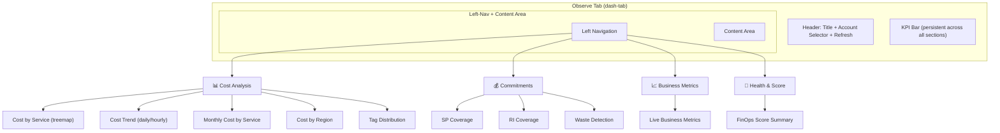
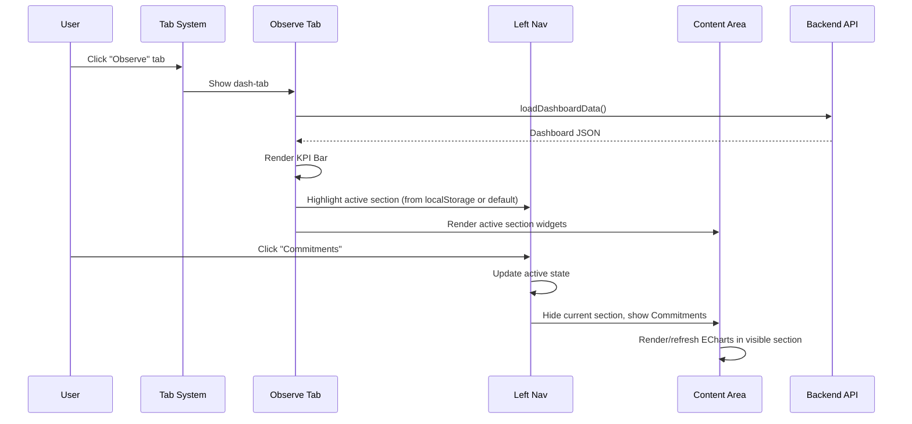
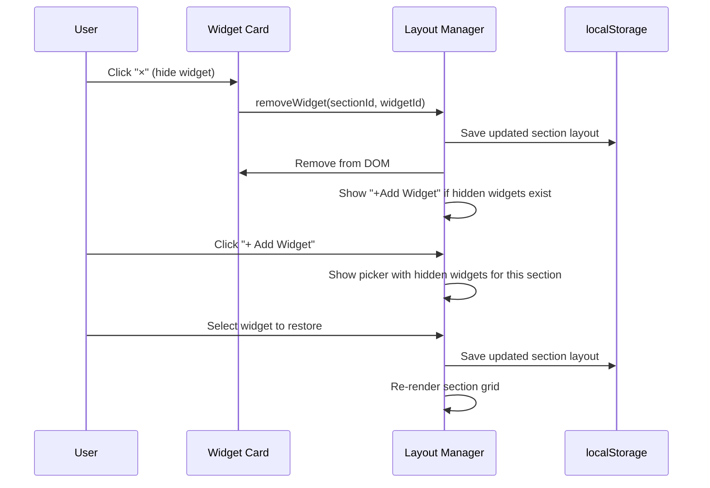

# Design Document: Observe Tab Restructure

## Overview

The Observe tab in the SlashMyBill Member Portal currently presents all dashboard widgets in a flat grid layout. As the platform grows (FinOps Dashboard enhancements, Live Business Metrics, FinOps Settings Healthcheck integration), this flat structure becomes unwieldy and hard to navigate.

This restructure reorganizes the Observe tab into logical sub-sections using the same left-nav + content-area pattern already established in the Plan and Act tabs. Widgets are grouped by domain (Cost Analysis, Commitments & Coverage, Business Metrics, Health & Score), the KPI bar remains at the top as a persistent summary, and each sub-section gets its own content area with relevant widgets. The existing widget customization (hide/reorder/restore via localStorage) is preserved within each section.

The restructure is purely a frontend layout change — no new API endpoints are needed. The existing `loadDashboardData()` call and `renderDashboardWidgets()` function are refactored to route widget rendering to the correct sub-section container.

## Architecture



## Sequence Diagrams

### Tab Load & Section Navigation



### Widget Customization Flow



## Components and Interfaces

### Component 1: Observe Left Navigation

**Purpose**: Provides sub-section navigation within the Observe tab, matching the Act/Plan tab pattern.

**Interface**:
```javascript
// Navigation section definitions
var OBSERVE_SECTIONS = [
    { id: 'observe-cost', label: 'Cost Analysis', icon: '📊' },
    { id: 'observe-commitments', label: 'Commitments', icon: '💰' },
    { id: 'observe-metrics', label: 'Business Metrics', icon: '📈' },
    { id: 'observe-health', label: 'Health & Score', icon: '🏥' }
];

// Switch active section
function _switchObserveSection(sectionId) { /* ... */ }

// Get last active section from localStorage
function _getActiveObserveSection() { /* ... */ }
```

**Responsibilities**:
- Render navigation buttons with icons and labels
- Track active section state (highlight active button)
- Persist last-active section in localStorage
- Trigger section content visibility toggle
- Collapse to icon-only on mobile (≤768px)

### Component 2: Section Widget Manager

**Purpose**: Manages widget layout within each sub-section, preserving the existing customization features (hide/reorder/restore).

**Interface**:
```javascript
// Widget-to-section mapping
var OBSERVE_WIDGET_SECTIONS = {
    'observe-cost': ['dash-treemap', 'dash-daily', 'dash-monthly', 'dash-regional', 'dash-cost-by-tag'],
    'observe-commitments': ['dash-sp-coverage', 'dash-ri-coverage', 'dash-waste'],
    'observe-metrics': ['dash-unit-economics'],
    'observe-health': ['dash-finops-score']
};

// Get section-specific layout from localStorage
function _getObserveSectionLayout(sectionId) { /* ... */ }

// Save section-specific layout
function _saveObserveSectionLayout(sectionId, layout) { /* ... */ }

// Build widgets for a specific section
function _buildObserveSectionWidgets(sectionId, container) { /* ... */ }
```

**Responsibilities**:
- Map widgets to their logical sections
- Maintain per-section layout ordering in localStorage
- Render widget grid within the active section container
- Handle widget hide/show/reorder within section scope
- Support adding new widgets to sections (future extensibility)

### Component 3: Tag Filter Integration

**Purpose**: The tag filter (currently in the orange-bordered `tag-cost-group`) moves into the Cost Analysis section as a filter bar above the widget grid.

**Interface**:
```javascript
// Render tag filter bar within Cost Analysis section
function _renderObserveTagFilter(container) { /* ... */ }

// Apply tag filter and refresh cost widgets only
function _applyObserveTagFilter() { /* ... */ }
```

**Responsibilities**:
- Render tag filter UI within the Cost Analysis section header
- Trigger data reload with tag parameters when filter changes
- Show/hide filter warning messages
- Only affect cost-related widgets (not commitments or metrics)

### Component 4: Refactored renderDashboardWidgets

**Purpose**: Updated rendering pipeline that routes widget rendering to the correct section container.

**Interface**:
```javascript
// Main render entry point (called after loadDashboardData)
function renderDashboardWidgets(data) { /* ... */ }

// Render ECharts for visible section only (performance optimization)
function _renderVisibleSectionCharts(data, sectionId) { /* ... */ }
```

**Responsibilities**:
- Render KPI bar (unchanged, always visible)
- Determine active section
- Build widget containers for active section
- Render ECharts only for visible widgets (lazy rendering)
- Re-render charts when switching sections

## Data Models

### Section Layout (localStorage)

```javascript
// Key: 'observeLayout_{sectionId}'
// Value: JSON array of widget visibility/order
[
    { id: 'dash-treemap', visible: true },
    { id: 'dash-daily', visible: true },
    { id: 'dash-monthly', visible: true },
    { id: 'dash-regional', visible: false },
    { id: 'dash-cost-by-tag', visible: true }
]
```

**Validation Rules**:
- Each item must have `id` (string) and `visible` (boolean)
- Widget IDs must match entries in `OBSERVE_WIDGET_SECTIONS[sectionId]`
- New widgets not in saved layout are appended with `visible: true`
- Widgets removed from definitions are silently dropped

### Active Section State (localStorage)

```javascript
// Key: 'observeActiveSection'
// Value: section ID string
'observe-cost'
```

**Validation Rules**:
- Must be one of the IDs in `OBSERVE_SECTIONS`
- Defaults to `'observe-cost'` if invalid or missing

### Migration from Old Layout

```javascript
// Old key: 'dashWidgetLayout' (flat array for all widgets)
// Migration: On first load, split into per-section layouts and delete old key
```

**Validation Rules**:
- If `dashWidgetLayout` exists and no section layouts exist, perform migration
- Map each widget to its section based on `OBSERVE_WIDGET_SECTIONS`
- Preserve visibility and order within each section
- Delete `dashWidgetLayout` after successful migration

## Algorithmic Pseudocode

### Main Section Switch Algorithm

```javascript
/**
 * ALGORITHM: switchObserveSection
 * INPUT: sectionId (string) — target section identifier
 * OUTPUT: void — updates DOM and localStorage
 *
 * PRECONDITIONS:
 *   - sectionId is a valid key in OBSERVE_WIDGET_SECTIONS
 *   - DOM elements for all sections exist
 *
 * POSTCONDITIONS:
 *   - Only the target section content is visible
 *   - Nav button for target section has 'active' class
 *   - localStorage stores the new active section
 *   - ECharts in the target section are rendered/resized
 */
function _switchObserveSection(sectionId) {
    // Step 1: Validate section exists
    var validSection = OBSERVE_SECTIONS.find(function(s) { return s.id === sectionId; });
    if (!validSection) return;

    // Step 2: Update nav button active states
    var navButtons = document.querySelectorAll('#observe-nav .act-nav-btn');
    navButtons.forEach(function(btn) {
        btn.classList.toggle('active', btn.getAttribute('data-section') === sectionId);
    });

    // Step 3: Toggle section visibility
    OBSERVE_SECTIONS.forEach(function(section) {
        var el = document.getElementById('observe-section-' + section.id);
        if (el) el.style.display = (section.id === sectionId) ? '' : 'none';
    });

    // Step 4: Persist active section
    try { localStorage.setItem('observeActiveSection', sectionId); } catch(e) {}

    // Step 5: Resize ECharts instances in newly visible section
    // (ECharts needs resize when container becomes visible)
    setTimeout(function() {
        var container = document.getElementById('observe-section-' + sectionId);
        if (container) {
            var charts = container.querySelectorAll('[_echarts_instance_]');
            charts.forEach(function(el) {
                var instance = echarts.getInstanceByDom(el);
                if (instance) instance.resize();
            });
        }
    }, 50);
}
```

### Layout Migration Algorithm

```javascript
/**
 * ALGORITHM: migrateObserveLayout
 * INPUT: none (reads from localStorage)
 * OUTPUT: void — writes per-section layouts to localStorage
 *
 * PRECONDITIONS:
 *   - 'dashWidgetLayout' key may exist in localStorage (old format)
 *   - OBSERVE_WIDGET_SECTIONS is defined
 *
 * POSTCONDITIONS:
 *   - Per-section layout keys exist in localStorage
 *   - Old 'dashWidgetLayout' key is removed
 *   - Widget visibility and relative order are preserved
 *
 * LOOP INVARIANT:
 *   After processing widget i, all widgets [0..i] have been assigned
 *   to their correct section layout array
 */
function _migrateObserveLayout() {
    // Check if migration is needed
    var oldLayout = null;
    try { oldLayout = JSON.parse(localStorage.getItem('dashWidgetLayout')); } catch(e) {}
    if (!oldLayout || !Array.isArray(oldLayout)) return;

    // Check if new layouts already exist (migration already done)
    var alreadyMigrated = OBSERVE_SECTIONS.some(function(s) {
        return localStorage.getItem('observeLayout_' + s.id) !== null;
    });
    if (alreadyMigrated) return;

    // Build reverse lookup: widgetId → sectionId
    var widgetToSection = {};
    Object.keys(OBSERVE_WIDGET_SECTIONS).forEach(function(sectionId) {
        OBSERVE_WIDGET_SECTIONS[sectionId].forEach(function(widgetId) {
            widgetToSection[widgetId] = sectionId;
        });
    });

    // Distribute widgets to section layouts preserving order
    var sectionLayouts = {};
    OBSERVE_SECTIONS.forEach(function(s) { sectionLayouts[s.id] = []; });

    oldLayout.forEach(function(item) {
        var targetSection = widgetToSection[item.id];
        if (targetSection && sectionLayouts[targetSection]) {
            sectionLayouts[targetSection].push({ id: item.id, visible: item.visible });
        }
    });

    // Save per-section layouts
    Object.keys(sectionLayouts).forEach(function(sectionId) {
        localStorage.setItem('observeLayout_' + sectionId, JSON.stringify(sectionLayouts[sectionId]));
    });

    // Remove old key
    localStorage.removeItem('dashWidgetLayout');
}
```

### Section Widget Builder Algorithm

```javascript
/**
 * ALGORITHM: buildObserveSectionWidgets
 * INPUT: sectionId (string), container (DOM element)
 * OUTPUT: void — populates container with widget cards
 *
 * PRECONDITIONS:
 *   - sectionId is a valid key in OBSERVE_WIDGET_SECTIONS
 *   - container is a valid DOM element
 *   - DASH_WIDGET_DEFS array is defined
 *
 * POSTCONDITIONS:
 *   - Container has widget cards for all visible widgets in section
 *   - Hidden widgets show "+ Add Widget" button
 *   - Widget order matches saved layout
 *
 * LOOP INVARIANT:
 *   After processing layout item i, container has exactly
 *   count(visible items in [0..i]) widget cards
 */
function _buildObserveSectionWidgets(sectionId, container) {
    var sectionWidgetIds = OBSERVE_WIDGET_SECTIONS[sectionId] || [];
    var layout = _getObserveSectionLayout(sectionId);

    // Ensure all section widgets exist in layout
    var layoutIds = layout.map(function(l) { return l.id; });
    sectionWidgetIds.forEach(function(wid) {
        if (layoutIds.indexOf(wid) === -1) {
            layout.push({ id: wid, visible: true });
        }
    });

    container.innerHTML = '';
    var visibleCount = 0;

    layout.forEach(function(item, idx) {
        if (!item.visible) return;
        // Only render widgets that belong to this section
        if (sectionWidgetIds.indexOf(item.id) === -1) return;

        var def = DASH_WIDGET_DEFS.find(function(d) { return d.id === item.id; });
        if (!def) return;

        visibleCount++;
        _addWidget(container, def.id, def.title + (def.extraTitle || ''), def.height, def.q, idx, layout.length);
    });

    // Add "+" button for hidden widgets
    var hiddenWidgets = layout.filter(function(l) {
        return !l.visible && sectionWidgetIds.indexOf(l.id) !== -1;
    });
    if (hiddenWidgets.length > 0) {
        var addBtn = document.createElement('div');
        addBtn.style.cssText = 'background:#f0f4f8;border:2px dashed #d0d7de;border-radius:8px;padding:24px;text-align:center;cursor:pointer;color:#6b7280;';
        addBtn.innerHTML = '<div style="font-size:1.5em;margin-bottom:4px;">+</div><div style="font-size:0.8em;">Add Widget (' + hiddenWidgets.length + ' hidden)</div>';
        addBtn.onclick = function() { _showAddWidgetPicker(container, sectionId); };
        container.appendChild(addBtn);
    }
}
```

## Key Functions with Formal Specifications

### Function 1: _switchObserveSection(sectionId)

```javascript
function _switchObserveSection(sectionId)
```

**Preconditions:**
- `sectionId` is a non-empty string
- `sectionId` exists as an `id` in `OBSERVE_SECTIONS` array
- DOM has been initialized with section containers

**Postconditions:**
- Exactly one section container is visible (`display: ''`)
- All other section containers are hidden (`display: 'none'`)
- Exactly one nav button has class `active`
- `localStorage.observeActiveSection === sectionId`
- All ECharts instances in the visible section have been resized

**Loop Invariants:** N/A (no loops in core logic)

### Function 2: _migrateObserveLayout()

```javascript
function _migrateObserveLayout()
```

**Preconditions:**
- `OBSERVE_WIDGET_SECTIONS` is defined and non-empty
- `OBSERVE_SECTIONS` is defined and non-empty
- localStorage is accessible

**Postconditions:**
- If old `dashWidgetLayout` existed: per-section keys now exist, old key removed
- If old `dashWidgetLayout` did not exist: no changes to localStorage
- Total widget count across all section layouts equals total widgets in old layout that have a section mapping
- Widget visibility flags are preserved from old layout

**Loop Invariants:**
- After processing old layout item `i`: all items `[0..i]` have been placed in their correct section array

### Function 3: _getObserveSectionLayout(sectionId)

```javascript
function _getObserveSectionLayout(sectionId)
```

**Preconditions:**
- `sectionId` is a valid key in `OBSERVE_WIDGET_SECTIONS`

**Postconditions:**
- Returns an array of `{id, visible}` objects
- Array contains at minimum all widget IDs from `OBSERVE_WIDGET_SECTIONS[sectionId]`
- If localStorage has saved layout, order and visibility match saved state
- If no saved layout, all widgets are visible in definition order

**Loop Invariants:** N/A

### Function 4: _buildObserveSectionWidgets(sectionId, container)

```javascript
function _buildObserveSectionWidgets(sectionId, container)
```

**Preconditions:**
- `sectionId` is a valid key in `OBSERVE_WIDGET_SECTIONS`
- `container` is a valid DOM element
- `DASH_WIDGET_DEFS` is defined

**Postconditions:**
- `container.children.length` equals count of visible widgets + (1 if hidden widgets exist, 0 otherwise)
- Each visible widget has a corresponding DOM card with correct ID, title, and height
- Hidden widgets are not rendered but are accessible via "+ Add Widget" picker

**Loop Invariants:**
- After processing layout item `i`: `container` has exactly `count(visible items in [0..i])` widget cards

### Function 5: renderDashboardWidgets(data) — Refactored

```javascript
function renderDashboardWidgets(data)
```

**Preconditions:**
- `data` is a non-null object with expected dashboard fields
- DOM elements `dash-kpi-bar` and observe section containers exist

**Postconditions:**
- KPI bar is rendered with current data
- Active section's widget container is populated
- ECharts are rendered only for widgets in the active section
- Tag filter is rendered in Cost Analysis section header

**Loop Invariants:** N/A

## Example Usage

```javascript
// Example 1: Initial tab load
// When user clicks "Observe" tab, the system:
document.querySelector('[data-tab="dash-tab"]').addEventListener('click', function() {
    _migrateObserveLayout(); // One-time migration from old flat layout
    loadDashboardData();     // Fetches data and calls renderDashboardWidgets
});

// Example 2: Switching sections
// User clicks "Commitments" in left nav
_switchObserveSection('observe-commitments');
// → Hides Cost Analysis widgets
// → Shows SP Coverage, RI Coverage, Waste Detection
// → Resizes ECharts in Commitments section

// Example 3: Hiding a widget within a section
function _hideObserveWidget(sectionId, widgetId) {
    var layout = _getObserveSectionLayout(sectionId);
    layout.forEach(function(item) {
        if (item.id === widgetId) item.visible = false;
    });
    _saveObserveSectionLayout(sectionId, layout);
    var container = document.querySelector('#observe-section-' + sectionId + ' .observe-widget-grid');
    _buildObserveSectionWidgets(sectionId, container);
}

// Example 4: Restoring a hidden widget
function _restoreObserveWidget(sectionId, widgetId) {
    var layout = _getObserveSectionLayout(sectionId);
    layout.forEach(function(item) {
        if (item.id === widgetId) item.visible = true;
    });
    _saveObserveSectionLayout(sectionId, layout);
    var container = document.querySelector('#observe-section-' + sectionId + ' .observe-widget-grid');
    _buildObserveSectionWidgets(sectionId, container);
    // Re-render the chart for the restored widget
    _renderVisibleSectionCharts(dashDataCache, sectionId);
}

// Example 5: Reading active section on page load
var activeSection = _getActiveObserveSection(); // Returns 'observe-cost' by default
_switchObserveSection(activeSection);
```

## Correctness Properties

*A property is a characteristic or behavior that should hold true across all valid executions of a system — essentially, a formal statement about what the system should do. Properties serve as the bridge between human-readable specifications and machine-verifiable correctness guarantees.*

### Property 1: Section exclusivity

*For any* sequence of section switch operations, after each switch exactly one section container SHALL be visible and all others SHALL be hidden. The active navigation button SHALL correspond to the visible section.

**Validates: Requirements 2.1, 2.2, 1.2**

### Property 2: Widget-section mapping uniqueness

*For any* widget ID in `DASH_WIDGET_DEFS`, that widget SHALL appear in exactly one section in `OBSERVE_WIDGET_SECTIONS`. No widget SHALL be orphaned (unmapped) or duplicated across sections.

**Validates: Requirements 3.1, 3.6**

### Property 3: Layout migration preserves widget state

*For any* valid old `dashWidgetLayout` array, after migration the union of all per-section layouts SHALL contain the same mapped widget IDs with the same visibility flags and preserved relative order within each section. The old key SHALL be removed after successful migration.

**Validates: Requirements 6.1, 6.2, 6.3**

### Property 4: Section layout persistence roundtrip

*For any* valid section layout array, saving it via `_saveObserveSectionLayout` and reading it back via `_getObserveSectionLayout` SHALL return an identical array (same IDs, same order, same visibility flags).

**Validates: Requirements 10.3, 5.4**

### Property 5: ECharts resize on section switch

*For any* section switch operation, all ECharts instances within the newly visible section SHALL have their `resize()` method called. If an ECharts instance is not yet initialized, the resize SHALL be skipped without error.

**Validates: Requirements 9.1, 9.3, 2.5**

### Property 6: New widget graceful addition

*For any* new widget added to `OBSERVE_WIDGET_SECTIONS` after a user has saved layouts, the new widget SHALL appear appended to the correct section with `visible: true` without altering existing widget order or visibility.

**Validates: Requirements 10.5**

### Property 7: KPI bar persistence across sections

*For any* sequence of section switches, the KPI bar SHALL remain visible in the DOM and SHALL NOT be re-rendered or hidden.

**Validates: Requirements 4.1, 4.3**

### Property 8: Tag filter scoping

*For any* tag filter application, only widgets in the Cost Analysis section SHALL be refreshed. Widgets in Commitments, Business Metrics, and Health & Score sections SHALL remain unaffected.

**Validates: Requirements 7.2, 7.3**

### Property 9: Invalid section handling

*For any* invalid section identifier (not in OBSERVE_SECTIONS), calling `_switchObserveSection` SHALL make no DOM changes, no localStorage changes, and the previously active section SHALL remain visible.

**Validates: Requirements 2.4, 1.4**

### Property 10: Widget visibility toggle correctness

*For any* widget in any section, hiding it SHALL set its visibility to false in the layout and remove it from the DOM, and restoring it SHALL set visibility to true and re-add it to the DOM. The "Add Widget" button count SHALL equal the number of hidden widgets in that section.

**Validates: Requirements 5.1, 5.2, 5.3**

### Property 11: Unknown widget graceful handling

*For any* section layout containing widget IDs not present in `DASH_WIDGET_DEFS` or `OBSERVE_WIDGET_SECTIONS`, those widgets SHALL be silently skipped during rendering and dropped from the layout on next save.

**Validates: Requirements 12.1, 12.3**

### Property 12: Migration idempotence

*For any* state where per-section layout keys already exist in localStorage, calling `_migrateObserveLayout` SHALL make no changes to localStorage regardless of whether the old `dashWidgetLayout` key also exists.

**Validates: Requirements 6.4**

### Property 13: Section layout independence

*For any* layout modification (hide, show, reorder) in one section, the saved layouts of all other sections SHALL remain unchanged.

**Validates: Requirements 5.5**

## Error Handling

### Error Scenario 1: Invalid Section ID

**Condition**: `_switchObserveSection` called with an ID not in `OBSERVE_SECTIONS`
**Response**: Function returns early with no DOM changes
**Recovery**: Active section remains unchanged

### Error Scenario 2: Corrupted localStorage Layout

**Condition**: `localStorage.getItem('observeLayout_...')` returns invalid JSON
**Response**: Fall back to default layout (all widgets visible in definition order)
**Recovery**: Next save operation overwrites corrupted data with valid layout

### Error Scenario 3: Missing Widget Definition

**Condition**: Layout references a widget ID not in `DASH_WIDGET_DEFS` (widget was removed)
**Response**: Skip the unknown widget during rendering
**Recovery**: Widget is silently dropped from layout on next save

### Error Scenario 4: ECharts Instance Not Ready

**Condition**: Section switch occurs before ECharts has initialized a chart
**Response**: `echarts.getInstanceByDom` returns null, resize is skipped
**Recovery**: Chart initializes normally when `_renderVisibleSectionCharts` is called

### Error Scenario 5: Migration Partial Failure

**Condition**: localStorage write fails mid-migration (quota exceeded)
**Response**: Old `dashWidgetLayout` key is NOT removed (migration incomplete)
**Recovery**: Next page load retries migration; if new keys exist, migration is skipped

## Testing Strategy

### Unit Testing Approach

Test the pure logic functions in isolation:

1. **Section switching**: Verify DOM state after switching to each section
2. **Layout migration**: Test with various old layout configurations (all visible, some hidden, reordered)
3. **Section layout get/save**: Verify roundtrip persistence
4. **Widget builder**: Verify correct widget count, hidden widget detection, add-button presence
5. **New widget handling**: Add a widget to definitions, verify it appears in correct section

### Property-Based Testing Approach

**Property Test Library**: fast-check (JavaScript)

1. **Section exclusivity**: Generate random sequences of section switches, verify exactly one section visible after each
2. **Migration completeness**: Generate random old layouts with random visibility, verify all widgets preserved
3. **Layout roundtrip**: Generate random layout arrays, save and load, verify equality
4. **Widget-section mapping**: Generate random widget additions, verify no orphans or duplicates

### Integration Testing Approach

1. **Full tab load**: Simulate clicking Observe tab, verify KPI bar + active section render
2. **Section navigation**: Click through all sections, verify correct widgets appear
3. **Widget customization**: Hide/restore widgets, refresh page, verify persistence
4. **Migration path**: Set old localStorage format, load page, verify new format and correct rendering
5. **Responsive behavior**: Verify nav collapses on mobile viewport

## Performance Considerations

- **Lazy chart rendering**: Only render ECharts for the active section. When switching sections, render charts for the new section on demand. This reduces initial load time from rendering 9+ charts to rendering 3-5.
- **ECharts resize debouncing**: Use `setTimeout(fn, 50)` before resizing charts after section switch to allow DOM reflow.
- **No additional API calls**: Section switching is purely client-side DOM manipulation. Data is fetched once and cached.
- **Widget DOM recycling**: When switching back to a previously rendered section, check if widgets already exist before rebuilding (avoid unnecessary DOM thrashing).

## Security Considerations

- **localStorage data**: Layout preferences are non-sensitive (widget IDs and boolean flags). No authentication tokens or account data stored in layout keys.
- **No new API surface**: This is a frontend-only restructure. No new endpoints or data exposure.
- **XSS prevention**: Widget titles from `DASH_WIDGET_DEFS` are hardcoded strings, not user input. The existing `esc()` helper continues to be used for any dynamic content.

## Dependencies

- **Apache ECharts**: Existing dependency for all chart widgets (no version change needed)
- **members.css**: New CSS rules for observe nav (reuses `.act-nav-btn` pattern)
- **localStorage API**: Used for layout persistence (existing dependency)
- **No new external libraries**: Pure vanilla JavaScript implementation matching existing codebase patterns

## HTML Structure (Target State)

```html
<div id="dash-tab" class="member-tab-content">
    <!-- Header (unchanged) -->
    <div style="display:flex;align-items:center;justify-content:space-between;margin-bottom:12px;">
        <h2 style="margin:0;">Observe</h2>
        <div style="display:flex;align-items:center;gap:8px;">
            <label style="color:#6b7280;font-size:0.85em;">Accounts:</label>
            <div id="dash-account-select" style="display:inline-block;"></div>
            <button id="dash-refresh-btn" class="btn btn-outline btn-sm">Refresh</button>
        </div>
    </div>

    <!-- KPI Bar (persistent, always visible) -->
    <div id="dash-kpi-bar" style="display:flex;gap:12px;flex-wrap:wrap;margin-bottom:16px;"></div>

    <!-- Left-Nav + Content Area -->
    <div style="display:flex;gap:0;min-height:460px;">
        <!-- Left Navigation -->
        <div id="observe-nav" style="width:180px;flex-shrink:0;border-right:1px solid #e5e7eb;padding:12px 0;">
            <button class="act-nav-btn active" data-section="observe-cost" onclick="_switchObserveSection('observe-cost')">
                <span style="font-size:1.2em;">📊</span> Cost Analysis
            </button>
            <button class="act-nav-btn" data-section="observe-commitments" onclick="_switchObserveSection('observe-commitments')">
                <span style="font-size:1.2em;">💰</span> Commitments
            </button>
            <button class="act-nav-btn" data-section="observe-metrics" onclick="_switchObserveSection('observe-metrics')">
                <span style="font-size:1.2em;">📈</span> Business Metrics
            </button>
            <button class="act-nav-btn" data-section="observe-health" onclick="_switchObserveSection('observe-health')">
                <span style="font-size:1.2em;">🏥</span> Health & Score
            </button>
        </div>

        <!-- Content Area -->
        <div style="flex:1;padding:20px 24px;overflow-y:auto;">
            <!-- Cost Analysis Section -->
            <div id="observe-section-observe-cost">
                <div id="tag-filter-container" style="margin-bottom:12px;"></div>
                <div class="observe-widget-grid" style="display:grid;grid-template-columns:repeat(auto-fit, minmax(380px, 1fr));gap:16px;"></div>
            </div>

            <!-- Commitments Section -->
            <div id="observe-section-observe-commitments" style="display:none;">
                <div class="observe-widget-grid" style="display:grid;grid-template-columns:repeat(auto-fit, minmax(380px, 1fr));gap:16px;"></div>
            </div>

            <!-- Business Metrics Section -->
            <div id="observe-section-observe-metrics" style="display:none;">
                <div class="observe-widget-grid" style="display:grid;grid-template-columns:repeat(auto-fit, minmax(380px, 1fr));gap:16px;"></div>
            </div>

            <!-- Health & Score Section -->
            <div id="observe-section-observe-health" style="display:none;">
                <div class="observe-widget-grid" style="display:grid;grid-template-columns:repeat(auto-fit, minmax(380px, 1fr));gap:16px;"></div>
            </div>
        </div>
    </div>
</div>
```

## CSS Additions

```css
/* Observe Tab — reuses Act tab nav pattern */
#observe-nav .act-nav-btn { /* inherits from existing .act-nav-btn */ }

/* Responsive: collapse nav on mobile */
@media (max-width: 768px) {
    #observe-nav { width: 60px !important; }
    #observe-nav .act-nav-btn span:last-child { display: none; }
}

/* Widget grid within sections */
.observe-widget-grid {
    display: grid;
    grid-template-columns: repeat(auto-fit, minmax(380px, 1fr));
    gap: 16px;
}
```
