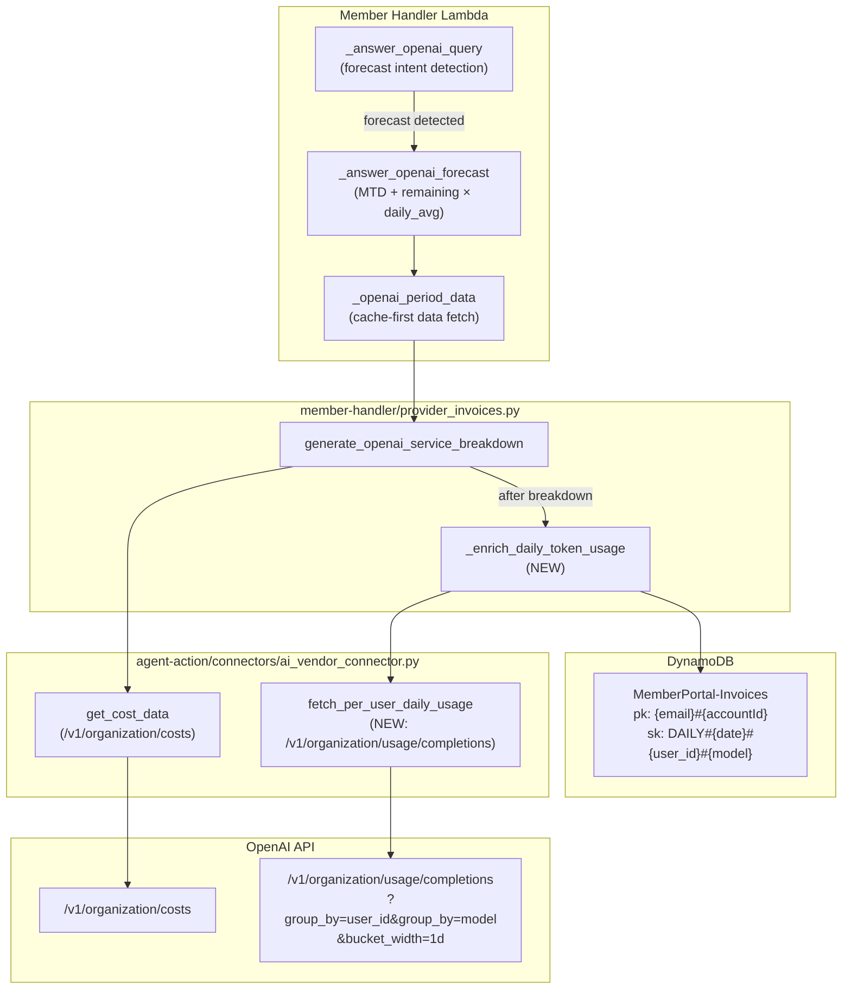
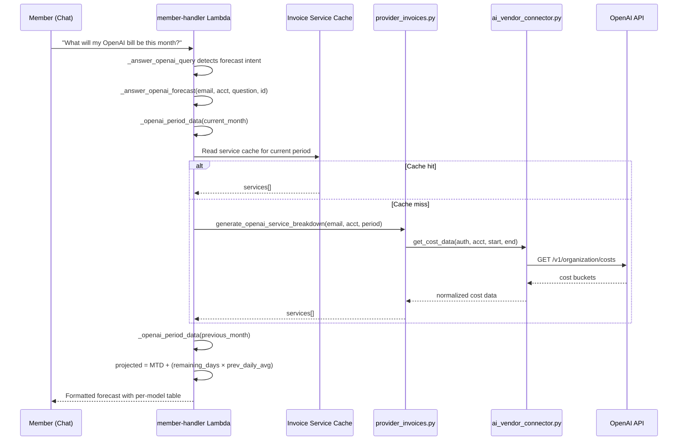
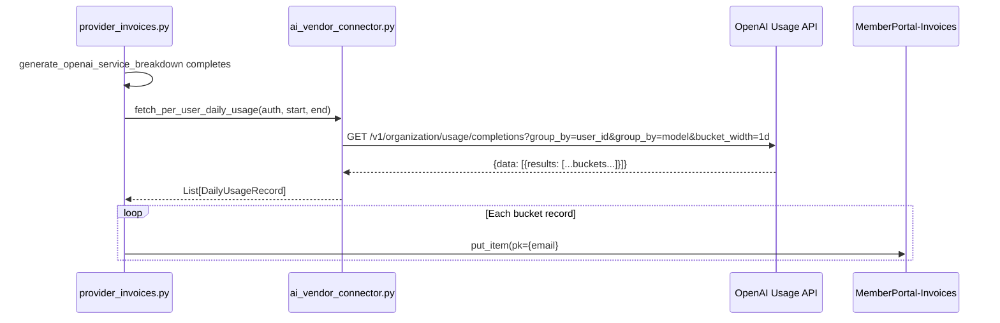

# Design Document: OpenAI Forecast & Daily Token Usage

## Overview

This feature covers two capabilities for the SlashMyBill platform's OpenAI integration:

1. **Chat Forecast Function** — Already implemented in `member-handler/lambda_function.py` as `_answer_openai_forecast`. It computes a month-end cost projection using the formula `MTD_cost + (remaining_days × last_month_daily_avg)` and returns a formatted chat response with MTD spend, daily average, projected total, and a per-model breakdown table. This function needs to be committed and pushed to production.

2. **Per-User Daily Token Usage Enrichment** — A new data-ingestion path that fetches per-user, per-model, per-day token consumption from the OpenAI Organization Usage API (`GET /v1/organization/usage/completions`) and persists it as `DAILY#{date}#{user_id}#{model}` records in the existing `MemberPortal-Invoices` DynamoDB table. This stored data will power a future invoice module and AI dashboard graphs. The enrichment runs as part of the existing `generate_openai_service_breakdown` flow in `member-handler/provider_invoices.py`.

No new API endpoints are exposed to the frontend — this is purely backend data capture for future consumption.

## Architecture



## Sequence Diagrams

### Forecast Chat Flow



### Daily Token Enrichment Flow



## Components and Interfaces

### Component 1: Forecast Function (Existing)

**Purpose**: Computes month-end OpenAI cost projection and returns formatted chat answer.

**Location**: `member-handler/lambda_function.py` — function `_answer_openai_forecast`

**Interface**:
```python
def _answer_openai_forecast(
    member_email: str,
    account_id: str,
    question: str,
    interaction_id: str,
    now: datetime | None = None,
) -> dict:
    """
    Returns HTTP response dict with:
    - answer: Formatted markdown with MTD, daily avg, projected total, model table
    - interactionId: Pass-through for chat continuity
    - commands, results, tipFound, agentUsed, chartData, topServices: Standard chat envelope
    """
```

**Responsibilities**:
- Determine current and previous billing periods
- Fetch MTD cost and per-model breakdown via `_openai_period_data`
- Fetch previous month total for daily average calculation
- Compute projection: `MTD + (remaining_days × last_month_daily_avg)`
- Format response with headline metrics and top-5 model breakdown table

### Component 2: Per-User Daily Usage Fetcher (New)

**Purpose**: Fetches per-user, per-model, daily token consumption from OpenAI's Usage API.

**Location**: `agent-action/connectors/ai_vendor_connector.py` — new method `fetch_per_user_daily_usage`

**Interface**:
```python
def fetch_per_user_daily_usage(
    self,
    api_key: str,
    organization_id: str,
    start_date: str,  # YYYY-MM-DD
    end_date: str,    # YYYY-MM-DD
) -> list[dict]:
    """
    Calls GET /v1/organization/usage/completions with:
      group_by=user_id&group_by=model&bucket_width=1d
      start_time=EPOCH&end_time=EPOCH

    Returns list of dicts, each:
    {
        "date": "2025-01-15",
        "user_id": "user-abc123",
        "model": "gpt-4o",
        "input_tokens": 12500,
        "output_tokens": 3200,
        "input_cached_tokens": 1000,
        "num_model_requests": 45,
    }

    Returns [] on auth failure or API error (never raises).
    """
```

**Responsibilities**:
- Convert date range to Unix timestamps
- Call OpenAI Usage API with correct `group_by` and `bucket_width` parameters
- Handle pagination (API returns paginated results)
- Parse bucket results into flat per-day, per-user, per-model records
- Return empty list on failure (non-breaking enrichment)

### Component 3: Daily Token Enrichment Writer (New)

**Purpose**: Persists fetched per-user daily usage records to DynamoDB.

**Location**: `member-handler/provider_invoices.py` — new function `_enrich_daily_token_usage`

**Interface**:
```python
def _enrich_daily_token_usage(
    member_email: str,
    account_id: str,
    api_key: str,
    organization_id: str,
    period: str,  # "YYYY-MM"
) -> int:
    """
    Fetches per-user daily token data and writes DAILY# records to DynamoDB.

    DynamoDB item shape:
        pk: "{member_email}#{account_id}"
        sk: "DAILY#{date}#{user_id}#{model}"
        input_tokens: int
        output_tokens: int
        input_cached_tokens: int
        num_model_requests: int
        ttl: int (30 days from write)

    Returns count of records written. Returns 0 on failure (never raises).
    """
```

**Responsibilities**:
- Compute start/end dates from the period string
- Call `fetch_per_user_daily_usage` on the connector
- Batch-write records to `MemberPortal-Invoices` table
- Apply 30-day TTL for automatic cleanup
- Log warnings on partial failures, never raise

## Data Models

### DailyUsageRecord (In-Memory)

```python
@dataclass
class DailyUsageRecord:
    date: str           # "2025-01-15"
    user_id: str        # OpenAI user ID
    model: str          # "gpt-4o", "gpt-4o-mini", etc.
    input_tokens: int
    output_tokens: int
    input_cached_tokens: int
    num_model_requests: int
```

### DynamoDB Item: DAILY# Record

```python
{
    "pk": "{member_email}#{account_id}",          # Partition key
    "sk": "DAILY#{date}#{user_id}#{model}",       # Sort key
    "input_tokens": 12500,
    "output_tokens": 3200,
    "input_cached_tokens": 1000,
    "num_model_requests": 45,
    "date": "2025-01-15",
    "user_id": "user-abc123",
    "model": "gpt-4o",
    "account_id": "openai-accc537d369e",
    "ttl": 1739894400,                            # Unix epoch, 30 days from write
}
```

**Validation Rules**:
- `pk` must match pattern `{email}#{accountId}` (existing pattern)
- `sk` must match pattern `DAILY#{YYYY-MM-DD}#{user_id}#{model}`
- `date` must be a valid ISO date within the requested period
- `input_tokens` and `output_tokens` must be non-negative integers
- `ttl` must be a future Unix timestamp (30 days from current time)

### OpenAI Usage API Response Shape

```python
# GET /v1/organization/usage/completions response
{
    "object": "page",
    "data": [
        {
            "start_time": 1705276800,      # Bucket start (Unix epoch)
            "end_time": 1705363200,        # Bucket end (Unix epoch)
            "results": [
                {
                    "object": "organization.usage.completions.result",
                    "input_tokens": 12500,
                    "output_tokens": 3200,
                    "input_cached_tokens": 1000,
                    "num_model_requests": 45,
                    "user_id": "user-abc123",
                    "model": "gpt-4o",
                    "project_id": "proj_...",
                    "api_key_id": "key_..."
                }
            ]
        }
    ],
    "has_more": False,
    "next_page": None
}
```

## Key Functions with Formal Specifications

### Function 1: _answer_openai_forecast()

```python
def _answer_openai_forecast(member_email, account_id, question, interaction_id, now=None):
```

**Preconditions:**
- `member_email` is a non-empty string containing a valid email
- `account_id` is a non-empty string identifying an OpenAI account
- `question` is the user's chat question string (may be empty)
- `interaction_id` is a non-empty string for chat correlation

**Postconditions:**
- Returns a dict with `statusCode: 200` and a `body` containing `answer` field
- `answer` contains MTD spend, daily average, remaining days, and projected total
- If per-model data available, answer includes a markdown table of top-5 models
- Formula correctness: `projected == mtd_total + (remaining_days × last_month_daily_avg)`
- Never raises — returns error response on internal failure

**Loop Invariants:** N/A (no loops in core logic; model table loop is bounded to top-5)

### Function 2: fetch_per_user_daily_usage()

```python
def fetch_per_user_daily_usage(self, api_key, organization_id, start_date, end_date):
```

**Preconditions:**
- `api_key` is a non-empty string (admin-level OpenAI key)
- `organization_id` is a non-empty string
- `start_date` and `end_date` are valid `YYYY-MM-DD` strings where `start_date <= end_date`

**Postconditions:**
- Returns a list of dicts, each with keys: `date`, `user_id`, `model`, `input_tokens`, `output_tokens`, `input_cached_tokens`, `num_model_requests`
- All `date` values fall within `[start_date, end_date)`
- All token counts are non-negative integers
- Returns `[]` on any API or auth failure (never raises)
- Handles pagination: all pages consumed until `has_more == False`

**Loop Invariants:**
- During pagination: all previously collected records remain valid
- `next_page` token advances monotonically (no infinite loop)

### Function 3: _enrich_daily_token_usage()

```python
def _enrich_daily_token_usage(member_email, account_id, api_key, organization_id, period):
```

**Preconditions:**
- `member_email` and `account_id` form a valid DynamoDB partition key
- `api_key` and `organization_id` are valid OpenAI credentials
- `period` matches pattern `YYYY-MM`

**Postconditions:**
- Returns integer count of records successfully written
- Each written record has `pk = {email}#{account_id}` and `sk = DAILY#{date}#{user_id}#{model}`
- Each record has a `ttl` set to 30 days from write time
- Returns `0` on any failure (never raises)
- Existing records with same key are overwritten (idempotent upsert)

**Loop Invariants:**
- During batch write: all previously written records persist in DynamoDB
- Write count monotonically increases

## Algorithmic Pseudocode

### Forecast Calculation

```python
def compute_forecast(mtd_total, prev_month_total, days_in_prev, day_of_month, days_in_month):
    """
    ALGORITHM: Month-end cost projection
    INPUT: MTD cost, previous month total, days in prev month, current day, days in current month
    OUTPUT: Projected end-of-month cost

    PRECONDITION: days_in_prev > 0, day_of_month >= 1, days_in_month >= day_of_month
    POSTCONDITION: result >= mtd_total (projection can only add to MTD)
    """
    remaining_days = days_in_month - day_of_month
    last_month_daily_avg = prev_month_total / days_in_prev if days_in_prev > 0 else 0.0
    projected = mtd_total + (remaining_days * last_month_daily_avg)
    return round(projected, 2)
```

### Usage API Pagination

```python
def fetch_all_usage_pages(api_key, org_id, start_ts, end_ts):
    """
    ALGORITHM: Paginated usage data collection
    INPUT: API credentials, time range as Unix timestamps
    OUTPUT: Complete list of usage records across all pages

    PRECONDITION: start_ts < end_ts, api_key is valid admin key
    POSTCONDITION: all pages consumed, no data loss
    LOOP INVARIANT: all_records contains all records from pages [0..current_page)
    """
    all_records = []
    page_token = None

    while True:
        endpoint = build_usage_endpoint(start_ts, end_ts, page_token)
        response = make_openai_request(endpoint, api_key, org_id)

        for bucket in response.get("data", []):
            date = timestamp_to_date(bucket["start_time"])
            for result in bucket.get("results", []):
                all_records.append({
                    "date": date,
                    "user_id": result.get("user_id", "unknown"),
                    "model": result.get("model", "unknown"),
                    "input_tokens": result.get("input_tokens", 0),
                    "output_tokens": result.get("output_tokens", 0),
                    "input_cached_tokens": result.get("input_cached_tokens", 0),
                    "num_model_requests": result.get("num_model_requests", 0),
                })

        if not response.get("has_more"):
            break
        page_token = response.get("next_page")

    return all_records
```

### DynamoDB Batch Write

```python
def write_daily_records(table, member_email, account_id, records, ttl_seconds=2592000):
    """
    ALGORITHM: Idempotent batch upsert of daily usage records
    INPUT: DynamoDB table, credentials, usage records, TTL (default 30 days)
    OUTPUT: Count of records written

    PRECONDITION: table exists, records is a list of valid DailyUsageRecord dicts
    POSTCONDITION: all records persisted with correct pk/sk pattern
    LOOP INVARIANT: written_count == number of successful put_item calls so far
    """
    pk = f"{member_email}#{account_id}"
    now_epoch = int(time.time())
    ttl_value = now_epoch + ttl_seconds
    written_count = 0

    with table.batch_writer() as batch:
        for record in records:
            sk = f"DAILY#{record['date']}#{record['user_id']}#{record['model']}"
            batch.put_item(Item={
                "pk": pk,
                "sk": sk,
                "input_tokens": record["input_tokens"],
                "output_tokens": record["output_tokens"],
                "input_cached_tokens": record["input_cached_tokens"],
                "num_model_requests": record["num_model_requests"],
                "date": record["date"],
                "user_id": record["user_id"],
                "model": record["model"],
                "account_id": account_id,
                "ttl": ttl_value,
            })
            written_count += 1

    return written_count
```

## Example Usage

```python
# Example 1: Forecast triggered by chat question
response = _answer_openai_forecast(
    member_email="user@company.com",
    account_id="openai-accc537d369e",
    question="What will my OpenAI bill be this month?",
    interaction_id="chat-uuid-123",
)
# response['body']['answer'] contains:
# "**OpenAI cost forecast for January 2025**
#  - Month-to-date (day 15/31): **$1,234.56**
#  - Last month (December 2024): $2,100.00 ($67.74/day avg)
#  - Remaining days: 16
#  - **Projected end-of-month: $2,318.40**"

# Example 2: Daily token enrichment during service breakdown
count = _enrich_daily_token_usage(
    member_email="user@company.com",
    account_id="openai-accc537d369e",
    api_key="sk-admin-...",
    organization_id="org-...",
    period="2025-01",
)
# count == 150 (e.g., 5 users × 3 models × 10 days)

# Example 3: Querying stored daily records (future module)
table = boto3.resource('dynamodb').Table('MemberPortal-Invoices')
response = table.query(
    KeyConditionExpression=Key('pk').eq('user@company.com#openai-accc537d369e')
        & Key('sk').begins_with('DAILY#2025-01-15'),
)
# Returns all user/model records for Jan 15
```

## Error Handling

### Error Scenario 1: OpenAI API Key Invalid/Expired

**Condition**: The stored OpenAI admin API key returns 401/403 during usage fetch
**Response**: `fetch_per_user_daily_usage` returns `[]`; enrichment writes 0 records
**Recovery**: Service breakdown completes normally without daily enrichment; member must update key in Configure tab

### Error Scenario 2: Usage API Unavailable (5xx)

**Condition**: OpenAI Usage API returns server error during pagination
**Response**: `fetch_per_user_daily_usage` logs warning and returns partial data collected so far
**Recovery**: Next invocation will re-fetch and overwrite (idempotent upsert)

### Error Scenario 3: DynamoDB Write Throttling

**Condition**: Batch writer hits provisioned throughput limits
**Response**: boto3 batch_writer handles retries automatically (built-in exponential backoff)
**Recovery**: Automatic; if persistent, records will be written on next invocation

### Error Scenario 4: Forecast with No Previous Month Data

**Condition**: No cached data exists for previous month
**Response**: `last_month_daily_avg` defaults to `0.0`, projection equals MTD (no extrapolation)
**Recovery**: Once previous month data is populated, forecast automatically uses it

### Error Scenario 5: Pagination Loop Protection

**Condition**: API returns `has_more=True` indefinitely (defensive)
**Response**: Cap pagination at 100 pages maximum; log warning if cap reached
**Recovery**: Partial data stored; next invocation fills gaps (idempotent)

## Testing Strategy

### Unit Testing Approach

- Test `compute_forecast` with known inputs (beginning/end of month, zero prev data)
- Test `_answer_openai_forecast` with mocked `_openai_period_data` returning known values
- Test `fetch_per_user_daily_usage` response parsing with sample API payloads
- Test `_enrich_daily_token_usage` with mocked connector and DynamoDB table
- Test sort key construction: verify `DAILY#{date}#{user_id}#{model}` format

### Property-Based Testing Approach

**Property Test Library**: hypothesis (Python)

- Forecast projection is always >= MTD (can never predict less than already spent)
- Sort key round-trip: constructing and parsing `DAILY#` keys preserves all components
- Token counts in written records always match input records (no data corruption)
- Enrichment is idempotent: running twice produces same DynamoDB state

### Integration Testing Approach

- End-to-end test with mocked OpenAI API (httpretty/responses): verify full flow from `generate_openai_service_breakdown` through enrichment to DynamoDB items
- Verify DynamoDB query patterns: `begins_with('DAILY#')` returns correct records

## Security Considerations

- OpenAI admin API keys are decrypted only in the connector layer (existing pattern)
- Keys never appear in logs, responses, or DynamoDB records
- `user_id` values from OpenAI are opaque identifiers — no PII stored
- DynamoDB TTL ensures records auto-expire after 30 days
- Existing IAM role permissions cover `MemberPortal-Invoices` table access (no new permissions needed)

## Dependencies

- **OpenAI Usage API**: `GET /v1/organization/usage/completions` — requires admin-level API key
- **DynamoDB**: Existing `MemberPortal-Invoices` table (no schema changes needed — schemaless)
- **boto3**: DynamoDB resource and batch_writer for writes
- **urllib.request**: HTTP client for OpenAI API (existing pattern in ai_vendor_connector.py)
- **Python stdlib**: `datetime`, `calendar`, `json`, `time`, `logging`

## Correctness Properties

*A property is a characteristic or behavior that should hold true across all valid executions of a system — essentially, a formal statement about what the system should do. Properties serve as the bridge between human-readable specifications and machine-verifiable correctness guarantees.*

### Property 1: Forecast formula correctness

*For any* valid combination of MTD cost (non-negative), previous month total (non-negative), days in previous month (positive), current day of month (1..N), and days in current month (≥ current day), the projected value SHALL equal `MTD + ((days_in_month - day_of_month) × (prev_total / days_in_prev))` rounded to two decimal places.

**Validates: Requirements 2.1, 2.2, 2.3, 2.6**

### Property 2: Forecast projection is monotonically above MTD

*For any* non-negative MTD cost and non-negative previous month daily average, the projected end-of-month cost SHALL be greater than or equal to the MTD cost.

**Validates: Requirements 2.5**

### Property 3: Date-to-timestamp round-trip

*For any* valid ISO date string (YYYY-MM-DD), converting to a Unix timestamp (midnight UTC) and then converting back to an ISO date string SHALL produce the original date string.

**Validates: Requirements 6.1, 6.2, 6.3**

### Property 4: Pagination completeness

*For any* sequence of paginated API responses where each page has `has_more=true` except the last, the Usage_Fetcher SHALL return the union of all records from all pages with no omissions or duplicates from the response data.

**Validates: Requirements 5.3, 5.5**

### Property 5: Token counts are non-negative integers

*For any* parsed usage record returned by the Usage_Fetcher, all numeric fields (`input_tokens`, `output_tokens`, `input_cached_tokens`, `num_model_requests`) SHALL be non-negative integers.

**Validates: Requirements 8.1, 8.2, 8.3, 8.4**

### Property 6: DynamoDB key pattern correctness

*For any* usage record written by the Enrichment_Writer, the partition key SHALL match `{email}#{account_id}` and the sort key SHALL match the regex `^DAILY#\d{4}-\d{2}-\d{2}#.+#.+$`.

**Validates: Requirements 7.1, 7.2**

### Property 7: TTL is 30 days from write time

*For any* record written by the Enrichment_Writer, the `ttl` attribute SHALL be a Unix timestamp within the range `[now + 2_592_000 - 1, now + 2_592_000 + 1]` (30 days ± 1 second tolerance for execution time).

**Validates: Requirements 7.4**

### Property 8: Enrichment idempotence

*For any* set of usage records, running the Enrichment_Writer twice with the same input SHALL produce the same DynamoDB state — the second write overwrites with identical values and the record count remains unchanged.

**Validates: Requirements 7.5**

### Property 9: Enrichment never raises

*For any* exception thrown during enrichment execution (API failures, DynamoDB errors, malformed data), the Enrichment_Writer SHALL catch the exception and return an integer (0) without propagating the error to the caller.

**Validates: Requirements 9.2, 4.3**

### Property 10: Forecast response contains all required fields

*For any* successful forecast computation, the returned response SHALL contain `statusCode: 200` and a body including `answer`, `interactionId`, and the answer text SHALL contain MTD amount, daily average, remaining days, and projected total.

**Validates: Requirements 3.1, 3.4**

### Property 11: Returned dates within requested range

*For any* usage fetch with a given start_date and end_date, all `date` values in the returned records SHALL satisfy `start_date <= date < end_date`.

**Validates: Requirements 6.4**
