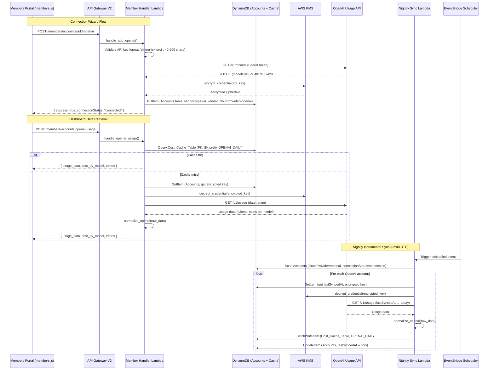

# Design Document: OpenAI Vendor Integration

## Overview

This design extends SlashMyBill's provider framework to support AI Vendor connections, starting with OpenAI. The integration adds a new `openai_connector.py` module implementing the existing `ProviderConnector` interface, a frontend Connection Wizard for API key–based onboarding, a nightly incremental sync Lambda for automated usage data retrieval, and an Observe tab dashboard for token usage, cost-by-model, spend trends, and optimization recommendations.

Key design decisions:

1. **Reuse the existing ProviderConnector pattern** — OpenAI is registered in the same `_CONNECTORS` registry with a new `vendor_type` metadata field to distinguish AI vendors from cloud providers.
2. **API key authentication** — Unlike AWS (STS AssumeRole) or Azure (Service Principal), OpenAI uses a single bearer API key. The connector encrypts this via the existing KMS helpers.
3. **Cost Cache compatibility** — OpenAI daily cost data is stored in `Cost_Cache_Table` using the same PK format (`{memberEmail}#{accountId}`) with a sort key prefix `OPENAI_DAILY#` to coexist with existing cloud cost data.
4. **Nightly sync via EventBridge** — A scheduled Lambda (02:00 UTC) performs incremental fetches, mirroring the pattern established by `incremental_fetch_engine.py`.
5. **Tips integration** — A new `openai` entry in `PROVIDER_MAPPINGS` enables the existing `_search_tips()` pipeline to serve OpenAI-specific optimization recommendations.

## Architecture



## Components and Interfaces

### 1. Provider Registry Enhancement (`connectors/__init__.py`)

The `_CONNECTORS` dict is extended to store tuples of `(connector_class, vendor_type)` instead of just the class. A backward-compatible `register_connector()` signature accepts an optional `vendor_type` parameter (default: `'cloud_provider'`).

```python
_CONNECTORS = {}  # {provider_name: {'class': ConnectorClass, 'vendor_type': str}}

def register_connector(provider_name, connector_class, vendor_type='cloud_provider'):
    _CONNECTORS[provider_name] = {
        'class': connector_class,
        'vendor_type': vendor_type,
    }

def get_connector(provider_name):
    entry = _CONNECTORS.get(provider_name)
    return entry['class']() if entry else None

def list_providers(vendor_type=None):
    if not _CONNECTORS:
        _load_connectors()
    if vendor_type:
        return [name for name, entry in _CONNECTORS.items() if entry['vendor_type'] == vendor_type]
    return list(_CONNECTORS.keys())
```

### 2. OpenAI Connector (`connectors/openai_connector.py`)

Implements `ProviderConnector` with OpenAI-specific logic:

```python
class OpenAIConnector(ProviderConnector):
    OPENAI_BASE_URL = "https://api.openai.com/v1"
    REQUEST_TIMEOUT = 30  # seconds
    MAX_RETRIES = 3

    def authenticate(self, credentials: dict) -> dict:
        """Decrypt API key via KMS, validate format, return auth context."""

    def test_connection(self, auth_context: dict, account_id: str) -> dict:
        """Call GET /v1/models to verify the key works. Return success/failure."""

    def get_cost_data(self, auth_context: dict, account_id: str, start_date: str, end_date: str) -> list:
        """Call OpenAI Usage API, return raw usage records for normalization."""
```

Key behaviors:
- `authenticate()`: Decrypts the stored API key via `decrypt_credential()`, validates `sk-` prefix and 40–200 char length, returns `{'api_key': decrypted_key, 'org_name': ...}`.
- `test_connection()`: Calls `GET /v1/models` with Bearer token. If 200, returns `{success: True, message, details: {models: [...]}}`. If 401/403, returns failure.
- `get_cost_data()`: Calls the OpenAI Usage API with date range params. Handles HTTP 429 with `Retry-After` header or exponential backoff. Returns raw JSON records.

### 3. Cost Normalizer — `normalize_openai()` (`cost_normalizer.py`)

New function alongside existing `normalize_aws()`, `normalize_azure()`, `normalize_gcp()`:

```python
def normalize_openai(raw_records: list, account_id: str) -> list:
    """Transform OpenAI Usage API response into common cost schema.

    OpenAI format (per bucket):
    {
        'object': 'bucket',
        'start_time': 1704067200,  # Unix timestamp
        'end_time': 1704153600,
        'results': [
            {'object': 'organization.costs.result', 'amount': {'value': 0.45, 'currency': 'usd'},
             'line_item': 'GPT-4', 'project_id': 'proj_abc123'}
        ]
    }

    Returns: list of dicts matching common schema:
    {date, service_name, cost_amount, currency, cloud_provider, account_id}
    """
```

### 4. Provider Router Enhancement (`provider_router.py`)

- Add `'openai'` to `SUPPORTED_PROVIDERS` set.
- Update `_extract_credentials()` to handle the `'openai'` case:

```python
elif provider == 'openai':
    stored = account.get('credentials', {})
    return {
        'encrypted_api_key': stored.get('encryptedApiKey', ''),
    }
```

### 5. Tips Filter Enhancement (`tips_filter.py`)

New `OPENAI_SERVICE_MAPPING` dict added to `PROVIDER_MAPPINGS`:

```python
OPENAI_SERVICE_MAPPING = {
    'gpt-4': 'GPT-4', 'gpt4': 'GPT-4', 'gpt-4o': 'GPT-4o',
    'gpt-3.5': 'GPT-3.5-Turbo', 'gpt-3': 'GPT-3.5-Turbo',
    'chatgpt': 'General', 'openai': 'General',
    'token': 'Token Optimization', 'tokens': 'Token Optimization',
    'prompt': 'Prompt Optimization', 'embedding': 'Embeddings',
    'fine-tune': 'Fine-Tuning', 'finetune': 'Fine-Tuning',
    'batch': 'Batch API', 'cache': 'Caching',
    'dall-e': 'DALL-E', 'whisper': 'Whisper', 'tts': 'TTS',
    'general': 'General', 'cost': 'General', 'billing': 'General',
    'save': 'General', 'efficient': 'General', 'optimize': 'General',
}

PROVIDER_MAPPINGS = {
    'aws': AWS_SERVICE_MAPPING,
    'azure': AZURE_SERVICE_MAPPING,
    'gcp': GCP_SERVICE_MAPPING,
    'openai': OPENAI_SERVICE_MAPPING,
}
```

### 6. Nightly Sync Lambda (`openai_sync_handler/lambda_function.py`)

A new Lambda function triggered by EventBridge at 02:00 UTC daily:

```python
def lambda_handler(event, context):
    """Sync OpenAI usage data for all connected accounts."""
    # 1. Scan Accounts table for cloudProvider='openai', connectionStatus='connected'
    # 2. For each account:
    #    a. Read lastSyncedAt (default: 90 days ago)
    #    b. Decrypt API key
    #    c. Call OpenAI Usage API (lastSyncedAt → today)
    #    d. Normalize response
    #    e. BatchWrite to Cost_Cache_Table (OPENAI_DAILY# prefix)
    #    f. Update lastSyncedAt
    # 3. Handle errors per-account (retry 3x with exponential backoff)
    # 4. Mark failed accounts connectionStatus='failed' if key is invalid
```

Execution constraints:
- Lambda timeout: 900 seconds
- Memory: 256 MB
- Retry policy: 3 attempts with 2s base exponential backoff per account
- Invalid key (401): mark `connectionStatus='failed'`, skip account
- Transient error (429/5xx): retry, then skip on exhaustion

### 7. Frontend — Connection Wizard (`members/members.js`)

New UI flow in the Configure tab:

- "Add AI Vendor" button alongside existing "Add Cloud Account"
- Vendor selection (OpenAI option with logo)
- API Key input field with client-side format validation (`sk-org-` or `sk-proj-` prefix, 40–200 chars)
- Optional connection name (max 64 chars)
- Loading indicator with 15-second timeout
- Success/error states with retry option

### 8. Frontend — Usage Dashboard (`members/members.js`)

New Observe tab section for OpenAI accounts:

- Token usage time-series chart (input vs output tokens, 7/30/90 day range)
- Cost-by-model bar chart (sorted by cost descending, up to 20 models)
- Spend trends line chart (daily/weekly/monthly granularity toggle)
- Cost-per-project table (top 50, sorted by cost)
- Rate limit utilization gauges (RPM/TPM per model tier)
- Optimization recommendations panel (0–10 tips, sorted by savings)

### 9. Infrastructure (`infrastructure/viewmybill-stack.yaml`)

New CloudFormation resources:
- `OpenAISyncFunction` — Lambda (Python 3.12, 256 MB, 900s timeout)
- `OpenAISyncSchedule` — EventBridge rule (`cron(0 2 * * ? *)`)
- `OpenAISyncRole` — IAM role with DynamoDB, KMS, and CloudWatch Logs permissions
- API Gateway route: `POST /members/accounts/add-openai`
- API Gateway route: `POST /members/accounts/openai-usage`
- API Gateway route: `POST /members/accounts/test-openai-connection`
- Environment variables on Member Handler: update `SUPPORTED_PROVIDERS`

### 10. OpenAI Tips Seed Script (`scripts/seed_openai_tips.py`)

One-time script to populate `ViewMyBill-CostOptimizationTips` with OpenAI-specific tips:

```python
def seed_openai_tips():
    """Write OpenAI optimization tips to DynamoDB using batch_writer."""
    tips = [...]  # At least 10 tips covering 5 categories
    with table.batch_writer(overwrite_by_pkeys=['service', 'tipId']) as batch:
        for tip in tips:
            batch.put_item(Item=tip)
```

## Data Models

### MemberPortal-Accounts (OpenAI record)

```json
{
  "memberEmail": "user@example.com",
  "accountId": "openai-org-abc123",
  "cloudProvider": "openai",
  "vendorType": "ai_vendor",
  "accountName": "My OpenAI Production",
  "connectionStatus": "connected",
  "credentials": {
    "encryptedApiKey": "<KMS-encrypted-base64>"
  },
  "addedAt": "2025-01-20T14:30:00Z",
  "lastTestedAt": "2025-01-20T14:30:05Z",
  "lastSyncedAt": "2025-01-21T02:00:45Z"
}
```

### Cost_Cache_Table (OpenAI daily record)

```json
{
  "pk": "user@example.com#openai-org-abc123",
  "sk": "OPENAI_DAILY#2025-01-20",
  "cost_amount": 12.45,
  "currency": "USD",
  "service_breakdown": {
    "gpt-4": 8.20,
    "gpt-4o-mini": 2.15,
    "gpt-3.5-turbo": 1.50,
    "dall-e-3": 0.60
  },
  "token_breakdown": {
    "gpt-4": {"input_tokens": 150000, "output_tokens": 45000},
    "gpt-4o-mini": {"input_tokens": 500000, "output_tokens": 120000},
    "gpt-3.5-turbo": {"input_tokens": 800000, "output_tokens": 200000}
  },
  "project_breakdown": {
    "proj_abc123": {"cost": 7.50, "name": "Production App"},
    "proj_def456": {"cost": 4.95, "name": "Dev Testing"}
  },
  "fetched_at": "2025-01-21T02:00:45Z"
}
```

### ViewMyBill-CostOptimizationTips (OpenAI tip record)

```json
{
  "service": "GPT-4",
  "tipId": "openai-model-selection-001",
  "provider": "openai",
  "category": "model-selection",
  "title": "Use GPT-4o-mini for simple classification tasks",
  "description": "GPT-4o-mini handles classification, summarization, and simple Q&A at 1/30th the cost of GPT-4. Switch low-complexity tasks to save significantly.",
  "estimatedSavings": "$50-500/month depending on volume",
  "difficulty": "easy"
}
```

### OpenAI Usage API Response (normalized output)

```json
{
  "date": "2025-01-20",
  "service_name": "gpt-4",
  "cost_amount": 8.20,
  "currency": "USD",
  "cloud_provider": "openai",
  "account_id": "openai-org-abc123",
  "input_tokens": 150000,
  "output_tokens": 45000
}
```

### Optimization Recommendation Object

```json
{
  "title": "Switch classification tasks to GPT-4o-mini",
  "description": "52% of your token spend is on GPT-4 with average output of 380 tokens. These short-output tasks likely work well with GPT-4o-mini at 1/30th the cost.",
  "estimated_monthly_savings": 145.50,
  "difficulty": "easy"
}
```

## Correctness Properties

*A property is a characteristic or behavior that should hold true across all valid executions of a system — essentially, a formal statement about what the system should do. Properties serve as the bridge between human-readable specifications and machine-verifiable correctness guarantees.*

### Property 1: Registry vendor_type storage and filtering

*For any* set of connector registrations with assigned vendor_type values, querying `list_providers(vendor_type=X)` must return exactly the set of provider names registered with vendor_type `X`, and connectors registered without an explicit vendor_type must default to `cloud_provider`.

**Validates: Requirements 1.1, 1.5, 1.6**

### Property 2: API key format validation

*For any* string, the API key validation function must accept it if and only if it starts with `sk-org-` or `sk-proj-` and has a total length between 40 and 200 characters (inclusive). Strings failing this check must be rejected without making an external API call.

**Validates: Requirements 2.3, 2.5, 3.1, 3.6**

### Property 3: Encrypted credential storage

*For any* valid API key that passes validation and is stored via the OpenAI connector, the DynamoDB record's `credentials.encryptedApiKey` field must contain the KMS-encrypted ciphertext, and no field in the stored record or log output may contain the plaintext key value.

**Validates: Requirements 4.1, 4.2**

### Property 4: Failure reason truncation

*For any* connection test failure reason string, the value stored in the account record and displayed to the user must be at most 200 characters in length.

**Validates: Requirements 5.2**

### Property 5: Cost-by-model aggregation

*For any* set of OpenAI usage records containing model names and costs, the aggregation function must: (a) group costs by model name, (b) return at most 20 models sorted by cost descending, (c) compute each model's percentage as its cost divided by total cost × 100, (d) format costs to 2 decimal places and percentages to 1 decimal place, and (e) produce percentages that sum to approximately 100% (within floating-point tolerance).

**Validates: Requirements 7.1, 7.2, 7.4**

### Property 6: Time bucket aggregation preserves total spend

*For any* daily cost data series, aggregating into weekly buckets (7-day intervals starting Monday) or monthly buckets (calendar month intervals) must preserve the total spend amount (sum of all daily values equals sum of all aggregated bucket values, within floating-point tolerance).

**Validates: Requirements 8.3**

### Property 7: Period-over-period percentage change

*For any* current period total and previous period total (where previous > 0), the percentage change must equal `(current - previous) / previous × 100`, rounded to 1 decimal place. If the previous period total is zero and current is positive, the change must be reported as positive infinity or a sentinel indicating "new spend".

**Validates: Requirements 8.4**

### Property 8: Project cost grouping and cap

*For any* set of usage records with project identifiers, the project breakdown must: (a) group costs by project, (b) sort by cost descending, (c) return at most 50 entries, and (d) if more than 50 projects exist, include an indicator that additional entries are not shown.

**Validates: Requirements 9.1, 9.2, 9.5**

### Property 9: Rate limit warning threshold

*For any* rate limit utilization value, a warning indicator must be displayed if and only if the utilization exceeds 80%.

**Validates: Requirements 10.3**

### Property 10: Model-switch recommendation rule

*For any* usage pattern where GPT-4 accounts for more than 50% of total token spend and the average output length for GPT-4 requests is 500 tokens or fewer, the recommendation engine must produce a "switch to lower-cost model" recommendation with an estimated monthly savings value. Conversely, if either condition is not met, this recommendation must not appear.

**Validates: Requirements 11.2**

### Property 11: Prompt optimization recommendation rule

*For any* usage pattern where the ratio of total input tokens to total output tokens exceeds 4:1 across the billing period, the recommendation engine must produce a "prompt optimization" recommendation. Conversely, if the ratio is 4:1 or lower, this recommendation must not appear.

**Validates: Requirements 11.3**

### Property 12: Recommendation format and ordering

*For any* set of generated recommendations, the output must: (a) contain at most 10 items, (b) be sorted by estimated monthly savings descending, (c) have each title at most 80 characters, (d) have each description at most 300 characters, and (e) have difficulty in `{easy, medium, hard}`.

**Validates: Requirements 11.1, 11.4**

### Property 13: OpenAI tips search relevance

*For any* question string containing at least one keyword from `OPENAI_SERVICE_MAPPING`, calling `_search_tips(question, provider='openai')` must return between 1 and 5 tips where each tip's `service` field matches one of the services mapped from the detected keywords or is `General`.

**Validates: Requirements 12.3**

### Property 14: Incremental sync date range

*For any* OpenAI account with a stored `lastSyncedAt` ISO timestamp, the nightly sync must request usage data with start_date equal to the `lastSyncedAt` date and end_date equal to the current date. For accounts without `lastSyncedAt`, start_date must be 90 days before the current date.

**Validates: Requirements 13.2, 13.3**

### Property 15: Cache key format

*For any* member email, account ID, and date string, the Cost_Cache_Table item must have PK equal to `{memberEmail}#{accountId}` and SK equal to `OPENAI_DAILY#{date}` (in YYYY-MM-DD format).

**Validates: Requirements 13.4**

### Property 16: Nightly sync retry with exponential backoff

*For any* transient error (HTTP 429 or 5xx) encountered during nightly sync, the system must retry up to 3 times with delays following a 2-second base exponential backoff pattern (2s, 4s, 8s). After exhausting retries, the account sync must be marked as failed without affecting other accounts.

**Validates: Requirements 13.6**

### Property 17: OpenAI usage data normalization round-trip

*For any* valid OpenAI usage API response, normalizing the response via `normalize_openai()` and then formatting the normalized records back into the API response structure and re-normalizing must produce records equivalent to the first normalization (round-trip integrity).

**Validates: Requirements 14.2, 14.8**

## Error Handling

| Scenario | Behavior |
|---|---|
| API key format invalid (client-side) | Inline validation error shown immediately; no backend call made |
| API key format invalid (backend) | Return 400 with `InvalidKeyFormat` error; no OpenAI API call made |
| OpenAI API returns 401 (invalid/revoked key) | Return failure; update connectionStatus to `failed`; do not persist key |
| OpenAI API returns 403 (insufficient permissions) | Return failure with message identifying missing usage/billing permissions |
| OpenAI API returns 429 (rate limited) | Retry with Retry-After header if present, else exponential backoff (1s base, 3 attempts) |
| OpenAI API returns 5xx (server error) | Retry up to 3 times; if exhausted, return temporary unavailability error |
| OpenAI API timeout (>30s) | Return timeout error suggesting retry |
| KMS encryption fails | Do not persist record; return 500 with "unable to save credentials" |
| KMS decryption fails | Return 500 with "credentials inaccessible"; never expose ciphertext in error |
| DynamoDB write fails (Accounts table) | Return 500 with `InternalError`; log full error |
| DynamoDB write fails (Cost_Cache_Table) | Log warning; nightly sync continues to next account |
| Connection test timeout (>15s from frontend) | Dismiss loading indicator; show connectivity error with retry option |
| Nightly sync — invalid API key | Update connectionStatus to `failed`; skip account; continue others |
| Nightly sync — transient error after 3 retries | Mark sync failed for account; continue others |
| Nightly sync — Lambda approaching 900s timeout | Stop processing remaining accounts; log which accounts were skipped |
| Dashboard data load fails | Show error message with retry button; preserve other dashboard sections |
| No usage data for selected period | Show empty state message (not an error) |
| Project-level data unavailable (key type limitation) | Show aggregate with note about Organization-level key requirement |

## Testing Strategy

### Property-Based Testing

Use `hypothesis` (Python) for backend property tests. Each property test runs a minimum of 100 iterations.

Each test is tagged with a comment: `# Feature: openai-vendor-integration, Property {N}: {title}`

Properties to implement as property-based tests:
- **Property 1**: Registry vendor_type storage and filtering — generate random connector registrations with vendor_types, verify filtering correctness
- **Property 2**: API key format validation — generate random strings (valid and invalid prefixes/lengths), verify acceptance/rejection
- **Property 3**: Encrypted credential storage — generate random API keys, mock KMS, verify no plaintext in stored records
- **Property 5**: Cost-by-model aggregation — generate random usage records with model names/costs, verify grouping, sorting, percentages, formatting
- **Property 6**: Time bucket aggregation — generate random daily cost series, verify weekly/monthly totals match daily totals
- **Property 7**: Period-over-period percentage change — generate random period totals, verify calculation
- **Property 8**: Project cost grouping and cap — generate random project usage records (including >50 projects), verify sorting, capping, indicator
- **Property 9**: Rate limit warning threshold — generate random utilization values (0-100%), verify warning appears iff >80%
- **Property 10**: Model-switch recommendation rule — generate random usage patterns varying GPT-4 spend % and output length, verify rule fires correctly
- **Property 11**: Prompt optimization rule — generate random input/output token counts, verify rule fires when ratio >4:1
- **Property 12**: Recommendation format and ordering — generate random recommendation sets, verify cap, sorting, field length constraints
- **Property 13**: OpenAI tips search relevance — generate random questions with/without OpenAI keywords, verify tip results
- **Property 14**: Incremental sync date range — generate random lastSyncedAt timestamps, verify correct start/end dates
- **Property 15**: Cache key format — generate random email/accountId/date combinations, verify PK and SK format
- **Property 16**: Retry exponential backoff — generate sequences of transient errors, verify retry count and delay pattern
- **Property 17**: Normalization round-trip — generate random valid OpenAI usage responses, verify normalize → format → re-normalize equivalence

### Unit Testing

Use `pytest` for unit tests. Focus on:
- Specific examples for OpenAI connector authentication (mock KMS + mock OpenAI API)
- Edge cases: expired keys, connection name exactly 64 chars, API key exactly 40 and 200 chars
- Error response mapping: 401 → "revoked", 403 → "permissions", 429 → "retry", 500 → "temporary"
- Nightly sync: single account success, multiple accounts with mixed results
- Frontend validation: empty key, missing prefix, too short, too long
- Seed script idempotency: run twice, verify no duplicates
- Integration: route dispatch for new API endpoints
- Connection status transitions: pending → connected, connected → failed, failed → connected
- Failure reason truncation at exactly 200 characters

### Frontend Testing

Manual or lightweight JS tests for:
- Connection Wizard renders with "Add AI Vendor" option
- API key input validates format client-side before submit
- Loading indicator appears and respects 15-second timeout
- Success/error states render correctly
- Usage Dashboard charts render with mock data
- Date range selector switches between 7/30/90 days
- Granularity toggle re-renders without full page reload
- Recommendations panel displays tips sorted by savings
- Rate limit gauges show warning color at >80%

### Integration Testing

End-to-end tests with mocked OpenAI API:
- Full connection wizard flow: input key → validate → store → test → connected
- Nightly sync: incremental fetch with lastSyncedAt → cache write → timestamp update
- Dashboard data retrieval: cache hit path and cache miss path
- Tips search: verify OpenAI keyword matching returns relevant tips
- Multi-account sync: verify one failure doesn't block others

