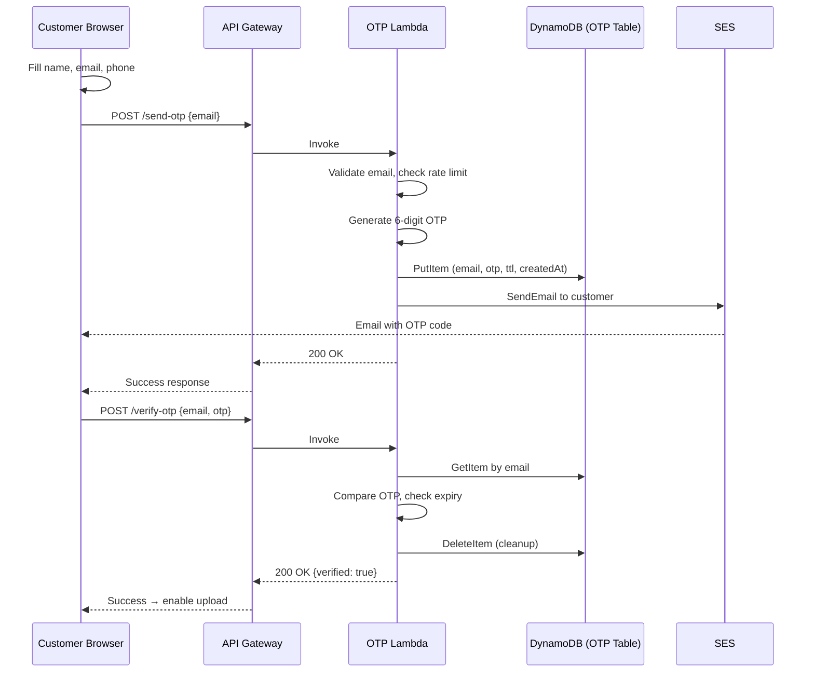
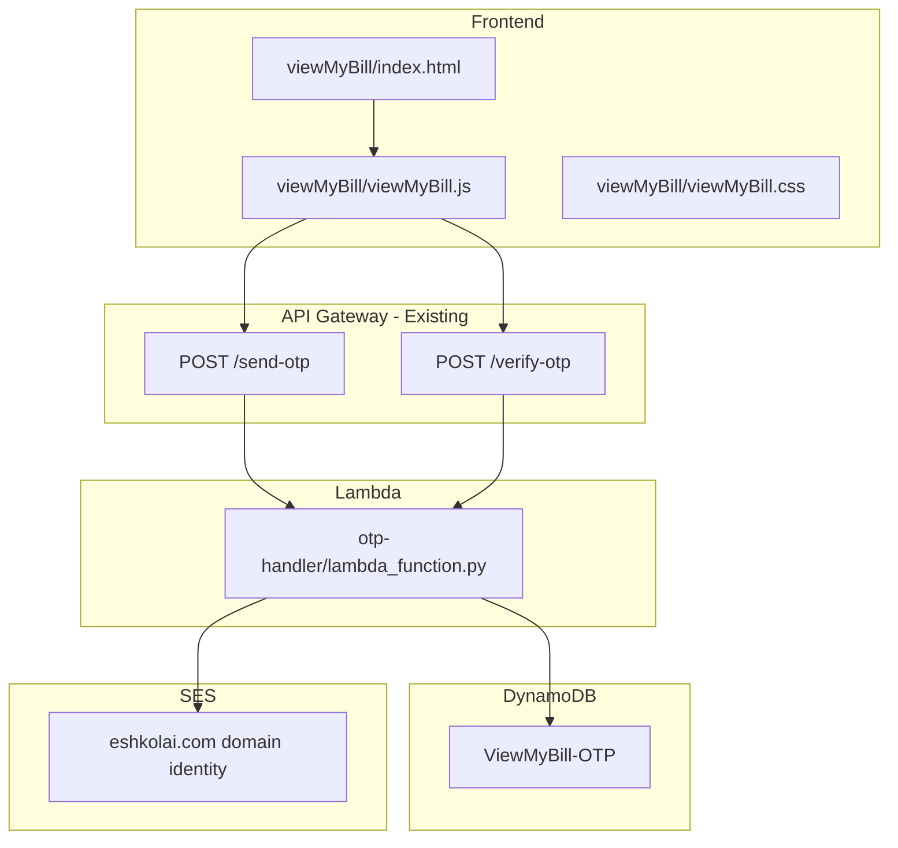
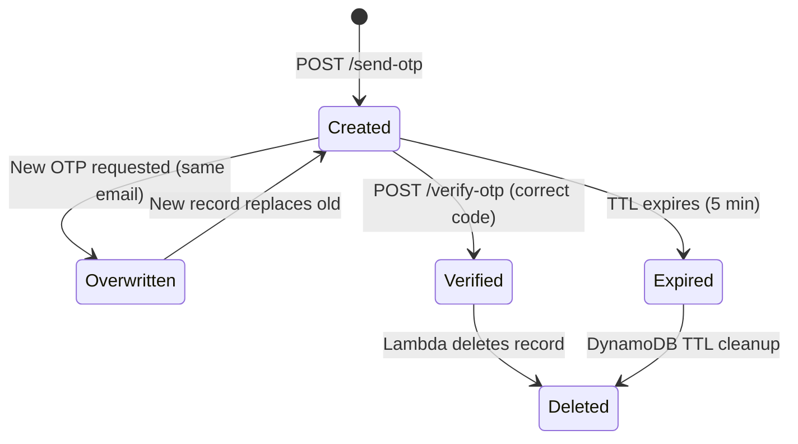

# Design Document: OTP Email Verification

## Overview

This feature adds OTP (One-Time Password) email verification to the Slash My Bill page. Before uploading a bill, customers must verify ownership of their email address by receiving and entering a 6-digit code. The system uses a new Lambda function (`otp-handler/`) to generate, store, and verify OTP codes, with Amazon SES for email delivery and DynamoDB for code storage with automatic TTL-based expiry.

The feature integrates into the existing architecture:
- A new `POST /send-otp` route generates a code, stores it in DynamoDB, and sends it via SES
- A new `POST /verify-otp` route validates the submitted code against the stored record
- The frontend gates file upload and submission behind successful email verification
- All infrastructure is provisioned via the existing CloudFormation stack and deployed through GitHub Actions



## Architecture

### System Components

The OTP feature adds three new resources to the existing CloudFormation stack and modifies the frontend:



### Design Decisions

1. **Single Lambda for both routes**: The OTP Lambda handles both `/send-otp` and `/verify-otp` by inspecting the `routeKey` from the API Gateway v2 event. This mirrors the simplicity of the existing upload-handler pattern and avoids managing two separate functions for a tightly coupled feature.

2. **DynamoDB with TTL for OTP storage**: OTP records auto-expire via DynamoDB TTL, eliminating the need for a cleanup job. The `email` field serves as the partition key (no sort key needed) since only one active OTP per email is allowed at a time.

3. **Rate limiting via DynamoDB `createdAt` field**: Instead of a separate rate-limiting service, the Lambda checks the `createdAt` timestamp of the existing OTP record. If less than 60 seconds have passed, it returns 429. This is simple and sufficient for the expected traffic volume.

4. **SES domain identity with DKIM**: The CloudFormation stack provisions an SES domain identity for `eshkolai.com` with DKIM DNS records in Route 53. The sender address `noreply@eshkolai.com` does not require individual email verification when the domain is verified.

5. **Frontend state gating**: The verification state is managed entirely in the browser's JavaScript runtime. No session tokens or cookies are used — the frontend simply tracks whether the `/verify-otp` call succeeded for the current email. Changing the email resets the state.

6. **No VPC**: Consistent with existing Lambdas, the OTP Lambda runs outside a VPC and calls DynamoDB and SES directly via the AWS SDK.

## Components and Interfaces

### OTP Lambda (`otp-handler/lambda_function.py`)

The Lambda handles two routes via a single handler function:

```python
def lambda_handler(event, context):
    route_key = event.get('routeKey', '')
    if route_key == 'POST /send-otp':
        return handle_send_otp(event)
    elif route_key == 'POST /verify-otp':
        return handle_verify_otp(event)
    else:
        return error_response(404, 'Route not found')
```

#### `POST /send-otp`

**Request:**
```json
{
  "email": "customer@example.com"
}
```

**Success Response (200):**
```json
{
  "message": "OTP sent successfully",
  "email": "customer@example.com"
}
```

**Error Responses:**
- `400`: Invalid email format → `{"error": "InvalidEmail", "message": "Please provide a valid email address"}`
- `429`: Rate limited → `{"error": "RateLimited", "message": "Please wait before requesting a new code", "retryAfter": 45}`
- `500`: SES failure → `{"error": "SendFailed", "message": "Failed to send verification email. Please try again."}`

#### `POST /verify-otp`

**Request:**
```json
{
  "email": "customer@example.com",
  "otp": "482917"
}
```

**Success Response (200):**
```json
{
  "verified": true,
  "message": "Email verified successfully"
}
```

**Error Responses:**
- `400`: Invalid/missing OTP → `{"error": "InvalidOTP", "message": "Invalid OTP code"}`
- `400`: Expired/not found → `{"error": "ExpiredOTP", "message": "OTP has expired or was not requested"}`

### Frontend Components

#### OTP UI Elements (added to `viewMyBill/index.html`)

- **Verify Button**: `<button id="vmb-verify-email">` — placed below the contact fields grid, above the file picker
- **OTP Input Section**: `<div id="vmb-otp-section">` — contains a 6-digit text input, a submit button, and a "Resend code" link with countdown
- **Verification Status**: `<span id="vmb-verify-status">` — shows success/error messages
- **File Picker Overlay**: A visual overlay on the file picker area with "Verify your email to upload" message

#### JavaScript State Machine (`viewMyBill/viewMyBill.js`)

The OTP flow adds a verification state to the existing form logic:

```
States:
  UNVERIFIED → User has not verified email yet
  SENDING    → OTP request in flight
  CODE_SENT  → Waiting for user to enter OTP
  VERIFYING  → Verification request in flight
  VERIFIED   → Email confirmed, upload enabled

Transitions:
  UNVERIFIED → SENDING    (click Verify button)
  SENDING    → CODE_SENT  (API success)
  SENDING    → UNVERIFIED (API error)
  CODE_SENT  → VERIFYING  (submit OTP)
  CODE_SENT  → SENDING    (resend OTP)
  VERIFYING  → VERIFIED   (API success)
  VERIFYING  → CODE_SENT  (API error - wrong code)
  VERIFIED   → UNVERIFIED (email field changed)
```

### CloudFormation Resources (added to `infrastructure/viewmybill-stack.yaml`)

| Resource | Type | Purpose |
|----------|------|---------|
| `OTPTable` | `AWS::DynamoDB::Table` | Stores OTP records with TTL |
| `OTPHandlerRole` | `AWS::IAM::Role` | IAM role with DynamoDB + SES permissions |
| `OTPHandlerFunction` | `AWS::Lambda::Function` | Python 3.12 Lambda, 128MB, 30s timeout |
| `OTPIntegration` | `AWS::ApiGatewayV2::Integration` | API Gateway → Lambda integration |
| `SendOTPRoute` | `AWS::ApiGatewayV2::Route` | `POST /send-otp` route |
| `VerifyOTPRoute` | `AWS::ApiGatewayV2::Route` | `POST /verify-otp` route |
| `OTPHandlerInvokePermission` | `AWS::Lambda::Permission` | Allow API Gateway to invoke Lambda |
| `SESEmailIdentity` | `AWS::SES::EmailIdentity` | Domain identity for eshkolai.com |

### CI/CD Updates (`.github/workflows/deploy.yml`)

- Add `otp-handler/**` to the `paths` trigger
- Add a "Package OTP Handler Lambda" step (same pattern as upload-handler)
- Add `aws lambda update-function-code` for the OTP function after CloudFormation deploy

## Data Models

### DynamoDB: `ViewMyBill-OTP` Table

| Attribute | Type | Description |
|-----------|------|-------------|
| `email` | String (PK) | Customer email address (partition key) |
| `otp` | String | 6-digit OTP code |
| `createdAt` | String | ISO 8601 timestamp of OTP creation |
| `ttl` | Number | Unix epoch timestamp (createdAt + 300 seconds) for DynamoDB TTL auto-deletion |

**Table Configuration:**
- Billing: PAY_PER_REQUEST (on-demand)
- Encryption: SSE enabled (AWS-owned key)
- TTL attribute: `ttl`
- No sort key (one active OTP per email)
- No GSIs needed

### OTP Record Lifecycle



### SES Email Template (inline in Lambda)

The OTP email is constructed as an HTML string in the Lambda function (no SES template resource needed):

- **From**: `noreply@eshkolai.com`
- **Subject**: `Your Slash My Bill verification code`
- **Body**: HTML with Eshkol AI branding, the 6-digit code in large font, and a 5-minute validity notice


## Correctness Properties

*A property is a characteristic or behavior that should hold true across all valid executions of a system — essentially, a formal statement about what the system should do. Properties serve as the bridge between human-readable specifications and machine-verifiable correctness guarantees.*

### Property 1: OTP generation and storage correctness

*For any* valid email address submitted to `/send-otp`, the generated OTP stored in DynamoDB SHALL be a 6-digit numeric string, the `createdAt` field SHALL be a valid ISO 8601 timestamp, and the `ttl` field SHALL equal the `createdAt` epoch time plus 300 seconds.

**Validates: Requirements 3.1, 3.2**

### Property 2: OTP email body contains required content

*For any* generated OTP code, the email body produced by the Lambda SHALL contain the OTP code string, a reference to 5-minute validity, and the text "Eshkol" (branding).

**Validates: Requirements 3.4**

### Property 3: Invalid email rejection

*For any* string that does not match a valid email format (missing `@`, missing domain, empty string, whitespace-only), the `/send-otp` endpoint SHALL return a 400 status code.

**Validates: Requirements 3.5**

### Property 4: OTP overwrite semantics

*For any* email address, if an OTP is generated and then a second OTP is requested for the same email, the DynamoDB table SHALL contain exactly one record for that email, and the stored OTP SHALL be the second (most recent) code.

**Validates: Requirements 3.7**

### Property 5: OTP verification round trip

*For any* valid email, if an OTP is generated via `/send-otp` and then submitted to `/verify-otp` with the correct code, the response SHALL indicate success (200, `verified: true`), and a subsequent `/verify-otp` call with the same email and code SHALL fail (record deleted).

**Validates: Requirements 4.3, 4.6**

### Property 6: Wrong OTP rejection

*For any* email with a stored OTP, submitting a different 6-digit code to `/verify-otp` SHALL return a 400 status code with the message "Invalid OTP code".

**Validates: Requirements 4.4**

### Property 7: Rate limiting within cooldown window

*For any* email address, if an OTP was generated less than 60 seconds ago, a subsequent `/send-otp` request for the same email SHALL return a 429 status code with a `retryAfter` value indicating the remaining seconds.

**Validates: Requirements 6.1**

### Property 8: CORS headers in all responses

*For any* request to the OTP Lambda (valid or invalid, success or error), the response SHALL include `Access-Control-Allow-Origin`, `Access-Control-Allow-Headers`, and `Access-Control-Allow-Methods` headers.

**Validates: Requirements 10.3**

### Property 9: Verify button disabled for invalid inputs

*For any* combination of name, email, and phone values where at least one field is empty or invalid (email not matching format, name less than 2 chars), the Verify Button SHALL be in a disabled state.

**Validates: Requirements 2.2**

### Property 10: Email change resets verification state

*For any* verified state in the frontend, if the email input value is changed, the verification state SHALL reset to unverified, and the File_Picker and Submit_Button SHALL return to their disabled states.

**Validates: Requirements 5.7**

### Property 11: Submit button enabled only when verified with file

*For any* combination of verification state (verified/unverified) and file selection state (file selected/no file), the Submit_Button SHALL be enabled if and only if both the email is verified AND a valid file is selected.

**Validates: Requirements 5.6**

## Error Handling

### OTP Lambda Error Handling

| Error Condition | Status Code | Error Type | User Message |
|----------------|-------------|------------|--------------|
| Invalid email format | 400 | `InvalidEmail` | "Please provide a valid email address" |
| Invalid/missing OTP code | 400 | `InvalidOTP` | "Invalid OTP code" |
| Expired or missing OTP record | 400 | `ExpiredOTP` | "OTP has expired or was not requested" |
| Rate limited (< 60s) | 429 | `RateLimited` | "Please wait before requesting a new code" |
| SES send failure | 500 | `SendFailed` | "Failed to send verification email. Please try again." |
| DynamoDB read/write failure | 500 | `ServerError` | "An unexpected error occurred. Please try again." |
| Unknown route | 404 | `NotFound` | "Route not found" |
| Unexpected exception | 500 | `ServerError` | "An unexpected error occurred. Please try again." |

**Error response format** (consistent with existing upload-handler pattern):
```json
{
  "error": "ErrorType",
  "message": "Human-readable message",
  "code": 400,
  "retryable": false
}
```

For 429 responses, an additional `retryAfter` field (integer seconds) is included.

### Frontend Error Handling

- **Network errors**: Display "Unable to connect. Please check your internet connection and try again."
- **429 responses**: Show rate-limit message, start countdown timer, disable Verify/Resend buttons
- **400 responses**: Show the error message from the API response directly
- **500 responses**: Show "Something went wrong. Please try again." with a retry option
- **Timeout**: The API Gateway has a 29-second hard timeout. If the request times out, show a generic error with retry

### SES Bounce/Complaint Handling

SES bounces and complaints are not handled in the Lambda. The domain identity in SES will use default notification settings. For the MVP, if SES rejects the email (e.g., bounce), the Lambda catches the `ClientError` and returns a 500 to the user.

## Testing Strategy

### Property-Based Testing

**Library**: [Hypothesis](https://hypothesis.readthedocs.io/) for Python (OTP Lambda tests)

Each property-based test MUST:
- Run a minimum of 100 iterations (`@settings(max_examples=100)`)
- Reference the design property in a comment tag
- Tag format: `Feature: otp-email-verification, Property {number}: {property_text}`

**Backend Property Tests** (`otp-handler/tests/test_otp_properties.py`):

| Test | Property | Description |
|------|----------|-------------|
| `test_otp_generation_storage` | Property 1 | Generate OTPs for random valid emails, verify stored record structure |
| `test_email_body_contents` | Property 2 | Generate random OTP codes, verify email body contains code + validity + branding |
| `test_invalid_email_rejection` | Property 3 | Generate random invalid email strings, verify 400 response |
| `test_otp_overwrite` | Property 4 | Generate two OTPs for same email, verify only latest stored |
| `test_verification_round_trip` | Property 5 | Generate OTP, verify with correct code, verify record deleted |
| `test_wrong_otp_rejection` | Property 6 | Generate OTP, verify with different code, verify 400 |
| `test_rate_limiting` | Property 7 | Generate OTP, immediately request another, verify 429 |
| `test_cors_headers` | Property 8 | Send various requests, verify CORS headers in all responses |

**Frontend Property Tests** (manual or with a JS property testing library like fast-check if desired):

| Test | Property | Description |
|------|----------|-------------|
| `test_verify_button_disabled` | Property 9 | Generate random input combinations, verify button state |
| `test_email_change_resets` | Property 10 | Set verified state, change email, verify reset |
| `test_submit_enabled_conditions` | Property 11 | Generate verified/file state combinations, verify button state |

### Unit Tests

**Backend Unit Tests** (`otp-handler/tests/test_otp_unit.py`):

- `test_send_otp_success`: Happy path — valid email, OTP sent, 200 response
- `test_verify_otp_success`: Happy path — correct code, 200 response
- `test_send_otp_ses_failure`: Mock SES error, verify 500 response
- `test_verify_otp_expired`: Mock expired record, verify 400 with correct message
- `test_verify_otp_no_record`: No record in DB, verify 400 with correct message
- `test_send_otp_rate_limited`: Recent OTP exists, verify 429 with retryAfter
- `test_cors_headers_on_error`: Verify CORS headers present on error responses
- `test_unknown_route`: Send request with unknown routeKey, verify 404

**Frontend Unit Tests** (if using a test framework):

- Verify initial disabled state of file picker and submit button
- Verify OTP input appears after successful send
- Verify verification success enables file picker
- Verify resend link appears with countdown

### Test Dependencies

- **Python**: `pytest`, `hypothesis`, `moto` (for DynamoDB/SES mocking), `boto3`
- **Mocking strategy**: Use `moto` to mock DynamoDB and SES in-process. No real AWS calls in tests.
