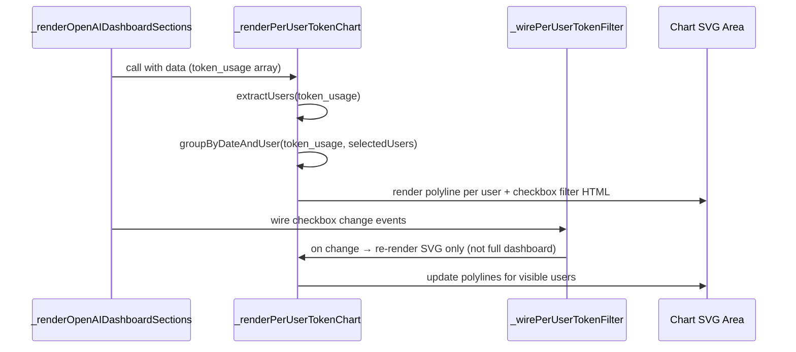

# Design Document: Per-User Token Graph

## Overview

Adds a per-user daily token consumption multi-line chart to the AI Cost Usage Dashboard. The chart uses the existing `token_usage` array from the `openai-usage` API response (each record has a `user_id` field), groups by date and user, and renders one SVG polyline per user with a distinct color. A checkbox-based user filter allows show/hide of individual users without re-fetching data.

## Main Algorithm/Workflow



## Core Interfaces/Types

```javascript
/**
 * A single token_usage record from the API response.
 * @typedef {Object} TokenUsageRecord
 * @property {string} date - ISO date string (YYYY-MM-DD)
 * @property {string} user_id - User identifier
 * @property {string} model - Model name
 * @property {number} input_tokens - Input tokens consumed
 * @property {number} output_tokens - Output tokens consumed
 * @property {number} [input_cached_tokens] - Cached input tokens
 * @property {number} [num_model_requests] - Number of requests
 */

/**
 * Aggregated data per user per date.
 * @typedef {Object} UserDayAggregate
 * @property {string} date
 * @property {string} userId
 * @property {number} totalTokens - input_tokens + output_tokens
 */

/**
 * Chart render state stored in _openaiDashState.
 * @typedef {Object} PerUserChartState
 * @property {string[]} allUsers - All unique user_ids found
 * @property {string[]} visibleUsers - Currently checked/visible users
 * @property {Object<string, string>} userColors - Map of user_id → hex color
 */

// Color palette (8 distinct colors, cycles for >8 users)
var PER_USER_COLORS = [
    '#6366f1', '#10b981', '#f59e0b', '#ef4444',
    '#8b5cf6', '#06b6d4', '#ec4899', '#84cc16'
];
```

## Key Functions with Formal Specifications

### Function 1: _extractUsersFromTokenUsage(tokenUsage)

```javascript
/**
 * Extracts unique user_ids from token_usage array, excluding "unknown".
 * @param {TokenUsageRecord[]} tokenUsage
 * @returns {string[]} Sorted unique user IDs
 */
function _extractUsersFromTokenUsage(tokenUsage) { /* ... */ }
```

**Preconditions:**
- `tokenUsage` is an array (may be empty)
- Each element may or may not have a `user_id` field

**Postconditions:**
- Returns a sorted array of unique non-empty strings that are not "unknown"
- No duplicates in returned array
- If all records lack user_id or all are "unknown", returns empty array

**Loop Invariants:** N/A

---

### Function 2: _groupTokensByDateAndUser(tokenUsage, visibleUsers)

```javascript
/**
 * Groups token_usage records by date and user_id, summing total tokens.
 * @param {TokenUsageRecord[]} tokenUsage
 * @param {string[]} visibleUsers - Only include these user_ids
 * @returns {{ dates: string[], series: Object<string, number[]> }}
 *   dates: sorted array of unique dates
 *   series: { [user_id]: [totalTokensForDate0, totalTokensForDate1, ...] }
 */
function _groupTokensByDateAndUser(tokenUsage, visibleUsers) { /* ... */ }
```

**Preconditions:**
- `tokenUsage` is an array
- `visibleUsers` is a non-empty array of user_id strings

**Postconditions:**
- `dates` is sorted ascending (YYYY-MM-DD lexicographic sort)
- Each value in `series[userId]` corresponds to the same index in `dates`
- `series[userId][i]` = sum of (input_tokens + output_tokens) for that user on dates[i]
- Only users in `visibleUsers` appear in `series`
- If a user has no data on a given date, that slot is 0

**Loop Invariants:**
- For all processed records, the running sum per user per date is non-negative

---

### Function 3: _assignUserColors(users)

```javascript
/**
 * Assigns a color from PER_USER_COLORS palette to each user, cycling if >8.
 * @param {string[]} users
 * @returns {Object<string, string>} Map of user_id → hex color
 */
function _assignUserColors(users) { /* ... */ }
```

**Preconditions:**
- `users` is an array of strings

**Postconditions:**
- Every user in the input array has an entry in the returned map
- Colors cycle through PER_USER_COLORS by index modulo palette length
- Same user always gets the same color (deterministic by array position)

**Loop Invariants:** N/A

---

### Function 4: _renderPerUserTokenChart(data)

```javascript
/**
 * Renders the full Per-User Token Consumption widget HTML including:
 * - Checkbox filter area (one checkbox per user + Select All/Deselect All)
 * - SVG multi-line chart with one polyline per visible user
 * - Legend with user colors
 * @param {Object} data - Full API response (has .token_usage)
 * @returns {string} HTML string
 */
function _renderPerUserTokenChart(data) { /* ... */ }
```

**Preconditions:**
- `data` is an object, `data.token_usage` is an array or undefined
- `_openaiDashState` is accessible

**Postconditions:**
- If no valid users found, returns empty-state HTML with message "No per-user data available"
- Otherwise returns `.openai-widget` card with filter checkboxes and SVG chart
- SVG has one `<polyline>` element per visible user, colored from palette
- Checkbox area includes "Select All" and "Deselect All" buttons

**Loop Invariants:** N/A

---

### Function 5: _wirePerUserTokenFilter(data)

```javascript
/**
 * Wires checkbox change events so toggling a user re-renders only the
 * chart SVG area (not the entire dashboard).
 * @param {Object} data - Full API response
 */
function _wirePerUserTokenFilter(data) { /* ... */ }
```

**Preconditions:**
- DOM contains element with id `peruser-token-filter-area`
- DOM contains element with id `peruser-token-chart-svg`

**Postconditions:**
- Clicking a user checkbox updates `_openaiDashState.perUserVisible`
- Only the `#peruser-token-chart-svg` inner HTML is re-rendered
- "Select All" checks all checkboxes and re-renders
- "Deselect All" unchecks all checkboxes and shows empty chart message

**Loop Invariants:** N/A

---

## Algorithmic Pseudocode

### Main Rendering Algorithm

```javascript
function _renderPerUserTokenChart(data) {
    var tokenUsage = data.token_usage || [];
    
    // Step 1: Extract users
    var allUsers = _extractUsersFromTokenUsage(tokenUsage);
    
    // Empty state
    if (allUsers.length === 0) {
        return '<div class="openai-widget">...(empty state)...</div>';
    }
    
    // Step 2: Determine visible users (default = all)
    var visibleUsers = _openaiDashState.perUserVisible || allUsers;
    
    // Step 3: Assign colors
    var userColors = _assignUserColors(allUsers);
    
    // Step 4: Group data
    var grouped = _groupTokensByDateAndUser(tokenUsage, visibleUsers);
    
    // Step 5: Build HTML
    var html = '<div class="openai-widget">';
    html += '...header...';
    html += renderCheckboxFilter(allUsers, visibleUsers, userColors);
    html += '<div id="peruser-token-chart-svg">';
    html += renderSVGPolylines(grouped, userColors, visibleUsers);
    html += '</div>';
    html += '</div>';
    return html;
}
```

### SVG Polyline Rendering

```javascript
function renderSVGPolylines(grouped, userColors, visibleUsers) {
    var dates = grouped.dates;
    var series = grouped.series;
    
    // Calculate max Y across all visible series
    var maxY = 0;
    visibleUsers.forEach(function(uid) {
        (series[uid] || []).forEach(function(val) {
            if (val > maxY) maxY = val;
        });
    });
    if (maxY === 0) maxY = 1;
    maxY *= 1.1; // 10% headroom
    
    var W = 960, H = 300, PADL = 80, PAD = 55, PADT = 20;
    var chartW = W - PADL - 20;
    var chartH = H - PAD - PADT;
    var stepX = dates.length > 1 ? chartW / (dates.length - 1) : chartW;
    
    var svg = '<svg viewBox="0 0 960 300" ...>';
    
    // Y-axis grid + labels (5 ticks)
    // X-axis date labels (every Nth)
    
    // One polyline per visible user
    visibleUsers.forEach(function(uid) {
        var points = [];
        (series[uid] || []).forEach(function(val, i) {
            var x = PADL + i * stepX;
            var y = (H - PAD) - (val / maxY * chartH);
            points.push(x.toFixed(1) + ',' + y.toFixed(1));
        });
        svg += '<polyline points="' + points.join(' ') + '" ' +
               'fill="none" stroke="' + userColors[uid] + '" stroke-width="2.5" />';
    });
    
    svg += '</svg>';
    return svg;
}
```

### Checkbox Filter Re-render (No Full Dashboard Rebuild)

```javascript
function _wirePerUserTokenFilter(data) {
    var container = document.getElementById('peruser-token-filter-area');
    if (!container) return;
    
    // Delegate click events on checkboxes
    container.addEventListener('change', function(e) {
        if (e.target.classList.contains('peruser-cb')) {
            // Collect checked user_ids
            var checked = [];
            container.querySelectorAll('.peruser-cb:checked').forEach(function(cb) {
                checked.push(cb.value);
            });
            _openaiDashState.perUserVisible = checked.length > 0 ? checked : [];
            
            // Re-render only the SVG area
            var svgArea = document.getElementById('peruser-token-chart-svg');
            var tokenUsage = data.token_usage || [];
            var allUsers = _extractUsersFromTokenUsage(tokenUsage);
            var userColors = _assignUserColors(allUsers);
            var grouped = _groupTokensByDateAndUser(tokenUsage, checked);
            svgArea.innerHTML = renderSVGPolylines(grouped, userColors, checked);
        }
    });
    
    // Select All / Deselect All buttons
    var selectAllBtn = document.getElementById('peruser-select-all');
    var deselectAllBtn = document.getElementById('peruser-deselect-all');
    if (selectAllBtn) selectAllBtn.onclick = function() { /* check all, re-render */ };
    if (deselectAllBtn) deselectAllBtn.onclick = function() { /* uncheck all, re-render */ };
}
```

## Example Usage

```javascript
// Inside _renderOpenAIDashboardSections(), after the existing Token Usage chart section:
html += '<div id="openai-section-peruser-token" class="openai-dash-section">';
html += _renderPerUserTokenChart(data);
html += '</div>';

// After contentEl.innerHTML = html:
_wirePerUserTokenFilter(data);

// The chart uses the existing token_usage data:
// data.token_usage = [
//   { date: '2025-01-15', user_id: 'user-abc', model: 'gpt-4o', input_tokens: 1200, output_tokens: 400 },
//   { date: '2025-01-15', user_id: 'user-xyz', model: 'gpt-4o', input_tokens: 800, output_tokens: 300 },
//   { date: '2025-01-16', user_id: 'user-abc', model: 'gpt-4o-mini', input_tokens: 500, output_tokens: 150 },
//   ...
// ]
```

## Correctness Properties

*A property is a characteristic or behavior that should hold true across all valid executions of a system — essentially, a formal statement about what the system should do. Properties serve as the bridge between human-readable specifications and machine-verifiable correctness guarantees.*

### Property 1: User extraction excludes "unknown" and empty IDs

*For any* `token_usage` array, `_extractUsersFromTokenUsage` SHALL return only non-empty strings that are not equal to "unknown", with no duplicates, sorted alphabetically.

**Validates: Requirements 2.1, 2.3**

### Property 2: Grouping preserves total token count

*For any* `token_usage` array and set of visible users, the sum of all values across all users in the grouped `series` output SHALL equal the sum of `(input_tokens + output_tokens)` for records whose `user_id` is in the visible set.

**Validates: Requirements 4.2**

### Property 3: Color assignment is deterministic and complete

*For any* array of user IDs, `_assignUserColors` SHALL assign exactly one color to each user, cycling through the palette, and calling it twice with the same array SHALL produce identical mappings.

**Validates: Requirements 5.1, 5.2**

### Property 4: SVG polyline count matches visible users

*For any* non-empty set of visible users with at least one data point, the rendered SVG SHALL contain exactly as many `<polyline>` elements as there are visible users.

**Validates: Requirements 1.2**

### Property 5: Empty state when no valid users

*For any* `token_usage` array where all records have `user_id` equal to "unknown" or empty, `_renderPerUserTokenChart` SHALL return HTML containing the text "No per-user data available".

**Validates: Requirements 2.2**
