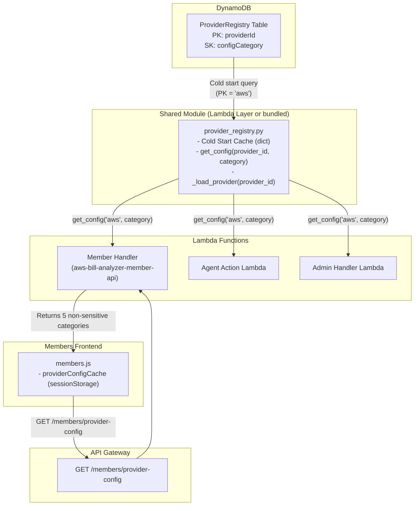

# Design Document: Provider Registry Abstraction

## Overview

This design extracts all AWS-specific hardcoded logic from SlashMyBill's Lambda functions and frontend into a centralized Provider Registry backed by DynamoDB. The registry stores configuration across 10 categories, keyed by `providerId` and `configCategory`. A shared Python module (`provider_registry.py`) loads all provider configuration into an in-memory cache on Lambda cold start, eliminating repeated DynamoDB reads. The frontend accesses non-sensitive configuration via a new `GET /members/provider-config` endpoint. This is Phase 1 — AWS only — a pure architectural refactoring with zero behavioral change.

## Architecture



## Components and Interfaces

### 1. ProviderRegistry DynamoDB Table

**Table Name:** `ProviderRegistry`
**Billing Mode:** PAY_PER_REQUEST
**Key Schema:**
- Partition Key: `providerId` (String) — e.g., `"aws"`
- Sort Key: `configCategory` (String) — e.g., `"auth"`, `"display"`, `"validation"`

**Item Structure:**
```json
{
  "providerId": "aws",
  "configCategory": "auth",
  "config": { /* category-specific map */ },
  "version": 1,
  "updatedAt": "2025-01-15T00:00:00Z"
}
```

**CloudFormation Definition:**
```yaml
ProviderRegistryTable:
  Type: AWS::DynamoDB::Table
  Properties:
    TableName: ProviderRegistry
    BillingMode: PAY_PER_REQUEST
    AttributeDefinitions:
      - AttributeName: providerId
        AttributeType: S
      - AttributeName: configCategory
        AttributeType: S
    KeySchema:
      - AttributeName: providerId
        KeyType: HASH
      - AttributeName: configCategory
        KeyType: RANGE
    Tags:
      - Key: Project
        Value: SlashMyBill
```

### 2. Registry Module (`provider_registry.py`)

The centralized Python module that all Lambda functions import. It loads provider configuration once per cold start and serves all subsequent lookups from memory.

```python
"""
provider_registry.py — Centralized provider configuration cache.

Loaded once per Lambda cold start. All lookups served from in-memory cache.
"""

import boto3
from boto3.dynamodb.conditions import Key

_TABLE_NAME = 'ProviderRegistry'
_cache: dict = {}  # {provider_id: {category: config_map}}


def _load_provider(provider_id: str) -> None:
    """Query all config categories for a provider and populate cache."""
    dynamodb = boto3.resource('dynamodb')
    table = dynamodb.Table(_TABLE_NAME)
    response = table.query(
        KeyConditionExpression=Key('providerId').eq(provider_id)
    )
    _cache[provider_id] = {
        item['configCategory']: item['config']
        for item in response.get('Items', [])
    }


def get_config(provider_id: str, category: str) -> dict:
    """Return config map for (provider_id, category). Lazy-loads if cache empty."""
    if provider_id not in _cache:
        _load_provider(provider_id)
    return _cache.get(provider_id, {}).get(category, {})


def get_all_categories(provider_id: str) -> dict:
    """Return all categories for a provider as {category: config_map}."""
    if provider_id not in _cache:
        _load_provider(provider_id)
    return _cache.get(provider_id, {})


def invalidate_cache() -> None:
    """Clear the cache (used in testing or forced refresh)."""
    _cache.clear()
```

**Deployment Strategy:** The module is bundled as a copy in each Lambda's deployment package (same directory as `lambda_function.py`). This avoids Lambda Layer versioning complexity while keeping the code identical across all consumers. A single source file is copied during the build/deploy scripts.

### 3. Auth Plugin Pattern (`sts_assume_role.py`)

A thin auth helper that uses registry config to compute credentials. This pattern is extensible for future `oauth2.py` or `jwt_auth.py` plugins.

```python
"""
sts_assume_role.py — AWS STS AssumeRole auth plugin.

Uses registry auth config to compute role ARN and external ID.
Extensible pattern: future providers add oauth2.py, jwt_auth.py, etc.
"""

import hashlib
import boto3
from provider_registry import get_config


def assume_role(account_id: str, member_email: str, session_name: str = 'SlashMyBill') -> dict:
    """Assume cross-account role using registry-driven config."""
    auth_config = get_config('aws', 'auth')
    
    # Compute role ARN from pattern
    role_arn_pattern = auth_config['role_arn_pattern']
    role_arn = role_arn_pattern.format(accountId=account_id)
    
    # Compute external ID using configured derivation method
    derivation_method = auth_config['external_id_derivation']
    if derivation_method == 'sha256_member_email':
        external_id = hashlib.sha256(member_email.encode('utf-8')).hexdigest()
    else:
        raise ValueError(f"Unknown derivation method: {derivation_method}")
    
    session_duration = auth_config.get('session_duration_seconds', 3600)
    
    sts = boto3.client('sts')
    response = sts.assume_role(
        RoleArn=role_arn,
        RoleSessionName=session_name,
        ExternalId=external_id,
        DurationSeconds=session_duration
    )
    return response['Credentials']
```

### 4. Provider Config API Endpoint

**Route:** `GET /members/provider-config`
**Auth:** JWT token required (same as other member routes)
**Response:** Combined config from 5 non-sensitive categories

```python
# In member-handler/lambda_function.py — new route handler

FRONTEND_SAFE_CATEGORIES = ['display', 'validation', 'connection-setup', 'ui-config', 'ai-prompts']
SENSITIVE_CATEGORIES = ['auth', 'cost-api', 'resource-discovery', 'scheduler-actions', 'pricing']


def handle_get_provider_config(event):
    """Return non-sensitive provider config for frontend consumption."""
    auth = validate_token(event)
    if isinstance(auth, dict) and 'statusCode' in auth:
        return auth

    try:
        all_config = provider_registry.get_all_categories('aws')
        response_config = {
            category: all_config[category]
            for category in FRONTEND_SAFE_CATEGORIES
            if category in all_config
        }
        return create_response(200, response_config, headers={
            'Cache-Control': 'public, max-age=3600'
        })
    except Exception as e:
        logger.error(f"Provider registry unavailable: {e}")
        return create_response(503, {
            'error': 'ServiceUnavailable',
            'message': 'Provider configuration temporarily unavailable'
        }, headers={'Retry-After': '30'})
```

**Response Shape:**
```json
{
  "display": {
    "name": "Amazon Web Services",
    "icon_url": "/assets/aws-icon.svg",
    "brand_color": "#FF9900",
    "description": "AWS Cloud Cost Management"
  },
  "validation": {
    "account_id_regex": "^\\d{12}$",
    "format_description": "12-digit AWS Account ID",
    "placeholder": "123456789012",
    "error_messages": {
      "invalid_format": "Please enter a valid 12-digit AWS Account ID"
    }
  },
  "connection-setup": { "..." },
  "ui-config": { "..." },
  "ai-prompts": { "..." }
}
```

## Data Models

### Config Category Schemas

#### `display` Category
```json
{
  "name": "Amazon Web Services",
  "icon_url": "/assets/aws-icon.svg",
  "brand_color": "#FF9900",
  "description": "AWS Cloud Cost Management"
}
```

#### `auth` Category
```json
{
  "auth_type": "sts_assume_role",
  "role_arn_pattern": "arn:aws:iam::{accountId}:role/SlashMyBill-{accountId}",
  "external_id_derivation": "sha256_member_email",
  "session_duration_seconds": 3600,
  "required_iam_actions": [
    "ce:GetCostAndUsage",
    "ce:GetCostForecast",
    "ec2:DescribeInstances",
    "ec2:DescribeVolumes",
    "rds:DescribeDBInstances",
    "lambda:ListFunctions",
    "s3:ListAllMyBuckets",
    "budgets:ViewBudget"
  ]
}
```

#### `validation` Category
```json
{
  "account_id_regex": "^\\d{12}$",
  "format_description": "12-digit AWS Account ID",
  "placeholder": "123456789012",
  "error_messages": {
    "invalid_format": "Please enter a valid 12-digit AWS Account ID",
    "empty": "Account ID is required"
  }
}
```

#### `cost-api` Category
```json
{
  "service": "ce",
  "method": "get_cost_and_usage",
  "granularities": ["DAILY", "MONTHLY"],
  "group_by_dimensions": ["SERVICE", "LINKED_ACCOUNT", "USAGE_TYPE"],
  "date_format": "%Y-%m-%d",
  "metrics": ["UnblendedCost", "BlendedCost", "AmortizedCost"]
}
```

#### `resource-discovery` Category
```json
{
  "resource_types": {
    "ec2": {
      "service": "ec2",
      "method": "describe_instances",
      "pagination_token": "NextToken",
      "response_list_path": "Reservations[].Instances[]",
      "attributes": {
        "id": "InstanceId",
        "type": "InstanceType",
        "state": "State.Name",
        "launch_time": "LaunchTime",
        "name": "Tags[?Key=='Name'].Value | [0]"
      }
    },
    "rds": {
      "service": "rds",
      "method": "describe_db_instances",
      "pagination_token": "Marker",
      "response_list_path": "DBInstances",
      "attributes": {
        "id": "DBInstanceIdentifier",
        "type": "DBInstanceClass",
        "engine": "Engine",
        "state": "DBInstanceStatus",
        "multi_az": "MultiAZ"
      }
    },
    "lambda": {
      "service": "lambda",
      "method": "list_functions",
      "pagination_token": "NextMarker",
      "response_list_path": "Functions",
      "attributes": {
        "name": "FunctionName",
        "runtime": "Runtime",
        "memory": "MemorySize",
        "timeout": "Timeout",
        "last_modified": "LastModified"
      }
    },
    "s3": {
      "service": "s3",
      "method": "list_buckets",
      "pagination_token": null,
      "response_list_path": "Buckets",
      "attributes": {
        "name": "Name",
        "created": "CreationDate"
      }
    },
    "ebs": {
      "service": "ec2",
      "method": "describe_volumes",
      "pagination_token": "NextToken",
      "response_list_path": "Volumes",
      "attributes": {
        "id": "VolumeId",
        "size_gb": "Size",
        "type": "VolumeType",
        "state": "State",
        "iops": "Iops"
      }
    }
  }
}
```

#### `connection-setup` Category
```json
{
  "template_type": "cloudformation",
  "role_name_pattern": "SlashMyBill-{accountId}",
  "trust_policy": {
    "Version": "2012-10-17",
    "Statement": [{
      "Effect": "Allow",
      "Principal": {"AWS": "arn:aws:iam::991105135552:root"},
      "Action": "sts:AssumeRole",
      "Condition": {
        "StringEquals": {"sts:ExternalId": "{externalId}"}
      }
    }]
  },
  "managed_policy_arns": [],
  "console_urls": {
    "cloudformation": "https://console.aws.amazon.com/cloudformation/home?region=us-east-1#/stacks/create/review?stackName=SlashMyBill-Access&templateURL={templateUrl}",
    "iam": "https://console.aws.amazon.com/iam/home#/roles"
  }
}
```

#### `scheduler-actions` Category
```json
{
  "actions": {
    "ec2": {
      "stop": {"service": "ec2", "method": "stop_instances", "params": ["InstanceIds"], "description": "Stop EC2 instances"},
      "start": {"service": "ec2", "method": "start_instances", "params": ["InstanceIds"], "description": "Start EC2 instances"}
    },
    "rds": {
      "stop": {"service": "rds", "method": "stop_db_instance", "params": ["DBInstanceIdentifier"], "description": "Stop RDS instance"},
      "start": {"service": "rds", "method": "start_db_instance", "params": ["DBInstanceIdentifier"], "description": "Start RDS instance"}
    },
    "eks": {
      "scale_down": {"service": "eks", "method": "update_nodegroup_config", "params": ["clusterName", "nodegroupName", "scalingConfig"], "description": "Scale down EKS nodegroup"},
      "scale_up": {"service": "eks", "method": "update_nodegroup_config", "params": ["clusterName", "nodegroupName", "scalingConfig"], "description": "Scale up EKS nodegroup"}
    },
    "ecs": {
      "scale_down": {"service": "ecs", "method": "update_service", "params": ["cluster", "service", "desiredCount"], "description": "Scale down ECS service"},
      "scale_up": {"service": "ecs", "method": "update_service", "params": ["cluster", "service", "desiredCount"], "description": "Scale up ECS service"}
    }
  }
}
```

#### `pricing` Category
```json
{
  "instance_pricing": {
    "t3.micro": 0.0104,
    "t3.small": 0.0208,
    "t3.medium": 0.0416,
    "m5.large": 0.096,
    "m5.xlarge": 0.192
  },
  "platform_multipliers": {
    "Linux": 1.0,
    "Windows": 1.46,
    "RHEL": 1.3,
    "SUSE": 1.2
  },
  "pricing_api": {
    "service_code": "AmazonEC2",
    "filters": {
      "operatingSystem": "Linux",
      "tenancy": "Shared",
      "capacitystatus": "Used",
      "preInstalledSw": "NA"
    }
  }
}
```

#### `ai-prompts` Category
```json
{
  "system_prompt_fragments": {
    "cost_optimization_context": "You are a cloud cost optimization expert...",
    "service_explanations": {
      "AmazonEC2": "EC2 provides resizable compute capacity...",
      "AmazonRDS": "RDS is a managed relational database service...",
      "AmazonS3": "S3 is object storage with industry-leading scalability..."
    }
  },
  "pricing_rules": {
    "reserved_discount": "Up to 72% savings with 3-year All Upfront RI",
    "spot_discount": "Up to 90% savings for fault-tolerant workloads",
    "savings_plans": "Up to 66% savings with 1-year Compute Savings Plan"
  },
  "response_templates": {
    "cost_summary": "Your {service} costs for {period}: ${amount}",
    "savings_opportunity": "Potential savings: ${amount}/month by {action}"
  }
}
```

#### `ui-config` Category
```json
{
  "service_display_names": {
    "AmazonEC2": "EC2 Instances",
    "AmazonRDS": "RDS Databases",
    "AmazonS3": "S3 Storage",
    "AWSLambda": "Lambda Functions",
    "AmazonEBS": "EBS Volumes",
    "AmazonVPC": "VPC & Networking",
    "AmazonEKS": "EKS Clusters",
    "AmazonECS": "ECS Services"
  },
  "follow_up_questions": [
    "What are my top cost drivers this month?",
    "How can I reduce my EC2 spending?",
    "Show me unused resources I can delete",
    "What savings plans should I consider?"
  ],
  "topic_to_service_mapping": {
    "compute": ["AmazonEC2", "AWSLambda", "AmazonECS", "AmazonEKS"],
    "storage": ["AmazonS3", "AmazonEBS"],
    "database": ["AmazonRDS"],
    "networking": ["AmazonVPC"]
  }
}
```

### 5. Interfaces

#### Registry Module API

| Function | Signature | Description |
|----------|-----------|-------------|
| `get_config` | `get_config(provider_id: str, category: str) -> dict` | Returns config map for a specific category |
| `get_all_categories` | `get_all_categories(provider_id: str) -> dict` | Returns all categories as `{category: config}` |
| `invalidate_cache` | `invalidate_cache() -> None` | Clears in-memory cache (testing/refresh) |

#### Auth Plugin API

| Function | Signature | Description |
|----------|-----------|-------------|
| `assume_role` | `assume_role(account_id: str, member_email: str, session_name: str) -> dict` | Returns STS credentials dict |

#### Provider Config API (HTTP)

| Method | Path | Auth | Response |
|--------|------|------|----------|
| GET | `/members/provider-config` | JWT Bearer | 200: Combined non-sensitive config |
| | | | 401: Unauthorized |
| | | | 503: Registry unavailable |

**Response Headers:**
- `Cache-Control: public, max-age=3600`
- `Content-Type: application/json`

#### Frontend Integration

```javascript
// members.js — Provider config client-side cache

let _providerConfig = null;

async function getProviderConfig() {
    if (_providerConfig) return _providerConfig;
    
    const resp = await fetch(`${API}/members/provider-config`, {
        headers: { 'Authorization': `Bearer ${getToken()}` }
    });
    if (!resp.ok) throw new Error('Failed to load provider config');
    
    _providerConfig = await resp.json();
    return _providerConfig;
}

// Usage example: validate account ID
async function validateAccountId(input) {
    const config = await getProviderConfig();
    const regex = new RegExp(config.validation.account_id_regex);
    return regex.test(input);
}
```

## Seed Data Strategy

The seed data script extracts hardcoded values from the existing codebase and writes them to the ProviderRegistry table. This ensures byte-for-byte equivalence between the registry values and the values being replaced.

**Seed Script:** `infrastructure/seed-provider-registry.py`

```python
"""
seed_provider_registry.py — Populate ProviderRegistry table with AWS config.

Values are extracted directly from the existing hardcoded constants in:
- member-handler/lambda_function.py
- agent-action/lambda_function.py
- admin-handler/lambda_function.py
- members/members.js
"""

import boto3

dynamodb = boto3.resource('dynamodb')
table = dynamodb.Table('ProviderRegistry')

SEED_DATA = [
    {'providerId': 'aws', 'configCategory': 'display', 'config': {... }},
    {'providerId': 'aws', 'configCategory': 'auth', 'config': {... }},
    {'providerId': 'aws', 'configCategory': 'validation', 'config': {... }},
    {'providerId': 'aws', 'configCategory': 'cost-api', 'config': {... }},
    {'providerId': 'aws', 'configCategory': 'resource-discovery', 'config': {... }},
    {'providerId': 'aws', 'configCategory': 'connection-setup', 'config': {... }},
    {'providerId': 'aws', 'configCategory': 'scheduler-actions', 'config': {... }},
    {'providerId': 'aws', 'configCategory': 'pricing', 'config': {... }},
    {'providerId': 'aws', 'configCategory': 'ai-prompts', 'config': {... }},
    {'providerId': 'aws', 'configCategory': 'ui-config', 'config': {... }},
]

def seed():
    with table.batch_writer() as batch:
        for item in SEED_DATA:
            item['version'] = 1
            batch.put_item(Item=item)
    print(f"Seeded {len(SEED_DATA)} items to ProviderRegistry")

if __name__ == '__main__':
    seed()
```

## Refactoring Approach

The refactoring follows a data-layer-first strategy:

1. **Build** — Create ProviderRegistry table, registry module, auth plugin
2. **Seed** — Populate table with extracted hardcoded values
3. **Refactor consumers** — Replace hardcoded references one Lambda at a time
4. **Verify** — Run behavioral equivalence tests after each consumer refactoring

### Refactoring Pattern (Before → After)

**Before (hardcoded):**
```python
role_arn = f'arn:aws:iam::{account_id}:role/SlashMyBill-{account_id}'
external_id = hashlib.sha256(member_email.encode('utf-8')).hexdigest()
sts = boto3.client('sts')
resp = sts.assume_role(RoleArn=role_arn, RoleSessionName='SlashMyBillAct', ExternalId=external_id)
creds = resp['Credentials']
```

**After (registry-driven):**
```python
from sts_assume_role import assume_role
creds = assume_role(account_id, member_email, session_name='SlashMyBillAct')
```

## Error Handling

| Scenario | Behavior |
|----------|----------|
| DynamoDB unavailable on cold start | Registry module retries once, then raises `RegistryUnavailableError` |
| DynamoDB unavailable on lazy-load | Same as above — retry once, then raise |
| Missing category in cache | `get_config()` returns empty dict `{}` |
| Provider Config API — registry down | Returns 503 with `Retry-After: 30` header |
| Provider Config API — unauthenticated | Returns 401 Unauthorized |
| Invalid provider_id | `get_config()` returns empty dict (no error) |
| Malformed config in DynamoDB | Config is returned as-is; consumers validate their own expectations |

## Security Considerations

1. **Sensitive category exclusion** — The Provider Config API endpoint explicitly filters out `auth`, `cost-api`, `resource-discovery`, `scheduler-actions`, and `pricing` categories. These contain IAM role patterns, API method names, and pricing data that should not be exposed to the browser.

2. **No secrets in registry** — The registry stores configuration patterns (e.g., role ARN templates) but never stores actual secrets (passwords, keys, tokens). Secrets remain in environment variables or AWS Secrets Manager.

3. **DynamoDB IAM permissions** — Each Lambda's IAM role gets `dynamodb:Query` permission on the ProviderRegistry table (read-only). Only the seed script and admin operations need write access.

4. **Cache immutability** — The in-memory cache is populated once and never modified during request processing. This prevents cache poisoning attacks.

## Performance Considerations

1. **Cold start impact** — A single DynamoDB Query (partition key = 'aws') retrieves all 10 items in one round-trip (~50ms). This adds minimal latency to cold starts.

2. **Warm invocations** — Zero additional latency. All lookups are in-memory dictionary access.

3. **Frontend caching** — The Provider Config API response is cached client-side for 1 hour via `Cache-Control` header, and in-memory for the browser session. This means at most 1 API call per session.

4. **Table sizing** — With 10 items for the `aws` provider, the table is tiny. PAY_PER_REQUEST billing means zero cost when idle and negligible cost during cold starts.

## Testing Strategy

### Unit Tests (Example-Based)
- Verify seed data contains all 10 categories with correct field presence
- Verify Provider Config API returns 503 when DynamoDB is unavailable
- Verify Provider Config API returns Cache-Control header with max-age=3600
- Verify `get_config()` returns empty dict for unknown category
- Verify frontend `getProviderConfig()` caches response in memory

### Property-Based Tests
- Registry cache lookup correctness (Property 1)
- Cache serves from memory without DynamoDB calls (Property 2)
- Cache lazy-initialization (Property 3)
- Auth config role ARN and external ID computation (Property 4)
- Validation regex equivalence (Property 5)
- Resource discovery config completeness (Property 6)
- CloudFormation template generation equivalence (Property 7)
- Scheduler actions config completeness (Property 8)
- Pricing lookup equivalence (Property 9)
- API category filtering — sensitive exclusion (Property 10)
- Display config pass-through (Property 11)
- Seed data byte-for-byte equivalence (Property 12)
- Behavioral equivalence of refactored handlers (Property 13)

### Integration Tests
- End-to-end: Deploy table, seed data, call Provider Config API, verify response
- Frontend visual regression: Compare rendered pages before/after refactoring
- Cross-account STS AssumeRole with registry-driven config (manual verification)

## Correctness Properties

*A property is a characteristic or behavior that should hold true across all valid executions of a system — essentially, a formal statement about what the system should do. Properties serve as the bridge between human-readable specifications and machine-verifiable correctness guarantees.*

### Property 1: Registry cache lookup correctness

*For any* valid `(provider_id, category)` pair that exists in the DynamoDB table, calling `get_config(provider_id, category)` after cache initialization SHALL return the exact `config` map that was stored in the table for that item.

**Validates: Requirements 12.1, 12.3**

### Property 2: Registry cache serves from memory without additional DynamoDB calls

*For any* sequence of `get_config()` calls after the initial cache load for a provider, the registry module SHALL make zero additional DynamoDB API calls — all lookups are served from the in-memory dictionary.

**Validates: Requirements 12.2**

### Property 3: Registry cache lazy-initialization on empty cache

*For any* call to `get_config(provider_id, category)` when the cache does not contain `provider_id`, the registry module SHALL perform a DynamoDB query to populate the cache and then return the correct config map.

**Validates: Requirements 12.4**

### Property 4: Auth config produces correct role ARN and external ID

*For any* valid 12-digit `account_id` and any `member_email` string, the `assume_role()` function using registry auth config SHALL compute a `role_arn` equal to `f'arn:aws:iam::{account_id}:role/SlashMyBill-{account_id}'` and an `external_id` equal to `hashlib.sha256(member_email.encode('utf-8')).hexdigest()`.

**Validates: Requirements 3.2, 3.3, 14.1, 15.1**

### Property 5: Validation regex equivalence

*For any* input string, applying the regex pattern from the registry validation config SHALL produce the same match/no-match result as applying the hardcoded pattern `^\d{12}$`.

**Validates: Requirements 4.2, 14.2, 16.1**

### Property 6: Resource discovery config completeness

*For any* resource type entry in the resource-discovery configuration, the entry SHALL contain all required fields: `service` (non-empty string), `method` (non-empty string), `pagination_token` (string or null), `response_list_path` (non-empty string), and `attributes` (non-empty mapping).

**Validates: Requirements 6.2, 6.3, 6.4, 14.4, 15.2**

### Property 7: CloudFormation template generation equivalence

*For any* valid 12-digit `account_id` and any `member_email`, the CloudFormation template generated using registry connection-setup config SHALL be structurally identical to the template generated by the pre-refactoring hardcoded logic (same role name, same trust policy principal, same external ID condition, same IAM policy actions).

**Validates: Requirements 7.2, 14.3**

### Property 8: Scheduler actions config completeness

*For any* action entry in the scheduler-actions configuration, the entry SHALL contain all required fields: `service` (non-empty string), `method` (non-empty string), `params` (non-empty list), and `description` (non-empty string).

**Validates: Requirements 8.2, 8.3, 14.5**

### Property 9: Pricing lookup equivalence

*For any* instance type key that exists in both the registry pricing config and the original hardcoded pricing table, the registry-supplied hourly rate SHALL be numerically equal to the hardcoded rate.

**Validates: Requirements 9.2, 14.7, 15.3**

### Property 10: Provider Config API category filtering

*For any* response from the `GET /members/provider-config` endpoint, the response SHALL contain only keys from the set `{display, validation, connection-setup, ui-config, ai-prompts}` and SHALL never contain keys from the set `{auth, cost-api, resource-discovery, scheduler-actions, pricing}`.

**Validates: Requirements 13.1, 13.2**

### Property 11: Display config pass-through without transformation

*For any* display configuration map stored in the registry, the Provider Config API response SHALL include the display category with values byte-for-byte identical to the stored config — no field renaming, no value transformation, no field omission.

**Validates: Requirements 2.2**

### Property 12: Seed data byte-for-byte equivalence

*For any* configuration value in the Provider Registry seed data, the value SHALL be byte-for-byte equivalent to the corresponding hardcoded value extracted from the original source code (member-handler, agent-action, admin-handler, or members.js).

**Validates: Requirements 18.5**

### Property 13: Behavioral equivalence of refactored handlers

*For any* valid API request to the Member Handler, Agent Action Lambda, or Admin Handler, the refactored implementation using registry lookups SHALL produce identical response bodies and HTTP status codes as the pre-refactoring implementation with hardcoded values, given the same input and mocked AWS service responses.

**Validates: Requirements 18.1, 18.2, 18.4**
