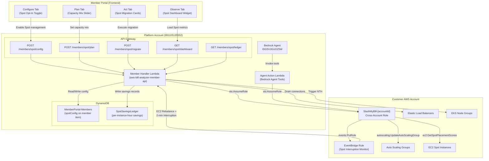
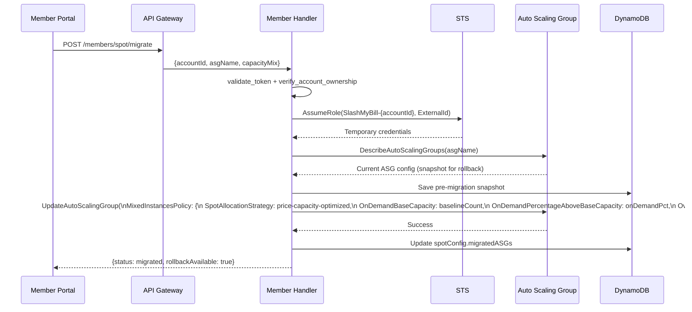
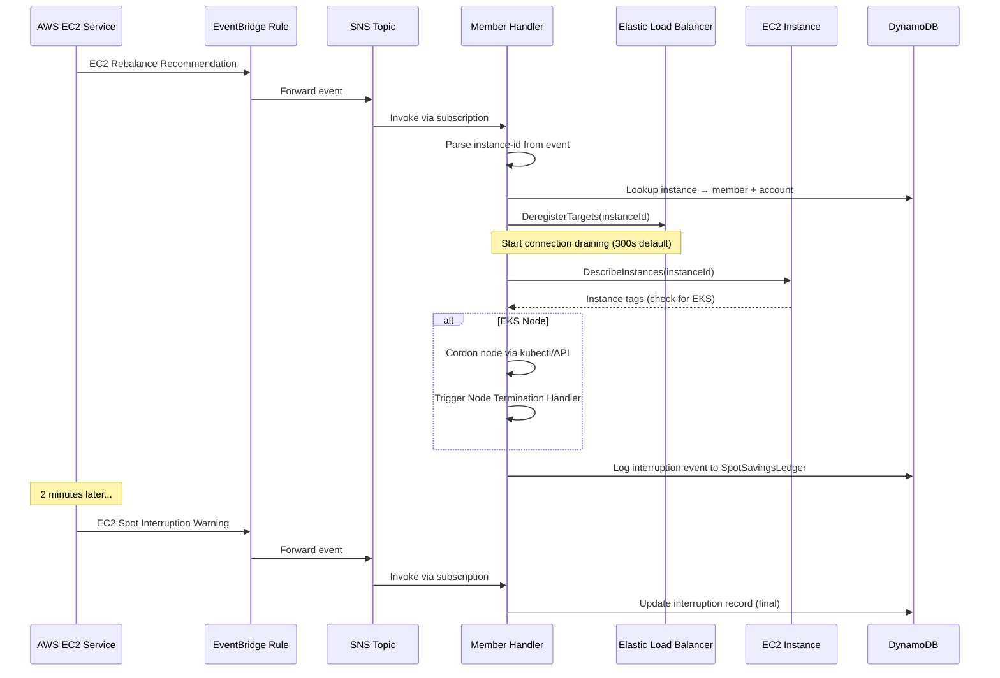
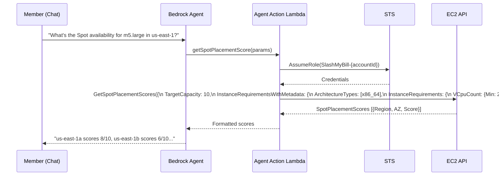

# Design Document: Autonomous Spot Instance Management

## Overview

SlashMyBill currently identifies Spot Instance candidates passively through the `_check_spot_candidates` function in the waste-scan engine — flagging non-production EC2 instances with low CPU as advisory cards. This feature expands that passive detection into a full autonomous Spot Instance lifecycle orchestration system, comparable to CAST AI and Spot by NetApp.

The feature is organized into four major components: **Configure** (IAM role expansion, Spot opt-in toggle, workload qualification), **Plan** (Spot Placement Score forecasting via Bedrock Agent, attribute-based instance selection, capacity mix configuration), **Observe** (dashboard widget for On-Demand vs Spot ratio, Effective Savings Rate tracking, savings ledger for gainshare billing), and **Act** (ASG migration to price-capacity-optimized strategy). Email notifications via SES keep the member informed of migrations, interruptions, and rollbacks.

The system operates cross-account via the existing STS AssumeRole pattern (SHA-256 ExternalId), extends the Bedrock Agent (IDG5VJGUOZ5W) with new action tools for Spot placement scoring and migration execution, and stores all savings tracking data in a new DynamoDB table (`SpotSavingsLedger`) to support the 30% gainshare billing model.

### Key Design Decision: ASG-Native Interruption Handling

When an ASG is configured with a `price-capacity-optimized` Mixed Instances Policy, the ASG handles Spot interruptions natively — **no SlashMyBill intervention is needed for replacement**:

#### Interruption Timeline

| Time | What Happens | Who Does It |
|------|-------------|-------------|
| **T+0s** | AWS issues EC2 Spot Instance Interruption Warning (2-minute notice) | AWS EC2 |
| **T+0–5s** | ASG detects capacity drop, requests replacement from the pool with most spare capacity at lowest price | ASG (native) |
| **T+5–60s** | Replacement instance boots, runs launch template config, registers with ELB target group | ASG + ELB (native) |
| **T+0–120s** | Old instance drains connections gracefully via ELB deregistration delay | ELB (native) |
| **T+120s** | AWS terminates the reclaimed instance. Replacement is already serving traffic. | AWS EC2 |
| **Next dashboard load** | SlashMyBill detects the interruption via `ec2:DescribeSpotInstanceRequests` polling, sends email notification to member | SlashMyBill |

#### Why SlashMyBill Does NOT Purchase Replacements

The ASG is the orchestrator. When you set `price-capacity-optimized` as the allocation strategy:
- The ASG **automatically** launches a replacement when any instance leaves the fleet
- It picks from diversified instance pools (attribute-based selection = 10+ instance types)
- It prioritizes pools with the most available spare hardware at the lowest price
- ELB connection draining handles in-flight requests on the old instance

**SlashMyBill's role is limited to:**
- **Before**: Detect candidates, plan the capacity mix, execute the one-time ASG migration
- **After**: Observe the results (Spot/On-Demand ratio, savings, interruption count) and **notify the customer via email**

#### Email Notifications (Push-Based via EventBridge → SNS → Lambda)

Interruption notifications are **push-based**, not polling-based. The flow:

1. **EventBridge rule** in the customer account catches `EC2 Spot Instance Interruption Warning` and `EC2 Instance Rebalance Recommendation` events
2. **SNS topic** in the platform account (`SlashMyBill-SpotInterruptions`) receives the event cross-account
3. **Member Handler Lambda** is invoked by SNS, looks up the member by account ID, and sends the email via SES immediately

This means the customer gets the email **within seconds** of the interruption — not on next dashboard load.

SlashMyBill sends email notifications to the member's registered email (via existing SES infrastructure: `noreply@slashmycloudbill.com`) for:
1. **Interruption detected** (push, ~2s latency) — ASG name, interrupted instance ID/type, reason, timestamp, confirmation that ASG has automatically launched a replacement
2. **Migration complete** (synchronous) — ASG name, capacity mix, estimated savings, rollback available for 7 days
3. **Rollback complete** (synchronous) — ASG name, confirmation that original config is restored

Deduplication: if the same instance ID was notified within the last 5 minutes, the duplicate event is skipped.

## Architecture



## Sequence Diagrams

### Spot Migration Flow



### Spot Interruption Handling Flow



### Spot Placement Score Query Flow



## Components and Interfaces

### Component 1: Spot Configuration Manager

**Purpose**: Manages per-account Spot opt-in state, workload qualification, and deploys/removes the EventBridge interruption monitoring rule into the customer account.

**Interface**:

```python
# POST /members/spot/config
# Request:
{
    "accountId": "123456789012",
    "spotEnabled": True,
    "qualifiedASGs": ["asg-web-prod", "asg-worker-dev"],
    "excludedASGs": ["asg-database-prod"],
    "interruptionMonitoring": True
}

# Response: 200
{
    "spotEnabled": True,
    "qualifiedASGs": ["asg-web-prod", "asg-worker-dev"],
    "excludedASGs": ["asg-database-prod"],
    "interruptionMonitoring": True,
    "eventBridgeRuleArn": "arn:aws:events:us-east-1:123456789012:rule/SlashMyBill-SpotInterruption",
    "updatedAt": "2025-07-01T10:00:00Z"
}
```

**Responsibilities**:
- Validate account ownership and connection status
- Store Spot configuration on the member's DynamoDB item (`spotConfig` field)
- Deploy EventBridge rule into customer account via cross-account role when `interruptionMonitoring` is enabled
- Remove EventBridge rule when monitoring is disabled
- Validate ASG names exist in the customer account before qualifying them

### Component 2: Spot Placement Predictor (Bedrock Agent Tool)

**Purpose**: New action tool for the Bedrock Agent that queries the AWS Spot Placement Score API to help members understand Spot availability before migration.

**Interface**:

```python
# OpenAPI schema addition to agent-action/openapi-schema.json
# POST /get-spot-placement-score
{
    "operationId": "getSpotPlacementScore",
    "summary": "Get Spot Instance placement scores by region/AZ",
    "description": "Queries AWS Spot Placement Score API to assess Spot capacity availability. Returns scores 1-10 per region/AZ for the requested instance requirements.",
    "parameters": [
        {"name": "accountId", "in": "query", "required": True, "schema": {"type": "string"}},
        {"name": "memberEmail", "in": "query", "required": True, "schema": {"type": "string"}},
        {"name": "vCpuMin", "in": "query", "required": True, "schema": {"type": "integer"}},
        {"name": "vCpuMax", "in": "query", "required": True, "schema": {"type": "integer"}},
        {"name": "memoryMiBMin", "in": "query", "required": True, "schema": {"type": "integer"}},
        {"name": "memoryMiBMax", "in": "query", "required": True, "schema": {"type": "integer"}},
        {"name": "targetCapacity", "in": "query", "required": False, "schema": {"type": "integer"}, "description": "Target capacity (default: 10)"},
        {"name": "regions", "in": "query", "required": False, "schema": {"type": "string"}, "description": "Comma-separated region codes (default: all US regions)"}
    ]
}
```

**Responsibilities**:
- Translate vCPU/memory requirements into `InstanceRequirementsWithMetadata`
- Query `ec2:GetSpotPlacementScores` across requested regions
- Return scores sorted by score descending with region/AZ breakdown
- Cache results for 15 minutes (scores don't change rapidly)

### Component 3: Capacity Mix Configurator

**Purpose**: Allows members to configure the On-Demand/Spot blend ratio per ASG before migration.

**Interface**:

```python
# POST /members/spot/plan
# Request:
{
    "accountId": "123456789012",
    "asgName": "asg-web-prod",
    "capacityMix": {
        "onDemandBaseCapacity": 2,
        "onDemandPercentageAboveBase": 20,
        "spotAllocationStrategy": "price-capacity-optimized",
        "instanceRequirements": {
            "vCpuCount": {"min": 2, "max": 8},
            "memoryMiB": {"min": 4096, "max": 16384},
            "excludedInstanceTypes": ["t2.*"],
            "instanceGenerations": ["current"]
        }
    }
}

# Response: 200
{
    "asgName": "asg-web-prod",
    "currentConfig": {
        "instanceType": "m5.large",
        "desiredCapacity": 10,
        "minSize": 2,
        "maxSize": 20
    },
    "proposedConfig": {
        "onDemandInstances": 2,
        "spotInstances": 8,
        "spotPercentage": 80,
        "instancePools": 12,
        "estimatedMonthlySavings": 456.00,
        "estimatedSpotDiscount": 68
    },
    "placementScores": [
        {"az": "us-east-1a", "score": 9},
        {"az": "us-east-1b", "score": 7},
        {"az": "us-east-1c", "score": 8}
    ]
}
```

**Responsibilities**:
- Fetch current ASG configuration from customer account
- Calculate proposed On-Demand/Spot split based on capacity mix settings
- Query Spot Placement Scores for the configured instance requirements
- Estimate monthly savings based on current On-Demand pricing vs historical Spot pricing
- Validate that instance requirements match at least 10 instance pools (attribute-based selection requirement)

### Component 4: Spot Operations Dashboard Widget

**Purpose**: ECharts widget on the Observe tab showing real-time On-Demand vs Spot capacity ratio, ESR tracking, and savings trend.

**Interface**:

```python
# GET /members/spot/dashboard
# Query params: accountId (optional, defaults to all accounts)
# Response: 200
{
    "capacityRatio": {
        "onDemand": 4,
        "spot": 16,
        "total": 20,
        "spotPercentage": 80
    },
    "effectiveSavingsRate": {
        "actual": 0.62,
        "maximum": 0.72,
        "esr": 0.86,
        "esrTrend": [0.80, 0.82, 0.85, 0.86]
    },
    "savingsTrend": [
        {"date": "2025-06-01", "onDemandCost": 1200.00, "spotCost": 384.00, "savings": 816.00},
        {"date": "2025-06-02", "onDemandCost": 1200.00, "spotCost": 396.00, "savings": 804.00}
    ],
    "interruptions": {
        "last30Days": 3,
        "avgRecoverySeconds": 45,
        "gracefulDrainSuccess": 1.0
    },
    "migratedASGs": [
        {
            "asgName": "asg-web-prod",
            "accountId": "123456789012",
            "spotPercentage": 80,
            "monthlySavings": 456.00,
            "status": "healthy"
        }
    ]
}
```

**Responsibilities**:
- Aggregate Spot vs On-Demand instance counts across all migrated ASGs
- Calculate Effective Savings Rate (ESR) = actual savings / maximum possible savings
- Build daily savings trend from the SpotSavingsLedger
- Track interruption events and recovery metrics
- Return data formatted for ECharts rendering

### Component 5: Capacity Mix Auto-Migrator

**Purpose**: Executes the actual ASG migration to use Spot Instances with the price-capacity-optimized allocation strategy.

**Interface**:

```python
# POST /members/spot/migrate
# Request:
{
    "accountId": "123456789012",
    "asgName": "asg-web-prod",
    "action": "migrate",  # migrate | rollback | dry-run
    "capacityMix": {
        "onDemandBaseCapacity": 2,
        "onDemandPercentageAboveBase": 20,
        "spotAllocationStrategy": "price-capacity-optimized",
        "instanceRequirements": {
            "vCpuCount": {"min": 2, "max": 8},
            "memoryMiB": {"min": 4096, "max": 16384},
            "instanceGenerations": ["current"]
        }
    }
}

# Response: 200 (migrate)
{
    "status": "migrated",
    "asgName": "asg-web-prod",
    "previousConfig": { ... },  # full ASG config snapshot for rollback
    "newConfig": {
        "mixedInstancesPolicy": { ... }
    },
    "rollbackAvailable": True,
    "rollbackExpiresAt": "2025-07-08T10:00:00Z"
}

# Response: 200 (dry-run)
{
    "status": "dry-run",
    "asgName": "asg-web-prod",
    "changes": [
        "LaunchTemplate → MixedInstancesPolicy",
        "InstanceType m5.large → Attribute-based (2-8 vCPU, 4-16 GiB)",
        "AllocationStrategy → price-capacity-optimized",
        "OnDemandBaseCapacity: 2, SpotPercentage: 80%"
    ],
    "estimatedMonthlySavings": 456.00,
    "risks": [
        "Spot interruptions may occur (mitigated by diversified pools)",
        "Instance types may vary (mitigated by attribute-based selection)"
    ]
}

# Response: 200 (rollback)
{
    "status": "rolled-back",
    "asgName": "asg-web-prod",
    "restoredConfig": { ... }
}
```

**Responsibilities**:
- Snapshot current ASG configuration before any changes (stored in DynamoDB for rollback)
- Validate the ASG is qualified for Spot migration (not in excluded list)
- Support dry-run mode that shows proposed changes without executing
- Apply MixedInstancesPolicy with attribute-based instance selection
- Support rollback to pre-migration configuration within 7 days
- Record migration event in SpotSavingsLedger

### Component 6: Interruption Guardian

**Purpose**: EventBridge rule deployed into the customer account that monitors EC2 rebalance recommendations and 2-minute Spot interruption notices, triggering graceful draining.

**Interface**:

```python
# EventBridge Rule Pattern (deployed to customer account)
{
    "source": ["aws.ec2"],
    "detail-type": [
        "EC2 Instance Rebalance Recommendation",
        "EC2 Spot Instance Interruption Warning"
    ]
}

# EventBridge Rule Target: SNS Topic in platform account
# SNS → Lambda subscription → Member Handler

# Interruption event payload (from EventBridge):
{
    "version": "0",
    "id": "abc123",
    "detail-type": "EC2 Spot Instance Interruption Warning",
    "source": "aws.ec2",
    "account": "123456789012",
    "time": "2025-07-01T12:00:00Z",
    "region": "us-east-1",
    "detail": {
        "instance-id": "i-0abc123def456",
        "instance-action": "terminate"
    }
}
```

**Responsibilities**:
- Deploy EventBridge rule into customer account via cross-account CloudFormation
- Route interruption events to platform account via SNS cross-account subscription
- On rebalance recommendation: begin proactive connection draining
- On interruption warning: cordon instance, deregister from ELB targets, trigger EKS Node Termination Handler if applicable
- Log all interruption events to SpotSavingsLedger with timestamps and recovery metrics

### Component 7: Savings Ledger

**Purpose**: DynamoDB table tracking the delta between On-Demand rate and Spot rate per instance-hour, serving as the basis for the 30% gainshare billing model.

**Interface**:

```python
# DynamoDB Table: SpotSavingsLedger
# Partition Key: memberEmail#accountId
# Sort Key: timestamp#instanceId

# Record schema:
{
    "pk": "user@example.com#123456789012",
    "sk": "2025-07-01T12:00:00Z#i-0abc123",
    "instanceId": "i-0abc123",
    "instanceType": "m5.large",
    "availabilityZone": "us-east-1a",
    "onDemandRate": 0.096,       # $/hour
    "spotRate": 0.029,            # $/hour
    "savingsPerHour": 0.067,      # delta
    "hours": 1.0,
    "totalSavings": 0.067,
    "gainshareAmount": 0.0201,    # 30% of savings
    "eventType": "running",       # running | interrupted | migrated | rolled-back
    "asgName": "asg-web-prod",
    "recordedAt": "2025-07-01T12:00:00Z",
    "ttl": 1756684800            # 12-month retention
}
```

**Responsibilities**:
- Record hourly savings for each Spot instance vs its On-Demand equivalent
- Calculate gainshare amount (30% of savings delta)
- Support aggregation queries for dashboard (daily/weekly/monthly rollups)
- Track interruption events with zero-savings records
- TTL-based cleanup after 12 months
- Provide data for billing reconciliation

## Data Models

### Spot Configuration (on member DynamoDB item)

```json
{
    "spotConfig": {
        "enabledAccounts": {
            "123456789012": {
                "spotEnabled": true,
                "interruptionMonitoring": true,
                "eventBridgeRuleArn": "arn:aws:events:us-east-1:123456789012:rule/SlashMyBill-SpotInterruption",
                "qualifiedASGs": ["asg-web-prod", "asg-worker-dev"],
                "excludedASGs": ["asg-database-prod"],
                "enabledAt": "2025-07-01T10:00:00Z"
            }
        },
        "migratedASGs": [
            {
                "accountId": "123456789012",
                "asgName": "asg-web-prod",
                "migratedAt": "2025-07-01T11:00:00Z",
                "previousConfig": {
                    "launchTemplate": {"id": "lt-0abc123", "version": "3"},
                    "instanceType": "m5.large",
                    "desiredCapacity": 10,
                    "minSize": 2,
                    "maxSize": 20
                },
                "currentConfig": {
                    "mixedInstancesPolicy": {
                        "launchTemplate": {
                            "launchTemplateSpecification": {"id": "lt-0abc123", "version": "3"},
                            "overrides": [
                                {
                                    "instanceRequirements": {
                                        "vCpuCount": {"min": 2, "max": 8},
                                        "memoryMiB": {"min": 4096, "max": 16384},
                                        "instanceGenerations": ["current"]
                                    }
                                }
                            ]
                        },
                        "instancesDistribution": {
                            "onDemandBaseCapacity": 2,
                            "onDemandPercentageAboveBaseCapacity": 20,
                            "spotAllocationStrategy": "price-capacity-optimized"
                        }
                    }
                },
                "status": "active",
                "rollbackExpiresAt": "2025-07-08T11:00:00Z"
            }
        ]
    }
}
```

**Validation Rules**:
- `accountId` must be exactly 12 digits and owned by the member
- `qualifiedASGs` and `excludedASGs` must not overlap
- `onDemandBaseCapacity` must be >= 0 and <= ASG maxSize
- `onDemandPercentageAboveBase` must be 0-100 (typically 20-40)
- `vCpuCount.min` must be > 0 and <= `vCpuCount.max`
- `memoryMiB.min` must be > 0 and <= `memoryMiB.max`
- Instance requirements must match at least 10 instance pools

### SpotSavingsLedger Table Schema

```json
{
    "TableName": "SpotSavingsLedger",
    "KeySchema": [
        {"AttributeName": "pk", "KeyType": "HASH"},
        {"AttributeName": "sk", "KeyType": "RANGE"}
    ],
    "AttributeDefinitions": [
        {"AttributeName": "pk", "AttributeType": "S"},
        {"AttributeName": "sk", "AttributeType": "S"},
        {"AttributeName": "memberEmail", "AttributeType": "S"},
        {"AttributeName": "recordedAt", "AttributeType": "S"}
    ],
    "GlobalSecondaryIndexes": [
        {
            "IndexName": "MemberTimeIndex",
            "KeySchema": [
                {"AttributeName": "memberEmail", "KeyType": "HASH"},
                {"AttributeName": "recordedAt", "KeyType": "RANGE"}
            ],
            "Projection": {"ProjectionType": "ALL"}
        }
    ],
    "TimeToLiveSpecification": {
        "AttributeName": "ttl",
        "Enabled": true
    },
    "BillingMode": "PAY_PER_REQUEST"
}
```

### Interruption Event Record

```json
{
    "pk": "user@example.com#123456789012",
    "sk": "2025-07-01T12:00:00Z#i-0abc123#interruption",
    "instanceId": "i-0abc123",
    "instanceType": "m5.large",
    "eventType": "interruption",
    "interruptionType": "rebalance",
    "detectedAt": "2025-07-01T12:00:00Z",
    "drainingStartedAt": "2025-07-01T12:00:01Z",
    "drainingCompletedAt": "2025-07-01T12:00:45Z",
    "recoverySeconds": 44,
    "connectionsAtDrain": 12,
    "gracefulDrain": true,
    "asgName": "asg-web-prod",
    "replacementInstanceId": "i-0xyz789",
    "replacementLaunchedAt": "2025-07-01T12:00:30Z"
}
```


## Algorithmic Pseudocode

### Algorithm 1: Spot Migration Execution

```python
def execute_spot_migration(member_email, account_id, asg_name, capacity_mix, action):
    """
    Migrate an ASG to use Spot Instances with price-capacity-optimized strategy.
    
    Preconditions:
        - member_email is authenticated and owns account_id
        - asg_name exists in the customer account
        - asg_name is in qualifiedASGs and NOT in excludedASGs
        - capacity_mix.onDemandBaseCapacity >= 0
        - capacity_mix.onDemandPercentageAboveBase in [0, 100]
        - capacity_mix.instanceRequirements matches >= 10 instance pools
    
    Postconditions:
        - If action == 'migrate': ASG updated with MixedInstancesPolicy, 
          previous config saved for rollback, status recorded in DynamoDB
        - If action == 'dry-run': No changes made, proposed changes returned
        - If action == 'rollback': ASG restored to pre-migration config
        - SpotSavingsLedger contains migration event record
    """
    # Step 1: Validate ownership and qualification
    verify_account_ownership(member_email, account_id)
    spot_config = load_spot_config(member_email, account_id)
    
    assert asg_name in spot_config['qualifiedASGs'], "ASG not qualified"
    assert asg_name not in spot_config['excludedASGs'], "ASG is excluded"
    
    # Step 2: Assume cross-account role
    credentials = assume_role_for_account(member_email, account_id)
    asg_client = make_client('autoscaling', credentials)
    
    # Step 3: Fetch current ASG configuration
    current_config = asg_client.describe_auto_scaling_groups(
        AutoScalingGroupNames=[asg_name]
    )['AutoScalingGroups'][0]
    
    if action == 'dry-run':
        return build_dry_run_response(current_config, capacity_mix)
    
    if action == 'rollback':
        return execute_rollback(member_email, account_id, asg_name, asg_client)
    
    # Step 4: Snapshot current config for rollback
    snapshot = {
        'launchTemplate': current_config.get('LaunchTemplate'),
        'mixedInstancesPolicy': current_config.get('MixedInstancesPolicy'),
        'desiredCapacity': current_config['DesiredCapacity'],
        'minSize': current_config['MinSize'],
        'maxSize': current_config['MaxSize']
    }
    save_migration_snapshot(member_email, account_id, asg_name, snapshot)
    
    # Step 5: Build MixedInstancesPolicy
    mixed_policy = {
        'LaunchTemplate': {
            'LaunchTemplateSpecification': current_config['LaunchTemplate'],
            'Overrides': [{
                'InstanceRequirements': {
                    'VCpuCount': {
                        'Min': capacity_mix['instanceRequirements']['vCpuCount']['min'],
                        'Max': capacity_mix['instanceRequirements']['vCpuCount']['max']
                    },
                    'MemoryMiB': {
                        'Min': capacity_mix['instanceRequirements']['memoryMiB']['min'],
                        'Max': capacity_mix['instanceRequirements']['memoryMiB']['max']
                    },
                    'InstanceGenerations': ['current']
                }
            }]
        },
        'InstancesDistribution': {
            'OnDemandBaseCapacity': capacity_mix['onDemandBaseCapacity'],
            'OnDemandPercentageAboveBaseCapacity': capacity_mix['onDemandPercentageAboveBase'],
            'SpotAllocationStrategy': 'price-capacity-optimized'
        }
    }
    
    # Step 6: Apply migration
    asg_client.update_auto_scaling_group(
        AutoScalingGroupName=asg_name,
        MixedInstancesPolicy=mixed_policy
    )
    
    # Step 7: Record migration in DynamoDB
    update_migrated_asg(member_email, account_id, asg_name, snapshot, mixed_policy)
    record_ledger_event(member_email, account_id, 'migrated', asg_name)
    
    return {
        'status': 'migrated',
        'asgName': asg_name,
        'previousConfig': snapshot,
        'rollbackAvailable': True,
        'rollbackExpiresAt': (now() + timedelta(days=7)).isoformat()
    }
```

### Algorithm 2: Interruption Handler

```python
def handle_spot_interruption(event):
    """
    Process EC2 Spot interruption or rebalance recommendation events.
    
    Preconditions:
        - event contains valid 'detail-type' (Rebalance or Interruption Warning)
        - event.detail contains 'instance-id'
        - event.account is a monitored customer account
    
    Postconditions:
        - Instance deregistered from all target groups
        - If EKS node: node cordoned and NTH triggered
        - Interruption event recorded in SpotSavingsLedger
        - Recovery time tracked from detection to drain completion
    
    Loop Invariants: N/A (event-driven, no loops)
    """
    instance_id = event['detail']['instance-id']
    account_id = event['account']
    event_type = event['detail-type']
    detected_at = datetime.utcnow()
    
    # Step 1: Lookup which member owns this account
    member_email = lookup_member_by_account(account_id)
    if not member_email:
        log_warning(f"No member found for account {account_id}")
        return
    
    # Step 2: Assume cross-account role
    credentials = assume_role_for_account(member_email, account_id)
    
    # Step 3: Get instance details
    ec2_client = make_client('ec2', credentials)
    instance = ec2_client.describe_instances(
        InstanceIds=[instance_id]
    )['Reservations'][0]['Instances'][0]
    
    tags = {t['Key']: t['Value'] for t in instance.get('Tags', [])}
    asg_name = tags.get('aws:autoscaling:groupName')
    
    # Step 4: Deregister from ELB target groups
    elbv2_client = make_client('elbv2', credentials)
    target_groups = find_target_groups_for_instance(elbv2_client, instance_id)
    connections_at_drain = 0
    
    for tg_arn in target_groups:
        health = elbv2_client.describe_target_health(
            TargetGroupArn=tg_arn,
            Targets=[{'Id': instance_id}]
        )
        connections_at_drain += estimate_active_connections(health)
        
        elbv2_client.deregister_targets(
            TargetGroupArn=tg_arn,
            Targets=[{'Id': instance_id}]
        )
    
    draining_started_at = datetime.utcnow()
    
    # Step 5: Handle EKS nodes
    is_eks_node = 'eks:nodegroup-name' in tags or 'kubernetes.io/cluster' in str(tags)
    if is_eks_node:
        cordon_and_drain_eks_node(credentials, instance_id, tags)
    
    draining_completed_at = datetime.utcnow()
    recovery_seconds = (draining_completed_at - detected_at).total_seconds()
    
    # Step 6: Record interruption event
    record_interruption_event(
        member_email=member_email,
        account_id=account_id,
        instance_id=instance_id,
        instance_type=instance.get('InstanceType'),
        event_type='rebalance' if 'Rebalance' in event_type else 'interruption',
        detected_at=detected_at.isoformat(),
        draining_started_at=draining_started_at.isoformat(),
        draining_completed_at=draining_completed_at.isoformat(),
        recovery_seconds=round(recovery_seconds),
        connections_at_drain=connections_at_drain,
        graceful_drain=True,
        asg_name=asg_name
    )
```

### Algorithm 3: Effective Savings Rate Calculation

```python
def calculate_effective_savings_rate(member_email, account_id, period_days=30):
    """
    Calculate the Effective Savings Rate (ESR) for Spot usage.
    ESR = actual_savings / maximum_possible_savings
    
    Preconditions:
        - member_email is valid
        - account_id is valid 12-digit string or None (all accounts)
        - period_days > 0
    
    Postconditions:
        - Returns ESR in range [0.0, 1.0]
        - actual_savings <= maximum_possible_savings
        - If no Spot instances running, returns ESR = 0.0
        - gainshare_amount = actual_savings * 0.30
    """
    # Query SpotSavingsLedger for the period
    start_date = (datetime.utcnow() - timedelta(days=period_days)).isoformat()
    
    if account_id:
        pk = f"{member_email}#{account_id}"
        records = query_ledger(pk=pk, sk_start=start_date)
    else:
        records = query_ledger_by_member(member_email=member_email, start=start_date)
    
    total_on_demand_cost = 0.0
    total_spot_cost = 0.0
    total_hours = 0.0
    
    # Loop invariant: total_on_demand_cost >= total_spot_cost (Spot is always <= On-Demand)
    for record in records:
        if record['eventType'] == 'running':
            total_on_demand_cost += record['onDemandRate'] * record['hours']
            total_spot_cost += record['spotRate'] * record['hours']
            total_hours += record['hours']
    
    if total_on_demand_cost == 0:
        return {
            'actual': 0.0,
            'maximum': 0.0,
            'esr': 0.0,
            'totalHours': 0.0,
            'gainshareAmount': 0.0
        }
    
    actual_savings = total_on_demand_cost - total_spot_cost
    
    # Maximum possible savings = if all instances ran at lowest Spot price
    # For simplicity, use 90% discount as theoretical maximum
    maximum_possible_savings = total_on_demand_cost * 0.90
    
    esr = actual_savings / maximum_possible_savings if maximum_possible_savings > 0 else 0.0
    esr = min(esr, 1.0)  # Cap at 1.0
    
    gainshare_amount = actual_savings * 0.30
    
    return {
        'actual': round(actual_savings, 2),
        'maximum': round(maximum_possible_savings, 2),
        'esr': round(esr, 4),
        'totalHours': round(total_hours, 1),
        'gainshareAmount': round(gainshare_amount, 2)
    }
```

### Algorithm 4: Workload Qualification Validator

```python
def validate_workload_qualification(member_email, account_id, asg_names):
    """
    Validate which ASGs are safe for Spot migration.
    
    Preconditions:
        - member_email owns account_id
        - asg_names is a non-empty list of ASG name strings
    
    Postconditions:
        - Returns qualification result for each ASG
        - Databases and fault-intolerant workloads are flagged as excluded
        - Each ASG has a risk score (low/medium/high)
        - qualified + excluded + ineligible = len(asg_names)
    
    Loop Invariants:
        - For each processed ASG: result is one of {qualified, excluded, ineligible}
        - Sum of all categories equals number of processed ASGs
    """
    credentials = assume_role_for_account(member_email, account_id)
    asg_client = make_client('autoscaling', credentials)
    ec2_client = make_client('ec2', credentials)
    
    results = []
    
    for asg_name in asg_names:
        asg = asg_client.describe_auto_scaling_groups(
            AutoScalingGroupNames=[asg_name]
        )['AutoScalingGroups']
        
        if not asg:
            results.append({
                'asgName': asg_name,
                'status': 'ineligible',
                'reason': 'ASG not found',
                'risk': 'high'
            })
            continue
        
        asg = asg[0]
        tags = {t['Key']: t['Value'] for t in asg.get('Tags', [])}
        instances = asg.get('Instances', [])
        
        # Check exclusion criteria
        exclusion_reasons = []
        
        # Rule 1: Database workloads (by tag or name pattern)
        env = tags.get('Environment', tags.get('Env', '')).lower()
        name = tags.get('Name', asg_name).lower()
        if any(db in name for db in ['database', 'db', 'rds', 'mongo', 'redis', 'elastic']):
            exclusion_reasons.append('Database workload detected')
        
        # Rule 2: Stateful workloads
        if tags.get('Stateful', '').lower() == 'true':
            exclusion_reasons.append('Stateful workload (tagged)')
        
        # Rule 3: Single-instance ASGs (no redundancy)
        if asg['MaxSize'] <= 1:
            exclusion_reasons.append('Single-instance ASG (no redundancy)')
        
        # Rule 4: Already using Spot
        spot_instances = [i for i in instances if i.get('LifecycleState') == 'InService' 
                         and i.get('InstanceType', '') != '']
        # Check if already has MixedInstancesPolicy with Spot
        if asg.get('MixedInstancesPolicy'):
            dist = asg['MixedInstancesPolicy'].get('InstancesDistribution', {})
            if dist.get('SpotAllocationStrategy'):
                exclusion_reasons.append('Already using Spot allocation')
        
        # Rule 5: Production with no multi-AZ
        azs = set(i.get('AvailabilityZone', '') for i in instances)
        is_prod = env in ['prod', 'production']
        if is_prod and len(azs) < 2:
            exclusion_reasons.append('Production workload in single AZ')
        
        if exclusion_reasons:
            results.append({
                'asgName': asg_name,
                'status': 'excluded',
                'reasons': exclusion_reasons,
                'risk': 'high'
            })
        else:
            risk = 'low' if not is_prod else 'medium'
            results.append({
                'asgName': asg_name,
                'status': 'qualified',
                'risk': risk,
                'currentInstanceType': instances[0].get('InstanceType', 'unknown') if instances else 'unknown',
                'instanceCount': len(instances),
                'azCount': len(azs)
            })
    
    qualified = [r for r in results if r['status'] == 'qualified']
    excluded = [r for r in results if r['status'] == 'excluded']
    ineligible = [r for r in results if r['status'] == 'ineligible']
    
    assert len(qualified) + len(excluded) + len(ineligible) == len(asg_names)
    
    return {
        'qualified': qualified,
        'excluded': excluded,
        'ineligible': ineligible,
        'summary': f"{len(qualified)} qualified, {len(excluded)} excluded, {len(ineligible)} not found"
    }
```

### Algorithm 5: EventBridge Interruption Rule Deployment

```python
def deploy_interruption_monitor(member_email, account_id, enable):
    """
    Deploy or remove the EventBridge rule for Spot interruption monitoring
    in the customer account.
    
    Preconditions:
        - member_email owns account_id
        - Cross-account role has events:PutRule, events:PutTargets,
          events:DeleteRule, events:RemoveTargets permissions
    
    Postconditions:
        - If enable=True: EventBridge rule exists in customer account,
          targets platform SNS topic, rule ARN stored in DynamoDB
        - If enable=False: EventBridge rule removed from customer account,
          rule ARN cleared from DynamoDB
        - No orphaned rules (deploy is idempotent)
    """
    RULE_NAME = f"SlashMyBill-SpotInterruption-{account_id}"
    PLATFORM_SNS_ARN = f"arn:aws:sns:us-east-1:{PLATFORM_ACCOUNT_ID}:SlashMyBill-SpotInterruptions"
    
    credentials = assume_role_for_account(member_email, account_id)
    events_client = make_client('events', credentials)
    
    if enable:
        # Step 1: Create/update the EventBridge rule
        rule_response = events_client.put_rule(
            Name=RULE_NAME,
            EventPattern=json.dumps({
                "source": ["aws.ec2"],
                "detail-type": [
                    "EC2 Instance Rebalance Recommendation",
                    "EC2 Spot Instance Interruption Warning"
                ]
            }),
            State='ENABLED',
            Description='SlashMyBill Spot Instance interruption monitor'
        )
        rule_arn = rule_response['RuleArn']
        
        # Step 2: Set target to platform SNS topic
        events_client.put_targets(
            Rule=RULE_NAME,
            Targets=[{
                'Id': 'SlashMyBillPlatform',
                'Arn': PLATFORM_SNS_ARN
            }]
        )
        
        # Step 3: Store rule ARN in member config
        update_spot_config(member_email, account_id, {
            'interruptionMonitoring': True,
            'eventBridgeRuleArn': rule_arn
        })
        
        return {'status': 'enabled', 'ruleArn': rule_arn}
    
    else:
        # Step 1: Remove targets
        try:
            events_client.remove_targets(Rule=RULE_NAME, Ids=['SlashMyBillPlatform'])
        except events_client.exceptions.ResourceNotFoundException:
            pass  # Rule doesn't exist, nothing to remove
        
        # Step 2: Delete rule
        try:
            events_client.delete_rule(Name=RULE_NAME)
        except events_client.exceptions.ResourceNotFoundException:
            pass  # Already deleted
        
        # Step 3: Clear from member config
        update_spot_config(member_email, account_id, {
            'interruptionMonitoring': False,
            'eventBridgeRuleArn': None
        })
        
        return {'status': 'disabled'}
```

## Key Functions with Formal Specifications

### Function: get_spot_placement_score()

```python
def get_spot_placement_score(account_id, member_email, vcpu_min, vcpu_max, 
                              memory_mib_min, memory_mib_max, 
                              target_capacity=10, regions=None):
```

**Preconditions:**
- `account_id` is a valid 12-digit string
- `member_email` is a valid email that owns `account_id`
- `vcpu_min` > 0 and `vcpu_min` <= `vcpu_max`
- `memory_mib_min` > 0 and `memory_mib_min` <= `memory_mib_max`
- `target_capacity` > 0 and `target_capacity` <= 1000
- `regions` is None or a list of valid AWS region codes

**Postconditions:**
- Returns a list of `{region, az, score}` objects
- Each `score` is an integer in [1, 10]
- Results are sorted by `score` descending
- If a region has no Spot capacity, it is excluded from results (not returned with score 0)

### Function: build_mixed_instances_policy()

```python
def build_mixed_instances_policy(current_asg_config, capacity_mix):
```

**Preconditions:**
- `current_asg_config` contains a valid `LaunchTemplate` or `LaunchConfigurationName`
- `capacity_mix` contains `onDemandBaseCapacity`, `onDemandPercentageAboveBase`, `instanceRequirements`
- `capacity_mix.instanceRequirements.vCpuCount.min` <= `capacity_mix.instanceRequirements.vCpuCount.max`
- `capacity_mix.instanceRequirements.memoryMiB.min` <= `capacity_mix.instanceRequirements.memoryMiB.max`

**Postconditions:**
- Returns a valid AWS `MixedInstancesPolicy` dict
- `SpotAllocationStrategy` is always `price-capacity-optimized`
- `OnDemandBaseCapacity` >= 0
- `OnDemandPercentageAboveBaseCapacity` in [0, 100]
- `Overrides` contains exactly one entry with `InstanceRequirements`

**Loop Invariants:** N/A

### Function: record_savings_entry()

```python
def record_savings_entry(member_email, account_id, instance_id, instance_type,
                          on_demand_rate, spot_rate, hours, asg_name, event_type):
```

**Preconditions:**
- `on_demand_rate` >= 0
- `spot_rate` >= 0
- `spot_rate` <= `on_demand_rate` (Spot is never more expensive than On-Demand)
- `hours` > 0
- `event_type` is one of: 'running', 'interrupted', 'migrated', 'rolled-back'

**Postconditions:**
- A record is written to SpotSavingsLedger with `savingsPerHour` = `on_demand_rate` - `spot_rate`
- `totalSavings` = `savingsPerHour` * `hours`
- `gainshareAmount` = `totalSavings` * 0.30
- Record has a TTL set to 12 months from now
- Record `pk` = `{member_email}#{account_id}`
- Record `sk` = `{timestamp}#{instance_id}`

**Loop Invariants:** N/A

### Function: aggregate_dashboard_data()

```python
def aggregate_dashboard_data(member_email, account_ids=None, period_days=30):
```

**Preconditions:**
- `member_email` is valid
- `account_ids` is None (all accounts) or a list of valid 12-digit account IDs owned by the member
- `period_days` > 0

**Postconditions:**
- `capacityRatio.total` = `capacityRatio.onDemand` + `capacityRatio.spot`
- `capacityRatio.spotPercentage` = `capacityRatio.spot` / `capacityRatio.total` * 100 (or 0 if total is 0)
- `effectiveSavingsRate.esr` in [0.0, 1.0]
- `savingsTrend` is sorted by date ascending
- Each `savingsTrend` entry has `savings` = `onDemandCost` - `spotCost`
- `interruptions.gracefulDrainSuccess` in [0.0, 1.0]

**Loop Invariants:**
- Running total of on-demand and spot costs remains non-negative throughout aggregation

## Example Usage

### Example 1: Enable Spot Management for an Account

```python
# Member enables Spot management on the Configure tab
response = api('POST', '/members/spot/config', {
    'accountId': '123456789012',
    'spotEnabled': True,
    'qualifiedASGs': ['asg-web-prod', 'asg-worker-dev'],
    'excludedASGs': ['asg-database-prod'],
    'interruptionMonitoring': True
})
# → Deploys EventBridge rule into customer account
# → Stores config on member DynamoDB item
```

### Example 2: Plan a Capacity Mix

```python
# Member configures 80% Spot / 20% On-Demand on the Plan tab
response = api('POST', '/members/spot/plan', {
    'accountId': '123456789012',
    'asgName': 'asg-web-prod',
    'capacityMix': {
        'onDemandBaseCapacity': 2,
        'onDemandPercentageAboveBase': 20,
        'spotAllocationStrategy': 'price-capacity-optimized',
        'instanceRequirements': {
            'vCpuCount': {'min': 2, 'max': 8},
            'memoryMiB': {'min': 4096, 'max': 16384},
            'instanceGenerations': ['current']
        }
    }
})
# → Returns estimated savings of $456/month
# → Shows placement scores: us-east-1a=9, us-east-1b=7, us-east-1c=8
```

### Example 3: Execute Migration (with dry-run first)

```python
# Dry run first
dry_run = api('POST', '/members/spot/migrate', {
    'accountId': '123456789012',
    'asgName': 'asg-web-prod',
    'action': 'dry-run',
    'capacityMix': { ... }
})
# → Shows proposed changes without executing

# Then execute
result = api('POST', '/members/spot/migrate', {
    'accountId': '123456789012',
    'asgName': 'asg-web-prod',
    'action': 'migrate',
    'capacityMix': { ... }
})
# → ASG updated, rollback available for 7 days
```

### Example 4: Bedrock Agent Spot Query

```python
# User asks in chat: "What's the Spot availability for my web servers?"
# Agent calls getSpotPlacementScore tool:
agent_response = get_spot_placement_score(
    account_id='123456789012',
    member_email='user@example.com',
    vcpu_min=2, vcpu_max=8,
    memory_mib_min=4096, memory_mib_max=16384,
    target_capacity=10
)
# → Returns: [
#     {'region': 'us-east-1', 'az': 'us-east-1a', 'score': 9},
#     {'region': 'us-east-1', 'az': 'us-east-1c', 'score': 8},
#     {'region': 'us-east-1', 'az': 'us-east-1b', 'score': 7}
# ]
```

### Example 5: Dashboard Widget Data

```javascript
// Frontend loads Spot dashboard widget on Observe tab
const spotData = await api('GET', '/members/spot/dashboard?accountId=123456789012');

// Render capacity ratio donut chart (ECharts)
const capacityChart = echarts.init(document.getElementById('spot-capacity-chart'));
capacityChart.setOption({
    series: [{
        type: 'pie',
        radius: ['50%', '70%'],
        data: [
            { value: spotData.capacityRatio.onDemand, name: 'On-Demand', itemStyle: { color: '#f59e0b' } },
            { value: spotData.capacityRatio.spot, name: 'Spot', itemStyle: { color: '#10b981' } }
        ]
    }]
});

// Render savings trend line chart
const savingsChart = echarts.init(document.getElementById('spot-savings-chart'));
savingsChart.setOption({
    xAxis: { type: 'category', data: spotData.savingsTrend.map(d => d.date) },
    yAxis: { type: 'value', axisLabel: { formatter: '${value}' } },
    series: [
        { name: 'On-Demand Cost', type: 'line', data: spotData.savingsTrend.map(d => d.onDemandCost) },
        { name: 'Spot Cost', type: 'line', data: spotData.savingsTrend.map(d => d.spotCost) },
        { name: 'Savings', type: 'bar', data: spotData.savingsTrend.map(d => d.savings) }
    ]
});
```


## Correctness Properties

*A property is a characteristic or behavior that should hold true across all valid executions of a system — essentially, a formal statement about what the system should do. Properties serve as the bridge between human-readable specifications and machine-verifiable correctness guarantees.*

### Property 1: Capacity mix invariant — On-Demand + Spot = Total

*For any* valid capacity mix configuration with `onDemandBaseCapacity` B and `onDemandPercentageAboveBase` P applied to an ASG with desired capacity D, the resulting On-Demand count SHALL equal `B + ceil((D - B) * P / 100)` and the Spot count SHALL equal `D - onDemandCount`, and `onDemandCount + spotCount == D`.

**Validates: Requirement 5.2**

### Property 2: Savings ledger arithmetic consistency

*For any* savings ledger record with `onDemandRate` R_od, `spotRate` R_sp, and `hours` H, the record SHALL satisfy: `savingsPerHour == R_od - R_sp`, `totalSavings == savingsPerHour * H`, `gainshareAmount == totalSavings * 0.30`, and `R_sp <= R_od` (Spot is never more expensive than On-Demand). The `eventType` field SHALL be one of {running, interrupted, migrated, rolled-back}.

**Validates: Requirements 8.1, 8.2, 8.6**

### Property 3: Effective Savings Rate is bounded [0, 1]

*For any* set of savings ledger records over any time period, the computed Effective Savings Rate (ESR) SHALL be in the range [0.0, 1.0], where ESR = actual_savings / maximum_possible_savings. If no Spot instances are running (zero records), ESR SHALL be 0.0.

**Validates: Requirement 9.2**

### Property 4: Workload qualification completeness and exclusion correctness

*For any* list of N ASG names submitted for qualification validation, the result SHALL contain exactly N entries, and each entry SHALL have status in {qualified, excluded, ineligible}. The sum `len(qualified) + len(excluded) + len(ineligible)` SHALL equal N. ASGs with database-related keywords in name or tags, `Stateful=true` tag, MaxSize <= 1, existing Spot allocation, or production environment in fewer than 2 AZs SHALL be classified as excluded.

**Validates: Requirements 2.1, 2.2, 2.3, 2.4, 2.5, 2.6, 2.7**

### Property 5: Migration rollback restores original config

*For any* ASG that has been migrated to Spot, executing a rollback SHALL restore the ASG to its exact pre-migration configuration (LaunchTemplate, DesiredCapacity, MinSize, MaxSize, and absence of MixedInstancesPolicy if none existed before). The rollback SHALL be available for exactly 7 days after migration.

**Validates: Requirement 7.1**

### Property 6: Spot Placement Score response validity

*For any* valid instance requirements (vCpuMin <= vCpuMax, memoryMin <= memoryMax, targetCapacity > 0), the Spot Placement Score response SHALL contain only scores in the integer range [1, 10], SHALL be sorted by score descending, and SHALL not contain duplicate region+AZ combinations.

**Validates: Requirements 4.2, 4.3**

### Property 7: Attribute-based selection pool minimum

*For any* instance requirements configuration used in a migration, the attribute-based selection SHALL match at least 10 distinct instance types across the target region. If fewer than 10 instance types match, the migration SHALL be rejected with an error before any ASG changes are made.

**Validates: Requirement 5.5**

### Property 8: Interruption event completeness

*For any* Spot interruption or rebalance event processed by the Interruption Guardian, the resulting DynamoDB record SHALL contain all required fields: instanceId, instanceType, eventType (rebalance or interruption), detectedAt, recoverySeconds, gracefulDrain (boolean), and asgName. The `recoverySeconds` SHALL equal `drainingCompletedAt - detectedAt` in seconds.

**Validates: Requirement 10.2**

### Property 9: Cross-account template contains all Spot permissions

*For any* valid 12-digit account ID and member email where Spot management is enabled, the CloudFormation template generated by `handle_generate_template` SHALL include all of the following IAM actions: `ec2:GetSpotPlacementScores`, `autoscaling:UpdateAutoScalingGroup`, `autoscaling:DescribeAutoScalingGroups`, `events:PutRule`, `events:PutTargets`, `events:DeleteRule`, `events:RemoveTargets`, `elasticloadbalancing:DeregisterTargets`, `elasticloadbalancing:DescribeTargetHealth`.

**Validates: Requirement 3.1**

### Property 10: Dashboard capacity ratio and savings trend consistency

*For any* dashboard data response, `capacityRatio.total` SHALL equal `capacityRatio.onDemand + capacityRatio.spot`, and `capacityRatio.spotPercentage` SHALL equal `round(capacityRatio.spot / capacityRatio.total * 100)` when total > 0, or 0 when total == 0. Each `savingsTrend` entry SHALL satisfy `savings == onDemandCost - spotCost`, and the trend array SHALL be sorted by date ascending.

**Validates: Requirements 9.1, 9.4**

### Property 11: Qualified and excluded ASGs are disjoint

*For any* Spot configuration for an account, the sets `qualifiedASGs` and `excludedASGs` SHALL be disjoint — no ASG name SHALL appear in both sets. Any attempt to add an ASG to both sets SHALL be rejected with a validation error.

**Validates: Requirement 1.2**

### Property 12: EventBridge rule deployment idempotency

*For any* sequence of enable/disable operations on the interruption monitor for a given account, the final state SHALL match the last operation: if the last call was `enable=True`, exactly one EventBridge rule SHALL exist with the correct pattern; if the last call was `enable=False`, no EventBridge rule SHALL exist. Repeated enable calls SHALL not create duplicate rules.

**Validates: Requirement 10.3**

## Error Handling

### Member Handler Errors

| Scenario | HTTP Status | Error Code | Behavior |
|----------|-------------|------------|----------|
| Invalid account ID (not 12 digits) | 400 | InvalidAccountId | Return error, no changes |
| Account not owned by member | 403 | Forbidden | Return error |
| ASG not found in customer account | 404 | ASGNotFound | Return error |
| ASG in excluded list | 400 | ASGExcluded | Return error with exclusion reasons |
| Instance requirements match < 10 pools | 400 | InsufficientPools | Return error, suggest broadening requirements |
| Cross-account role missing Spot permissions | 403 | InsufficientPermissions | Return error, prompt template update |
| EventBridge rule deployment fails | 500 | EventBridgeError | Return error, no config saved |
| Spot Placement Score API unavailable | 503 | ServiceUnavailable | Return cached scores if available, else error |
| Migration fails mid-update | 500 | MigrationError | Attempt rollback to snapshot, return error |
| Rollback expired (> 7 days) | 400 | RollbackExpired | Return error, suggest manual revert |
| DynamoDB write fails after ASG update | 500 | ServerError | Log error, ASG change persists (orphaned state) |

### Interruption Handler Errors

| Scenario | Behavior |
|----------|----------|
| Unknown account (no member mapping) | Log warning, discard event |
| STS AssumeRole fails | Log error, cannot drain — record failed interruption |
| ELB deregistration fails | Log error, continue with other target groups |
| EKS cordon/drain fails | Log error, record partial drain |
| DynamoDB write for interruption record fails | Log to CloudWatch (best-effort) |
| Duplicate event (same instance-id within 5 min) | Deduplicate, skip processing |

### Rollback Strategy for Migration

1. Snapshot current ASG config to DynamoDB before any changes
2. Apply MixedInstancesPolicy update
3. If update fails: no rollback needed (ASG unchanged)
4. If update succeeds but DynamoDB write fails: log orphaned migration, ASG is in new state
5. Manual rollback available for 7 days via `action: rollback`
6. After 7 days: snapshot deleted, rollback no longer available

## Testing Strategy

### Property-Based Tests (using Hypothesis for Python)

Each correctness property maps to a property-based test with minimum 100 iterations:

| Property | Test File | What's Generated |
|----------|-----------|-----------------|
| P1: Capacity mix invariant | `member-handler/tests/test_spot_capacity_properties.py` | Random desired capacities (1-1000), base capacities (0-500), percentages (0-100) |
| P2: Savings ledger arithmetic | `member-handler/tests/test_spot_ledger_properties.py` | Random on-demand rates (0.01-50.0), spot rates (0.001-on_demand), hours (0.1-744) |
| P3: ESR bounded [0,1] | `member-handler/tests/test_spot_esr_properties.py` | Random lists of savings records with varying rates and hours |
| P4: Qualification completeness | `member-handler/tests/test_spot_qualification_properties.py` | Random ASG name lists (1-50), random tag combinations |
| P5: Rollback restores config | `member-handler/tests/test_spot_rollback_properties.py` | Random ASG configs with varying launch templates, capacities, sizes |
| P6: Placement score validity | `agent-action/tests/test_spot_placement_properties.py` | Random vCPU ranges, memory ranges, target capacities |
| P7: Pool minimum check | `member-handler/tests/test_spot_pool_properties.py` | Random instance requirement ranges (narrow to broad) |
| P8: Interruption record completeness | `member-handler/tests/test_spot_interruption_properties.py` | Random instance IDs, types, timestamps, event types |
| P9: Template permissions | `member-handler/tests/test_spot_template_properties.py` | Random 12-digit account IDs, random email addresses |
| P10: Dashboard ratio consistency | `member-handler/tests/test_spot_dashboard_properties.py` | Random on-demand/spot counts (0-1000), random savings arrays |
| P11: Disjoint ASG sets | `member-handler/tests/test_spot_config_properties.py` | Random ASG name lists with intentional overlaps |
| P12: EventBridge idempotency | `member-handler/tests/test_spot_eventbridge_properties.py` | Random sequences of enable/disable operations (1-20 ops) |

Each test is tagged: `# Feature: spot-instance-management, Property {N}: {property_text}`

### Unit Tests (example-based)

- Spot config enable/disable happy path
- Migration dry-run returns correct proposed changes
- Migration execute updates ASG correctly
- Rollback restores exact pre-migration config
- Interruption handler processes rebalance event
- Interruption handler processes 2-minute warning
- Savings ledger records correct gainshare amounts
- Dashboard aggregation with zero Spot instances
- Workload qualification excludes database ASGs
- Placement score caching (15-minute TTL)
- EventBridge rule deployment and removal

### Integration Tests

- End-to-end migration flow: config → plan → dry-run → migrate → observe → rollback
- Cross-account role assumption with Spot permissions
- EventBridge rule deployment into test account
- Savings ledger accumulation over multiple hours
- Dashboard data aggregation across multiple accounts

## Performance Considerations

- **Spot Placement Score caching**: Scores are cached in DynamoDB for 15 minutes to avoid rate limiting on the EC2 API (limit: 100 requests/day per account)
- **Savings ledger writes**: Use DynamoDB batch writes for hourly savings records (up to 25 items per batch)
- **Dashboard aggregation**: Use DynamoDB GSI (MemberTimeIndex) for efficient time-range queries; consider pre-computing daily rollups for periods > 7 days
- **Interruption handler latency**: Target < 5 seconds from event receipt to ELB deregistration; use warm Lambda with provisioned concurrency if needed
- **ASG update propagation**: MixedInstancesPolicy changes take effect on next scale-out event; existing instances are not replaced immediately

## Security Considerations

- **Cross-account permissions**: New IAM actions (`ec2:GetSpotPlacementScores`, `autoscaling:UpdateAutoScalingGroup`, `events:PutRule`) are added to the existing cross-account role template. Members must re-deploy the CloudFormation stack to get new permissions.
- **EventBridge cross-account**: The interruption monitoring rule in the customer account targets an SNS topic in the platform account. The SNS topic policy must allow `events.amazonaws.com` from the customer account to publish.
- **Rollback snapshots**: Pre-migration ASG configs are stored in DynamoDB with a 7-day TTL. No sensitive data (credentials, secrets) is included in snapshots.
- **Gainshare billing data**: The SpotSavingsLedger contains pricing data but no PII beyond member email. Access is scoped to the member's own records via partition key.
- **Rate limiting**: Spot Placement Score API calls are rate-limited per account. The 15-minute cache prevents excessive API calls.

## Dependencies

- **AWS EC2 API**: `GetSpotPlacementScores` (requires `ec2:GetSpotPlacementScores` permission)
- **AWS Auto Scaling API**: `UpdateAutoScalingGroup`, `DescribeAutoScalingGroups`
- **AWS EventBridge API**: `PutRule`, `PutTargets`, `DeleteRule`, `RemoveTargets`
- **AWS ELBv2 API**: `DeregisterTargets`, `DescribeTargetHealth`
- **AWS SNS**: Cross-account topic for interruption event routing
- **AWS Pricing API**: For On-Demand rate lookups (existing `getAWSPricing` tool)
- **DynamoDB**: Existing `MemberPortal-Members` table + new `SpotSavingsLedger` table
- **Bedrock Agent**: Existing agent IDG5VJGUOZ5W with new `getSpotPlacementScore` action tool
- **ECharts**: Existing frontend charting library for dashboard widgets
- **Existing codebase**: `member-handler/lambda_function.py`, `agent-action/lambda_function.py`, `members/members.js`, `members/index.html`
