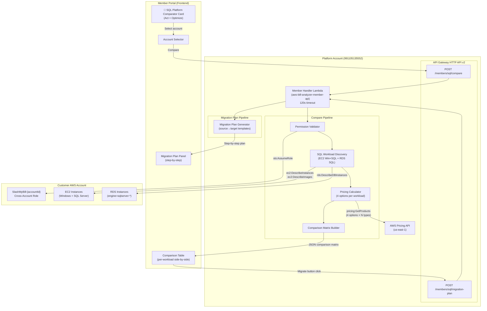
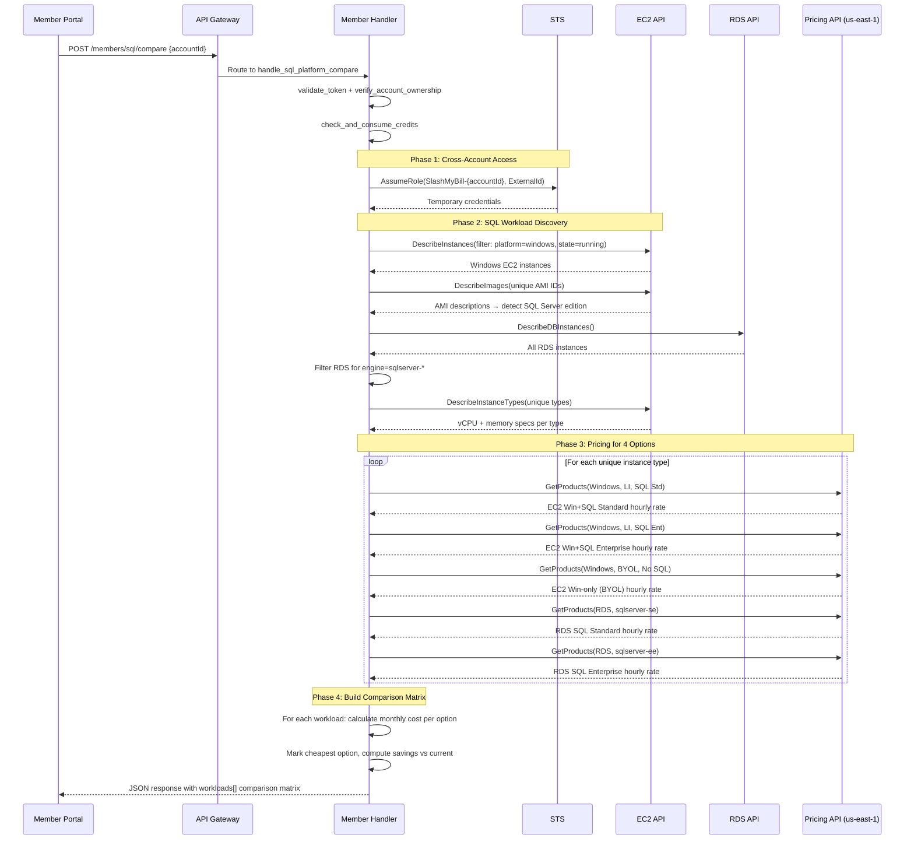
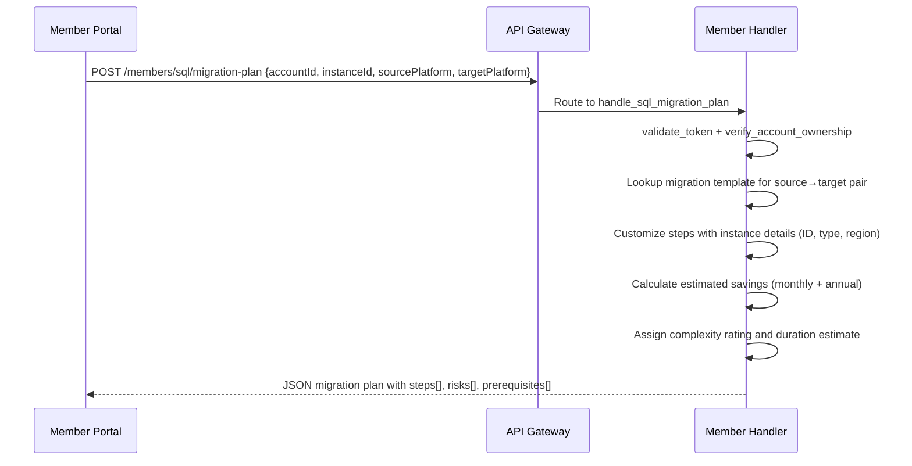

# Design Document: SQL Platform Comparator

## Overview

The SQL Platform Comparator is a new wizard card under Act > Optimize in the SlashMyBill Member Portal. It provides a side-by-side cost comparison for running SQL Server workloads across different AWS deployment options, enabling customers to identify the cheapest platform for each workload and generate step-by-step migration plans.

The feature discovers all existing SQL Server workloads (EC2 Windows+SQL instances and RDS SQL instances) in a selected customer account, queries the AWS Pricing API for equivalent capacity across 4 deployment options (EC2 Windows+SQL License Included, EC2 Windows+BYOL SQL, RDS SQL Standard, RDS SQL Enterprise), and displays a comparison matrix with monthly costs, savings vs current, and a highlighted cheapest option. A "Migrate" button on each cheaper option generates a migration plan specific to the source→target platform pair.

This builds on the existing `handle_licensing_scan` pattern in `member-handler/lambda_function.py` — reusing the cross-account role assumption, region detection, and pricing API query infrastructure. Two new endpoints are added: `POST /members/sql/compare` for the comparison matrix and `POST /members/sql/migration-plan` for generating migration plans.

## Architecture




## Sequence Diagrams

### Compare Flow



### Migration Plan Flow




## Components and Interfaces

### Component 1: SQL Workload Discovery

**Purpose**: Discovers all SQL Server workloads across EC2 and RDS in the customer account.

**Interface**:
```python
def discover_sql_workloads(creds: dict, regions: list[str]) -> list[SQLWorkload]:
    """Discover all SQL Server workloads in the customer account.
    
    Args:
        creds: Cross-account STS credentials dict (AccessKeyId, SecretAccessKey, SessionToken)
        regions: List of AWS regions to scan (from _detect_charged_regions)
    
    Returns:
        List of SQLWorkload objects representing each discovered SQL instance
    """
```

**Responsibilities**:
- Scan EC2 instances filtered by platform=windows across active regions
- Detect SQL Server presence and edition via AMI descriptions and instance tags
- Scan RDS instances filtered by engine prefix `sqlserver-*`
- Resolve instance type specs (vCPUs, memory) via DescribeInstanceTypes
- Map RDS instance classes to equivalent EC2 instance types for pricing comparison

### Component 2: Platform Pricing Calculator

**Purpose**: Queries AWS Pricing API for all 4 deployment options per unique instance type.

**Interface**:
```python
def calculate_platform_pricing(instance_types: set[str], region: str) -> dict[str, PlatformPricing]:
    """Get pricing for all 4 deployment options for each instance type.
    
    Args:
        instance_types: Set of unique EC2 instance types to price
        region: AWS region for pricing lookup (maps to Pricing API location)
    
    Returns:
        Dict mapping instance_type → PlatformPricing with all 4 option costs
    """
```

**Responsibilities**:
- Query Pricing API for EC2 Windows + SQL License Included (Standard and Enterprise)
- Query Pricing API for EC2 Windows only (BYOL scenario)
- Query Pricing API for RDS SQL Server Standard and Enterprise
- Cache results per instance type within the invocation (avoid duplicate queries)
- Map EC2 instance types to equivalent RDS instance classes (e.g., r5.2xlarge → db.r5.2xlarge)

### Component 3: Comparison Matrix Builder

**Purpose**: Assembles the per-workload comparison matrix with savings calculations.

**Interface**:
```python
def build_comparison_matrix(workloads: list[SQLWorkload], pricing: dict[str, PlatformPricing]) -> list[dict]:
    """Build side-by-side comparison for each workload.
    
    Args:
        workloads: Discovered SQL workloads
        pricing: Pricing data per instance type
    
    Returns:
        List of workload comparison dicts with options[], savings, cheapest flag
    """
```

**Responsibilities**:
- Calculate monthly cost (hourly_rate × 730 hours) for each option
- Determine which option is current based on workload source (EC2 vs RDS)
- Calculate savings vs current for each alternative option
- Flag the cheapest option per workload
- Handle cases where an option is not applicable (e.g., BYOL not relevant for RDS source)

### Component 4: Migration Plan Generator

**Purpose**: Generates step-by-step migration plans for source→target platform pairs.

**Interface**:
```python
def generate_migration_plan(instance_id: str, source_platform: str, target_platform: str, 
                            workload_details: dict) -> dict:
    """Generate a migration plan for converting between platforms.
    
    Args:
        instance_id: The source instance ID (i-xxx or db-xxx)
        source_platform: Current platform identifier
        target_platform: Target platform identifier
        workload_details: Instance details (type, region, vCPUs, memory, etc.)
    
    Returns:
        Migration plan dict with steps[], risks[], complexity, duration
    """
```

**Responsibilities**:
- Select appropriate migration template based on source→target pair
- Customize steps with actual instance IDs, types, and regions
- Generate AWS Console deep links for relevant steps
- Assign complexity rating (low/medium/high) based on migration type
- Estimate duration based on migration complexity
- Include rollback steps and risk warnings

### Component 5: Frontend SQL Platform Comparator UI

**Purpose**: Renders the wizard card, comparison table, and migration plan panel.

**Responsibilities**:
- Render the "SQL Platform Comparator" card in Act > Optimize section
- Handle account selection and trigger comparison API call
- Display comparison table with per-workload rows and 4 option columns
- Highlight cheapest option with visual badge
- Show "Migrate" button for options cheaper than current
- Render migration plan panel with numbered steps on button click
- Handle loading states and error display


## Data Models

### SQLWorkload

```python
@dataclass
class SQLWorkload:
    instance_id: str            # i-0abc123 or db-xyz789
    account_id: str             # 12-digit AWS account ID
    source: str                 # "ec2" or "rds"
    instance_type: str          # r5.2xlarge (EC2) or db.r5.2xlarge (RDS)
    ec2_equivalent_type: str    # r5.2xlarge (normalized for pricing lookup)
    region: str                 # us-east-1
    platform: str               # "Windows with SQL Enterprise", "Windows with SQL Standard"
    sql_edition: str            # "Enterprise" or "Standard"
    vcpus: int                  # 8
    memory_gb: float            # 64.0
    current_platform_key: str   # "ec2_windows_sql_li" | "rds_sql_standard" | "rds_sql_enterprise"
    tags: dict                  # Instance tags for display
    name: str                   # Name tag value or instance ID
```

**Validation Rules**:
- `instance_id` must match pattern `^(i-[a-f0-9]+|db-[A-Z0-9]+)$`
- `source` must be one of: "ec2", "rds"
- `sql_edition` must be one of: "Enterprise", "Standard"
- `vcpus` must be positive integer
- `memory_gb` must be positive float
- `current_platform_key` must be one of the 4 platform identifiers

### PlatformPricing

```python
@dataclass
class PlatformPricing:
    instance_type: str                  # r5.2xlarge
    ec2_windows_sql_std_hourly: float   # EC2 Windows + SQL Standard LI
    ec2_windows_sql_ent_hourly: float   # EC2 Windows + SQL Enterprise LI
    ec2_windows_byol_hourly: float      # EC2 Windows only (BYOL SQL)
    rds_sql_standard_hourly: float      # RDS SQL Server Standard
    rds_sql_enterprise_hourly: float    # RDS SQL Server Enterprise
    rds_instance_class: str             # db.r5.2xlarge (equivalent RDS class)
```

**Validation Rules**:
- All hourly rates must be non-negative floats
- `rds_instance_class` must start with "db."
- At least one rate must be > 0 (otherwise pricing lookup failed entirely)

### ComparisonOption

```python
@dataclass
class ComparisonOption:
    label: str                  # "EC2 Windows + SQL (License Included)"
    platform: str               # "ec2_windows_sql_li" | "ec2_windows_byol" | "rds_sql_standard" | "rds_sql_enterprise"
    equivalent_class: str       # Instance type/class used for this option
    monthly_cost: float         # Hourly rate × 730
    is_current: bool            # True if this matches the workload's current platform
    savings_vs_current: float   # Positive = cheaper, negative = more expensive
    savings_percent: float      # Percentage savings vs current
    is_cheapest: bool           # True if this is the cheapest option for this workload
```

### MigrationPlan

```python
@dataclass
class MigrationPlan:
    title: str                          # "Migrate EC2 Windows+SQL (LI) → RDS SQL Standard"
    source_platform: str                # Platform key
    target_platform: str                # Platform key
    estimated_savings_monthly: float    # Monthly savings
    estimated_savings_annual: float     # Annual savings
    complexity: str                     # "low" | "medium" | "high"
    estimated_duration: str             # "1-2 hours"
    steps: list[MigrationStep]          # Ordered steps
    risks: list[str]                    # Risk descriptions
    prerequisites: list[str]            # Required before starting
```

### MigrationStep

```python
@dataclass
class MigrationStep:
    step_number: int            # 1-based
    action: str                 # Human-readable action description
    type: str                   # "prerequisite" | "backup" | "provision" | "migrate" | "validate" | "cleanup"
    aws_console_link: str | None  # Deep link to AWS Console (optional)
    is_reversible: bool         # Whether this step can be undone
```

### Platform Identifiers (Constants)

```python
PLATFORM_EC2_WIN_SQL_LI = "ec2_windows_sql_li"       # EC2 Windows + SQL License Included
PLATFORM_EC2_WIN_BYOL = "ec2_windows_byol"           # EC2 Windows only + BYOL SQL
PLATFORM_RDS_SQL_STANDARD = "rds_sql_standard"       # RDS SQL Server Standard Edition
PLATFORM_RDS_SQL_ENTERPRISE = "rds_sql_enterprise"   # RDS SQL Server Enterprise Edition

VALID_PLATFORMS = {
    PLATFORM_EC2_WIN_SQL_LI,
    PLATFORM_EC2_WIN_BYOL,
    PLATFORM_RDS_SQL_STANDARD,
    PLATFORM_RDS_SQL_ENTERPRISE,
}
```


## Key Functions with Formal Specifications

### Function 1: handle_sql_platform_compare()

```python
def handle_sql_platform_compare(event: dict) -> dict:
    """POST /members/sql/compare — Main endpoint handler."""
```

**Preconditions:**
- `event` contains valid JWT token in Authorization header
- `event.body` contains JSON with `accountId` (12-digit string)
- Account belongs to the authenticated member
- Cross-account role `SlashMyBill-{accountId}` exists and is assumable

**Postconditions:**
- Returns HTTP 200 with `{"success": true, "workloads": [...]}` on success
- Each workload in response has exactly 4 options with costs calculated
- Exactly one option per workload has `is_current: true`
- At most one option per workload has `is_cheapest: true`
- `savings_vs_current` is 0 for the current option
- Returns appropriate error response (400/403/500) on failure
- Credits are consumed regardless of scan result (unless auth fails)

### Function 2: discover_sql_workloads()

```python
def discover_sql_workloads(creds: dict, regions: list[str]) -> list[SQLWorkload]:
    """Discover all SQL Server workloads across EC2 and RDS."""
```

**Preconditions:**
- `creds` contains valid temporary credentials with required permissions
- `regions` is a non-empty list of valid AWS region strings
- Cross-account role has: ec2:DescribeInstances, ec2:DescribeImages, ec2:DescribeInstanceTypes, rds:DescribeDBInstances

**Postconditions:**
- Returns list of SQLWorkload objects (may be empty if no SQL workloads found)
- Each SQLWorkload has a valid `sql_edition` ("Enterprise" or "Standard")
- EC2 instances without detectable SQL Server are excluded
- RDS instances with engine not starting with "sqlserver-" are excluded
- `ec2_equivalent_type` is populated for all workloads (strips "db." prefix for RDS)
- No duplicate instance IDs in result

**Loop Invariants:**
- For region scan loop: all previously scanned regions produced valid results or were skipped on error
- Total scan time does not exceed 80 seconds (timeout guard)

### Function 3: calculate_platform_pricing()

```python
def calculate_platform_pricing(instance_types: set[str], region: str) -> dict[str, PlatformPricing]:
    """Query Pricing API for all 4 deployment options per instance type."""
```

**Preconditions:**
- `instance_types` is a non-empty set of valid EC2 instance type strings
- `region` is a valid AWS region string
- Pricing API is accessible from the Lambda execution environment (us-east-1)

**Postconditions:**
- Returns dict with one entry per input instance type
- Each PlatformPricing has all 5 hourly rates populated (0.0 if lookup failed)
- `rds_instance_class` is correctly derived (prepend "db." to EC2 type)
- Pricing is for On-Demand, Shared tenancy, in the specified region
- No external API calls are made for previously cached instance types within the same invocation

**Loop Invariants:**
- Pricing cache grows monotonically (entries are never removed)
- Each instance type is queried at most once per invocation

### Function 4: build_comparison_matrix()

```python
def build_comparison_matrix(workloads: list[SQLWorkload], pricing: dict[str, PlatformPricing]) -> list[dict]:
    """Assemble per-workload comparison with savings calculations."""
```

**Preconditions:**
- `workloads` is a non-empty list of valid SQLWorkload objects
- `pricing` contains entries for all instance types referenced by workloads
- Each workload has a valid `current_platform_key`

**Postconditions:**
- Returns list with same length as input `workloads`
- Each result has exactly 4 options in `options[]`
- Exactly one option has `is_current: true` per workload
- `savings_vs_current` for the current option is always 0
- `is_cheapest` is true for exactly one option (the lowest monthly_cost)
- If current is already cheapest, `is_cheapest` is on the current option
- `monthly_cost` = hourly_rate × 730 for all options
- `savings_percent` = (savings_vs_current / current_monthly_cost) × 100

### Function 5: generate_migration_plan()

```python
def generate_migration_plan(instance_id: str, source_platform: str, target_platform: str,
                            workload_details: dict) -> dict:
    """Generate step-by-step migration plan for a platform conversion."""
```

**Preconditions:**
- `source_platform` and `target_platform` are valid platform identifiers
- `source_platform != target_platform`
- `instance_id` matches pattern for EC2 or RDS instance
- `workload_details` contains: instance_type, region, vcpus, memory_gb

**Postconditions:**
- Returns complete MigrationPlan dict
- `steps` list is non-empty and ordered by step_number (1-based, consecutive)
- `complexity` is one of: "low", "medium", "high"
- `estimated_savings_annual` = `estimated_savings_monthly` × 12
- All AWS Console links use HTTPS and reference the correct region
- At least one step has `type: "backup"` (safety requirement)
- Last step has `type: "cleanup"` or `type: "validate"`


## Algorithmic Pseudocode

### Main Compare Algorithm

```python
def handle_sql_platform_compare(event):
    """
    ALGORITHM: SQL Platform Comparison
    INPUT: API Gateway event with accountId
    OUTPUT: Comparison matrix with 4 options per SQL workload
    """
    # Phase 0: Auth & validation
    auth = validate_token(event)
    if auth is error: return auth
    
    body = parse_json(event.body)
    account_id = body['accountId']
    assert is_valid_account_id(account_id)  # 12-digit string
    assert account_belongs_to_member(account_id, auth.email)
    
    consume_credits(auth.email, SCAN_CREDIT_COST)
    
    # Phase 1: Cross-account access
    creds = sts.assume_role(
        role_arn=f'arn:aws:iam::{account_id}:role/SlashMyBill-{account_id}',
        external_id=sha256(auth.email)
    )
    
    # Phase 2: Discover SQL workloads
    regions = detect_charged_regions(creds)
    workloads = discover_sql_workloads(creds, regions)
    
    if len(workloads) == 0:
        return success_response(workloads=[], message="No SQL Server workloads found")
    
    # Phase 3: Get pricing for all 4 options
    unique_types = {w.ec2_equivalent_type for w in workloads}
    pricing = calculate_platform_pricing(unique_types, workloads[0].region)
    
    # Phase 4: Build comparison matrix
    comparison = build_comparison_matrix(workloads, pricing)
    
    return success_response(workloads=comparison)
```

### SQL Workload Discovery Algorithm

```python
def discover_sql_workloads(creds, regions):
    """
    ALGORITHM: Multi-region SQL workload discovery
    INPUT: Cross-account credentials, list of active regions
    OUTPUT: List of SQLWorkload objects
    
    INVARIANT: scan_time < 80 seconds (timeout guard)
    """
    workloads = []
    scan_start = time.time()
    
    for region in regions:
        if time.time() - scan_start > 80:
            break  # Timeout guard
        
        # --- EC2 Windows instances with SQL Server ---
        ec2_instances = ec2.describe_instances(
            Filters=[
                {'Name': 'platform', 'Values': ['windows']},
                {'Name': 'instance-state-name', 'Values': ['running']}
            ],
            region=region
        )
        
        # Batch AMI lookup for SQL detection
        ami_ids = {inst.image_id for inst in ec2_instances}
        ami_descriptions = ec2.describe_images(ImageIds=list(ami_ids))
        
        for inst in ec2_instances:
            sql_edition = detect_sql_server(inst, ami_descriptions)
            if sql_edition is not None:
                workloads.append(SQLWorkload(
                    instance_id=inst.id,
                    source="ec2",
                    instance_type=inst.type,
                    ec2_equivalent_type=inst.type,
                    sql_edition=sql_edition,
                    current_platform_key=PLATFORM_EC2_WIN_SQL_LI,
                    region=region,
                    ...
                ))
        
        # --- RDS SQL Server instances ---
        rds_instances = rds.describe_db_instances(region=region)
        
        for db in rds_instances:
            if not db.engine.startswith('sqlserver-'):
                continue
            
            edition = "Enterprise" if db.engine == "sqlserver-ee" else "Standard"
            ec2_type = db.instance_class.replace("db.", "")  # db.r5.2xlarge → r5.2xlarge
            
            current_key = PLATFORM_RDS_SQL_ENTERPRISE if edition == "Enterprise" else PLATFORM_RDS_SQL_STANDARD
            
            workloads.append(SQLWorkload(
                instance_id=db.identifier,
                source="rds",
                instance_type=db.instance_class,
                ec2_equivalent_type=ec2_type,
                sql_edition=edition,
                current_platform_key=current_key,
                region=region,
                ...
            ))
    
    # Resolve instance type specs (vCPUs, memory)
    unique_types = {w.ec2_equivalent_type for w in workloads}
    type_specs = ec2.describe_instance_types(InstanceTypes=list(unique_types))
    
    for w in workloads:
        specs = type_specs[w.ec2_equivalent_type]
        w.vcpus = specs.vcpus
        w.memory_gb = specs.memory_gb
    
    return workloads
```

### Pricing Calculation Algorithm

```python
def calculate_platform_pricing(instance_types, region):
    """
    ALGORITHM: Multi-option pricing lookup with caching
    INPUT: Set of instance types, target region
    OUTPUT: Dict of instance_type → PlatformPricing
    
    INVARIANT: Each instance type queried at most once
    """
    pricing_cache = {}
    location = REGION_TO_LOCATION[region]  # e.g., "US East (N. Virginia)"
    
    pricing_client = boto3.client('pricing', region_name='us-east-1')
    
    for instance_type in instance_types:
        rds_class = f"db.{instance_type}"
        
        # Query 1: EC2 Windows + SQL Standard (License Included)
        ec2_sql_std = query_pricing(pricing_client, {
            'instanceType': instance_type,
            'operatingSystem': 'Windows',
            'licenseModel': 'License Included',
            'preInstalledSw': 'SQL Std',
            'location': location,
            'tenancy': 'Shared',
            'capacitystatus': 'Used',
        })
        
        # Query 2: EC2 Windows + SQL Enterprise (License Included)
        ec2_sql_ent = query_pricing(pricing_client, {
            'instanceType': instance_type,
            'operatingSystem': 'Windows',
            'licenseModel': 'License Included',
            'preInstalledSw': 'SQL Ent',
            'location': location,
            'tenancy': 'Shared',
            'capacitystatus': 'Used',
        })
        
        # Query 3: EC2 Windows only (for BYOL SQL scenario)
        ec2_win_only = query_pricing(pricing_client, {
            'instanceType': instance_type,
            'operatingSystem': 'Windows',
            'licenseModel': 'License Included',
            'preInstalledSw': 'NA',
            'location': location,
            'tenancy': 'Shared',
            'capacitystatus': 'Used',
        })
        
        # Query 4: RDS SQL Server Standard
        rds_sql_std = query_rds_pricing(pricing_client, {
            'instanceType': rds_class,
            'databaseEngine': 'SQL Server',
            'databaseEdition': 'Standard',
            'location': location,
            'deploymentOption': 'Single-AZ',
        })
        
        # Query 5: RDS SQL Server Enterprise
        rds_sql_ent = query_rds_pricing(pricing_client, {
            'instanceType': rds_class,
            'databaseEngine': 'SQL Server',
            'databaseEdition': 'Enterprise',
            'location': location,
            'deploymentOption': 'Single-AZ',
        })
        
        pricing_cache[instance_type] = PlatformPricing(
            instance_type=instance_type,
            ec2_windows_sql_std_hourly=ec2_sql_std,
            ec2_windows_sql_ent_hourly=ec2_sql_ent,
            ec2_windows_byol_hourly=ec2_win_only,
            rds_sql_standard_hourly=rds_sql_std,
            rds_sql_enterprise_hourly=rds_sql_ent,
            rds_instance_class=rds_class,
        )
    
    return pricing_cache
```

### Comparison Matrix Builder Algorithm

```python
def build_comparison_matrix(workloads, pricing):
    """
    ALGORITHM: Build side-by-side comparison per workload
    INPUT: Discovered workloads, pricing data
    OUTPUT: List of comparison dicts
    
    POSTCONDITION: Each workload has exactly 4 options, one marked current, one marked cheapest
    """
    results = []
    
    for workload in workloads:
        p = pricing[workload.ec2_equivalent_type]
        
        # Determine current cost based on workload's actual platform
        current_hourly = {
            PLATFORM_EC2_WIN_SQL_LI: p.ec2_windows_sql_ent_hourly if workload.sql_edition == "Enterprise" 
                                     else p.ec2_windows_sql_std_hourly,
            PLATFORM_RDS_SQL_STANDARD: p.rds_sql_standard_hourly,
            PLATFORM_RDS_SQL_ENTERPRISE: p.rds_sql_enterprise_hourly,
        }[workload.current_platform_key]
        
        current_monthly = current_hourly * 730
        
        # Build 4 options
        options = [
            {
                'label': 'EC2 Windows + SQL (License Included)',
                'platform': PLATFORM_EC2_WIN_SQL_LI,
                'monthly_cost': (p.ec2_windows_sql_ent_hourly if workload.sql_edition == "Enterprise"
                                 else p.ec2_windows_sql_std_hourly) * 730,
            },
            {
                'label': 'EC2 Windows only (BYOL SQL)',
                'platform': PLATFORM_EC2_WIN_BYOL,
                'monthly_cost': p.ec2_windows_byol_hourly * 730,
            },
            {
                'label': 'RDS SQL Server Standard',
                'platform': PLATFORM_RDS_SQL_STANDARD,
                'monthly_cost': p.rds_sql_standard_hourly * 730,
            },
            {
                'label': 'RDS SQL Server Enterprise',
                'platform': PLATFORM_RDS_SQL_ENTERPRISE,
                'monthly_cost': p.rds_sql_enterprise_hourly * 730,
            },
        ]
        
        # Mark current, calculate savings, find cheapest
        cheapest_cost = min(opt['monthly_cost'] for opt in options)
        
        for opt in options:
            opt['is_current'] = (opt['platform'] == workload.current_platform_key)
            opt['savings_vs_current'] = round(current_monthly - opt['monthly_cost'], 2)
            opt['savings_percent'] = round((opt['savings_vs_current'] / current_monthly) * 100, 1) if current_monthly > 0 else 0
            opt['is_cheapest'] = (opt['monthly_cost'] == cheapest_cost)
            opt['monthly_cost'] = round(opt['monthly_cost'], 2)
        
        results.append({
            'instanceId': workload.instance_id,
            'instanceType': workload.instance_type,
            'currentPlatform': workload.platform,
            'currentMonthlyCost': round(current_monthly, 2),
            'vcpus': workload.vcpus,
            'memoryGb': workload.memory_gb,
            'region': workload.region,
            'sqlEdition': workload.sql_edition,
            'options': options,
        })
    
    return results
```


### Migration Plan Generation Algorithm

```python
# Migration plan templates keyed by (source, target) pair
MIGRATION_TEMPLATES = {
    (PLATFORM_EC2_WIN_SQL_LI, PLATFORM_EC2_WIN_BYOL): {
        'complexity': 'high',
        'duration': '2-4 hours',
        'prerequisites': [
            'Active Software Assurance or License Mobility agreement',
            'SQL Server license keys available for BYOL installation',
        ],
        'steps': [
            {'action': 'Verify Software Assurance or License Mobility rights', 'type': 'prerequisite'},
            {'action': 'Create AMI snapshot of {instance_id} for rollback', 'type': 'backup'},
            {'action': 'Launch new EC2 instance from Windows-only AMI ({instance_type})', 'type': 'provision'},
            {'action': 'Install SQL Server using your BYOL license on the new instance', 'type': 'provision'},
            {'action': 'Migrate data: detach EBS data volumes and attach to new instance, or use SQL backup/restore', 'type': 'migrate'},
            {'action': 'Update DNS records, Elastic IPs, or load balancer targets to new instance', 'type': 'migrate'},
            {'action': 'Verify application functionality on new instance', 'type': 'validate'},
            {'action': 'Terminate original instance {instance_id} after successful validation', 'type': 'cleanup'},
        ],
        'risks': [
            'Application downtime during migration (plan maintenance window)',
            'BYOL license compliance must be verified with Microsoft',
            'Data loss if EBS volumes not properly detached/attached',
        ],
    },
    (PLATFORM_EC2_WIN_SQL_LI, PLATFORM_RDS_SQL_STANDARD): {
        'complexity': 'high',
        'duration': '4-8 hours',
        'prerequisites': [
            'Application supports RDS connectivity (no local file system dependencies)',
            'Database size within RDS storage limits',
        ],
        'steps': [
            {'action': 'Create full SQL Server backup on source instance {instance_id}', 'type': 'backup'},
            {'action': 'Upload backup to S3 bucket in same region ({region})', 'type': 'backup'},
            {'action': 'Create RDS SQL Server Standard instance ({rds_class})', 'type': 'provision'},
            {'action': 'Restore database from S3 using RDS native backup restore', 'type': 'migrate'},
            {'action': 'Update application connection strings to RDS endpoint', 'type': 'migrate'},
            {'action': 'Test application connectivity and query performance', 'type': 'validate'},
            {'action': 'Run parallel validation period (24-48 hours recommended)', 'type': 'validate'},
            {'action': 'Decommission EC2 SQL Server instance {instance_id}', 'type': 'cleanup'},
        ],
        'risks': [
            'Application downtime during connection string cutover',
            'RDS does not support all SQL Server features (CLR, linked servers, SSIS)',
            'Storage IOPS may differ — performance testing required',
            'Larger databases may take hours to restore from S3',
        ],
    },
    (PLATFORM_EC2_WIN_SQL_LI, PLATFORM_RDS_SQL_ENTERPRISE): {
        'complexity': 'high',
        'duration': '4-8 hours',
        'prerequisites': [
            'Application supports RDS connectivity',
            'Database size within RDS storage limits',
        ],
        'steps': [
            {'action': 'Create full SQL Server backup on source instance {instance_id}', 'type': 'backup'},
            {'action': 'Upload backup to S3 bucket in same region ({region})', 'type': 'backup'},
            {'action': 'Create RDS SQL Server Enterprise instance ({rds_class})', 'type': 'provision'},
            {'action': 'Restore database from S3 using RDS native backup restore', 'type': 'migrate'},
            {'action': 'Update application connection strings to RDS endpoint', 'type': 'migrate'},
            {'action': 'Test application connectivity and query performance', 'type': 'validate'},
            {'action': 'Run parallel validation period (24-48 hours recommended)', 'type': 'validate'},
            {'action': 'Decommission EC2 SQL Server instance {instance_id}', 'type': 'cleanup'},
        ],
        'risks': [
            'Application downtime during connection string cutover',
            'RDS does not support all SQL Server features (CLR, linked servers)',
            'Storage IOPS may differ — performance testing required',
        ],
    },
    (PLATFORM_RDS_SQL_STANDARD, PLATFORM_EC2_WIN_SQL_LI): {
        'complexity': 'high',
        'duration': '4-6 hours',
        'prerequisites': [
            'EC2 instance with SQL Server AMI available in target region',
        ],
        'steps': [
            {'action': 'Create RDS snapshot of {instance_id} for rollback', 'type': 'backup'},
            {'action': 'Export database using RDS native backup to S3', 'type': 'backup'},
            {'action': 'Launch EC2 instance from Windows+SQL Server AMI ({instance_type})', 'type': 'provision'},
            {'action': 'Restore database from S3 backup on EC2 instance', 'type': 'migrate'},
            {'action': 'Update application connection strings to EC2 private IP/DNS', 'type': 'migrate'},
            {'action': 'Test application connectivity and performance', 'type': 'validate'},
            {'action': 'Delete RDS instance {instance_id} after validation period', 'type': 'cleanup'},
        ],
        'risks': [
            'You become responsible for patching, backups, and HA on EC2',
            'Application downtime during cutover',
            'Must configure security groups for EC2 SQL access',
        ],
    },
    (PLATFORM_RDS_SQL_STANDARD, PLATFORM_EC2_WIN_BYOL): {
        'complexity': 'high',
        'duration': '4-6 hours',
        'prerequisites': [
            'Active Software Assurance or License Mobility agreement',
            'SQL Server Standard license keys available',
        ],
        'steps': [
            {'action': 'Verify Software Assurance or License Mobility rights', 'type': 'prerequisite'},
            {'action': 'Create RDS snapshot of {instance_id} for rollback', 'type': 'backup'},
            {'action': 'Export database using RDS native backup to S3', 'type': 'backup'},
            {'action': 'Launch EC2 instance from Windows-only AMI ({instance_type})', 'type': 'provision'},
            {'action': 'Install SQL Server Standard using BYOL license', 'type': 'provision'},
            {'action': 'Restore database from S3 backup', 'type': 'migrate'},
            {'action': 'Update application connection strings', 'type': 'migrate'},
            {'action': 'Test application connectivity and performance', 'type': 'validate'},
            {'action': 'Delete RDS instance {instance_id} after validation', 'type': 'cleanup'},
        ],
        'risks': [
            'You become responsible for patching, backups, and HA on EC2',
            'BYOL license compliance must be verified with Microsoft',
            'Application downtime during cutover',
        ],
    },
    (PLATFORM_RDS_SQL_ENTERPRISE, PLATFORM_EC2_WIN_BYOL): {
        'complexity': 'high',
        'duration': '4-6 hours',
        'prerequisites': [
            'Active Software Assurance or License Mobility agreement',
            'SQL Server Enterprise license keys available',
        ],
        'steps': [
            {'action': 'Verify Software Assurance or License Mobility rights', 'type': 'prerequisite'},
            {'action': 'Create RDS snapshot of {instance_id} for rollback', 'type': 'backup'},
            {'action': 'Export database using RDS native backup to S3', 'type': 'backup'},
            {'action': 'Launch EC2 instance from Windows-only AMI ({instance_type})', 'type': 'provision'},
            {'action': 'Install SQL Server Enterprise using BYOL license', 'type': 'provision'},
            {'action': 'Restore database from S3 backup', 'type': 'migrate'},
            {'action': 'Update application connection strings', 'type': 'migrate'},
            {'action': 'Test application connectivity and performance', 'type': 'validate'},
            {'action': 'Delete RDS instance {instance_id} after validation', 'type': 'cleanup'},
        ],
        'risks': [
            'You become responsible for patching, backups, and HA on EC2',
            'BYOL license compliance must be verified with Microsoft',
            'Application downtime during cutover',
        ],
    },
    (PLATFORM_RDS_SQL_ENTERPRISE, PLATFORM_RDS_SQL_STANDARD): {
        'complexity': 'medium',
        'duration': '2-4 hours',
        'prerequisites': [
            'Application does not use Enterprise-only features (partitioning, compression, Always On)',
        ],
        'steps': [
            {'action': 'Audit database for Enterprise-only feature usage', 'type': 'prerequisite'},
            {'action': 'Create RDS snapshot of {instance_id} for rollback', 'type': 'backup'},
            {'action': 'Export database using RDS native backup to S3', 'type': 'backup'},
            {'action': 'Create new RDS SQL Server Standard instance ({rds_class})', 'type': 'provision'},
            {'action': 'Restore database from S3 on new Standard instance', 'type': 'migrate'},
            {'action': 'Update application connection strings to new endpoint', 'type': 'migrate'},
            {'action': 'Test application — verify no Enterprise feature errors', 'type': 'validate'},
            {'action': 'Delete original Enterprise RDS instance after validation', 'type': 'cleanup'},
        ],
        'risks': [
            'Enterprise-only features will fail on Standard edition',
            'Performance may differ for workloads using Enterprise optimizations',
            'Brief downtime during connection string cutover',
        ],
    },
}


def generate_migration_plan(instance_id, source_platform, target_platform, workload_details):
    """
    ALGORITHM: Template-based migration plan generation
    INPUT: Instance ID, source/target platforms, workload details
    OUTPUT: Customized migration plan dict
    
    PRECONDITION: source_platform != target_platform
    PRECONDITION: (source_platform, target_platform) exists in MIGRATION_TEMPLATES
    """
    template = MIGRATION_TEMPLATES[(source_platform, target_platform)]
    
    # Customize step actions with actual instance details
    customized_steps = []
    for i, step in enumerate(template['steps'], 1):
        action = step['action'].format(
            instance_id=instance_id,
            instance_type=workload_details['instance_type'],
            region=workload_details['region'],
            rds_class=f"db.{workload_details['ec2_equivalent_type']}",
        )
        
        # Generate AWS Console link where applicable
        console_link = None
        if step['type'] in ('backup', 'provision', 'cleanup'):
            if 'ec2' in source_platform or 'ec2' in target_platform:
                console_link = f"https://{workload_details['region']}.console.aws.amazon.com/ec2/home?region={workload_details['region']}#Instances:instanceId={instance_id}"
            else:
                console_link = f"https://{workload_details['region']}.console.aws.amazon.com/rds/home?region={workload_details['region']}#databases:"
        
        customized_steps.append({
            'stepNumber': i,
            'action': action,
            'type': step['type'],
            'awsConsoleLink': console_link,
            'isReversible': step['type'] != 'cleanup',
        })
    
    monthly_savings = workload_details.get('savings_vs_current', 0)
    
    return {
        'title': f"Migrate {_platform_label(source_platform)} → {_platform_label(target_platform)}",
        'estimatedSavings': {
            'monthly': round(monthly_savings, 2),
            'annual': round(monthly_savings * 12, 2),
        },
        'complexity': template['complexity'],
        'estimatedDuration': template['duration'],
        'steps': customized_steps,
        'risks': template['risks'],
        'prerequisites': template['prerequisites'],
    }
```


## Example Usage

```python
# Example 1: Compare endpoint — discovering and pricing SQL workloads
event = {
    'routeKey': 'POST /members/sql/compare',
    'headers': {'authorization': 'Bearer eyJ...'},
    'body': json.dumps({'accountId': '991105135552'})
}

response = handle_sql_platform_compare(event)
# Returns:
# {
#   "success": true,
#   "workloads": [
#     {
#       "instanceId": "i-0abc123def456",
#       "instanceType": "r5.2xlarge",
#       "currentPlatform": "Windows with SQL Enterprise",
#       "currentMonthlyCost": 890.00,
#       "vcpus": 8,
#       "memoryGb": 64.0,
#       "region": "us-east-1",
#       "sqlEdition": "Enterprise",
#       "options": [
#         {"label": "EC2 Windows + SQL (License Included)", "platform": "ec2_windows_sql_li",
#          "monthlyCost": 890.00, "isCurrent": true, "savingsVsCurrent": 0, "savingsPercent": 0, "isCheapest": false},
#         {"label": "EC2 Windows only (BYOL SQL)", "platform": "ec2_windows_byol",
#          "monthlyCost": 534.00, "isCurrent": false, "savingsVsCurrent": 356.00, "savingsPercent": 40.0, "isCheapest": true},
#         {"label": "RDS SQL Server Standard", "platform": "rds_sql_standard",
#          "monthlyCost": 720.00, "isCurrent": false, "savingsVsCurrent": 170.00, "savingsPercent": 19.1, "isCheapest": false},
#         {"label": "RDS SQL Server Enterprise", "platform": "rds_sql_enterprise",
#          "monthlyCost": 1240.00, "isCurrent": false, "savingsVsCurrent": -350.00, "savingsPercent": -39.3, "isCheapest": false}
#       ]
#     }
#   ]
# }


# Example 2: Migration plan endpoint
event = {
    'routeKey': 'POST /members/sql/migration-plan',
    'headers': {'authorization': 'Bearer eyJ...'},
    'body': json.dumps({
        'accountId': '991105135552',
        'instanceId': 'i-0abc123def456',
        'sourcePlatform': 'ec2_windows_sql_li',
        'targetPlatform': 'ec2_windows_byol'
    })
}

response = handle_sql_migration_plan(event)
# Returns:
# {
#   "success": true,
#   "migrationPlan": {
#     "title": "Migrate EC2 Windows+SQL (LI) → EC2 Windows only (BYOL SQL)",
#     "estimatedSavings": {"monthly": 356.00, "annual": 4272.00},
#     "complexity": "high",
#     "estimatedDuration": "2-4 hours",
#     "steps": [
#       {"stepNumber": 1, "action": "Verify Software Assurance...", "type": "prerequisite"},
#       {"stepNumber": 2, "action": "Create AMI snapshot of i-0abc123def456...", "type": "backup"},
#       ...
#     ],
#     "risks": ["Application downtime during migration...", ...],
#     "prerequisites": ["Active Software Assurance...", ...]
#   }
# }


# Example 3: Frontend — rendering comparison table
# In members.js:
async function _sqlCompareRun(accountId) {
    const resp = await fetch(API + '/members/sql/compare', {
        method: 'POST',
        headers: {'Authorization': 'Bearer ' + token, 'Content-Type': 'application/json'},
        body: JSON.stringify({accountId: accountId})
    });
    const data = await resp.json();
    
    if (data.success && data.workloads.length > 0) {
        _renderSqlComparisonTable(data.workloads);
    } else {
        _showSqlCompareEmpty("No SQL Server workloads found in this account.");
    }
}

# Example 4: Frontend — requesting migration plan
async function _sqlMigrate(accountId, instanceId, sourcePlatform, targetPlatform) {
    const resp = await fetch(API + '/members/sql/migration-plan', {
        method: 'POST',
        headers: {'Authorization': 'Bearer ' + token, 'Content-Type': 'application/json'},
        body: JSON.stringify({accountId, instanceId, sourcePlatform, targetPlatform})
    });
    const data = await resp.json();
    
    if (data.success) {
        _renderMigrationPlan(data.migrationPlan);
    }
}
```

## Correctness Properties

### Property 1: Four Options Per Workload
∀ workload ∈ response.workloads: |workload.options| = 4

Every workload in the comparison response has exactly 4 deployment options.

### Property 2: Exactly One Current Option
∀ workload ∈ response.workloads: ∃! option ∈ workload.options: option.isCurrent = true

Exactly one option per workload is marked as the current platform.

### Property 3: Exactly One Cheapest Option
∀ workload ∈ response.workloads: ∃! option ∈ workload.options: option.isCheapest = true

Exactly one option per workload is marked as the cheapest (ties broken by first match).

### Property 4: Consistent Monthly Cost Calculation
∀ option ∈ workload.options: option.monthlyCost = hourlyRate × 730

Monthly costs are consistently calculated as hourly rate × 730 hours.

### Property 5: Zero Savings For Current Option
∀ option where option.isCurrent = true: option.savingsVsCurrent = 0

The current option always shows zero savings against itself.

### Property 6: Savings Calculation Correctness
∀ option: option.savingsVsCurrent = currentMonthlyCost - option.monthlyCost

Savings are calculated as the difference from current cost (positive = cheaper).

### Property 7: Savings Percentage Correctness
∀ option: option.savingsPercent = (savingsVsCurrent / currentMonthlyCost) × 100

Savings percentage is relative to the current monthly cost.

### Property 8: Migration Plan Safety
∀ migrationPlan: len(migrationPlan.steps) > 0 ∧ ∃ step: step.type = "backup"

Every migration plan has at least one backup step for safety.

### Property 9: Annual Savings Consistency
∀ migrationPlan: migrationPlan.estimatedSavings.annual = migrationPlan.estimatedSavings.monthly × 12

Annual savings is always 12× monthly savings.

### Property 10: Migration Template Coverage
∀ (source, target) pair where source ≠ target ∧ both ∈ VALID_PLATFORMS: template exists

A migration plan template exists for every valid source→target combination (excluding same-to-same).


## Error Handling

### Error Scenario 1: Cross-Account Role Not Found

**Condition**: STS AssumeRole fails because `SlashMyBill-{accountId}` role doesn't exist or trust policy is misconfigured.
**Response**: HTTP 403 `{"error": "AssumeRoleFailed", "message": "Cannot access account. Please verify the cross-account role is deployed."}`
**Recovery**: User must deploy/update the CloudFormation template in their account.

### Error Scenario 2: Missing Permissions

**Condition**: Role exists but lacks required permissions (ec2:DescribeInstances, ec2:DescribeImages, rds:DescribeDBInstances).
**Response**: HTTP 403 `{"error": "InsufficientPermissions", "message": "Missing permissions: {list}. Please update the cross-account role template."}`
**Recovery**: User updates the cross-account role with the latest permission set.

### Error Scenario 3: No SQL Workloads Found

**Condition**: Discovery completes but finds no EC2 instances with SQL Server and no RDS SQL instances.
**Response**: HTTP 200 `{"success": true, "workloads": [], "message": "No SQL Server workloads found in this account."}`
**Recovery**: Informational — user may need to check a different account.

### Error Scenario 4: Pricing API Unavailable

**Condition**: AWS Pricing API returns errors or times out during cost lookup.
**Response**: HTTP 200 with partial data — workloads are returned with `monthlyCost: null` for options where pricing failed. Message: "Pricing data temporarily unavailable for some options."
**Recovery**: User can retry the comparison. Pricing API outages are typically brief.

### Error Scenario 5: Lambda Timeout

**Condition**: Scan exceeds 80-second internal timeout guard (many regions, many instances).
**Response**: HTTP 200 with partial results for workloads discovered before timeout. Message: "Scan timed out. Showing partial results for {N} workloads."
**Recovery**: User can retry — results are not cached, each scan is fresh.

### Error Scenario 6: Invalid Migration Plan Request

**Condition**: User requests migration plan with invalid source/target combination (same platform, or unsupported pair).
**Response**: HTTP 400 `{"error": "InvalidMigrationPair", "message": "Cannot generate migration plan: source and target platforms must be different."}`
**Recovery**: Frontend should prevent this by only showing Migrate buttons for valid pairs.

### Error Scenario 7: Insufficient Credits

**Condition**: Member doesn't have enough credits for the scan operation.
**Response**: HTTP 402 `{"error": "InsufficientCredits", "message": "Not enough credits. Please upgrade your plan."}`
**Recovery**: User upgrades their subscription tier.

## Testing Strategy

### Unit Testing Approach

- Test `detect_sql_server()` with various AMI descriptions and tag combinations
- Test `build_comparison_matrix()` with known pricing data to verify savings calculations
- Test `generate_migration_plan()` for all valid source→target pairs
- Test edge cases: zero pricing, single workload, all options same price
- Mock AWS API responses for deterministic testing

### Property-Based Testing Approach

**Property Test Library**: hypothesis (Python)

Key properties to test:
- For any set of workloads and pricing, exactly one option per workload is marked cheapest
- For any workload, savings_vs_current of the current option is always 0
- Monthly cost is always non-negative for all options
- Migration plan step numbers are always consecutive starting from 1
- Savings percent is bounded: -100% < savings_percent (can't lose more than 100%)

### Integration Testing Approach

- End-to-end test with mocked AWS APIs (moto library)
- Test the full pipeline: discovery → pricing → matrix → response
- Verify API Gateway routing for both new endpoints
- Test frontend rendering with sample response data
- Test migration plan panel display and step rendering

## Performance Considerations

| Phase | Target Time | Strategy |
|-------|-------------|----------|
| Cross-account role assumption | <2s | Single STS call |
| SQL workload discovery (all regions) | <15s | Parallel region scanning, 80s timeout guard |
| AMI description lookup | <3s | Batch DescribeImages for unique AMI IDs |
| Instance type specs | <2s | Single DescribeInstanceTypes call |
| Pricing API (per unique type) | <8s | 5 queries per type, cached within invocation |
| Comparison matrix build | <0.1s | In-memory computation |
| **Total (typical 5 workloads, 3 types)** | **<30s** | Well within 120s Lambda timeout |

**Optimization strategies**:
- Pricing queries are the bottleneck — cache per instance type avoids redundant calls
- Region scanning uses `_detect_charged_regions()` to skip inactive regions
- 80-second timeout guard ensures partial results are returned rather than Lambda timeout
- Instance type specs fetched in a single batch call

## Security Considerations

- **Cross-account access**: Uses STS AssumeRole with ExternalId (SHA-256 of member email) to prevent confused deputy attacks
- **Account ownership verification**: Validates accountId belongs to authenticated member before any cross-account calls
- **Read-only operations**: Both endpoints only perform read operations (Describe*, GetProducts) — no modifications to customer resources
- **No credential storage**: Temporary STS credentials are used within a single invocation and discarded
- **Input validation**: accountId must match `^\d{12}$`, platform identifiers validated against VALID_PLATFORMS set
- **Rate limiting**: Credit consumption prevents abuse of expensive Pricing API calls

## Dependencies

| Dependency | Purpose | Version/Notes |
|------------|---------|---------------|
| boto3 | AWS SDK for Python | Bundled with Lambda runtime |
| AWS Pricing API | Cost data for EC2 and RDS | us-east-1 only, ~5 queries per instance type |
| AWS STS | Cross-account role assumption | Standard |
| AWS EC2 API | Instance discovery, AMI lookup, type specs | Customer account |
| AWS RDS API | RDS SQL Server instance discovery | Customer account |
| member-handler Lambda | Existing handler — new functions added | 120s timeout |
| API Gateway HTTP API v2 | Route new endpoints | Existing infrastructure |
| DynamoDB (MemberPortal-Accounts) | Account ownership verification | Existing table |
| Frontend (members.js) | UI rendering | Vanilla JS, no framework |

## Files to Modify

| File | Change |
|------|--------|
| `member-handler/lambda_function.py` | Add `handle_sql_platform_compare()` function (~250 lines) |
| `member-handler/lambda_function.py` | Add `handle_sql_migration_plan()` function (~100 lines) |
| `member-handler/lambda_function.py` | Add routes to `routes` dict: `'POST /members/sql/compare'` and `'POST /members/sql/migration-plan'` |
| `members/members.js` | Add SQL Platform Comparator wizard UI (card + comparison table + migrate button + migration plan panel) |
| `members/members.css` | Add styles for comparison table, cheapest badge, migration plan panel |
| `members/index.html` | Bump `members.js?v=XX` and `members.css?v=XX` versions |
| `.github/workflows/deploy.yml` | Add `"POST /members/sql/compare"` and `"POST /members/sql/migration-plan"` to MEMBER_ROUTES array |

## API Contract

### Endpoint: `POST /members/sql/compare`

**Request:**
```json
{
  "accountId": "991105135552"
}
```

**Response (success):**
```json
{
  "success": true,
  "workloads": [
    {
      "instanceId": "i-0abc123def456",
      "instanceType": "r5.2xlarge",
      "currentPlatform": "Windows with SQL Enterprise",
      "currentMonthlyCost": 890.00,
      "vcpus": 8,
      "memoryGb": 64.0,
      "region": "us-east-1",
      "sqlEdition": "Enterprise",
      "name": "Production-SQL-01",
      "options": [
        {
          "label": "EC2 Windows + SQL (License Included)",
          "platform": "ec2_windows_sql_li",
          "equivalentClass": "r5.2xlarge",
          "monthlyCost": 890.00,
          "isCurrent": true,
          "savingsVsCurrent": 0,
          "savingsPercent": 0,
          "isCheapest": false
        },
        {
          "label": "EC2 Windows only (BYOL SQL)",
          "platform": "ec2_windows_byol",
          "equivalentClass": "r5.2xlarge",
          "monthlyCost": 534.00,
          "isCurrent": false,
          "savingsVsCurrent": 356.00,
          "savingsPercent": 40.0,
          "isCheapest": true
        },
        {
          "label": "RDS SQL Server Standard",
          "platform": "rds_sql_standard",
          "equivalentClass": "db.r5.2xlarge",
          "monthlyCost": 720.00,
          "isCurrent": false,
          "savingsVsCurrent": 170.00,
          "savingsPercent": 19.1,
          "isCheapest": false
        },
        {
          "label": "RDS SQL Server Enterprise",
          "platform": "rds_sql_enterprise",
          "equivalentClass": "db.r5.2xlarge",
          "monthlyCost": 1240.00,
          "isCurrent": false,
          "savingsVsCurrent": -350.00,
          "savingsPercent": -39.3,
          "isCheapest": false
        }
      ]
    }
  ]
}
```

**Response (no workloads):**
```json
{
  "success": true,
  "workloads": [],
  "message": "No SQL Server workloads found in this account."
}
```

### Endpoint: `POST /members/sql/migration-plan`

**Request:**
```json
{
  "accountId": "991105135552",
  "instanceId": "i-0abc123def456",
  "sourcePlatform": "ec2_windows_sql_li",
  "targetPlatform": "ec2_windows_byol"
}
```

**Response:**
```json
{
  "success": true,
  "migrationPlan": {
    "title": "Migrate EC2 Windows+SQL (LI) → EC2 Windows only (BYOL SQL)",
    "estimatedSavings": {
      "monthly": 356.00,
      "annual": 4272.00
    },
    "complexity": "high",
    "estimatedDuration": "2-4 hours",
    "steps": [
      {
        "stepNumber": 1,
        "action": "Verify Software Assurance or License Mobility rights",
        "type": "prerequisite",
        "awsConsoleLink": null,
        "isReversible": true
      },
      {
        "stepNumber": 2,
        "action": "Create AMI snapshot of i-0abc123def456 for rollback",
        "type": "backup",
        "awsConsoleLink": "https://us-east-1.console.aws.amazon.com/ec2/home?region=us-east-1#Instances:instanceId=i-0abc123def456",
        "isReversible": true
      },
      {
        "stepNumber": 3,
        "action": "Launch new EC2 instance from Windows-only AMI (r5.2xlarge)",
        "type": "provision",
        "awsConsoleLink": "https://us-east-1.console.aws.amazon.com/ec2/home?region=us-east-1#LaunchInstances:",
        "isReversible": true
      },
      {
        "stepNumber": 4,
        "action": "Install SQL Server using your BYOL license on the new instance",
        "type": "provision",
        "awsConsoleLink": null,
        "isReversible": true
      },
      {
        "stepNumber": 5,
        "action": "Migrate data: detach EBS data volumes and attach to new instance, or use SQL backup/restore",
        "type": "migrate",
        "awsConsoleLink": null,
        "isReversible": true
      },
      {
        "stepNumber": 6,
        "action": "Update DNS records, Elastic IPs, or load balancer targets to new instance",
        "type": "migrate",
        "awsConsoleLink": null,
        "isReversible": true
      },
      {
        "stepNumber": 7,
        "action": "Verify application functionality on new instance",
        "type": "validate",
        "awsConsoleLink": null,
        "isReversible": true
      },
      {
        "stepNumber": 8,
        "action": "Terminate original instance i-0abc123def456 after successful validation",
        "type": "cleanup",
        "awsConsoleLink": "https://us-east-1.console.aws.amazon.com/ec2/home?region=us-east-1#Instances:instanceId=i-0abc123def456",
        "isReversible": false
      }
    ],
    "risks": [
      "Application downtime during migration (plan maintenance window)",
      "BYOL license compliance must be verified with Microsoft",
      "Data loss if EBS volumes not properly detached/attached"
    ],
    "prerequisites": [
      "Active Software Assurance or License Mobility agreement",
      "SQL Server license keys available for BYOL installation"
    ]
  }
}
```
