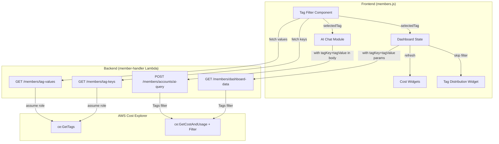
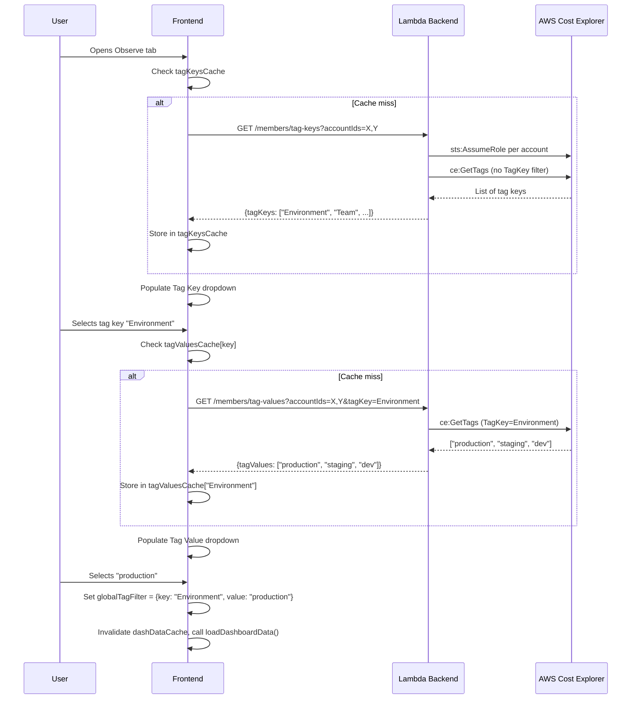
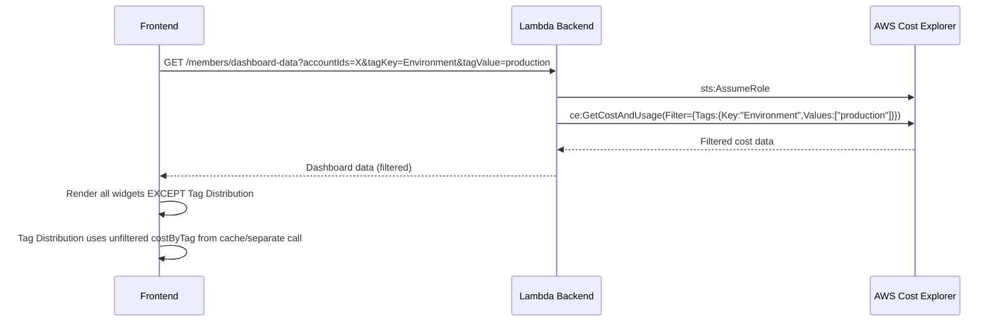
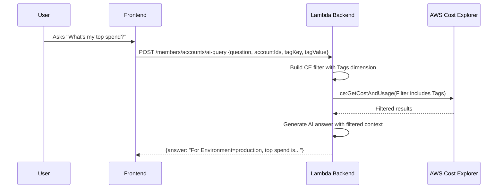

# Design Document: Tag-Based Cost Filtering

## Overview

This feature adds a global tag filter to the SlashMyBill Observe (dashboard) tab and Chat (AI query) tab. The filter provides two cascading dropdowns — Tag Key and Tag Value — that allow users to slice all cost data by a specific cost allocation tag. When a tag key+value is selected, all dashboard widgets refresh with filtered data except the Tag Distribution widget which remains unfiltered. The same filter state persists across tab switches and applies to AI chat queries.

The implementation leverages AWS Cost Explorer's `Tags` dimension in the `Filter` parameter, using `ce:GetTags` to populate available tag keys and values. Tag metadata is cached client-side after first load to minimize API calls.

## Architecture



## Sequence Diagrams

### Tag Filter Initialization (on Dashboard Load)



### Dashboard Data with Tag Filter



### AI Query with Tag Filter



## Components and Interfaces

### Component 1: Tag Filter UI (Frontend)

**Purpose**: Renders two cascading dropdowns for tag key and tag value selection. Manages filter state globally.

**Interface**:
```javascript
// Global state
var globalTagFilter = { key: null, value: null }; // null = "All" (no filter)
var tagKeysCache = null;        // Array of tag key strings
var tagValuesCache = {};        // Map: tagKey -> array of value strings
var TAG_CACHE_TTL = 300000;     // 5 minutes
var tagKeysCacheTime = 0;
var tagValuesCacheTime = {};

// Public functions
function initTagFilter(containerId)          // Renders the filter dropdowns
function getTagFilterParams()                // Returns URL params string or empty
function getTagFilterBody()                  // Returns object for POST body or {}
function clearTagFilter()                    // Resets to "All"
function onTagFilterChange()                 // Callback: refreshes dashboard/chat
```

**Responsibilities**:
- Render tag key dropdown with "All" default
- On key selection, fetch and populate tag values
- On value selection, update `globalTagFilter` and trigger refresh
- Cache tag keys and values with TTL
- Persist filter state across Observe ↔ Chat tab switches

### Component 2: Tag Keys Endpoint (Backend)

**Purpose**: Returns available cost allocation tag keys for the user's connected accounts.

**Interface**:
```python
def handle_get_tag_keys(event):
    """
    GET /members/tag-keys?accountIds=123456789012,234567890123
    
    Returns: {"tagKeys": ["Environment", "Team", "Project", ...]}
    """
```

**Responsibilities**:
- Authenticate request via JWT
- Assume role into each requested account
- Call `ce:GetTags` without TagKey filter to get all available keys
- Merge and deduplicate keys across accounts
- Return sorted list

### Component 3: Tag Values Endpoint (Backend)

**Purpose**: Returns available values for a specific tag key.

**Interface**:
```python
def handle_get_tag_values(event):
    """
    GET /members/tag-values?accountIds=123456789012&tagKey=Environment
    
    Returns: {"tagValues": ["production", "staging", "dev"]}
    """
```

**Responsibilities**:
- Authenticate request via JWT
- Assume role into each requested account
- Call `ce:GetTags` with `TagKey` filter
- Merge and deduplicate values across accounts
- Return sorted list

### Component 4: Dashboard Data Filter Integration (Backend)

**Purpose**: Applies tag filter to all Cost Explorer queries within `handle_dashboard_data`.

**Interface**:
```python
def _build_tag_filter(tag_key: str, tag_value: str) -> dict:
    """
    Returns CE Filter expression:
    {"Tags": {"Key": "Environment", "Values": ["production"]}}
    """

def _apply_filter_to_ce_call(base_params: dict, tag_key: str, tag_value: str) -> dict:
    """
    Merges tag filter into existing CE API call parameters.
    If base_params already has a Filter, wraps in And expression.
    """
```

### Component 5: AI Query Filter Integration (Backend)

**Purpose**: Applies tag filter to data gathering for AI queries.

**Interface**:
```python
# In handle_ai_query, extract tag filter from request body:
tag_key = body.get('tagKey', '').strip() or None
tag_value = body.get('tagValue', '').strip() or None

# Pass to _gather_account_data:
def _gather_account_data(question, credentials, tag_filter=None):
    """tag_filter = {"Key": "Environment", "Values": ["production"]} or None"""
```

## Data Models

### Tag Filter State (Frontend)

```javascript
// Stored in module-level variable, persists across tab switches
var globalTagFilter = {
    key: null,      // String: selected tag key, or null for "All"
    value: null     // String: selected tag value, or null for "All"
};
```

**Validation Rules**:
- `key` must be null or a non-empty string
- `value` must be null if `key` is null
- `value` must be a non-empty string if `key` is set

### API Request/Response Models

```python
# GET /members/tag-keys response
{
    "tagKeys": ["Environment", "Team", "Project", "CostCenter"]
}

# GET /members/tag-values response
{
    "tagValues": ["production", "staging", "development", "testing"]
}

# GET /members/dashboard-data (modified query params)
# ?accountIds=123456789012&tagKey=Environment&tagValue=production

# POST /members/accounts/ai-query (modified body)
{
    "question": "What's my top spend?",
    "accountIds": ["123456789012"],
    "tagKey": "Environment",       # NEW - optional
    "tagValue": "production"       # NEW - optional
}
```

### CE Filter Structure

```python
# When tag filter is active, all CE calls include:
filter_expression = {
    "Tags": {
        "Key": "Environment",
        "Values": ["production"]
    }
}

# When combined with existing filters (e.g., excluding Tax):
combined_filter = {
    "And": [
        {"Tags": {"Key": "Environment", "Values": ["production"]}},
        {"Not": {"Dimensions": {"Key": "RECORD_TYPE", "Values": ["Tax"]}}}
    ]
}
```

## Key Functions with Formal Specifications

### Function 1: `_build_tag_filter(tag_key, tag_value)`

```python
def _build_tag_filter(tag_key, tag_value):
    """Build a CE-compatible Tags filter expression."""
    if not tag_key or not tag_value:
        return None
    return {"Tags": {"Key": tag_key, "Values": [tag_value]}}
```

**Preconditions:**
- `tag_key` is a string or None/empty
- `tag_value` is a string or None/empty

**Postconditions:**
- Returns None if either parameter is falsy
- Returns valid CE Tags filter dict if both are provided
- Returned dict is directly usable in `ce:GetCostAndUsage` Filter parameter

### Function 2: `_apply_filter_to_ce_call(base_params, tag_key, tag_value)`

```python
def _apply_filter_to_ce_call(base_params, tag_key, tag_value):
    """Merge tag filter into CE API call params. Handles existing Filter gracefully."""
    tag_filter = _build_tag_filter(tag_key, tag_value)
    if not tag_filter:
        return base_params
    
    params = dict(base_params)
    existing_filter = params.get('Filter')
    
    if existing_filter:
        # Wrap both in And
        params['Filter'] = {"And": [existing_filter, tag_filter]}
    else:
        params['Filter'] = tag_filter
    
    return params
```

**Preconditions:**
- `base_params` is a valid dict for CE API call
- `tag_key` and `tag_value` are strings or None

**Postconditions:**
- If no tag filter, returns base_params unchanged
- If tag filter exists and no prior Filter, sets Filter directly
- If tag filter exists and prior Filter exists, wraps in And expression
- Original `base_params` dict is not mutated (new dict returned)

### Function 3: `handle_get_tag_keys(event)`

```python
def handle_get_tag_keys(event):
    """Return available cost allocation tag keys for selected accounts."""
    auth = validate_token(event)
    if isinstance(auth, dict) and 'statusCode' in auth:
        return auth
    member_email = auth['sub']
    
    qs = event.get('queryStringParameters') or {}
    requested_ids = [a.strip() for a in (qs.get('accountIds') or '').split(',') if a.strip()]
    
    # Verify ownership
    accounts = _get_connected_accounts(member_email, requested_ids)
    if not accounts:
        return create_response(200, {'tagKeys': []})
    
    all_keys = set()
    external_id = hashlib.sha256(member_email.encode('utf-8')).hexdigest()
    sts_client = boto3.client('sts')
    
    for acct in accounts[:5]:
        try:
            creds = sts_client.assume_role(
                RoleArn=f"arn:aws:iam::{acct['accountId']}:role/SlashMyBill-{acct['accountId']}",
                RoleSessionName='SlashMyBillTags',
                ExternalId=external_id
            )['Credentials']
            ce = boto3.client('ce',
                aws_access_key_id=creds['AccessKeyId'],
                aws_secret_access_key=creds['SecretAccessKey'],
                aws_session_token=creds['SessionToken'])
            
            # Get tags for last 30 days
            end_date = datetime.now(timezone.utc).strftime('%Y-%m-%d')
            start_date = (datetime.now(timezone.utc) - timedelta(days=30)).strftime('%Y-%m-%d')
            
            resp = ce.get_tags(TimePeriod={'Start': start_date, 'End': end_date})
            all_keys.update(resp.get('Tags', []))
        except Exception as e:
            logger.warning(f"Failed to get tag keys for {acct['accountId']}: {e}")
    
    return create_response(200, {'tagKeys': sorted(all_keys)})
```

**Preconditions:**
- Valid JWT token in Authorization header
- `accountIds` query param contains comma-separated 12-digit account IDs
- Accounts are connected and owned by the authenticated member

**Postconditions:**
- Returns `{"tagKeys": [...]}` with sorted, deduplicated tag keys
- Returns empty array if no accounts or no tags found
- Does not fail if individual account role assumption fails (skips that account)

### Function 4: `handle_get_tag_values(event)`

```python
def handle_get_tag_values(event):
    """Return available values for a specific tag key."""
    auth = validate_token(event)
    if isinstance(auth, dict) and 'statusCode' in auth:
        return auth
    member_email = auth['sub']
    
    qs = event.get('queryStringParameters') or {}
    requested_ids = [a.strip() for a in (qs.get('accountIds') or '').split(',') if a.strip()]
    tag_key = (qs.get('tagKey') or '').strip()
    
    if not tag_key:
        return create_error_response(400, 'InvalidRequest', 'tagKey parameter is required')
    
    accounts = _get_connected_accounts(member_email, requested_ids)
    if not accounts:
        return create_response(200, {'tagValues': []})
    
    all_values = set()
    external_id = hashlib.sha256(member_email.encode('utf-8')).hexdigest()
    sts_client = boto3.client('sts')
    
    for acct in accounts[:5]:
        try:
            creds = sts_client.assume_role(
                RoleArn=f"arn:aws:iam::{acct['accountId']}:role/SlashMyBill-{acct['accountId']}",
                RoleSessionName='SlashMyBillTags',
                ExternalId=external_id
            )['Credentials']
            ce = boto3.client('ce',
                aws_access_key_id=creds['AccessKeyId'],
                aws_secret_access_key=creds['SecretAccessKey'],
                aws_session_token=creds['SessionToken'])
            
            end_date = datetime.now(timezone.utc).strftime('%Y-%m-%d')
            start_date = (datetime.now(timezone.utc) - timedelta(days=30)).strftime('%Y-%m-%d')
            
            resp = ce.get_tags(
                TimePeriod={'Start': start_date, 'End': end_date},
                TagKey=tag_key
            )
            all_values.update(resp.get('Tags', []))
        except Exception as e:
            logger.warning(f"Failed to get tag values for {acct['accountId']}/{tag_key}: {e}")
    
    return create_response(200, {'tagValues': sorted(all_values)})
```

**Preconditions:**
- Valid JWT token
- `tagKey` query param is a non-empty string
- `accountIds` contains valid connected account IDs

**Postconditions:**
- Returns `{"tagValues": [...]}` with sorted, deduplicated values for the given key
- Returns 400 error if `tagKey` is missing
- Returns empty array if no accounts or no values found

### Function 5: `initTagFilter(containerId)` (Frontend)

```javascript
function initTagFilter(containerId) {
    var container = document.getElementById(containerId);
    if (!container) return;
    
    container.innerHTML =
        '<div class="tag-filter-wrapper" style="display:flex;align-items:center;gap:8px;">' +
            '<label style="font-size:0.8em;color:#6b7280;white-space:nowrap;">Filter by Tag:</label>' +
            '<select id="tag-key-select" style="padding:4px 8px;border:1px solid #d0d7de;border-radius:6px;font-size:0.85em;">' +
                '<option value="">All (no filter)</option>' +
            '</select>' +
            '<select id="tag-value-select" style="padding:4px 8px;border:1px solid #d0d7de;border-radius:6px;font-size:0.85em;" disabled>' +
                '<option value="">Select key first</option>' +
            '</select>' +
        '</div>';
    
    var keySelect = document.getElementById('tag-key-select');
    var valueSelect = document.getElementById('tag-value-select');
    
    // Load tag keys
    _loadTagKeys(keySelect);
    
    // Key change handler
    keySelect.onchange = function() {
        var selectedKey = keySelect.value;
        if (!selectedKey) {
            clearTagFilter();
            valueSelect.innerHTML = '<option value="">Select key first</option>';
            valueSelect.disabled = true;
            onTagFilterChange();
            return;
        }
        globalTagFilter.key = selectedKey;
        globalTagFilter.value = null;
        valueSelect.disabled = false;
        _loadTagValues(selectedKey, valueSelect);
    };
    
    // Value change handler
    valueSelect.onchange = function() {
        var selectedValue = valueSelect.value;
        if (!selectedValue) {
            globalTagFilter.value = null;
        } else {
            globalTagFilter.value = selectedValue;
        }
        onTagFilterChange();
    };
}
```

**Preconditions:**
- `containerId` refers to an existing DOM element
- User has at least one connected account

**Postconditions:**
- Two dropdowns rendered in the container
- Tag keys loaded asynchronously (from cache or API)
- Change events wired to update `globalTagFilter` and trigger refresh

### Function 6: `onTagFilterChange()` (Frontend)

```javascript
function onTagFilterChange() {
    // Invalidate dashboard cache — force reload with new filter
    dashDataCache = null;
    dashDataCacheKey = null;
    
    // Reload dashboard if on Observe tab
    if (document.querySelector('[data-tab="dash-tab"].active') || 
        document.getElementById('dash-tab').style.display !== 'none') {
        loadDashboardData();
    }
}
```

**Preconditions:**
- `globalTagFilter` has been updated before this is called

**Postconditions:**
- Dashboard cache is invalidated
- If user is on Observe tab, dashboard reloads with new filter
- Tag Distribution widget will receive unfiltered data (handled in `loadDashboardData`)

## Example Usage

### Backend: Applying tag filter in dashboard-data

```python
# In handle_dashboard_data, extract tag filter from query params:
tag_key = qs.get('tagKey', '').strip() or None
tag_value = qs.get('tagValue', '').strip() or None

# When making CE calls, apply the filter:
ce_params = {
    'TimePeriod': {'Start': start_30d, 'End': end_date},
    'Granularity': 'DAILY',
    'Metrics': ['UnblendedCost'],
}
ce_params = _apply_filter_to_ce_call(ce_params, tag_key, tag_value)
daily_30d = ce.get_cost_and_usage(**ce_params)

# For Tag Distribution widget — skip the filter:
tag_data = _get_cost_by_tag(ce, start_30d, end_date)  # No tag_filter passed
```

### Frontend: Sending tag filter with dashboard request

```javascript
async function loadDashboardData() {
    var selectedIds = getDashSelectedAccountIds();
    var url = '/members/dashboard-data';
    var params = [];
    if (selectedIds.length > 0) params.push('accountIds=' + selectedIds.join(','));
    
    // Append tag filter if active
    var tagParams = getTagFilterParams();
    if (tagParams) params.push(tagParams);
    
    if (params.length > 0) url += '?' + params.join('&');
    
    var data = await api('GET', url);
    renderDashboardWidgets(data);
}

function getTagFilterParams() {
    if (!globalTagFilter.key || !globalTagFilter.value) return '';
    return 'tagKey=' + encodeURIComponent(globalTagFilter.key) + 
           '&tagValue=' + encodeURIComponent(globalTagFilter.value);
}
```

### Frontend: Sending tag filter with AI query

```javascript
async function askAI() {
    var accountIds = getSelectedAccountIds();
    var question = aiQuestionInput.value.trim();
    
    var payload = {
        accountIds: accountIds,
        question: question,
    };
    
    // Include tag filter if active
    var tagBody = getTagFilterBody();
    if (tagBody.tagKey) {
        payload.tagKey = tagBody.tagKey;
        payload.tagValue = tagBody.tagValue;
    }
    
    var data = await api('POST', '/members/accounts/ai-query', payload);
    // ... handle response
}

function getTagFilterBody() {
    if (!globalTagFilter.key || !globalTagFilter.value) return {};
    return { tagKey: globalTagFilter.key, tagValue: globalTagFilter.value };
}
```

## Correctness Properties

*A property is a characteristic or behavior that should hold true across all valid executions of a system — essentially, a formal statement about what the system should do. Properties serve as the bridge between human-readable specifications and machine-verifiable correctness guarantees.*

### Property 1: Tag keys merge produces sorted deduplicated output

*For any* set of connected accounts each returning an arbitrary list of tag key strings, the Tag_Key_Endpoint SHALL return a list that is sorted alphabetically and contains no duplicate entries, and whose contents equal the union of all input tag key sets.

**Validates: Requirement 1.2**

### Property 2: Tag values merge produces sorted deduplicated output

*For any* set of connected accounts each returning an arbitrary list of tag value strings for a given key, the Tag_Value_Endpoint SHALL return a list that is sorted alphabetically and contains no duplicate entries, and whose contents equal the union of all input tag value sets.

**Validates: Requirement 2.2**

### Property 3: Account ownership filtering

*For any* set of requested account IDs containing a mix of owned and unowned accounts, the Tag_Key_Endpoint and Tag_Value_Endpoint SHALL only include tag data from accounts owned by the authenticated member, and no data from unowned accounts shall appear in the response.

**Validates: Requirements 1.3, 8.2, 8.3, 8.4**

### Property 4: CE filter construction correctness

*For any* non-empty tag key string and non-empty tag value string, `_build_tag_filter` SHALL produce a dict with structure `{"Tags": {"Key": <key>, "Values": [<value>]}}` where the key and value match the inputs exactly.

**Validates: Requirements 4.1, 7.1**

### Property 5: Filter composition with And expression

*For any* existing CE filter expression and any valid tag filter, `_apply_filter_to_ce_call` SHALL produce a result whose Filter field is an "And" expression containing both the original filter and the tag filter as elements.

**Validates: Requirements 4.2, 7.3**

### Property 6: No-op on empty filter

*For any* base CE query parameters and any tag key/value where at least one is null or empty, `_apply_filter_to_ce_call` SHALL return parameters identical to the input base parameters with no tag-based filter added.

**Validates: Requirements 4.3, 7.2**

### Property 7: Filter application immutability

*For any* base CE query parameters dict and any tag key/value pair, calling `_apply_filter_to_ce_call` SHALL not mutate the original base parameters dict.

**Validates: Requirement 7.4**

### Property 8: Cascading validity invariant

*For any* sequence of user interactions with the Tag_Filter_Component (selecting keys, selecting values, clearing selections), the Global_Tag_Filter state SHALL always satisfy the invariant: if key is null then value is null.

**Validates: Requirement 3.1**

### Property 9: Partial key selection produces no filter params

*For any* Global_Tag_Filter state where key is set but value is null, `getTagFilterParams()` SHALL return an empty string and `getTagFilterBody()` SHALL return an empty object.

**Validates: Requirement 3.2**

### Property 10: Filter persistence across tab switches

*For any* Global_Tag_Filter state with a selected key and value, switching between the Observe tab and the Chat tab SHALL not modify the Global_Tag_Filter key or value.

**Validates: Requirement 3.4**

### Property 11: Resilience to partial account failures

*For any* set of accounts where a subset fails role assumption, the Tag_Key_Endpoint and Tag_Value_Endpoint SHALL return results that include all tag data from the non-failing accounts, and the response shall not contain an error status code.

**Validates: Requirements 1.4, 9.2, 9.3**

### Property 12: Cache hit avoids redundant API calls

*For any* cached tag keys or tag values where the cache timestamp is within the 5-minute TTL, requesting the same data SHALL use the cached value and SHALL NOT make an API call to the backend endpoint.

**Validates: Requirements 6.3, 6.4**

## Error Handling

### Error Scenario 1: No Cost Allocation Tags Activated

**Condition**: User's AWS account has no activated cost allocation tags
**Response**: Tag Key dropdown shows only "All (no filter)" option; a subtle info message appears: "No cost allocation tags found. Activate tags in AWS Billing console."
**Recovery**: User activates tags in AWS; on next cache expiry or manual refresh, tags appear

### Error Scenario 2: Role Assumption Failure for Tag Fetch

**Condition**: Cross-account IAM role doesn't have `ce:GetTags` permission
**Response**: Tag filter silently degrades — shows "All" only. Console warning logged.
**Recovery**: User updates IAM role policy to include `ce:GetTags`. Existing dashboard functionality unaffected.

### Error Scenario 3: Tag Key Has No Values

**Condition**: Selected tag key exists but has no values in the time period
**Response**: Tag Value dropdown shows "No values found" disabled option
**Recovery**: User selects a different key or clears filter

### Error Scenario 4: Filtered Query Returns Empty Data

**Condition**: Tag filter is too restrictive — no costs match
**Response**: Dashboard shows zero-state for all widgets (same as current behavior for accounts with no spend)
**Recovery**: User clears filter or selects different tag value

### Error Scenario 5: API Timeout on Tag Fetch

**Condition**: CE API call for tags takes too long (multiple accounts)
**Response**: Frontend shows tag dropdowns with loading state, then falls back to "All" if timeout exceeded (10s)
**Recovery**: Retry on next interaction; cached data used if available

## Testing Strategy

### Unit Testing Approach

- Test `_build_tag_filter()` with various inputs (null, empty, valid)
- Test `_apply_filter_to_ce_call()` with no existing filter, with existing filter, with null tag params
- Test `handle_get_tag_keys()` with mocked STS and CE responses
- Test `handle_get_tag_values()` with valid key, missing key, empty results
- Test frontend `getTagFilterParams()` and `getTagFilterBody()` with various states

### Property-Based Testing Approach

**Property Test Library**: hypothesis (Python), fast-check (JavaScript)

- **Filter composition**: For any valid tag key/value, `_apply_filter_to_ce_call` always produces a valid CE Filter structure
- **Idempotency**: Applying filter to already-filtered params doesn't corrupt the structure
- **No-op on empty**: Empty/null tag params never modify the base params

### Integration Testing Approach

- End-to-end test: Set tag filter → verify dashboard-data request includes correct query params
- Verify Tag Distribution widget data is NOT affected by filter
- Verify AI query includes tag filter in request body
- Verify filter persists across tab switches
- Verify cache invalidation when accounts change

## Performance Considerations

- **Caching**: Tag keys cached for 5 minutes client-side; tag values cached per-key for 5 minutes. Avoids repeated API calls during normal usage.
- **No extra CE calls**: Tag filter is applied to existing CE calls (adds Filter param), not as separate calls. No additional API round-trips for filtered dashboard data.
- **Parallel account processing**: Tag keys/values fetched from multiple accounts in sequence (Lambda single-threaded), but limited to 5 accounts max.
- **Lazy loading**: Tag keys only fetched when user first opens Observe tab with connected accounts. Not fetched on login.
- **Cache invalidation**: Only on account selector change or manual refresh — not on every tab switch.

## Security Considerations

- **Account ownership verification**: Both tag endpoints verify the requesting member owns the specified accounts before making any AWS API calls.
- **Input validation**: `tagKey` and `tagValue` are stripped and validated as non-empty strings. No injection risk since they're passed as structured parameters to the CE API (not string-interpolated).
- **Cross-account isolation**: Tags are fetched per-account using the existing cross-account IAM role pattern. No shared tag state between members.
- **IAM permissions**: The existing `SlashMyBill-{accountId}` role needs `ce:GetTags` permission. This should already be included if the role has `ce:*` or needs to be added explicitly.

## Dependencies

- **AWS Cost Explorer API**: `ce:GetTags`, `ce:GetCostAndUsage` (with Filter parameter)
- **Existing infrastructure**: Cross-account IAM roles (`SlashMyBill-{accountId}`), API Gateway routes, member-handler Lambda
- **Frontend**: No new libraries required — uses existing vanilla JS patterns, ECharts for widgets
- **IAM Policy addition**: `ce:GetTags` must be in the cross-account role's policy (verify existing policy)
