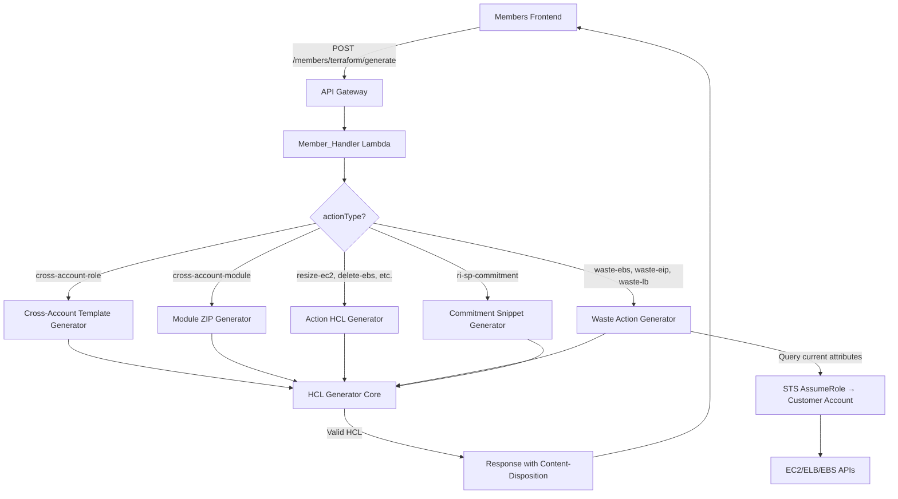

# Design Document: Terraform IaC Integration

## Overview

This feature adds Terraform HCL code generation as a first-class alternative to CloudFormation across the SlashMyBill platform. The system introduces a server-side **HCL Generator** module (`hcl_generator.py`) that translates optimization action parameters, cross-account role definitions, and commitment recommendations into valid, well-formatted Terraform HCL code.

The design follows the existing Member_Handler Lambda architecture — a new API route (`POST /members/terraform/generate`) dispatches to the HCL Generator based on `actionType`, and the frontend adds "Download Terraform" buttons alongside existing controls.

**Key Design Decisions:**
- **Server-side generation**: All HCL is generated in the Member_Handler Lambda (Python), not client-side, ensuring consistency and security.
- **Single endpoint**: One unified `/members/terraform/generate` endpoint handles all Terraform generation requests via `actionType` dispatch.
- **No Terraform state management**: The platform generates `.tf` files for download — it does NOT manage Terraform state or execute `terraform apply`.
- **Import-first workflow for waste actions**: Waste actions use Terraform 1.5+ `import {}` blocks to bring resources under management before destruction.

## Architecture



### Module Structure

```
member-handler/
├── lambda_function.py          # Existing — adds terraform/generate route
├── hcl_generator/
│   ├── __init__.py             # Package init, exports generate_hcl()
│   ├── core.py                 # HCL serialization primitives (blocks, attributes, escaping)
│   ├── cross_account.py        # Cross-account role template + module generation
│   ├── actions.py              # Optimization action generators (resize, delete, lifecycle, etc.)
│   ├── waste.py                # Waste action generators with import blocks
│   ├── commitments.py          # RI/SP commitment snippet generator
│   └── identifiers.py         # AWS ID → Terraform identifier conversion
```

## Components and Interfaces

### 1. HCL Generator Core (`hcl_generator/core.py`)

The core module provides HCL serialization primitives used by all generators.

```python
class HclBlock:
    """Represents an HCL block (resource, variable, output, etc.)."""
    block_type: str          # "resource", "variable", "output", "import", "removed", "terraform"
    labels: list[str]        # e.g., ["aws_instance", "main"]
    attributes: dict         # key-value pairs
    nested_blocks: list      # child HclBlock instances

class HclDocument:
    """A complete .tf file composed of blocks."""
    blocks: list[HclBlock]
    header_comment: str
    
    def render(self) -> str:
        """Serialize to HCL string with 2-space indentation."""
    
    @classmethod
    def parse(cls, hcl_string: str) -> 'HclDocument':
        """Parse HCL string back into structured form (for round-trip testing)."""

def escape_hcl_string(value: str) -> str:
    """Escape special characters per HCL string literal rules."""

def to_terraform_identifier(aws_id: str) -> str:
    """Convert AWS resource ID to valid Terraform identifier."""

def render_provider_block(region: str, account_id: str, role_name: str) -> HclBlock:
    """Generate provider block with assume_role configuration."""
```

### 2. Cross-Account Generator (`hcl_generator/cross_account.py`)

```python
def generate_cross_account_template(
    account_id: str,
    member_email: str,
    platform_account_id: str = "991105135552"
) -> HclDocument:
    """Generate single-file cross-account role template."""

def generate_cross_account_module(
    account_id: str,
    member_email: str,
    platform_account_id: str = "991105135552"
) -> bytes:
    """Generate ZIP archive containing the Terraform module."""
```

### 3. Action Generator (`hcl_generator/actions.py`)

```python
SUPPORTED_ACTION_TYPES = {
    'resize-ec2', 'delete-ebs', 'release-eip',
    's3-lifecycle', 'create-schedule', 'apply-tags', 'create-budget'
}

def generate_action_hcl(
    action_type: str,
    action_params: dict,
    account_id: str,
    region: str
) -> HclDocument:
    """Dispatch to the appropriate action generator."""
```

### 4. Waste Action Generator (`hcl_generator/waste.py`)

```python
def generate_waste_action_hcl(
    waste_type: str,          # "ebs-volume", "elastic-ip", "load-balancer"
    resource_attributes: dict, # Current attributes from AWS API
    account_id: str,
    region: str
) -> HclDocument:
    """Generate import-then-destroy workflow HCL."""
```

### 5. Commitment Generator (`hcl_generator/commitments.py`)

```python
def generate_commitment_snippet(
    commitment_type: str,     # "ri" or "sp"
    options: list[dict],      # Each option: {term, payment, savings, family/compute_type}
    member_email: str,
    account_id: str
) -> HclDocument:
    """Generate commented documentation + active budget resource."""
```

### 6. API Integration (`lambda_function.py` addition)

```python
def handle_terraform_generate(event):
    """POST /members/terraform/generate — unified Terraform generation endpoint."""
    # 1. Authenticate
    # 2. Parse body: actionType, accountId, actionParams
    # 3. Verify account ownership
    # 4. Dispatch to appropriate generator
    # 5. Return file with Content-Disposition header
```

### 7. Frontend Integration (`members/members.js` additions)

```javascript
// New function: downloadTerraform(actionType, accountId, actionParams)
// Calls POST /members/terraform/generate
// Triggers browser download of returned .tf file

// UI additions:
// - "Download Terraform" button on each action card
// - "Download Terraform" option on account connection wizard
// - Loading state management during download
// - Error tooltip for unsupported action types
```

## Data Models

### API Request Schema

```json
{
  "actionType": "string",       // Required: cross-account-role | cross-account-module | resize-ec2 | delete-ebs | release-eip | s3-lifecycle | create-schedule | apply-tags | create-budget | waste-ebs | waste-eip | waste-lb | ri-sp-commitment
  "accountId": "string",        // Required for account-specific actions (12 digits)
  "region": "string",           // Optional, defaults to us-east-1
  "actionParams": {             // Action-specific parameters
    // resize-ec2:
    "instanceId": "string",
    "targetInstanceType": "string",
    
    // delete-ebs:
    "volumeId": "string",
    
    // release-eip:
    "allocationId": "string",
    
    // s3-lifecycle:
    "bucketName": "string",
    "transitionDays": "number",
    "storageClass": "string",
    "expirationDays": "number",
    
    // create-schedule:
    "resourceId": "string",
    "resourceType": "string",
    "startCron": "string",
    "stopCron": "string",
    "timezone": "string",
    
    // apply-tags:
    "resourceId": "string",
    "resourceType": "string",
    "tags": {"key": "value"},
    
    // create-budget:
    "budgetName": "string",
    "amount": "number",
    "timeUnit": "string",
    "notificationThresholds": [80, 100],
    "subscriberEmail": "string",
    
    // waste-ebs / waste-eip / waste-lb:
    "resourceId": "string",
    // (attributes fetched from AWS at generation time)
    
    // ri-sp-commitment:
    "commitmentType": "string",  // "ri" or "sp"
    "options": [
      {
        "term": "string",        // "1-year" or "3-year"
        "paymentOption": "string", // "all-upfront", "partial-upfront", "no-upfront"
        "estimatedSavings": "number",
        "instanceFamily": "string",
        "computeType": "string",
        "monthlyCommitment": "number"
      }
    ]
  }
}
```

### API Response

**Success (single file):**
```
HTTP 200
Content-Type: application/octet-stream
Content-Disposition: attachment; filename="SlashMyBill-123456789012-resize-ec2.tf"

# Generated by SlashMyBill - Terraform IaC Integration
# Action: Resize EC2 instance i-0abc123 to t3.medium
# Account: 123456789012
# Generated: 2024-01-15T10:30:00Z
# WARNING: Review this file before applying with terraform apply

terraform {
  required_providers {
    aws = {
      source  = "hashicorp/aws"
      version = ">= 5.0"
    }
  }
}
...
```

**Success (ZIP module):**
```
HTTP 200
Content-Type: application/zip
Content-Disposition: attachment; filename="slashmybill-cross-account-module.zip"
```

**Error:**
```json
{
  "error": "UnsupportedActionType",
  "message": "Terraform export is not yet available for action type 'custom-action'"
}
```

### HCL Generator Internal Model

```python
@dataclass
class ActionDefinition:
    """Structured representation of an optimization action for round-trip testing."""
    action_type: str
    resource_type: str          # AWS resource type (aws_instance, aws_ebs_volume, etc.)
    resource_id: str            # AWS resource identifier
    attributes: dict            # Resource attributes to set
    import_id: str | None       # AWS ID for import block (None for removed blocks)
    is_removal: bool            # True for delete/release actions using removed {} block
    tags: dict | None           # Optional tags
    
    def to_hcl(self) -> HclDocument:
        """Serialize to HCL document."""
    
    @classmethod
    def from_hcl(cls, doc: HclDocument) -> 'ActionDefinition':
        """Parse HCL document back to ActionDefinition (round-trip)."""
```

## Correctness Properties

*A property is a characteristic or behavior that should hold true across all valid executions of a system — essentially, a formal statement about what the system should do. Properties serve as the bridge between human-readable specifications and machine-verifiable correctness guarantees.*

### Property 1: HCL Serialization Round-Trip

*For any* valid `ActionDefinition`, serializing it to HCL via `to_hcl()` and then parsing the result back via `from_hcl()` SHALL produce an equivalent `ActionDefinition` with the same action_type, resource_type, resource_id, attributes, import_id, is_removal, and tags.

**Validates: Requirements 7.3**

### Property 2: ExternalId SHA-256 Correctness

*For any* valid email string, the generated Terraform cross-account template (and module) SHALL contain an `external_id` value that equals the hexadecimal SHA-256 hash of that email string, ensuring the Terraform output matches the CloudFormation template behavior.

**Validates: Requirements 1.2, 2.6**

### Property 3: HCL String Escaping Correctness

*For any* string value containing special characters (quotes, backslashes, `${` interpolation sequences, `%{` template sequences, newlines), the `escape_hcl_string()` function SHALL produce output that, when embedded in an HCL string literal, represents the original value without syntax errors or unintended interpolation.

**Validates: Requirements 7.4**

### Property 4: Terraform Identifier Validity

*For any* AWS resource identifier string, the `to_terraform_identifier()` function SHALL produce a string matching the pattern `[a-z][a-z0-9_-]*` (valid Terraform identifier) that is deterministic (same input always produces same output).

**Validates: Requirements 7.6**

### Property 5: Header Comment Completeness

*For any* supported action type and valid action parameters, the generated HCL output SHALL begin with a comment block containing: (1) the action description, (2) a generation timestamp in ISO 8601 format, (3) the target account ID, and (4) a review warning.

**Validates: Requirements 3.8**

### Property 6: Action Type to Resource Mapping

*For any* supported optimization action type and valid parameters, the generated HCL SHALL contain a resource block (or `removed {}` block for destructive actions) of the correct Terraform resource type: `resize-ec2` → `aws_instance`, `delete-ebs` → `removed` block, `release-eip` → `removed` block, `s3-lifecycle` → `aws_s3_bucket_lifecycle_configuration`, `create-schedule` → `aws_scheduler_schedule`, `apply-tags` → target resource type with tags, `create-budget` → `aws_budgets_budget`.

**Validates: Requirements 3.1, 3.2, 3.3, 3.4, 3.5, 3.6, 3.7**

### Property 7: Waste Action Import Structure

*For any* waste action type (EBS volume, EIP, load balancer) and valid resource attributes, the generated HCL SHALL contain both: (1) a complete resource definition with all provided attributes, and (2) an `import {}` block with the correct AWS resource identifier, and (3) a step-by-step workflow comment explaining the import-then-destroy process.

**Validates: Requirements 4.1, 4.2, 4.3, 4.4, 4.5**

### Property 8: RI/SP Budget Tracking Generation

*For any* set of commitment options (1 to N options with varying terms and payment types) and a valid member email, the generated HCL SHALL contain: (1) one active `aws_budgets_budget` resource with the committed amount as the budget limit, (2) notification rules at 80% and 100% thresholds with the member email as subscriber, and (3) one commented section per option documenting the commitment details.

**Validates: Requirements 5.2, 5.3, 5.5**

### Property 9: Account Ownership Enforcement

*For any* authenticated member and account ID that does NOT belong to that member, the `/members/terraform/generate` endpoint SHALL return a 403 Forbidden response without generating any Terraform code.

**Validates: Requirements 8.5**

### Property 10: Provider Block Correctness

*For any* valid account ID and region, the generated HCL SHALL include a `provider "aws"` block with the specified region and an `assume_role` configuration containing the role ARN `arn:aws:iam::{accountId}:role/SlashMyBill-{accountId}`.

**Validates: Requirements 7.7**

## Error Handling

| Error Condition | HTTP Status | Error Code | Message |
|----------------|-------------|------------|---------|
| Missing `actionType` | 400 | InvalidRequest | "actionType is required" |
| Missing `accountId` for account-specific actions | 400 | InvalidRequest | "accountId is required for this action type" |
| Invalid `accountId` format | 400 | InvalidAccountId | "Account ID must be exactly 12 digits" |
| Unsupported action type | 400 | UnsupportedActionType | "Terraform export is not yet available for action type '{type}'" |
| Member doesn't own account | 403 | Forbidden | "Account {id} does not belong to you" |
| Authentication failure | 401 | AuthError | "Authentication required" |
| Unrepresentable HCL value | 400 | HclGenerationError | "Cannot represent value in HCL: {description}" |
| AWS API failure during waste action attribute fetch | 500 | ServerError | "Failed to fetch resource attributes: {details}" |
| Cross-account role assumption failure | 400 | ConnectionFailed | "Cannot access account {id}: {details}" |

**Error handling strategy:**
- Input validation errors return immediately with 400 status
- Authentication/authorization errors return 401/403 before any generation logic
- HCL generation errors are caught and returned as 400 with descriptive messages
- AWS API failures during waste action attribute fetching return 500 with context
- All errors are logged with member email and action context for debugging

## Testing Strategy

### Unit Tests (Example-Based)

Unit tests cover specific scenarios, edge cases, and integration points:

- Cross-account template structure (provider block, required_providers, outputs)
- Module ZIP contents (correct files present)
- Each action type produces expected resource blocks (one example per type)
- Error responses for invalid inputs
- Backward compatibility: format="cloudformation" returns YAML unchanged
- Frontend button rendering and click handlers

### Property-Based Tests

Property-based tests verify universal correctness properties using the **Hypothesis** library (Python).

**Configuration:**
- Minimum 100 iterations per property test
- Custom strategies for generating valid ActionDefinitions, AWS resource IDs, email addresses, and action parameters

**Test tags follow the format:**
`Feature: terraform-iac-integration, Property {number}: {property_text}`

Properties to implement:
1. **Round-trip** (Property 1): Generate random ActionDefinitions → serialize → parse → assert equivalence
2. **ExternalId** (Property 2): Generate random emails → generate template → extract ExternalId → assert equals SHA-256
3. **String escaping** (Property 3): Generate strings with special chars → escape → embed in HCL literal → verify no syntax errors
4. **Identifier validity** (Property 4): Generate random AWS IDs → convert → assert matches `[a-z][a-z0-9_-]*`
5. **Header completeness** (Property 5): Generate random actions → generate HCL → assert header contains all 4 elements
6. **Resource mapping** (Property 6): Generate random supported actions → generate HCL → assert correct resource type present
7. **Waste import structure** (Property 7): Generate random waste actions → generate HCL → assert resource + import + workflow comment
8. **Budget tracking** (Property 8): Generate random commitment options → generate HCL → assert budget + notifications + commented sections
9. **Ownership enforcement** (Property 9): Generate random unauthorized member/account pairs → call endpoint → assert 403
10. **Provider block** (Property 10): Generate random account/region → generate HCL → assert provider block correctness

### Integration Tests

- End-to-end API call with authentication → file download
- Waste action generation with mocked AWS API responses
- `terraform fmt` validation on generated outputs (requires Terraform binary in CI)
- `terraform validate` on representative outputs (CI environment with AWS provider)

### Test File Structure

```
member-handler/
├── tests/
│   ├── test_hcl_generator_unit.py       # Example-based unit tests
│   ├── test_hcl_generator_properties.py # Property-based tests (Hypothesis)
│   ├── test_terraform_api_unit.py       # API endpoint unit tests
│   └── conftest.py                      # Shared fixtures and strategies
```
