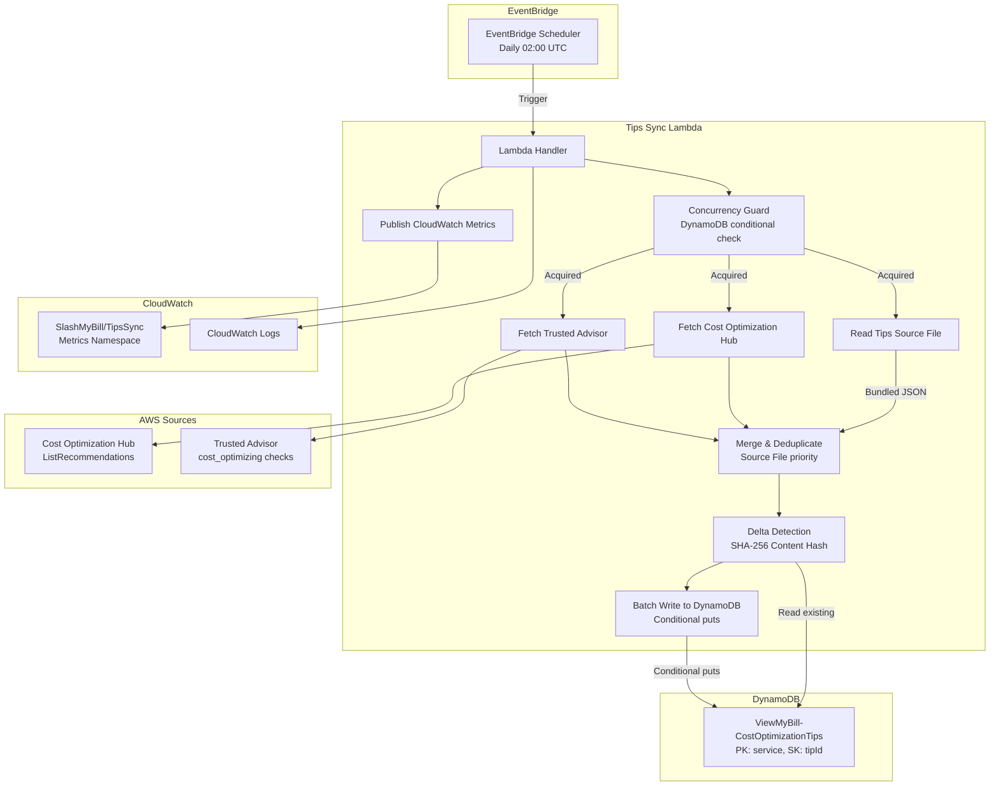
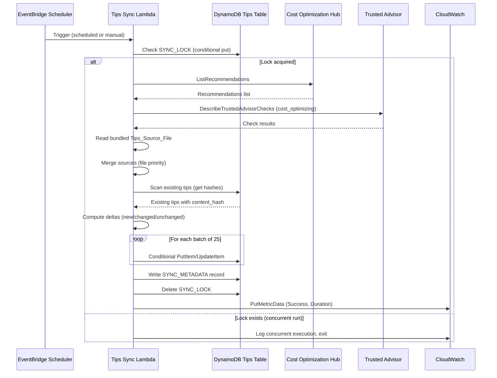

# Design Document: Tips Auto-Sync

## Overview

The Tips Auto-Sync feature introduces a scheduled Lambda function (`Tips_Sync_Lambda`) that automatically fetches cost optimization recommendations from AWS FinOps sources and applies delta changes to the existing `ViewMyBill-CostOptimizationTips` DynamoDB table. The system runs daily via EventBridge Scheduler, queries Cost Optimization Hub (primary) and Trusted Advisor cost_optimizing category (secondary), computes content hashes to detect changes, and writes only new or updated tips — preserving manually curated operational metadata.

### Key Design Decisions

1. **Delta-only sync (no deletes)**: Tips are only inserted or updated, never deleted. This preserves manually curated tips and prevents data loss if an AWS source temporarily returns fewer results.
2. **Content hashing for change detection**: SHA-256 hash of content fields (`title`, `description`, `estimatedSavings`, `automatedCheck`) determines whether a tip has changed, avoiding unnecessary DynamoDB writes.
3. **Source priority**: The local `Tips_Source_File` takes precedence over AWS sources when the same `id` exists in both, because manually curated tips contain richer operational metadata.
4. **Conditional writes with version attribute**: Prevents the sync from overwriting concurrent manual edits made through the admin panel.
5. **Graceful degradation**: If one AWS source fails, the sync continues with the remaining source and the baseline file.

## Architecture



### Execution Flow



## Components and Interfaces

### 1. Tips Sync Lambda (`tips-sync/lambda_function.py`)

The main Lambda function orchestrating the sync process.

**Entry Point**: `lambda_handler(event, context)`

**Modules**:

| Module | Responsibility |
|--------|---------------|
| `lambda_function.py` | Handler, orchestration, concurrency guard |
| `sources/cost_optimization_hub.py` | Fetch and normalize COH recommendations |
| `sources/trusted_advisor.py` | Fetch and normalize TA cost_optimizing checks |
| `sources/baseline_file.py` | Read and parse the bundled Tips_Source_File |
| `sync_engine.py` | Merge, deduplicate, delta detection, batch write |
| `models.py` | Tip data classes, schema validation, hash computation |
| `metrics.py` | CloudWatch metric publishing |

**Interfaces**:

```python
# lambda_function.py
def lambda_handler(event: dict, context) -> dict:
    """
    Entry point. Handles both scheduled and manual triggers.
    event: {"manual": true} for manual trigger, or EventBridge scheduled event
    Returns: {"statusCode": 200, "body": {"tipsInserted": N, "tipsUpdated": N, ...}}
    """

# sources/cost_optimization_hub.py
def fetch_recommendations(client) -> list[dict]:
    """
    Calls cost-optimization-hub:ListRecommendations with pagination.
    Returns normalized tip dicts ready for delta comparison.
    """

# sources/trusted_advisor.py
def fetch_cost_checks(support_client) -> list[dict]:
    """
    Calls support:DescribeTrustedAdvisorChecks filtered to cost_optimizing,
    then fetches results for each check.
    Returns normalized tip dicts.
    """

# sources/baseline_file.py
def load_baseline_tips(file_path: str) -> list[dict]:
    """
    Reads the bundled aws-cost-optimization-tips.json.
    Returns tip dicts or empty list on error.
    """

# sync_engine.py
def merge_sources(baseline: list, coh: list, ta: list) -> list[dict]:
    """
    Merges tips from all sources. Baseline file takes priority for duplicate IDs.
    Returns deduplicated list of tips to sync.
    """

def compute_deltas(merged_tips: list, existing_tips: dict) -> tuple[list, list, int]:
    """
    Compares merged tips against existing table records using content hash.
    Returns: (tips_to_insert, tips_to_update, unchanged_count)
    """

def apply_deltas(table, inserts: list, updates: list) -> tuple[int, int, list]:
    """
    Writes inserts and updates to DynamoDB with conditional writes.
    Returns: (inserted_count, updated_count, conflict_ids)
    """

# models.py
def compute_content_hash(title: str, description: str, estimated_savings: str, automated_check: str) -> str:
    """
    Computes SHA-256 hash of content fields for delta detection.
    """

def generate_tip_id(service: str, existing_ids: set) -> str:
    """
    Generates next sequential ID for a service (e.g., ec2-042).
    """
```

### 2. EventBridge Scheduler Rule

- **Name**: `slashmybill-tips-sync-daily`
- **Schedule**: `cron(0 2 * * ? *)` (02:00 UTC daily)
- **Target**: Tips Sync Lambda ARN
- **Payload**: `{"source": "scheduler", "manual": false}`

### 3. Concurrency Guard

Uses a DynamoDB conditional put on a `SYNC_LOCK` record to prevent concurrent executions:

```python
# Acquire lock
table.put_item(
    Item={
        "service": "SYSTEM",
        "tipId": "SYNC_LOCK",
        "lockedAt": current_timestamp,
        "ttl": current_timestamp + 900  # 15-min auto-expire
    },
    ConditionExpression="attribute_not_exists(tipId)"
)
```

The lock has a TTL of 15 minutes to auto-expire in case of Lambda crash.

### 4. CI/CD Integration

New deploy step in `.github/workflows/deploy.yml`:
- Trigger path: `tips-sync/**`
- Package: zip `tips-sync/` directory with dependencies
- Upload to S3 storage bucket
- Update Lambda function code
- Ensure EventBridge Scheduler rule exists

## Data Models

### Tips Table Schema (existing)

| Attribute | Type | Key | Description |
|-----------|------|-----|-------------|
| `service` | String | PK (Partition Key) | AWS service name (e.g., "EC2", "S3") |
| `tipId` | String | SK (Sort Key) | Unique tip identifier (e.g., "ec2-001") |
| `category` | String | — | Tip category (e.g., "right-sizing") |
| `title` | String | — | Tip title |
| `description` | String | — | Detailed description |
| `estimatedSavings` | String | — | Savings estimate (e.g., "20-40%") |
| `difficulty` | String | — | Implementation difficulty |
| `automatedCheck` | String | — | Check implementation details |
| `checkImplemented` | Boolean | — | Whether automated check exists |
| `actionType` | String | — | Action type (advisory, deep-link, modify, delete) |
| `actionLabel` | String | — | Button label text |
| `actionTarget` | String | — | Navigation target |
| `level` | Number | — | Display priority level |
| `serviceKey` | String | — | Service key for cost mapping |
| `implementedInAct` | Boolean | — | Whether implemented in Act tab |
| `implementedInScheduler` | Boolean | — | Whether implemented in Scheduler |

### New Attributes Added by Sync

| Attribute | Type | Description |
|-----------|------|-------------|
| `contentHash` | String | SHA-256 hash of content fields for delta detection |
| `syncSource` | String | Origin source: "baseline", "cost-optimization-hub", "trusted-advisor" |
| `lastSyncedAt` | String | ISO 8601 timestamp of last sync that touched this record |
| `version` | Number | Optimistic locking version counter (starts at 1) |

### Sync Metadata Record

Stored in the same table with special keys:

| Attribute | Type | Value |
|-----------|------|-------|
| `service` | String | "SYSTEM" |
| `tipId` | String | "SYNC_METADATA" |
| `lastSyncTimestamp` | String | ISO 8601 timestamp |
| `triggerType` | String | "scheduled" or "manual" |
| `sourcesQueried` | List | ["cost-optimization-hub", "trusted-advisor", "baseline"] |
| `sourcesSucceeded` | List | Sources that returned data |
| `sourcesFailed` | List | Sources that errored |
| `tipsInserted` | Number | Count of new tips added |
| `tipsUpdated` | Number | Count of tips updated |
| `tipsUnchanged` | Number | Count of tips skipped |
| `durationMs` | Number | Total execution time in ms |

### Sync Lock Record

| Attribute | Type | Value |
|-----------|------|-------|
| `service` | String | "SYSTEM" |
| `tipId` | String | "SYNC_LOCK" |
| `lockedAt` | String | ISO 8601 timestamp |
| `ttl` | Number | Unix epoch + 900s (DynamoDB TTL for auto-cleanup) |

### Tip Normalization from AWS Sources

**Cost Optimization Hub → Tip Record mapping**:

| COH Field | Tip Field |
|-----------|-----------|
| `recommendationId` | Used for dedup, not stored as `tipId` |
| `source` | Maps to `service` |
| `currentResourceSummary` | Contributes to `description` |
| `estimatedMonthlySavings` | `estimatedSavings` (formatted as percentage or dollar amount) |
| `recommendationType` | Maps to `category` |

**Trusted Advisor → Tip Record mapping**:

| TA Field | Tip Field |
|----------|-----------|
| `id` (check ID) | Used for dedup |
| `name` | `title` |
| `description` | `description` |
| `category` | Fixed: "cost-optimizing" → mapped to specific category |
| `estimatedMonthlySavings` (from result) | `estimatedSavings` |

## Correctness Properties

*A property is a characteristic or behavior that should hold true across all valid executions of a system — essentially, a formal statement about what the system should do. Properties serve as the bridge between human-readable specifications and machine-verifiable correctness guarantees.*

### Property 1: Content hash determinism and sensitivity

*For any* tip content (title, description, estimatedSavings, automatedCheck), computing the content hash twice with the same inputs SHALL produce the same hash, AND changing any single field SHALL produce a different hash.

**Validates: Requirements 3.1**

### Property 2: New tips are classified as inserts

*For any* set of fetched tips and any set of existing tip IDs in the table, every fetched tip whose ID does not appear in the existing set SHALL be classified as an insert by the delta engine.

**Validates: Requirements 3.2**

### Property 3: Updates preserve operational fields

*For any* existing tip record and any fetched tip with the same ID but a different content hash, the delta engine SHALL produce an update that changes only the content fields (title, description, estimatedSavings, automatedCheck) while preserving all operational fields (actionType, actionLabel, actionTarget, implementedInAct, implementedInScheduler, level, checkImplemented).

**Validates: Requirements 3.3**

### Property 4: Unchanged tips are skipped

*For any* fetched tip whose ID exists in the table and whose computed content hash matches the stored content hash, the delta engine SHALL classify it as unchanged and produce no write operation.

**Validates: Requirements 3.4**

### Property 5: No-delete invariant

*For any* set of existing tip IDs and any set of fetched tips (from any combination of sources), the set of tip IDs in the table after sync SHALL be a superset of the set before sync — no existing tip is ever removed.

**Validates: Requirements 3.5**

### Property 6: Schema compliance with defaults for new AWS-sourced tips

*For any* raw recommendation from Cost Optimization Hub or Trusted Advisor, the normalized tip record SHALL contain all required fields (id, service, category, title, description, estimatedSavings, difficulty, automatedCheck) AND SHALL have default operational values: checkImplemented=false, actionType="advisory", actionLabel="View Details", level=3.

**Validates: Requirements 4.1, 4.2**

### Property 7: ID generation pattern and uniqueness

*For any* service name and any set of existing tip IDs, the generated ID SHALL match the pattern `{service_lowercase}-{number}` AND SHALL NOT collide with any ID in the existing set.

**Validates: Requirements 4.3**

### Property 8: Source merge priority

*For any* set of tips from the baseline file and any set of tips from AWS sources where some IDs overlap, the merged result SHALL contain the baseline file version for every overlapping ID.

**Validates: Requirements 6.2**

### Property 9: Batch size constraint

*For any* list of tips to write (of any length), the batching function SHALL produce batches where each batch contains at most 25 items.

**Validates: Requirements 7.3**

## Error Handling

### Error Categories and Responses

| Error | Category | Response |
|-------|----------|----------|
| Concurrent execution detected | Concurrency | Log warning, exit with 200, no processing |
| Cost Optimization Hub API error | Source failure | Log error, skip source, continue with others |
| Trusted Advisor API error | Source failure | Log error, skip source, continue with others |
| Tips_Source_File missing/malformed | Source failure | Log warning, continue with AWS sources |
| DynamoDB conditional write conflict | Data conflict | Log conflict with tip ID, skip tip, continue |
| DynamoDB throttling | Transient | Exponential backoff retry (3 attempts) |
| DynamoDB service error | Transient | Exponential backoff retry (3 attempts) |
| All sources failed | Unrecoverable | Publish TipsSyncFailure metric, exit with error |
| Lambda timeout approaching | Timeout | Write partial SYNC_METADATA, release lock, exit |

### Retry Strategy

```python
RETRY_CONFIG = {
    "max_attempts": 3,
    "base_delay_ms": 100,
    "max_delay_ms": 2000,
    "retryable_errors": [
        "ProvisionedThroughputExceededException",
        "ThrottlingException",
        "InternalServerError",
        "ServiceUnavailable"
    ]
}
```

### Lock Cleanup

The SYNC_LOCK record uses DynamoDB TTL (15 minutes) for automatic cleanup if the Lambda crashes. On successful completion, the lock is explicitly deleted. This prevents stale locks from blocking future runs.

## Testing Strategy

### Property-Based Tests (Hypothesis — Python)

Property-based testing is appropriate for this feature because the core sync logic contains pure functions (content hashing, delta detection, ID generation, merging, batching) with clear input/output behavior and universal properties that hold across a wide input space.

**Library**: [Hypothesis](https://hypothesis.readthedocs.io/) for Python
**Minimum iterations**: 100 per property test
**Tag format**: `Feature: tips-auto-sync, Property {N}: {property_text}`

Each correctness property (1–9) maps to a single property-based test:

| Property | Test File | What's Generated |
|----------|-----------|-----------------|
| 1 | `tests/test_properties.py` | Random strings for title, description, estimatedSavings, automatedCheck |
| 2 | `tests/test_properties.py` | Random tip lists and random existing ID sets |
| 3 | `tests/test_properties.py` | Random existing tip records and modified versions |
| 4 | `tests/test_properties.py` | Random tips with pre-computed matching hashes |
| 5 | `tests/test_properties.py` | Random existing ID sets and random fetched tip lists |
| 6 | `tests/test_properties.py` | Random COH/TA API response structures |
| 7 | `tests/test_properties.py` | Random service names and random existing ID sets |
| 8 | `tests/test_properties.py` | Random tip lists with overlapping IDs across sources |
| 9 | `tests/test_properties.py` | Random tip lists of varying lengths (0–200) |

### Unit Tests (pytest)

Example-based tests for specific scenarios:

| Test | Validates |
|------|-----------|
| `test_concurrent_execution_exits_gracefully` | Req 1.3 |
| `test_source_failure_continues_with_remaining` | Req 2.3 |
| `test_sync_metadata_written_on_completion` | Req 5.1 |
| `test_failure_metric_published_on_unrecoverable_error` | Req 5.2 |
| `test_structured_json_logging` | Req 5.3 |
| `test_success_metrics_published` | Req 5.4 |
| `test_baseline_file_included_in_sync` | Req 6.1 |
| `test_missing_baseline_file_continues` | Req 6.3 |
| `test_version_conflict_skips_and_continues` | Req 7.2 |
| `test_manual_trigger_executes_full_sync` | Req 10.1 |
| `test_manual_trigger_metadata_type` | Req 10.2 |

### Integration Tests

| Test | Validates |
|------|-----------|
| `test_coh_api_called_with_correct_params` | Req 2.1 |
| `test_ta_api_called_with_category_filter` | Req 2.2 |
| `test_conditional_write_uses_version_attribute` | Req 7.1 |
| `test_end_to_end_sync_with_mocked_aws` | Reqs 1.2, 3.1–3.5, 5.1 |

### Smoke Tests

| Test | Validates |
|------|-----------|
| `test_eventbridge_rule_exists` | Req 1.1 |
| `test_iam_policy_has_required_permissions` | Reqs 8.1–8.4 |
| `test_deploy_yml_includes_tips_sync_path` | Reqs 9.1–9.3 |

