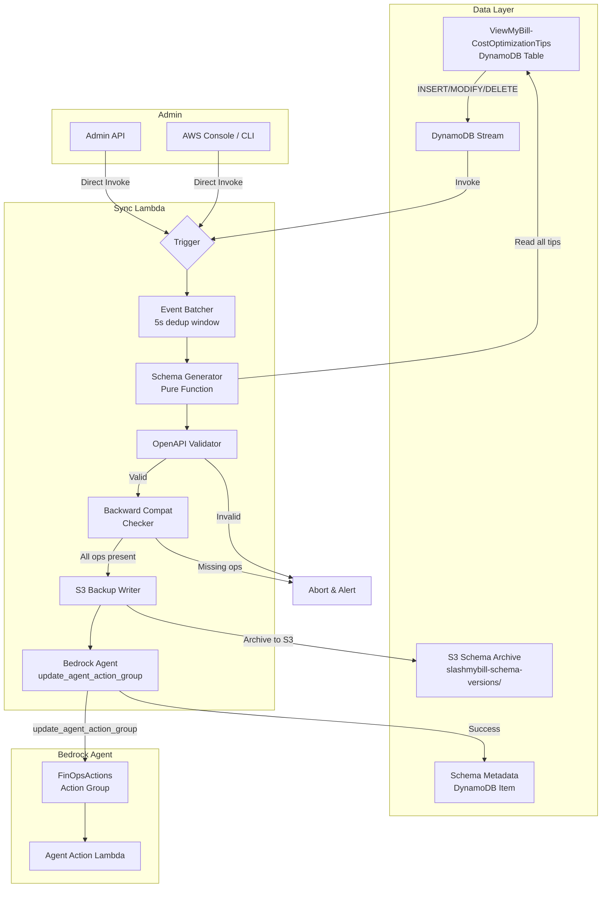

# Design Document: Tips-Driven Schema Sync

## Overview

This feature replaces the static `openapi-schema.json` file with a dynamic schema generation pipeline driven by the `ViewMyBill-CostOptimizationTips` DynamoDB table. The system introduces:

1. **Universal Service ID System** — A canonical `<provider>:<service-slug>` identifier used across Tips, Tools, and Cost Cache layers for unambiguous cross-referencing.
2. **Tool Definition Embedding** — Each tip record optionally contains a `toolDefinition` object that describes an OpenAPI operation the tip requires.
3. **Schema Generator** — A pure-function module that scans tip records, merges tool definitions, and produces a deterministic, valid OpenAPI 3.0.0 JSON document.
4. **Sync Lambda** — A DynamoDB Streams-triggered (and manually invocable) Lambda that orchestrates generation → validation → backup → Bedrock Agent update.
5. **Version Tracking** — Each successful push increments a version counter and archives the schema to S3 for audit and rollback.

The design preserves full backward compatibility with the 11 existing operations in `openapi-schema.json` and supports future multi-cloud expansion (GCP, Azure, OpenAI) without code changes.

## Architecture



### Key Design Decisions

1. **Schema Generator as Pure Function**: The generator takes a list of tip records and returns an OpenAPI JSON object. No side effects. This makes it trivially testable and deterministic.

2. **Batching via Lambda concurrency control**: Rather than implementing a custom batching mechanism, we use a reserved concurrency of 1 on the Sync Lambda plus the DynamoDB Streams batch window (already configurable). Events arriving while the Lambda is running will be retried by the stream, effectively batching within the 5-second window.

3. **Backward Compatibility Gate**: Before any push, the generated schema is compared against a list of required operationIds (the current 11). If any are missing, the update is aborted. This prevents accidental tool removal during migration.

4. **Provider-Scoped Paths**: New multi-cloud tools use paths like `/aws/get-ec2-instances` while existing legacy paths (e.g., `/get-ec2-instances`) are preserved as aliases during migration. The schema includes both forms until legacy deprecation.

5. **S3 as Version Store**: Each schema version is stored as `s3://slashmybill-schema-versions/v{N}/{timestamp}.json`. This is cheaper and simpler than DynamoDB for large JSON blobs.

## Components and Interfaces

### 1. Schema Generator Module (`schema_generator.py`)

```python
def generate_schema(tip_records: list[dict]) -> dict:
    """
    Generate an OpenAPI 3.0.0 schema from tip records.
    
    Args:
        tip_records: List of DynamoDB tip items (already deserialized)
    
    Returns:
        A valid OpenAPI 3.0.0 JSON-serializable dict
    
    Raises:
        SchemaValidationError: If the generated schema fails structural validation
    """

def validate_schema(schema: dict) -> list[str]:
    """
    Validate schema against OpenAPI 3.0.0 structure rules.
    Returns list of validation errors (empty = valid).
    """

def merge_tool_definitions(definitions: list[dict]) -> dict:
    """
    Merge multiple tool definitions sharing the same operationId.
    Uses the definition with the most parameters; logs warning on conflicts.
    """
```

### 2. Service ID Module (`service_id.py`)

```python
SERVICE_REGISTRY: dict[str, dict]  # serviceId -> {displayName, provider, aliases}

def validate_service_id(service_id: str) -> bool:
    """Validate format: <provider>:<service-slug> with known provider."""

def resolve_alias(alias: str) -> str | None:
    """Resolve a display name or alias to its canonical Service_ID."""

def get_provider(service_id: str) -> str:
    """Extract provider from a Service_ID (e.g., 'aws' from 'aws:ec2')."""
```

### 3. Sync Lambda (`sync_lambda.py`)

```python
def lambda_handler(event, context) -> dict:
    """
    Entry point. Handles both DynamoDB Stream events and direct invocations.
    
    Direct invocation payload:
        {"action": "sync", "dryRun": false}
        {"action": "rollback", "version": 5}
    """

def _is_tool_relevant_event(record: dict) -> bool:
    """Check if a DynamoDB stream record involves a toolDefinition change."""

def _backup_current_schema(schema: dict, version: int) -> str:
    """Write schema to S3 and return the S3 key."""

def _push_to_bedrock(schema: dict) -> dict:
    """Call update_agent_action_group and return response."""

def _check_backward_compatibility(schema: dict, required_ops: list[str]) -> list[str]:
    """Return list of missing required operationIds."""
```

### 4. Migration Script (`migrate_service_ids.py`)

```python
def migrate_tips_table() -> dict:
    """
    Scan all tip records and populate serviceId from serviceKey.
    Returns summary: {migrated: int, skipped: int, total: int}
    """

LEGACY_SERVICE_KEY_MAP: dict[str, str]  # "Amazon EC2" -> "aws:ec2"
```

### Interface Contracts

| Caller | Callee | Interface |
|--------|--------|-----------|
| DynamoDB Stream | Sync Lambda | Stream event records (INSERT/MODIFY/REMOVE) |
| Sync Lambda | Schema Generator | `generate_schema(tip_records) -> dict` |
| Sync Lambda | Bedrock Agent API | `update_agent_action_group(agentId, actionGroupName, apiSchema)` |
| Sync Lambda | S3 | `put_object(bucket, key, body)` |
| Admin | Sync Lambda | Direct invocation with `{"action": "sync/rollback", ...}` |
| Schema Generator | Service ID Module | `validate_service_id(id) -> bool` |

## Data Models

### Tips Table Record (Enhanced)

```json
{
  "service": "EC2",
  "id": "ec2-001",
  "serviceId": "aws:ec2",
  "serviceKey": "Amazon EC2",
  "title": "Right-size EC2 instances",
  "description": "...",
  "estimatedSavings": "20-40%",
  "difficulty": "easy",
  "category": "right-sizing",
  "toolDefinition": {
    "operationId": "getComputeInstances",
    "path": "/aws/get-ec2-instances",
    "httpMethod": "POST",
    "provider": "aws",
    "summary": "List EC2 instances with CPU metrics",
    "description": "Lists EC2 instances with type, state, and 14-day average CPU",
    "parameters": [
      {
        "name": "accountId",
        "in": "query",
        "type": "string",
        "required": true,
        "description": "The 12-digit AWS account ID"
      },
      {
        "name": "memberEmail",
        "in": "query",
        "type": "string",
        "required": true,
        "description": "Member email for role assumption"
      }
    ]
  }
}
```

### Schema Metadata Record (DynamoDB)

Stored in a dedicated metadata table or as a special item in the Tips Table:

```json
{
  "pk": "SCHEMA_META",
  "sk": "CURRENT",
  "currentVersion": 12,
  "lastSyncTimestamp": "2025-01-15T10:30:00Z",
  "syncStatus": "SUCCESS",
  "operationCount": 14,
  "providersIncluded": ["aws", "gcp"],
  "s3Key": "v12/2025-01-15T10:30:00Z.json",
  "lastError": null
}
```

### S3 Schema Archive Structure

```
s3://slashmybill-schema-versions/
├── v1/2025-01-10T08:00:00Z.json
├── v2/2025-01-11T14:22:00Z.json
├── ...
└── v12/2025-01-15T10:30:00Z.json
```

### Service Registry (Embedded in Service ID Module)

```python
SERVICE_REGISTRY = {
    "aws:ec2": {
        "displayName": "Amazon EC2",
        "provider": "aws",
        "aliases": ["Amazon EC2", "EC2", "Elastic Compute Cloud"]
    },
    "aws:s3": {
        "displayName": "Amazon S3",
        "provider": "aws",
        "aliases": ["Amazon Simple Storage Service", "Amazon S3", "S3"]
    },
    "aws:rds": {
        "displayName": "Amazon RDS",
        "provider": "aws",
        "aliases": ["Amazon Relational Database Service", "Amazon RDS", "RDS"]
    },
    "aws:lambda": {
        "displayName": "AWS Lambda",
        "provider": "aws",
        "aliases": ["AWS Lambda", "Lambda"]
    },
    "aws:ebs": {
        "displayName": "Amazon EBS",
        "provider": "aws",
        "aliases": ["EC2 - Other", "EBS", "Elastic Block Store"]
    },
    "aws:vpc": {
        "displayName": "Amazon VPC",
        "provider": "aws",
        "aliases": ["Amazon Virtual Private Cloud", "VPC"]
    },
    "aws:cloudfront": {
        "displayName": "Amazon CloudFront",
        "provider": "aws",
        "aliases": ["Amazon CloudFront", "CloudFront"]
    },
    "gcp:compute-engine": {
        "displayName": "Google Compute Engine",
        "provider": "gcp",
        "aliases": ["Compute Engine", "GCE"]
    },
    "azure:virtual-machines": {
        "displayName": "Azure Virtual Machines",
        "provider": "azure",
        "aliases": ["Azure VMs", "Virtual Machines"]
    },
    "openai:api": {
        "displayName": "OpenAI API",
        "provider": "openai",
        "aliases": ["OpenAI", "GPT API"]
    }
}
```

### Generated OpenAPI Schema (Example Output)

```json
{
  "openapi": "3.0.0",
  "info": {
    "title": "SlashMyBill FinOps Actions",
    "version": "3.0.0",
    "description": "Auto-generated action group schema from Tips Table"
  },
  "paths": {
    "/get-ec2-instances": {
      "post": {
        "operationId": "getEC2Instances",
        "summary": "List EC2 instances with CPU metrics",
        "description": "Lists EC2 instances with type state and 14 day average CPU",
        "parameters": [
          {"name": "accountId", "in": "query", "required": true, "schema": {"type": "string", "description": "The 12-digit AWS account ID"}},
          {"name": "memberEmail", "in": "query", "required": true, "schema": {"type": "string", "description": "Member email for role assumption"}}
        ],
        "responses": {"200": {"description": "EC2 instances response"}}
      }
    }
  }
}
```

### Required OperationIds (Backward Compatibility Set)

```python
REQUIRED_OPERATION_IDS = [
    "getCostData",
    "getMonthlyComparison",
    "getEC2Instances",
    "getRDSInstances",
    "getLambdaFunctions",
    "getS3Buckets",
    "getEBSVolumes",
    "getNetworkResources",
    "getBudgets",
    "getFinOpsSettings",
    "getAWSPricing",
]
```

## Correctness Properties

*A property is a characteristic or behavior that should hold true across all valid executions of a system — essentially, a formal statement about what the system should do. Properties serve as the bridge between human-readable specifications and machine-verifiable correctness guarantees.*

### Property 1: Service ID Format Validation

*For any* string, the Service ID validator SHALL accept it if and only if it matches the pattern `<provider>:<service-slug>` where provider is one of `aws`, `gcp`, `azure`, `openai` and service-slug is a non-empty lowercase kebab-case string (matching `^[a-z][a-z0-9]*(-[a-z0-9]+)*$`).

**Validates: Requirements 1.1**

### Property 2: Schema Generation Produces Valid OpenAPI

*For any* list of tip records (including those with invalid serviceIds, missing toolDefinitions, or malformed data), the Schema Generator SHALL produce output that passes OpenAPI 3.0.0 structural validation — containing a valid `openapi` version field, `info` object with title/version/description, and a `paths` object where each entry has a valid HTTP method with operationId, parameters, and responses.

**Validates: Requirements 3.1, 3.3, 3.6, 2.4, 1.4**

### Property 3: Tool Definition Merge — Most Parameters Wins

*For any* set of tool definitions sharing the same operationId but with different parameter sets, the Schema Generator SHALL produce exactly one path entry for that operationId, and the resulting parameter list SHALL have a length greater than or equal to the length of every individual definition's parameter list.

**Validates: Requirements 2.2, 3.4**

### Property 4: Deterministic Output Regardless of Input Order

*For any* set of tip records, generating the schema from two different permutations of that set SHALL produce byte-identical JSON output.

**Validates: Requirements 3.5**

### Property 5: Multi-Provider Inclusivity

*For any* set of tip records containing valid tool definitions from N distinct providers (where N ≥ 1), the generated schema SHALL contain at least one operation path for each of the N providers present in the input.

**Validates: Requirements 6.1, 6.2, 6.3, 3.2**

### Property 6: Backward Compatibility Gate

*For any* generated schema and a set of required operationIds, the backward compatibility checker SHALL return a non-empty list of missing operations if and only if the schema's paths do not collectively contain all required operationIds.

**Validates: Requirements 9.2, 9.3**

### Property 7: Migration Idempotence

*For any* set of tip records, running the migration function twice SHALL produce records identical to running it once — i.e., `migrate(migrate(records)) == migrate(records)`.

**Validates: Requirements 10.4**

### Property 8: Migration Preserves Legacy Fields and Maps Correctly

*For any* tip record with a legacy serviceKey that exists in the mapping, after migration the record SHALL contain both the original `serviceKey` (unchanged) and a `serviceId` that equals the mapped value. For any tip record with a serviceKey NOT in the mapping, the record SHALL remain unchanged (no serviceId added).

**Validates: Requirements 10.1, 10.2, 10.3**

## Error Handling

### Schema Generation Errors

| Error Condition | Handling |
|----------------|----------|
| Tip record missing `serviceId` | Skip record, log validation warning, continue processing remaining tips |
| Tip `toolDefinition` has invalid structure | Skip that tool definition, log warning with tip ID |
| Generated schema fails OpenAPI validation | Abort sync, return validation errors, do NOT push to Bedrock |
| DynamoDB scan failure | Retry up to 3 times with exponential backoff, then alert admin via SNS |

### Sync Lambda Errors

| Error Condition | Handling |
|----------------|----------|
| `update_agent_action_group` API failure | Log full error, publish SNS alert, retain current agent config |
| S3 backup write failure | Log warning, proceed with Bedrock update (backup is advisory) |
| Backward compatibility check fails (missing ops) | Abort update, log missing operationIds, alert admin |
| Lambda timeout approaching | Check elapsed time before push; if > 80% of timeout, abort gracefully |
| Concurrent invocation conflict | Reserved concurrency = 1 prevents this; DynamoDB Streams retries handle the queue |

### Migration Errors

| Error Condition | Handling |
|----------------|----------|
| Unknown `serviceKey` (no mapping) | Log warning with record ID, skip record, increment `skipped` counter |
| DynamoDB write failure during migration | Log error, continue with next record, report in summary |
| Record already has `serviceId` | Skip (idempotent), increment `migrated` counter |

### Alerting

- **SNS Topic**: `SlashMyBill-SchemaSync-Alerts`
- **Alert conditions**: Schema validation failure, backward compat failure, Bedrock API failure, 3 consecutive retry exhaustions
- **Alert payload**: timestamp, error type, error message, affected version number, operationId list (if applicable)

## Testing Strategy

### Property-Based Testing

The Schema Generator is a pure function with a large input space (arbitrary combinations of tip records) making it ideal for property-based testing. We will use **Hypothesis** (Python PBT library) with a minimum of 100 iterations per property.

**Property tests to implement:**
1. Service ID format validation (Property 1)
2. Schema always valid OpenAPI (Property 2)
3. Merge uses most parameters (Property 3)
4. Deterministic output / order independence (Property 4)
5. Multi-provider inclusivity (Property 5)
6. Backward compatibility detection (Property 6)
7. Migration idempotence (Property 7)
8. Migration preserves legacy + maps correctly (Property 8)

Each property test will be tagged:
```python
# Feature: tips-driven-schema-sync, Property 4: Deterministic output regardless of input order
```

**Configuration:**
- Library: `hypothesis` with `@settings(max_examples=100)`
- Custom strategies for generating valid tip records, tool definitions, and service IDs

### Unit Tests (Example-Based)

| Test | Validates |
|------|-----------|
| All 11 existing operations appear in output given correct tip data | Req 9.1, 9.4 |
| dryRun mode returns schema without Bedrock push | Req 7.2 |
| Diff summary correctly reports added/removed operations | Req 7.3 |
| Response includes operationCount, providers, warnings | Req 7.4 |
| Version counter increments on successful push | Req 8.1 |
| Rollback retrieves correct S3 version | Req 8.3 |
| Metadata record updated after sync | Req 8.4 |
| Retry logic fires 3 times with backoff on failure | Req 4.5 |
| SNS alert published on Bedrock API failure | Req 5.4 |
| Validation failure aborts push | Req 5.6 |
| Migration summary has correct counts | Req 10.5 |

### Integration Tests

| Test | Validates |
|------|-----------|
| DynamoDB Stream INSERT triggers Sync Lambda | Req 4.1 |
| DynamoDB Stream MODIFY triggers Sync Lambda | Req 4.2 |
| DynamoDB Stream DELETE triggers Sync Lambda | Req 4.3 |
| Batching: rapid changes produce single regeneration | Req 4.4 |
| End-to-end: add tip → schema regenerated → Bedrock updated | Req 5.1 |
| S3 backup written before Bedrock push | Req 5.5 |
| Schema version stored with correct S3 key format | Req 8.2 |
| Manual invoke produces same result as stream trigger | Req 7.1 |
| Cost_Cache_Table uses Service_ID in key | Req 1.5 |
| Tips queryable by Service_ID index | Req 1.6 |

### Smoke Tests

| Test | Validates |
|------|-----------|
| Sync Lambda uses correct agent ID and action group name | Req 5.2 |
| Lambda has correct IAM permissions for Bedrock, S3, DynamoDB | Infrastructure |
| DynamoDB Stream is enabled on Tips Table | Infrastructure |

