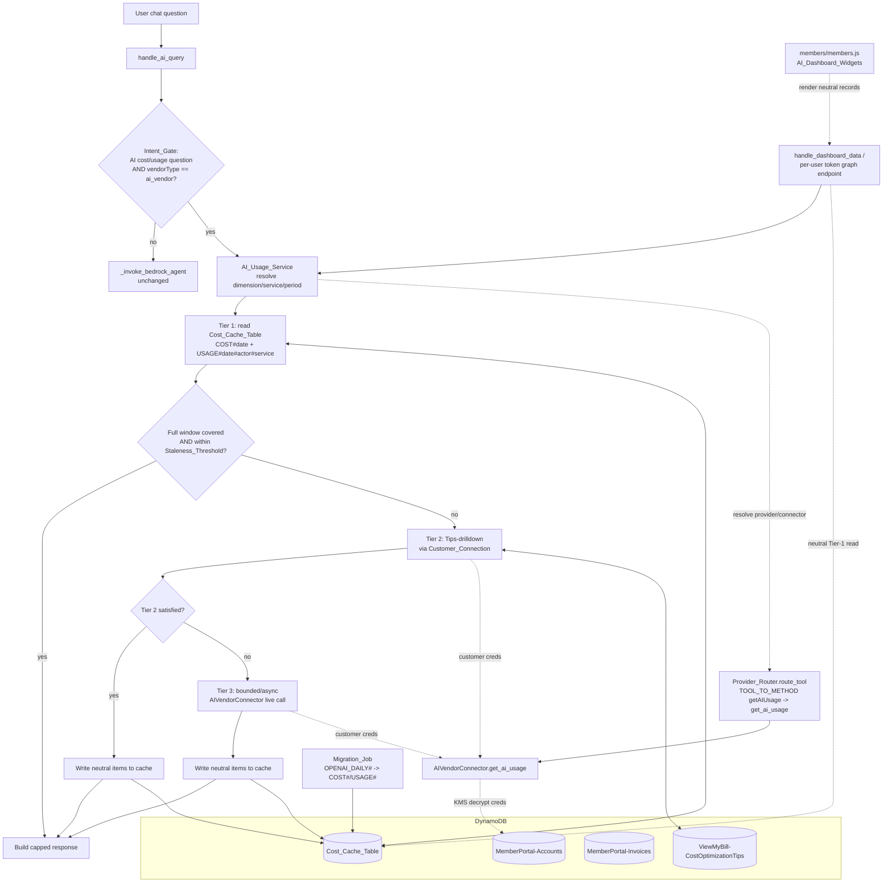

# Design Document

## Overview

This feature makes AI cost/usage answers in the SlashMyBill Bedrock chat **vendor-agnostic**. Today the chat path is OpenAI-specific in two places: the cache uses `OPENAI_DAILY#` sort keys (set in `provider_router._read_cost_cache`/`_write_cost_cache`), and `handle_ai_query` short-circuits OpenAI accounts through `_answer_openai_query`. This design replaces both with a single tool (`getAIUsage`), a vendor-neutral cache schema (`COST#{date}`, `USAGE#{date}#{actor}#{service}`), and a three-tier resolution strategy:

1. **Tier 1** — read cached rollups from `Cost_Cache_Table`.
2. **Tier 2** — per-service drilldown over the `ViewMyBill-CostOptimizationTips` table (Tips_Table), executed through the **customer's own connection**, with results written back to cache.
3. **Tier 3** — a bounded/asynchronous live vendor API call (`AIVendorConnector`) as a last resort.

All AI cost data is read from the **customer connection only** — never platform-owned AI spend — and every resolution targets exactly **one account**. Existing `OPENAI_DAILY#` data is migrated to the neutral schema by an idempotent backfill job.

The same cutover brings the **member-portal AI dashboard data paths** into scope. The dashboard renders an AI cost summary, a per-model cost breakdown, and a per-user token consumption graph by reading the same `Cost_Cache_Table`. Today those paths (`handle_dashboard_data` and the OpenAI dashboard data path in `member-handler/lambda_function.py`, the cache-refresh routine `_refresh_cost_cache_for_account`, and the per-user token graph endpoint) read and write `OPENAI_DAILY#` records, and `members/members.js` renders from that shape. After cutover they read the vendor-neutral `COST#`/`USAGE#` keys, resolve the connector through `Provider_Router` by `cloudProvider`, and reuse the AI_Usage_Service three-tier resolver (with neutral write-back) when cache data is missing or stale — so the dashboard keeps working and stays customer-connection-only and single-account.

### Goals

- One tool, one resolution flow for every AI vendor (OpenAI today, Anthropic and future vendors next).
- Cache-first, customer-only, single-account guarantees enforced structurally.
- No behavioral regression for AWS/Azure/GCP accounts — only the AI-vendor path changes.

### Non-Goals

- Changing the AWS/Azure/GCP resolution path (`DAILY#` schema, Cost Explorer flow) — untouched.
- Implementing new vendor APIs beyond OpenAI; the connector keeps the existing per-vendor fan-out in `_fetch_usage_data`.
- Multi-account aggregation for AI usage (explicitly single-account, Req 11.3).

## Architecture

The flow enters at `handle_ai_query` (member-handler), passes an Intent_Gate that detects AI cost/usage questions, and is resolved by the `AI_Usage_Service` (a thin orchestrator over `cache_service.py`, `incremental_fetch_engine.py`, and `provider_invoices.py`). The service dispatches to the customer's connector through `Provider_Router` only when it must reach live data.

A second entrypoint — the **AI_Dashboard_Data_Path** (`handle_dashboard_data` and the per-user token graph endpoint, backed by `_refresh_cost_cache_for_account`) — shares the same neutral cache, the same `Provider_Router` connector resolution, and the same three-tier resolver. It performs a Tier-1 neutral read for its widgets and falls into the AI_Usage_Service resolver (with neutral write-back) when data is missing or stale, instead of reading/writing `OPENAI_DAILY#`. The `members/members.js` AI_Dashboard_Widgets render from the neutral `Cost_Rollup_Item`/`Usage_Detail_Item` shape returned by that path.



### Component responsibilities

| Component | File | Responsibility |
|---|---|---|
| Intent_Gate | `member-handler/lambda_function.py` (`handle_ai_query`) | Classify AI cost/usage questions; route `ai_vendor` accounts to AI_Usage_Service; everything else to `_invoke_bedrock_agent`. Replaces `_answer_openai_query` short-circuit. |
| AI_Usage_Service | `cache_service.py`, `incremental_fetch_engine.py`, `provider_invoices.py` | Orchestrate the three-tier resolution, staleness checks, neutral-schema writes, response capping. |
| Provider_Router | `agent-action/provider_router.py` | Resolve `cloudProvider`, dispatch `getAIUsage` → `get_ai_usage`, cache wiring (neutral keys). |
| AI_Vendor_Connector | `agent-action/connectors/ai_vendor_connector.py` | Implement `get_ai_usage(dimension, service?, period?)`; map raw vendor fields to neutral fields. |
| Knowledge_Action_Group | `agent-action/schemas/knowledge.json` | Define `/get-ai-usage` op. |
| Migration_Job | new `infrastructure/migrate_openai_daily.py` | Backfill `OPENAI_DAILY#` → `COST#`/`USAGE#`. |
| Deploy | `infrastructure/deploy-agent-action-groups.py` | Update action group + instructions, PrepareAgent, alias. |
| AI_Dashboard_Data_Path | `member-handler/lambda_function.py` (`handle_dashboard_data`, OpenAI dashboard data path, per-user token graph endpoint ~lines 13332–13389), `_refresh_cost_cache_for_account` | Read neutral `COST#`/`USAGE#` records for dashboard widgets; resolve connector via `cloudProvider`/Provider_Router; read `Usage_Detail_Item` by actor/service for the per-user token graph; reuse the AI_Usage_Service three-tier resolver + neutral write-back on missing/stale data; write neutral records in `_refresh_cost_cache_for_account`. Customer-connection-only, single-account. Replaces `OPENAI_DAILY#` reads/writes. |
| AI_Dashboard_Widgets | `members/members.js` | Render AI cost summary, per-model cost breakdown, and per-user token consumption graph from neutral `Cost_Rollup_Item`/`Usage_Detail_Item` records. |

## Components and Interfaces

### 1. Vendor-neutral cache schema

The `Cost_Cache_Table` keeps its existing `(pk, sk)` shape. Partition key stays `{memberEmail}#{accountId}`. Two neutral sort-key families are added for the AI-vendor path:

**Cost_Rollup_Item** — daily cost rollup (one per day):

```
pk = "{memberEmail}#{accountId}"
sk = "COST#{date}"                 # date = ISO-8601 YYYY-MM-DD
{
  "pk": "...",
  "sk": "COST#2025-06-01",
  "cost_amount": "12.34",          # total cost for the day
  "currency": "USD",
  "cached_at": "2025-06-02T03:00:00+00:00",
  "ttl": 1730000000
}
```

**Usage_Detail_Item** — per-actor, per-service usage for a day:

```
pk = "{memberEmail}#{accountId}"
sk = "USAGE#{date}#{actor}#{service}"
{
  "pk": "...",
  "sk": "USAGE#2025-06-01#user_abc#gpt-4o",
  "usage_quantity": "150000",      # units (tokens)
  "unit": "tokens",
  "cost_amount": "8.20",
  "actor": "user_abc",
  "service": "gpt-4o",
  "cached_at": "2025-06-02T03:00:00+00:00",
  "ttl": 1730000000
}
```

Both `COST#` and `USAGE#` share a `pk` prefix and a date-ordered `sk`, so a single `Key('pk').eq(pk) & Key('sk').between(...)` query covers a window (the existing `_read_cost_cache` pattern). The AWS path's `DAILY#` keys are untouched.

#### Connector field-mapping table

`AIVendorConnector.get_ai_usage` maps raw vendor fields onto the neutral fields **before** anything is cached (Req 2.5). Where a neutral field has no source, it is set to `null`, not omitted (Req 2.6).

| Neutral field | Source (OpenAI raw) | Notes |
|---|---|---|
| `cost_amount` | `amount.value` (org costs) | float, rounded |
| `usage_quantity` (`units`) | `input_tokens + output_tokens` | "tokens" measure |
| `unit` | constant `"tokens"` | vendor-defined unit label |
| `actor` | `user_id` (usage/completions) | falls back to `project_id`, then API key id |
| `service` | `model` / `line_item` | model or line item |
| `period.start` / `period.end` | `start_time` / `end_time` bucket | ISO-8601 derived |
| `currency` | `amount.currency` | uppercased, default `USD` |

Conceptually: **tokens → units, user_id → actor, model → service**. This is the same direction as `cost_normalizer.normalize_openai`, which already produces `{date, service_name, cost_amount, input_tokens, output_tokens, project_id}` — the neutral writer reuses it.

### 2. `get_ai_usage` on the base connector

Add a vendor-neutral method to `CloudConnector` (replacing the role of `get_ai_vendor_usage` for tool dispatch):

```python
def get_ai_usage(self, account_id: str, member_email: str, params: dict) -> dict:
    """
    Vendor-neutral AI cost/usage retrieval.

    params:
      dimension: "cost" | "units" | "actor"   (required)
      service:   optional str  - scope to one AI service/model
      period:    optional {start, end}         - defaults to last 30 days
    Returns neutral-shaped dict: {dimension, period, currency, rollups[], usage[],
    truncated, providerMetadata}. Raises NotImplementedError if unsupported.
    """
    raise NotImplementedError(
        f"{self.__class__.__name__} does not implement get_ai_usage"
    )
```

`AIVendorConnector` implements it by calling its existing `_fetch_usage_data` / `fetch_per_user_daily_usage` and projecting onto the neutral shape using the field-mapping table. `dimension` selects which projection is emphasized:

- `cost` → daily `Cost_Rollup_Item` list.
- `units` → totals of `usage_quantity` grouped by service.
- `actor` → `Usage_Detail_Item` grouped by actor.

`SUPPORTED_OPERATIONS` adds `"getAIUsage"`. Connectors that do not implement it (AWS/Azure/GCP) inherit the `NotImplementedError`, which `route_tool` already converts to a structured `notSupported` response (Req 1.5).

### 3. Provider_Router wiring

`TOOL_TO_METHOD` registers `getAIUsage` and **removes** the now-superseded `getAIVendorUsage` entry so the map stays at **22 entries** (Req 1.4):

```python
TOOL_TO_METHOD = {
    # ...unchanged entries...
    "getAIUsage": "get_ai_usage",   # replaces "getAIVendorUsage": "get_ai_vendor_usage"
    # ...
}
```

The test in `agent-action/tests/test_provider_router.py::TestToolToMethodMapping::test_tool_count` continues to assert `len(TOOL_TO_METHOD) == 22`, and `test_all_expected_tools_mapped` is updated to expect `getAIUsage`.

Cache wiring uses the neutral prefix. The OpenAI-specific `sk_prefix = "OPENAI_DAILY#"` branch in `_read_cost_cache`/`_write_cost_cache` is replaced by the neutral `COST#` family for `ai_vendor` accounts. The AWS `DAILY#` prefix is unchanged.

### 4. Three-tier resolver

The resolver lives in the AI_Usage_Service. It is **cache-first** (Tier 1 always runs before any live call, Req 11.1) and writes Tier-2/Tier-3 results back into the neutral schema (Req 4.6).

```python
def resolve_ai_usage(member_email, account_id, dimension, service, period):
    window = period or last_30_days()                      # Req 3.6
    tier1 = read_cache(member_email, account_id, window, service)  # COST#/USAGE# (Req 4.1)

    if covers_full_window(tier1, window) and within_staleness(tier1) and not service:
        return build_response(tier1)                       # Req 4.2

    tier2 = tips_drilldown(member_email, account_id, service, window)  # Req 4.3, 6
    if tier2.satisfied:
        write_cache(member_email, account_id, tier2.items)  # Req 4.6
        return build_response(merge(tier1, tier2.items))

    tier3 = bounded_live_call(member_email, account_id, dimension, service, window)  # Req 4.4
    if tier3.items:
        write_cache(member_email, account_id, tier3.items)  # Req 4.6
    return build_response(merge(tier1, tier2.items, tier3.items), live_partial=tier3.partial)
```

#### Staleness and Tier-2 trigger rules (exact)

`Staleness_Threshold` is configurable (env `AI_USAGE_STALENESS_HOURS`, default 48h, matching `CACHE_STALENESS_THRESHOLD_HOURS`). A `Cost_Rollup_Item` is **stale** when `now - cached_at > Staleness_Threshold` (Req 4.5). Tier 2 is triggered when **any** of the following holds:

| # | Trigger condition | Requirement |
|---|---|---|
| T1 | The most recent day in the window has no `COST#{date}` item (missing latest day) | 5.1 |
| T2 | Any day in the window has no `COST#{date}` item (gap) — Tier 2 runs for the gap only | 5.2 |
| T3 | A `service` parameter scopes the request to a specific service (specific-service) | 5.3 |
| T4 | Tier 1 returned no items for the window (empty) | 5.4 |
| T5 | The covering cached records exceed the Staleness_Threshold (stale) | 5.5 |

If none of T1–T5 holds, Tier 1 wins and Tier 2/Tier 3 are skipped (Req 4.2). Tier 3 runs only when Tier 2 cannot satisfy the request (Req 4.4).

### 5. Tips-drilldown executor (Tier 2)

Tier 2 queries the Tips_Table for the per-service drilldown plan and executes it through the **customer's connection**, then normalizes results into `Usage_Detail_Item` records and writes them back to cache (Req 6.1–6.3).

Tips_Table layout: PK `service`, SK `tipId`, with fields `drilldownApis`, `checkConnection`, `drilldownInstructions`, `provider`, `cloud`. `drilldownApis` is a JSON-encoded list of API/CLI calls (e.g. OpenAI `"/v1/organization/usage/completions?group_by=user_id&group_by=model"`).

```python
def tips_drilldown(member_email, account_id, service, window):
    provider = resolve_provider(account_id, member_email)        # ai_vendor connector
    svc_key  = map_service_to_tip_partition(service, provider)   # tips_filter mapping
    tips = query_tips(svc_key, provider)                          # Key('service').eq(svc_key)

    plan = [t for t in tips if t.get('drilldownApis')]
    if not plan:
        return DrilldownResult(satisfied=False)

    creds = load_customer_credentials(member_email, account_id)   # Req 6.2 / 6.4
    if creds is None:
        return error_connection_required()                        # Req 6.4

    raw = run_drilldown_apis(plan, creds)        # via AIVendorConnector.fetch_per_user_daily_usage
    items = normalize_to_usage_detail(raw, window)  # actor/service/units mapping (Req 6.3)
    return DrilldownResult(satisfied=bool(items), items=items)
```

- `checkConnection` calls (e.g. `/v1/models`) verify the key works before the heavier `drilldownApis` run, reusing `AIVendorConnector._make_openai_request`.
- The executor never reads platform credentials — it loads the account's encrypted key from `MemberPortal-Accounts` and decrypts via KMS with `{memberEmail, accountId}` context (the existing `_get_credentials` path).
- If `Customer_Connection` credentials are missing, it returns a structured error pointing to the Configure tab (Req 6.4), matching the existing `PermissionError` guidance text.

### 6. Intent gate in `handle_ai_query`

The current flow special-cases non-AWS accounts and, for OpenAI single accounts, runs `_answer_openai_query` inside a 20s-bounded thread. This is replaced by a vendor-neutral gate:

```python
# inside handle_ai_query, after ownership verification
if is_ai_cost_or_usage_question(ai_question):                 # Req 8.1
    acct = account_ids[0]
    if resolve_vendor_type(member_email, acct) == 'ai_vendor': # Req 8.4
        return resolve_ai_usage_response(                      # vendor-agnostic path (Req 8.2)
            member_email, acct, ai_question, interaction_id)
# otherwise unchanged:
return _invoke_bedrock_agent(ai_question, account_ids[0], member_email, interaction_id)  # Req 8.3
```

- `is_ai_cost_or_usage_question` is a keyword/intent classifier (cost, spend, tokens, usage, per-user, model, etc.). Non-AI-cost questions fall through to `_invoke_bedrock_agent` unchanged (Req 8.3).
- `_answer_openai_query` and the `OPENAI_DAILY#` reads inside `_invoke_bedrock_agent` are removed once cutover completes; the neutral path covers single-account AI vendors only (Req 8.4, 11.3).

### 7. Migration job (`OPENAI_DAILY#` → `COST#`/`USAGE#`)

A standalone, idempotent script (`infrastructure/migrate_openai_daily.py`) backfills existing cache data.

```python
def migrate(table):
    failures = 0
    for item in scan_prefix(table, sk_prefix="OPENAI_DAILY#"):   # Req 9.1
        date = item["sk"].replace("OPENAI_DAILY#", "")
        rollup = {
            "pk": item["pk"], "sk": f"COST#{date}",
            "cost_amount": item.get("cost_amount", "0"),
            "currency": item.get("currency", "USD"),
            "cached_at": item.get("cached_at") or now_iso(),
        }
        if not put_overwrite(table, rollup):                      # Req 9.4 (overwrite by key)
            failures += 1
        for actor, svc, qty, cost in iter_detail(item):           # Req 9.2
            detail = {
                "pk": item["pk"], "sk": f"USAGE#{date}#{actor}#{svc}",
                "usage_quantity": str(qty), "unit": "tokens",
                "cost_amount": str(cost), "actor": actor, "service": svc,
                "cached_at": rollup["cached_at"],
            }
            if not put_overwrite(table, detail):
                failures += 1
    if failures:
        log.error("Migration failed for %d items", failures)      # Req 9.5
        sys.exit(1)
    sys.exit(0)
```

- `put_overwrite` is a plain `PutItem` keyed by `(pk, sk)`, so re-runs overwrite rather than duplicate (Req 9.4).
- Cost amount, currency, and date are preserved exactly (Req 9.3).
- Any write failure increments a counter; a non-zero count logs the failed count and exits non-zero (Req 9.5).
- After cutover, the AI_Usage_Service reads **only** neutral keys; the `OPENAI_DAILY#` read branch is deleted (Req 9.6). The same applies to the AI_Dashboard_Data_Path, which reads only neutral keys post-cutover (Req 9.7). The migration produces `Cost_Rollup_Item` and `Usage_Detail_Item` records sufficient to render the AI_Dashboard_Widgets (cost summary, per-model breakdown, per-user token graph) with no loss of pre-cutover dashboard data (Req 9.8) — per-actor/per-service detail in `OPENAI_DAILY#` items becomes `USAGE#{date}#{actor}#{service}` records that back the per-user graph.

### 7a. AI dashboard data path (shared neutral cache + resolver)

The member-portal dashboard reads the same `Cost_Cache_Table` as the chat path. `handle_dashboard_data`, the OpenAI dashboard data path, the cache-refresh routine `_refresh_cost_cache_for_account`, and the per-user token consumption graph endpoint (`member-handler/lambda_function.py`, ~lines 13332–13389) are migrated off `OPENAI_DAILY#` onto the neutral schema and the shared resolver.

```python
def handle_dashboard_data(member_email, account_id):
    provider = resolve_provider(account_id, member_email)        # cloudProvider/Provider_Router (Req 13.4)
    window   = last_30_days()
    # Tier-1 neutral read for the widgets (Req 13.1, 13.2)
    rollups  = read_cache(member_email, account_id, window, kind="COST#")
    detail   = read_cache(member_email, account_id, window, kind="USAGE#")
    if missing_or_stale(rollups, detail, window):                # Req 13.6
        resolved = resolve_ai_usage(member_email, account_id,    # shared three-tier resolver
                                    dimension="actor", service=None, period=window)
        # resolver writes neutral items back to cache (Req 4.6 / 13.6)
        rollups, detail = resolved.rollups, resolved.usage
    return build_dashboard_payload(rollups, detail)              # neutral shape for members.js (Req 13.7)

def per_user_token_graph(member_email, account_id, window):
    # read Usage_Detail_Item by actor/service (Req 13.5)
    detail = read_cache(member_email, account_id, window, kind="USAGE#")
    return group_tokens_by_actor(detail)

def _refresh_cost_cache_for_account(member_email, account_id, window):
    resolved = resolve_ai_usage(member_email, account_id, dimension="actor",
                                service=None, period=window)
    write_cache(member_email, account_id, resolved.rollups + resolved.usage)  # neutral schema (Req 13.3)
```

Key points:

- **Neutral reads (Req 13.1, 13.2, 13.5):** the cost summary and per-model breakdown read `COST#`/`USAGE#` rollups; the per-user token graph reads `Usage_Detail_Item` records keyed by `actor` and `service`. No `OPENAI_DAILY#` reads remain on this path.
- **Neutral writes (Req 13.3):** `_refresh_cost_cache_for_account` writes `Cost_Rollup_Item`/`Usage_Detail_Item` records via the same `write_cache` used by the resolver, never `OPENAI_DAILY#`.
- **Provider resolution (Req 13.4):** the connector is selected by the account's `cloudProvider` through `Provider_Router`, with no vendor-specific branching — identical to the chat path (Property 1).
- **Shared resolver + write-back (Req 13.6):** when the cache is missing or stale, the dashboard calls the same `resolve_ai_usage` (Tier 1 → Tier 2 → Tier 3) and benefits from the same neutral write-back, so chat and dashboard stay consistent.
- **Guardrails (Req 11.4, 11.5):** the dashboard path retrieves data exclusively from the `Customer_Connection` (never platform-owned AI spend) and resolves exactly one account per request, reusing the cache-first / customer-only / single-account structural guarantees.
- **members.js (Req 13.7):** the AI_Dashboard_Widgets consume the neutral payload shape (`rollups[]`, `usage[]`) returned by `handle_dashboard_data`, so the cost summary, per-model breakdown, and token graph render from neutral records.

### 8. IAM permissions

Expressed in `infrastructure/` deployment definitions and `.github/workflows/deploy.yml` (Req 7.4):

| Permission | Resource | Requirement |
|---|---|---|
| `dynamodb:Query`, `GetItem`, `PutItem`, `BatchWriteItem` on `COST#`/`USAGE#` keys | `Cost_Cache_Table` | 7.1 |
| `dynamodb:Query`, `GetItem` | `ViewMyBill-CostOptimizationTips` (Tips_Table) | 7.2 |
| `dynamodb:Query`, `GetItem` (drilldown source) | `MemberPortal-Invoices` (per-user `DAILY#` token items) | 7.2 (supporting) |
| `kms:Decrypt` scoped to the credential key, with `{memberEmail, accountId}` encryption context | customer credential CMK | 7.3 |

Read+write to the cache covers both neutral key families; KMS decrypt is the minimum needed for Tier-3 live calls.

### 9. Deployment and agent preparation

`deploy-agent-action-groups.py` already updates the `Knowledge` action group from `knowledge.json`, updates instructions, calls `prepare_agent`, then updates the alias. The change is additive:

1. Add the `/get-ai-usage` op to `knowledge.json` (Req 3.1) and update `agent-instructions.txt` to describe `getAIUsage`.
2. `create_or_update_action_group` re-uploads the Knowledge schema (Req 10.1).
3. `update_agent` re-applies instructions (Req 10.2).
4. `prepare_agent` creates a new version (Req 10.3); `update_agent_alias` points the alias at it.
5. Each step is wrapped so a failure logs the failing step and the script exits non-zero (Req 10.4).

#### getAIUsage tool definition (`knowledge.json`)

```json
"/get-ai-usage": {
  "post": {
    "operationId": "getAIUsage",
    "summary": "Get vendor-agnostic AI cost and usage data",
    "parameters": [
      {"name": "accountId",   "in": "query", "required": true,
       "schema": {"type": "string"}},
      {"name": "memberEmail", "in": "query", "required": true,
       "schema": {"type": "string"}},
      {"name": "dimension",   "in": "query", "required": true,
       "schema": {"type": "string", "enum": ["cost", "units", "actor"]}},
      {"name": "service",     "in": "query", "required": false,
       "schema": {"type": "string"}},
      {"name": "period",      "in": "query", "required": false,
       "schema": {"type": "string", "description": "ISO start/end; defaults to last 30 days"}}
    ],
    "responses": {"200": {"description": "AI cost/usage response"}}
  }
}
```

Required `accountId`, `memberEmail`, `dimension` (`cost`/`units`/`actor`); optional `service`, `period` (Req 3.2–3.5). Missing `period` defaults to the most recent 30 days (Req 3.6).

## Data Models

```python
@dataclass
class CostRollupItem:        # sk = COST#{date}
    pk: str                  # {memberEmail}#{accountId}
    date: str                # ISO-8601
    cost_amount: float
    currency: str
    cached_at: str           # ISO-8601

@dataclass
class UsageDetailItem:       # sk = USAGE#{date}#{actor}#{service}
    pk: str
    date: str
    actor: str | None        # null if no source field (Req 2.6)
    service: str | None
    usage_quantity: float | None
    unit: str | None         # "tokens"
    cost_amount: float | None
    cached_at: str

@dataclass
class AIUsageResponse:
    dimension: str           # cost | units | actor
    period: dict             # {start, end}
    currency: str
    rollups: list            # CostRollupItem projection
    usage: list              # UsageDetailItem projection (capped, top-N by cost)
    truncated: bool          # True when capped (Req 12.2)
    providerMetadata: dict   # {provider, source: cache|tips|live, live_partial}
```

## Error Handling

| Condition | Handling | Requirement |
|---|---|---|
| Connector lacks AI usage | `route_tool` returns structured `notSupported` | 1.5 |
| Missing customer credentials at Tier 2 | structured error → "configure connection in Configure tab" | 6.4 |
| Tier 3 needs Admin_Key the account lacks | structured "account-wide usage requires an admin-level key" | 12.1 |
| Tier 3 exceeds latency bound | return best Tier-1/Tier-2 result, mark `live_partial=true` | 12.3, 12.4 |
| Response exceeds max size | truncate to highest-cost entries, set `truncated=true` | 12.2 |
| Migration write failures | log failed count, `sys.exit(1)` | 9.5 |
| Deploy step failure | log failing step, non-zero exit | 10.4 |

### Guardrails (structural)

- **Cache-first:** `resolve_ai_usage` cannot reach Tier 2/Tier 3 without first executing `read_cache` (Tier 1). (Req 11.1)
- **Customer-only:** all data retrieval uses `load_customer_credentials(member_email, account_id)`; no code path reads platform AI spend. (Req 11.2)
- **Single-account:** `getAIUsage`/`resolve_ai_usage` take exactly one `accountId`; the Intent_Gate routes a single AI-vendor account only. (Req 11.3)
- **Dashboard path:** the AI_Dashboard_Data_Path reuses the same customer-only and single-account guarantees — it retrieves data exclusively from the `Customer_Connection` and resolves exactly one account per request. (Req 11.4, 11.5)

### Graceful degradation

- Admin-key gap → honest structured message rather than a partial/incorrect number (Req 12.1).
- Response cap → top-N by cost with `truncated` flag and "additional entries not shown" note (Req 12.2).
- Bounded/async Tier 3 → reuses the existing 20s `ThreadPoolExecutor` bound; on timeout the best cached/Tips result is returned with `live_partial=true` (Req 12.3, 12.4).

## Correctness Properties

*A property is a characteristic or behavior that should hold true across all valid executions of a system — essentially, a formal statement about what the system should do. Properties serve as the bridge between human-readable specifications and machine-verifiable correctness guarantees.*

After prework, several criteria were consolidated to remove redundancy: the cache-first ordering property subsumes 4.1, 4.3, 4.4, and 11.1; the neutral-schema invariant subsumes 2.1–2.4 and 6.3; the provider-selection property covers 1.1 and 1.2 (and the dashboard's connector resolution, 13.4). For the dashboard scope: the dashboard neutral-read property (17) consolidates 9.7, 13.1, 13.2, and the read side of 13.5; the dashboard write/scope property (18) consolidates 13.3, 13.6 write-back, 11.4, and 11.5; 13.6 resolver reuse is covered by Properties 6/8/9/10 applied to the dashboard caller; 9.8 (migration sufficiency for widgets) is covered by extending Property 13's generators to include per-actor/per-service detail; and 13.7 (members.js rendering source) is an example test. Infrastructure (7.x), deploy orchestration (10.x), and fixed structural facts (1.3, 1.4, 3.1–3.5) are validated by example/integration tests in the Testing Strategy rather than properties.

### Property 1: Provider selection is a pure function of cloudProvider

*For any* account record, the connector chosen by the resolver depends only on the stored `cloudProvider` value and never on vendor-specific conditional logic, so any two accounts with the same `cloudProvider` resolve to the same connector type.

**Validates: Requirements 1.1, 1.2**

### Property 2: Unsupported connectors return a structured notSupported response

*For any* provider whose connector does not list `getAIUsage` in `SUPPORTED_OPERATIONS`, routing `getAIUsage` returns a structured response with `notSupported = true` and never raises.

**Validates: Requirements 1.5**

### Property 3: Cached items conform to the neutral schema and key format

*For any* cost rollup or usage-detail record written by the AI_Usage_Service, its sort key matches `COST#{date}` or `USAGE#{date}#{actor}#{service}` respectively, and it carries all required neutral fields (rollup: partition key, cost amount, currency, `cached_at`; detail: usage quantity, unit label, cost amount, actor, service).

**Validates: Requirements 2.1, 2.2, 2.3, 2.4, 6.3**

### Property 4: Vendor fields map onto neutral fields, with nulls for missing sources

*For any* raw vendor response, `get_ai_usage` produces neutral records where tokens map to units, user_id maps to actor, and model maps to service; and any neutral field lacking a corresponding source field is present with a null value rather than omitted.

**Validates: Requirements 2.5, 2.6**

### Property 5: Default resolution window is the most recent 30 days

*For any* invocation without a `period`, the resolved window spans exactly the most recent 30 days relative to the reference date.

**Validates: Requirements 3.6**

### Property 6: Resolution is cache-first and tiers run in strict order

*For any* request, Tier 1 (cache read) executes before any Tier 2 (Tips drilldown) or Tier 3 (live vendor call); Tier 2 executes before Tier 3; and no live vendor call occurs before a cache read.

**Validates: Requirements 4.1, 4.3, 4.4, 11.1**

### Property 7: Fresh full-coverage cache short-circuits deeper tiers

*For any* request whose window is fully covered by cached rollups within the Staleness_Threshold and that has no `service` scope, the result is built from the cache alone and neither Tier 2 nor Tier 3 is invoked.

**Validates: Requirements 4.2**

### Property 8: Staleness is an exact age comparison

*For any* cost rollup item, it is treated as stale if and only if `now - cached_at` exceeds the Staleness_Threshold.

**Validates: Requirements 4.5**

### Property 9: Tier-2 trigger predicate is exactly the union of the five conditions

*For any* window and cache state, Tier 2 is triggered if and only if at least one of these holds: the most recent day has no rollup, any day has a gap, a specific `service` is requested, Tier 1 returned no items, or the covering records are stale.

**Validates: Requirements 5.1, 5.2, 5.3, 5.4, 5.5**

### Property 10: Tier-2/Tier-3 results are written back under neutral keys

*For any* resolution that reaches Tier 2 or Tier 3 and retrieves data, the retrieved records are written to the cache under `COST#`/`USAGE#` keys equivalent to the returned result.

**Validates: Requirements 4.6**

### Property 11: All AI usage retrieval uses customer credentials for exactly one account

*For any* resolution, every data-retrieval path loads credentials scoped to the single requested `(memberEmail, accountId)` pair, never reads platform-owned AI spend, and resolves exactly one account per invocation.

**Validates: Requirements 6.1, 6.2, 11.2, 11.3, 8.4**

### Property 12: Intent gate routes AI-cost questions to the neutral path and others unchanged

*For any* question, when it is classified as an AI cost/usage question and the account is an `ai_vendor`, the request is routed to the vendor-agnostic path; otherwise it is routed to `_invoke_bedrock_agent` unchanged.

**Validates: Requirements 8.1, 8.3**

### Property 13: Migration preserves data and is idempotent

*For any* set of `OPENAI_DAILY#` items, migration writes neutral `COST#{date}` (and `USAGE#` where detail exists) records preserving the original cost amount, currency, and date; and running the migration twice yields the same cache state as running it once (no duplicate records).

**Validates: Requirements 9.1, 9.2, 9.3, 9.4**

### Property 14: Post-cutover reads use only neutral keys

*For any* AI usage read after cutover, the cache is queried using only `COST#`/`USAGE#` sort-key prefixes and never `OPENAI_DAILY#`.

**Validates: Requirements 9.6**

### Property 15: Responses are capped to the highest-cost entries

*For any* result set, the built response contains at most the configured maximum number of entries, those entries are the highest-cost ones in descending cost order, and whenever entries are dropped the response sets `truncated = true`.

**Validates: Requirements 12.2**

### Property 16: Tier 3 is bounded and degrades to the best lower-tier result

*For any* Tier-3 call that does not complete within the configured latency bound, the service returns within the bound using the best available Tier-1/Tier-2 result and marks the response as live-partial.

**Validates: Requirements 12.3, 12.4**

### Property 17: Dashboard data path reads only neutral keys

*For any* AI dashboard read — the cost summary, the per-model breakdown, and the per-user token consumption graph — the `Cost_Cache_Table` is queried using only `COST#`/`USAGE#` sort-key prefixes (the per-user graph reading `Usage_Detail_Item` records by actor and service) and never the `OPENAI_DAILY#` prefix.

**Validates: Requirements 9.7, 13.1, 13.2, 13.5**

### Property 18: Dashboard refresh writes neutral schema and stays customer-scoped single-account

*For any* dashboard cache refresh, every item written by `_refresh_cost_cache_for_account` matches the neutral `COST#{date}`/`USAGE#{date}#{actor}#{service}` schema (never `OPENAI_DAILY#`); and for any dashboard resolution, data retrieval loads credentials scoped to the single requested `(memberEmail, accountId)` pair, never reads platform-owned AI spend, and resolves exactly one account per request.

**Validates: Requirements 13.3, 13.6, 11.4, 11.5**

## Testing Strategy

### Dual approach

- **Property-based tests** (minimum 100 iterations each) cover the universal invariants in Properties 1–18. Generators produce random accounts (`cloudProvider`, `vendorType`), random windows and cache states (fresh/stale/gapped/empty), random raw OpenAI buckets (including missing fields and non-ASCII actors/models), random oversized result sets, and — for the dashboard path (Properties 17–18) — random neutral/legacy cache mixes and refresh inputs to assert dashboard reads issue only `COST#`/`USAGE#` key conditions and `_refresh_cost_cache_for_account` writes only neutral items.
- **Example-based unit tests** cover fixed facts and specific cases:
  - `TOOL_TO_METHOD['getAIUsage'] == 'get_ai_usage'` and `len(TOOL_TO_METHOD) == 22` (Req 1.3, 1.4).
  - `knowledge.json` declares `/get-ai-usage`, `operationId getAIUsage`, required `accountId`/`memberEmail`/`dimension` with enum `[cost, units, actor]`, optional `service`/`period` (Req 3.1–3.5).
  - `_answer_openai_query` is not invoked for the `ai_vendor` neutral path (Req 8.2).
  - Missing customer credentials at Tier 2 → structured error referencing the Configure tab (Req 6.4).
  - Admin-key gap at Tier 3 → structured "admin-level key" message (Req 12.1).
  - Migration write failure → non-zero exit and logged failure count (Req 9.5).
  - `handle_dashboard_data` payload exposes the neutral cost-summary, per-model, and per-user token-graph fields consumed by `members/members.js` (Req 13.7).
  - Migration of `OPENAI_DAILY#` items containing per-actor/per-service detail produces `USAGE#` detail records sufficient to render the AI_Dashboard_Widgets without pre-cutover data loss (Req 9.8) — folded into the extended Property 13 generators and asserted as an example.

### Edge cases (driven through generators)

- Empty/zero-cost days, gaps at the window boundary, `cached_at` exactly at the threshold, missing `user_id`/`model`/token fields, and very large per-user fan-outs (cap behavior).

### Integration / smoke tests (not PBT)

- Deploy orchestration (Req 10.1–10.4): mock the Bedrock client, assert the order action-group-update → instructions-update → `prepare_agent` → alias-update and non-zero exit on a forced step failure (1–2 examples).
- IAM (Req 7.1–7.4): assert the deployment policy documents include cache read+write on `COST#`/`USAGE#`, Tips_Table read, `MemberPortal-Invoices` read, and KMS decrypt scoped to the credential key with `{memberEmail, accountId}` context.

### Property test configuration

- Each property test runs ≥100 randomized iterations.
- DynamoDB, KMS, and the OpenAI HTTP layer are mocked so property runs are fast and cost-free; live Bedrock/vendor calls are reserved for the 1–2 integration examples.
- Each property test is tagged: **Feature: vendor-agnostic-ai-usage, Property {number}: {property_text}**.
