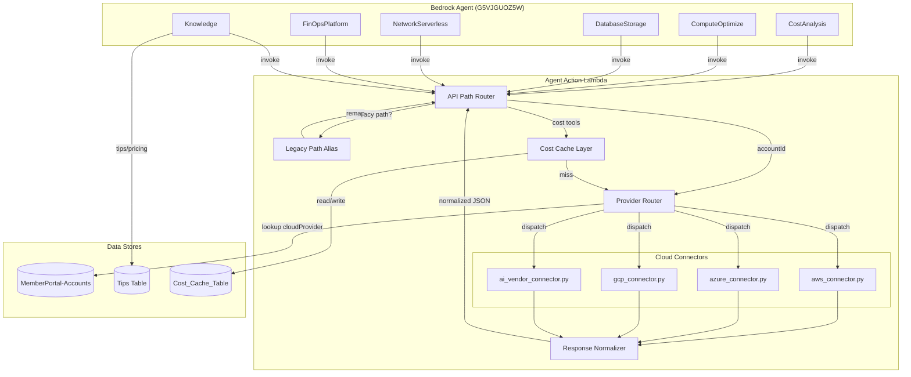

# Design Document: Vendor-Neutral Agent Tooling

## Overview

This design transforms the SlashMyBill Bedrock Agent from AWS-specific tooling (getEC2Instances, getS3Buckets, etc.) to a vendor-neutral architecture where tool names describe WHAT data is needed, not WHERE it comes from. The system routes to the correct provider API at runtime based on the account's `cloudProvider` field in the MemberPortal-Accounts DynamoDB table.

The redesign organizes ~22 tools into 6 action groups, introduces a Provider Router + Cloud Connector pattern, normalizes all response schemas, enriches the Tips Table with provider routing metadata, and maintains full backward compatibility with the existing 11 AWS-specific tools during migration.

### Key Design Decisions

1. **Single Lambda, multiple connectors**: The existing `SlashMyBill-AgentAction` Lambda remains the sole execution target. Connectors are Python modules within the same deployment package — no new Lambdas needed.
2. **Account lookup drives routing**: The `accountId` parameter in every tool call triggers a DynamoDB lookup to resolve the `cloudProvider`, then the Provider Router dispatches to the correct connector.
3. **Backward compatibility via path aliasing**: Legacy `/get-ec2-instances` paths map to vendor-neutral handlers internally, so existing agent versions continue working.
4. **Tips Table as dynamic config**: Provider-specific API endpoints and parameter schemas live in the Tips Table `providerRouting` attribute, reducing hardcoded logic.
5. **Normalized responses**: All connectors return the same schema shape per tool category, with a `providerMetadata` escape hatch for provider-specific data.

## Architecture



### Request Flow

1. Bedrock Agent invokes a tool (e.g., `getComputeInstances`) with `accountId` and `memberEmail`
2. Lambda `lambda_handler` routes based on `apiPath`
3. Legacy paths (e.g., `/get-ec2-instances`) are aliased to their neutral handler
4. Provider Router queries MemberPortal-Accounts for `cloudProvider`
5. Router dispatches to the matching Cloud Connector (aws/azure/gcp/ai_vendor)
6. Connector executes provider-specific API calls (STS AssumeRole for AWS, OAuth for Azure, etc.)
7. Response Normalizer transforms connector output into the vendor-neutral schema
8. Lambda returns the Bedrock Agent response envelope

## Components and Interfaces

### 1. OpenAPI Schema Files (6 action groups)

Each action group has its own OpenAPI 3.0 schema file used to register the group with Bedrock Agent.

| Action Group | Schema File | Tools |
|---|---|---|
| CostAnalysis | `agent-action/schemas/cost-analysis.json` | getCostBreakdown, getMonthlyTrend, getCostForecast, getCostAnomalies |
| ComputeOptimize | `agent-action/schemas/compute-optimize.json` | getComputeInstances, getRightsizingRecommendations, getSpotCandidates, getLicensingAnalysis |
| DatabaseStorage | `agent-action/schemas/database-storage.json` | getDatabaseInstances, getStorageVolumes, getObjectStorage |
| NetworkServerless | `agent-action/schemas/network-serverless.json` | getNetworkResources, getServerlessFunctions, getContainerClusters |
| FinOpsPlatform | `agent-action/schemas/finops-platform.json` | getBudgets, getFinOpsSettings, getCommitmentCoverage, getTagCompliance, getBusinessMetrics |
| Knowledge | `agent-action/schemas/knowledge.json` | getOptimizationTips, getPricingData, getAIVendorUsage |

### 2. Provider Router (`agent-action/provider_router.py`)

```python
def resolve_provider(account_id: str, member_email: str) -> str:
    """Lookup cloudProvider from MemberPortal-Accounts. Returns 'aws'|'azure'|'gcp'|'openai'."""
    
def route_tool(tool_name: str, account_id: str, member_email: str, params: dict) -> dict:
    """Resolve provider, dispatch to correct connector, normalize response."""
```

### 3. Cloud Connectors

Each connector implements a standard interface:

```python
# Base interface (informal — Python duck typing)
class CloudConnector:
    def get_compute_instances(self, account_id, member_email, params) -> dict: ...
    def get_cost_breakdown(self, account_id, member_email, params) -> dict: ...
    def get_database_instances(self, account_id, member_email, params) -> dict: ...
    def get_storage_volumes(self, account_id, member_email, params) -> dict: ...
    def get_object_storage(self, account_id, member_email, params) -> dict: ...
    def get_network_resources(self, account_id, member_email, params) -> dict: ...
    def get_serverless_functions(self, account_id, member_email, params) -> dict: ...
    def get_budgets(self, account_id, member_email, params) -> dict: ...
    # ... etc
```

| Connector | File | Auth Method |
|---|---|---|
| AWS | `agent-action/aws_connector.py` | STS AssumeRole (existing pattern) |
| Azure | `agent-action/azure_connector.py` | OAuth2 Client Credentials (from encrypted `credentials` map) |
| GCP | `agent-action/gcp_connector.py` | Service Account JSON key (from encrypted `credentials` map) |
| AI Vendor | `agent-action/ai_vendor_connector.py` | API Key (from encrypted `credentials` map) |

### 4. Response Normalizer (`agent-action/response_normalizer.py`)

```python
def normalize_compute_response(raw: dict, provider: str) -> dict:
    """Transform provider-specific compute data to normalized schema."""

def normalize_cost_response(raw: dict, provider: str) -> dict:
    """Transform provider-specific cost data to normalized schema."""

def normalize_database_response(raw: dict, provider: str) -> dict:
    """Transform provider-specific database data to normalized schema."""
```

### 5. Legacy Path Mapper (`agent-action/legacy_mapper.py`)

```python
LEGACY_TO_NEUTRAL = {
    '/get-cost-data': 'getCostBreakdown',
    '/get-monthly-comparison': 'getMonthlyTrend',
    '/get-ec2-instances': 'getComputeInstances',
    '/get-rds-instances': 'getDatabaseInstances',
    '/get-lambda-functions': 'getServerlessFunctions',
    '/get-s3-buckets': 'getObjectStorage',
    '/get-ebs-volumes': 'getStorageVolumes',
    '/get-network-resources': 'getNetworkResources',
    '/get-budgets': 'getBudgets',
    '/get-finops-settings': 'getFinOpsSettings',
    '/get-aws-pricing': 'getPricingData',
}
```

### 6. Deployment Script (`infrastructure/deploy-agent-action-groups.py`)

Automates creating/updating all 6 action groups on Bedrock Agent G5VJGUOZ5W:
1. For each action group schema file, create or update the action group
2. Update agent instructions to vendor-neutral version
3. Call `PrepareAgent` to create new prepared version
4. Report results

### 7. Cost Cache Integration

The existing `Cost_Cache_Table` pattern is preserved. The cache key format remains `{memberEmail}#{accountId}` with sort key `DAILY#{date}`. The cost tools (getCostBreakdown, getMonthlyTrend) check cache first, fall back to the appropriate connector on miss.

## Data Models

### Normalized Response Schemas

#### Compute Instance Response
```json
{
  "instances": [
    {
      "instanceId": "string",
      "instanceType": "string",
      "state": "running|stopped|terminated",
      "name": "string",
      "region": "string",
      "launchTime": "ISO 8601 string",
      "providerMetadata": {
        "provider": "aws|azure|gcp",
        "nativeId": "string",
        "additionalFields": {}
      }
    }
  ],
  "count": 0
}
```

#### Cost Breakdown Response
```json
{
  "totalCost": 0.00,
  "currency": "USD",
  "period": "string",
  "serviceBreakdown": [
    {
      "serviceName": "string",
      "cost": 0.00
    }
  ],
  "dailyCosts": [
    {"date": "YYYY-MM-DD", "cost": 0.00}
  ],
  "providerMetadata": {
    "provider": "aws|azure|gcp|openai",
    "source": "cache|live"
  }
}
```

#### Database Instance Response
```json
{
  "instances": [
    {
      "instanceId": "string",
      "instanceType": "string",
      "engine": "string",
      "status": "string",
      "storageSizeGB": 0,
      "multiAZ": false,
      "providerMetadata": {
        "provider": "aws|azure|gcp",
        "nativeId": "string"
      }
    }
  ],
  "count": 0
}
```

#### Storage Volume Response
```json
{
  "volumes": [
    {
      "volumeId": "string",
      "volumeType": "string",
      "sizeGB": 0,
      "state": "string",
      "attached": true,
      "providerMetadata": {
        "provider": "aws|azure|gcp",
        "nativeId": "string"
      }
    }
  ],
  "count": 0
}
```

#### Unsupported Operation Response
```json
{
  "notSupported": true,
  "message": "getComputeInstances is not applicable for OpenAI accounts. Available operations: getCostBreakdown, getAIVendorUsage",
  "availableOperations": ["getCostBreakdown", "getAIVendorUsage"]
}
```

#### Error Response
```json
{
  "error": "string",
  "authError": false,
  "guidance": "Check your account connection in the Configure tab"
}
```

### Tips Table Extended Schema

```json
{
  "service": "COMPUTE",
  "tipId": "compute-rightsizing-001",
  "title": "Right-size underutilized instances",
  "description": "...",
  "providerRouting": {
    "aws": {
      "apiEndpoint": "ec2:DescribeInstances + cloudwatch:GetMetricStatistics",
      "parameterSchema": {"metricsWindow": "14d", "cpuThreshold": 30},
      "responseFormat": "ec2_instance_list",
      "costThresholds": {"minSavingsUSD": 10}
    },
    "azure": {
      "apiEndpoint": "Microsoft.Compute/virtualMachines + Microsoft.Monitor/metrics",
      "parameterSchema": {"metricsWindow": "14d", "cpuThreshold": 30},
      "responseFormat": "azure_vm_list",
      "costThresholds": {"minSavingsUSD": 10}
    },
    "gcp": {
      "apiEndpoint": "compute.instances.list + monitoring.timeSeries.list",
      "parameterSchema": {"metricsWindow": "14d", "cpuThreshold": 30},
      "responseFormat": "gce_instance_list",
      "costThresholds": {"minSavingsUSD": 10}
    }
  }
}
```

### MemberPortal-Accounts Table (existing, relevant fields)

| Field | Type | Description |
|---|---|---|
| memberEmail | String (PK) | Member's email |
| accountId | String (SK) | AWS 12-digit / Azure Sub UUID / GCP Project ID |
| cloudProvider | String | "aws" / "azure" / "gcp" / "openai" |
| credentials | Map (encrypted) | Provider-specific auth credentials |
| connectionStatus | String | "pending" / "connected" / "failed" |

### Agent Instructions (vendor-neutral version)

The updated agent instructions will:
- Reference only vendor-neutral tool names (getCostBreakdown, getComputeInstances, etc.)
- Reference SlashMyBill tabs (Chat, Configure, Observe, Act) instead of vendor consoles
- Direct the agent to use Knowledge tools (getOptimizationTips, getPricingData) for pricing/optimization data
- Instruct the agent to always pass `accountId` so the Provider Router can determine the correct provider
- Remove all hardcoded pricing tables and provider-specific formulas

## Correctness Properties

*A property is a characteristic or behavior that should hold true across all valid executions of a system — essentially, a formal statement about what the system should do. Properties serve as the bridge between human-readable specifications and machine-verifiable correctness guarantees.*

### Property 1: Provider routing dispatches to the correct connector

*For any* valid (accountId, memberEmail) pair where the MemberPortal-Accounts table contains a `cloudProvider` value in {"aws", "azure", "gcp", "openai"}, the Provider Router SHALL dispatch the tool invocation to the connector matching that cloudProvider value.

**Validates: Requirements 2.1, 2.2, 2.3, 2.4, 2.5**

### Property 2: Invalid or missing provider defaults to AWS

*For any* `cloudProvider` value that is not in the supported set {"aws", "azure", "gcp", "openai"} (including empty string, null, or arbitrary strings), the Provider Router SHALL default to the AWS Cloud Connector.

**Validates: Requirements 2.6**

### Property 3: Response normalization produces all required schema fields

*For any* raw provider response passed through the Response Normalizer, the output SHALL contain all required fields for that response type (e.g., instanceId, instanceType, state, name, region, providerMetadata for compute). Fields not supported by the source provider SHALL be present with a null value rather than omitted.

**Validates: Requirements 3.7, 4.1, 4.2, 4.3, 4.4, 4.6**

### Property 4: Provider metadata preserves unmapped source data

*For any* raw provider response containing fields that do not map to the normalized schema, the Response Normalizer SHALL include those unmapped fields in the `providerMetadata` object, preserving full fidelity of the source data.

**Validates: Requirements 4.5**

### Property 5: Legacy and vendor-neutral paths produce equivalent results

*For any* tool that has both a legacy apiPath (e.g., "/get-ec2-instances") and a vendor-neutral apiPath (e.g., "/get-compute-instances"), invoking either path with identical parameters SHALL route to the same handler and produce equivalent responses.

**Validates: Requirements 7.1, 7.2**

### Property 6: Unsupported operations return structured notSupported response

*For any* (tool, accountType) combination where the tool is not applicable for that account type, the Agent_Action_Lambda SHALL return a response with `notSupported: true`, a descriptive `message`, and an `availableOperations` array listing valid tools for that account type.

**Validates: Requirements 9.3, 12.1**

### Property 7: Cost cache behavior correctness

*For any* cost tool invocation (getCostBreakdown, getMonthlyTrend), if cached data exists in the Cost_Cache_Table with a timestamp within the 24-hour staleness threshold, the response SHALL come from cache without invoking the Cloud Connector. If cached data is stale or missing, the Cloud Connector SHALL be invoked and the result written to cache.

**Validates: Requirements 11.2, 11.3**

### Property 8: Authentication errors produce structured error response

*For any* Cloud Connector invocation that results in an authentication or permissions error, the Agent_Action_Lambda SHALL return a response with `authError: true` and a `guidance` field directing the user to check their account connection in the Configure tab.

**Validates: Requirements 12.2**

## Error Handling

### Error Categories and Responses

| Error Type | Detection | Response | HTTP Status |
|---|---|---|---|
| Account not found | DynamoDB GetItem returns no item | `{"error": "Account not connected", "guidance": "Add this account via Configure tab"}` | 200 (Bedrock envelope) |
| Unsupported operation | Tool not in connector's supported set | `{"notSupported": true, "message": "...", "availableOperations": [...]}` | 200 |
| Auth/permission error | Connector raises auth exception | `{"error": "...", "authError": true, "guidance": "Check connection in Configure tab"}` | 200 |
| Provider API failure | Connector raises non-auth exception | `{"error": "Provider API error: ...", "retryable": true}` | 200 |
| Cache read failure | DynamoDB exception on cache query | Silent fallback to live API + warning log | N/A |
| Invalid provider | cloudProvider not in supported set | Default to AWS connector (backward compat) | N/A |
| Missing parameters | Required params not in event | `{"error": "Missing required parameter: accountId"}` | 200 |

### Error Design Principles

1. **Never break the Bedrock Agent envelope**: All responses use HTTP 200 with the standard `messageVersion`/`response` wrapper. Errors are communicated in the response body JSON.
2. **Graceful degradation**: Cache failures fall back silently. Unknown providers default to AWS. Missing optional params use sensible defaults.
3. **Actionable guidance**: Every error response includes a `guidance` field directing the user to the correct SlashMyBill tab/action to fix the issue.
4. **No sensitive data in errors**: Provider-specific error details are logged server-side but not returned to the agent (which would surface them to the user).

### Retry Strategy

- Provider API rate limits: Exponential backoff (1s, 2s, 4s) with max 3 retries
- DynamoDB throttling: SDK automatic retry with backoff
- STS AssumeRole failures: No retry (likely a configuration issue)

## Testing Strategy

### Unit Tests (pytest)

Unit tests verify specific examples and edge cases:

- **Schema validation**: Each of the 6 OpenAPI schema files is valid JSON and contains expected operationIds
- **Legacy mapper**: All 11 legacy paths map to correct neutral names
- **Agent instructions**: No banned provider terms, references correct tool names
- **Parameter consistency**: All account-scoped tools have accountId/memberEmail params
- **Unsupported tool matrix**: Specific (tool, provider) pairs return expected notSupported responses
- **Error formatting**: Auth errors, not-found errors produce correct response structure

### Property-Based Tests (Hypothesis)

Property tests verify universal correctness across randomized inputs. Each property test runs a minimum of 100 iterations.

- **Property 1** — Provider routing: Generate random (accountId, provider) pairs, mock DynamoDB, verify correct connector dispatched
  - Tag: `Feature: vendor-neutral-agent-tooling, Property 1: Provider routing dispatches to the correct connector`
- **Property 2** — Default to AWS: Generate random invalid provider strings, verify AWS connector is selected
  - Tag: `Feature: vendor-neutral-agent-tooling, Property 2: Invalid or missing provider defaults to AWS`
- **Property 3** — Schema completeness: Generate random raw responses per provider, normalize, verify all required fields present with correct types (null for unsupported)
  - Tag: `Feature: vendor-neutral-agent-tooling, Property 3: Response normalization produces all required schema fields`
- **Property 4** — Metadata preservation: Generate raw responses with extra fields, normalize, verify unmapped fields in providerMetadata
  - Tag: `Feature: vendor-neutral-agent-tooling, Property 4: Provider metadata preserves unmapped source data`
- **Property 5** — Path equivalence: For all legacy/neutral path pairs with random params, verify equivalent routing
  - Tag: `Feature: vendor-neutral-agent-tooling, Property 5: Legacy and vendor-neutral paths produce equivalent results`
- **Property 6** — NotSupported response: Generate random unsupported (tool, provider) pairs, verify response structure
  - Tag: `Feature: vendor-neutral-agent-tooling, Property 6: Unsupported operations return structured notSupported response`
- **Property 7** — Cache behavior: Generate random cost requests with varying cache states, verify cache-hit/cache-miss behavior
  - Tag: `Feature: vendor-neutral-agent-tooling, Property 7: Cost cache behavior correctness`
- **Property 8** — Auth error structure: Simulate random auth errors per provider, verify response format
  - Tag: `Feature: vendor-neutral-agent-tooling, Property 8: Authentication errors produce structured error response`

### Integration Tests

Integration tests verify external service interactions with mocked AWS/Azure/GCP APIs:

- Deployment script creates/updates 6 action groups on mocked Bedrock API
- AWS connector calls correct boto3 APIs with assumed-role credentials
- Azure connector calls correct Azure REST endpoints with OAuth token
- Tips Table providerRouting lookup returns correct entry per provider
- Cost Cache Table read/write cycle works end-to-end

### Test Configuration

- **Framework**: pytest + hypothesis
- **Hypothesis settings**: `max_examples=100`, `deadline=None` (for mocked I/O)
- **Mocking**: `unittest.mock` for DynamoDB, `moto` for AWS services, `responses` for HTTP APIs
- **CI**: Tests run on every PR; property tests run nightly with `max_examples=500`

