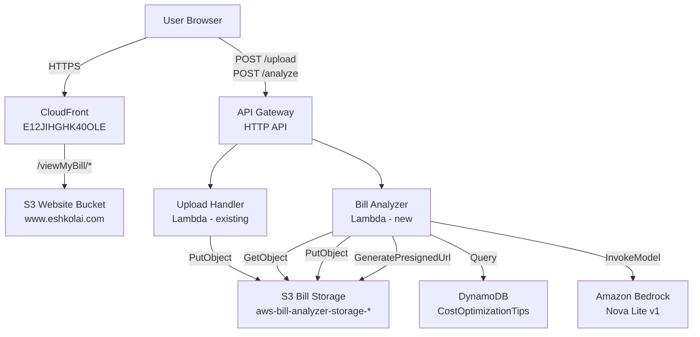
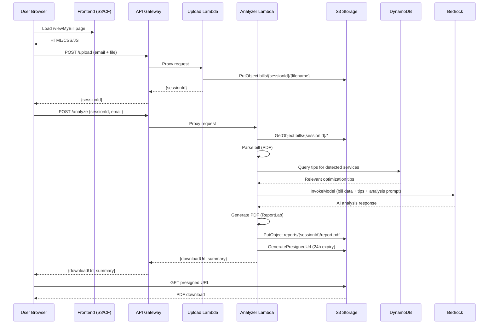

# Design Document: ViewMyBill

## Overview

ViewMyBill is a self-service AWS bill analysis tool served from `https://eshkolai.com/viewMyBill`. Users provide their email, upload an AWS invoice PDF, and receive an AI-generated PDF report with bill summaries, charge explanations, and cost-saving recommendations.

The feature reuses the existing S3 bill storage bucket (`aws-bill-analyzer-storage-991105135552`) and Amazon Bedrock Nova Lite integration. It adds a new combined Lambda function for bill analysis + PDF generation, a new API Gateway endpoint, and a static frontend page deployed to the existing S3 website bucket.

### Key Design Decisions

1. **PDF-only input** — AWS invoices are delivered as PDF files (e.g., EUINIL26-139120.pdf). No CSV support needed since users download invoices directly from AWS Billing Console as PDFs.
2. **Single Lambda function** for the entire processing pipeline (parse → RAG lookup → analyze → generate PDF → return URL). This avoids orchestration complexity (Step Functions) since the entire flow fits within Lambda's 15-minute timeout and the processing is sequential.
3. **DynamoDB-based RAG** — Cost optimization tips are stored in DynamoDB keyed by AWS service name. This is much cheaper than OpenSearch (~$0.25/million reads vs $50+/month for OpenSearch). Simple key-based lookups are sufficient since tips are categorized by service.
4. **pdfplumber** for PDF text extraction inside Lambda. It's a pure-Python library that works in Lambda without native dependencies and handles AWS invoice table structures well.
5. **ReportLab + PyPDF2** for PDF generation. The output PDF preserves the original invoice pages and appends analysis pages, giving users a familiar format with added insights.
6. **Reuse existing S3 bucket** (`aws-bill-analyzer-storage-991105135552`) with a new `reports/` prefix for generated PDFs, keeping the existing 24-hour lifecycle policy.
7. **New API Gateway** (HTTP API) dedicated to ViewMyBill, keeping it decoupled from any existing API Gateway for the bill analyzer Q&A feature.

## Architecture

### System Context Diagram



### Data Flow



### Infrastructure Integration

The feature integrates with the existing eshkolai.com infrastructure:

- **CloudFront** (E12JIHGHK40OLE): Already serves `www.eshkolai.com` from S3. The `/viewMyBill/` path is served from the same S3 bucket under the `viewMyBill/` prefix. No CloudFront behavior changes needed since the existing S3 origin already serves all paths.
- **S3 Website Bucket** (`www.eshkolai.com`): Frontend files deployed to `viewMyBill/` subfolder.
- **S3 Bill Storage** (`aws-bill-analyzer-storage-991105135552`): Reused for uploads (`bills/` prefix) and reports (`reports/` prefix). The existing lifecycle rule deletes `bills/` after 1 day. A new lifecycle rule will delete `reports/` after 1 day.
- **GitHub Actions** (`deploy.yml`): Updated to sync the `viewMyBill/` subfolder to S3.
- **API Gateway**: New HTTP API with CORS configured for `https://eshkolai.com` and `https://www.eshkolai.com`.

## Components and Interfaces

### 1. Frontend (`viewMyBill/index.html`)

A single-page application served from `/viewMyBill/` on the existing S3 website bucket.

**Files:**
- `viewMyBill/index.html` — page structure
- `viewMyBill/viewMyBill.css` — styles (consistent with main site branding)
- `viewMyBill/viewMyBill.js` — client-side logic

**Responsibilities:**
- Email input with validation (HTML5 `type="email"` + regex)
- File picker restricted to `.pdf` only
- Client-side file size check (< 10 MB)
- Display selected filename
- "Revise" button with disabled state management
- Loading indicator during processing
- Display download link or error messages
- Privacy notice text

**API Calls:**
1. `POST {API_GATEWAY_URL}/upload` — multipart form with email + file
2. `POST {API_GATEWAY_URL}/analyze` — JSON with `{sessionId, email}`

### 2. Upload Handler Lambda (existing, minor update)

The existing `upload-handler/lambda_function.py` is reused with one change: the email address from the request is stored in S3 object metadata alongside the existing session metadata.

**Interface (unchanged):**
- Input: API Gateway proxy event with multipart form data
- Output: `{sessionId, message, fileName, timestamp}`

### 3. Bill Analyzer Lambda (new: `bill-analyzer/lambda_function.py`)

A new Lambda function that orchestrates the full analysis pipeline.

**Interface:**
```
POST /analyze
Request:  { "sessionId": string, "email": string }
Response: { "downloadUrl": string, "summary": string, "sessionId": string }
Error:    { "error": string, "message": string, "code": number, "retryable": boolean }
```

**Internal Pipeline:**
1. Retrieve bill PDF from S3 using sessionId
2. Extract text and tables from PDF using `pdfplumber`
3. Parse extracted content to identify services, costs, dates (AWS invoice structure)
4. Query DynamoDB for optimization tips matching detected services
5. Construct analysis prompt for Bedrock with parsed bill data + retrieved tips
6. Invoke Bedrock Nova Lite (`amazon.nova-lite-v1:0`)
7. Extract structured analysis from Bedrock response
8. Generate analysis pages using ReportLab (styled to match AWS invoice look)
9. Merge original invoice PDF pages + analysis pages into single PDF using PyPDF2
10. Upload merged PDF to S3 (`reports/{sessionId}/report.pdf`)
11. Generate pre-signed URL (24-hour expiry)
12. Return download URL and brief summary

**Dependencies (requirements.txt):**
- `boto3` (provided by Lambda runtime)
- `reportlab>=4.0`
- `pdfplumber>=0.10` (for PDF bill text/table extraction)
- `PyPDF2>=3.0` (for reading original PDF pages and merging with analysis pages)

**Lambda Configuration:**
- Runtime: Python 3.12
- Memory: 512 MB (PDF generation needs more than default)
- Timeout: 120 seconds (Bedrock + PDF generation)
- Environment variables:
  - `BILL_STORAGE_BUCKET`: `aws-bill-analyzer-storage-991105135552`
  - `TIPS_TABLE_NAME`: `ViewMyBill-CostOptimizationTips`
  - `BEDROCK_MODEL_ID`: `amazon.nova-lite-v1:0`
  - `MAX_TOKENS`: `4000` (longer output for full analysis)
  - `PRESIGNED_URL_EXPIRY`: `86400` (24 hours in seconds)

### 4. API Gateway (HTTP API)

A new API Gateway HTTP API with two routes:

| Method | Path      | Lambda Target     | Description          |
|--------|-----------|-------------------|----------------------|
| POST   | /upload   | Upload Handler    | File upload          |
| POST   | /analyze  | Bill Analyzer     | Analysis + PDF gen   |
| OPTIONS| /{proxy+} | (built-in CORS)   | CORS preflight       |

**CORS Configuration:**
- Allow Origins: `https://eshkolai.com`, `https://www.eshkolai.com`
- Allow Methods: `POST, OPTIONS`
- Allow Headers: `Content-Type, X-Filename`
- Max Age: 86400

### 5. PDF Report Generator (module within Bill Analyzer Lambda)

**Module:** `bill-analyzer/pdf_generator.py`

**Approach:** The output PDF preserves the original AWS invoice pages as-is, then appends new analysis pages after them. This gives the user a single PDF that looks like their original bill with added value.

**How it works:**
1. Use `PyPDF2` (PdfReader/PdfWriter) to read the original uploaded invoice PDF pages
2. Use `ReportLab` to generate new analysis pages that visually match the AWS invoice style (similar fonts, colors, table formatting)
3. Merge: original pages first, then analysis pages appended after

**Output PDF structure:**
- **Pages 1–N**: Original AWS invoice pages (unchanged, copied from uploaded PDF)
- **Page N+1 — Analysis Header**: "eshkolai.com Bill Analysis" banner, generation timestamp, billing period summary
- **Page N+2 — Charge Explanations**: Table matching the invoice style, with each service listed alongside a plain-language explanation of what the charge represents
- **Page N+3+ — Cost-Saving Recommendations**: Numbered actionable suggestions with estimated savings, styled consistently with the invoice tables
- **Footer on analysis pages**: eshkolai.com branding, disclaimer, generation timestamp

**Dependencies added:** `PyPDF2>=3.0` (for reading/merging PDF pages)

**Interface:**
```python
def generate_report(
    original_pdf_bytes: bytes,
    parsed_bill: dict,
    ai_analysis: dict,
    session_id: str,
    email: str
) -> bytes:
    """Returns merged PDF (original invoice + analysis pages) as bytes."""
```

### 6. DynamoDB RAG — Cost Optimization Knowledge Base

**Table Name:** `ViewMyBill-CostOptimizationTips`

**Why DynamoDB instead of OpenSearch:** DynamoDB on-demand pricing is pay-per-request (~$0.25 per million reads), making it orders of magnitude cheaper than OpenSearch for this use case. The tips are keyed by AWS service name, so simple key-based lookups are sufficient — no vector search needed.

**Table Schema:**

| Attribute | Type | Description |
|-----------|------|-------------|
| `service` (PK) | String | AWS service name (e.g., "EC2", "S3", "RDS", "Lambda", "General") |
| `tipId` (SK) | String | Unique tip identifier (e.g., "ec2-001") |
| `category` | String | Tip category (right-sizing, pricing-model, scheduling, etc.) |
| `title` | String | Short tip title |
| `description` | String | Detailed recommendation text |
| `estimatedSavings` | String | Expected savings range (e.g., "20-40%") |
| `difficulty` | String | Implementation difficulty (easy, medium, hard) |

**Query Pattern:**
1. After parsing the bill, extract the list of AWS services found (e.g., ["EC2", "S3", "RDS"])
2. For each service, query DynamoDB: `PK = service_name`
3. Also always query `PK = "General"` for cross-service tips
4. Combine all retrieved tips into the Bedrock prompt context

**Data Population:**
- A seed script (`knowledge-base/seed-dynamodb.py`) loads tips from `knowledge-base/aws-cost-optimization-tips.json` into DynamoDB
- Tips can be updated independently without redeploying Lambda code
- Source: [AWS Cost Optimization Essentials](https://aws.amazon.com/getting-started/cost-optimization-essentials/) and industry best practices

**Capacity:** On-demand mode (no provisioned capacity needed — low traffic, pay-per-request)

### 7. Bedrock Prompt Engineering

The analysis prompt is structured to produce a JSON-parseable response with distinct sections. It includes the parsed bill data plus relevant optimization tips retrieved from DynamoDB:

```python
ANALYSIS_PROMPT = """You are an AWS billing expert. Analyze this AWS bill and provide insights.

## Bill Data:
{bill_data}

## Relevant Cost Optimization Tips (from AWS best practices):
{retrieved_tips}

Based on the bill data and the optimization tips above, provide:

1. SUMMARY: A 2-3 sentence overview of the bill highlighting total cost and top spending services
2. EXPLANATIONS: For each service in the bill, explain what the charges represent in plain language
3. RECOMMENDATIONS: 3-5 specific, actionable cost-saving recommendations. Prioritize tips that match the services in this bill. Include estimated savings percentages where applicable.

Respond in this exact JSON format:
{
  "summary": "...",
  "explanations": [
    {"service": "...", "cost": "...", "explanation": "..."}
  ],
  "recommendations": [
    {"title": "...", "description": "...", "estimated_savings": "...", "difficulty": "..."}
  ]
}"""
```

## Data Models

### S3 Object Layout

```
aws-bill-analyzer-storage-991105135552/
├── bills/
│   └── {sessionId}/
│       └── {original-filename}          # Uploaded bill (CSV/PDF)
│           Metadata:
│             session-id: {sessionId}
│             upload-timestamp: ISO8601
│             original-filename: string
│             user-email: string
│           Tags:
│             session-id, upload-timestamp, expiration=24h
└── reports/
    └── {sessionId}/
        └── report.pdf                    # Generated PDF report
            Metadata:
              session-id: {sessionId}
              generation-timestamp: ISO8601
            Tags:
              session-id, expiration=24h
```

### Parsed Bill Data (internal)

```python
ParsedBill = {
    "line_items": [
        {
            "service": str,       # e.g., "Amazon EC2"
            "cost": Decimal,      # e.g., Decimal("45.23")
            "description": str,   # e.g., "EU (Ireland) running instances"
        }
    ],
    "total_cost": Decimal,        # Sum of all line item costs
    "currency": str,              # "USD"
    "period_start": str,          # "2024-01-01"
    "period_end": str,            # "2024-01-31"
    "invoice_number": str,        # e.g., "EUINIL26-139120"
    "account_id": str,            # e.g., "991105135552"
    "service_totals": {           # Aggregated by service
        "Amazon EC2": Decimal,
        "Amazon S3": Decimal
    }
}
```

### AI Analysis Response (from Bedrock)

```python
AIAnalysis = {
    "summary": str,               # 2-3 sentence bill overview
    "explanations": [
        {
            "service": str,       # Service name
            "cost": str,          # Formatted cost string
            "explanation": str    # Plain-language explanation
        }
    ],
    "recommendations": [
        {
            "title": str,         # Short recommendation title
            "description": str,   # Detailed recommendation
            "estimated_savings": str  # e.g., "10-20%"
        }
    ]
}
```

### API Request/Response Models

**POST /upload**
```
Request:  multipart/form-data { file: binary, email: string }
Response: { sessionId: string, message: string, fileName: string, timestamp: string }
```

**POST /analyze**
```
Request:  { sessionId: string, email: string }
Response: { downloadUrl: string, summary: string, sessionId: string }
```

**Error Response (all endpoints)**
```
{ error: string, message: string, code: number, retryable: boolean }
```

### CloudFormation Resource Model (new stack: `viewmybill-stack.yaml`)

New resources to add:

| Resource | Type | Purpose |
|----------|------|---------|
| BillAnalyzerFunction | AWS::Lambda::Function | Analysis + PDF generation |
| BillAnalyzerRole | AWS::IAM::Role | S3 read/write + Bedrock invoke + DynamoDB read |
| CostOptimizationTipsTable | AWS::DynamoDB::Table | RAG knowledge base for optimization tips |
| ViewMyBillApi | AWS::ApiGatewayV2::Api | HTTP API |
| UploadIntegration | AWS::ApiGatewayV2::Integration | Upload Lambda integration |
| AnalyzeIntegration | AWS::ApiGatewayV2::Integration | Analyzer Lambda integration |
| UploadRoute | AWS::ApiGatewayV2::Route | POST /upload |
| AnalyzeRoute | AWS::ApiGatewayV2::Route | POST /analyze |
| ApiStage | AWS::ApiGatewayV2::Stage | $default stage with auto-deploy |
| ReportsLifecycleRule | (update to existing bucket) | Delete reports/ after 1 day |


## Correctness Properties

*A property is a characteristic or behavior that should hold true across all valid executions of a system — essentially, a formal statement about what the system should do. Properties serve as the bridge between human-readable specifications and machine-verifiable correctness guarantees.*

### Property 1: Email validation correctness

*For any* string, the email validator should accept it if and only if it matches a valid email format (contains exactly one `@`, has a non-empty local part, and has a domain with at least one dot). For any string that does not match this format, the validator should reject it and produce an error message.

**Validates: Requirements 1.1, 1.2**

### Property 2: Unsupported file type rejection

*For any* filename whose extension is not `.pdf` (case-insensitive), the file validator should reject it and return an error message indicating only PDF files are supported.

**Validates: Requirements 2.2**

### Property 3: File size limit enforcement

*For any* file content whose byte length exceeds 10 MB (10,485,760 bytes), the file validator should reject it and return a file size limit error. For any file content whose byte length is between 1 byte and 10 MB inclusive, the file validator should not reject it on size grounds.

**Validates: Requirements 2.3**

### Property 4: Filename display after selection

*For any* filename string, after the user selects a file, the UI should display that exact filename string to the user.

**Validates: Requirements 2.5**

### Property 5: Session ID uniqueness and format

*For any* N generated session identifiers (where N > 1), all N identifiers should be valid UUID v4 format strings, and all N should be distinct from each other.

**Validates: Requirements 2.6, 10.5**

### Property 6: Revise button enabled state

*For any* form state, the Revise button should be enabled if and only if the email field contains a valid email AND a file has been selected. In all other form states, the button should be disabled.

**Validates: Requirements 3.2, 3.3**

### Property 7: PDF bill parsing extracts required fields

*For any* valid AWS invoice PDF content containing service names, costs, and dates, the PDF parser should produce a parsed result where every line item contains non-empty `service` and `cost` fields.

**Validates: Requirements 4.1**

### Property 8: Parse error produces descriptive message

*For any* invalid or unparseable file content (random bytes, truncated files, wrong encoding), the bill parser should raise a `ValueError` with a non-empty, human-readable error message rather than an unhandled exception.

**Validates: Requirements 4.3**

### Property 9: Total cost equals sum of line items

*For any* parsed bill result, the `total_cost` field should equal the sum of all `cost` values in the `line_items` array, and for each service in `service_totals`, the value should equal the sum of costs for line items with that service name.

**Validates: Requirements 4.4**

### Property 10: Billing period date ordering

*For any* parsed bill result where `period_start` and `period_end` are not "N/A", `period_start` should be chronologically less than or equal to `period_end`.

**Validates: Requirements 4.5**

### Property 11: AI analysis response structure completeness

*For any* valid AI analysis response, it must contain: a non-empty `summary` string, an `explanations` array where each element has `service`, `cost`, and `explanation` fields, and a `recommendations` array where each element has `title`, `description`, and `estimated_savings` fields.

**Validates: Requirements 5.2, 5.3, 5.4**

### Property 12: PDF report content completeness

*For any* valid parsed bill and AI analysis, the generated PDF should be valid (bytes starting with `%PDF`), and extracting its text content should contain: the total cost value, the billing period, the currency, every service name from the service breakdown, every explanation from the AI analysis, every recommendation title from the AI analysis, and the "eshkolai" branding string.

**Validates: Requirements 6.1, 6.2, 6.3, 6.4, 6.5, 6.6**

### Property 13: Email storage round trip

*For any* valid email string and uploaded file, after the upload completes, retrieving the S3 object metadata for that session should return the same email string that was submitted.

**Validates: Requirements 1.4**

### Property 14: Error responses do not leak technical details

*For any* error response produced by the system, the user-facing `message` field should not contain stack traces, file paths, Python exception class names, or internal AWS resource ARNs.

**Validates: Requirements 9.4**

## Error Handling

### Frontend Error Handling

| Scenario | User Message | Action |
|----------|-------------|--------|
| Invalid email format | "Please enter a valid email address" | Highlight email field, keep form editable |
| Unsupported file type | "Only CSV and PDF files are supported" | Clear file selection |
| File too large (>10MB) | "File exceeds 10 MB limit. Please upload a smaller file" | Clear file selection |
| Empty file | "The selected file is empty" | Clear file selection |
| Network error on upload | "Upload failed. Please check your connection and try again" | Show retry button |
| Network error on analyze | "Analysis failed. Please try again" | Show retry button, keep session |
| API returns 429 | "Service is busy. Please wait a moment and try again" | Show retry button with delay |
| API returns 5xx | "Something went wrong. Please try again" | Show retry button |
| API timeout | "Request timed out. Please try again" | Show retry button |

### Backend Error Handling

**Upload Handler Lambda:**
- Malformed multipart data → 400 with descriptive message
- S3 PutObject failure → 500 with retry suggestion
- Unexpected exception → 500 with generic message, log full error

**Bill Analyzer Lambda:**
- Session not found in S3 → 404 "Session not found or expired"
- Bill parsing failure → 400 with format-specific guidance
- Bedrock throttling → 429 "Service is busy, retry in a moment"
- Bedrock unavailable → 503 "AI service temporarily unavailable"
- Bedrock timeout → 504 "Request took too long"
- PDF generation failure → 500 "Failed to generate report"
- S3 upload of PDF fails → 500 "Failed to store report"
- Pre-signed URL generation fails → 500 with retry suggestion

### Error Logging Strategy

- All Lambda functions log to CloudWatch Logs
- Log format: `{timestamp} {level} {session_id} {message}`
- Error logs include full exception details (stack trace, error type)
- User-facing messages never include internal details (Property 14)
- CloudWatch alarms on error rate thresholds (optional future enhancement)

## Testing Strategy

### Dual Testing Approach

This feature requires both unit tests and property-based tests for comprehensive coverage:

- **Unit tests**: Verify specific examples, edge cases, integration points, and error conditions
- **Property-based tests**: Verify universal properties across randomly generated inputs

### Property-Based Testing Configuration

- **Library**: [Hypothesis](https://hypothesis.readthedocs.io/) for Python (backend Lambda tests), [fast-check](https://fast-check.dev/) for JavaScript (frontend tests)
- **Minimum iterations**: 100 per property test
- **Each property test must reference its design document property**
- **Tag format**: `Feature: view-my-bill, Property {number}: {property_text}`
- **Each correctness property is implemented by a single property-based test**

### Backend Tests (Python + Hypothesis)

**Property Tests:**

| Property | Test Description | Generator Strategy |
|----------|-----------------|-------------------|
| P1 | Email validation | `hypothesis.strategies.text()` + `hypothesis.strategies.emails()` |
| P2 | File type rejection | `st.text().map(lambda s: s + ext)` for random extensions |
| P3 | File size enforcement | `st.binary(min_size=0, max_size=20MB)` |
| P5 | Session ID uniqueness | `st.integers(min_value=2, max_value=100)` for batch size |
| P7 | PDF parsing fields | Custom strategy generating valid parsed bill dicts |
| P8 | Parse error messages | `st.binary()` for random invalid content |
| P9 | Total cost invariant | Custom strategy generating ParsedBill dicts |
| P10 | Date ordering | Custom strategy generating bills with random dates |
| P11 | AI response structure | Custom strategy generating Bedrock-like responses |
| P12 | PDF content completeness | Custom strategy generating ParsedBill + AIAnalysis pairs |
| P13 | Email round trip | `st.emails()` + mock S3 |
| P14 | Error message safety | Custom strategy generating various error scenarios |

**Unit Tests:**

- PDF parsing with sample AWS invoice (specific example, Req 4.1)
- Bedrock unavailable error handling (mock, Req 5.5)
- Bedrock throttling error handling (mock, Req 5.6)
- Empty file rejection (edge case, Req 2.4)
- Multipart form data parsing (integration)
- Pre-signed URL generation (integration, Req 6.8)

### Frontend Tests (JavaScript + fast-check)

**Property Tests:**

| Property | Test Description | Generator Strategy |
|----------|-----------------|-------------------|
| P1 | Email validation | `fc.emailAddress()` + `fc.string()` |
| P4 | Filename display | `fc.string().filter(s => s.length > 0)` |
| P6 | Button enabled state | `fc.record({email: fc.string(), fileSelected: fc.boolean()})` |

**Unit Tests:**

- Page contains instructions text (Req 8.4)
- Page contains privacy notice (Req 8.5)
- Loading indicator shown on submit (Req 3.4)
- Button disabled after click (Req 3.5)
- Download link displayed on success (Req 7.1, 7.2)
- Loading hidden on completion (Req 7.4)
- Error message with retry on failure (Req 7.5, 9.1, 9.2, 9.3)

### Test File Structure

```
bill-analyzer/
├── tests/
│   ├── test_bill_parser_properties.py    # P7, P8, P9, P10
│   ├── test_pdf_generator_properties.py  # P12
│   ├── test_validation_properties.py     # P1, P2, P3, P5, P14
│   ├── test_analyzer_properties.py       # P11, P13
│   ├── test_bill_parser_unit.py          # CSV/PDF specific examples
│   ├── test_lambda_unit.py               # Error handling, integration
│   └── conftest.py                       # Shared fixtures, S3 mocks
viewMyBill/
├── tests/
│   ├── viewMyBill.property.test.js       # P1, P4, P6
│   └── viewMyBill.unit.test.js           # UI examples, error handling
```
