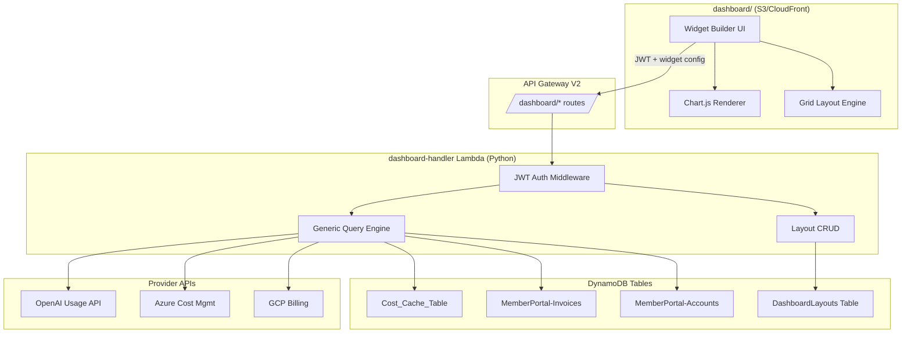
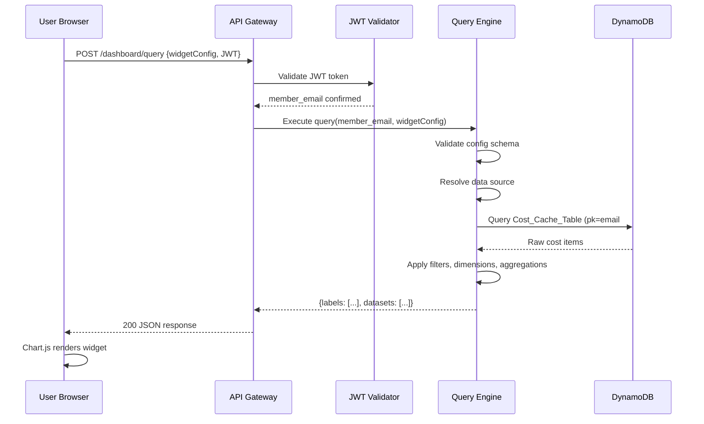
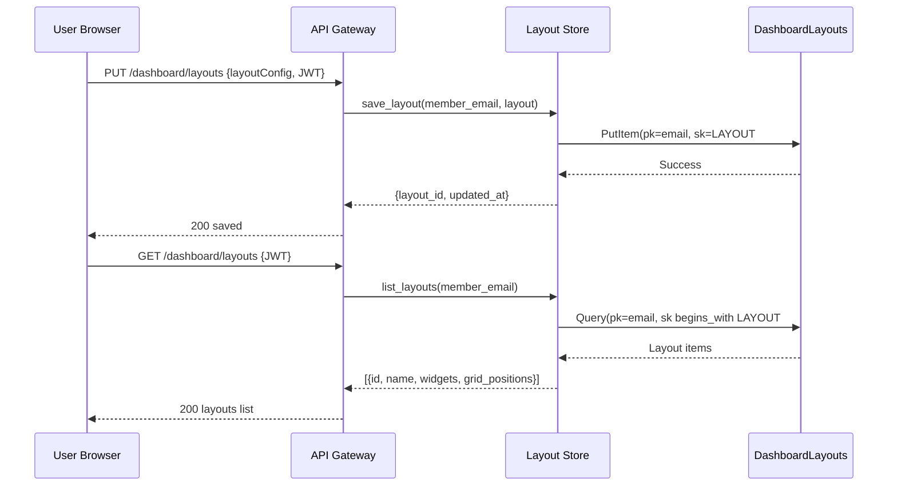

# Design Document: Widget Builder Dashboard

## Overview

The Widget Builder Dashboard is a self-service analytics tool that allows authenticated members to create custom visualizations from their existing cost and usage data. It lives in a separate `dashboard/` subfolder, completely independent from the existing `members/` portal, ensuring zero impact on the production member experience.

Users select from a palette of widget types (bar chart, line chart, pie chart, table, KPI card, gauge), bind each widget to one or more data sources (Cost_Cache_Table daily costs, invoices, OpenAI usage, commitments, business metrics), configure filters/dimensions/aggregations, and arrange widgets on a drag-and-drop grid. Layouts are persisted per user in DynamoDB and loaded on login.

The frontend uses Chart.js (~65KB CDN) for rendering and a lightweight grid library for drag-and-drop layout. The backend exposes a single generic query endpoint on the existing API Gateway that accepts a widget configuration payload, resolves it against DynamoDB tables, and returns aggregated data. Authentication reuses the same Cognito JWT flow as the members portal.

## Architecture



## Sequence Diagrams

### Widget Data Query Flow



### Save/Load Layout Flow



## Components and Interfaces

### Component 1: Widget Configuration Model

**Purpose**: Defines the schema for a widget's data binding, visualization type, and display options.

**Interface**:
```javascript
// Frontend widget configuration object
const WidgetConfig = {
    id: 'string (UUID)',
    type: 'bar | line | pie | table | kpi | gauge',
    title: 'string',
    dataSource: {
        source: 'cost_cache | invoices | openai_usage | commitments | business_metrics',
        accountIds: ['string'],       // which accounts to pull from
        dateRange: {
            type: 'relative | absolute',
            relative: '7d | 30d | 90d | 12m',
            start: 'YYYY-MM-DD',      // for absolute
            end: 'YYYY-MM-DD'
        }
    },
    dimensions: ['service | date | account | provider | tag_key'],
    filters: [
        { field: 'string', operator: 'eq | neq | gt | lt | contains', value: 'any' }
    ],
    aggregation: 'sum | avg | max | min | count',
    display: {
        colorScheme: 'string',
        showLegend: true,
        stacked: false,
        threshold: null              // for gauge/KPI
    }
};
```

**Responsibilities**:
- Define the contract between frontend widget editor and backend query engine
- Validate user-provided configuration before sending to API
- Support serialization for layout persistence

### Component 2: Generic Query Engine (Backend)

**Purpose**: Accepts a widget config, resolves the data source, applies filters/dimensions/aggregations, and returns chart-ready data.

**Interface**:
```python
class QueryEngine:
    def execute(self, member_email: str, widget_config: dict) -> dict:
        """Execute a widget query and return chart-ready data."""
        ...

    def _resolve_data_source(self, member_email: str, source_config: dict) -> list[dict]:
        """Fetch raw data from the appropriate DynamoDB table or provider API."""
        ...

    def _apply_filters(self, data: list[dict], filters: list[dict]) -> list[dict]:
        """Filter rows based on widget filter configuration."""
        ...

    def _apply_dimensions(self, data: list[dict], dimensions: list[str]) -> dict:
        """Group data by specified dimensions."""
        ...

    def _apply_aggregation(self, grouped_data: dict, aggregation: str) -> dict:
        """Aggregate values within each group."""
        ...

    def _format_for_chart(self, aggregated: dict, widget_type: str) -> dict:
        """Transform aggregated data into Chart.js-compatible format."""
        ...
```

**Responsibilities**:
- Validate incoming widget configuration against schema
- Route to correct data source (Cost_Cache_Table, Invoices, provider APIs)
- Apply filter/dimension/aggregation pipeline
- Return data in a format Chart.js can consume directly

### Component 3: Layout Store (Backend)

**Purpose**: CRUD operations for dashboard layouts stored per user in DynamoDB.

**Interface**:
```python
class LayoutStore:
    def save_layout(self, member_email: str, layout: dict) -> dict:
        """Create or update a dashboard layout."""
        ...

    def get_layout(self, member_email: str, layout_id: str) -> dict | None:
        """Retrieve a specific layout by ID."""
        ...

    def list_layouts(self, member_email: str) -> list[dict]:
        """List all layouts for a member."""
        ...

    def delete_layout(self, member_email: str, layout_id: str) -> bool:
        """Delete a layout."""
        ...
```

**Responsibilities**:
- Persist widget configurations and grid positions per user
- Enforce layout ownership (users can only access their own)
- Handle versioning/timestamps for conflict detection

### Component 4: Widget Builder UI (Frontend)

**Purpose**: The drag-and-drop interface where users create, configure, and arrange widgets.

**Interface**:
```javascript
// Main modules
const WidgetBuilder = {
    init(containerEl, authToken) {},
    addWidget(type) {},
    removeWidget(widgetId) {},
    openConfigPanel(widgetId) {},
    saveLayout() {},
    loadLayout(layoutId) {},
    refreshAll() {}
};

const WidgetRenderer = {
    render(containerEl, widgetConfig, data) {},
    destroy(widgetId) {},
    resize(widgetId, width, height) {}
};

const DataSourcePicker = {
    show(callback) {},
    getAvailableSources(accounts) {},
    buildQueryConfig(selections) {}
};
```

**Responsibilities**:
- Render widget palette for type selection
- Provide configuration panel (data source, filters, dimensions, aggregation)
- Manage drag-and-drop grid layout
- Call backend query endpoint and pass results to Chart.js
- Auto-save layout changes

## Data Models

### DashboardLayouts Table (New)

```python
# DynamoDB table: DashboardLayouts
# Partition key: pk (String) - member email
# Sort key: sk (String) - LAYOUT#{layout_id}

layout_item = {
    'pk': 'user@example.com',
    'sk': 'LAYOUT#550e8400-e29b-41d4-a716-446655440000',
    'layout_name': 'My Cost Dashboard',
    'widgets': [
        {
            'id': 'widget-uuid-1',
            'type': 'bar',
            'title': 'Monthly AWS Costs',
            'dataSource': { ... },
            'dimensions': ['service'],
            'filters': [],
            'aggregation': 'sum',
            'display': { ... },
            'gridPosition': {'x': 0, 'y': 0, 'w': 6, 'h': 4}
        }
    ],
    'grid_columns': 12,
    'created_at': '2024-01-15T10:30:00Z',
    'updated_at': '2024-01-15T14:22:00Z',
    'ttl': None  # No expiration for layouts
}
```

**Validation Rules**:
- `pk` must be a valid email address
- `sk` must follow `LAYOUT#` prefix pattern
- `widgets` array max 20 widgets per layout
- Each widget must have valid `type`, `dataSource`, and `gridPosition`
- `grid_columns` must be 12 (fixed 12-column grid)
- Max 10 layouts per user

### Cost_Cache_Table Schema (Existing)

```python
# Existing table: Cost_Cache_Table
# pk: "{member_email}#{account_id}"
# sk: "DAILY#{YYYY-MM-DD}"

cache_item = {
    'pk': 'user@example.com#123456789012',
    'sk': 'DAILY#2024-01-15',
    'total_cost': Decimal('45.67'),
    'service_breakdown': {
        'Amazon EC2': Decimal('23.45'),
        'Amazon S3': Decimal('12.22'),
        'AWS Lambda': Decimal('10.00')
    },
    'currency': 'USD',
    'cloud_provider': 'aws',
    'ttl': 1705536000
}
```

### Widget Query Request/Response

```python
# POST /dashboard/query
request_body = {
    'widget_config': {
        'type': 'bar',
        'dataSource': {
            'source': 'cost_cache',
            'accountIds': ['123456789012'],
            'dateRange': {'type': 'relative', 'relative': '30d'}
        },
        'dimensions': ['service'],
        'filters': [
            {'field': 'cost_amount', 'operator': 'gt', 'value': 1.0}
        ],
        'aggregation': 'sum'
    }
}

# Response (Chart.js-compatible)
response_body = {
    'labels': ['Amazon EC2', 'Amazon S3', 'AWS Lambda', 'Amazon RDS'],
    'datasets': [
        {
            'label': 'Cost (USD)',
            'data': [456.78, 123.45, 89.12, 67.89],
            'backgroundColor': ['#FF6384', '#36A2EB', '#FFCE56', '#4BC0C0']
        }
    ],
    'metadata': {
        'total': 737.24,
        'currency': 'USD',
        'period': '2024-01-01 to 2024-01-30',
        'from_cache': True
    }
}
```

## Key Functions with Formal Specifications

### Function 1: execute_query()

```python
def execute_query(member_email: str, widget_config: dict) -> dict:
    """Execute a widget data query against the appropriate data source."""
```

**Preconditions:**
- `member_email` is a non-empty string matching email format
- `widget_config` is a dict conforming to WidgetConfig schema
- `widget_config['dataSource']['source']` is one of: cost_cache, invoices, openai_usage, commitments, business_metrics
- `widget_config['dataSource']['accountIds']` contains only accounts owned by `member_email`
- `widget_config['aggregation']` is one of: sum, avg, max, min, count

**Postconditions:**
- Returns dict with `labels` (list of strings) and `datasets` (list of dataset objects)
- Each dataset contains `label` (string) and `data` (list of numbers)
- `metadata.total` equals the sum of the primary dataset values
- No data from accounts not owned by `member_email` is included in result
- If data source is unavailable, returns empty labels/datasets with error in metadata

**Loop Invariants:**
- During filter application: all previously processed items satisfy all preceding filter conditions
- During aggregation: running totals are non-negative for sum/count operations

### Function 2: validate_widget_config()

```python
def validate_widget_config(config: dict) -> tuple[bool, str | None]:
    """Validate a widget configuration object against the schema."""
```

**Preconditions:**
- `config` is a dict (may be malformed)

**Postconditions:**
- Returns `(True, None)` if config is valid
- Returns `(False, error_message)` if config is invalid
- `error_message` describes the first validation failure found
- No side effects, no mutations to input

### Function 3: resolve_date_range()

```python
def resolve_date_range(date_range: dict) -> tuple[str, str]:
    """Convert relative or absolute date range to (start_date, end_date) strings."""
```

**Preconditions:**
- `date_range` has key `type` with value `relative` or `absolute`
- If `relative`: has key `relative` with value matching pattern `\d+[dmM]`
- If `absolute`: has keys `start` and `end` in YYYY-MM-DD format

**Postconditions:**
- Returns tuple of (start_date, end_date) both in YYYY-MM-DD format
- `start_date` < `end_date`
- For relative ranges, `end_date` is today's date
- Date range never exceeds 365 days

### Function 4: save_layout()

```python
def save_layout(member_email: str, layout: dict) -> dict:
    """Persist a dashboard layout to DynamoDB."""
```

**Preconditions:**
- `member_email` is a valid, authenticated email
- `layout` contains `layout_name` (string, 1-100 chars) and `widgets` (list, 0-20 items)
- Each widget in `layout['widgets']` has valid `gridPosition` with x, y, w, h
- User has fewer than 10 existing layouts (or is updating an existing one)

**Postconditions:**
- Layout is stored in DashboardLayouts table with pk=member_email
- Returns dict with `layout_id`, `updated_at`
- If `layout_id` exists in input, updates existing; otherwise creates new
- `updated_at` reflects current UTC timestamp
- No other user's layouts are affected

## Algorithmic Pseudocode

### Main Query Pipeline

```python
def execute_query(member_email, widget_config):
    """
    INPUT: member_email (str), widget_config (dict)
    OUTPUT: chart_data (dict with labels + datasets)
    
    ASSERT validate_widget_config(widget_config) == (True, None)
    """
    # Step 1: Resolve date range
    start_date, end_date = resolve_date_range(widget_config['dataSource']['dateRange'])
    
    # Step 2: Verify account ownership
    account_ids = widget_config['dataSource']['accountIds']
    owned_accounts = get_member_accounts(member_email)
    for aid in account_ids:
        if aid not in owned_accounts:
            raise PermissionError(f"Account {aid} not owned by {member_email}")
    
    # Step 3: Fetch raw data from source
    source = widget_config['dataSource']['source']
    raw_data = []
    
    if source == 'cost_cache':
        for aid in account_ids:
            items = query_cost_cache(member_email, aid, start_date, end_date)
            raw_data.extend(flatten_service_breakdown(items))
    elif source == 'invoices':
        raw_data = query_invoices(member_email, account_ids, start_date, end_date)
    elif source == 'openai_usage':
        raw_data = query_openai_usage(member_email, account_ids, start_date, end_date)
    elif source == 'commitments':
        raw_data = query_commitments(member_email, account_ids)
    elif source == 'business_metrics':
        raw_data = query_business_metrics(member_email, start_date, end_date)
    
    # Step 4: Apply filters
    # INVARIANT: filtered_data contains only items satisfying ALL filters
    filtered_data = raw_data
    for f in widget_config.get('filters', []):
        filtered_data = [item for item in filtered_data if apply_filter(item, f)]
    
    # Step 5: Group by dimensions
    dimensions = widget_config.get('dimensions', [])
    if dimensions:
        grouped = group_by_dimensions(filtered_data, dimensions)
    else:
        grouped = {'_all': filtered_data}
    
    # Step 6: Aggregate
    aggregation = widget_config.get('aggregation', 'sum')
    aggregated = {}
    for key, items in grouped.items():
        aggregated[key] = aggregate(items, aggregation)
    
    # Step 7: Format for Chart.js
    chart_data = format_for_chart(aggregated, widget_config['type'])
    chart_data['metadata'] = {
        'total': sum(chart_data['datasets'][0]['data']) if chart_data['datasets'] else 0,
        'currency': 'USD',
        'period': f"{start_date} to {end_date}",
        'from_cache': source == 'cost_cache'
    }
    
    return chart_data
```

### Filter Application Algorithm

```python
def apply_filter(item, filter_config):
    """
    INPUT: item (dict), filter_config (dict with field, operator, value)
    OUTPUT: boolean (True if item passes filter)
    
    PRECONDITION: filter_config has keys 'field', 'operator', 'value'
    POSTCONDITION: returns True iff item[field] satisfies operator(value)
    """
    field_value = item.get(filter_config['field'])
    op = filter_config['operator']
    target = filter_config['value']
    
    if field_value is None:
        return False
    
    if op == 'eq':
        return field_value == target
    elif op == 'neq':
        return field_value != target
    elif op == 'gt':
        return float(field_value) > float(target)
    elif op == 'lt':
        return float(field_value) < float(target)
    elif op == 'contains':
        return str(target).lower() in str(field_value).lower()
    
    return False
```

### Aggregation Algorithm

```python
def aggregate(items, aggregation_type):
    """
    INPUT: items (list of dicts with 'cost_amount'), aggregation_type (str)
    OUTPUT: numeric result
    
    PRECONDITION: items is non-empty list, aggregation_type in {sum, avg, max, min, count}
    POSTCONDITION: result matches mathematical definition of the aggregation
    LOOP INVARIANT: running accumulator is correct for all items processed so far
    """
    values = [float(item.get('cost_amount', 0)) for item in items]
    
    if not values:
        return 0
    
    if aggregation_type == 'sum':
        return sum(values)
    elif aggregation_type == 'avg':
        return sum(values) / len(values)
    elif aggregation_type == 'max':
        return max(values)
    elif aggregation_type == 'min':
        return min(values)
    elif aggregation_type == 'count':
        return len(values)
    
    return 0
```

### Grid Position Validation

```python
def validate_grid_positions(widgets):
    """
    INPUT: widgets (list of widget configs with gridPosition)
    OUTPUT: (valid: bool, error: str | None)
    
    PRECONDITION: each widget has gridPosition with x, y, w, h
    POSTCONDITION: returns True iff no widgets overlap and all fit in 12-col grid
    """
    GRID_COLS = 12
    occupied = set()  # set of (col, row) tuples
    
    for widget in widgets:
        pos = widget['gridPosition']
        x, y, w, h = pos['x'], pos['y'], pos['w'], pos['h']
        
        # Check bounds
        if x < 0 or y < 0 or w < 1 or h < 1:
            return False, f"Widget {widget['id']}: invalid position values"
        if x + w > GRID_COLS:
            return False, f"Widget {widget['id']}: exceeds grid width"
        
        # Check overlap
        for col in range(x, x + w):
            for row in range(y, y + h):
                if (col, row) in occupied:
                    return False, f"Widget {widget['id']}: overlaps at ({col}, {row})"
                occupied.add((col, row))
    
    return True, None
```

## Example Usage

```javascript
// Frontend: Create a widget and fetch data
async function addCostWidget() {
    const config = {
        id: crypto.randomUUID(),
        type: 'bar',
        title: 'Top Services - Last 30 Days',
        dataSource: {
            source: 'cost_cache',
            accountIds: ['123456789012'],
            dateRange: { type: 'relative', relative: '30d' }
        },
        dimensions: ['service'],
        filters: [{ field: 'cost_amount', operator: 'gt', value: 1.0 }],
        aggregation: 'sum',
        display: { colorScheme: 'default', showLegend: true, stacked: false }
    };

    const response = await fetch(API + '/dashboard/query', {
        method: 'POST',
        headers: {
            'Content-Type': 'application/json',
            'Authorization': 'Bearer ' + getToken()
        },
        body: JSON.stringify({ widget_config: config })
    });

    const data = await response.json();
    renderChart('widget-container-' + config.id, config.type, data);
}

// Render with Chart.js
function renderChart(containerId, type, data) {
    const ctx = document.getElementById(containerId).getContext('2d');
    new Chart(ctx, {
        type: type,  // 'bar', 'line', 'pie'
        data: {
            labels: data.labels,
            datasets: data.datasets
        },
        options: {
            responsive: true,
            maintainAspectRatio: false,
            plugins: { legend: { display: data.datasets.length > 1 } }
        }
    });
}

// Save layout
async function saveLayout(layoutName, widgets, gridPositions) {
    const layout = {
        layout_name: layoutName,
        widgets: widgets.map((w, i) => ({
            ...w,
            gridPosition: gridPositions[i]
        }))
    };

    await fetch(API + '/dashboard/layouts', {
        method: 'PUT',
        headers: {
            'Content-Type': 'application/json',
            'Authorization': 'Bearer ' + getToken()
        },
        body: JSON.stringify(layout)
    });
}
```

```python
# Backend: Lambda handler routing
def lambda_handler(event, context):
    """Dashboard handler Lambda - routes /dashboard/* requests."""
    path = event.get('rawPath', '')
    method = event.get('requestContext', {}).get('http', {}).get('method', '')
    
    # Auth check
    token = extract_token(event)
    member_email = verify_jwt(token)
    if not member_email:
        return response(401, {'error': 'Unauthorized'})
    
    # Route
    if path == '/dashboard/query' and method == 'POST':
        body = json.loads(event.get('body', '{}'))
        widget_config = body.get('widget_config')
        valid, err = validate_widget_config(widget_config)
        if not valid:
            return response(400, {'error': err})
        result = query_engine.execute(member_email, widget_config)
        return response(200, result)
    
    elif path == '/dashboard/layouts' and method == 'GET':
        layouts = layout_store.list_layouts(member_email)
        return response(200, {'layouts': layouts})
    
    elif path == '/dashboard/layouts' and method == 'PUT':
        body = json.loads(event.get('body', '{}'))
        result = layout_store.save_layout(member_email, body)
        return response(200, result)
    
    elif path.startswith('/dashboard/layouts/') and method == 'DELETE':
        layout_id = path.split('/')[-1]
        layout_store.delete_layout(member_email, layout_id)
        return response(200, {'deleted': True})
    
    return response(404, {'error': 'Not found'})
```

## Correctness Properties

*A property is a characteristic or behavior that should hold true across all valid executions of a system—essentially, a formal statement about what the system should do. Properties serve as the bridge between human-readable specifications and machine-verifiable correctness guarantees.*

### Property 1: Query Data Isolation

*For any* member M and any widget query Q, the result of `execute_query(M, Q)` SHALL contain only data from accounts owned by M. No data point in the result may reference an account not in M's ownership set.

**Validates: Requirements 8.3, 8.4, 8.5, 9.2**

### Property 2: Layout Isolation

*For any* member M, listing layouts SHALL return only layouts where the partition key matches M's email. No layout belonging to a different member shall ever appear in the result.

**Validates: Requirements 7.2, 9.1, 9.3**

### Property 3: Filter Monotonicity

*For any* data set D and any list of filters F, the size of the filtered result set SHALL be less than or equal to the size of D. Filtering never increases the number of items.

**Validates: Requirements 4.2**

### Property 4: Filter Completeness

*For any* data set D and any list of filters F, every item in the filtered result SHALL satisfy ALL filter conditions simultaneously (conjunctive AND logic).

**Validates: Requirements 3.2, 4.4**

### Property 5: Aggregation Partition Consistency

*For any* data set D and any dimension, the sum of `aggregate(group, 'sum')` across all groups produced by `group_by(D, dimension)` SHALL equal `aggregate(D, 'sum')` applied to the unpartitioned data.

**Validates: Requirements 3.5**

### Property 6: Layout Persistence Round-trip

*For any* member M and any valid layout L, saving L and then loading it back SHALL produce a layout with identical widget configurations, grid positions, and layout name.

**Validates: Requirements 7.1, 7.4**

### Property 7: Grid Validity

*For any* valid layout, no two widgets SHALL occupy the same grid cell, no widget SHALL extend beyond the 12-column boundary (x + w ≤ 12), and all position values SHALL be non-negative with width and height at least 1.

**Validates: Requirements 6.3, 6.4, 6.5**

### Property 8: Date Range Validity

*For any* valid date range configuration (relative or absolute), the resolved output SHALL have start_date strictly before end_date and the span SHALL not exceed 365 days.

**Validates: Requirements 2.4, 2.5**

### Property 9: Validation Purity

*For any* Widget_Config input, calling `validate_widget_config` SHALL produce no side effects and the input object SHALL be identical before and after the call.

**Validates: Requirements 5.5**

### Property 10: Invalid Config Rejection

*For any* Widget_Config that is missing required fields, contains an unsupported widget type, or contains an unsupported aggregation type, `validate_widget_config` SHALL return a failure result with a descriptive error message.

**Validates: Requirements 1.3, 5.2, 5.3, 5.4**

### Property 11: Widget Limit Enforcement

*For any* layout containing more than 20 widgets, the Layout_Store SHALL reject the save operation.

**Validates: Requirements 7.5**

### Property 12: Provider Data Normalization

*For any* raw data from any supported provider (AWS, Azure, GCP, OpenAI), the Query_Engine normalization step SHALL produce records with a consistent field structure that the filter and aggregation pipeline can process uniformly.

**Validates: Requirements 10.3**

## Error Handling

### Error Scenario 1: Invalid Widget Configuration

**Condition**: User submits malformed widget config (missing required fields, invalid types)
**Response**: Return 400 with specific validation error message
**Recovery**: Frontend shows inline validation errors in config panel; user corrects and retries

### Error Scenario 2: Unauthorized Account Access

**Condition**: Widget config references account IDs not owned by the authenticated user
**Response**: Return 403 with "Account not authorized" message
**Recovery**: Frontend filters account picker to only show owned accounts; query is rejected server-side

### Error Scenario 3: Data Source Unavailable

**Condition**: Cost_Cache_Table has no data for requested range, or provider API is down
**Response**: Return 200 with empty datasets and `metadata.error` field explaining the gap
**Recovery**: Widget shows "No data available for this period" state with retry button

### Error Scenario 4: Layout Limit Exceeded

**Condition**: User tries to save 11th layout (max 10)
**Response**: Return 409 with "Layout limit reached" message
**Recovery**: Frontend prompts user to delete an existing layout before creating new one

### Error Scenario 5: Token Expired During Session

**Condition**: JWT expires while user is working on dashboard
**Response**: Return 401 on next API call
**Recovery**: Frontend detects 401, shows non-intrusive re-auth modal, preserves unsaved work in localStorage

## Testing Strategy

### Unit Testing Approach

- Test `validate_widget_config` with valid configs, missing fields, invalid types
- Test `apply_filter` for each operator (eq, neq, gt, lt, contains) with edge cases
- Test `aggregate` for each aggregation type with empty lists, single items, large sets
- Test `resolve_date_range` for relative (7d, 30d, 90d, 12m) and absolute ranges
- Test `validate_grid_positions` for overlap detection and boundary checks
- Test `format_for_chart` output matches Chart.js expected structure

### Property-Based Testing Approach

**Property Test Library**: hypothesis (Python backend), fast-check (JavaScript frontend)

- Generate random valid widget configs → verify output always has `labels` and `datasets`
- Generate random filter combinations → verify filtered set is always a subset
- Generate random grid layouts → verify no overlaps after validation passes
- Generate random date ranges → verify resolution always yields valid start < end

### Integration Testing Approach

- End-to-end test: create widget → query data → verify Chart.js renders
- Layout CRUD cycle: create → update → list → delete → verify empty
- Auth integration: verify same Cognito token works for both `/members/*` and `/dashboard/*`
- Cross-account isolation: verify user A cannot query user B's data

## Performance Considerations

- **Query latency target**: < 500ms for cached data, < 2s for live provider API calls
- **Cost_Cache_Table queries**: Use DynamoDB query (not scan) with pk + sk range for O(log n) access
- **Frontend rendering**: Chart.js handles up to 1000 data points smoothly; aggregate server-side for larger sets
- **Layout storage**: Layouts are small (< 50KB typical); single DynamoDB read/write per operation
- **CDN caching**: Static assets (JS, CSS) cached at CloudFront edge; API responses not cached (personalized data)
- **Concurrent widgets**: Frontend fetches widget data in parallel (Promise.all); backend handles concurrent Lambda invocations naturally

## Security Considerations

- **Authentication**: Same Cognito JWT as members portal; validated on every request
- **Authorization**: Server-side verification that requested account IDs belong to authenticated user
- **Input validation**: All widget config fields validated and sanitized before DynamoDB queries
- **Query injection prevention**: Parameterized DynamoDB Key conditions (boto3 handles escaping)
- **Rate limiting**: Apply same rate limits as existing member-handler (prevent query abuse)
- **Data isolation**: pk-based DynamoDB access pattern ensures cross-tenant isolation by design
- **CORS**: dashboard/ origin allowed; restrict to slashmycloudbill.com domain

## Dependencies

- **Chart.js** (v4.x): CDN-loaded visualization library (~65KB gzipped)
- **Grid layout library**: Muuri or gridstack.js for drag-and-drop (~30KB)
- **boto3**: AWS SDK for Python (Lambda runtime, DynamoDB access)
- **PyJWT**: JWT token validation (already used in member-handler)
- **DynamoDB**: DashboardLayouts table (new), Cost_Cache_Table (existing), MemberPortal-Invoices (existing)
- **API Gateway V2**: New route integration for `/dashboard/*` paths
- **S3/CloudFront**: Static hosting for `dashboard/` subfolder
- **Cognito**: Existing user pool for JWT issuance
