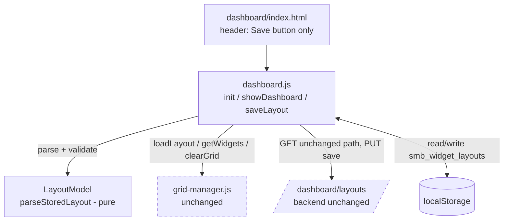
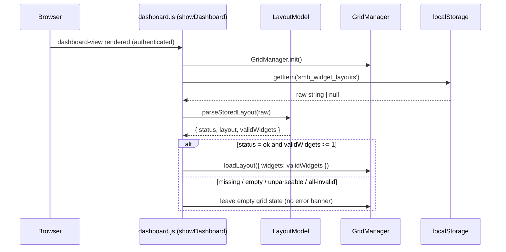
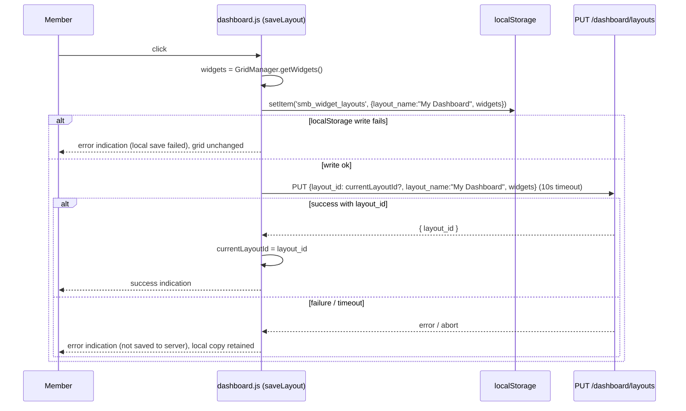

# Design Document

## Overview

This design covers a **frontend-only** amendment to the existing Widget Builder Dashboard (`.kiro/specs/widget-builder-dashboard/`). It collapses the dashboard from a multi-named-layout model into a **single-layout-per-member** model.

Concretely, the change:

- Removes the `-- Select Layout --` dropdown (`#layout-selector`) and the `+ New Layout` button (`#new-layout-btn`) from `dashboard/index.html`.
- Keeps the `💾 Save` button (`#save-layout-btn`).
- Auto-loads the member's single saved layout on dashboard load (from `localStorage` key `smb_widget_layouts`).
- Saves the current grid to `localStorage` and `PUT /dashboard/layouts`, always targeting the member's single Current_Layout using the fixed Default_Layout_Name `"My Dashboard"` (no name prompt).
- Removes all dead JavaScript that referenced the removed controls: `loadLayouts()`, `onLayoutSelected()`, `newLayout()`, and the listeners that bound them.

The backend `/dashboard/layouts` GET/PUT/DELETE endpoints and the `DashboardLayouts_Table` are **not modified**. All other Widget Builder Dashboard behaviors (widget types, query engine, data sources, grid placement, auth, data isolation, parent-window auto-population) remain in force.

### Scope Boundaries

| In scope | Out of scope |
|---|---|
| `dashboard/index.html` header markup | Any backend Lambda handler |
| `dashboard/dashboard.js` load/save/init logic | `DashboardLayouts_Table` schema |
| Layout parse/validate/filter logic | `dashboard/grid-manager.js` public API (reused as-is) |
| `localStorage` `smb_widget_layouts` handling | Widget rendering / query engine |

### Key Design Decisions

1. **Keep `GridManager` untouched.** `GridManager.loadLayout()`, `getWidgets()`, `clearGrid()`, and `addWidget()` already provide everything needed. The amendment lives entirely in `dashboard.js` and `index.html`. This minimizes regression surface (Requirement 8).
2. **Extract a small pure layout-parsing helper.** The auto-load path has real branching logic (missing value, unparseable JSON, mixed valid/invalid widgets) described in Requirement 4. Extracting this into a pure function (`LayoutModel.parseStoredLayout`) makes the behavior unit- and property-testable without a DOM, and isolates the only logic in this change that varies meaningfully with input.
3. **No name prompt on save.** The previous `saveLayout()` called `prompt('Layout name:', ...)`. Per Requirement 5.1, the amendment removes the prompt and always uses `"My Dashboard"`.
4. **Single Current_Layout identifier.** `currentLayoutId` is retained from the existing module state and reused on every save (Requirement 5.2, 5.3); the removed `loadLayouts()` refresh after save is deleted (Requirement 5.4).

## Architecture

The dashboard is a static page composed of independent IIFE modules loaded via `<script>` tags. Only `dashboard.js` and `index.html` change; a new pure helper (`LayoutModel`) is added for testability.



### Load Flow (auto-load, no selector)



### Save Flow (single layout, no name prompt)



## Components and Interfaces

### Component 1: Dashboard Header (`dashboard/index.html`)

**Change:** Within `<div class="header-right">`, remove the `#layout-selector` `<select>` and the `#new-layout-btn` `<button>`. Retain `#save-layout-btn` and `#header-email`.

Resulting header-right markup:

```html
<div class="header-right">
    <button id="save-layout-btn" class="btn btn-primary btn-sm">💾 Save</button>
    <span id="header-email" hidden></span>
</div>
```

### Component 2: `LayoutModel` (new pure helper, `dashboard/layout-model.js`)

A dependency-free IIFE with no DOM or network access, so it is fully unit- and property-testable.

```javascript
const LayoutModel = (() => {
    const REQUIRED_WIDGET_FIELDS = ['type', 'gridPosition']; // gridPosition carries x,y,w,h

    // Returns true iff widget has type, a gridPosition with numeric x,y,w,h.
    function isValidWidget(widget) { /* ... */ }

    // Pure parse + classify of a raw localStorage string.
    // Returns one of:
    //   { status: 'empty' }        -> no value, or parsed layout with 0 widgets
    //   { status: 'unparseable' }  -> JSON.parse threw
    //   { status: 'ok', layout, validWidgets, omittedCount }
    function parseStoredLayout(rawString) { /* ... */ }

    // Builds the canonical save payload for the single Current_Layout.
    function buildSavePayload(widgets, currentLayoutId) {
        return {
            layout_id: currentLayoutId || undefined,
            layout_name: 'My Dashboard',
            widgets: widgets
        };
    }

    return { isValidWidget, parseStoredLayout, buildSavePayload, DEFAULT_LAYOUT_NAME: 'My Dashboard' };
})();
```

`parseStoredLayout` contract:

| Input | `status` | Notes |
|---|---|---|
| `null` / `''` | `empty` | No stored layout (R4.3) |
| valid JSON, `widgets` absent or length 0 | `empty` | Empty grid, no error (R4.3) |
| not valid JSON | `unparseable` | Caller retains raw value, shows empty grid (R4.4) |
| valid JSON, some widgets invalid | `ok` | `validWidgets` excludes invalid entries; `omittedCount` > 0 (R4.5) |
| valid JSON, all widgets valid | `ok` | `validWidgets` = all (R4.6) |

### Component 3: `Dashboard` module (`dashboard/dashboard.js`)

**Removed entirely:**
- `loadLayouts()` function
- `onLayoutSelected(e)` function
- `newLayout()` function
- In `init()`: the `#new-layout-btn` listener block and the `#layout-selector` change listener block
- In the module's returned public interface: the `loadLayouts` export
- In `saveLayout()`: the `prompt(...)` call and the `await loadLayouts()` call

**Changed `init()` (layout controls wiring):** only the Save button remains.

```javascript
const saveBtn = document.getElementById('save-layout-btn');
if (saveBtn) saveBtn.addEventListener('click', saveLayout);
// (no #new-layout-btn listener, no #layout-selector listener)
```

**Changed `showDashboard()` (auto-load via LayoutModel):**

```javascript
function showDashboard() {
    document.getElementById('login-view').hidden = true;
    document.getElementById('dashboard-view').hidden = false;
    document.getElementById('header-email').textContent = memberEmail;

    GridManager.init();

    const raw = localStorage.getItem('smb_widget_layouts');
    const result = LayoutModel.parseStoredLayout(raw);
    if (result.status === 'ok' && result.validWidgets.length > 0) {
        GridManager.loadLayout({ widgets: result.validWidgets });
    }
    // empty / unparseable / all-invalid: leave existing empty grid state, no error banner.
    // unparseable: raw value is left untouched in localStorage (R4.4).
}
```

**Changed `saveLayout()` (no prompt, single layout, local-first):**

```javascript
async function saveLayout() {
    const widgets = GridManager.getWidgets();

    // 1. Local-first persistence (R3.2, R3.5)
    const layoutData = {
        layout_name: LayoutModel.DEFAULT_LAYOUT_NAME,
        widgets: widgets,
        savedAt: new Date().toISOString()
    };
    try {
        localStorage.setItem('smb_widget_layouts', JSON.stringify(layoutData));
    } catch (e) {
        showSaveError('Could not save your dashboard locally.');
        return; // grid retained unchanged (R3.5)
    }

    // 2. Backend persistence with 10s timeout (R3.3, R5.1, R5.6)
    try {
        const payload = LayoutModel.buildSavePayload(widgets, currentLayoutId);
        const resp = await apiRequest('PUT', '/dashboard/layouts', payload, 10000);
        if (resp && resp.layout_id) {
            currentLayoutId = resp.layout_id; // single Current_Layout id (R5.2, R5.3)
        }
        showSaveSuccess('Dashboard saved.'); // (R3.4, R5.5)
    } catch (err) {
        showSaveError('Saved on this device, but the save did not reach the server.'); // (R3.6, R5.6)
        // local copy retained; member may continue editing
    }
}
```

`apiRequest` gains an optional `timeoutMs` parameter implemented with `AbortController` so a stalled `PUT` is treated as failed after 10 seconds (R3.3, R5.6). `showSaveSuccess` / `showSaveError` render transient indications using existing dashboard styling (e.g., a small toast/banner element); no new modal flow is introduced.

### Component 4: Backend `/dashboard/layouts` (unchanged)

No code, schema, or configuration changes. The amendment continues to call the existing `PUT /dashboard/layouts` with the pre-existing request body schema (`layout_id?`, `layout_name`, `widgets`). GET/PUT/DELETE and `DashboardLayouts_Table` are untouched (Requirement 7).

## Data Models

### Stored layout (localStorage key `smb_widget_layouts`)

Shape is unchanged from the parent feature; only the write path differs (fixed name, single entry).

```json
{
  "layout_name": "My Dashboard",
  "widgets": [
    {
      "id": "widget-uuid-1",
      "type": "bar",
      "title": "Cost by Service",
      "dataSource": { "source": "cost_cache" },
      "dimensions": ["service"],
      "filters": [],
      "aggregation": "sum",
      "display": { "showLegend": true },
      "gridPosition": { "x": 0, "y": 0, "w": 6, "h": 4 }
    }
  ],
  "savedAt": "2025-01-01T00:00:00.000Z"
}
```

### Widget validity (used by `parseStoredLayout`)

A widget entry is **valid** for loading iff it has:
- a `type` (non-empty string), and
- a `gridPosition` object with numeric `x`, `y`, `w`, `h` (grid position and size).

Invalid entries are omitted from the grid; the rest still load (R4.5).

### `PUT /dashboard/layouts` request body (unchanged schema)

```json
{ "layout_id": "<optional existing id>", "layout_name": "My Dashboard", "widgets": [ /* ... */ ] }
```

`layout_id` is omitted on the first save of a session and populated from the prior response on subsequent saves so only one layout is ever targeted (R5.2, R5.3, R7.3).

## Correctness Properties

*A property is a characteristic or behavior that should hold true across all valid executions of a system — essentially, a formal statement about what the system should do. Properties serve as the bridge between human-readable specifications and machine-verifiable correctness guarantees.*

Most acceptance criteria in this amendment are static DOM checks, code-absence assertions, or deterministic single-scenario behaviors (removing controls, wiring listeners, showing indications), which are best covered by example/edge-case unit tests. The genuinely input-varying logic is concentrated in the pure `LayoutModel` helper (`parseStoredLayout`, `buildSavePayload`) and the save/auto-load round-trip. The properties below target exactly that logic. They were consolidated during property reflection so each provides unique validation value.

### Property 1: Stored-layout parse classification and value preservation

*For any* stored value `raw` (including `null`, the empty string, non-JSON strings, valid JSON with zero widgets, and valid JSON whose `widgets` array mixes valid and invalid entries), `LayoutModel.parseStoredLayout(raw)` SHALL:
- return `status: 'empty'` when `raw` is absent/empty or parses to a layout with zero widgets,
- return `status: 'unparseable'` when `raw` is not valid JSON, and in this case the auto-load path SHALL leave the stored value byte-for-byte unchanged,
- return `status: 'ok'` with `validWidgets` equal to exactly the subset of widget entries that contain a `type` and a `gridPosition` with numeric `x, y, w, h`, omitting every invalid entry (`omittedCount` equal to the number of invalid entries),

and in all cases SHALL complete without throwing a blocking error.

**Validates: Requirements 4.3, 4.4, 4.5**

### Property 2: Save-then-auto-load round-trip restores valid widgets as the single layout

*For any* set of valid widgets `W` and any prior stored value, performing a save and then an auto-load SHALL result in the grid receiving exactly the widgets `W`, with each widget's `type`, grid position (`x`, `y`), size (`w`, `h`), and saved configuration values preserved equal to the values at save time; and the `localStorage` entry under `smb_widget_layouts` SHALL hold a single layout equal to `W`, replacing any previously stored value.

**Validates: Requirements 3.2, 4.1, 4.6**

### Property 3: Save payload conformance and stable single-layout target

*For any* set of widgets `W` and any value of `currentLayoutId`, `LayoutModel.buildSavePayload(W, currentLayoutId)` SHALL produce an object whose keys are a subset of `{ layout_id, layout_name, widgets }`, whose `layout_name` is exactly `"My Dashboard"`, whose `widgets` equals `W`, and whose `layout_id` (when `currentLayoutId` is set) equals `currentLayoutId` unchanged — so that across any number of successive saves with a known id, every payload targets the same single Current_Layout rather than creating a new one.

**Validates: Requirements 5.1, 5.3, 7.3**

## Error Handling

| Condition | Detection | Response | Requirement |
|---|---|---|---|
| No / empty stored layout | `parseStoredLayout` → `empty` | Show existing empty grid; no error banner | 4.3 |
| Unparseable stored value | `JSON.parse` throws → `unparseable` | Empty grid; raw value left unchanged; no blocking error | 4.4 |
| Stored layout with invalid widget entries | `isValidWidget` filter | Load valid subset only; omit invalid; continue | 4.5 |
| `localStorage.setItem` fails (e.g., quota) | try/catch around `setItem` | Show local-save error; grid widgets unchanged; skip `PUT` | 3.5 |
| `PUT` rejects (network/HTTP error) | `apiRequest` throws | Show server-save error; retain local copy; allow editing | 3.6, 5.6 |
| `PUT` exceeds 10s | `AbortController` timeout in `apiRequest` | Treat as failed; same handling as `PUT` reject | 3.3, 5.6 |
| Reference to a removed control during render/auto-populate | None remain after cleanup | Render completes for all unaffected widgets without halting | 8.6 |

Notes:
- The save path is **local-first**: `localStorage` is written before the network call, so a backend failure never loses the member's work (R3.6).
- All save indications are non-blocking (transient banner/toast), so the member can continue editing regardless of outcome (R5.6).

## Testing Strategy

### Dual approach

- **Unit tests** cover the static DOM edits, code-absence/interface assertions, deterministic save/load scenarios, and error paths.
- **Property-based tests** cover the three input-varying properties in the pure `LayoutModel` logic and the save/load round-trip.

### Property-based testing

PBT **is appropriate** here for the pure, input-varying layout logic (`parseStoredLayout`, `buildSavePayload`, and the save↔load round-trip). It is **not** used for the DOM removals, listener wiring, network indications, or backend behavior, which do not vary meaningfully with input.

- Library: **fast-check** with a test runner already used by the project's JS tests (e.g., Jest/Vitest); `jsdom` provides DOM and a `localStorage` stub for the round-trip property.
- Do **not** implement property testing from scratch.
- Each property test runs a **minimum of 100 iterations**.
- Each property test is tagged with a comment referencing its design property, format:
  `// Feature: widget-builder-single-layout, Property {number}: {property_text}`
- One property-based test per correctness property:
  - **Property 1** — generator: arbitrary mix of `null`/`''`/non-JSON strings/valid-JSON layouts whose `widgets` mix valid and field-missing entries; assert status, `validWidgets` subset, `omittedCount`, and value-unchanged on unparseable.
  - **Property 2** — generator: arrays of valid widget configs (random type, gridPosition, size, config) plus an arbitrary prior stored value; save then parse/load; assert field-for-field preservation and single-entry replacement.
  - **Property 3** — generator: arbitrary widget arrays and arbitrary `currentLayoutId` (string or null); assert payload key set, fixed `layout_name`, preserved `widgets`, and unchanged `layout_id`.

### Unit / example tests (selected)

- **Header markup (R1.1, R1.2, R2.1, R3.1):** load `index.html` in jsdom; assert zero `#layout-selector`, zero `#new-layout-btn` / "+ New Layout", and a present visible `#save-layout-btn`.
- **Interface absence (R1.3, R2.3, R5.4, R6.5):** assert `Dashboard.loadLayouts`, `Dashboard.onLayoutSelected`, `Dashboard.newLayout` are all `undefined`.
- **Source scan (R6.1, R6.2):** assert zero occurrences of the removed identifiers and handler names across `index.html` and `dashboard.js`.
- **Init has no selector network call (R1.4) and no errors (R1.5, R2.4, R6.3):** run `init`/`showDashboard` with a fetch spy and a `console.error` spy; assert no GET for selector population and no reference errors.
- **Save success (R3.4, R5.5):** mock `PUT` → 200 `{layout_id}`; assert success indication and `currentLayoutId` updated (R5.2).
- **Save timeout (R3.3):** mock a never-resolving `PUT`; assert it is aborted and handled as failed after 10s (use fake timers).
- **localStorage write failure (R3.5):** stub `setItem` to throw; assert local-save error, grid unchanged, no `PUT`.
- **PUT failure (R3.6, R5.6):** mock `PUT` reject; assert server-save error and local copy retained.
- **Save without errors (R6.4):** run `saveLayout`; assert no reference errors to removed names.
- **Auto-populate (R8.5, R8.6):** dispatch a `dashboard-data` message; assert widgets render and no reference to removed controls; render completes without throwing.

### Regression and backend (no change)

- **No-regression (R8.1, R8.3):** existing parent Widget Builder Dashboard widget-type and grid-placement tests continue to pass unchanged.
- **Backend unchanged (R7.1, R7.2, R7.4, R8.2, R8.4):** verified by confirming no backend handler or `DashboardLayouts_Table` files are modified by this amendment; existing parent query-engine and auth/isolation tests remain green. These are smoke/integration checks, not property tests.
