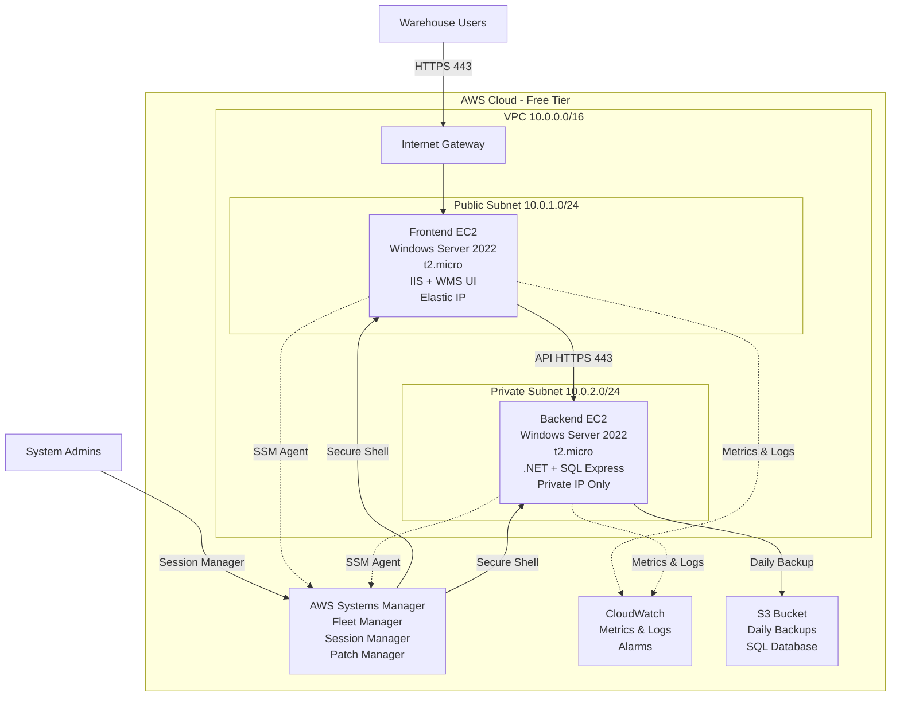

# Design Document: Windows EC2 POC Deployment with SSM Integration

## Overview

This design provides a complete technical specification for deploying 2 free-tier Windows Server 2022 EC2 instances (t2.micro) with AWS Systems Manager (SSM) monitoring integration. The system implements the Made4Net POC architecture with a frontend web server (IIS + WMS UI) in a public subnet and a backend application server (.NET + SQL Server Express) in a private subnet. Both instances are fully integrated with SSM for secure management, CloudWatch for monitoring, and S3 for automated backups.

## Architecture



## Main Workflow: User Access & System Management

```mermaid
sequenceDiagram
    participant User as Warehouse User
    participant FE as Frontend EC2
    participant BE as Backend EC2
    participant DB as SQL Server
    participant Admin as System Admin
    participant SSM as Systems Manager
    participant CW as CloudWatch
    participant S3 as S3 Backup
    
    User->>FE: HTTPS Request (443)
    FE->>FE: IIS processes request
    FE->>BE: API Call (HTTPS 443)
    BE->>DB: Query InventoryDB
    DB-->>BE: Return data
    BE-->>FE: JSON response
    FE-->>User: Render WMS UI
    
    Admin->>SSM: Connect via Session Manager
    SSM->>FE: Establish secure session
    Admin->>FE: Execute PowerShell commands
    
    FE->>CW: Send metrics (CPU, Memory, Disk)
    BE->>CW: Send metrics (CPU, Memory, Disk)
    CW->>Admin: Alarm notification (if threshold exceeded)
    
    Note over BE,S3: Daily at 2:00 AM UTC
    BE->>DB: Backup database
    BE->>S3: Upload backup file
    S3-->>BE: Confirm upload


## Components and Interfaces

### VPC Infrastructure

**Purpose**: Provides isolated network environment with public and private subnets for frontend and backend separation.

**Configuration**:
```yaml
VPC:
  CIDR: 10.0.0.0/16
  EnableDnsHostnames: true
  EnableDnsSupport: true
  Tags:
    Name: made4net-poc-vpc
    Environment: POC

PublicSubnet:
  CIDR: 10.0.1.0/24
  AvailabilityZone: us-east-1a
  MapPublicIpOnLaunch: true
  Tags:
    Name: made4net-poc-public-subnet

PrivateSubnet:
  CIDR: 10.0.2.0/24
  AvailabilityZone: us-east-1a
  MapPublicIpOnLaunch: false
  Tags:
    Name: made4net-poc-private-subnet

InternetGateway:
  AttachToVpc: made4net-poc-vpc
  Tags:
    Name: made4net-poc-igw
```

**Responsibilities**:
- Network isolation and segmentation
- Internet connectivity for public subnet
- Private network for backend security
- DNS resolution for EC2 instances

### Frontend EC2 Instance

**Purpose**: Hosts IIS web server with Made4Net WMS branded UI, serves as public-facing application entry point.

**Specifications**:
```yaml
InstanceType: t2.micro
AMI: Windows_Server-2022-English-Full-Base
vCPU: 1
Memory: 1 GB
Storage:
  - DeviceName: /dev/sda1
    VolumeType: gp3
    VolumeSize: 30
    DeleteOnTermination: false
    Encrypted: true
NetworkInterfaces:
  - SubnetId: public-subnet
    AssociatePublicIpAddress: true
    DeviceIndex: 0
    Groups:
      - frontend-security-group
IamInstanceProfile: SSM-EC2-Role
UserData: |
  <powershell>
  # Install SSM Agent (pre-installed on Windows Server 2022)
  # Install CloudWatch Agent
  # Configure IIS
  # Install .NET Framework 4.8
  </powershell>
Tags:
  Name: made4net-poc-frontend
  Role: WebServer
  Environment: POC
```

**Software Stack**:
- Windows Server 2022 (latest patches)
- IIS 10.0 with ASP.NET support
- .NET Framework 4.8 or .NET 6
- SSM Agent (pre-installed)
- CloudWatch Agent
- Made4Net WMS UI application

**Interface**:
```typescript
interface FrontendInstance {
  // Public endpoints
  httpsEndpoint: string;  // https://<elastic-ip>
  healthCheck: string;    // https://<elastic-ip>/health
  
  // Management endpoints (via SSM)
  ssmSessionId: string;
  cloudWatchLogGroup: string;
  
  // Methods
  serveWebUI(): Response;
  authenticateUser(credentials: UserCredentials): AuthToken;
  proxyToBackend(request: APIRequest): APIResponse;
  reportMetrics(): CloudWatchMetrics;
}
```

### Backend EC2 Instance

**Purpose**: Hosts .NET application layer and SQL Server Express database, accessible only from frontend.

**Specifications**:
```yaml
InstanceType: t2.micro
AMI: Windows_Server-2022-English-Full-Base
vCPU: 1
Memory: 1 GB
Storage:
  - DeviceName: /dev/sda1
    VolumeType: gp3
    VolumeSize: 30
    DeleteOnTermination: false
    Encrypted: true
NetworkInterfaces:
  - SubnetId: private-subnet
    AssociatePublicIpAddress: false
    DeviceIndex: 0
    Groups:
      - backend-security-group
IamInstanceProfile: SSM-EC2-Role
UserData: |
  <powershell>
  # Install SSM Agent
  # Install CloudWatch Agent
  # Install SQL Server Express 2019
  # Install .NET Runtime
  # Configure backup script
  </powershell>
Tags:
  Name: made4net-poc-backend
  Role: AppServer
  Environment: POC
```

**Software Stack**:
- Windows Server 2022 (latest patches)
- SQL Server Express 2019 (10GB limit)
- .NET Framework 4.8 or .NET 6
- SSM Agent (pre-installed)
- CloudWatch Agent
- REST API application

**Interface**:
```typescript
interface BackendInstance {
  // Private endpoints (accessible from frontend only)
  apiEndpoint: string;  // https://10.0.2.x:443
  healthCheck: string;  // https://10.0.2.x:443/api/health
  
  // Database
  databaseConnection: string;  // localhost:1433
  
  // Management endpoints (via SSM)
  ssmSessionId: string;
  cloudWatchLogGroup: string;
  
  // Methods
  processAPIRequest(request: APIRequest): APIResponse;
  queryDatabase(query: SQLQuery): QueryResult;
  backupDatabase(): BackupResult;
  reportMetrics(): CloudWatchMetrics;
}
```

### Security Groups

**Frontend Security Group**:
```yaml
SecurityGroup:
  Name: made4net-poc-frontend-sg
  Description: Security group for frontend web server
  VpcId: made4net-poc-vpc
  IngressRules:
    - IpProtocol: tcp
      FromPort: 443
      ToPort: 443
      CidrIp: 0.0.0.0/0
      Description: HTTPS from internet
    - IpProtocol: tcp
      FromPort: 80
      ToPort: 80
      CidrIp: 0.0.0.0/0
      Description: HTTP redirect to HTTPS
  EgressRules:
    - IpProtocol: -1
      CidrIp: 0.0.0.0/0
      Description: All outbound traffic
```

**Backend Security Group**:
```yaml
SecurityGroup:
  Name: made4net-poc-backend-sg
  Description: Security group for backend app server
  VpcId: made4net-poc-vpc
  IngressRules:
    - IpProtocol: tcp
      FromPort: 443
      ToPort: 443
      SourceSecurityGroupId: frontend-sg
      Description: HTTPS from frontend only
    - IpProtocol: tcp
      FromPort: 1433
      ToPort: 1433
      SourceSecurityGroupId: frontend-sg
      Description: SQL Server from frontend only
  EgressRules:
    - IpProtocol: -1
      CidrIp: 0.0.0.0/0
      Description: All outbound traffic
```

### IAM Role for SSM

**Purpose**: Grants EC2 instances permissions to communicate with Systems Manager, CloudWatch, and S3.

**Policy Document**:
```json
{
  "Version": "2012-10-17",
  "Statement": [
    {
      "Effect": "Allow",
      "Action": [
        "ssm:UpdateInstanceInformation",
        "ssmmessages:CreateControlChannel",
        "ssmmessages:CreateDataChannel",
        "ssmmessages:OpenControlChannel",
        "ssmmessages:OpenDataChannel"
      ],
      "Resource": "*"
    },
    {
      "Effect": "Allow",
      "Action": [
        "cloudwatch:PutMetricData",
        "ec2:DescribeVolumes",
        "ec2:DescribeTags",
        "logs:CreateLogGroup",
        "logs:CreateLogStream",
        "logs:PutLogEvents",
        "logs:DescribeLogStreams"
      ],
      "Resource": "*"
    },
    {
      "Effect": "Allow",
      "Action": [
        "s3:PutObject",
        "s3:GetObject",
        "s3:ListBucket"
      ],
      "Resource": [
        "arn:aws:s3:::made4net-poc-backups",
        "arn:aws:s3:::made4net-poc-backups/*"
      ]
    }
  ]
}
```

### Systems Manager Configuration

**SSM Agent**: Pre-installed on Windows Server 2022 AMI, automatically registers instances with Fleet Manager.

**Session Manager Settings**:
```yaml
SessionManagerPreferences:
  S3BucketName: made4net-poc-session-logs
  S3KeyPrefix: session-logs/
  S3EncryptionEnabled: true
  CloudWatchLogGroupName: /aws/ssm/session-logs
  CloudWatchEncryptionEnabled: true
  IdleSessionTimeout: 20
  MaxSessionDuration: 60
  RunAsEnabled: false
```

**Patch Manager Baseline**:
```yaml
PatchBaseline:
  Name: made4net-poc-windows-baseline
  OperatingSystem: WINDOWS
  ApprovalRules:
    - PatchFilterGroup:
        - Key: CLASSIFICATION
          Values:
            - CriticalUpdates
            - SecurityUpdates
        - Key: MSRC_SEVERITY
          Values:
            - Critical
            - Important
      ApproveAfterDays: 7
      ComplianceLevel: CRITICAL
  ApprovedPatches: []
  RejectedPatches: []
```

**Maintenance Window**:
```yaml
MaintenanceWindow:
  Name: made4net-poc-patching-window
  Schedule: cron(0 2 ? * SUN *)
  Duration: 4
  Cutoff: 1
  AllowUnassociatedTargets: false
  Targets:
    - Key: tag:Environment
      Values:
        - POC
  Tasks:
    - Type: RUN_COMMAND
      ServiceRoleArn: arn:aws:iam::ACCOUNT_ID:role/SSM-Maintenance-Role
      MaxConcurrency: 1
      MaxErrors: 1
      Priority: 1
      TaskArn: AWS-RunPatchBaseline
      TaskParameters:
        Operation:
          - Install
```

### CloudWatch Agent Configuration

**Frontend Configuration**:
```json
{
  "metrics": {
    "namespace": "Made4Net/POC/Frontend",
    "metrics_collected": {
      "LogicalDisk": {
        "measurement": [
          {"name": "% Free Space", "unit": "Percent"}
        ],
        "metrics_collection_interval": 60,
        "resources": ["*"]
      },
      "Memory": {
        "measurement": [
          {"name": "% Committed Bytes In Use", "unit": "Percent"}
        ],
        "metrics_collection_interval": 60
      },
      "Processor": {
        "measurement": [
          {"name": "% Processor Time", "unit": "Percent"}
        ],
        "metrics_collection_interval": 60,
        "resources": ["_Total"]
      },
      "statsd": {
        "service_address": ":8125",
        "metrics_collection_interval": 10,
        "metrics_aggregation_interval": 60
      }
    }
  },
  "logs": {
    "logs_collected": {
      "windows_events": {
        "collect_list": [
          {
            "event_name": "System",
            "event_levels": ["ERROR", "WARNING"],
            "log_group_name": "/aws/ec2/windows/frontend/system",
            "log_stream_name": "{instance_id}"
          },
          {
            "event_name": "Application",
            "event_levels": ["ERROR", "WARNING"],
            "log_group_name": "/aws/ec2/windows/frontend/application",
            "log_stream_name": "{instance_id}"
          }
        ]
      },
      "files": {
        "collect_list": [
          {
            "file_path": "C:\\inetpub\\logs\\LogFiles\\W3SVC1\\*.log",
            "log_group_name": "/aws/ec2/windows/frontend/iis",
            "log_stream_name": "{instance_id}",
            "timezone": "UTC"
          }
        ]
      }
    }
  }
}
```

**Backend Configuration**:
```json
{
  "metrics": {
    "namespace": "Made4Net/POC/Backend",
    "metrics_collected": {
      "LogicalDisk": {
        "measurement": [
          {"name": "% Free Space", "unit": "Percent"}
        ],
        "metrics_collection_interval": 60,
        "resources": ["*"]
      },
      "Memory": {
        "measurement": [
          {"name": "% Committed Bytes In Use", "unit": "Percent"}
        ],
        "metrics_collection_interval": 60
      },
      "Processor": {
        "measurement": [
          {"name": "% Processor Time", "unit": "Percent"}
        ],
        "metrics_collection_interval": 60,
        "resources": ["_Total"]
      }
    }
  },
  "logs": {
    "logs_collected": {
      "windows_events": {
        "collect_list": [
          {
            "event_name": "System",
            "event_levels": ["ERROR", "WARNING"],
            "log_group_name": "/aws/ec2/windows/backend/system",
            "log_stream_name": "{instance_id}"
          },
          {
            "event_name": "Application",
            "event_levels": ["ERROR", "WARNING"],
            "log_group_name": "/aws/ec2/windows/backend/application",
            "log_stream_name": "{instance_id}"
          }
        ]
      },
      "files": {
        "collect_list": [
          {
            "file_path": "C:\\SQLBackups\\*.log",
            "log_group_name": "/aws/ec2/windows/backend/backup",
            "log_stream_name": "{instance_id}",
            "timezone": "UTC"
          }
        ]
      }
    }
  }
}
```


### CloudWatch Agent Configuration

**Frontend Configuration**:
```json
{
  "metrics": {
    "namespace": "Made4Net/POC/Frontend",
    "metrics_collected": {
      "LogicalDisk": {
        "measurement": [{"name": "% Free Space", "unit": "Percent"}],
        "metrics_collection_interval": 60,
        "resources": ["*"]
      },
      "Memory": {
        "measurement": [{"name": "% Committed Bytes In Use", "unit": "Percent"}],
        "metrics_collection_interval": 60
      },
      "Processor": {
        "measurement": [{"name": "% Processor Time", "unit": "Percent"}],
        "metrics_collection_interval": 60,
        "resources": ["_Total"]
      }
    }
  },
  "logs": {
    "logs_collected": {
      "windows_events": {
        "collect_list": [
          {
            "event_name": "System",
            "event_levels": ["ERROR", "WARNING"],
            "log_group_name": "/aws/ec2/windows/frontend/system",
            "log_stream_name": "{instance_id}"
          }
        ]
      }
    }
  }
}
```

**Backend Configuration**: Similar structure with namespace "Made4Net/POC/Backend" and SQL backup logs.

## Data Models

### User Model
```typescript
interface User {
  userId: string;           // UUID
  username: string;         // Unique, 3-50 chars
  passwordHash: string;     // bcrypt hash
  role: 'Admin' | 'Manager' | 'Operator';
  email: string;
  createdAt: Date;
  lastLogin: Date;
  isActive: boolean;
}
```

### Inventory Item Model
```typescript
interface InventoryItem {
  itemId: string;           // UUID
  sku: string;              // Stock Keeping Unit
  name: string;
  description: string;
  quantity: number;         // Current stock level
  location: string;         // Warehouse location
  lastUpdated: Date;
  updatedBy: string;        // userId
}
```

### Audit Log Model
```typescript
interface AuditLog {
  logId: string;            // UUID
  timestamp: Date;
  userId: string;
  action: string;           // CREATE, UPDATE, DELETE, LOGIN
  entityType: string;       // User, InventoryItem
  entityId: string;
  changes: JSON;            // Before/after values
  ipAddress: string;
}
```

## Algorithmic Pseudocode

### Main Deployment Algorithm

```pascal
ALGORITHM deployPOCInfrastructure()
INPUT: awsCredentials, region, configuration
OUTPUT: deploymentResult

BEGIN
  ASSERT awsCredentials.isValid() = true
  ASSERT region IN supportedRegions
  
  // Step 1: Create VPC and networking
  vpc ← createVPC(cidr: "10.0.0.0/16")
  publicSubnet ← createSubnet(vpc, cidr: "10.0.1.0/24", public: true)
  privateSubnet ← createSubnet(vpc, cidr: "10.0.2.0/24", public: false)
  igw ← createInternetGateway()
  attachGateway(vpc, igw)
  
  // Step 2: Create security groups
  frontendSG ← createSecurityGroup(vpc, rules: frontendRules)
  backendSG ← createSecurityGroup(vpc, rules: backendRules)
  
  // Step 3: Create IAM role for SSM
  ssmRole ← createIAMRole(policies: [SSMPolicy, CloudWatchPolicy, S3Policy])
  instanceProfile ← createInstanceProfile(ssmRole)
  
  // Step 4: Launch EC2 instances
  frontendInstance ← launchEC2(
    ami: "Windows_Server-2022",
    instanceType: "t2.micro",
    subnet: publicSubnet,
    securityGroup: frontendSG,
    iamProfile: instanceProfile,
    userData: frontendUserData
  )
  
  backendInstance ← launchEC2(
    ami: "Windows_Server-2022",
    instanceType: "t2.micro",
    subnet: privateSubnet,
    securityGroup: backendSG,
    iamProfile: instanceProfile,
    userData: backendUserData
  )
  
  // Step 5: Allocate and associate Elastic IP
  elasticIP ← allocateElasticIP()
  associateElasticIP(frontendInstance, elasticIP)
  
  // Step 6: Wait for instances to be ready
  WHILE NOT (frontendInstance.state = "running" AND backendInstance.state = "running") DO
    sleep(10)
    refreshInstanceStates()
  END WHILE
  
  // Step 7: Configure SSM
  configurePatchBaseline()
  createMaintenanceWindow()
  
  // Step 8: Create S3 bucket for backups
  backupBucket ← createS3Bucket(name: "made4net-poc-backups")
  enableEncryption(backupBucket)
  
  ASSERT frontendInstance.ssmStatus = "online"
  ASSERT backendInstance.ssmStatus = "online"
  
  RETURN {
    vpcId: vpc.id,
    frontendInstanceId: frontendInstance.id,
    backendInstanceId: backendInstance.id,
    frontendPublicIP: elasticIP.address,
    backendPrivateIP: backendInstance.privateIP
  }
END
```

**Preconditions**:
- AWS credentials are valid and have necessary permissions
- Region supports t2.micro instances
- Free tier limits not exceeded

**Postconditions**:
- All resources created successfully
- Both instances registered with SSM
- Frontend accessible via Elastic IP
- Backend accessible only from frontend

**Loop Invariants**:
- All created resources remain in valid state
- Network connectivity maintained throughout deployment

### Database Backup Algorithm

```pascal
ALGORITHM backupDatabase()
INPUT: databaseName, s3BucketName
OUTPUT: backupResult

BEGIN
  timestamp ← getCurrentTimestamp()
  backupFileName ← "InventoryDB_" + timestamp + ".bak"
  localPath ← "C:\\SQLBackups\\" + backupFileName
  
  // Step 1: Create SQL Server backup
  sqlCommand ← "BACKUP DATABASE " + databaseName + 
               " TO DISK = '" + localPath + "' " +
               "WITH COMPRESSION, CHECKSUM"
  
  executeSQL(sqlCommand)
  
  ASSERT fileExists(localPath) = true
  
  // Step 2: Upload to S3
  s3Key ← "backups/" + backupFileName
  uploadToS3(
    bucket: s3BucketName,
    key: s3Key,
    filePath: localPath,
    encryption: "AES256"
  )
  
  // Step 3: Verify upload
  s3Object ← getS3Object(s3BucketName, s3Key)
  ASSERT s3Object.size = getFileSize(localPath)
  
  // Step 4: Clean up old local backups (keep last 3)
  localBackups ← listFiles("C:\\SQLBackups\\*.bak")
  sortByDate(localBackups, descending: true)
  
  FOR i FROM 4 TO length(localBackups) DO
    deleteFile(localBackups[i])
  END FOR
  
  // Step 5: Log success
  logToCloudWatch("Backup completed successfully: " + backupFileName)
  
  RETURN {
    success: true,
    backupFile: backupFileName,
    s3Location: s3BucketName + "/" + s3Key,
    size: getFileSize(localPath)
  }
END
```

**Preconditions**:
- SQL Server is running
- Database exists and is accessible
- S3 bucket exists and is accessible
- Sufficient disk space for backup

**Postconditions**:
- Backup file created successfully
- Backup uploaded to S3
- Old local backups cleaned up
- CloudWatch log entry created

## Key Functions with Formal Specifications

### Function 1: launchEC2Instance()

```typescript
function launchEC2Instance(config: EC2Config): EC2Instance
```

**Preconditions:**
- `config.ami` is valid Windows Server 2022 AMI ID
- `config.instanceType` is "t2.micro"
- `config.subnet` exists and is available
- `config.securityGroup` exists
- `config.iamProfile` has SSM permissions

**Postconditions:**
- Returns EC2Instance object with valid instanceId
- Instance state is "pending" or "running"
- SSM Agent automatically starts on boot
- Instance tagged with Environment: POC

**Loop Invariants:** N/A

### Function 2: configureSSMAgent()

```typescript
function configureSSMAgent(instanceId: string): SSMConfiguration
```

**Preconditions:**
- Instance exists and is running
- IAM role attached with SSM permissions
- SSM Agent installed (pre-installed on Windows Server 2022)

**Postconditions:**
- Instance appears in Fleet Manager
- Session Manager enabled
- CloudWatch Agent configured and running
- Returns SSMConfiguration with activation status

### Function 3: setupDatabaseBackup()

```powershell
function Setup-DatabaseBackup {
    param(
        [string]$DatabaseName,
        [string]$S3BucketName,
        [string]$BackupTime = "02:00"
    )
}
```

**Preconditions:**
- SQL Server Express installed and running
- Database exists
- S3 bucket accessible
- Scheduled Task service running

**Postconditions:**
- Scheduled task created for daily backup
- Backup directory exists
- Test backup completes successfully
- CloudWatch log group created

## Example Usage

### Deploying with AWS CDK (TypeScript)

```typescript
import * as cdk from 'aws-cdk-lib';
import * as ec2 from 'aws-cdk-lib/aws-ec2';
import * as iam from 'aws-cdk-lib/aws-iam';
import * as s3 from 'aws-cdk-lib/aws-s3';

export class Made4NetPOCStack extends cdk.Stack {
  constructor(scope: cdk.App, id: string, props?: cdk.StackProps) {
    super(scope, id, props);

    // VPC
    const vpc = new ec2.Vpc(this, 'Made4NetPOCVPC', {
      ipAddresses: ec2.IpAddresses.cidr('10.0.0.0/16'),
      maxAzs: 1,
      natGateways: 0,
      subnetConfiguration: [
        {
          name: 'Public',
          subnetType: ec2.SubnetType.PUBLIC,
          cidrMask: 24,
        },
        {
          name: 'Private',
          subnetType: ec2.SubnetType.PRIVATE_ISOLATED,
          cidrMask: 24,
        }
      ]
    });

    // IAM Role for SSM
    const ssmRole = new iam.Role(this, 'SSMRole', {
      assumedBy: new iam.ServicePrincipal('ec2.amazonaws.com'),
      managedPolicies: [
        iam.ManagedPolicy.fromAwsManagedPolicyName('AmazonSSMManagedInstanceCore'),
        iam.ManagedPolicy.fromAwsManagedPolicyName('CloudWatchAgentServerPolicy')
      ]
    });

    // S3 Bucket for backups
    const backupBucket = new s3.Bucket(this, 'BackupBucket', {
      bucketName: 'made4net-poc-backups',
      encryption: s3.BucketEncryption.S3_MANAGED,
      blockPublicAccess: s3.BlockPublicAccess.BLOCK_ALL,
      lifecycleRules: [{
        expiration: cdk.Duration.days(30)
      }]
    });

    backupBucket.grantReadWrite(ssmRole);

    // Security Groups
    const frontendSG = new ec2.SecurityGroup(this, 'FrontendSG', {
      vpc,
      description: 'Frontend web server security group',
      allowAllOutbound: true
    });
    frontendSG.addIngressRule(ec2.Peer.anyIpv4(), ec2.Port.tcp(443), 'HTTPS');
    frontendSG.addIngressRule(ec2.Peer.anyIpv4(), ec2.Port.tcp(80), 'HTTP');

    const backendSG = new ec2.SecurityGroup(this, 'BackendSG', {
      vpc,
      description: 'Backend app server security group',
      allowAllOutbound: true
    });
    backendSG.addIngressRule(frontendSG, ec2.Port.tcp(443), 'HTTPS from frontend');
    backendSG.addIngressRule(frontendSG, ec2.Port.tcp(1433), 'SQL from frontend');

    // Frontend EC2
    const frontendInstance = new ec2.Instance(this, 'FrontendInstance', {
      vpc,
      vpcSubnets: { subnetType: ec2.SubnetType.PUBLIC },
      instanceType: ec2.InstanceType.of(ec2.InstanceClass.T2, ec2.InstanceSize.MICRO),
      machineImage: ec2.MachineImage.latestWindows(ec2.WindowsVersion.WINDOWS_SERVER_2022_ENGLISH_FULL_BASE),
      securityGroup: frontendSG,
      role: ssmRole,
      blockDevices: [{
        deviceName: '/dev/sda1',
        volume: ec2.BlockDeviceVolume.ebs(30, {
          volumeType: ec2.EbsDeviceVolumeType.GP3,
          encrypted: true
        })
      }]
    });

    // Backend EC2
    const backendInstance = new ec2.Instance(this, 'BackendInstance', {
      vpc,
      vpcSubnets: { subnetType: ec2.SubnetType.PRIVATE_ISOLATED },
      instanceType: ec2.InstanceType.of(ec2.InstanceClass.T2, ec2.InstanceSize.MICRO),
      machineImage: ec2.MachineImage.latestWindows(ec2.WindowsVersion.WINDOWS_SERVER_2022_ENGLISH_FULL_BASE),
      securityGroup: backendSG,
      role: ssmRole,
      blockDevices: [{
        deviceName: '/dev/sda1',
        volume: ec2.BlockDeviceVolume.ebs(30, {
          volumeType: ec2.EbsDeviceVolumeType.GP3,
          encrypted: true
        })
      }]
    });

    // Outputs
    new cdk.CfnOutput(this, 'FrontendPublicIP', {
      value: frontendInstance.instancePublicIp
    });
    new cdk.CfnOutput(this, 'BackendPrivateIP', {
      value: backendInstance.instancePrivateIp
    });
  }
}
```

### PowerShell Deployment Script

```powershell
# deploy-poc.ps1
param(
    [Parameter(Mandatory=$true)]
    [string]$Region = "us-east-1",
    
    [Parameter(Mandatory=$false)]
    [string]$AdminIP = "0.0.0.0/0"
)

# Deploy CloudFormation stack
aws cloudformation create-stack `
    --stack-name made4net-poc `
    --template-body file://infrastructure.yaml `
    --parameters ParameterKey=AdminIP,ParameterValue=$AdminIP `
    --capabilities CAPABILITY_IAM `
    --region $Region

# Wait for stack creation
aws cloudformation wait stack-create-complete `
    --stack-name made4net-poc `
    --region $Region

# Get outputs
$outputs = aws cloudformation describe-stacks `
    --stack-name made4net-poc `
    --region $Region `
    --query 'Stacks[0].Outputs' `
    --output json | ConvertFrom-Json

Write-Host "Deployment Complete!"
Write-Host "Frontend Public IP: $($outputs | Where-Object {$_.OutputKey -eq 'FrontendPublicIP'} | Select-Object -ExpandProperty OutputValue)"
Write-Host "Backend Private IP: $($outputs | Where-Object {$_.OutputKey -eq 'BackendPrivateIP'} | Select-Object -ExpandProperty OutputValue)"
```

### Frontend UserData Script

```powershell
<powershell>
# Install CloudWatch Agent
$cwAgentUrl = "https://s3.amazonaws.com/amazoncloudwatch-agent/windows/amd64/latest/amazon-cloudwatch-agent.msi"
Invoke-WebRequest -Uri $cwAgentUrl -OutFile "C:\cloudwatch-agent.msi"
Start-Process msiexec.exe -ArgumentList '/i C:\cloudwatch-agent.msi /quiet' -Wait

# Install IIS
Install-WindowsFeature -Name Web-Server -IncludeManagementTools
Install-WindowsFeature -Name Web-Asp-Net45

# Install .NET 6
$dotnetUrl = "https://download.visualstudio.microsoft.com/download/pr/xxx/dotnet-hosting-6.0-win.exe"
Invoke-WebRequest -Uri $dotnetUrl -OutFile "C:\dotnet-hosting.exe"
Start-Process "C:\dotnet-hosting.exe" -ArgumentList '/quiet /norestart' -Wait

# Configure IIS
Import-Module WebAdministration
New-WebAppPool -Name "Made4NetPool"
Set-ItemProperty IIS:\AppPools\Made4NetPool -Name managedRuntimeVersion -Value "v4.0"

# Create website directory
New-Item -Path "C:\inetpub\made4net" -ItemType Directory -Force

# Configure CloudWatch Agent
$cwConfig = @"
{
  "metrics": {
    "namespace": "Made4Net/POC/Frontend",
    "metrics_collected": {
      "LogicalDisk": {
        "measurement": [{"name": "% Free Space", "unit": "Percent"}],
        "metrics_collection_interval": 60,
        "resources": ["*"]
      }
    }
  }
}
"@
$cwConfig | Out-File -FilePath "C:\cloudwatch-config.json"
& "C:\Program Files\Amazon\AmazonCloudWatchAgent\amazon-cloudwatch-agent-ctl.ps1" `
    -a fetch-config -m ec2 -s -c file:C:\cloudwatch-config.json

Write-Host "Frontend setup complete"
</powershell>
```

### Backend UserData Script

```powershell
<powershell>
# Install CloudWatch Agent
$cwAgentUrl = "https://s3.amazonaws.com/amazoncloudwatch-agent/windows/amd64/latest/amazon-cloudwatch-agent.msi"
Invoke-WebRequest -Uri $cwAgentUrl -OutFile "C:\cloudwatch-agent.msi"
Start-Process msiexec.exe -ArgumentList '/i C:\cloudwatch-agent.msi /quiet' -Wait

# Install SQL Server Express 2019
$sqlUrl = "https://go.microsoft.com/fwlink/?linkid=866658"
Invoke-WebRequest -Uri $sqlUrl -OutFile "C:\SQLServer2019-SSEI-Expr.exe"
Start-Process "C:\SQLServer2019-SSEI-Expr.exe" -ArgumentList '/ACTION=Install /QUIET /IACCEPTSQLSERVERLICENSETERMS /FEATURES=SQLEngine /INSTANCENAME=SQLEXPRESS /SECURITYMODE=SQL /SAPWD=TempPassword123!' -Wait

# Create backup directory
New-Item -Path "C:\SQLBackups" -ItemType Directory -Force

# Create backup script
$backupScript = @'
$timestamp = Get-Date -Format "yyyyMMdd_HHmmss"
$backupFile = "C:\SQLBackups\InventoryDB_$timestamp.bak"
$s3Bucket = "made4net-poc-backups"

# Backup database
Invoke-Sqlcmd -Query "BACKUP DATABASE InventoryDB TO DISK = '$backupFile' WITH COMPRESSION, CHECKSUM" -ServerInstance "localhost\SQLEXPRESS"

# Upload to S3
aws s3 cp $backupFile s3://$s3Bucket/backups/ --sse AES256

# Clean up old local backups (keep last 3)
Get-ChildItem "C:\SQLBackups\*.bak" | Sort-Object LastWriteTime -Descending | Select-Object -Skip 3 | Remove-Item

Write-Host "Backup completed: $backupFile"
'@
$backupScript | Out-File -FilePath "C:\SQLBackups\backup-database.ps1"

# Schedule daily backup at 2 AM
$action = New-ScheduledTaskAction -Execute "PowerShell.exe" -Argument "-File C:\SQLBackups\backup-database.ps1"
$trigger = New-ScheduledTaskTrigger -Daily -At 2am
Register-ScheduledTask -TaskName "DailyDatabaseBackup" -Action $action -Trigger $trigger -User "SYSTEM"

Write-Host "Backend setup complete"
</powershell>
```

## Correctness Properties

*A property is a characteristic or behavior that should hold true across all valid executions of a system—essentially, a formal statement about what the system should do. Properties serve as the bridge between human-readable specifications and machine-verifiable correctness guarantees.*

### Property 1: Backend Network Isolation

*For any* network request from the public internet, the Backend_Instance should never be directly reachable—all backend access must originate from the Frontend_Instance.

**Validates: Requirements 4.5, 14.4**

### Property 2: SSM Registration and Connectivity

*For any* EC2 instance with the SSM IAM role in running state, the instance should register with Fleet Manager within 5 minutes and enable Session Manager access without requiring open RDP or SSH ports.

**Validates: Requirements 5.1, 5.2, 5.4**

### Property 3: Comprehensive Session Logging

*For any* Session Manager session, all session start events, end events, and executed commands should be logged to CloudWatch Logs with termination reasons.

**Validates: Requirements 5.5, 18.1, 18.2, 22.5**

### Property 4: Metric Collection Frequency

*For any* CloudWatch Agent running on an instance, CPU utilization, memory utilization, and disk free space metrics should be collected and sent every 60 seconds.

**Validates: Requirements 6.1, 6.2, 6.3**

### Property 5: Event Log Collection

*For any* Windows System or Application event with ERROR or WARNING level, the CloudWatch Agent should collect and forward it to CloudWatch Logs.

**Validates: Requirements 6.6, 6.7**

### Property 6: IIS Log Collection

*For any* IIS access log entry written to C:\inetpub\logs\LogFiles\W3SVC1\, the CloudWatch Agent should collect and forward it to CloudWatch Logs.

**Validates: Requirements 6.8, 18.5**

### Property 7: CloudWatch Alarm Behavior

*For any* instance, when CPU utilization exceeds 80% for 5 consecutive minutes, or memory utilization exceeds 85% for 5 consecutive minutes, or disk free space falls below 15% for 2 consecutive data points, the corresponding CloudWatch alarm should transition to ALARM state and send a notification to the configured SNS topic.

**Validates: Requirements 7.1, 7.2, 7.3, 7.4**

### Property 8: Backup Round-Trip Integrity

*For any* database backup execution, the Backup_System should create a compressed SQL Server backup file with CHECKSUM validation, upload it to S3 with AES-256 encryption, and verify the uploaded file size matches the local file size.

**Validates: Requirements 8.2, 8.3, 8.4**

### Property 9: Local Backup Retention Invariant

*For any* point in time, the C:\SQLBackups directory should contain at most 3 backup files, with older files automatically deleted.

**Validates: Requirement 8.5**

### Property 10: Backup Operation Logging

*For any* backup operation (successful or failed), the Backup_System should log the operation to CloudWatch Logs, and if failed, trigger a CloudWatch alarm.

**Validates: Requirements 8.6, 8.7, 18.3**

### Property 11: IAM Least Privilege

*For any* IAM policy attached to the SSM role, the policy should not grant permissions to create, delete, or modify EC2 instances, nor should it grant permissions to modify IAM policies or roles.

**Validates: Requirements 11.4, 11.5**

### Property 12: Free Tier Compliance

*For any* deployed infrastructure, the total EBS storage should not exceed 60GB, no NAT Gateways or load balancers should be deployed, S3 storage should remain under 5GB in the first month, and CloudWatch Logs ingestion should remain under 5GB per month.

**Validates: Requirements 12.2, 12.4, 12.5, 12.6**

### Property 13: Frontend-Backend Connectivity

*For any* request from the Frontend_Instance to the Backend_Instance, the request should use HTTPS on port 443, the Backend_Instance should accept the connection, and the Frontend_Instance should be able to resolve the Backend_Instance private IP via VPC DNS.

**Validates: Requirements 14.1, 14.2, 14.3**

### Property 14: Frontend Public Accessibility

*For any* HTTPS request from the public internet to the Frontend_Instance Elastic IP address, the Frontend_Instance should be reachable and accept the connection.

**Validates: Requirement 14.5**

### Property 15: Comprehensive Encryption

*For any* EBS volume, it should be encrypted; for any S3 object in the backup bucket, it should be encrypted with AES-256; for any communication between Frontend and Backend instances, it should use TLS 1.2 or higher; for any user connection to the Frontend, it should use HTTPS with TLS 1.2 or higher.

**Validates: Requirements 15.1, 15.2, 15.3, 15.4**

### Property 16: Deployment Rollback on Failure

*For any* resource creation failure during deployment, the Deployment_System should rollback all created resources to maintain a clean state.

**Validates: Requirement 16.4**

### Property 17: Comprehensive Resource Tagging

*For any* resource deployed by the Deployment_System, it should be tagged with Environment:POC; for any EC2 instance, it should be tagged with Name, Role, and Environment tags; for any VPC, subnet, or security group, it should be tagged with a descriptive Name tag.

**Validates: Requirements 16.5, 21.1, 21.4, 21.5**

### Property 18: Health Check Response

*For any* healthy instance, its health check endpoint should return HTTP 200 status code, and for the Backend_Instance, the health check response should include database connectivity status when the database is accessible.

**Validates: Requirements 17.2, 17.4, 17.5**

### Property 19: Backup Restore Round-Trip

*For any* backup file in S3, it should be downloadable to the Backend_Instance, restorable by SQL Server with CHECKSUM validation, compressed to minimize storage, and the restore operation should complete with database integrity verification.

**Validates: Requirements 19.1, 19.2, 19.3, 19.4, 19.5**

### Property 20: CPU Credit Alarm

*For any* instance, when the CPU credit balance falls below 10 credits, the CloudWatch alarm should transition to ALARM state.

**Validates: Requirement 20.3**

### Property 21: Session Manager Security and Timeouts

*For any* Session Manager session, the session data should be encrypted in transit using TLS, idle sessions should timeout after 20 minutes, and all sessions should terminate after a maximum duration of 60 minutes.

**Validates: Requirements 22.1, 22.3, 22.4**

### Property 22: Service Auto-Recovery

*For any* critical Windows service (SSM Agent, CloudWatch Agent, SQL Server, IIS), if the service stops unexpectedly, the Windows Service Control Manager should automatically restart it.

**Validates: Requirements 25.1, 25.2, 25.3, 25.4**

### Property 23: Elastic IP Persistence

*For any* stop and restart cycle of the Frontend_Instance, the Elastic IP should remain associated with the instance.

**Validates: Requirement 25.5**

### Property 24: Patch Manager Targeting

*For any* maintenance window execution, the Patch_Manager should install approved patches only on instances tagged with Environment:POC.

**Validates: Requirement 10.4**

## Error Handling

### Error Scenario 1: Instance Launch Failure

**Condition**: EC2 instance fails to launch due to capacity issues or quota limits
**Response**: 
- CloudFormation stack rollback initiated
- All created resources cleaned up
- Error logged to CloudWatch
**Recovery**: 
- Retry deployment in different availability zone
- Check free tier limits not exceeded
- Verify IAM permissions

### Error Scenario 2: SSM Agent Not Connecting

**Condition**: Instance launches but doesn't appear in Fleet Manager
**Response**:
- Check IAM role attached correctly
- Verify internet connectivity (public subnet) or VPC endpoints (private subnet)
- Review SSM Agent logs in Windows Event Viewer
**Recovery**:
- Restart SSM Agent service: `Restart-Service AmazonSSMAgent`
- Verify security group allows outbound HTTPS (443)
- Check instance metadata service accessible

### Error Scenario 3: Database Backup Failure

**Condition**: Scheduled backup task fails to complete
**Response**:
- Error logged to CloudWatch Logs
- CloudWatch Alarm triggered
- Email notification sent to administrators
**Recovery**:
- Check disk space on C: drive
- Verify S3 bucket permissions
- Manually run backup script to diagnose
- Review SQL Server error logs

### Error Scenario 4: Frontend-Backend Communication Failure

**Condition**: Frontend cannot reach backend API
**Response**:
- Health check fails
- CloudWatch Alarm triggered
- Application displays error message to users
**Recovery**:
- Verify backend instance running
- Check security group rules allow traffic
- Verify backend API service running
- Check network ACLs not blocking traffic

## Testing Strategy

### Unit Testing Approach

**Infrastructure Tests**:
- Validate VPC CIDR ranges don't overlap
- Verify security group rules match specifications
- Confirm IAM policies grant minimum required permissions
- Test UserData scripts in isolated environment

**Application Tests**:
- Test IIS configuration serves static content
- Verify .NET application starts correctly
- Test SQL Server connection from application
- Validate backup script creates valid backup files

### Property-Based Testing Approach

**Property Test Library**: PowerShell Pester framework

**Test Properties**:
1. Network connectivity: Frontend can always reach backend when both running
2. SSM registration: Instances register within 5 minutes of launch
3. Backup schedule: Backup runs daily within 10-minute window of 2:00 AM
4. Resource limits: Total cost remains $0 within free tier period

**Example Test**:
```powershell
Describe "POC Infrastructure Tests" {
    It "Frontend instance should be in public subnet" {
        $instance = Get-EC2Instance -InstanceId $frontendId
        $subnet = Get-EC2Subnet -SubnetId $instance.SubnetId
        $subnet.MapPublicIpOnLaunch | Should -Be $true
    }
    
    It "Backend instance should be in private subnet" {
        $instance = Get-EC2Instance -InstanceId $backendId
        $subnet = Get-EC2Subnet -SubnetId $instance.SubnetId
        $subnet.MapPublicIpOnLaunch | Should -Be $false
    }
    
    It "Both instances should be registered with SSM" {
        $instances = Get-SSMInstanceInformation
        $instances.InstanceId | Should -Contain $frontendId
        $instances.InstanceId | Should -Contain $backendId
    }
}
```

### Integration Testing Approach

**End-to-End Tests**:
1. Deploy full stack using CDK/CloudFormation
2. Wait for instances to be ready and SSM online
3. Connect via Session Manager to frontend
4. Test HTTPS connectivity from internet
5. Verify frontend can reach backend API
6. Test database operations
7. Trigger manual backup and verify S3 upload
8. Clean up all resources

**Monitoring Tests**:
- Verify CloudWatch metrics appearing within 5 minutes
- Test CloudWatch Alarms trigger correctly
- Validate log streams created in CloudWatch Logs
- Confirm SSM Fleet Manager shows both instances

## Performance Considerations

**Instance Sizing**:
- t2.micro provides 1 vCPU and 1GB RAM
- Suitable for POC/demo with <10 concurrent users
- CPU credits: 6 credits/hour, burst to 100% when needed
- Monitor CPU credit balance in CloudWatch

**Database Performance**:
- SQL Server Express limited to 10GB database size
- Single CPU core utilization
- Optimize queries with proper indexing
- Consider read replicas for production (not free tier)

**Network Performance**:
- t2.micro provides low to moderate network performance
- No enhanced networking support
- Suitable for demo traffic, not production load
- Monitor network throughput in CloudWatch

**Optimization Strategies**:
- Enable IIS compression for static content
- Implement application-level caching
- Use CDN for static assets (CloudFront free tier: 50GB/month)
- Optimize SQL queries and add indexes

## Security Considerations

**Network Security**:
- Backend in private subnet with no internet access
- Security groups implement least privilege
- No RDP ports exposed (use Session Manager instead)
- All traffic encrypted in transit (HTTPS/TLS)

**Data Security**:
- EBS volumes encrypted at rest
- S3 backups encrypted with AES-256
- SQL Server authentication required
- Passwords stored as bcrypt hashes

**Access Control**:
- IAM roles follow least privilege principle
- MFA required for AWS console access
- Session Manager provides audited access
- CloudWatch Logs retain access logs

**Compliance**:
- All data stored in single AWS region
- Audit logs track all database changes
- Automated patching via Patch Manager
- Regular security updates via Windows Update

**Threat Mitigation**:
- DDoS protection via AWS Shield (free tier)
- WAF not included (costs money, not free tier)
- Rate limiting at application level
- Input validation to prevent SQL injection

## Dependencies

**AWS Services** (Free Tier):
- Amazon EC2 (t2.micro instances)
- Amazon VPC (networking)
- AWS Systems Manager (management)
- Amazon CloudWatch (monitoring)
- Amazon S3 (backups)
- AWS IAM (access control)

**Software Dependencies**:
- Windows Server 2022 (included in EC2 pricing)
- IIS 10.0 (included with Windows Server)
- .NET Framework 4.8 or .NET 6 (free)
- SQL Server Express 2019 (free)
- SSM Agent (pre-installed)
- CloudWatch Agent (free)

**External Dependencies**:
- AWS CLI for deployment scripts
- AWS CDK for infrastructure as code
- PowerShell 5.1+ for automation scripts
- Node.js 18+ for CDK (if using TypeScript)

**Development Tools**:
- Visual Studio Code (free)
- AWS Toolkit for VS Code (free)
- SQL Server Management Studio (free)
- Postman for API testing (free)

## Deployment Instructions

### Prerequisites
1. AWS account with free tier available
2. AWS CLI installed and configured
3. Node.js 18+ and npm installed (for CDK)
4. PowerShell 5.1+ installed

### Step 1: Install AWS CDK
```bash
npm install -g aws-cdk
cdk --version
```

### Step 2: Clone and Setup Project
```bash
mkdir made4net-poc
cd made4net-poc
cdk init app --language typescript
npm install
```

### Step 3: Deploy Infrastructure
```bash
cdk bootstrap
cdk deploy
```

### Step 4: Verify Deployment
```bash
# Check instances in SSM
aws ssm describe-instance-information

# Get instance IDs
aws ec2 describe-instances --filters "Name=tag:Environment,Values=POC"
```

### Step 5: Connect via Session Manager
```bash
# Connect to frontend
aws ssm start-session --target <frontend-instance-id>

# Connect to backend
aws ssm start-session --target <backend-instance-id>
```

### Step 6: Configure Applications
- Deploy WMS UI to frontend IIS
- Deploy REST API to backend
- Create InventoryDB database
- Run initial database migrations
- Test end-to-end connectivity

## Cost Analysis

**Monthly Costs (First 12 Months)**:
- 2x t2.micro EC2: $0 (750 hours/month free tier)
- 60GB EBS gp3: $0 (30GB free tier covers both)
- 1 Elastic IP (attached): $0 (1 free when attached)
- S3 storage (5GB): $0 (5GB free tier)
- CloudWatch Logs (5GB): $0 (5GB free tier)
- Data transfer out (15GB): $0 (15GB free tier)
- Systems Manager: $0 (no charge)

**Total: $0-5/month** (may incur small charges if exceeding free tier limits)

**After 12 Months**:
- 2x t2.micro: ~$16/month ($0.0116/hour × 730 hours × 2)
- 60GB EBS: ~$6/month
- Other services: ~$3/month
**Total: ~$25/month**

## Monitoring and Maintenance

**Daily Tasks**:
- Review CloudWatch dashboard for anomalies
- Check backup completion in S3
- Monitor CPU credit balance

**Weekly Tasks**:
- Review CloudWatch Alarms
- Check Windows Update status
- Review security group rules

**Monthly Tasks**:
- Review AWS Free Tier usage
- Test disaster recovery procedures
- Update application dependencies
- Review and rotate credentials

**Automated Tasks**:
- Daily database backups (2:00 AM UTC)
- Weekly patching (Sunday 2:00 AM UTC)
- Continuous CloudWatch monitoring
- Automatic SSM inventory updates
