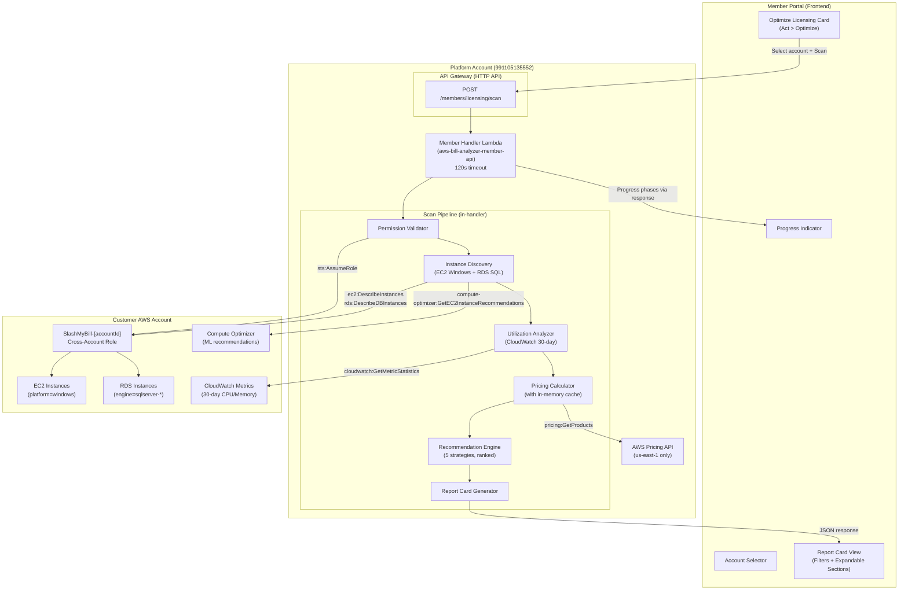

# Design Document: Windows/SQL Server Licensing Optimizer

## Overview

The Windows/SQL Server Licensing Optimizer adds a dedicated **Optimize Licensing** wizard card to the Act > Optimize section of the Member Portal. It discovers all Windows Server and SQL Server workloads (EC2 + RDS) across a connected customer account, analyzes 30-day CPU/memory utilization, retrieves current pricing across multiple licensing models from the AWS Pricing API, and generates a ranked report card of actionable savings strategies.

The feature is implemented as a single backend endpoint (`POST /members/licensing/scan`) that performs the full discovery → analysis → pricing → recommendations pipeline in one request. This matches the existing pattern where `POST /members/servers/analyze` does discovery + analysis + recommendations in a single call. The frontend adds a new wizard card with account selection, progress display, and an interactive report card with filtering.

### Key Design Decisions

1. **Single endpoint design**: One `POST /members/licensing/scan` endpoint handles the entire pipeline. This avoids multi-step state management and keeps the Lambda stateless. The 120s Lambda timeout is sufficient because the scan parallelizes CloudWatch queries and caches pricing lookups.

2. **In-memory pricing cache**: Pricing data is cached in a Python dict for the duration of a single scan invocation. Multiple instances sharing the same instance type (common in production) only trigger one Pricing API call. No persistent cache needed — pricing changes infrequently and scans are user-initiated.

3. **SQL Server detection heuristic**: EC2 instances are classified as running SQL Server by checking (a) instance tags for keywords `sql`, `mssql`, `sqlserver` (case-insensitive), and (b) the AMI description from `ec2:DescribeImages` for SQL Server edition identifiers. This avoids needing SSM/agent access to the instance.

4. **Optimize CPUs as advisory**: The Optimize CPUs recommendation calculates the target vCPU count and savings but does not execute the change. It links to the Resize a Server wizard for execution. This is because `ModifyInstanceAttribute` for CPU options requires a stopped instance — same flow as resize.

5. **Dedicated Host as advisory only**: Dedicated Host pricing is complex (varies by region, instance family, tenancy commitment). The recommendation is advisory with estimated savings rather than an executable action.

6. **Permission pre-validation**: Before starting the scan, the handler validates all required permissions by making lightweight test calls. This provides clear error messages rather than partial scan failures.

## Architecture



## Sequence Diagram

```mermaid
sequenceDiagram
    participant UI as Member Portal
    participant API as API Gateway
    participant MH as Member Handler
    participant STS as STS
    participant EC2 as EC2 API
    participant RDS as RDS API
    participant CW as CloudWatch
    participant CO as Compute Optimizer
    participant PR as Pricing API (us-east-1)

    UI->>API: POST /members/licensing/scan {accountId}
    API->>MH: Route to handle_licensing_scan
    MH->>MH: validate_token + verify_account_ownership

    Note over MH,STS: Phase 1: Permission Validation
    MH->>STS: AssumeRole(SlashMyBill-{accountId}, ExternalId)
    STS-->>MH: Temporary credentials
    MH->>EC2: DescribeInstances (dry-run test)
    MH->>RDS: DescribeDBInstances (dry-run test)
    MH->>CW: ListMetrics (dry-run test)

    Note over MH,EC2: Phase 2: Discovery
    MH->>EC2: DescribeInstances(filter: platform=windows)
    EC2-->>MH: Windows EC2 instances
    MH->>EC2: DescribeImages(AMI IDs from instances)
    EC2-->>MH: AMI descriptions (SQL Server detection)
    MH->>RDS: DescribeDBInstances
    RDS-->>MH: RDS instances (filter engine=sqlserver-*)
    MH->>EC2: DescribeInstanceTypes(all unique types)
    EC2-->>MH: vCPU, memory, valid core counts

    Note over MH,CW: Phase 3: Utilization Analysis
    loop For each instance
        MH->>CW: GetMetricStatistics(CPUUtilization, 30d)
        CW-->>MH: CPU avg, max, p95
        MH->>CW: GetMetricStatistics(mem_used_percent, 30d)
        CW-->>MH: Memory avg, max (or empty)
    end

    Note over MH,CO: Phase 3b: Compute Optimizer
    MH->>CO: GetEC2InstanceRecommendations(instance ARNs)
    CO-->>MH: ML-based recommendations (or not-enrolled error)

    Note over MH,PR: Phase 4: Pricing & Cost Calculation
    loop For each unique instance type
        MH->>PR: GetProducts(Windows, License Included)
        PR-->>MH: LI hourly rate
        MH->>PR: GetProducts(Windows, BYOL)
        PR-->>MH: BYOL hourly rate
        MH->>PR: GetProducts(Windows, SQL Std/Ent)
        PR-->>MH: SQL license rates
    end

    Note over MH: Phase 5: Recommendations + Report Card
    MH->>MH: Generate ranked recommendations per instance
    MH->>MH: Build report card (totals, grouping, summary)
    MH-->>UI: Full report card JSON response


## API Contract

### Endpoint: `POST /members/licensing/scan`

**Request:**
```json
{
  "accountId": "991105135552",
  "accountIds": ["991105135552", "960915223703"]  // optional: multi-account
}
```

**Response:**
```json
{
  "success": true,
  "reportCard": {
    "totalInstances": 5,
    "instancesWithRecommendations": 4,
    "currentMonthlySpend": 2450.00,
    "totalPotentialSavings": 890.00,
    "savingsPercentage": 36.3,
    "byStrategy": [
      {"strategy": "byol", "label": "Bring Your Own License", "savings": 520.00, "instanceCount": 3},
      {"strategy": "optimizeCpus", "label": "Optimize CPUs", "savings": 280.00, "instanceCount": 2},
      {"strategy": "instanceSwap", "label": "Memory-Optimized Swap", "savings": 180.00, "instanceCount": 2},
      {"strategy": "editionDowngrade", "label": "SQL Edition Downgrade", "savings": 350.00, "instanceCount": 1},
      {"strategy": "dedicatedHost", "label": "Dedicated Host", "savings": 400.00, "instanceCount": 3}
    ],
    "instances": [
      {
        "instanceId": "i-0abc123def456",
        "accountId": "991105135552",
        "type": "ec2",
        "instanceType": "r5.2xlarge",
        "platform": "Windows",
        "sqlEdition": "Enterprise",
        "vCpus": 8,
        "memoryGb": 64,
        "cpuAvg": 12.3,
        "cpuMax": 45.2,
        "cpuP95": 38.1,
        "memoryAvg": 72.5,
        "memoryMax": 88.0,
        "cpuEfficiencyRatio": 0.48,
        "currentMonthlyCost": 890.00,
        "pricing": {
          "licenseIncluded": 1.234,
          "byol": 0.678,
          "byolSavingsMonthly": 400.32,
          "byolSavingsPercent": 45.0
        },
        "recommendations": [
          {
            "strategy": "optimizeCpus",
            "title": "Reduce vCPUs from 8 to 4 using Optimize CPUs",
            "description": "Your p95 CPU usage is 38% — 4 vCPUs can sustain this load. Halving vCPUs reduces Windows + SQL licensing costs.",
            "targetVcpus": 4,
            "monthlySavings": 280.00,
            "savingsPercent": 31.5,
            "action": "advisory",
            "deepLink": "act:optimization:resize"
          },
          {
            "strategy": "byol",
            "title": "Switch to BYOL with Software Assurance",
            "description": "Saves 45% on Windows Server and SQL Server licensing. Requires active Software Assurance agreement.",
            "monthlySavings": 400.32,
            "savingsPercent": 45.0,
            "action": "advisory",
            "prerequisite": "Software Assurance required"
          },
          {
            "strategy": "instanceSwap",
            "title": "Switch to r6i.xlarge (4 vCPUs, 32 GB)",
            "description": "Your memory usage peaks at 88% of 64 GB = 56 GB. r6i.xlarge provides 32 GB — check if sufficient. If yes, halves vCPU licensing.",
            "targetInstanceType": "r6i.xlarge",
            "targetVcpus": 4,
            "targetMemoryGb": 32,
            "monthlySavings": 180.00,
            "savingsPercent": 20.2,
            "action": "advisory",
            "deepLink": "act:optimization:resize"
          }
        ]
      }
    ]
  }
}
```

## Data Models

### Instance Discovery Result
```python
@dataclass
class DiscoveredInstance:
    instance_id: str          # i-xxx or db-xxx
    account_id: str
    instance_type: str        # r5.2xlarge or db.r5.2xlarge
    source: str               # "ec2" or "rds"
    platform: str             # "Windows"
    sql_edition: str | None   # "Enterprise", "Standard", or None
    vcpus: int
    memory_gb: float
    valid_core_counts: list[int]  # from DescribeInstanceTypes
    tags: dict
    ami_description: str | None   # for SQL detection on EC2
```

### Utilization Metrics
```python
@dataclass
class UtilizationMetrics:
    cpu_avg: float
    cpu_max: float
    cpu_p95: float
    memory_avg: float | None
    memory_max: float | None
    memory_available: bool    # True if CWAgent data exists
    cpu_efficiency_ratio: float  # p95 / 100 (fraction of vCPUs actually used)
```

### Pricing Data (cached per instance type)
```python
@dataclass
class PricingData:
    instance_type: str
    license_included_hourly: float
    byol_hourly: float
    sql_standard_hourly: float | None
    sql_enterprise_hourly: float | None
    dedicated_host_hourly: float | None
    instances_per_host: int | None
```

## Implementation Details

### SQL Server Detection on EC2

```python
def _detect_sql_server(instance, ami_descriptions):
    """Detect SQL Server presence and edition on an EC2 instance."""
    # Check tags
    tag_values = ' '.join(t.get('Value', '') for t in instance.get('Tags', [])).lower()
    if any(kw in tag_values for kw in ['sql', 'mssql', 'sqlserver']):
        # Try to determine edition from tags
        if 'enterprise' in tag_values:
            return 'Enterprise'
        elif 'standard' in tag_values:
            return 'Standard'
        return 'Unknown'
    
    # Check AMI description
    ami_id = instance.get('ImageId', '')
    ami_desc = ami_descriptions.get(ami_id, '').lower()
    if 'sql server enterprise' in ami_desc or 'sql_server_enterprise' in ami_desc:
        return 'Enterprise'
    elif 'sql server standard' in ami_desc or 'sql_server_standard' in ami_desc:
        return 'Standard'
    elif 'sql server' in ami_desc or 'sql_server' in ami_desc:
        return 'Unknown'
    
    return None  # Not SQL Server
```

### Optimize CPUs Calculation

```python
def _calculate_optimize_cpus(instance, metrics, pricing):
    """Calculate savings from reducing active vCPUs."""
    current_vcpus = instance.vcpus
    valid_cores = instance.valid_core_counts  # e.g., [1, 2, 4, 8] for r5.2xlarge
    
    # Target: minimum cores to sustain p95 CPU load
    # p95 CPU% tells us what fraction of total vCPUs is used at peak
    peak_vcpus_needed = math.ceil(current_vcpus * (metrics.cpu_p95 / 100))
    
    # Find the smallest valid core count >= peak_vcpus_needed
    target_cores = next((c for c in sorted(valid_cores) if c >= peak_vcpus_needed), current_vcpus)
    
    if target_cores >= current_vcpus:
        return None  # No savings possible
    
    # Savings = (current_vcpus - target_cores) / current_vcpus * license_portion
    # License portion is approximately: LI_price - BYOL_price (the delta is the license cost)
    license_cost_per_hour = pricing.license_included_hourly - pricing.byol_hourly
    vcpu_reduction_ratio = (current_vcpus - target_cores) / current_vcpus
    hourly_savings = license_cost_per_hour * vcpu_reduction_ratio
    monthly_savings = hourly_savings * 730  # avg hours/month
    
    return {
        'strategy': 'optimizeCpus',
        'targetVcpus': target_cores,
        'monthlySavings': round(monthly_savings, 2),
        'savingsPercent': round((monthly_savings / (pricing.license_included_hourly * 730)) * 100, 1)
    }
```

### Memory-Optimized Instance Swap

```python
def _find_memory_optimized_alternatives(instance, metrics, pricing_cache):
    """Find instance types with same/more memory but fewer vCPUs."""
    # Target: same memory class but smaller vCPU count
    # R-family instances have highest memory-to-vCPU ratio
    memory_families = {
        'r5': ['r5.large', 'r5.xlarge', 'r5.2xlarge', 'r5.4xlarge'],
        'r6i': ['r6i.large', 'r6i.xlarge', 'r6i.2xlarge', 'r6i.4xlarge'],
        'r7i': ['r7i.large', 'r7i.xlarge', 'r7i.2xlarge', 'r7i.4xlarge'],
    }
    
    current_memory = instance.memory_gb
    current_vcpus = instance.vcpus
    
    alternatives = []
    for family, types in memory_families.items():
        for alt_type in types:
            specs = instance_type_specs.get(alt_type)
            if not specs:
                continue
            # Must have fewer vCPUs AND sufficient memory
            if specs['vcpus'] < current_vcpus and specs['memory_gb'] >= current_memory * 0.8:
                alt_pricing = pricing_cache.get(alt_type)
                if alt_pricing:
                    monthly_savings = (pricing.license_included_hourly - alt_pricing.license_included_hourly) * 730
                    if monthly_savings > 0:
                        alternatives.append({
                            'targetInstanceType': alt_type,
                            'targetVcpus': specs['vcpus'],
                            'targetMemoryGb': specs['memory_gb'],
                            'monthlySavings': round(monthly_savings, 2)
                        })
    
    return sorted(alternatives, key=lambda x: x['monthlySavings'], reverse=True)[:3]
```

### Pricing API Query

```python
def _get_windows_pricing(instance_type, license_model, pre_installed_sw='NA'):
    """Query AWS Pricing API for Windows instance pricing."""
    pricing_client = boto3.client('pricing', region_name=os.environ.get('PRICING_REGION', 'us-east-1'))
    
    filters = [
        {'Type': 'TERM_MATCH', 'Field': 'instanceType', 'Value': instance_type},
        {'Type': 'TERM_MATCH', 'Field': 'operatingSystem', 'Value': 'Windows'},
        {'Type': 'TERM_MATCH', 'Field': 'tenancy', 'Value': 'Shared'},
        {'Type': 'TERM_MATCH', 'Field': 'licenseModel', 'Value': license_model},
        {'Type': 'TERM_MATCH', 'Field': 'preInstalledSw', 'Value': pre_installed_sw},
        {'Type': 'TERM_MATCH', 'Field': 'location', 'Value': 'US East (N. Virginia)'},
        {'Type': 'TERM_MATCH', 'Field': 'capacitystatus', 'Value': 'Used'},
    ]
    
    response = pricing_client.get_products(ServiceCode='AmazonEC2', Filters=filters, MaxResults=1)
    # Parse the price from the response...
```

## Frontend Design

### Wizard Card (Act > Optimize)

New card alongside "Resize a Server" and "Optimize a Cluster":

```
┌─────────────────────────────────┐
│  💰 Optimize Licensing          │
│                                 │
│  Analyze Windows Server and     │
│  SQL Server licensing costs.    │
│  Find savings through vCPU      │
│  optimization, BYOL, and        │
│  edition downgrades.            │
│                                 │
│  [Scan Licensing ▶]             │
└─────────────────────────────────┘
```

### SQL Platform Comparator Card (Act > Optimize)

New card alongside the existing optimization wizards:

```
┌─────────────────────────────────┐
│  🔀 SQL Platform Comparator     │
│                                 │
│  Compare SQL Server costs       │
│  side-by-side: RDS SQL,         │
│  EC2 Windows+SQL, and plain     │
│  Windows (BYOL SQL) for         │
│  equivalent capacity.           │
│                                 │
│  [Compare Platforms ▶]          │
└─────────────────────────────────┘
```

The SQL Platform Comparator wizard:
1. **Discovers** all existing SQL Server workloads (EC2 Windows+SQL and RDS SQL) in the selected account
2. **Compares** each workload side-by-side across deployment options with equivalent capacity:
   - Current configuration (baseline)
   - RDS SQL Server (managed, same vCPU/memory class)
   - EC2 Windows + SQL License Included (self-managed)
   - EC2 Windows only + BYOL SQL (self-managed, bring your own license)
3. **Highlights** the cheapest option per workload with a savings badge
4. **Provides a "Migrate" button** for each cheaper option that generates a step-by-step migration plan

### SQL Platform Comparator — Comparison Table Layout

```
┌─────────────────────────────────────────────────────────────────────────────┐
│  SQL Platform Comparator                                                     │
│  Account: 991105135552                                                       │
├─────────────────────────────────────────────────────────────────────────────┤
│  Workload: i-0abc123 (r5.2xlarge, Windows with SQL Enterprise)               │
│  Current monthly cost: $890/mo                                               │
├──────────────────────┬──────────────────┬──────────────────┬────────────────┤
│  Option              │  Monthly Cost    │  vs Current      │  Action        │
├──────────────────────┼──────────────────┼──────────────────┼────────────────┤
│  ★ EC2 Win+SQL (LI)  │  $890/mo         │  (current)       │  —             │
│  EC2 Win only (BYOL) │  $534/mo         │  -$356/mo (-40%) │  [Migrate ▶]   │
│  RDS SQL Standard    │  $720/mo         │  -$170/mo (-19%) │  [Migrate ▶]   │
│  RDS SQL Enterprise  │  $1,240/mo       │  +$350/mo (+39%) │  More expensive│
└──────────────────────┴──────────────────┴──────────────────┴────────────────┘
```

### Migrate Button — Migration Plan

Clicking "Migrate" for a cheaper option opens a step-by-step migration plan panel:

**EC2 Windows+SQL → EC2 Windows only (BYOL SQL):**
1. Verify active Software Assurance or License Mobility rights
2. Create AMI snapshot of current instance for rollback
3. Launch new EC2 instance from Windows-only AMI (same instance type)
4. Install SQL Server using your BYOL license on the new instance
5. Migrate data (detach/reattach EBS volumes or use SQL backup/restore)
6. Update DNS, Elastic IPs, or load balancer targets
7. Verify application functionality, then terminate original instance

**EC2 Windows+SQL → RDS SQL:**
1. Create RDS SQL Server instance (db.r5.xlarge equivalent)
2. Export database using SQL Server backup or AWS DMS
3. Import to RDS using S3 native backup restore or DMS
4. Update application connection strings to RDS endpoint
5. Test application connectivity and performance
6. Decommission EC2 SQL Server instance after validation

### Wizard Flow

1. **Account Selection** — dropdown of connected accounts (same as Resize wizard)
2. **Scanning** — progress bar with phases: "Discovering instances...", "Analyzing utilization...", "Calculating costs...", "Generating recommendations..."
3. **Report Card** — summary header + filterable instance table

### Report Card Layout

```
┌─────────────────────────────────────────────────────────────┐
│  Licensing Optimization Report                               │
│  Account: 991105135552                                       │
├─────────────────────────────────────────────────────────────┤
│  5 instances analyzed │ 4 with recommendations │ $890/mo savings │
├─────────────────────────────────────────────────────────────┤
│  Savings by Strategy:                                        │
│  ████████████████████ BYOL: $520/mo (3 instances)           │
│  ████████████         Edition Downgrade: $350/mo (1)         │
│  ██████████           Dedicated Host: $400/mo (3)            │
│  ████████             Optimize CPUs: $280/mo (2)             │
│  ██████               Instance Swap: $180/mo (2)             │
├─────────────────────────────────────────────────────────────┤
│  Filter: [All] [EC2 Windows] [EC2 SQL] [RDS SQL]            │
│                                                              │
│  ▼ i-0abc123 │ r5.2xlarge │ Win+SQL Ent │ $890/mo │ -$400  │
│    ├── Optimize CPUs (8→4): saves $280/mo                    │
│    ├── BYOL: saves $400/mo (requires SA)                     │
│    └── Instance Swap (r6i.xlarge): saves $180/mo             │
│                                                              │
│  ▼ db-xyz789 │ db.r5.xlarge │ SQL Ent │ $650/mo │ -$350    │
│    └── Downgrade to SQL Standard: saves $350/mo              │
└─────────────────────────────────────────────────────────────┘
```

## Cross-Account Role Permissions

The `SlashMyBill-{accountId}` role template needs these additional permissions:

```json
{
  "Effect": "Allow",
  "Action": [
    "ec2:DescribeInstances",
    "ec2:DescribeInstanceTypes",
    "ec2:DescribeImages",
    "rds:DescribeDBInstances",
    "cloudwatch:GetMetricStatistics",
    "cloudwatch:ListMetrics",
    "compute-optimizer:GetEC2InstanceRecommendations"
  ],
  "Resource": "*"
}
```

Most of these are already in the template from the Resize wizard. The additions are:
- `ec2:DescribeImages` (for AMI SQL detection)
- `compute-optimizer:GetEC2InstanceRecommendations` (for ML-based rightsizing)

## API Gateway Route

Add to the existing member routes in `viewmybill-stack.yaml` and the CI/CD route creation:

```yaml
MemberLicensingScanRoute:
  Type: AWS::ApiGatewayV2::Route
  Properties:
    ApiId: !Ref ViewMyBillApi
    RouteKey: 'POST /members/licensing/scan'
    Target: !Sub 'integrations/${MemberIntegration}'
```

## Error Handling

| Error | Response | User Message |
|-------|----------|-------------|
| Cross-account role not found | 403 | "Cannot access account. Please verify the cross-account role is deployed." |
| Missing permissions | 403 | "Missing permissions: {list}. Please update the cross-account role template." |
| No Windows/SQL instances found | 200 | Report card with 0 instances and a message: "No Windows or SQL Server instances found in this account." |
| Pricing API unavailable | 200 (partial) | Report card with utilization data but no pricing. Message: "Pricing data temporarily unavailable." |
| Lambda timeout (>110s) | 200 (partial) | Return whatever results are available with a note: "Scan timed out. Showing partial results for {N} of {M} instances." |
| Compute Optimizer not enrolled | 200 | Proceed without CO data. Note: "Enable AWS Compute Optimizer for ML-based recommendations." |

## Performance Budget

| Phase | Target Time | Strategy |
|-------|-------------|----------|
| Permission validation | <2s | Single STS call + lightweight test |
| Discovery (EC2 + RDS) | <5s | Parallel DescribeInstances + DescribeDBInstances |
| AMI description lookup | <3s | Batch DescribeImages for all unique AMI IDs |
| Instance type specs | <2s | Single DescribeInstanceTypes call with all types |
| Utilization (per instance) | <3s | Parallel GetMetricStatistics calls |
| Compute Optimizer | <5s | Single batch call for all instance ARNs |
| Pricing (per unique type) | <5s | Cached — only unique types queried |
| Recommendations + Report | <1s | In-memory computation |
| **Total (10 instances)** | **<30s** | Well within 120s Lambda timeout |

## Files to Modify

| File | Change |
|------|--------|
| `member-handler/lambda_function.py` | Add `handle_licensing_scan()` function (~200 lines) |
| `member-handler/lambda_function.py` | Add `handle_sql_platform_compare()` function — discovers SQL workloads, queries Pricing API for all 4 deployment options, returns comparison matrix per workload |
| `member-handler/lambda_function.py` | Add `handle_sql_migration_plan()` function — generates step-by-step migration plan for a selected source→target platform pair |
| `members/members.js` | Add licensing wizard UI (card + scan + report card) |
| `members/members.js` | Add SQL Platform Comparator wizard UI (card + comparison table + migrate button + migration plan panel) |
| `members/index.html` | Bump `members.js?v=XX` version |
| `.github/workflows/deploy.yml` | Add `POST /members/licensing/scan`, `POST /members/sql/compare`, `POST /members/sql/migration-plan` to API Gateway routes |
| `infrastructure/viewmybill-stack.yaml` | Add route resources (optional — CI/CD handles it) |
| `agent-action/agent-instructions.md` | Reference the new wizards in optimization section |
| `members/help.js` | Add help topics for Optimize Licensing and SQL Platform Comparator |

## SQL Platform Comparator — API Contract

### Endpoint: `POST /members/sql/compare`

**Request:**
```json
{ "accountId": "991105135552" }
```

**Response:**
```json
{
  "success": true,
  "workloads": [
    {
      "instanceId": "i-0abc123",
      "instanceType": "r5.2xlarge",
      "currentPlatform": "Windows with SQL Enterprise",
      "currentMonthlyCost": 890.00,
      "vcpus": 8,
      "memoryGb": 64,
      "options": [
        {
          "label": "EC2 Windows + SQL (License Included)",
          "platform": "ec2_windows_sql_li",
          "monthlyCost": 890.00,
          "isCurrent": true,
          "savingsVsCurrent": 0,
          "savingsPercent": 0
        },
        {
          "label": "EC2 Windows only (BYOL SQL)",
          "platform": "ec2_windows_byol",
          "monthlyCost": 534.00,
          "isCurrent": false,
          "savingsVsCurrent": 356.00,
          "savingsPercent": 40.0,
          "isCheapest": true
        },
        {
          "label": "RDS SQL Server Standard",
          "platform": "rds_sql_standard",
          "equivalentClass": "db.r5.2xlarge",
          "monthlyCost": 720.00,
          "isCurrent": false,
          "savingsVsCurrent": 170.00,
          "savingsPercent": 19.1
        },
        {
          "label": "RDS SQL Server Enterprise",
          "platform": "rds_sql_enterprise",
          "equivalentClass": "db.r5.2xlarge",
          "monthlyCost": 1240.00,
          "isCurrent": false,
          "savingsVsCurrent": -350.00,
          "savingsPercent": -39.3
        }
      ]
    }
  ]
}
```

### Endpoint: `POST /members/sql/migration-plan`

**Request:**
```json
{
  "accountId": "991105135552",
  "instanceId": "i-0abc123",
  "sourcePlatform": "ec2_windows_sql_li",
  "targetPlatform": "ec2_windows_byol"
}
```

**Response:**
```json
{
  "success": true,
  "migrationPlan": {
    "title": "Migrate EC2 Windows+SQL (LI) → EC2 Windows only (BYOL SQL)",
    "estimatedSavings": { "monthly": 356.00, "annual": 4272.00 },
    "complexity": "high",
    "estimatedDuration": "2-4 hours",
    "steps": [
      { "stepNumber": 1, "action": "Verify Software Assurance or License Mobility rights", "type": "prerequisite" },
      { "stepNumber": 2, "action": "Create AMI snapshot of i-0abc123 for rollback", "awsConsoleLink": "https://console.aws.amazon.com/ec2/home#Instances:instanceId=i-0abc123" },
      { "stepNumber": 3, "action": "Launch new EC2 instance from Windows-only AMI (r5.2xlarge)", "awsConsoleLink": "https://console.aws.amazon.com/ec2/home#LaunchInstances:" },
      { "stepNumber": 4, "action": "Install SQL Server using your BYOL license on the new instance" },
      { "stepNumber": 5, "action": "Migrate data: detach EBS data volumes from original, attach to new instance" },
      { "stepNumber": 6, "action": "Update DNS records, Elastic IPs, or load balancer targets to new instance" },
      { "stepNumber": 7, "action": "Verify application functionality on new instance" },
      { "stepNumber": 8, "action": "Terminate original instance i-0abc123 after successful validation" }
    ],
    "risks": [
      "Application downtime during instance replacement",
      "Requires active Software Assurance for BYOL eligibility",
      "Data loss risk if EBS volumes are not properly migrated"
    ]
  }
}
```
